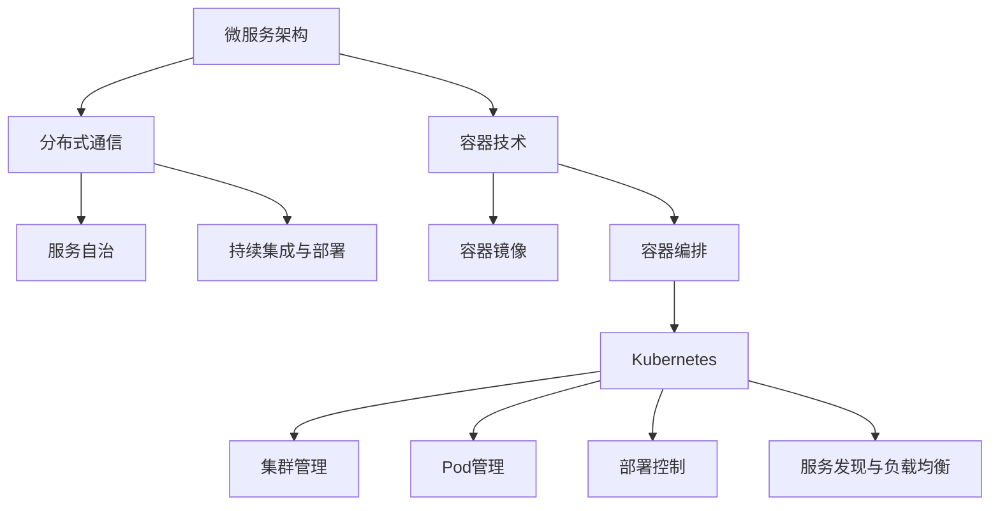

                 

关键词：云原生、微服务、容器、Kubernetes、架构设计、分布式系统、DevOps

> 摘要：本文深入探讨了云原生架构的核心概念、关键技术以及在实际应用中的挑战和未来发展趋势。通过分析微服务架构、容器技术的演进，以及Kubernetes作为容器编排平台的重要性，本文为开发者和管理者提供了全面的技术指导和实践建议。

## 1. 背景介绍

随着云计算的普及和互联网的快速发展，传统的单体应用架构已经无法满足现代业务的需求。单体应用在扩展性、灵活性和可维护性方面存在诸多局限性，而微服务架构作为一种分布式系统设计理念，逐渐成为企业架构转型的首选方案。

微服务架构通过将大型单体应用拆分为一系列小而独立的微服务，每个服务负责处理特定的业务功能。这些服务通过轻量级的通信协议（如RESTful API、gRPC等）相互协作，实现了高可扩展性、高可用性和易维护性。然而，微服务架构也带来了诸多挑战，如服务治理、服务发现、配置管理和服务容错等。

容器技术的出现为微服务架构的实现提供了强有力的支持。Docker等容器化技术将应用及其依赖环境打包为独立的容器镜像，使得应用可以在任何支持容器引擎的宿主机上运行，实现了“一次编写，到处运行”的理念。容器技术不仅提高了应用的部署效率，还降低了部署过程中环境不一致的问题。

Kubernetes作为开源的容器编排平台，已经成为容器生态系统中的关键组件。它通过自动化部署、扩展和管理容器化应用，解决了容器环境中服务发现、负载均衡、资源调度等问题。Kubernetes的诞生标志着云原生架构的正式兴起，为分布式系统设计和运维带来了革命性的变化。

## 2. 核心概念与联系

### 2.1 微服务架构

微服务架构是一种将应用拆分为多个独立、可复用的小服务的设计模式。每个服务都围绕一个特定的业务功能构建，独立部署、运行和扩展。以下是微服务架构的核心概念：

- **服务自治**：每个微服务拥有自己的数据库、配置和部署环境，可以独立开发、测试和部署。

- **分布式通信**：微服务之间通过轻量级的通信协议（如HTTP/HTTPS、gRPC等）进行通信，实现了服务的松耦合。

- **持续集成与部署**：微服务架构支持持续集成和持续部署（CI/CD），提高了开发效率和交付速度。

- **服务发现与注册**：服务发现机制使得微服务能够动态地发现和注册其他服务，提高了系统的可扩展性和灵活性。

### 2.2 容器技术

容器技术将应用及其依赖环境打包为一个独立的运行时环境，实现了应用的轻量化部署和运行。以下是容器技术的核心概念：

- **容器镜像**：容器镜像是一个静态的、可执行的文件系统，包含了应用、运行库和运行时环境。

- **容器引擎**：容器引擎（如Docker）负责创建、启动、管理和停止容器。容器引擎通过解压缩容器镜像并在宿主机上创建容器实例。

- **容器编排**：容器编排工具（如Kubernetes）负责管理容器的生命周期，实现容器的自动化部署、扩展和监控。

### 2.3 Kubernetes

Kubernetes是一个开源的容器编排平台，用于自动化容器化应用的部署、扩展和管理。以下是Kubernetes的核心概念：

- **集群**：Kubernetes集群由多个节点（Node）组成，每个节点运行一个Kubernetes代理（Kubelet）。集群中的Master节点负责管理整个集群的运作。

- **Pod**：Pod是Kubernetes中的最小部署单元，由一个或多个容器组成。Pod在宿主机上运行，并由Kubelet负责管理。

- **部署**（Deployment）：Deployment用于控制Pod的创建和更新。它确保Pod的副本数量、配置和更新策略满足预期。

- **服务**（Service）：Service提供了一种抽象层，使得外部客户端可以访问集群内的Pod。Service通过负载均衡将流量分发到不同的Pod副本。

### 2.4 Mermaid 流程图

以下是微服务架构、容器技术和Kubernetes之间关系的Mermaid流程图：



## 3. 核心算法原理 & 具体操作步骤

### 3.1 算法原理概述

Kubernetes的核心算法主要涉及服务发现、负载均衡和资源调度。以下是对这些算法的简要概述：

- **服务发现**：Kubernetes通过DNS或环境变量等方式，帮助服务实例发现其他服务实例的地址。当客户端需要访问某个服务时，可以直接查询服务名称，获取服务实例的IP地址。

- **负载均衡**：Kubernetes使用轮询、最少连接或自定义策略等方式，将客户端请求分配到不同的服务实例上，实现负载均衡。负载均衡策略可以基于服务配置进行自定义。

- **资源调度**：Kubernetes根据资源需求和可用资源，选择最合适的节点来部署Pod。调度算法考虑了节点资源、Pod依赖、标签匹配等因素。

### 3.2 算法步骤详解

以下是Kubernetes服务发现、负载均衡和资源调度的具体步骤：

#### 服务发现

1. 客户端向Kubernetes API服务器发送请求，查询服务名称。
2. Kubernetes API服务器查询服务注册表，获取服务IP地址列表。
3. Kubernetes DNS服务将服务IP地址列表返回给客户端。

#### 负载均衡

1. 客户端发送请求到Kubernetes集群的入口服务。
2. 入口服务根据配置的负载均衡策略，将请求分配到不同的服务实例。
3. 服务实例处理请求，并将结果返回给客户端。

#### 资源调度

1. Kubernetes调度器接收新的Pod创建请求。
2. 调度器根据节点资源、Pod依赖和标签匹配等因素，选择最合适的节点。
3. Kubernetes代理（Kubelet）在选定节点上创建并运行Pod。

### 3.3 算法优缺点

#### 服务发现

- 优点：服务发现机制使得服务实例可以动态地发现和注册其他服务实例，提高了系统的可扩展性和灵活性。
- 缺点：服务发现依赖于Kubernetes API服务器和DNS服务，若这些服务出现故障，可能导致服务发现失败。

#### 负载均衡

- 优点：负载均衡策略可以根据服务配置进行自定义，实现高效的网络流量分配。
- 缺点：负载均衡策略可能引入额外的网络延迟，需要合理配置。

#### 资源调度

- 优点：资源调度算法可以根据节点资源、Pod依赖等因素，实现高效的资源利用。
- 缺点：调度算法可能需要较长时间才能找到最优解，需要优化调度策略。

### 3.4 算法应用领域

Kubernetes的服务发现、负载均衡和资源调度算法主要应用于以下领域：

- **微服务架构**：微服务架构通过Kubernetes实现服务自治、分布式通信和持续集成与部署。
- **容器化应用**：容器化应用通过Kubernetes实现自动化部署、扩展和管理。
- **云原生应用**：云原生应用通过Kubernetes实现高效利用云资源、提高系统可扩展性和可靠性。

## 4. 数学模型和公式 & 详细讲解 & 举例说明

### 4.1 数学模型构建

在Kubernetes中，资源调度算法可以表示为一个数学模型。假设节点集合为\(N = \{n_1, n_2, ..., n_n\}\)，Pod集合为\(P = \{p_1, p_2, ..., p_m\}\)，其中每个节点的资源需求为\(r_i\)，每个Pod的资源需求为\(s_j\)。资源调度问题可以表示为以下数学模型：

目标函数：
\[ \min \sum_{i=1}^{n} \sum_{j=1}^{m} (r_i - s_j) \]

约束条件：
\[ r_i \geq \sum_{j=1}^{m} s_j \]
\[ s_j \geq 0 \]

其中，目标函数表示尽量减少未利用的资源。约束条件表示节点的总资源需求不超过可用资源。

### 4.2 公式推导过程

假设存在一个最优解\(x_{ij}\)，表示Pod\(p_j\)是否被部署到节点\(n_i\)（\(x_{ij} = 1\)表示被部署，\(x_{ij} = 0\)表示未被部署）。则目标函数可以表示为：

\[ \min \sum_{i=1}^{n} \sum_{j=1}^{m} (r_i - s_j) x_{ij} \]

根据约束条件，可以列出以下方程：

\[ r_i \geq \sum_{j=1}^{m} s_j x_{ij} \]

将约束条件代入目标函数，得到：

\[ \min \sum_{i=1}^{n} \sum_{j=1}^{m} (r_i - s_j) x_{ij} \]

其中，\(x_{ij}\)的取值范围为\{0, 1\}。

### 4.3 案例分析与讲解

假设有一个由3个节点和4个Pod组成的Kubernetes集群，节点和Pod的资源需求如下表所示：

| 节点ID | CPU | 内存 |
| --- | --- | --- |
| n1 | 4 | 8GB |
| n2 | 2 | 4GB |
| n3 | 3 | 6GB |

| PodID | CPU | 内存 |
| --- | --- | --- |
| p1 | 1 | 2GB |
| p2 | 2 | 3GB |
| p3 | 1 | 1GB |
| p4 | 1 | 1GB |

根据数学模型，我们可以列出以下方程：

\[ r_1 \geq \sum_{j=1}^{4} s_j x_{1j} \]
\[ r_2 \geq \sum_{j=1}^{4} s_j x_{2j} \]
\[ r_3 \geq \sum_{j=1}^{4} s_j x_{3j} \]

其中，\(r_1, r_2, r_3\)分别为节点1、节点2、节点3的资源需求（CPU和内存之和），\(s_j\)为Pod\(p_j\)的资源需求（CPU和内存之和），\(x_{ij}\)为Pod\(p_j\)是否被部署到节点\(n_i\)（1表示被部署，0表示未被部署）。

根据目标函数，我们可以列出以下方程：

\[ \min \sum_{i=1}^{3} \sum_{j=1}^{4} (r_i - s_j) x_{ij} \]

假设我们选择将Pod\(p1\)部署到节点\(n1\)，Pod\(p2\)部署到节点\(n2\)，Pod\(p3\)和Pod\(p4\)部署到节点\(n3\)，则\(x_{11} = 1, x_{21} = 0, x_{31} = 1, x_{32} = 1, x_{33} = 1, x_{34} = 1\)。

代入目标函数，得到：

\[ \min (r_1 - s_1 + r_2 - s_2 + r_3 - s_3 - s_4) \]

\[ \min (4 - 1 + 2 - 2 + 3 - 1 - 1) \]

\[ \min (3) \]

最优解为3，表示在满足资源需求的前提下，集群中剩余的资源最少。

## 5. 项目实践：代码实例和详细解释说明

### 5.1 开发环境搭建

在开始实践之前，我们需要搭建一个Kubernetes集群。以下是使用Minikube搭建单节点集群的步骤：

1. 安装Docker：从[官网](https://docs.docker.com/get-docker/)下载并安装Docker。
2. 安装Minikube：在终端中执行以下命令安装Minikube：

```bash
curl -LO https://storage.googleapis.com/minikube/releases/latest/minikube-linux-amd64
chmod +x minikube-linux-amd64
sudo mv minikube-linux-amd64 /usr/local/bin/minikube
```

3. 启动Minikube集群：在终端中执行以下命令启动Minikube集群：

```bash
minikube start --vm-driver=virtualbox
```

### 5.2 源代码详细实现

以下是使用Go语言编写的简单HTTP服务器，该服务器部署在Kubernetes集群上。首先，创建一个名为`main.go`的文件，并添加以下代码：

```go
package main

import (
    "fmt"
    "log"
    "net/http"
)

func handleRequest(w http.ResponseWriter, r *http.Request) {
    fmt.Fprintf(w, "Hello, Kubernetes!")
}

func main() {
    http.HandleFunc("/", handleRequest)

    log.Fatal(http.ListenAndServe(":8080", nil))
}
```

接下来，创建一个名为`Dockerfile`的文件，并添加以下内容：

```Dockerfile
FROM golang:1.18-alpine

WORKDIR /app

COPY . .

RUN go build -o main .

CMD ["./main"]
```

这个Dockerfile基于Golang Alpine镜像构建，将源代码复制到容器内，并编译生成可执行文件。

### 5.3 代码解读与分析

在上面的代码中，我们定义了一个简单的HTTP服务器，使用`net/http`包提供的`http.HandleFunc`函数将处理请求的函数`handleRequest`注册到URL路径`/`上。

在`handleRequest`函数中，我们使用`fmt.Fprintf`函数向HTTP响应中写入“Hello, Kubernetes!”字符串。

`main`函数中，我们使用`http.ListenAndServe`函数启动HTTP服务器，监听8080端口的请求。

### 5.4 运行结果展示

1. 构建Docker镜像：

```bash
docker build -t my-http-server .
```

2. 创建Kubernetes部署配置文件`deployment.yaml`：

```yaml
apiVersion: apps/v1
kind: Deployment
metadata:
  name: my-http-server
spec:
  selector:
    matchLabels:
      app: my-http-server
  template:
    metadata:
      labels:
        app: my-http-server
    spec:
      containers:
      - name: my-http-server
        image: my-http-server:latest
        ports:
        - containerPort: 8080
```

3. 应用部署配置文件：

```bash
kubectl apply -f deployment.yaml
```

4. 查看部署状态：

```bash
kubectl get pods
```

当部署成功后，我们可以在集群中访问部署的HTTP服务器：

```bash
minikube service my-http-server --url
```

在浏览器中输入返回的URL，将显示“Hello, Kubernetes!”。

## 6. 实际应用场景

### 6.1 云原生应用开发

云原生架构已经成为现代应用开发的主流趋势。企业可以通过微服务架构和容器技术，快速构建、部署和扩展具有高可用性和可扩展性的应用。云原生应用开发可以降低开发和运维成本，提高开发效率。

### 6.2 跨平台部署与运维

Kubernetes作为容器编排平台，支持跨平台部署和运维。企业可以在不同的云平台和物理服务器上部署Kubernetes集群，实现应用的灵活部署和资源优化。Kubernetes的自动化部署和管理功能可以降低运维成本，提高系统稳定性。

### 6.3 大数据与人工智能应用

云原生架构在大数据与人工智能领域具有广泛应用。通过容器化技术，大数据处理和人工智能模型可以快速部署和扩展，提高数据处理效率和模型训练速度。Kubernetes可以自动化管理大规模的容器化应用，实现资源的高效利用。

## 7. 工具和资源推荐

### 7.1 学习资源推荐

- Kubernetes官方文档：[https://kubernetes.io/zh/docs/](https://kubernetes.io/zh/docs/)
- 《Kubernetes实战》一书：[https://www.oreilly.com/library/view/kubernetes-up-and-running/9781449372263/](https://www.oreilly.com/library/view/kubernetes-up-and-running/9781449372263/)
- Kubernetes社区会议和讲座：[https://kubernetes.io/docs/tutorials/](https://kubernetes.io/docs/tutorials/)

### 7.2 开发工具推荐

- Visual Studio Code：一款功能强大的代码编辑器，支持Kubernetes插件。
- Helm：一款Kubernetes的包管理工具，用于部署和管理Kubernetes应用程序。
- Minikube：一个单节点Kubernetes集群的本地运行环境。

### 7.3 相关论文推荐

- "Container Scheduling: Algorithms and Performance Evaluation"：一篇关于容器调度算法的论文，介绍了各种调度算法的性能评估。
- "Kubernetes: A System for Automating Deployment, Scaling, and Operations of Distributed Systems"：一篇关于Kubernetes系统设计的论文，详细介绍了Kubernetes的核心概念和架构。

## 8. 总结：未来发展趋势与挑战

### 8.1 研究成果总结

云原生架构已经成为现代应用开发和运维的核心技术。微服务架构、容器技术和Kubernetes等关键组件为分布式系统设计和运维提供了强大的支持。通过云原生架构，企业可以快速构建、部署和扩展具有高可用性和可扩展性的应用，提高业务竞争力。

### 8.2 未来发展趋势

- **服务网格**：服务网格作为一种新兴的架构模式，为微服务架构提供了更高效、更安全的通信方式。未来，服务网格将与Kubernetes等容器编排平台深度融合。
- **AI与Kubernetes**：人工智能与Kubernetes的结合，将推动容器编排技术向智能化、自动化方向发展。通过机器学习算法优化资源调度、服务发现和负载均衡，实现更高效的管理。
- **多云与混合云**：随着多云和混合云应用的普及，Kubernetes将成为跨云平台部署和管理的关键技术。未来，Kubernetes将支持更多云平台的集成，实现应用的无缝迁移和资源调度。

### 8.3 面临的挑战

- **安全性**：随着容器化和微服务架构的普及，安全性问题日益突出。如何确保容器化和微服务应用的安全，防止恶意攻击和内部威胁，是一个亟待解决的挑战。
- **复杂性**：云原生架构带来了更高的技术复杂度。如何简化云原生应用的开发、部署和运维，降低学习成本，是一个重要课题。
- **标准化**：虽然Kubernetes已经成为容器编排的事实标准，但不同云平台和厂商之间的差异仍然存在。如何实现云原生应用的跨平台兼容性，推动标准化进程，是未来发展的关键。

### 8.4 研究展望

未来，云原生架构将继续发展，成为企业数字化转型的核心驱动力。在服务网格、人工智能、多云与混合云等领域，将涌现出更多创新技术和应用。同时，如何降低云原生架构的复杂性，提高安全性，推动标准化进程，将是研究的重点方向。通过不断探索和实践，云原生架构将为企业和开发者带来更多的机遇和挑战。

## 9. 附录：常见问题与解答

### 9.1 问题1：什么是微服务架构？

微服务架构是一种将大型单体应用拆分为一系列小而独立的微服务的设计模式。每个微服务负责处理特定的业务功能，独立部署、运行和扩展。微服务架构具有高可扩展性、高可用性和易维护性。

### 9.2 问题2：什么是容器技术？

容器技术是一种轻量级虚拟化技术，通过将应用及其依赖环境打包为一个独立的运行时环境，实现了应用的轻量化部署和运行。容器技术提高了应用的部署效率，降低了部署过程中环境不一致的问题。

### 9.3 问题3：什么是Kubernetes？

Kubernetes是一个开源的容器编排平台，用于自动化容器化应用的部署、扩展和管理。Kubernetes提供了服务发现、负载均衡、资源调度等功能，实现了分布式系统的高效管理和运维。

### 9.4 问题4：什么是云原生架构？

云原生架构是一种基于容器化、微服务、服务网格等技术的现代化应用开发和部署模型。云原生架构具有高可扩展性、高可用性和易维护性，适用于云计算和分布式系统的场景。

### 9.5 问题5：什么是服务网格？

服务网格是一种新型的架构模式，为微服务架构提供了更高效、更安全的通信方式。服务网格通过独立的控制平面，实现了服务间的动态连接、流量管理和安全性保障。

### 9.6 问题6：什么是AI与Kubernetes的结合？

AI与Kubernetes的结合，主要表现在利用机器学习算法优化Kubernetes的调度、服务发现和负载均衡。通过智能调度策略，实现资源利用的最大化和应用性能的优化。

### 9.7 问题7：什么是多云与混合云？

多云与混合云是指企业应用跨越多个云平台和本地数据中心运行，实现应用的无缝迁移和资源调度。多云与混合云可以提高企业的灵活性和可扩展性，降低对单一云平台的依赖。

### 9.8 问题8：什么是跨平台兼容性？

跨平台兼容性是指云原生应用在不同云平台和操作系统上运行的一致性和可移植性。通过实现跨平台兼容性，企业可以降低迁移成本，提高应用的灵活性和可扩展性。

