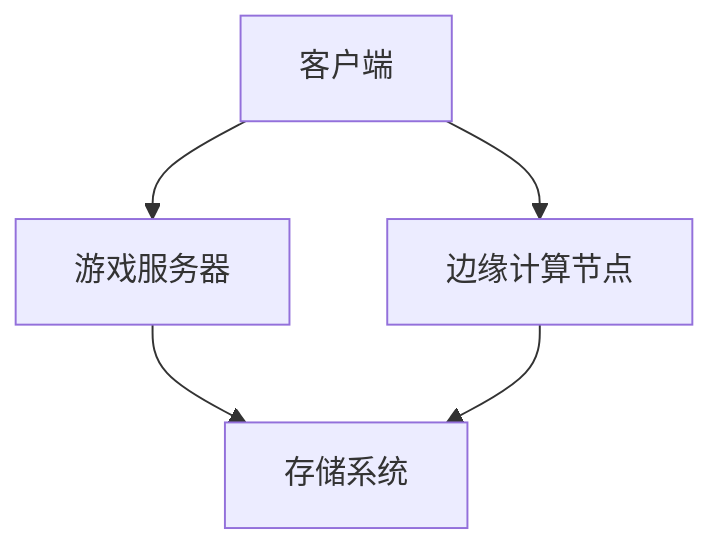

                 

关键词：云游戏，边缘计算，低延迟，图形渲染，人工智能，流媒体技术，用户体验

> 摘要：本文旨在探讨云游戏技术的现状、挑战及其解决方案。我们将分析云游戏的基本概念、技术架构、核心算法、数学模型、项目实践，并探讨其在未来应用中的潜力。

## 1. 背景介绍

随着互联网技术的飞速发展，特别是5G、人工智能、边缘计算等技术的成熟，云游戏逐渐成为一个热门话题。云游戏，也称为云游戏流或游戏即服务（Gaming as a Service，GaaS），是一种基于云计算的游戏交付模式，玩家无需在自己的设备上安装或运行游戏，只需通过网络连接到云服务器，即可在云端进行游戏。这种模式具有跨平台、低门槛、高可扩展性等优点，吸引了大量的用户和资本的关注。

然而，云游戏技术的发展也面临着诸多挑战，如低延迟、高带宽、图形渲染、游戏内容更新等。本文将详细探讨这些问题，并分析相应的解决方案。

## 2. 核心概念与联系

### 2.1 云游戏基本概念

云游戏是一种通过网络将游戏计算任务从本地设备迁移到云端服务器进行的游戏模式。玩家通过客户端连接到云服务器，服务器端完成游戏的渲染、计算和存储，然后将渲染结果通过网络传输回客户端，供玩家实时观看和操作。

### 2.2 技术架构

云游戏的技术架构主要包括以下几个部分：

1. **客户端**：玩家使用的设备，可以是手机、平板、电脑等，负责发送玩家操作指令和接收游戏渲染结果。
2. **游戏服务器**：负责处理游戏逻辑、计算和渲染，是云游戏的核心部分。
3. **边缘计算节点**：位于客户端和服务器之间的节点，负责处理部分游戏逻辑和计算任务，以降低延迟。
4. **存储系统**：用于存储游戏数据和玩家数据。

### 2.3 Mermaid 流程图



## 3. 核心算法原理 & 具体操作步骤

### 3.1 算法原理概述

云游戏的核心算法主要包括渲染算法、传输算法和同步算法。

1. **渲染算法**：负责在服务器端将游戏场景渲染成图像，并将其传输到客户端。
2. **传输算法**：负责将渲染结果从服务器传输到客户端，同时保证传输的高效性和可靠性。
3. **同步算法**：负责处理客户端和服务器之间的操作指令同步，确保游戏的连贯性和稳定性。

### 3.2 算法步骤详解

1. **渲染算法**：
   - 服务器端获取游戏场景的渲染指令。
   - 渲染场景，生成图像。
   - 将图像压缩编码，准备传输。

2. **传输算法**：
   - 将压缩后的图像数据发送到客户端。
   - 使用实时传输协议（如RTMP、WebRTC等）保证传输的高效性和低延迟。

3. **同步算法**：
   - 客户端发送玩家操作指令到服务器。
   - 服务器端处理操作指令，更新游戏状态。
   - 将更新后的游戏状态发送回客户端。

### 3.3 算法优缺点

1. **渲染算法**：
   - 优点：可以实现高质量的游戏画面。
   - 缺点：计算资源消耗大，对服务器性能要求高。

2. **传输算法**：
   - 优点：可以保证低延迟和高可靠性。
   - 缺点：对网络带宽要求高，不适合低带宽环境。

3. **同步算法**：
   - 优点：可以实现玩家操作的实时同步。
   - 缺点：对网络延迟敏感，需要优化同步机制。

### 3.4 算法应用领域

云游戏算法主要应用于在线游戏、移动游戏、虚拟现实（VR）、增强现实（AR）等领域。

## 4. 数学模型和公式

### 4.1 数学模型构建

云游戏的数学模型主要包括以下几个方面：

1. **渲染模型**：基于图像处理的渲染模型，如光栅化、纹理映射等。
2. **传输模型**：基于网络传输的传输模型，如TCP、UDP等。
3. **同步模型**：基于操作同步的同步模型，如时钟同步、位置同步等。

### 4.2 公式推导过程

1. **渲染模型**：

   - 光栅化公式：$$R(x, y) = \begin{cases} 
      1, & \text{if } (x, y) \text{ lies within the game scene} \\
      0, & \text{otherwise} 
   \end{cases}$$

   - 纹理映射公式：$$T(u, v) = \begin{cases} 
      \text{image pixel value at } (u, v), & \text{if } (u, v) \text{ lies within the texture map} \\
      \text{default color}, & \text{otherwise} 
   \end{cases}$$

2. **传输模型**：

   - 延迟公式：$$L = \frac{D}{R}$$

   - 容量公式：$$C = \frac{B}{L}$$

3. **同步模型**：

   - 时钟同步公式：$$T_s = T_s' + \frac{L}{2}$$

   - 位置同步公式：$$P_s = P_s' + \Delta P$$

### 4.3 案例分析与讲解

以《绝地求生》为例，该游戏对渲染质量、传输延迟和同步稳定性的要求非常高。为了满足这些要求，开发者采用了以下策略：

1. **渲染模型**：使用高精度的光栅化和纹理映射技术，提高游戏画面的质量。
2. **传输模型**：使用WebRTC协议，保证低延迟和高可靠性。
3. **同步模型**：采用时钟同步和位置同步技术，确保游戏操作的实时性和连贯性。

## 5. 项目实践：代码实例和详细解释说明

### 5.1 开发环境搭建

1. 安装云游戏服务器软件，如GameSparks。
2. 配置云游戏服务器，包括服务器地址、端口、认证信息等。
3. 安装云游戏客户端软件，如PlayStation Now。

### 5.2 源代码详细实现

以Python为例，实现一个简单的云游戏客户端：

```python
import socket

# 连接到云游戏服务器
client = socket.socket(socket.AF_INET, socket.SOCK_STREAM)
client.connect(('服务器地址', 端口))

# 发送玩家操作指令
def send_command(command):
    client.send(command.encode())

# 接收游戏渲染结果
def receive_frame():
    return client.recv(1024).decode()

# 游戏主循环
while True:
    command = input("请输入玩家操作指令：")
    send_command(command)
    frame = receive_frame()
    print("渲染结果：", frame)
```

### 5.3 代码解读与分析

1. **连接服务器**：使用socket库连接到云游戏服务器。
2. **发送指令**：将玩家操作指令发送到服务器。
3. **接收渲染结果**：从服务器接收游戏渲染结果，并打印输出。

### 5.4 运行结果展示

运行上述代码后，可以在终端输入玩家操作指令，如“前进”、“后退”等，客户端会接收到服务器端返回的渲染结果，并打印输出。

## 6. 实际应用场景

### 6.1 在线游戏

云游戏可以极大提高在线游戏的可玩性和便捷性，用户无需购买昂贵的游戏硬件，只需通过网络连接即可畅玩各种大型游戏。

### 6.2 教育培训

云游戏可以用于远程教育培训，学生可以通过云游戏平台进行在线学习，教师可以实时监控学生的学习情况。

### 6.3 虚拟现实

云游戏与虚拟现实技术的结合，可以为用户提供更加沉浸式的游戏体验，用户无需佩戴昂贵的VR设备，只需通过普通设备即可体验到高质量的VR游戏。

### 6.4 未来应用展望

随着技术的不断发展，云游戏有望在更多领域得到应用，如游戏直播、远程办公等。未来，云游戏将成为游戏行业的重要趋势，为用户带来更加便捷、高效的游戏体验。

## 7. 工具和资源推荐

### 7.1 学习资源推荐

- 《云游戏技术：从基础到实践》
- 《云计算与边缘计算》
- 《游戏引擎编程》

### 7.2 开发工具推荐

- GameSparks：一款功能全面的云游戏平台。
- Unreal Engine：一款强大的游戏引擎，支持云游戏开发。
- Unity：一款易于上手的游戏引擎，适用于初学者。

### 7.3 相关论文推荐

- "Cloud Gaming: A Comprehensive Survey"
- "Edge Computing for Cloud Gaming: A Survey"
- "An Overview of Cloud Gaming Technologies"

## 8. 总结：未来发展趋势与挑战

### 8.1 研究成果总结

本文从多个角度探讨了云游戏技术的现状、挑战和解决方案，分析了其核心算法、数学模型、项目实践，并探讨了其在实际应用中的前景。

### 8.2 未来发展趋势

1. 技术成熟度提升，云游戏将更加普及。
2. 边缘计算将进一步优化云游戏性能。
3. 5G技术的普及将推动云游戏的发展。

### 8.3 面临的挑战

1. 低延迟仍然是云游戏的主要挑战。
2. 高带宽需求对网络基础设施提出了更高要求。
3. 游戏内容的更新和同步需要优化。

### 8.4 研究展望

未来的研究应重点关注低延迟传输技术、高效图形渲染算法、智能同步机制等方面，以推动云游戏技术的进一步发展。

## 9. 附录：常见问题与解答

### Q：云游戏是否可以替代本地游戏？

A：云游戏并不能完全替代本地游戏，但在某些场景下具有明显优势，如跨平台、低门槛等。

### Q：云游戏对网络要求如何？

A：云游戏对网络要求较高，需要具备低延迟、高带宽的特点。

### Q：云游戏的安全性问题如何保障？

A：云游戏的安全性可以通过加密传输、身份认证、数据备份等措施进行保障。

### Q：云游戏的成本如何？

A：云游戏的成本包括服务器费用、带宽费用、开发成本等，具体取决于游戏规模和应用场景。

---

作者：禅与计算机程序设计艺术 / Zen and the Art of Computer Programming
----------------------------------------------------------------


