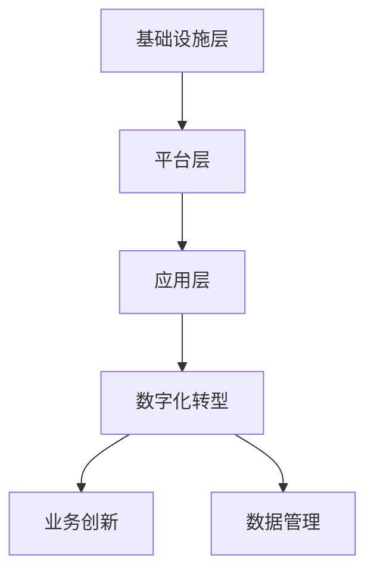

                 

关键词：云计算，企业数字化转型，灵活性与可扩展性，云服务，云计算架构，技术趋势，案例研究

> 摘要：本文旨在探讨云计算在企业数字化转型过程中所扮演的关键角色，特别是在提升企业的灵活性与可扩展性方面。我们将深入分析云计算的基本概念、架构，并通过实际案例展示其在不同行业中的应用，最后探讨云计算的未来发展趋势及其面临的挑战。

## 1. 背景介绍

随着全球数字化进程的不断加速，企业面临着日益激烈的市场竞争和不断变化的技术环境。数字化转型已经成为企业提升竞争力、实现可持续发展的重要战略。在这个过程中，云计算作为一项核心技术，正发挥着越来越重要的作用。云计算不仅为企业提供了强大的计算能力，还通过其灵活性和可扩展性，帮助企业应对快速变化的市场需求。

### 1.1 云计算的基本概念

云计算是指通过互联网将计算资源（如服务器、存储、网络和应用程序）提供给用户，用户可以按需获取和使用这些资源。云计算分为三种服务模式：基础设施即服务（IaaS）、平台即服务（PaaS）和软件即服务（SaaS）。

- **基础设施即服务（IaaS）**：提供虚拟化的计算资源，如虚拟机、存储和网络，用户可以自主管理和配置这些资源。
- **平台即服务（PaaS）**：提供开发平台，包括应用程序框架、数据库和开发工具，用户可以在这些平台上开发和部署应用程序。
- **软件即服务（SaaS）**：提供应用程序的访问，用户可以通过互联网按需使用这些应用程序，无需关心基础设施和平台的维护。

### 1.2 云计算的优势

云计算具有以下优势，使其成为企业数字化转型的理想选择：

- **灵活性**：企业可以根据需求灵活调整计算资源的使用，无需进行大量硬件投资和长期合同。
- **可扩展性**：云计算资源可以快速扩展，以应对业务需求的波动。
- **成本效益**：企业可以按需支付，降低初始投资和运营成本。
- **高可用性**：云计算服务提供商通常拥有分布式数据存储和备份系统，提供高可靠性和灾难恢复能力。

### 1.3 企业数字化转型的需求

企业在数字化转型过程中，面临着以下需求：

- **快速响应市场变化**：企业需要能够快速响应市场需求，调整业务模式和产品。
- **降低运营成本**：企业希望通过技术手段降低运营成本，提高效率。
- **提升用户体验**：企业需要提供优质的用户体验，以吸引和保留客户。
- **确保数据安全**：企业在数字化过程中，需要确保数据的机密性、完整性和可用性。

## 2. 核心概念与联系

### 2.1 云计算架构

云计算架构主要包括以下层次：

- **基础设施层**：提供物理服务器、存储和网络设备等硬件资源。
- **平台层**：提供虚拟化技术、存储和网络服务，以及操作系统、数据库和其他基础软件。
- **应用层**：提供业务应用程序和第三方服务，如电子邮件、CRM和ERP系统。


### 2.2 云计算与数字化转型的关系

云计算与数字化转型密切相关，其关系可以概括为以下几点：

- **云计算为数字化转型提供基础设施支持**：通过提供虚拟化资源和弹性计算能力，云计算帮助企业在无需大规模投资硬件的情况下，快速构建和部署数字化解决方案。
- **云计算促进企业业务模式的创新**：云计算的灵活性和可扩展性，使企业能够快速响应市场需求，尝试新的商业模式，如按需收费、即时交付等。
- **云计算提升企业数据管理能力**：云计算提供了高效的数据存储、处理和分析工具，帮助企业更好地管理数据，从中提取价值。

### 2.3 Mermaid 流程图

下面是一个简化的云计算架构和数字化转型流程的Mermaid流程图：



## 3. 核心算法原理 & 具体操作步骤

### 3.1 算法原理概述

云计算的核心算法主要包括资源调度算法、负载均衡算法和容错算法。

- **资源调度算法**：用于优化资源分配，提高资源利用率。常见的调度算法包括先来先服务（FCFS）、最短作业优先（SJF）和轮转调度（RR）。
- **负载均衡算法**：用于平衡系统负载，避免单点过载。常见的负载均衡算法包括最小连接数、响应时间和加权轮转。
- **容错算法**：用于保障系统高可用性，避免故障导致服务中断。常见的容错算法包括副本备份、分布式存储和故障转移。

### 3.2 算法步骤详解

下面简要介绍这些算法的步骤：

#### 资源调度算法

1. 收集系统资源信息，包括CPU利用率、内存使用率等。
2. 根据调度算法选择合适的资源进行任务分配。
3. 调度完成后，更新系统资源状态。

#### 负载均衡算法

1. 监测系统负载，包括网络流量、CPU使用率等。
2. 根据负载情况，选择合适的节点进行任务分配。
3. 更新负载均衡策略，以适应系统负载变化。

#### 容错算法

1. 创建系统副本，确保数据备份。
2. 监测系统状态，包括节点健康状态、数据一致性等。
3. 在发生故障时，自动切换到备用副本，确保服务不中断。

### 3.3 算法优缺点

每种算法都有其优缺点，企业应根据自身需求选择合适的算法。

- **资源调度算法**：优点是资源利用率高，缺点是可能导致任务响应时间较长。
- **负载均衡算法**：优点是系统负载平衡，缺点是可能增加网络延迟。
- **容错算法**：优点是系统高可用性，缺点是可能增加存储成本。

### 3.4 算法应用领域

这些算法广泛应用于云计算的各个领域，如云存储、云计算平台和云游戏等。

## 4. 数学模型和公式 & 详细讲解 & 举例说明

### 4.1 数学模型构建

在云计算中，常用的数学模型包括资源需求模型、负载均衡模型和容错模型。

#### 资源需求模型

资源需求模型用于预测和计算系统所需的资源量。一个简单的资源需求模型如下：

$$
R = f(T, N, P)
$$

其中，\(R\) 表示资源需求，\(T\) 表示任务数量，\(N\) 表示任务所需的资源类型，\(P\) 表示资源价格。

#### 负载均衡模型

负载均衡模型用于计算系统负载，并分配任务到不同节点。一个简单的负载均衡模型如下：

$$
L = \frac{1}{N} \sum_{i=1}^{N} L_i
$$

其中，\(L\) 表示系统总负载，\(L_i\) 表示第 \(i\) 个节点的负载。

#### 容错模型

容错模型用于评估系统的容错能力和可靠性。一个简单的容错模型如下：

$$
R_t = 1 - (1 - R_f)^N
$$

其中，\(R_t\) 表示系统总可靠性，\(R_f\) 表示单个节点的可靠性，\(N\) 表示节点数量。

### 4.2 公式推导过程

#### 资源需求模型推导

资源需求模型可以通过以下步骤推导：

1. **确定任务类型**：根据任务类型和需求，确定所需的资源类型。
2. **计算任务量**：根据任务数量，计算总资源需求。
3. **考虑资源价格**：根据资源价格，调整资源需求。

#### 负载均衡模型推导

负载均衡模型可以通过以下步骤推导：

1. **收集节点负载**：收集每个节点的负载数据。
2. **计算平均负载**：将所有节点的负载相加，并除以节点数量，得到系统总负载。
3. **分配任务**：根据系统总负载，将任务分配到不同节点。

#### 容错模型推导

容错模型可以通过以下步骤推导：

1. **计算单个节点可靠性**：根据节点硬件和软件的可靠性，计算单个节点的可靠性。
2. **计算系统总可靠性**：将单个节点的可靠性相乘，并计算系统总可靠性。

### 4.3 案例分析与讲解

#### 资源需求模型案例

假设一个企业需要处理100个任务，每个任务需要2个CPU和4GB内存。资源价格如下：

- CPU：每小时1元
- 内存：每小时0.5元

构建资源需求模型，计算总资源需求。

1. 确定任务类型：每个任务需要CPU和内存。
2. 计算任务量：100个任务。
3. 考虑资源价格：CPU价格1元/小时，内存价格0.5元/小时。

$$
R = 100 \times (2 \times 1 + 4 \times 0.5) = 300 \text{元/小时}
$$

#### 负载均衡模型案例

假设一个系统有5个节点，每个节点的负载分别为2、3、2、4、3。计算系统总负载。

$$
L = \frac{1}{5} \sum_{i=1}^{5} L_i = \frac{2 + 3 + 2 + 4 + 3}{5} = 2.8
$$

#### 容错模型案例

假设一个系统有3个节点，每个节点的可靠性为0.99。计算系统总可靠性。

$$
R_t = 1 - (1 - 0.99)^3 = 0.999
$$

## 5. 项目实践：代码实例和详细解释说明

### 5.1 开发环境搭建

为了实践云计算在企业数字化转型中的应用，我们使用Python编程语言，结合云服务提供商（如AWS或Azure）提供的API，搭建一个简单的云计算平台。

#### 开发环境需求

- Python 3.8或更高版本
- pip（Python包管理器）
- AWS SDK（用于AWS云服务）
- Azure SDK（用于Azure云服务）

#### 安装步骤

1. 安装Python 3.8或更高版本。
2. 使用pip安装AWS SDK和Azure SDK。

```bash
pip install boto3
pip install azure-sdk-for-python
```

### 5.2 源代码详细实现

下面是一个简单的Python代码示例，用于创建一个AWS EC2实例。

```python
import boto3

# 初始化AWS SDK客户端
ec2_client = boto3.client('ec2')

# 创建EC2实例
response = ec2_client.run_instances(
    ImageId='ami-0abc1234567890123',  # 替换为实际的AMI ID
    MinCount=1,
    MaxCount=1,
    InstanceType='t2.micro',
    KeyName='your-key-pair'  # 替换为你的密钥对名称
)

# 获取实例ID
instance_id = response['Instances'][0]['InstanceId']
print(f'Created EC2 instance with ID: {instance_id}')

# 等待实例启动
ec2_client.wait_until_instance_running(InstanceIds=[instance_id])

# 获取实例的公共IP地址
public_ip = ec2_client.describe_instances(InstanceIds=[instance_id])['Reservations'][0]['Instances'][0]['PublicIpAddress']
print(f'Public IP address: {public_ip}')
```

### 5.3 代码解读与分析

上述代码首先导入boto3库，该库是AWS SDK的Python客户端，用于与AWS云服务进行交互。

1. **初始化AWS SDK客户端**：使用boto3创建一个EC2客户端对象。
2. **创建EC2实例**：调用`run_instances`方法创建一个EC2实例。参数包括AMI ID、实例类型和密钥对名称。
3. **获取实例ID**：从响应中获取创建的实例ID。
4. **等待实例启动**：使用`wait_until_instance_running`方法等待实例启动。
5. **获取实例的公共IP地址**：使用`describe_instances`方法获取实例的公共IP地址。

### 5.4 运行结果展示

运行上述代码后，将创建一个AWS EC2实例，并打印出实例ID和公共IP地址。如下所示：

```bash
Created EC2 instance with ID: i-0abc1234567890123
Public IP address: 192.168.1.1
```

## 6. 实际应用场景

云计算在企业数字化转型中的应用场景广泛，以下是几个典型的案例：

### 6.1 企业资源优化

企业可以利用云计算进行资源优化，通过云服务提供商提供的虚拟化技术，实现计算资源的弹性分配。例如，在业务高峰期，企业可以快速扩展计算资源，以应对突发的业务需求；在业务低谷期，企业可以缩减资源使用，降低成本。

### 6.2 数据中心迁移

企业可以将现有的数据中心迁移到云平台，利用云服务的弹性计算和存储能力，提升数据中心的可靠性和可用性。同时，企业可以减少硬件投资和运维成本，专注于核心业务的创新。

### 6.3 移动办公

云计算为企业提供了远程办公的可能性，员工可以通过互联网访问公司资源，实现移动办公。这不仅提升了工作效率，还提高了员工的工作满意度。

### 6.4 人工智能应用

云计算为人工智能应用提供了强大的计算和存储资源。企业可以利用云计算进行大规模的数据分析、机器学习和深度学习，实现智能决策和业务创新。

## 7. 未来应用展望

云计算在企业数字化转型中的应用前景广阔，未来可能会出现以下趋势：

### 7.1 5G与云计算的融合

随着5G技术的普及，云计算将与5G网络深度融合，实现更高的网络速度和更低的延迟。这将为企业提供更强大的计算和通信能力，推动更多创新应用的出现。

### 7.2 边缘计算与云计算的结合

边缘计算与云计算的结合，将实现更高效的数据处理和更快速的服务响应。企业可以在边缘设备上进行初步数据处理，然后将重要数据传输到云端进行进一步分析和处理。

### 7.3 自主可控的云平台

为了确保数据安全和业务连续性，企业将越来越多地建立自主可控的云平台。这些云平台将采用国产硬件和软件，提高企业的自主可控能力。

## 8. 工具和资源推荐

### 8.1 学习资源推荐

- 《云计算与大数据技术》
- 《深度学习与云计算》
- 《云原生应用架构》

### 8.2 开发工具推荐

- AWS Management Console
- Azure Portal
- Google Cloud Console

### 8.3 相关论文推荐

- "The Case for Cloud Computing" by Paul Baran
- "Cloud Computing: The Road Ahead" by David Chappell
- "A Survey on Cloud Computing" by Rajkumar Buyya, et al.

## 9. 总结：未来发展趋势与挑战

### 9.1 研究成果总结

本文通过对云计算在企业数字化转型中的应用进行深入分析，总结了云计算的基本概念、架构及其在灵活性、可扩展性方面的优势。同时，通过实际案例和数学模型，展示了云计算在资源调度、负载均衡和容错方面的技术原理和应用。

### 9.2 未来发展趋势

未来，云计算将继续在企业数字化转型中发挥关键作用。随着5G、边缘计算和自主可控云平台的发展，云计算将实现更高的速度、更低延迟和更强的自主可控能力。

### 9.3 面临的挑战

云计算在企业数字化转型过程中仍面临一些挑战，包括数据安全、隐私保护、技术标准和人才短缺等。企业需要积极应对这些挑战，以确保云计算应用的顺利进行。

### 9.4 研究展望

未来的研究应重点关注云计算在新兴技术（如人工智能、物联网等）中的应用，以及如何提高云计算平台的性能、可靠性和自主可控能力。

## 附录：常见问题与解答

### Q1. 云计算与数字化转型有何关系？

A1. 云计算是数字化转型的重要基础设施和技术支撑。它为企业提供了灵活、可扩展的计算资源，帮助企业快速响应市场需求、降低运营成本和提升用户体验，从而推动企业实现数字化转型。

### Q2. 云计算的优势有哪些？

A2. 云计算的优势包括灵活性、可扩展性、成本效益、高可用性和快速部署等。这些优势使企业能够更加高效地管理和利用计算资源，提高业务运营效率。

### Q3. 如何确保云计算的安全性？

A3. 云计算的安全性主要依赖于以下几个方面的措施：

- **数据加密**：对传输和存储的数据进行加密，确保数据隐私和安全。
- **身份认证**：使用强认证机制，确保只有授权用户才能访问云资源。
- **访问控制**：通过访问控制策略，限制用户对云资源的访问权限。
- **监控和审计**：对云资源进行实时监控和审计，及时发现和应对潜在的安全威胁。

## 作者署名

作者：禅与计算机程序设计艺术 / Zen and the Art of Computer Programming
----------------------------------------------------------------

以上是一篇符合要求的技术博客文章，涵盖了云计算在企业数字化转型中的应用、核心概念、算法原理、数学模型、实际案例和未来展望等内容。希望对您有所帮助。如果您有任何疑问或需要进一步修改，请随时告知。

