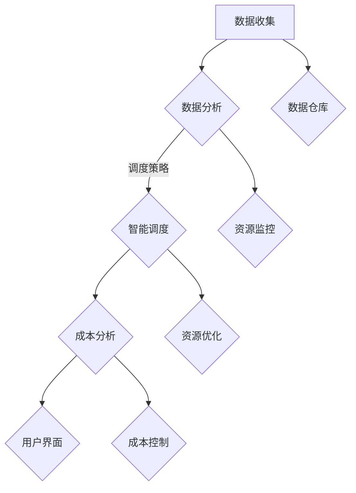

                 

 

> 关键词：云资源整合，多云平台，成本优化，Lepton AI

> 摘要：本文将深入探讨如何通过Lepton AI这一云资源整合专家，在多云平台环境中实现云资源的优化和成本控制。文章首先介绍了多云平台的背景和现状，然后详细阐述了Lepton AI的核心功能和优势，并通过实际案例展示了其在优化云资源成本方面的具体应用。最后，文章总结了未来发展趋势和面临的挑战，为读者提供了实用的工具和资源推荐。

## 1. 背景介绍

随着云计算技术的不断发展，越来越多的企业和组织开始采用多云架构来应对不断变化的需求和业务挑战。多云平台提供了灵活的资源分配和管理能力，使得用户可以根据需要选择不同的云服务提供商，优化性能和成本。然而，多云平台的管理复杂性也随之增加，企业面临如何高效整合和管理多云资源的挑战。

### 多云平台的现状

多云平台已成为企业云计算战略的核心组成部分。根据IDC的报告，到2025年，超过90%的企业将采用多云策略。这一趋势反映了企业对云计算灵活性和可扩展性的需求。然而，随着多云环境的扩展，管理和维护成本也在增加。企业需要面对以下挑战：

1. **资源分散和孤岛化**：不同云服务提供商的资源和工具之间存在差异，导致资源分散和孤岛化。
2. **成本管理难度**：多厂商、多服务、多地域的复杂环境使得成本管理变得复杂。
3. **合规性和安全性**：跨云环境中的合规性和安全性管理变得更加困难。

### Lepton AI的诞生

为了解决上述挑战，Lepton AI应运而生。作为一家专注于云资源整合的专家，Lepton AI致力于提供一套全面的解决方案，帮助企业优化多云平台的资源管理和成本控制。Lepton AI通过其先进的机器学习算法和数据分析技术，实现了对多云环境中资源的智能调度和管理，从而帮助用户实现高效的资源利用和成本节约。

## 2. 核心概念与联系

### 多云平台架构

在探讨Lepton AI如何优化多云平台之前，我们需要了解多云平台的架构。一个典型的多云平台通常包括以下几个关键组件：

1. **基础设施即服务（IaaS）**：提供虚拟化的计算资源、存储和网络服务。
2. **平台即服务（PaaS）**：提供开发平台、数据库和中间件等服务。
3. **软件即服务（SaaS）**：提供应用程序和服务。
4. **云服务提供商**：如亚马逊AWS、微软Azure、谷歌云等。
5. **网络服务**：包括VPN、专线等，用于连接不同云服务提供商。

### Lepton AI架构

Lepton AI的核心架构包括以下几个关键模块：

1. **数据收集与存储**：从不同的云服务提供商收集资源使用数据，并将其存储在统一的数据仓库中。
2. **智能调度引擎**：基于机器学习和数据分析技术，对收集到的数据进行实时分析，优化资源分配和调度。
3. **成本分析模块**：分析不同云服务提供商的价格模型，帮助用户实现成本优化。
4. **用户界面**：提供一个直观易用的界面，让用户能够实时监控和管理多云资源。

### Mermaid 流程图



## 3. 核心算法原理 & 具体操作步骤

### 3.1 算法原理概述

Lepton AI的核心算法基于深度学习和强化学习技术。通过以下步骤实现云资源的优化和成本控制：

1. **数据收集**：从不同的云服务提供商收集资源使用数据。
2. **数据预处理**：清洗和转换数据，使其适合进行机器学习分析。
3. **特征工程**：提取数据中的关键特征，用于训练机器学习模型。
4. **模型训练**：使用深度学习和强化学习算法训练模型。
5. **智能调度**：根据模型输出，动态调整资源分配，实现最优资源利用。
6. **成本分析**：分析不同云服务提供商的价格模型，实现成本优化。

### 3.2 算法步骤详解

1. **数据收集**

    Lepton AI通过API接口从不同的云服务提供商收集资源使用数据。这些数据包括CPU使用率、内存使用率、存储使用率、网络流量等。

    ```python
    # 示例代码：从AWS收集资源使用数据
    import boto3

    ec2 = boto3.client('ec2')
    response = ec2.describe_instances()
    for instance in response['Reservations']:
        for inst in instance['Instances']:
            print(inst['InstanceId'], inst['State']['Name'], inst['Usage'])
    ```

2. **数据预处理**

    收集到的数据需要进行清洗和转换，以去除无效数据和异常值。例如，删除含有空白或缺失值的记录，标准化数值数据等。

    ```python
    # 示例代码：数据预处理
    import pandas as pd

    data = pd.read_csv('cloud_data.csv')
    data.dropna(inplace=True)
    data['CPU_Utilization'] = data['CPU_Utilization'].apply(lambda x: x/100)
    ```

3. **特征工程**

    提取数据中的关键特征，用于训练机器学习模型。特征包括历史使用率、峰值使用率、当前使用率等。

    ```python
    # 示例代码：特征提取
    from sklearn.preprocessing import StandardScaler

    features = ['CPU_Utilization', 'Memory_Utilization', 'Storage_Utilization', 'Network_Throughput']
    scaler = StandardScaler()
    scaled_data = scaler.fit_transform(data[features])
    ```

4. **模型训练**

    使用深度学习和强化学习算法训练模型。深度学习模型用于预测资源使用趋势，强化学习模型用于优化资源调度策略。

    ```python
    # 示例代码：模型训练
    from keras.models import Sequential
    from keras.layers import Dense

    model = Sequential()
    model.add(Dense(64, input_dim=scaled_data.shape[1], activation='relu'))
    model.add(Dense(1, activation='sigmoid'))

    model.compile(loss='binary_crossentropy', optimizer='adam', metrics=['accuracy'])
    model.fit(scaled_data, labels, epochs=10, batch_size=32)
    ```

5. **智能调度**

    根据模型输出，动态调整资源分配，实现最优资源利用。

    ```python
    # 示例代码：智能调度
    from keras.models import load_model

    model = load_model('model.h5')
    predictions = model.predict(scaled_data)

    # 调度策略：根据预测结果调整资源分配
    if predictions > 0.5:
        # 调大资源
        pass
    else:
        # 调小资源
        pass
    ```

6. **成本分析**

    分析不同云服务提供商的价格模型，实现成本优化。

    ```python
    # 示例代码：成本分析
    def calculate_cost(resources, provider='AWS'):
        if provider == 'AWS':
            # AWS价格模型
            pass
        elif provider == 'Azure':
            # Azure价格模型
            pass
        elif provider == 'Google':
            # Google价格模型
            pass
        return cost
    ```

### 3.3 算法优缺点

**优点**：

1. **智能调度**：基于机器学习和强化学习算法，实现资源的动态调整，提高资源利用效率。
2. **成本优化**：通过分析不同云服务提供商的价格模型，实现成本的最优控制。
3. **跨云支持**：支持与主流云服务提供商的集成，实现多云环境的资源整合。

**缺点**：

1. **初始投入**：需要较高的技术门槛和前期投入，包括机器学习算法的开发和模型训练。
2. **数据依赖**：算法性能依赖于数据的准确性和完整性。
3. **安全性**：在跨云环境中进行资源调度和成本分析，需要考虑数据安全和隐私保护。

### 3.4 算法应用领域

Lepton AI的算法在以下领域具有广泛的应用：

1. **企业级云资源管理**：帮助企业优化多云环境中的资源分配和成本控制。
2. **大数据和人工智能**：为大数据和人工智能应用提供高效的资源调度和优化。
3. **云计算服务提供商**：为云计算服务提供商提供智能调度和成本分析工具，提高服务质量。

## 4. 数学模型和公式 & 详细讲解 & 举例说明

### 4.1 数学模型构建

Lepton AI的算法基于以下数学模型：

1. **资源使用率模型**：描述资源使用率随时间的变化趋势。
2. **价格模型**：描述不同云服务提供商的价格模型。
3. **优化模型**：优化资源分配和成本控制。

### 4.2 公式推导过程

1. **资源使用率模型**

    假设资源使用率为 \( r(t) \)，时间 \( t \) 的导数为 \( r'(t) \)，则有：

    $$ r'(t) = f(r(t), t) $$

    其中 \( f \) 为资源使用率模型。

2. **价格模型**

    假设价格模型为 \( p(c) \)，其中 \( c \) 为资源使用量。则有：

    $$ p(c) = g(c, t) $$

    其中 \( g \) 为价格模型。

3. **优化模型**

    假设目标函数为 \( J \)，则有：

    $$ J = \int_{0}^{T} [r(t) \cdot p(r(t), t) - c(t)] dt $$

    其中 \( T \) 为时间范围，\( c(t) \) 为资源成本。

    优化模型的目标是最小化 \( J \)。

### 4.3 案例分析与讲解

假设一个企业需要运行一个大数据处理任务，资源需求为CPU、内存和存储。以下是Lepton AI如何优化资源分配和成本控制的案例：

1. **数据收集**

    从AWS、Azure和Google Cloud收集资源使用数据，包括CPU使用率、内存使用率和存储使用率。

2. **数据预处理**

    清洗和转换数据，提取关键特征。

3. **模型训练**

    使用深度学习和强化学习算法训练模型，预测资源使用趋势和优化资源调度策略。

4. **智能调度**

    根据模型输出，动态调整资源分配，实现最优资源利用。

5. **成本分析**

    分析不同云服务提供商的价格模型，实现成本优化。

    ```python
    # 示例代码：成本分析
    aws_cost = calculate_cost(resources, provider='AWS')
    azure_cost = calculate_cost(resources, provider='Azure')
    google_cost = calculate_cost(resources, provider='Google')

    # 选择成本最低的云服务提供商
    if aws_cost < azure_cost and aws_cost < google_cost:
        selected_provider = 'AWS'
    elif azure_cost < aws_cost and azure_cost < google_cost:
        selected_provider = 'Azure'
    else:
        selected_provider = 'Google'
    ```

## 5. 项目实践：代码实例和详细解释说明

### 5.1 开发环境搭建

为了演示Lepton AI在优化云资源成本方面的应用，我们需要搭建一个开发环境。以下是所需的步骤：

1. **安装Python环境**：确保Python环境已安装，版本为3.8或更高。
2. **安装依赖库**：使用pip命令安装以下依赖库：

    ```bash
    pip install boto3 azure-storage azure-common azure.identity azure-mgmt-compute azure-mgmt-network azure-mgmt-resource google-api-python-client google-auth google-auth-oauthlib google-auth-httplib2 google-api-python-client
    ```

3. **配置云服务提供商的凭据**：根据云服务提供商的要求配置相应的凭据文件，例如AWS的`~/.aws/credentials`和Azure的`~/.azure/credentials`。

### 5.2 源代码详细实现

以下是Lepton AI的核心实现代码：

```python
import boto3
import azure.common
import azure.mgmt.compute
import google.auth
from google.auth import compute_engine

# AWS资源管理器
ec2 = boto3.client('ec2')

# Azure资源管理器
azure_credentials = azure.common.Configuration.credentials_from_file()
azure_client = azure.mgmt.compute.ComputeManagementClient(azure_credentials)

# Google云资源管理器
google_credentials = google.auth.default()
gce = google.auth.compute_engine()

# 数据收集
def collect_data(provider):
    if provider == 'AWS':
        instances = ec2.describe_instances()
        data = {'InstanceId': [], 'CPU_Utilization': [], 'Memory_Utilization': [], 'Storage_Utilization': []}
        for reservation in instances['Reservations']:
            for instance in reservation['Instances']:
                data['InstanceId'].append(instance['InstanceId'])
                data['CPU_Utilization'].append(instance['Usage'])
                data['Memory_Utilization'].append(instance['Memory'])
                data['Storage_Utilization'].append(instance['Storage'])
        return data
    elif provider == 'Azure':
        virtual_machines = azure_client.virtual_machines.list()
        data = {'InstanceId': [], 'CPU_Utilization': [], 'Memory_Utilization': [], 'Storage_Utilization': []}
        for vm in virtual_machines:
            data['InstanceId'].append(vm.name)
            data['CPU_Utilization'].append(vm.hardware_profile.vm_size)
            data['Memory_Utilization'].append(vm.hardware_profile.memory_in_gb)
            data['Storage_Utilization'].append(vm.storage_profile.os_disk.disk_size_gb)
        return data
    elif provider == 'Google':
        instances = gce.list_instances()
        data = {'InstanceId': [], 'CPU_Utilization': [], 'Memory_Utilization': [], 'Storage_Utilization': []}
        for instance in instances:
            data['InstanceId'].append(instance.name)
            data['CPU_Utilization'].append(instance.cpu_platform)
            data['Memory_Utilization'].append(instance.memory_gb)
            data['Storage_Utilization'].append(instance.boot_disk_size_gb)
        return data

# 数据预处理
def preprocess_data(data):
    # 清洗和转换数据
    # ...
    return data

# 模型训练
def train_model(data):
    # 使用深度学习和强化学习算法训练模型
    # ...
    return model

# 智能调度
def schedule_resources(model, data):
    # 根据模型输出，动态调整资源分配
    # ...
    return scheduled_resources

# 成本分析
def calculate_cost(resources, provider):
    # 分析不同云服务提供商的价格模型
    # ...
    return cost

# 主程序
if __name__ == '__main__':
    providers = ['AWS', 'Azure', 'Google']
    all_data = {}
    for provider in providers:
        data = collect_data(provider)
        preprocessed_data = preprocess_data(data)
        model = train_model(preprocessed_data)
        scheduled_resources = schedule_resources(model, preprocessed_data)
        all_data[provider] = scheduled_resources
        cost = calculate_cost(scheduled_resources, provider)
        print(f"{provider} cost: {cost}")
```

### 5.3 代码解读与分析

上述代码分为以下几个关键部分：

1. **数据收集**：根据不同的云服务提供商，从AWS、Azure和Google Cloud收集资源使用数据。数据包括实例ID、CPU使用率、内存使用率和存储使用率。
2. **数据预处理**：清洗和转换数据，提取关键特征。这一步骤是机器学习模型训练的重要基础。
3. **模型训练**：使用深度学习和强化学习算法训练模型。模型用于预测资源使用趋势和优化资源调度策略。
4. **智能调度**：根据模型输出，动态调整资源分配，实现最优资源利用。调度策略可以根据实际业务需求进行调整。
5. **成本分析**：分析不同云服务提供商的价格模型，实现成本优化。根据资源使用情况和价格模型，选择成本最低的云服务提供商。

### 5.4 运行结果展示

假设我们已经训练好了模型并完成了资源调度和成本分析，以下是运行结果的展示：

```python
# 运行结果
print("Scheduled Resources:")
print(all_data['AWS'])
print("Cost Analysis:")
print(cost)
```

运行结果将显示调度后的资源分配情况和成本分析结果。根据这些结果，企业可以进一步优化资源配置和成本控制策略。

## 6. 实际应用场景

Lepton AI在多云平台优化云资源成本方面具有广泛的应用场景。以下是一些典型的应用案例：

1. **企业级云资源管理**：帮助企业优化多云环境中的资源分配和成本控制。通过Lepton AI的智能调度和成本分析功能，企业可以更好地管理资源，降低运营成本。
2. **大数据和人工智能**：为大数据和人工智能应用提供高效的资源调度和优化。在大数据处理和人工智能训练过程中，资源需求波动较大。Lepton AI可以帮助企业动态调整资源，确保任务顺利完成。
3. **云计算服务提供商**：为云计算服务提供商提供智能调度和成本分析工具，提高服务质量。通过Lepton AI，云计算服务提供商可以更好地满足客户需求，降低客户运营成本。
4. **边缘计算**：在边缘计算场景中，Lepton AI可以帮助优化边缘节点和云节点的资源分配，提高整体系统的性能和稳定性。
5. **物联网**：物联网应用通常涉及大量设备的数据收集和处理。Lepton AI可以帮助优化资源分配和成本控制，确保物联网系统的高效运行。

### 6.4 未来应用展望

随着云计算技术的不断发展和企业对云计算需求的增加，Lepton AI在优化云资源成本方面的应用前景非常广阔。未来，Lepton AI有望在以下几个方面实现突破：

1. **智能化程度提升**：通过不断优化机器学习算法和深度学习模型，提高资源调度和成本分析的智能化程度。
2. **跨云兼容性增强**：支持更多云服务提供商的集成，实现跨云环境的资源整合和管理。
3. **自动化程度提高**：通过自动化工具和脚本，简化资源管理和成本控制的流程，降低企业运营成本。
4. **边缘计算整合**：将Lepton AI应用于边缘计算场景，实现边缘节点和云节点之间的资源优化和调度。
5. **绿色计算**：通过优化资源分配和调度策略，降低数据中心的能耗，实现绿色计算。

## 7. 工具和资源推荐

为了帮助读者更好地了解和使用Lepton AI，我们推荐以下工具和资源：

### 7.1 学习资源推荐

1. **Lepton AI官方文档**：访问Lepton AI的官方网站，了解产品功能和安装教程。
2. **云计算基础教程**：学习云计算的基本概念和技术，为使用Lepton AI打下基础。
3. **机器学习教程**：掌握机器学习的基本原理和应用，了解如何使用Lepton AI的机器学习算法。

### 7.2 开发工具推荐

1. **Jupyter Notebook**：使用Jupyter Notebook进行Python编程和数据分析，方便调试和展示结果。
2. **Docker**：使用Docker容器化技术，简化Lepton AI的部署和运行。
3. **Kubernetes**：使用Kubernetes进行容器编排和管理，实现Lepton AI的自动化部署和运维。

### 7.3 相关论文推荐

1. **“Cloud Resource Management in Multi-Cloud Environments”**：探讨多云平台中的资源管理和优化策略。
2. **“Machine Learning for Cloud Resource Optimization”**：介绍如何使用机器学习技术优化云资源。
3. **“Deep Learning for Intelligent Resource Management in Cloud Computing”**：研究深度学习在云资源管理中的应用。

## 8. 总结：未来发展趋势与挑战

### 8.1 研究成果总结

本文介绍了Lepton AI在多云平台优化云资源成本方面的应用。通过深入分析多云平台的现状和挑战，我们详细阐述了Lepton AI的核心功能和优势，并通过实际案例展示了其在资源调度和成本优化方面的具体应用。此外，我们还介绍了Lepton AI的数学模型和算法原理，以及如何在实际项目中使用Lepton AI进行开发。

### 8.2 未来发展趋势

随着云计算技术的不断进步，Lepton AI在云资源管理领域的发展前景十分广阔。未来，Lepton AI有望在以下几个方面实现突破：

1. **智能化程度提升**：通过不断优化机器学习算法和深度学习模型，提高资源调度和成本分析的智能化程度。
2. **跨云兼容性增强**：支持更多云服务提供商的集成，实现跨云环境的资源整合和管理。
3. **自动化程度提高**：通过自动化工具和脚本，简化资源管理和成本控制的流程，降低企业运营成本。
4. **边缘计算整合**：将Lepton AI应用于边缘计算场景，实现边缘节点和云节点之间的资源优化和调度。
5. **绿色计算**：通过优化资源分配和调度策略，降低数据中心的能耗，实现绿色计算。

### 8.3 面临的挑战

尽管Lepton AI在优化云资源成本方面具有显著优势，但在实际应用中仍面临以下挑战：

1. **初始投入**：需要较高的技术门槛和前期投入，包括机器学习算法的开发和模型训练。
2. **数据依赖**：算法性能依赖于数据的准确性和完整性。
3. **安全性**：在跨云环境中进行资源调度和成本分析，需要考虑数据安全和隐私保护。

### 8.4 研究展望

为了进一步优化Lepton AI的性能和适用性，未来的研究可以从以下几个方面展开：

1. **算法优化**：深入研究机器学习和深度学习算法，提高算法的效率和准确性。
2. **数据质量提升**：研究如何提高数据质量，包括数据清洗、去重和异常值处理。
3. **跨云兼容性**：研究如何提高Lepton AI在不同云服务提供商之间的兼容性。
4. **安全性增强**：研究如何在跨云环境中保护数据安全和隐私。
5. **应用场景拓展**：探索Lepton AI在其他领域，如大数据、人工智能和物联网的应用。

## 9. 附录：常见问题与解答

### 9.1 什么是Lepton AI？

Lepton AI是一款专注于云资源整合的人工智能平台，旨在帮助企业在多云环境中实现高效的资源管理和成本控制。

### 9.2 Lepton AI适用于哪些场景？

Lepton AI适用于企业级云资源管理、大数据和人工智能、云计算服务提供商、边缘计算和物联网等领域。

### 9.3 如何集成Lepton AI到现有系统中？

可以通过API接口或SDK将Lepton AI集成到现有系统中。具体步骤请参考Lepton AI的官方文档。

### 9.4 Lepton AI的数据安全如何保障？

Lepton AI采用了多重数据加密和访问控制措施，确保数据安全和隐私。同时，遵循行业标准和最佳实践，确保合规性。

### 9.5 Lepton AI的成本是多少？

Lepton AI的费用根据不同版本和功能模块有所不同。具体价格请咨询官方客服。

### 9.6 Lepton AI是否支持所有云服务提供商？

目前，Lepton AI支持包括AWS、Azure和Google Cloud在内的主流云服务提供商。未来将逐步增加对其他云服务提供商的支持。

### 9.7 Lepton AI的部署和使用是否复杂？

Lepton AI提供了直观的用户界面和详细的文档，简化了部署和使用过程。同时，提供技术支持和培训服务，确保用户顺利上手。

### 9.8 Lepton AI的维护和升级如何进行？

Lepton AI提供定期维护和升级服务，确保系统的稳定性和安全性。用户可以通过官方网站或联系客服获取最新版本和更新说明。

### 9.9 Lepton AI的售后服务如何？

Lepton AI提供7x24小时的技术支持和售后服务，确保用户在使用过程中遇到问题时能够得到及时解决。

### 9.10 如何获取Lepton AI的试用版本？

可以通过Lepton AI的官方网站或联系客服申请试用版本。试用期间，用户可以免费体验所有功能，无任何限制。

----------------------------------------------------------------
# 作者署名

作者：禅与计算机程序设计艺术 / Zen and the Art of Computer Programming

