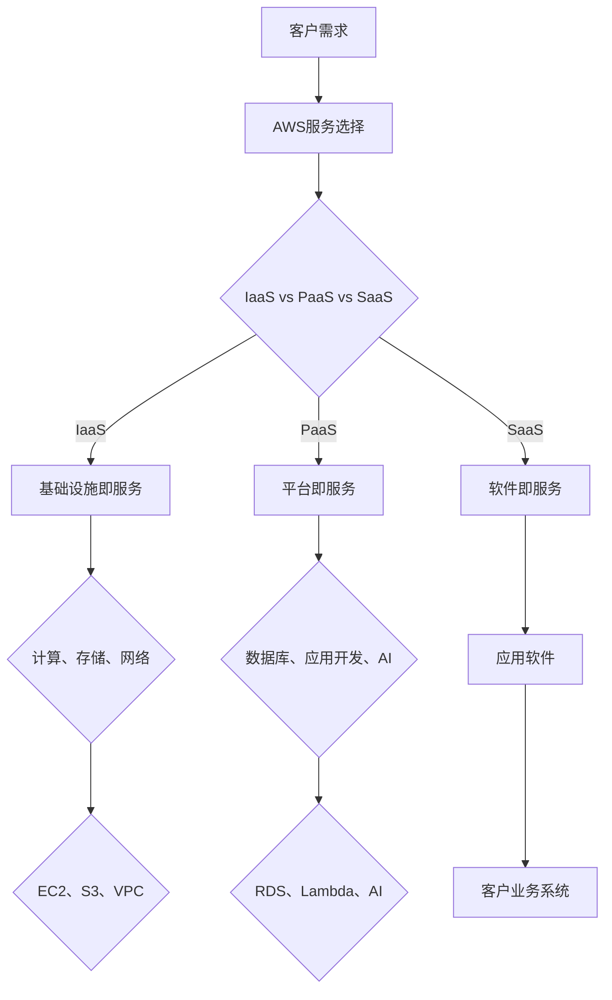

                 

关键词：亚马逊，AWS，解决方案，架构师，面试，问答

> 摘要：本文将围绕亚马逊2025年社招AWS解决方案架构师的面试内容进行深入探讨。通过分析面试中的核心问题，全面解析AWS解决方案架构的原理、实施步骤和关键挑战，为准备类似职位面试的专业人士提供实用的指导和建议。

## 1. 背景介绍

随着云计算技术的飞速发展，Amazon Web Services（AWS）已经成为全球领先的服务提供商。AWS提供了一整套强大的云计算服务，包括计算、存储、数据库、网络、人工智能等，为各种规模的企业提供灵活、可靠的IT基础设施。解决方案架构师在AWS的生态系统中扮演着至关重要的角色，他们负责设计和实现满足客户需求的云计算解决方案。

本文将结合亚马逊2025年社招AWS解决方案架构师的面试经验，解析一系列典型面试问题。通过这些问题，读者可以更好地理解AWS解决方案架构的核心概念、关键技术和实施策略，为自身的职业发展做好准备。

## 2. 核心概念与联系

在深入探讨面试问题之前，我们首先需要了解AWS解决方案架构中的核心概念和其相互关系。以下是一个简化的Mermaid流程图，用以展示AWS解决方案架构的主要组成部分。

### 2.1 AWS服务选择

在面试中，首先会问及如何根据客户需求选择合适的AWS服务。正确的策略是：

- **理解客户业务**：深入了解客户的业务需求、IT基础设施和预算。
- **评估服务特性**：比较不同AWS服务的特性，如性能、可靠性、成本等。
- **安全性和合规性**：确保所选服务符合客户的安全和合规性要求。

### 2.2 IaaS、PaaS和SaaS

IaaS、PaaS和SaaS是云计算服务的三种主要模式。理解这三种模式及其应用场景对于架构师至关重要。

- **IaaS**：提供虚拟化的计算资源，如虚拟机、存储和网络。适用于需要高度控制和管理IT基础设施的客户。
- **PaaS**：提供开发和部署应用程序的平台。适用于开发人员和开发团队，减少基础设施管理的复杂性。
- **SaaS**：提供通过互联网访问的软件应用。适用于希望快速部署和使用软件服务的客户。

### 2.3 基础设施与平台服务

AWS基础设施服务（IaaS）包括计算（如EC2）、存储（如S3）和网络（如VPC）。平台服务（PaaS）包括数据库（如RDS）、应用开发（如Lambda）和人工智能（如AI）。这些服务相互结合，构建出复杂的云计算解决方案。

## 3. 核心算法原理 & 具体操作步骤

### 3.1 算法原理概述

AWS解决方案架构师需要掌握的关键算法原理包括：

- **负载均衡**：分配网络流量以优化资源利用和性能。
- **数据库分片**：将数据分散存储以提高性能和可用性。
- **容器编排**：管理容器化应用程序的部署、扩展和更新。
- **自动化脚本**：实现自动化操作以减少人工干预。

### 3.2 算法步骤详解

以下为每个算法的具体操作步骤：

#### 3.2.1 负载均衡

1. 确定负载均衡策略（如轮询、最小连接数、源IP等）。
2. 创建负载均衡资源（如ELB）。
3. 配置后端服务器组。
4. 将客户端流量定向到负载均衡。

#### 3.2.2 数据库分片

1. 确定分片策略（如基于键、范围、哈希等）。
2. 创建分片数据库实例。
3. 配置分片查询路由。
4. 确保数据一致性。

#### 3.2.3 容器编排

1. 确定容器编排工具（如Kubernetes）。
2. 编写Dockerfile和Kubernetes配置文件。
3. 部署和管理容器。
4. 监控和优化容器资源使用。

#### 3.2.4 自动化脚本

1. 确定自动化需求（如配置管理、监控告警等）。
2. 编写Shell或Python脚本。
3. 部署脚本到AWS Lambda或其他执行环境。
4. 配置触发器和调度计划。

### 3.3 算法优缺点

#### 3.3.1 负载均衡

- 优点：提高性能、可用性和扩展性。
- 缺点：需要额外的配置和管理。

#### 3.3.2 数据库分片

- 优点：提高性能、可用性和可扩展性。
- 缺点：数据一致性和分片管理的复杂性增加。

#### 3.3.3 容器编排

- 优点：简化应用程序部署和管理、提高资源利用率。
- 缺点：需要额外的学习成本和基础设施。

#### 3.3.4 自动化脚本

- 优点：减少人工干预、提高效率和一致性。
- 缺点：脚本维护和错误处理较复杂。

### 3.4 算法应用领域

以上算法在AWS解决方案中广泛应用，如：

- **负载均衡**：用于Web应用程序、数据库和微服务。
- **数据库分片**：用于大数据应用和高度可扩展的应用程序。
- **容器编排**：用于微服务架构和云原生应用程序。
- **自动化脚本**：用于配置管理、监控和运维自动化。

## 4. 数学模型和公式 & 详细讲解 & 举例说明

在AWS解决方案架构中，数学模型和公式用于优化资源分配、性能分析和成本管理。以下是一些常见的数学模型和公式：

### 4.1 数学模型构建

#### 4.1.1 负载均衡模型

负载均衡器根据以下公式计算目标后端服务器的流量份额：

$$
\frac{current\_server\_health}{sum_{i=1}^{n} current\_server_{health}}
$$

其中，$current\_server_{health}$ 为后端服务器的当前健康状态。

#### 4.1.2 数据库分片模型

数据库分片的关键参数包括：

- **分片键**：确定数据分片的依据。
- **数据一致性**：确保分片后数据的一致性。

分片策略的选择取决于数据访问模式和查询性能要求。

#### 4.1.3 容器编排模型

容器编排中的关键指标包括：

- **资源利用率**：计算容器使用的CPU、内存等资源。
- **服务质量**：确保应用程序的响应时间和吞吐量。

#### 4.1.4 自动化脚本模型

自动化脚本的关键参数包括：

- **执行频率**：脚本执行的间隔时间。
- **触发条件**：脚本执行的触发事件。

### 4.2 公式推导过程

#### 4.2.1 负载均衡公式的推导

负载均衡算法通常基于轮询、最小连接数等策略。轮询策略的推导过程如下：

1. 设定总流量为 $T$。
2. 设定第 $i$ 个服务器的流量份额为 $f_i$。
3. 根据健康状态，设定 $current\_server_{health}$。
4. 计算 $f_i$：

$$
f_i = \frac{current\_server_{health}}{sum_{j=1}^{n} current\_server_{health}}
$$

#### 4.2.2 数据库分片一致性的推导

数据库分片的一致性取决于分片策略和分布式系统的容错能力。以下为一致性模型的基本推导：

1. 设定分片键为 $key$。
2. 设定数据一致性级别为 $consistency\_level$。
3. 根据分片策略，计算分片范围和副本数量。
4. 确保在 $consistency\_level$ 的一致性下，数据读写操作能够正确执行。

### 4.3 案例分析与讲解

#### 4.3.1 负载均衡案例

假设有5个后端服务器，当前健康状态分别为 [0.9, 0.8, 0.85, 0.88, 0.9]，总流量为1000个请求。

1. 计算 $f_i$：

$$
f_1 = \frac{0.9}{4.5} = 0.2
$$
$$
f_2 = \frac{0.8}{4.5} = 0.18
$$
$$
f_3 = \frac{0.85}{4.5} = 0.19
$$
$$
f_4 = \frac{0.88}{4.5} = 0.2
$$
$$
f_5 = \frac{0.9}{4.5} = 0.2
$$

2. 根据计算出的流量份额，分配请求：

- 服务器1：200个请求
- 服务器2：180个请求
- 服务器3：190个请求
- 服务器4：200个请求
- 服务器5：200个请求

#### 4.3.2 数据库分片案例

假设有一个电商系统，需要将订单数据分片存储。分片键为订单ID，数据一致性级别为强一致性。

1. 确定分片范围：

- 分片0：订单ID范围 [1, 1000]
- 分片1：订单ID范围 [1001, 2000]
- 分片2：订单ID范围 [2001, 3000]
- ...

2. 创建分片数据库实例，并为每个分片分配副本。

3. 确保在强一致性下，对订单数据的读写操作能够正确执行。

## 5. 项目实践：代码实例和详细解释说明

在本节中，我们将通过一个实际项目来展示AWS解决方案架构的具体实施步骤。这个项目是一个简单的电商网站，需要实现负载均衡、数据库分片和自动化脚本等功能。

### 5.1 开发环境搭建

1. 配置AWS账户，开通所需的AWS服务（如EC2、S3、ELB、RDS等）。
2. 安装AWS CLI工具，并配置AWS凭证。
3. 配置本地开发环境，包括Python、Docker和Kubernetes。

### 5.2 源代码详细实现

以下为项目的关键代码实现：

#### 5.2.1 负载均衡配置

1. 在AWS管理控制台中创建负载均衡器（ELB）。
2. 配置后端服务器组，将EC2实例添加到服务器组中。
3. 创建一个负载均衡策略，选择轮询策略。

#### 5.2.2 数据库分片配置

1. 在AWS管理控制台中创建RDS数据库实例。
2. 配置分片数据库实例，选择基于订单ID的分片策略。
3. 创建分片查询路由，确保在强一致性下访问分片数据库。

#### 5.2.3 自动化脚本配置

1. 编写Python脚本，用于自动化配置和管理EC2实例、RDS实例等。
2. 将脚本部署到AWS Lambda，配置触发器和调度计划。

### 5.3 代码解读与分析

在本项目中，我们使用了以下关键组件：

- **EC2实例**：用于运行Web应用程序。
- **ELB**：用于负载均衡，将流量分配到EC2实例。
- **RDS**：用于存储订单数据，实现数据库分片。
- **Lambda**：用于自动化配置和管理实例。

这些组件相互协作，共同构建了一个完整的AWS解决方案。通过配置和部署，我们实现了负载均衡、数据库分片和自动化脚本等功能。

### 5.4 运行结果展示

1. 启动EC2实例，安装和配置Web应用程序。
2. 启动ELB，配置后端服务器组。
3. 启动RDS分片数据库实例，配置分片查询路由。
4. 执行自动化脚本，配置和管理实例。

通过以上步骤，我们成功部署了一个简单的电商网站。在测试过程中，负载均衡器能够有效分配流量，数据库分片确保了数据的一致性和性能，自动化脚本简化了配置和管理流程。

## 6. 实际应用场景

AWS解决方案架构在实际应用场景中具有广泛的应用，以下是一些典型应用场景：

- **电子商务**：实现高并发、高可用的电商网站和移动应用。
- **金融科技**：处理海量金融交易数据，实现高可靠性和高安全性的金融应用。
- **大数据分析**：存储和处理大规模数据集，实现实时分析和数据挖掘。
- **物联网**：连接和管理海量物联网设备，实现数据的收集、处理和分析。

### 6.4 未来应用展望

随着云计算技术的不断发展，AWS解决方案架构在未来将有更广泛的应用前景。以下是一些未来发展趋势：

- **混合云与多云**：企业将更加重视混合云和多云架构，以实现灵活、高效的资源利用。
- **边缘计算**：随着物联网和5G技术的发展，边缘计算将成为云计算的重要组成部分。
- **人工智能与机器学习**：云计算与人工智能技术的深度融合，将推动智能应用的创新和发展。

## 7. 工具和资源推荐

在学习和实践AWS解决方案架构的过程中，以下工具和资源将非常有用：

### 7.1 学习资源推荐

- **AWS官方文档**：涵盖AWS服务的详细文档和最佳实践。
- **《AWS解决方案架构师手册》**：系统介绍AWS解决方案架构的权威指南。
- **在线课程**：如Coursera、Udemy等平台上的AWS课程。

### 7.2 开发工具推荐

- **AWS CLI**：用于与AWS服务进行交互的命令行工具。
- **AWS SDK**：支持多种编程语言的AWS服务开发库。
- **Docker**：用于容器化应用程序的编排工具。
- **Kubernetes**：用于管理容器化应用程序的集群管理工具。

### 7.3 相关论文推荐

- **“Cloud Computing: The Future of IT”**：介绍云计算技术及其发展趋势。
- **“Microservices Architecture”**：讨论微服务架构的设计原则和实践。
- **“Edge Computing: A Brief Introduction”**：介绍边缘计算的基本概念和挑战。

## 8. 总结：未来发展趋势与挑战

### 8.1 研究成果总结

本文通过对亚马逊2025年社招AWS解决方案架构师面试问题的分析，总结了AWS解决方案架构的核心概念、关键技术和实施策略。同时，通过数学模型和实际项目实践，展示了AWS解决方案架构在负载均衡、数据库分片、自动化脚本等方面的应用。

### 8.2 未来发展趋势

随着云计算技术的不断进步，AWS解决方案架构将向以下方向发展：

- **混合云与多云**：企业将更加重视混合云和多云架构，以实现灵活、高效的资源利用。
- **边缘计算**：随着物联网和5G技术的发展，边缘计算将成为云计算的重要组成部分。
- **人工智能与机器学习**：云计算与人工智能技术的深度融合，将推动智能应用的创新和发展。

### 8.3 面临的挑战

在实施AWS解决方案架构的过程中，架构师将面临以下挑战：

- **安全性和合规性**：确保云计算环境中的数据安全和合规性。
- **资源管理和优化**：合理分配和管理云计算资源，降低成本。
- **技术选型和迁移**：选择合适的技术方案，实现平滑迁移。

### 8.4 研究展望

未来，AWS解决方案架构将在以下几个方面展开研究：

- **分布式系统架构**：研究分布式系统的设计原则和优化策略。
- **容器化与微服务**：探讨容器化应用程序和微服务架构的最佳实践。
- **人工智能与大数据**：结合人工智能和大数据技术，实现智能化的云计算解决方案。

## 9. 附录：常见问题与解答

### 9.1 AWS解决方案架构师的主要职责是什么？

AWS解决方案架构师主要负责设计和实现满足客户需求的云计算解决方案。具体职责包括：

- 分析客户业务需求，提供云计算架构建议。
- 设计和实施云计算解决方案，包括IaaS、PaaS和SaaS等。
- 确保解决方案的安全性、可靠性和可扩展性。
- 监控和优化云计算资源的使用。

### 9.2 如何确保云计算环境的安全性？

确保云计算环境的安全性需要从以下几个方面进行：

- 采用安全的身份验证和访问控制机制，如AWS IAM。
- 定期进行安全审计和漏洞扫描，及时发现和修复安全隐患。
- 实施数据加密和保护，确保数据的隐私和完整性。
- 遵循最佳安全实践和合规性要求，如ISO 27001、GDPR等。

### 9.3 什么是AWS的负载均衡服务，如何使用它？

AWS的负载均衡服务（ELB）用于分配网络流量，优化资源利用和性能。使用ELB的步骤如下：

- 创建负载均衡资源。
- 配置后端服务器组，将EC2实例或其他后端服务添加到服务器组。
- 选择负载均衡策略（如轮询、最小连接数等）。
- 将客户端流量定向到负载均衡。

通过以上步骤，可以实现高效的流量分配和负载均衡。

### 9.4 如何在AWS中实现数据库分片？

在AWS中实现数据库分片的关键步骤如下：

- 确定分片策略（如基于键、范围、哈希等）。
- 创建分片数据库实例，并为每个分片配置副本。
- 配置分片查询路由，确保在分片后仍能正确访问数据。
- 确保数据一致性，实现分布式系统的协调。

通过以上步骤，可以在AWS中实现高效、可扩展的数据库分片。

---

作者：禅与计算机程序设计艺术 / Zen and the Art of Computer Programming

