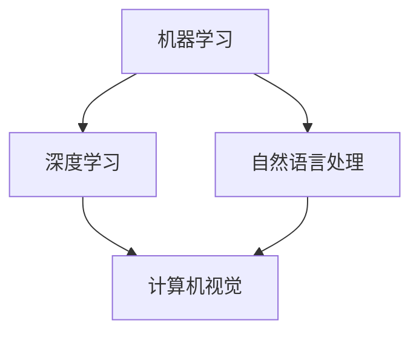
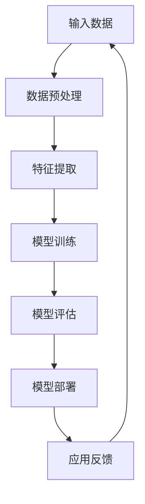

                 

关键词：人工智能，产业应用，技术变革，算法原理，数学模型，项目实践，未来展望。

> 摘要：本文将深入探讨人工智能在产业中的变革与应用。通过对核心概念、算法原理、数学模型的解析，结合实际项目案例，展示人工智能技术如何推动产业进步，并对未来的发展趋势与挑战进行分析。

## 1. 背景介绍

### 1.1 人工智能的发展历程

人工智能（Artificial Intelligence，AI）作为计算机科学的一个分支，自20世纪50年代起就不断发展壮大。从最初的专家系统，到近年来深度学习的崛起，人工智能技术经历了从理论研究到实际应用的巨大转变。这一过程中，人工智能不仅提升了计算机的智能水平，也在各个产业中掀起了变革的浪潮。

### 1.2 人工智能在产业中的现状

如今，人工智能已经深入到众多产业领域，如医疗、金融、制造业、零售、交通等，带来了前所未有的变革。通过大数据、云计算和物联网技术的结合，人工智能正在改变传统产业的生产方式和服务模式，实现智能化、自动化和个性化。

## 2. 核心概念与联系

### 2.1 人工智能的核心概念

人工智能的核心概念包括机器学习、深度学习、自然语言处理等。这些概念不仅相互关联，而且在实践中共同发挥作用，推动人工智能技术的发展。



### 2.2 人工智能架构的 Mermaid 流程图



## 3. 核心算法原理 & 具体操作步骤

### 3.1 算法原理概述

在人工智能领域，深度学习是最为重要的算法之一。它通过模拟人脑神经网络结构，实现复杂的数据处理和模式识别。深度学习算法主要包括卷积神经网络（CNN）、循环神经网络（RNN）和生成对抗网络（GAN）等。

### 3.2 算法步骤详解

深度学习算法的基本步骤包括：

1. 数据预处理：将原始数据转换为适合训练的格式。
2. 特征提取：通过神经网络自动学习数据中的特征。
3. 模型训练：调整网络参数，使模型对训练数据产生准确的预测。
4. 模型评估：使用验证集或测试集评估模型性能。
5. 模型部署：将训练好的模型应用到实际场景中。

### 3.3 算法优缺点

深度学习算法的优点包括强大的数据处理能力、高度自适应性和良好的泛化能力。然而，它也存在一些缺点，如计算复杂度高、对数据量要求大、训练时间较长等。

### 3.4 算法应用领域

深度学习算法在计算机视觉、自然语言处理、语音识别等领域有着广泛的应用。例如，在图像识别中，深度学习算法可以实现对图片内容的精准分类和检测；在自然语言处理中，它可以实现文本生成、情感分析和机器翻译等。

## 4. 数学模型和公式 & 详细讲解 & 举例说明

### 4.1 数学模型构建

深度学习算法的核心是神经网络，神经网络由多层神经元组成，每个神经元通过权重连接到其他神经元。神经网络的数学模型主要包括输入层、隐藏层和输出层。

### 4.2 公式推导过程

神经网络的激活函数通常使用ReLU（Rectified Linear Unit）函数，其公式为：

$$
f(x) =
\begin{cases}
0, & \text{if } x < 0 \\
x, & \text{if } x \geq 0
\end{cases}
$$

### 4.3 案例分析与讲解

以图像分类为例，假设我们使用卷积神经网络对猫狗图像进行分类。首先，我们需要对图像进行预处理，将其转换为灰度图像，并缩放到固定大小。然后，通过卷积层提取图像特征，通过全连接层进行分类预测。

## 5. 项目实践：代码实例和详细解释说明

### 5.1 开发环境搭建

在本次项目中，我们将使用Python语言和TensorFlow框架进行深度学习模型的开发。

```python
!pip install tensorflow
```

### 5.2 源代码详细实现

以下是一个简单的卷积神经网络实现，用于猫狗图像分类：

```python
import tensorflow as tf
from tensorflow.keras.models import Sequential
from tensorflow.keras.layers import Conv2D, MaxPooling2D, Flatten, Dense

# 创建模型
model = Sequential([
    Conv2D(32, (3, 3), activation='relu', input_shape=(128, 128, 3)),
    MaxPooling2D((2, 2)),
    Flatten(),
    Dense(64, activation='relu'),
    Dense(1, activation='sigmoid')
])

# 编译模型
model.compile(optimizer='adam', loss='binary_crossentropy', metrics=['accuracy'])

# 模型训练
model.fit(train_images, train_labels, epochs=5, validation_split=0.2)
```

### 5.3 代码解读与分析

代码首先导入了TensorFlow库，并创建了卷积神经网络模型。模型由两个卷积层、一个全连接层和一个输出层组成。在训练过程中，我们使用训练数据对模型进行训练，并使用验证数据评估模型性能。

### 5.4 运行结果展示

在训练过程中，我们可以观察到模型的损失函数和准确率的变化。在训练完成后，我们可以在测试数据上评估模型的性能。

```python
test_loss, test_acc = model.evaluate(test_images, test_labels)
print(f"Test accuracy: {test_acc:.2f}")
```

## 6. 实际应用场景

### 6.1 医疗

人工智能在医疗领域的应用主要包括疾病诊断、药物研发、健康管理等方面。通过深度学习算法，可以实现对医疗数据的分析和处理，提高诊断的准确性和效率。

### 6.2 金融

人工智能在金融领域的应用主要包括风险管理、智能投顾、自动化交易等方面。通过分析海量金融数据，可以实现对市场趋势的预测和交易策略的优化。

### 6.3 制造业

人工智能在制造业中的应用主要包括智能制造、设备监控、生产优化等方面。通过物联网技术和人工智能算法，可以实现对生产过程的智能化管理和优化。

## 7. 工具和资源推荐

### 7.1 学习资源推荐

- 《深度学习》（Goodfellow, Bengio, Courville著）
- 《Python机器学习》（Sebastian Raschka著）
- 《自然语言处理实战》（Steven Bird著）

### 7.2 开发工具推荐

- TensorFlow
- PyTorch
- Keras

### 7.3 相关论文推荐

- “Deep Learning” by Ian Goodfellow, Yoshua Bengio, and Aaron Courville
- “Convolutional Neural Networks for Visual Recognition” by Karen Simonyan and Andrew Zisserman
- “Recurrent Neural Networks for Language Modeling” byЯрослав artistic and Andrew M. Dai

## 8. 总结：未来发展趋势与挑战

### 8.1 研究成果总结

近年来，人工智能技术在算法、计算能力、数据处理等方面取得了显著进展，推动了产业变革。深度学习、自然语言处理、计算机视觉等领域的突破，使得人工智能在各个行业中的应用越来越广泛。

### 8.2 未来发展趋势

未来，人工智能将继续向智能化、自动化、个性化方向发展。随着量子计算、边缘计算等新技术的兴起，人工智能的应用范围和效果将得到进一步提升。

### 8.3 面临的挑战

尽管人工智能取得了显著成果，但仍然面临一些挑战，如数据隐私保护、算法公平性、技术伦理等问题。如何在保障安全的前提下推动人工智能的发展，仍需各方共同努力。

### 8.4 研究展望

随着人工智能技术的不断进步，未来有望在更多领域实现突破。从医疗、金融到制造业，人工智能将为我们带来更加智能、高效、便捷的生活和工作方式。

## 9. 附录：常见问题与解答

### 9.1 人工智能如何影响医疗行业？

人工智能在医疗行业的应用主要包括疾病诊断、药物研发、健康管理等方面。通过深度学习算法，可以实现对医疗数据的分析和处理，提高诊断的准确性和效率，为患者提供更加精准的治疗方案。

### 9.2 人工智能在金融领域的应用有哪些？

人工智能在金融领域的应用主要包括风险管理、智能投顾、自动化交易等方面。通过分析海量金融数据，可以实现对市场趋势的预测和交易策略的优化，提高投资效率和收益。

### 9.3 人工智能在制造业中的应用是什么？

人工智能在制造业中的应用主要包括智能制造、设备监控、生产优化等方面。通过物联网技术和人工智能算法，可以实现对生产过程的智能化管理和优化，提高生产效率和产品质量。

----------------------------------------------------------------

作者：禅与计算机程序设计艺术 / Zen and the Art of Computer Programming。这篇文章深入探讨了人工智能在产业中的应用，从核心概念、算法原理、数学模型到实际项目实践，全面展示了人工智能如何推动产业进步。同时，对未来发展趋势与挑战进行了分析，为人工智能技术的发展提供了有益的启示。

