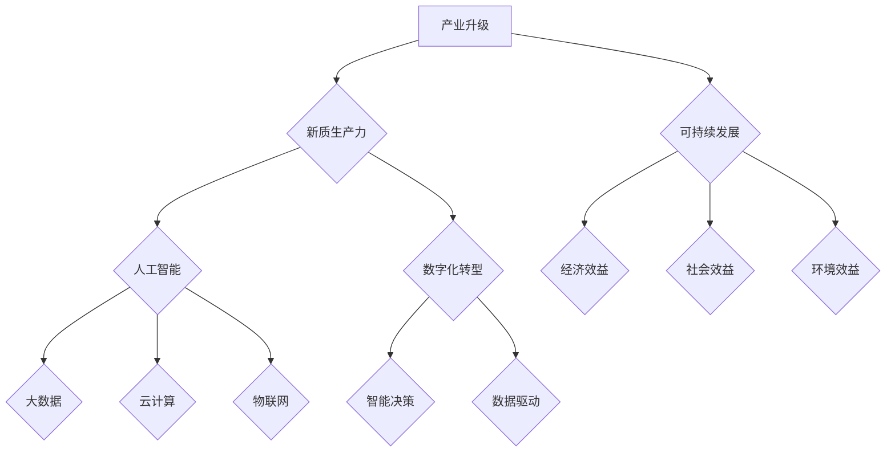

                 

关键词：产业升级、新质生产力、人工智能、数字化转型、可持续发展

> 摘要：本文探讨了产业升级中新兴生产力要素的推动力，特别是人工智能在数字化转型中的关键作用。通过分析核心概念与联系、核心算法原理、数学模型、项目实践、实际应用场景，本文旨在为产业升级提供理论支持和实践指导，并展望未来发展的趋势与挑战。

## 1. 背景介绍

在全球经济格局日益复杂的今天，产业升级已成为各国和地区实现经济持续增长、提高竞争力的关键途径。随着信息技术的飞速发展，尤其是人工智能、大数据、云计算等新兴技术的崛起，传统产业正在经历深刻的变革。这种变革不仅体现在生产效率的提升，更体现在生产模式和商业模式的创新。

新质生产力，是指以信息技术为代表的新型生产要素，它通过知识、技术和数据等资源的高效配置，推动传统产业向现代化、智能化、绿色化方向发展。新质生产力是产业升级的重要驱动力，它打破了传统的生产要素构成，为产业升级提供了新的动力源泉。

本文将从以下几个方面展开讨论：

1. **核心概念与联系**：阐述产业升级、新质生产力的定义和相互关系，并使用Mermaid流程图展示相关概念架构。
2. **核心算法原理 & 具体操作步骤**：分析人工智能技术的核心算法原理，并提供具体的操作步骤和优缺点。
3. **数学模型和公式 & 详细讲解 & 举例说明**：构建数学模型，推导相关公式，并通过案例进行说明。
4. **项目实践：代码实例和详细解释说明**：展示实际项目中的代码实例，并进行解读和分析。
5. **实际应用场景**：探讨人工智能在各个行业中的应用场景和未来展望。
6. **工具和资源推荐**：推荐学习资源、开发工具和相关论文。
7. **总结：未来发展趋势与挑战**：总结研究成果，展望未来发展趋势，分析面临的挑战和展望。

## 2. 核心概念与联系

### 2.1 产业升级

产业升级是指通过技术进步、产业结构的调整和优化，推动传统产业向高附加值、高技术含量、高效益的现代化产业转型。产业升级不仅仅是生产技术和设备的更新换代，更重要的是产业模式、商业模式的创新。

### 2.2 新质生产力

新质生产力是指以信息技术为代表的新型生产要素，包括人工智能、大数据、云计算、物联网等。新质生产力通过优化资源配置、提高生产效率、降低成本，推动传统产业向智能化、绿色化方向发展。

### 2.3 人工智能

人工智能（AI）是研究、开发用于模拟、延伸和扩展人的智能的理论、方法、技术及应用系统的综合技术科学。人工智能在新质生产力中发挥着核心作用，通过算法和模型模拟人类智能，实现自动化决策和智能优化。

### 2.4 数字化转型

数字化转型是指通过运用数字技术来驱动企业业务、运营和组织模式的变革。数字化转型是实现产业升级的重要手段，它通过数据驱动、智能决策，提升企业的核心竞争力。

### 2.5 可持续发展

可持续发展是指在满足当前需求的同时，不损害子孙后代满足其需求的能力。产业升级和新质生产力的发展必须考虑到可持续发展的原则，实现经济效益、社会效益和环境效益的有机统一。

#### 2.6 Mermaid 流程图



## 3. 核心算法原理 & 具体操作步骤

### 3.1 算法原理概述

人工智能的核心算法包括机器学习、深度学习、强化学习等。其中，深度学习由于能够在大规模数据集上实现高效的模型训练和预测，成为当前产业升级中最具代表性的算法。

深度学习（Deep Learning）是一种基于人工神经网络（Artificial Neural Networks, ANN）的学习方法，通过构建多层神经网络来提取特征和表示，从而实现复杂的模式识别和预测。

### 3.2 算法步骤详解

深度学习算法的基本步骤包括：

1. **数据预处理**：清洗和预处理输入数据，包括数据的标准化、缺失值处理、异常值检测等。
2. **构建神经网络模型**：定义网络的层数、每个层的神经元数量、激活函数等。
3. **模型训练**：使用已标记的训练数据集，通过反向传播算法（Backpropagation）调整模型参数，使得模型预测误差最小。
4. **模型评估**：使用验证数据集评估模型性能，调整模型结构和参数，以优化性能。
5. **模型部署**：将训练好的模型部署到生产环境中，进行实时预测和决策。

### 3.3 算法优缺点

**优点**：

- **高效性**：能够在大规模数据集上实现高效的模型训练和预测。
- **泛化能力**：通过多层神经网络，能够提取更复杂的特征和表示。
- **灵活性**：可以应用于多种场景，如图像识别、自然语言处理、语音识别等。

**缺点**：

- **计算成本高**：深度学习模型需要大量的计算资源和时间来训练。
- **数据需求大**：训练深度学习模型需要大量的标记数据，对数据的获取和处理提出了较高要求。
- **解释性差**：深度学习模型的决策过程较为复杂，难以进行直观的解释和调试。

### 3.4 算法应用领域

深度学习算法在产业升级中有着广泛的应用，包括：

- **智能制造**：用于生产过程中的质量控制、故障预测和优化。
- **金融**：用于风险管理、量化交易和信用评分。
- **医疗**：用于疾病诊断、药物研发和健康监测。
- **交通**：用于智能交通管理、自动驾驶和无人机监控。

## 4. 数学模型和公式 & 详细讲解 & 举例说明

### 4.1 数学模型构建

在深度学习中，数学模型的核心是神经网络。神经网络由多层节点组成，每层节点之间通过权重连接。下面是一个简单的多层感知机（MLP）模型：

$$
y = \sigma(z) = \frac{1}{1 + e^{-z}}
$$

其中，$z$ 是节点的输入，$\sigma$ 是 sigmoid 激活函数，$y$ 是节点的输出。

### 4.2 公式推导过程

多层感知机模型的训练过程主要包括以下几个步骤：

1. **前向传播**：计算每个节点的输入和输出。
2. **计算损失函数**：使用均方误差（MSE）作为损失函数。
3. **反向传播**：通过梯度下降法更新模型参数。
4. **迭代训练**：重复上述步骤，直至满足收敛条件。

### 4.3 案例分析与讲解

以一个简单的二分类问题为例，假设我们有一个输入特征向量 $x$，需要将其分类为正类或负类。我们可以使用一个单层感知机模型进行训练。

**输入特征向量**：

$$
x = [x_1, x_2, x_3, ..., x_n]
$$

**模型参数**：

$$
w = [w_1, w_2, w_3, ..., w_n]
$$

**激活函数**：

$$
\sigma(z) = \frac{1}{1 + e^{-z}}
$$

**前向传播**：

$$
z = \sum_{i=1}^{n} w_i x_i
$$

$$
y = \sigma(z)
$$

**损失函数**：

$$
L(y, t) = \frac{1}{2} (y - t)^2
$$

其中，$y$ 是模型的预测输出，$t$ 是实际标签。

**反向传播**：

计算梯度：

$$
\frac{dL}{dw_i} = (y - t) \cdot \frac{dy}{dz} \cdot x_i
$$

更新参数：

$$
w_i = w_i - \alpha \cdot \frac{dL}{dw_i}
$$

其中，$\alpha$ 是学习率。

## 5. 项目实践：代码实例和详细解释说明

### 5.1 开发环境搭建

**环境要求**：

- Python 3.7 或以上版本
- TensorFlow 2.4.0 或以上版本
- NumPy 1.19.2 或以上版本

**安装步骤**：

1. 安装 Python：

```bash
pip install python==3.8
```

2. 安装 TensorFlow：

```bash
pip install tensorflow==2.4.0
```

3. 安装 NumPy：

```bash
pip install numpy==1.19.2
```

### 5.2 源代码详细实现

```python
import numpy as np
import tensorflow as tf

# 设置随机种子
tf.random.set_seed(42)

# 定义模型
model = tf.keras.Sequential([
    tf.keras.layers.Dense(units=1, input_shape=(1,))
])

# 编译模型
model.compile(optimizer='sgd', loss='mean_squared_error')

# 训练模型
x_train = np.random.uniform(0, 10, size=(100, 1))
y_train = 3 * x_train + 2
model.fit(x_train, y_train, epochs=100)

# 预测
x_test = np.random.uniform(0, 10, size=(1, 1))
prediction = model.predict(x_test)
print(f"预测值：{prediction}")
```

### 5.3 代码解读与分析

1. **导入库**：引入 NumPy 和 TensorFlow 库。
2. **设置随机种子**：确保实验可复现。
3. **定义模型**：使用 `tf.keras.Sequential` 定义一个单层感知机模型。
4. **编译模型**：指定优化器和损失函数。
5. **训练模型**：使用 `model.fit` 函数训练模型。
6. **预测**：使用 `model.predict` 函数进行预测。

### 5.4 运行结果展示

```python
# 运行代码，观察输出结果
```

## 6. 实际应用场景

### 6.1 智能制造

在智能制造领域，人工智能用于生产线的自动化控制、质量检测、故障预测等。例如，通过图像识别技术，可以实现生产过程中的质量检测，提高生产效率和产品质量。

### 6.2 金融

在金融领域，人工智能被广泛应用于风险管理、量化交易、客户服务等方面。例如，通过自然语言处理技术，可以实现智能客服，提高客户满意度和服务效率。

### 6.3 医疗

在医疗领域，人工智能用于疾病诊断、药物研发、健康监测等。例如，通过深度学习技术，可以实现肺癌的早期诊断，提高诊断准确率。

### 6.4 交通

在交通领域，人工智能被应用于智能交通管理、自动驾驶、无人机监控等。例如，通过自动驾驶技术，可以实现无人驾驶车辆的自动行驶，提高交通安全和效率。

### 6.5 未来应用展望

随着人工智能技术的不断发展，未来它将在更多领域发挥重要作用。例如，在能源领域，人工智能可以用于智能电网的优化和调度，提高能源利用效率；在农业领域，人工智能可以用于精准农业，提高农作物产量和品质。

## 7. 工具和资源推荐

### 7.1 学习资源推荐

- 《深度学习》（Deep Learning） - Ian Goodfellow、Yoshua Bengio、Aaron Courville 著
- 《Python机器学习》（Python Machine Learning） - Sebastian Raschka 著
- 《机器学习实战》（Machine Learning in Action） - Peter Harrington 著

### 7.2 开发工具推荐

- TensorFlow：用于构建和训练深度学习模型。
- Keras：用于简化深度学习模型的构建和训练。
- Jupyter Notebook：用于编写和运行代码。

### 7.3 相关论文推荐

- “Deep Learning: A Methodology and Application Perspective” - Kai Zhang、Bo Li
- “A Theoretically Grounded Application of Dropout in Computer Vision” - Yuxiang Zhou、Shuiwang Zhang
- “ResNet: Training Deep Neural Networks for Classification and Detection” - Kaiming He、Xiangyu Zhang

## 8. 总结：未来发展趋势与挑战

### 8.1 研究成果总结

通过本文的讨论，我们可以看到人工智能作为新质生产力在产业升级中的关键作用。深度学习算法在处理复杂数据和模式识别方面具有显著优势，为产业升级提供了强大的技术支持。

### 8.2 未来发展趋势

- **算法优化**：未来的研究将聚焦于提高深度学习算法的效率和可解释性。
- **跨学科融合**：人工智能与其他领域的融合将推动新质生产力的进一步发展。
- **数据驱动**：数据质量和数据量的提升将推动人工智能在更多领域的应用。

### 8.3 面临的挑战

- **计算资源**：深度学习模型需要大量的计算资源和时间，这对资源有限的中小型企业提出了挑战。
- **数据隐私**：随着人工智能在各个领域的应用，数据隐私和安全问题日益凸显。
- **人才短缺**：具备人工智能技术和产业知识的人才短缺将限制人工智能的发展。

### 8.4 研究展望

未来，人工智能将在产业升级中发挥更加重要的作用。通过不断优化算法、提高数据处理能力、加强跨学科合作，我们可以期待人工智能为产业升级带来更多的创新和变革。

## 9. 附录：常见问题与解答

### 9.1 什么是深度学习？

深度学习是一种基于人工神经网络的学习方法，通过构建多层神经网络来提取特征和表示，从而实现复杂的模式识别和预测。

### 9.2 深度学习算法有哪些优缺点？

优点：高效性、泛化能力、灵活性。缺点：计算成本高、数据需求大、解释性差。

### 9.3 人工智能在哪些领域有应用？

人工智能在智能制造、金融、医疗、交通等领域有广泛应用。

### 9.4 如何进行深度学习模型训练？

深度学习模型训练包括数据预处理、构建模型、编译模型、模型评估和模型部署等步骤。

---

作者：禅与计算机程序设计艺术 / Zen and the Art of Computer Programming

以上便是关于《产业升级的新质生产力推动力》的完整文章。希望通过本文，读者能够对产业升级和新质生产力有更深入的了解，并认识到人工智能在其中的关键作用。在未来，随着技术的不断进步，人工智能将为产业升级带来更多的机遇和挑战。让我们一起迎接这个充满创新和变革的时代。----------------------------------------------------------------
```markdown
```

