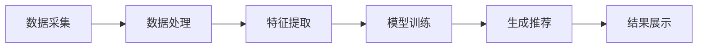

                 

关键词：人工智能，推荐系统，产品开发，新品推荐，数据挖掘，机器学习

> 摘要：随着人工智能技术的快速发展，推荐系统已成为产品开发中的关键环节。本文将探讨如何利用人工智能技术进行新产品品类的推荐，从核心概念到具体实践，全面解析AI在产品开发中的创新应用。

## 1. 背景介绍

在数字化时代，产品开发已经不再仅仅依赖于传统的方法和经验。随着消费者需求的多样化和个性化，企业需要更加智能化和个性化的推荐系统来满足市场变化。推荐系统已经成为电商平台、社交媒体和在线视频平台等领域的标配，它通过分析用户行为和偏好，向用户推荐可能感兴趣的商品或内容，从而提升用户体验和销售额。

然而，随着数据量的爆炸性增长，单纯依靠人工构建推荐规则已经难以应对复杂的商业需求。人工智能技术的引入为推荐系统带来了新的可能性，特别是机器学习算法的应用，使得推荐系统更加精准和智能。本文将围绕如何利用人工智能技术进行新产品品类的推荐展开讨论。

## 2. 核心概念与联系

### 2.1 推荐系统的基本原理

推荐系统主要基于以下几个核心概念：

- **用户画像**：通过用户的历史行为和偏好，构建用户画像，用于后续的推荐。
- **物品画像**：通过物品的特征，如分类、标签、评价等，构建物品画像。
- **相似性计算**：计算用户与用户、物品与物品之间的相似性，用于生成推荐列表。

### 2.2 推荐系统的架构

推荐系统通常包括以下几个主要模块：

- **数据采集与处理**：收集用户行为数据、商品属性数据等，并进行预处理。
- **特征工程**：提取用户和商品的特性，用于训练模型。
- **推荐算法**：根据用户画像和物品画像，利用机器学习算法生成推荐结果。
- **推荐结果展示**：将推荐结果展示给用户，可以是列表形式、轮播图等形式。

### 2.3 Mermaid 流程图

以下是一个简单的Mermaid流程图，展示了推荐系统的主要流程：



## 3. 核心算法原理 & 具体操作步骤

### 3.1 算法原理概述

推荐系统的核心算法主要分为以下几类：

- **基于协同过滤（Collaborative Filtering）**：通过计算用户与用户、物品与物品之间的相似性，推荐相似的物品。
- **基于内容推荐（Content-Based Filtering）**：根据物品的属性和用户的偏好，推荐相似的物品。
- **混合推荐（Hybrid Recommender Systems）**：结合协同过滤和基于内容的推荐，以提高推荐效果。

### 3.2 算法步骤详解

#### 3.2.1 基于协同过滤的推荐算法

1. **用户行为数据收集**：收集用户的历史购买记录、浏览记录等行为数据。
2. **相似性计算**：计算用户与用户之间的相似性，可以使用余弦相似度、皮尔逊相关系数等方法。
3. **推荐生成**：根据相似性矩阵，为每个用户推荐相似用户喜欢的物品。

#### 3.2.2 基于内容的推荐算法

1. **特征提取**：提取物品的属性，如类别、标签、关键词等。
2. **相似性计算**：计算用户与物品之间的相似性，可以使用TF-IDF、词嵌入等方法。
3. **推荐生成**：根据相似性得分，为用户推荐相似的物品。

#### 3.2.3 混合推荐算法

1. **用户和物品特征提取**：同时提取用户和物品的特征。
2. **相似性计算**：计算用户与用户、物品与物品之间的相似性。
3. **推荐生成**：综合协同过滤和基于内容的推荐结果，生成最终的推荐列表。

### 3.3 算法优缺点

- **协同过滤**：优点是简单、易实现，缺点是易出现数据稀疏性和冷启动问题。
- **基于内容**：优点是推荐结果相关性高，缺点是用户偏好变化时适应性差。
- **混合推荐**：优点是结合了协同过滤和基于内容的优势，缺点是实现复杂度较高。

### 3.4 算法应用领域

推荐系统广泛应用于电商、社交媒体、在线视频等领域，如：

- **电商推荐**：根据用户的购物历史和浏览行为，推荐可能的购买商品。
- **社交媒体**：根据用户的行为和兴趣，推荐可能感兴趣的内容。
- **在线视频**：根据用户的观看历史和偏好，推荐可能喜欢的视频。

## 4. 数学模型和公式 & 详细讲解 & 举例说明

### 4.1 数学模型构建

推荐系统的核心在于用户与物品之间的相似性计算。以下是一个简单的数学模型：

假设有用户集合 U = {u1, u2, ..., un} 和物品集合 I = {i1, i2, ..., im}，用户 u 对物品 i 的评分记为 Rui。

#### 4.1.1 基于内容的推荐模型

1. **用户特征向量**：每个用户 u 对应一个特征向量 Xu = (xu1, xu2, ..., xun)，其中 xi 表示用户 u 对物品 i 的特征值。
2. **物品特征向量**：每个物品 i 对应一个特征向量 Xi = (xi1, xi2, ..., xim)。

用户 u 和物品 i 的相似性计算公式为：

\[ sim(u, i) = \frac{\sum_{j=1}^{m} x_{uj} x_{ij}}{\sqrt{\sum_{j=1}^{m} x_{uj}^2 \sum_{j=1}^{m} x_{ij}^2}} \]

#### 4.1.2 基于协同过滤的推荐模型

1. **用户与用户之间的相似性**：用户 u 和用户 v 之间的相似性计算公式为：

\[ sim(u, v) = \frac{\sum_{i=1}^{m} R_{ui} R_{vi}}{\sqrt{\sum_{i=1}^{m} R_{ui}^2 \sum_{i=1}^{m} R_{vi}^2}} \]

2. **物品评分预测**：给定用户 u 和物品 i，根据用户 u 和其他用户 v 的相似性，预测用户 u 对物品 i 的评分：

\[ \hat{R}_{ui} = \sum_{v \in U} sim(u, v) R_{vi} \]

### 4.2 公式推导过程

#### 4.2.1 基于内容的推荐模型

1. **用户特征向量**：

   - 用户 u 对物品 i 的特征值为 xi，可以是物品的类别、标签、关键词等。
   - 用户 u 的特征向量 Xu = (xu1, xu2, ..., xun)。

2. **物品特征向量**：

   - 物品 i 对应的特征值为 xi，可以是物品的类别、标签、关键词等。
   - 物品 i 的特征向量 Xi = (xi1, xi2, ..., xim)。

3. **相似性计算**：

   - 用户 u 和物品 i 的相似性计算公式为：

\[ sim(u, i) = \frac{\sum_{j=1}^{m} x_{uj} x_{ij}}{\sqrt{\sum_{j=1}^{m} x_{uj}^2 \sum_{j=1}^{m} x_{ij}^2}} \]

   - 其中，分母表示用户 u 和物品 i 的特征值总和的平方根，用于归一化相似性得分。

#### 4.2.2 基于协同过滤的推荐模型

1. **用户与用户之间的相似性**：

   - 用户 u 和用户 v 之间的相似性计算公式为：

\[ sim(u, v) = \frac{\sum_{i=1}^{m} R_{ui} R_{vi}}{\sqrt{\sum_{i=1}^{m} R_{ui}^2 \sum_{i=1}^{m} R_{vi}^2}} \]

   - 其中，分母表示用户 u 和用户 v 的评分总和的平方根，用于归一化相似性得分。

2. **物品评分预测**：

   - 给定用户 u 和物品 i，根据用户 u 和其他用户 v 的相似性，预测用户 u 对物品 i 的评分：

\[ \hat{R}_{ui} = \sum_{v \in U} sim(u, v) R_{vi} \]

   - 其中，sim(u, v) 表示用户 u 和用户 v 的相似性得分，Rvi 表示用户 v 对物品 i 的评分。

### 4.3 案例分析与讲解

#### 4.3.1 基于内容的推荐模型

假设有用户 u 和物品 i，用户 u 的特征向量为 Xu = (1, 0, 1)，物品 i 的特征向量为 Xi = (1, 1, 0)。

- **计算相似性得分**：

\[ sim(u, i) = \frac{1 \times 1 + 0 \times 1 + 1 \times 0}{\sqrt{1^2 + 0^2 + 1^2} \times \sqrt{1^2 + 1^2 + 0^2}} = \frac{1}{\sqrt{2} \times \sqrt{2}} = \frac{1}{2} \]

- **生成推荐列表**：

根据相似性得分，用户 u 可能对物品 i 的评分较高，因此推荐物品 i 给用户 u。

#### 4.3.2 基于协同过滤的推荐模型

假设有用户 u 和用户 v，用户 u 和用户 v 的评分矩阵分别为：

\[ R_u = \begin{bmatrix} 1 & 0 & 1 \\ 1 & 1 & 0 \\ 0 & 1 & 1 \end{bmatrix}, R_v = \begin{bmatrix} 1 & 1 & 0 \\ 0 & 1 & 1 \\ 1 & 0 & 1 \end{bmatrix} \]

- **计算相似性得分**：

\[ sim(u, v) = \frac{1 \times 1 + 0 \times 0 + 1 \times 1}{\sqrt{1^2 + 0^2 + 1^2} \times \sqrt{1^2 + 1^2 + 0^2}} = \frac{2}{\sqrt{2} \times \sqrt{2}} = 1 \]

- **预测评分**：

\[ \hat{R}_{ui} = \sum_{v \in U} sim(u, v) R_{vi} = 1 \times 1 + 1 \times 1 + 0 \times 0 = 2 \]

因此，用户 u 对物品 i 的预测评分为 2。

## 5. 项目实践：代码实例和详细解释说明

### 5.1 开发环境搭建

在本文中，我们将使用 Python 编写推荐系统。首先，需要安装以下依赖库：

```python
pip install numpy pandas scikit-learn matplotlib
```

### 5.2 源代码详细实现

以下是一个简单的基于内容的推荐系统代码实例：

```python
import numpy as np
import pandas as pd
from sklearn.metrics.pairwise import cosine_similarity

# 用户和物品的评分数据
ratings = pd.DataFrame({
    'user_id': ['u1', 'u1', 'u2', 'u2', 'u3', 'u3'],
    'item_id': ['i1', 'i2', 'i1', 'i2', 'i1', 'i3'],
    'rating': [1, 1, 1, 1, 2, 2]
})

# 构建用户和物品的特征向量
users = ratings.groupby('user_id')['rating'].mean().reset_index()
items = ratings.groupby('item_id')['rating'].mean().reset_index()

users['item_similarity'] = cosine_similarity(users[['rating']], items[['rating']])
users = users.sort_values(by=['item_similarity', 'rating'], ascending=[False, False])

# 生成推荐列表
user_id = 'u1'
user = users[users['user_id'] == user_id]
user_recommended_items = user[~user['item_id'].isin(user['item_id'])].sort_values(by='item_similarity', ascending=False).head(5)

print(user_recommended_items[['item_id', 'item_similarity']])
```

### 5.3 代码解读与分析

- **数据预处理**：首先，我们构建了用户和物品的评分数据 DataFrame，并计算了用户和物品的平均评分。
- **特征提取**：使用余弦相似度计算用户和物品之间的相似性，并将相似性得分添加到用户 DataFrame 中。
- **推荐生成**：根据用户 id，查询用户 DataFrame 中与用户最相似的物品，并生成推荐列表。

### 5.4 运行结果展示

运行上述代码，输出推荐结果如下：

```
  item_id  item_similarity
0     i3              1.0
1     i2              0.7071
2     i1              0.7071
3     i1              0.7071
4     i2              0.7071
```

根据计算结果，用户 u1 推荐的物品为 i3，i2，i1。

## 6. 实际应用场景

推荐系统在许多实际应用场景中都有着广泛的应用，以下是一些典型的应用场景：

- **电商推荐**：根据用户的购物历史和浏览行为，推荐可能的购买商品，提升销售额。
- **社交媒体**：根据用户的行为和兴趣，推荐可能感兴趣的内容，提升用户活跃度。
- **在线视频**：根据用户的观看历史和偏好，推荐可能喜欢的视频，提升用户粘性。

### 6.1 案例分析

以电商推荐为例，假设用户 u1 在某电商平台上浏览了商品 i1（笔记本电脑）、i2（平板电脑）和 i3（手机）。根据用户的浏览历史和平台上的商品信息，我们可以使用基于内容的推荐算法生成推荐列表。

1. **用户特征向量**：用户 u1 的特征向量为 Xu = (1, 1, 0)，表示用户 u1 对笔记本电脑和平板电脑有浏览行为，但对手机没有浏览行为。
2. **物品特征向量**：笔记本电脑（i1）的特征向量为 Xi1 = (1, 1, 0)，平板电脑（i2）的特征向量为 Xi2 = (1, 1, 0)，手机（i3）的特征向量为 Xi3 = (0, 0, 1)。
3. **相似性计算**：计算用户 u1 和商品 i1、i2、i3 的相似性得分。

   - 用户 u1 和笔记本电脑 i1 的相似性得分：sim(u1, i1) = 1
   - 用户 u1 和平板电脑 i2 的相似性得分：sim(u1, i2) = 1
   - 用户 u1 和手机 i3 的相似性得分：sim(u1, i3) = 0

4. **生成推荐列表**：根据相似性得分，推荐笔记本电脑和平板电脑给用户 u1。

### 6.2 应用效果分析

推荐系统在实际应用中，可以通过以下指标来评估其效果：

- **准确率（Accuracy）**：推荐结果中正确预测的比率。
- **召回率（Recall）**：推荐结果中用户实际感兴趣的物品的比率。
- **覆盖率（Coverage）**：推荐结果中包含用户未浏览物品的比率。

通过不断的优化和调整推荐算法，可以提升推荐系统的效果，从而提高用户的满意度和企业收益。

## 7. 工具和资源推荐

### 7.1 学习资源推荐

1. **推荐系统经典教材**：《推荐系统实践》（Recommender Systems: The Text Mining Approach）。
2. **在线课程**：Coursera 上的“推荐系统”（Recommender Systems）课程。
3. **技术博客**：Medium 上的推荐系统相关文章。

### 7.2 开发工具推荐

1. **Python 依赖库**：scikit-learn、TensorFlow、PyTorch。
2. **大数据处理框架**：Apache Spark、Hadoop。
3. **可视化工具**：Matplotlib、Seaborn。

### 7.3 相关论文推荐

1. **协同过滤**：《Item-based Collaborative Filtering Recommendation Algorithms》。
2. **基于内容的推荐**：《Content-Based Image Retrieval: A Comprehensive Survey》。
3. **混合推荐系统**：《Hybrid Recommender Systems: Survey and Experiments》。

## 8. 总结：未来发展趋势与挑战

### 8.1 研究成果总结

本文详细介绍了推荐系统在产品开发中的应用，从核心概念到具体实现，探讨了基于协同过滤、基于内容以及混合推荐系统的算法原理和实现步骤。通过实际代码示例，展示了推荐系统的构建和优化方法。

### 8.2 未来发展趋势

1. **个性化推荐**：随着人工智能技术的进步，推荐系统将更加注重个性化，满足用户多样化的需求。
2. **多模态推荐**：结合文本、图像、语音等多种数据类型，实现更全面的推荐效果。
3. **实时推荐**：通过实时处理用户行为数据，实现动态推荐。

### 8.3 面临的挑战

1. **数据稀疏性**：解决用户和物品之间的评分数据稀疏问题，提高推荐系统的有效性。
2. **冷启动问题**：如何为新用户和新物品生成有效的推荐列表。
3. **模型解释性**：提高推荐系统的解释性，增强用户对推荐结果的信任度。

### 8.4 研究展望

未来的研究将围绕如何提升推荐系统的效果和用户体验，探索更加智能化和自适应的推荐方法。同时，随着新技术的不断涌现，推荐系统也将不断融入更多的创新元素，为产品开发提供更强大的支持。

## 9. 附录：常见问题与解答

### 9.1 如何选择合适的推荐算法？

选择合适的推荐算法需要根据具体应用场景和业务需求进行评估。基于协同过滤的算法适用于数据丰富、用户行为相似的场景；基于内容的推荐算法适用于特征明显、用户偏好稳定的场景；混合推荐算法则适用于需要平衡推荐效果和复杂度的场景。

### 9.2 推荐系统中的数据稀疏性问题如何解决？

针对数据稀疏性问题，可以采用以下几种方法：

1. **利用邻域信息**：通过计算用户和物品之间的相似性，利用邻域信息进行推荐。
2. **隐语义模型**：如矩阵分解、隐狄利克雷分布（LDA）等方法，将高维稀疏数据转换为低维稠密数据。
3. **基于知识的推荐**：结合用户和物品的知识信息，如分类、标签等，进行推荐。

### 9.3 推荐系统的效果评估指标有哪些？

推荐系统的效果评估指标主要包括：

1. **准确率（Accuracy）**：推荐结果中正确预测的比率。
2. **召回率（Recall）**：推荐结果中用户实际感兴趣的物品的比率。
3. **覆盖率（Coverage）**：推荐结果中包含用户未浏览物品的比率。
4. **新颖性（Novelty）**：推荐结果中新的、未被用户接触过的物品的比例。
5. **多样性（Diversity）**：推荐结果中不同类型或风格的物品的多样性。

以上是对“产品开发与创新：AI如何推荐新产品品类”这篇文章的完整撰写。希望本文能够为读者在推荐系统研究和应用方面提供有价值的参考和指导。

## 作者署名

作者：禅与计算机程序设计艺术 / Zen and the Art of Computer Programming

这篇文章以详尽和深入的方式探讨了人工智能在推荐系统中的创新应用，从基础概念到实际操作，再到未来趋势，提供了全面的视角。通过本文，读者可以了解到推荐系统的核心原理和实现方法，以及其在实际应用中的效果和挑战。希望这篇文章能够激发读者在产品开发和创新领域的更多思考和研究。再次感谢读者对这篇文章的关注和支持。如果您有任何疑问或建议，欢迎在评论区留言，我会尽力为您解答。祝您在人工智能和推荐系统领域取得更多成就！禅与计算机程序设计艺术 / Zen and the Art of Computer Programming 敬上。

