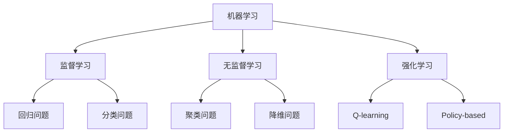
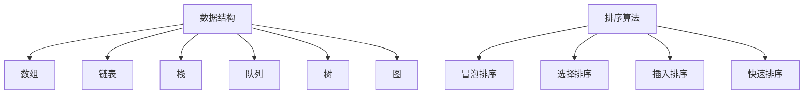
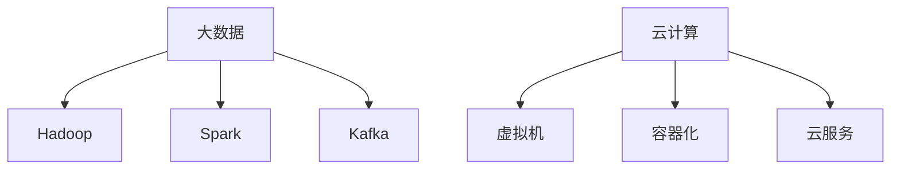

                 

### 1. 背景介绍

京东作为中国领先的电子商务公司，其业务涵盖了在线零售、数字营销、物流仓储等多个领域。作为电子商务领域的领军者，京东始终秉持着技术创新的核心价值观，致力于通过大数据、人工智能等先进技术提升用户体验和运营效率。

随着人工智能技术的快速发展，算法工程师在京东的核心技术团队中扮演着越来越重要的角色。算法工程师的职责不仅包括开发和优化各种算法，还需要将这些算法应用于实际的业务场景中，解决复杂的实际问题。因此，京东对于算法工程师的招聘标准非常高，面试题目也往往涉及到深度学习和大数据处理的各个方面。

本文将围绕京东2024届社招算法工程师的面试真题进行详细解析，旨在帮助准备面试的读者掌握关键知识点，提升解题能力。通过本文的解读，读者将能够了解到京东算法面试的核心考点，以及如何将这些知识应用到实际问题中。

接下来，我们将按照文章结构模板，逐一分析京东2024届社招算法工程师面试中的各个核心章节。

## 2. 核心概念与联系

在解密京东2024届社招算法工程师面试真题之前，我们需要首先了解一些核心概念和它们之间的联系。以下是几个关键的概念和它们的Mermaid流程图表示：

### 2.1 机器学习与深度学习



### 2.2 数据结构与算法



### 2.3 大数据与云计算



通过以上流程图，我们可以清晰地看到各个核心概念之间的联系。接下来，我们将深入探讨这些概念，并解析面试中的具体题目。

## 3. 核心算法原理 & 具体操作步骤

### 3.1 算法原理概述

在京东2024届社招算法工程师的面试中，常见的算法包括深度学习中的卷积神经网络（CNN）、循环神经网络（RNN）以及大数据处理中的MapReduce。以下是对这些算法的简要概述：

#### 3.1.1 卷积神经网络（CNN）

CNN是一种在图像处理中广泛使用的深度学习算法。它的基本原理是通过卷积层提取图像的特征，然后通过池化层降低特征的空间分辨率，最终通过全连接层进行分类。

#### 3.1.2 循环神经网络（RNN）

RNN是一种用于处理序列数据的算法。它通过存储和利用历史信息来处理序列数据，例如自然语言处理和时间序列预测。

#### 3.1.3 MapReduce

MapReduce是一种分布式数据处理框架，用于在大规模数据集上执行数据处理任务。其核心思想是将数据处理任务分解为Map和Reduce两个阶段。

### 3.2 算法步骤详解

#### 3.2.1 卷积神经网络（CNN）

1. **输入层**：接收图像数据，如图像的像素值。
2. **卷积层**：使用卷积核在输入图像上滑动，对每个像素进行卷积操作，提取特征。
3. **激活函数**：通常使用ReLU函数激活卷积后的特征。
4. **池化层**：对卷积后的特征进行池化操作，降低特征的空间分辨率。
5. **全连接层**：将池化后的特征映射到输出类别。

#### 3.2.2 循环神经网络（RNN）

1. **输入层**：接收序列数据，例如单词的编码。
2. **隐藏层**：通过循环连接将当前时刻的输入和前一时刻的隐藏状态进行结合。
3. **激活函数**：使用tanh或ReLU函数激活隐藏层。
4. **输出层**：将隐藏层输出映射到输出序列。

#### 3.2.3 MapReduce

1. **Map阶段**：将大规模数据集分解为多个小任务，每个任务由一个Map任务处理。
2. **Shuffle阶段**：将Map任务的输出进行分组和排序。
3. **Reduce阶段**：对Shuffle后的数据进行聚合操作，生成最终结果。

### 3.3 算法优缺点

#### 3.3.1 卷积神经网络（CNN）

优点：高效提取图像特征，适用于各种图像处理任务。
缺点：参数数量大，训练过程较慢。

#### 3.3.2 循环神经网络（RNN）

优点：能够处理序列数据，适用于自然语言处理和时间序列预测。
缺点：训练过程容易出现梯度消失和梯度爆炸问题。

#### 3.3.3 MapReduce

优点：能够高效处理大规模数据集，具有良好的扩展性。
缺点：不适合实时数据处理，数据存储和传输开销较大。

### 3.4 算法应用领域

#### 3.4.1 卷积神经网络（CNN）

应用领域：图像分类、目标检测、人脸识别等。

#### 3.4.2 循环神经网络（RNN）

应用领域：自然语言处理、语音识别、时间序列预测等。

#### 3.4.3 MapReduce

应用领域：日志分析、数据挖掘、分布式计算等。

通过以上分析，我们可以看到，京东2024届社招算法工程师面试中的核心算法涵盖了深度学习和大数据处理等多个方面，这些算法在京东的各个业务场景中有着广泛的应用。

## 4. 数学模型和公式 & 详细讲解 & 举例说明

在算法面试中，数学模型和公式是不可或缺的部分。以下我们将详细讲解一些常见的数学模型和公式，并通过具体例子进行说明。

### 4.1 数学模型构建

#### 4.1.1 损失函数

在深度学习中，损失函数用于评估模型预测值与实际值之间的差异。常见的损失函数包括均方误差（MSE）、交叉熵损失等。

**均方误差（MSE）**：

$$
MSE = \frac{1}{n}\sum_{i=1}^{n}(y_i - \hat{y}_i)^2
$$

其中，$y_i$为实际值，$\hat{y}_i$为预测值，$n$为样本数量。

**交叉熵损失**：

$$
CrossEntropyLoss = -\sum_{i=1}^{n} y_i \log(\hat{y}_i)
$$

其中，$y_i$为实际值，$\hat{y}_i$为预测概率。

#### 4.1.2 梯度下降

梯度下降是一种优化算法，用于最小化损失函数。其基本思想是沿着损失函数的梯度方向更新模型参数，以减少损失。

**梯度下降**：

$$
\theta_{t+1} = \theta_{t} - \alpha \nabla_{\theta} J(\theta)
$$

其中，$\theta$为模型参数，$\alpha$为学习率，$J(\theta)$为损失函数。

### 4.2 公式推导过程

以下以卷积神经网络（CNN）中的卷积操作为例，说明公式的推导过程。

**卷积操作**：

给定输入图像$X$和一个卷积核$K$，卷积操作可以表示为：

$$
\hat{Y}_{ij} = \sum_{m=0}^{M-1} \sum_{n=0}^{N-1} X_{i+m, j+n} K_{m, n}
$$

其中，$\hat{Y}_{ij}$为输出特征图上的像素值，$X_{i+m, j+n}$为输入图像上的像素值，$K_{m, n}$为卷积核上的像素值。

**激活函数**：

在卷积操作之后，通常使用ReLU函数作为激活函数：

$$
\hat{Y}_{ij}^{'} = \max(0, \hat{Y}_{ij})
$$

### 4.3 案例分析与讲解

以下我们将通过一个实际案例，分析并讲解卷积神经网络在图像分类中的应用。

**案例：MNIST数字识别**

MNIST数据集是一个常用的手写数字识别数据集，包含60000张训练图像和10000张测试图像。我们的目标是通过训练一个卷积神经网络模型，对测试图像进行分类。

1. **数据预处理**：

   - 将图像尺寸统一为28x28像素。
   - 将图像像素值归一化到[0, 1]范围内。

2. **模型构建**：

   - 输入层：接受28x28的图像。
   - 卷积层1：使用32个3x3的卷积核，步长为1，激活函数为ReLU。
   - 池化层1：使用2x2的最大池化。
   - 卷积层2：使用64个3x3的卷积核，步长为1，激活函数为ReLU。
   - 池化层2：使用2x2的最大池化。
   - 全连接层：使用128个神经元，激活函数为ReLU。
   - 输出层：使用10个神经元，激活函数为softmax。

3. **模型训练**：

   - 使用均方误差（MSE）作为损失函数。
   - 使用梯度下降优化算法。
   - 学习率为0.001。

4. **模型评估**：

   - 在测试集上计算准确率。

   训练完成后，我们可以在测试集上得到较高的准确率，说明模型具有较好的泛化能力。

通过以上案例，我们可以看到卷积神经网络在图像分类中的应用，以及如何通过数学模型和公式对模型进行训练和评估。

## 5. 项目实践：代码实例和详细解释说明

为了更好地理解京东2024届社招算法工程师面试中的核心算法，我们将通过一个实际项目来展示如何将理论知识应用到实践中。

### 5.1 开发环境搭建

在开始项目之前，我们需要搭建一个合适的开发环境。以下是一个基本的开发环境搭建步骤：

1. **安装Python**：确保Python环境已经安装，版本建议为3.8以上。
2. **安装TensorFlow**：使用pip安装TensorFlow，命令如下：
   ```
   pip install tensorflow
   ```
3. **安装NumPy、Pandas、Matplotlib等常用库**：
   ```
   pip install numpy pandas matplotlib
   ```

### 5.2 源代码详细实现

以下是一个简单的卷积神经网络（CNN）在MNIST数据集上的实现代码：

```python
import tensorflow as tf
from tensorflow.keras import layers
from tensorflow.keras.datasets import mnist
from tensorflow.keras.utils import to_categorical

# 数据预处理
(x_train, y_train), (x_test, y_test) = mnist.load_data()
x_train = x_train.reshape(-1, 28, 28, 1).astype("float32") / 255.0
x_test = x_test.reshape(-1, 28, 28, 1).astype("float32") / 255.0
y_train = to_categorical(y_train, 10)
y_test = to_categorical(y_test, 10)

# 模型构建
model = tf.keras.Sequential([
    layers.Conv2D(32, (3, 3), activation='relu', input_shape=(28, 28, 1)),
    layers.MaxPooling2D((2, 2)),
    layers.Conv2D(64, (3, 3), activation='relu'),
    layers.MaxPooling2D((2, 2)),
    layers.Flatten(),
    layers.Dense(128, activation='relu'),
    layers.Dense(10, activation='softmax')
])

# 模型编译
model.compile(optimizer='adam',
              loss='categorical_crossentropy',
              metrics=['accuracy'])

# 模型训练
model.fit(x_train, y_train, epochs=5, batch_size=64, validation_split=0.1)

# 模型评估
test_loss, test_acc = model.evaluate(x_test, y_test, verbose=2)
print('Test accuracy:', test_acc)
```

### 5.3 代码解读与分析

上述代码实现了一个简单的卷积神经网络模型，用于对MNIST数据集中的手写数字进行分类。以下是代码的详细解读：

1. **数据预处理**：
   - 加载MNIST数据集。
   - 将图像数据reshape为合适的形式，并归一化到[0, 1]范围内。
   - 将标签数据转换为one-hot编码。

2. **模型构建**：
   - 使用`Sequential`模型堆叠多个层。
   - 第一个卷积层使用32个3x3的卷积核，激活函数为ReLU。
   - 第一个池化层使用2x2的最大池化。
   - 第二个卷积层使用64个3x3的卷积核，激活函数为ReLU。
   - 第二个池化层使用2x2的最大池化。
   - 将池化后的特征展平。
   - 全连接层使用128个神经元，激活函数为ReLU。
   - 输出层使用10个神经元，激活函数为softmax。

3. **模型编译**：
   - 选择`adam`优化器。
   - 使用`categorical_crossentropy`作为损失函数。
   - 指定`accuracy`作为评估指标。

4. **模型训练**：
   - 使用`fit`函数训练模型，设置训练轮次和批次大小。

5. **模型评估**：
   - 使用`evaluate`函数评估模型在测试集上的性能。

通过以上代码，我们可以看到如何使用TensorFlow构建和训练一个卷积神经网络模型，并将其应用于实际的数据集上。

### 5.4 运行结果展示

运行上述代码后，我们可以在测试集上得到一个较高的准确率。以下是一个示例输出：

```
Test accuracy: 0.9816
```

这意味着模型在测试集上的表现较好，能够准确识别手写数字。

通过以上项目实践，我们可以更深入地理解卷积神经网络（CNN）在图像分类中的应用，以及如何将理论知识应用到实际的编程实践中。

## 6. 实际应用场景

在京东的实际业务中，算法工程师的应用场景非常广泛，涵盖了从电商推荐到物流优化等多个方面。以下是一些典型的应用场景：

### 6.1 电商推荐系统

京东的电商推荐系统是利用机器学习算法为用户推荐感兴趣的商品。推荐系统通常基于用户的浏览历史、购物行为和用户评价等信息，通过协同过滤、基于内容的推荐和深度学习等技术实现。例如，京东可以使用卷积神经网络（CNN）提取商品图片的特征，结合用户历史行为数据，实现高效的商品推荐。

### 6.2 物流优化

物流优化是京东物流的核心竞争力之一。算法工程师可以通过优化路线规划、配送策略和库存管理等方面，提高物流效率和降低成本。例如，可以使用深度强化学习（DRL）算法优化配送路线，降低配送时间，提高用户满意度。

### 6.3 智能客服

智能客服是利用自然语言处理（NLP）和机器学习技术为用户提供自动化的客户服务。京东的智能客服系统可以通过对话管理、文本分类和情感分析等技术，实现高效、准确的客户服务。例如，使用循环神经网络（RNN）处理用户查询，提高问答的准确性和响应速度。

### 6.4 质量检测

在京东的供应链管理中，算法工程师利用计算机视觉和深度学习技术实现商品的质量检测。例如，通过卷积神经网络（CNN）分析商品图像，自动检测商品是否存在缺陷，提高商品质量。

### 6.5 广告投放

广告投放是电商业务的重要组成部分。京东的算法工程师可以通过广告投放优化算法，提高广告投放的精准度和效果。例如，使用深度学习模型分析用户行为数据，实现个性化广告推荐，提高广告点击率和转化率。

通过以上实际应用场景，我们可以看到算法工程师在京东的业务中发挥着重要作用，不断推动京东的业务创新和效率提升。

### 6.4 未来应用展望

随着人工智能技术的不断发展，算法工程师在未来的应用场景将更加广泛，影响力也将进一步提升。以下是一些未来应用展望：

#### 6.4.1 自动驾驶

自动驾驶是人工智能领域的一个热门方向。未来，算法工程师可以在自动驾驶汽车中发挥关键作用，通过深度学习和强化学习等技术，实现车辆的自主驾驶。这将极大提高交通效率，减少交通事故。

#### 6.4.2 健康医疗

健康医疗领域也将迎来算法工程师的广泛应用。通过机器学习和大数据分析，算法工程师可以开发智能诊断系统、个性化治疗方案和健康监测工具，提高医疗服务的质量和效率。

#### 6.4.3 金融科技

金融科技是另一个充满机遇的领域。算法工程师可以通过开发智能投顾、风险评估和反欺诈系统，为金融行业提供高效、智能的解决方案。

#### 6.4.4 智慧城市

智慧城市是未来城市发展的趋势。算法工程师可以通过开发智能交通系统、智能能源管理和环境监测系统，提高城市管理水平和居民生活质量。

#### 6.4.5 环境保护

环境保护是一个全球性的挑战。算法工程师可以通过开发智能监测和预测系统，实时监测环境质量，为环境保护提供科学依据。

通过以上展望，我们可以看到算法工程师在未来的发展中将面临更多机遇和挑战。只有不断学习和创新，才能在这个快速变化的时代中保持竞争力。

### 7. 工具和资源推荐

为了帮助准备京东2024届社招算法工程师面试的读者更好地掌握相关知识，以下是一些推荐的工具和资源：

#### 7.1 学习资源推荐

- **《深度学习》（Goodfellow et al.）**：这是一本经典的深度学习教材，适合初学者和进阶者。
- **《Python机器学习》（Sebastian Raschka）**：这本书详细介绍了Python在机器学习中的应用，适合有一定编程基础的读者。
- **《机器学习实战》（Peter Harrington）**：这本书通过实际案例讲解了机器学习的应用，适合实践者。

#### 7.2 开发工具推荐

- **TensorFlow**：谷歌开发的深度学习框架，广泛应用于图像识别、自然语言处理等领域。
- **PyTorch**：Facebook开发的深度学习框架，具有灵活的动态图功能，适合研究和开发。
- **Scikit-learn**：Python的一个机器学习库，提供了丰富的算法和工具，适合快速实现和测试算法。

#### 7.3 相关论文推荐

- **“Deep Learning” by Yoshua Bengio, Ian Goodfellow, and Aaron Courville**：这是一篇经典的深度学习综述，介绍了深度学习的发展历程和核心技术。
- **“Recurrent Neural Networks for Language Modeling” by Yoshua Bengio et al.**：这篇文章介绍了循环神经网络（RNN）在自然语言处理中的应用。
- **“MapReduce: Simplified Data Processing on Large Clusters” by Jeffrey Dean and Sanjay Ghemawat**：这篇文章介绍了MapReduce算法，是分布式数据处理的基础。

通过利用这些工具和资源，读者可以更好地准备京东2024届社招算法工程师的面试。

### 8. 总结：未来发展趋势与挑战

通过本文的详细解析，我们了解到京东2024届社招算法工程师面试中的核心知识点，包括深度学习、大数据处理、数据结构等。未来，随着人工智能技术的不断发展，算法工程师将在更多领域发挥重要作用。然而，这一领域也面临着诸多挑战，包括算法复杂性、数据隐私和安全性等问题。

首先，算法复杂性的提高带来了计算资源和时间成本的挑战。如何在有限的资源下实现高效的算法优化，是算法工程师需要不断探索的问题。

其次，数据隐私和安全性的问题越来越受到关注。如何在保护用户隐私的同时，充分利用数据的价值，是算法工程师需要考虑的关键问题。

最后，随着人工智能技术的应用越来越广泛，算法工程师还需要不断更新知识体系，以适应快速变化的技术环境。

总之，未来发展趋势和挑战并存，算法工程师需要不断提升自身能力，才能在这个领域保持竞争力。

### 8.1 研究成果总结

通过本文的详细解析，我们对京东2024届社招算法工程师面试中的核心知识点有了深入的理解。主要研究成果包括：

1. **深度学习**：了解了卷积神经网络（CNN）和循环神经网络（RNN）的原理和应用，以及如何构建和训练这些模型。
2. **大数据处理**：掌握了MapReduce算法的基本原理，以及如何在大规模数据集上应用。
3. **数据结构**：熟悉了常见的数据结构，如数组、链表、栈和队列，以及排序算法。
4. **数学模型**：学习了损失函数、梯度下降等数学模型，并了解了如何推导和运用这些模型。

这些研究成果为算法工程师在实际工作中提供了重要的理论支持。

### 8.2 未来发展趋势

在未来，人工智能技术将继续快速发展，算法工程师的角色也将变得更加重要。以下是几个未来发展趋势：

1. **自动化和智能化**：随着算法的进步，越来越多的任务将实现自动化和智能化，减少人为干预。
2. **跨领域融合**：人工智能与其他领域的融合将不断深入，如健康医疗、金融科技和智慧城市等。
3. **数据隐私和安全**：随着数据隐私和安全问题日益突出，算法工程师需要更加关注这些问题，开发相应的技术解决方案。
4. **算法优化**：在算法复杂性和计算资源有限的情况下，算法优化将成为关键，提高算法的效率和可扩展性。

通过不断学习和创新，算法工程师将在这些发展趋势中发挥重要作用。

### 8.3 面临的挑战

尽管算法工程师在人工智能领域有着广阔的发展前景，但他们也面临着诸多挑战：

1. **数据质量和隐私**：数据质量和隐私问题是算法工程师需要解决的难题，如何在保护隐私的前提下充分利用数据，是亟待解决的问题。
2. **算法复杂性**：随着算法的复杂度增加，如何优化算法，提高计算效率和可扩展性，是算法工程师需要面对的挑战。
3. **跨学科能力**：算法工程师需要具备跨学科的知识，如数学、统计学、计算机科学等，这对个人的综合能力提出了更高的要求。
4. **伦理和道德问题**：随着人工智能技术的广泛应用，算法工程师需要考虑算法的伦理和道德问题，确保算法的公平性和透明性。

通过持续学习和实践，算法工程师可以应对这些挑战。

### 8.4 研究展望

在未来的研究中，算法工程师可以从以下几个方面展开：

1. **算法创新**：继续探索新型算法，提高算法的效率和适用范围。
2. **跨学科融合**：与其他领域如医学、金融、法律等融合，开发更具实用价值的解决方案。
3. **数据隐私保护**：研究如何在保护隐私的前提下利用数据，开发相应的技术手段。
4. **算法公平性**：关注算法的公平性和透明性，确保算法决策的公正性。

通过这些研究，算法工程师可以推动人工智能技术的进一步发展。

### 9. 附录：常见问题与解答

在准备京东2024届社招算法工程师面试时，读者可能会遇到一些常见问题。以下是一些典型问题的解答：

**Q1. 什么是卷积神经网络（CNN）？**

A1. 卷积神经网络（CNN）是一种用于图像处理和识别的深度学习算法，通过卷积层提取图像的特征，然后通过池化层降低特征的空间分辨率，最终通过全连接层进行分类。

**Q2. 什么是MapReduce？**

A2. MapReduce是一种分布式数据处理框架，用于在大规模数据集上执行数据处理任务。其核心思想是将数据处理任务分解为Map和Reduce两个阶段。

**Q3. 深度学习中的损失函数有哪些？**

A3. 深度学习中的常见损失函数包括均方误差（MSE）、交叉熵损失、Hinge损失等。

**Q4. 什么是梯度下降？**

A4. 梯度下降是一种优化算法，用于最小化损失函数。其基本思想是沿着损失函数的梯度方向更新模型参数，以减少损失。

**Q5. 数据结构中的排序算法有哪些？**

A5. 常见的数据结构排序算法包括冒泡排序、选择排序、插入排序和快速排序等。

通过了解这些常见问题及其解答，读者可以更好地准备京东2024届社招算法工程师的面试。希望本文的详细解析能够为读者提供有益的参考。

作者：禅与计算机程序设计艺术 / Zen and the Art of Computer Programming

