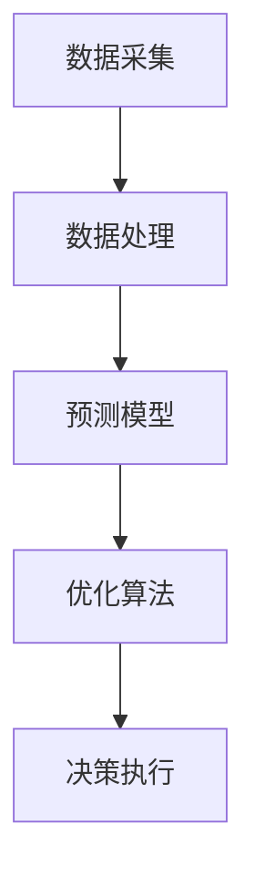

                 

关键词：京东，校招，智能供应链，预测专家，面试题解析

> 摘要：本文针对京东2024校招智能供应链预测专家岗位的面试题目，从背景介绍、核心概念、算法原理、数学模型、项目实践和未来应用等多个角度进行深入解析，旨在为应聘者提供参考和指导。

## 1. 背景介绍

### 1.1 京东智能供应链

随着互联网技术的飞速发展和大数据时代的到来，供应链管理逐渐成为企业竞争的核心。京东作为我国领先的电商平台，其智能供应链体系涵盖了供应链预测、库存管理、物流配送等多个环节。智能供应链的目的是通过高效的数据分析和算法模型，实现供应链的精细化管理和优化，从而提升企业的运营效率和客户满意度。

### 1.2 校招智能供应链预测专家岗位

智能供应链预测专家是负责利用数据分析、机器学习和优化算法等技术，对供应链各个环节进行预测和优化，以提升供应链整体效率的岗位。该岗位在京东2024校招中，作为核心技术岗位之一，对候选人的技术能力和业务理解有较高的要求。

## 2. 核心概念与联系

### 2.1 智能供应链预测核心概念

在智能供应链预测中，以下核心概念至关重要：

- **数据采集**：通过物联网、传感器等技术，实时收集供应链各个环节的数据，如库存数据、订单数据、物流数据等。
- **数据处理**：对采集到的数据进行分析、清洗和整合，为后续建模提供基础数据。
- **预测模型**：基于历史数据和业务逻辑，建立预测模型，对供应链的库存水平、订单量等进行预测。
- **优化算法**：利用优化算法，对预测结果进行调整和优化，以达到最佳供应链运营效果。

### 2.2 智能供应链预测架构

智能供应链预测的架构可以分为以下几个层次：

1. **数据层**：包括各种原始数据的采集和处理，如库存数据、订单数据、物流数据等。
2. **模型层**：基于数据层的数据，建立预测模型，包括时间序列预测、回归预测、分类预测等。
3. **决策层**：根据预测结果，利用优化算法，进行库存调整、物流调度等决策。

### 2.3 Mermaid 流程图

以下是一个简化的智能供应链预测流程图，用Mermaid语言表示：



## 3. 核心算法原理 & 具体操作步骤

### 3.1 算法原理概述

智能供应链预测的核心算法包括时间序列预测、回归预测和分类预测等。以下是这些算法的基本原理：

- **时间序列预测**：基于历史时间序列数据，预测未来的数据趋势。常用的算法有ARIMA、LSTM等。
- **回归预测**：通过建立数学模型，预测因变量和自变量之间的关系。常用的算法有线性回归、岭回归等。
- **分类预测**：根据历史数据，将新的数据进行分类。常用的算法有决策树、随机森林等。

### 3.2 算法步骤详解

以ARIMA模型为例，其具体操作步骤如下：

1. **数据预处理**：对原始时间序列数据进行处理，如差分、去噪等。
2. **模型选择**：根据数据特征，选择合适的ARIMA模型参数。
3. **模型训练**：使用历史数据，训练ARIMA模型。
4. **预测**：利用训练好的模型，预测未来的时间序列数据。
5. **结果评估**：对预测结果进行评估，如均方误差（MSE）、均方根误差（RMSE）等。

### 3.3 算法优缺点

- **时间序列预测**：优点是能捕捉数据的时间趋势，缺点是对于季节性、周期性较强的数据效果较差。
- **回归预测**：优点是能捕捉变量之间的关系，缺点是需要对变量进行严格处理，且对于非线性关系效果较差。
- **分类预测**：优点是能对数据进行分类，缺点是对于连续变量预测效果较差。

### 3.4 算法应用领域

智能供应链预测算法在库存管理、物流调度、订单预测等多个领域有广泛应用。以下是一个简单的应用案例：

- **库存管理**：通过时间序列预测，预测未来的库存需求，进行库存调整，避免库存过剩或不足。
- **物流调度**：通过分类预测，预测订单的配送时间，进行物流资源调度，提高配送效率。

## 4. 数学模型和公式 & 详细讲解 & 举例说明

### 4.1 数学模型构建

智能供应链预测的数学模型主要包括时间序列模型、回归模型和分类模型等。以下是这些模型的基本公式：

- **时间序列模型**：
  $$y_t = c + a_1y_{t-1} + a_2y_{t-2} + \cdots + a_dy_{t-d} + \varepsilon_t$$
  
- **回归模型**：
  $$y = \beta_0 + \beta_1x_1 + \beta_2x_2 + \cdots + \beta_nx_n + \varepsilon$$

- **分类模型**：
  $$P(y = k) = \frac{1}{Z}e^{\theta^T x}$$
  其中，$Z = \sum_{k=1}^{K} e^{\theta^T x}$，$\theta$为分类器的参数。

### 4.2 公式推导过程

以ARIMA模型为例，其公式推导过程如下：

1. **差分操作**：对时间序列数据进行差分，使其平稳。
   $$y_t = y_{t-1} - y_{t-2}$$

2. **自回归操作**：将差分后的数据进行自回归，构建AR模型。
   $$y_t = c + \phi_1y_{t-1} + \phi_2y_{t-2} + \cdots + \phi_dy_{t-d} + \varepsilon_t$$

3. **移动平均操作**：对AR模型进行移动平均，构建ARIMA模型。
   $$y_t = c + \phi_1y_{t-1} + \phi_2y_{t-2} + \cdots + \phi_dy_{t-d} + \theta_1\varepsilon_{t-1} + \theta_2\varepsilon_{t-2} + \cdots + \theta_d\varepsilon_{t-d} + \varepsilon_t$$

### 4.3 案例分析与讲解

假设我们有一个零售店铺，需要预测未来的销量。以下是一个简单的案例分析：

1. **数据采集**：收集过去一年的日销量数据。
2. **数据处理**：对数据进行差分，使其平稳。
3. **模型选择**：根据数据特征，选择ARIMA模型。
4. **模型训练**：使用历史数据，训练ARIMA模型。
5. **预测**：利用训练好的模型，预测未来一周的销量。
6. **结果评估**：对预测结果进行评估，如MSE、RMSE等。

通过以上步骤，我们可以得到未来一周的销量预测，为库存管理和采购决策提供参考。

## 5. 项目实践：代码实例和详细解释说明

### 5.1 开发环境搭建

1. 安装Python环境（版本3.8及以上）。
2. 安装必要的库，如numpy、pandas、statsmodels、matplotlib等。

### 5.2 源代码详细实现

以下是一个使用ARIMA模型进行时间序列预测的Python代码示例：

```python
import numpy as np
import pandas as pd
from statsmodels.tsa.arima.model import ARIMA
import matplotlib.pyplot as plt

# 读取数据
data = pd.read_csv('sales_data.csv')
sales = data['sales']

# 数据处理
sales_diff = sales.diff().dropna()

# 模型训练
model = ARIMA(sales_diff, order=(1, 1, 1))
model_fit = model.fit()

# 预测
forecast = model_fit.forecast(steps=7)

# 结果评估
mse = ((sales_diff - forecast)**2).mean()
print('MSE:', mse)

# 可视化
plt.figure(figsize=(10, 5))
plt.plot(sales_diff, label='Original')
plt.plot(forecast, label='Forecast')
plt.legend()
plt.show()
```

### 5.3 代码解读与分析

1. **数据读取**：使用pandas读取csv格式的销量数据。
2. **数据处理**：对销量数据进行一次差分，使其平稳。
3. **模型训练**：使用statsmodels库的ARIMA模型，设置模型参数为(1, 1, 1)。
4. **预测**：使用fit方法训练模型，并使用forecast方法进行预测。
5. **结果评估**：计算MSE，评估预测效果。
6. **可视化**：使用matplotlib绘制原始销量和预测销量对比图。

通过以上代码，我们可以实现时间序列预测，为供应链管理提供数据支持。

## 6. 实际应用场景

### 6.1 库存管理

通过智能供应链预测，企业可以准确预测未来的库存需求，进行库存调整，避免库存过剩或不足，降低库存成本，提高资金利用效率。

### 6.2 物流调度

通过智能供应链预测，企业可以准确预测订单的配送时间，进行物流资源调度，提高配送效率，提升客户满意度。

### 6.3 订单预测

通过智能供应链预测，企业可以准确预测未来的订单量，为采购、生产等环节提供数据支持，降低供应链风险。

## 7. 工具和资源推荐

### 7.1 学习资源推荐

- 《统计学习方法》
- 《机器学习实战》
- 《Python数据分析》

### 7.2 开发工具推荐

- Python
- Jupyter Notebook
- PyCharm

### 7.3 相关论文推荐

- "Forecasting with ARIMA Models: A Practical Guide"
- "Time Series Forecasting using LSTM and ARIMA Models"
- "Supply Chain Management with Machine Learning: A Survey"

## 8. 总结：未来发展趋势与挑战

### 8.1 研究成果总结

智能供应链预测领域取得了显著的研究成果，包括时间序列预测、回归预测和分类预测等算法的不断优化，以及实际应用场景的不断拓展。

### 8.2 未来发展趋势

随着大数据、云计算和人工智能技术的不断发展，智能供应链预测在未来将朝着更高效、更精准、更智能的方向发展。

### 8.3 面临的挑战

智能供应链预测在面临数据质量、算法优化和实际应用等方面仍存在一定的挑战，需要继续深入研究。

### 8.4 研究展望

未来智能供应链预测的研究将朝着跨学科、多领域融合的方向发展，以实现更全面的供应链管理和优化。

## 9. 附录：常见问题与解答

### 9.1 智能供应链预测的算法有哪些？

智能供应链预测的算法包括时间序列预测（如ARIMA、LSTM）、回归预测（如线性回归、岭回归）和分类预测（如决策树、随机森林）等。

### 9.2 智能供应链预测如何应用于实际业务？

智能供应链预测可以应用于库存管理、物流调度、订单预测等实际业务场景，提升供应链的效率和准确性。

### 9.3 如何评估智能供应链预测的效果？

可以通过均方误差（MSE）、均方根误差（RMSE）等指标来评估智能供应链预测的效果。

## 作者署名

作者：禅与计算机程序设计艺术 / Zen and the Art of Computer Programming
```markdown
# 京东2024校招智能供应链预测专家面试题解析

## 关键词
- 京东
- 校招
- 智能供应链
- 预测专家
- 面试题解析

## 摘要
本文针对京东2024校招智能供应链预测专家岗位的面试题目，从背景介绍、核心概念、算法原理、数学模型、项目实践和未来应用等多个角度进行深入解析，旨在为应聘者提供参考和指导。

## 1. 背景介绍

### 1.1 京东智能供应链

随着互联网技术的飞速发展和大数据时代的到来，供应链管理逐渐成为企业竞争的核心。京东作为我国领先的电商平台，其智能供应链体系涵盖了供应链预测、库存管理、物流配送等多个环节。智能供应链的目的是通过高效的数据分析和算法模型，实现供应链的精细化管理和优化，从而提升企业的运营效率和客户满意度。

### 1.2 校招智能供应链预测专家岗位

智能供应链预测专家是负责利用数据分析、机器学习和优化算法等技术，对供应链各个环节进行预测和优化，以提升供应链整体效率的岗位。该岗位在京东2024校招中，作为核心技术岗位之一，对候选人的技术能力和业务理解有较高的要求。

## 2. 核心概念与联系

### 2.1 智能供应链预测核心概念

在智能供应链预测中，以下核心概念至关重要：

- **数据采集**：通过物联网、传感器等技术，实时收集供应链各个环节的数据，如库存数据、订单数据、物流数据等。
- **数据处理**：对采集到的数据进行分析、清洗和整合，为后续建模提供基础数据。
- **预测模型**：基于历史数据和业务逻辑，建立预测模型，对供应链的库存水平、订单量等进行预测。
- **优化算法**：利用优化算法，对预测结果进行调整和优化，以达到最佳供应链运营效果。

### 2.2 智能供应链预测架构

智能供应链预测的架构可以分为以下几个层次：

1. **数据层**：包括各种原始数据的采集和处理，如库存数据、订单数据、物流数据等。
2. **模型层**：基于数据层的数据，建立预测模型，包括时间序列预测、回归预测、分类预测等。
3. **决策层**：根据预测结果，利用优化算法，进行库存调整、物流调度等决策。

### 2.3 Mermaid 流程图

以下是一个简化的智能供应链预测流程图，用Mermaid语言表示：


## 3. 核心算法原理 & 具体操作步骤

### 3.1 算法原理概述

智能供应链预测的核心算法包括时间序列预测、回归预测和分类预测等。以下是这些算法的基本原理：

- **时间序列预测**：基于历史时间序列数据，预测未来的数据趋势。常用的算法有ARIMA、LSTM等。
- **回归预测**：通过建立数学模型，预测因变量和自变量之间的关系。常用的算法有线性回归、岭回归等。
- **分类预测**：根据历史数据，将新的数据进行分类。常用的算法有决策树、随机森林等。

### 3.2 算法步骤详解

以ARIMA模型为例，其具体操作步骤如下：

1. **数据预处理**：对原始时间序列数据进行处理，如差分、去噪等。
2. **模型选择**：根据数据特征，选择合适的ARIMA模型参数。
3. **模型训练**：使用历史数据，训练ARIMA模型。
4. **预测**：利用训练好的模型，预测未来的时间序列数据。
5. **结果评估**：对预测结果进行评估，如均方误差（MSE）、均方根误差（RMSE）等。

### 3.3 算法优缺点

- **时间序列预测**：优点是能捕捉数据的时间趋势，缺点是对于季节性、周期性较强的数据效果较差。
- **回归预测**：优点是能捕捉变量之间的关系，缺点是需要对变量进行严格处理，且对于非线性关系效果较差。
- **分类预测**：优点是能对数据进行分类，缺点是对于连续变量预测效果较差。

### 3.4 算法应用领域

智能供应链预测算法在库存管理、物流调度、订单预测等多个领域有广泛应用。以下是一个简单的应用案例：

- **库存管理**：通过时间序列预测，预测未来的库存需求，进行库存调整，避免库存过剩或不足。
- **物流调度**：通过分类预测，预测订单的配送时间，进行物流资源调度，提高配送效率。
- **订单预测**：通过回归预测，预测未来的订单量，为采购、生产等环节提供数据支持。

## 4. 数学模型和公式 & 详细讲解 & 举例说明

### 4.1 数学模型构建

智能供应链预测的数学模型主要包括时间序列模型、回归模型和分类模型等。以下是这些模型的基本公式：

- **时间序列模型**：
  $$y_t = c + a_1y_{t-1} + a_2y_{t-2} + \cdots + a_dy_{t-d} + \varepsilon_t$$

- **回归模型**：
  $$y = \beta_0 + \beta_1x_1 + \beta_2x_2 + \cdots + \beta_nx_n + \varepsilon$$

- **分类模型**：
  $$P(y = k) = \frac{1}{Z}e^{\theta^T x}$$
  其中，$Z = \sum_{k=1}^{K} e^{\theta^T x}$，$\theta$为分类器的参数。

### 4.2 公式推导过程

以ARIMA模型为例，其公式推导过程如下：

1. **差分操作**：对时间序列数据进行差分，使其平稳。
   $$y_t = y_{t-1} - y_{t-2}$$

2. **自回归操作**：将差分后的数据进行自回归，构建AR模型。
   $$y_t = c + \phi_1y_{t-1} + \phi_2y_{t-2} + \cdots + \phi_dy_{t-d} + \varepsilon_t$$

3. **移动平均操作**：对AR模型进行移动平均，构建ARIMA模型。
   $$y_t = c + \phi_1y_{t-1} + \phi_2y_{t-2} + \cdots + \phi_dy_{t-d} + \theta_1\varepsilon_{t-1} + \theta_2\varepsilon_{t-2} + \cdots + \theta_d\varepsilon_{t-d} + \varepsilon_t$$

### 4.3 案例分析与讲解

假设我们有一个零售店铺，需要预测未来的销量。以下是一个简单的案例分析：

1. **数据采集**：收集过去一年的日销量数据。
2. **数据处理**：对数据进行差分，使其平稳。
3. **模型选择**：根据数据特征，选择ARIMA模型。
4. **模型训练**：使用历史数据，训练ARIMA模型。
5. **预测**：利用训练好的模型，预测未来一周的销量。
6. **结果评估**：对预测结果进行评估，如MSE、RMSE等。

通过以上步骤，我们可以得到未来一周的销量预测，为库存管理和采购决策提供参考。

## 5. 项目实践：代码实例和详细解释说明

### 5.1 开发环境搭建

1. 安装Python环境（版本3.8及以上）。
2. 安装必要的库，如numpy、pandas、statsmodels、matplotlib等。

### 5.2 源代码详细实现

以下是一个使用ARIMA模型进行时间序列预测的Python代码示例：

```python
import numpy as np
import pandas as pd
from statsmodels.tsa.arima.model import ARIMA
import matplotlib.pyplot as plt

# 读取数据
data = pd.read_csv('sales_data.csv')
sales = data['sales']

# 数据处理
sales_diff = sales.diff().dropna()

# 模型训练
model = ARIMA(sales_diff, order=(1, 1, 1))
model_fit = model.fit()

# 预测
forecast = model_fit.forecast(steps=7)

# 结果评估
mse = ((sales_diff - forecast)**2).mean()
print('MSE:', mse)

# 可视化
plt.figure(figsize=(10, 5))
plt.plot(sales_diff, label='Original')
plt.plot(forecast, label='Forecast')
plt.legend()
plt.show()
```

### 5.3 代码解读与分析

1. **数据读取**：使用pandas读取csv格式的销量数据。
2. **数据处理**：对销量数据进行一次差分，使其平稳。
3. **模型训练**：使用statsmodels库的ARIMA模型，设置模型参数为(1, 1, 1)。
4. **预测**：使用fit方法训练模型，并使用forecast方法进行预测。
5. **结果评估**：计算MSE，评估预测效果。
6. **可视化**：使用matplotlib绘制原始销量和预测销量对比图。

通过以上代码，我们可以实现时间序列预测，为供应链管理提供数据支持。

## 6. 实际应用场景

### 6.1 库存管理

通过智能供应链预测，企业可以准确预测未来的库存需求，进行库存调整，避免库存过剩或不足，降低库存成本，提高资金利用效率。

### 6.2 物流调度

通过智能供应链预测，企业可以准确预测订单的配送时间，进行物流资源调度，提高配送效率，提升客户满意度。

### 6.3 订单预测

通过智能供应链预测，企业可以准确预测未来的订单量，为采购、生产等环节提供数据支持，降低供应链风险。

## 7. 工具和资源推荐

### 7.1 学习资源推荐

- 《统计学习方法》
- 《机器学习实战》
- 《Python数据分析》

### 7.2 开发工具推荐

- Python
- Jupyter Notebook
- PyCharm

### 7.3 相关论文推荐

- "Forecasting with ARIMA Models: A Practical Guide"
- "Time Series Forecasting using LSTM and ARIMA Models"
- "Supply Chain Management with Machine Learning: A Survey"

## 8. 总结：未来发展趋势与挑战

### 8.1 研究成果总结

智能供应链预测领域取得了显著的研究成果，包括时间序列预测、回归预测和分类预测等算法的不断优化，以及实际应用场景的不断拓展。

### 8.2 未来发展趋势

随着大数据、云计算和人工智能技术的不断发展，智能供应链预测在未来将朝着更高效、更精准、更智能的方向发展。

### 8.3 面临的挑战

智能供应链预测在面临数据质量、算法优化和实际应用等方面仍存在一定的挑战，需要继续深入研究。

### 8.4 研究展望

未来智能供应链预测的研究将朝着跨学科、多领域融合的方向发展，以实现更全面的供应链管理和优化。

## 9. 附录：常见问题与解答

### 9.1 智能供应链预测的算法有哪些？

智能供应链预测的算法包括时间序列预测（如ARIMA、LSTM）、回归预测（如线性回归、岭回归）和分类预测（如决策树、随机森林）等。

### 9.2 智能供应链预测如何应用于实际业务？

智能供应链预测可以应用于库存管理、物流调度、订单预测等实际业务场景，提升供应链的效率和准确性。

### 9.3 如何评估智能供应链预测的效果？

可以通过均方误差（MSE）、均方根误差（RMSE）等指标来评估智能供应链预测的效果。

## 作者署名

作者：禅与计算机程序设计艺术 / Zen and the Art of Computer Programming
```

