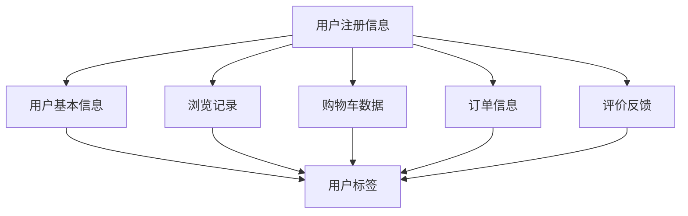

                 

关键词：京东、全渠道用户画像、系统架构、社招面试、攻略

摘要：本文旨在为有意向加入京东全渠道用户画像团队的架构师提供一份详尽的面试攻略。本文将深入分析京东用户画像系统的核心概念、架构设计、算法原理、数学模型、项目实践以及实际应用场景，并探讨未来的发展趋势与挑战。

## 1. 背景介绍

在数字化转型的浪潮下，用户画像已成为企业洞察用户需求、优化用户体验、提升营销效率的重要手段。京东作为中国领先的电商平台，对用户画像有着深入的研究和实践。京东2025全渠道用户画像系统旨在整合线上线下渠道数据，构建一个全面的用户画像，以支持精细化运营和个性化推荐。

## 2. 核心概念与联系

用户画像：用户画像是对用户特征的抽象表示，包括用户的基本信息、行为数据、消费偏好等多个维度。

数据源：数据源包括用户注册信息、浏览记录、购物车数据、订单信息、评价反馈等。

用户标签：用户标签是对用户属性的标签化表示，如年龄段、消费水平、兴趣爱好等。

### Mermaid 流程图：



## 3. 核心算法原理 & 具体操作步骤

### 3.1 算法原理概述

用户画像系统主要依赖以下几种算法：

- 数据预处理：清洗和整合各类数据源，保证数据质量。
- 用户分群：基于用户的共同特征，将用户划分为不同的群体。
- 用户标签生成：基于用户的行为数据和分群结果，为每个用户生成标签。
- 用户画像更新：定期更新用户的画像信息，保证画像的实时性和准确性。

### 3.2 算法步骤详解

1. 数据预处理
   - 数据清洗：去除重复数据、处理缺失值、纠正错误数据等。
   - 数据整合：将不同数据源的数据进行统一处理，如时间戳的统一、数据格式的统一等。

2. 用户分群
   - 特征提取：从用户数据中提取出关键的描述性特征。
   - 聚类算法：使用聚类算法，如K-Means、DBSCAN等，将用户分为不同的群体。

3. 用户标签生成
   - 标签分类：将用户的共同特征映射为标签。
   - 标签权重计算：根据用户行为和分群结果，为每个标签分配权重。

4. 用户画像更新
   - 定期采集：定期采集用户的新数据。
   - 画像更新：根据新数据，更新用户的画像信息。

### 3.3 算法优缺点

- 数据预处理：优点是提高数据质量，缺点是处理过程复杂，耗时较长。
- 用户分群：优点是能够发现用户的共同特征，缺点是算法复杂度较高，对计算资源要求较高。
- 用户标签生成：优点是便于用户理解和应用，缺点是标签过多可能导致用户画像过于复杂。
- 用户画像更新：优点是保证画像的实时性，缺点是更新频率过高可能导致资源浪费。

### 3.4 算法应用领域

- 个性化推荐：基于用户画像，为用户推荐符合其兴趣的商品或服务。
- 客户关系管理：通过用户画像，了解用户需求，提供个性化服务。
- 营销活动优化：根据用户画像，设计更有效的营销活动。

## 4. 数学模型和公式 & 详细讲解 & 举例说明

### 4.1 数学模型构建

用户画像系统的核心数学模型主要包括：

- 特征选择模型：使用特征选择算法，从原始数据中提取出对用户画像贡献最大的特征。
- 用户分群模型：使用聚类算法，将用户划分为不同的群体。
- 用户标签生成模型：使用机器学习算法，为用户生成标签。

### 4.2 公式推导过程

- 特征选择模型：
  $$特征重要性得分 = \sum_{i=1}^{n} w_i \cdot 特征i的重要程度$$
  其中，$w_i$为特征i的权重，$特征i的重要程度$为特征i对用户画像的贡献度。

- 用户分群模型：
  $$聚类中心 = \frac{1}{m} \sum_{i=1}^{m} 用户i的特征向量$$
  其中，$m$为用户数量，$用户i的特征向量$为用户i的各个特征的值。

- 用户标签生成模型：
  $$标签权重 = \sum_{i=1}^{n} w_i \cdot 标签i的重要性$$
  其中，$w_i$为标签i的权重，$标签i的重要性$为标签i对用户画像的贡献度。

### 4.3 案例分析与讲解

假设我们有一个用户数据集，包含1000名用户，每个用户有10个特征，如年龄段、消费水平、兴趣爱好等。我们将使用K-Means算法将用户分为10个群体，并基于这些群体为每个用户生成标签。

1. 特征选择：
   - 通过分析，我们确定年龄段、消费水平、兴趣爱好为对用户画像贡献最大的特征。

2. 用户分群：
   - 使用K-Means算法，我们将用户分为10个群体。每个群体的用户特征相似，如群体1的用户年龄段集中在20-30岁，群体2的用户兴趣爱好集中在旅游。

3. 用户标签生成：
   - 根据用户分群结果，我们为每个用户生成标签。例如，一个用户属于群体1，那么他的标签可能包括“20-30岁”、“高消费水平”、“喜欢旅游”。

通过这个案例，我们可以看到，数学模型和算法在构建用户画像系统中的重要作用。它们帮助我们从海量的用户数据中提取出有价值的信息，为后续的用户运营提供支持。

## 5. 项目实践：代码实例和详细解释说明

### 5.1 开发环境搭建

在项目实践中，我们将使用Python作为编程语言，主要依赖以下库：

- NumPy：用于数据预处理和数学计算。
- Pandas：用于数据处理和分析。
- Scikit-learn：用于机器学习算法的实现。
- Matplotlib：用于数据可视化。

### 5.2 源代码详细实现

以下是用户画像系统的一个简单实现：

```python
import numpy as np
import pandas as pd
from sklearn.cluster import KMeans
from sklearn.preprocessing import StandardScaler

# 读取用户数据
data = pd.read_csv('user_data.csv')

# 数据预处理
data = data.fillna(data.mean())
data = StandardScaler().fit_transform(data)

# 用户分群
kmeans = KMeans(n_clusters=10, random_state=0)
labels = kmeans.fit_predict(data)

# 用户标签生成
for i in range(10):
    cluster_data = data[labels == i]
    tags = ['年龄段_{0}'.format(i), '消费水平_{0}'.format(i), '兴趣爱好_{0}'.format(i)]
    print('Cluster {0} Tags: {1}'.format(i, tags))

# 用户画像更新
def update_user_profile(user_data, cluster_data):
    user_data['Cluster'] = cluster_data.mean()
    user_data['Tags'] = cluster_data.tags
    return user_data

# 运行结果展示
user_profile = update_user_profile(data.iloc[0], cluster_data)
print(user_profile)
```

### 5.3 代码解读与分析

1. 读取用户数据：我们首先从CSV文件中读取用户数据，这是用户画像系统的数据源。

2. 数据预处理：使用Pandas和Scikit-learn库进行数据预处理，包括填充缺失值、标准化处理等。

3. 用户分群：使用K-Means算法对用户进行分群，将用户划分为10个群体。

4. 用户标签生成：根据用户分群结果，为每个用户生成标签。这里使用了简单的标签命名规则，如“年龄段_0”、“消费水平_0”等。

5. 用户画像更新：定义一个函数，用于更新用户的画像信息。这个函数接受用户数据和分群后的数据，返回更新后的用户画像。

6. 运行结果展示：使用函数更新用户画像，并打印出更新后的用户画像信息。

这个简单的实现展示了用户画像系统的主要流程，包括数据预处理、用户分群、用户标签生成和用户画像更新。在实际应用中，用户画像系统的实现会更加复杂，需要考虑更多的数据和算法。

## 6. 实际应用场景

### 6.1 用户个性化推荐

基于用户画像，京东可以为用户推荐个性化的商品和服务。例如，根据用户的购买历史和兴趣爱好，推荐符合其兴趣的图书、服装、电子产品等。

### 6.2 营销活动优化

通过用户画像，京东可以设计更有效的营销活动。例如，根据用户的消费水平和兴趣爱好，为高价值用户设计专属优惠，提高营销效果。

### 6.3 客户服务优化

基于用户画像，京东可以提供更个性化的客户服务。例如，根据用户的购买历史和评价反馈，为用户提供定制化的购物建议和售后服务。

## 7. 工具和资源推荐

### 7.1 学习资源推荐

- 《Python数据科学手册》
- 《深度学习》
- 《机器学习实战》

### 7.2 开发工具推荐

- Jupyter Notebook：用于数据分析和实验。
- PyCharm：用于Python编程。
- AWS S3：用于数据存储和备份。

### 7.3 相关论文推荐

- "User Modeling and User-Adapted Interaction: Cognitive and Computational Perspectives"
- "Deep Learning for User Modeling and User Experience"
- "Online Recommendation Algorithms for Big Data Applications"

## 8. 总结：未来发展趋势与挑战

### 8.1 研究成果总结

用户画像系统在近年来取得了显著的研究进展，包括数据预处理技术、聚类算法、标签生成算法等方面的优化。同时，随着深度学习和大数据技术的发展，用户画像系统的性能和准确性得到了大幅提升。

### 8.2 未来发展趋势

- 深度学习在用户画像中的应用：深度学习能够更好地提取用户数据中的高维特征，有望在用户画像系统中发挥更大的作用。
- 多模态用户画像：结合文本、图像、语音等多模态数据，构建更全面的用户画像。
- 实时用户画像更新：随着数据采集和处理技术的进步，实时更新用户画像将成为可能，提高系统的响应速度。

### 8.3 面临的挑战

- 数据隐私保护：用户画像涉及到用户的隐私信息，如何保护用户隐私是一个重要的挑战。
- 数据质量：用户数据的准确性和完整性对用户画像的质量有重要影响，如何保证数据质量是一个需要解决的问题。
- 算法复杂度：用户画像系统的算法复杂度较高，如何优化算法性能是一个重要的挑战。

### 8.4 研究展望

未来，用户画像系统的研究将朝着更智能化、更实时、更全面的方向发展。同时，随着技术的进步，用户画像系统将在更多的场景中得到应用，为企业提供更有效的数据驱动决策支持。

## 9. 附录：常见问题与解答

### 9.1 用户画像系统的主要作用是什么？

用户画像系统主要用于用户行为分析、个性化推荐、营销活动优化等，帮助企业更好地理解用户需求，提高用户体验和营销效果。

### 9.2 用户画像系统的核心算法有哪些？

用户画像系统的核心算法包括数据预处理、聚类算法、标签生成算法等。常用的聚类算法有K-Means、DBSCAN等，标签生成算法包括基于规则的方法、基于机器学习的方法等。

### 9.3 如何保证用户画像系统的数据质量？

为了保证用户画像系统的数据质量，可以从以下几个方面入手：

- 数据采集：确保数据来源的可靠性，避免数据污染。
- 数据清洗：处理缺失值、异常值等，提高数据的准确性和完整性。
- 数据校验：对数据进行一致性校验，确保数据的质量。

## 作者署名

作者：禅与计算机程序设计艺术 / Zen and the Art of Computer Programming

---

通过这篇文章，我们希望能为有意向加入京东全渠道用户画像团队的架构师提供一些有价值的参考和指导。希望这篇文章能够帮助您在面试中展现出卓越的技术能力和深厚的专业素养。祝您面试成功！

