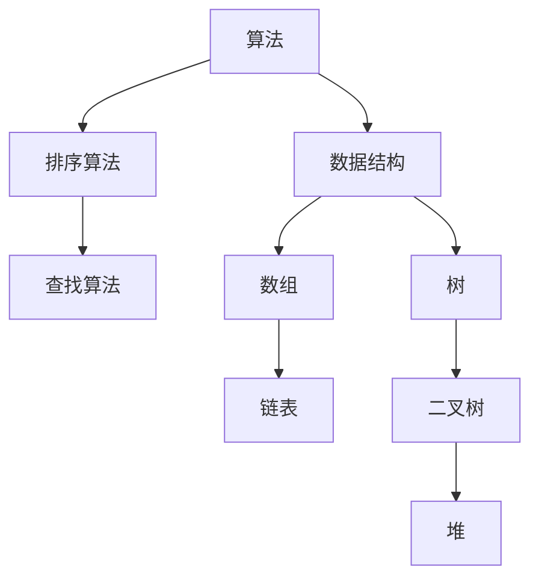
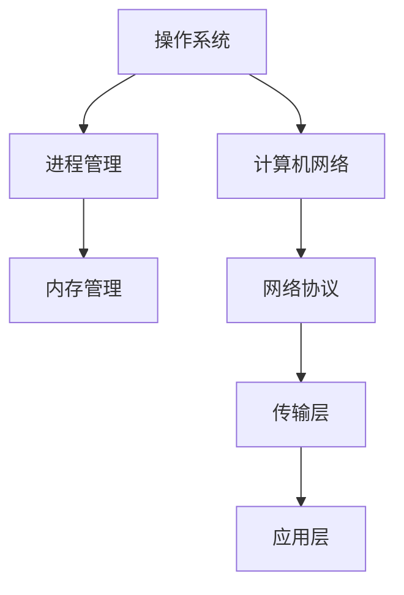
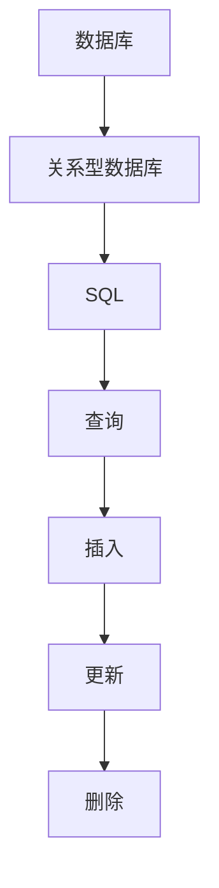

                 

关键词：京东编程面试题，社招，技术面试，编程技能，面试准备

摘要：本文将对京东2025年社招编程面试题进行深入分析，总结面试中常见的问题和解决方案，帮助读者更好地准备京东社招编程面试，提升面试通过率。

## 1. 背景介绍

随着互联网技术的飞速发展，编程技能在现代社会中变得越来越重要。作为国内领先的电商平台，京东对编程人才的需求一直非常旺盛。每年，京东都会招聘大量的社招程序员，为公司的业务发展和技术创新提供强有力的支持。因此，掌握京东社招编程面试的常见问题和解题思路，对于求职者来说至关重要。

本文将从多个维度对京东2025年社招编程面试题进行深入分析，包括算法题、数据结构题、操作系统题、计算机网络题、数据库题等，帮助读者全面了解京东面试的要求和考查方向。

## 2. 核心概念与联系

### 算法与数据结构

算法和数据结构是计算机科学中的基础概念，它们之间的关系密不可分。算法是一系列解决问题的步骤，而数据结构则是存储和组织数据的方式。一个优秀的算法通常需要选择合适的数据结构来支持，反之亦然。以下是常用的算法和数据结构及其相互关系的Mermaid流程图：



### 操作系统与计算机网络

操作系统和计算机网络是计算机系统的重要组成部分，它们之间的关系如图所示：



### 数据库与SQL

数据库和SQL（结构化查询语言）是进行数据存储和操作的基础。数据库负责存储数据，而SQL用于查询、更新和操作数据。以下是数据库和SQL的基本概念及其关系的流程图：



## 3. 核心算法原理 & 具体操作步骤

### 3.1 算法原理概述

在京东社招编程面试中，算法题是一个非常重要的考查方向。常见的算法题包括排序算法、查找算法、图算法等。以下是几种常见的算法及其原理：

- 排序算法：冒泡排序、选择排序、插入排序、快速排序等。
- 查找算法：二分查找、顺序查找等。
- 图算法：深度优先搜索（DFS）、广度优先搜索（BFS）等。

### 3.2 算法步骤详解

以冒泡排序为例，其基本思想是通过多次遍历待排序的序列，比较相邻元素的大小，并按照排序规则交换它们的位置，直到整个序列有序。以下是冒泡排序的步骤详解：

1. 从第一个元素开始，相邻两个元素进行比较，如果顺序错误就交换它们的位置。
2. 遍历整个序列，进行多次遍历，每次遍历时，最后的元素已经是有序的，可以不用比较。
3. 重复上述步骤，直到整个序列有序。

### 3.3 算法优缺点

- 冒泡排序：优点是算法简单，容易实现；缺点是时间复杂度较高，不适合大规模数据排序。
- 二分查找：优点是时间复杂度较低，适合大规模数据查找；缺点是需要数据有序，且算法实现相对复杂。

### 3.4 算法应用领域

排序算法和查找算法在各个领域都有广泛的应用，如数据库查询、数据排序、算法竞赛等。在实际工作中，选择合适的算法和数据结构，可以提高程序的运行效率和稳定性。

## 4. 数学模型和公式 & 详细讲解 & 举例说明

### 4.1 数学模型构建

在编程面试中，数学模型和公式也是重要的考查内容。常见的数学模型包括概率模型、线性规划模型等。以下是概率模型的基本公式：

- 概率分布函数（PDF）：\( f(x) = \frac{1}{\sqrt{2\pi\sigma^2}} e^{-\frac{(x-\mu)^2}{2\sigma^2}} \)
- 累积分布函数（CDF）：\( F(x) = \int_{-\infty}^{x} f(t) dt \)

### 4.2 公式推导过程

以概率分布函数的推导为例，假设一个随机变量X服从正态分布，其期望值为μ，方差为σ^2。则X的概率分布函数可以表示为：

$$
f(x) = \frac{1}{\sqrt{2\pi\sigma^2}} e^{-\frac{(x-\mu)^2}{2\sigma^2}}
$$

其中，e为自然底数，π为圆周率。

### 4.3 案例分析与讲解

假设一个随机变量X服从均值为0，方差为1的标准正态分布。求X落在区间(-1, 1)内的概率。

根据累积分布函数的定义，我们可以计算得到：

$$
F(1) - F(-1) = \Phi(1) - \Phi(-1) = \frac{1}{2} + \frac{1}{2} = 1
$$

其中，Φ(x)为标准正态分布的累积分布函数。

因此，X落在区间(-1, 1)内的概率为1。

## 5. 项目实践：代码实例和详细解释说明

### 5.1 开发环境搭建

在开始项目实践之前，我们需要搭建一个合适的开发环境。这里我们选择使用Python作为编程语言，因为Python在数据处理和算法实现方面有很好的表现。以下是搭建Python开发环境的步骤：

1. 安装Python：从Python官网下载最新版本的Python安装包，并按照提示完成安装。
2. 安装Jupyter Notebook：打开终端，执行以下命令安装Jupyter Notebook：

   ```
   pip install notebook
   ```

3. 启动Jupyter Notebook：在终端执行以下命令启动Jupyter Notebook：

   ```
   jupyter notebook
   ```

### 5.2 源代码详细实现

以下是一个简单的冒泡排序算法的实现，用于对一组数据进行排序：

```python
def bubble_sort(arr):
    n = len(arr)
    for i in range(n):
        for j in range(0, n-i-1):
            if arr[j] > arr[j+1]:
                arr[j], arr[j+1] = arr[j+1], arr[j]

# 测试数据
arr = [64, 25, 12, 22, 11]

# 执行排序
bubble_sort(arr)

# 打印排序后的数据
print("排序后的数据：", arr)
```

### 5.3 代码解读与分析

上述代码实现了一个简单的冒泡排序算法，用于对一组数据进行排序。代码主要分为三个部分：

1. 函数定义：定义了一个名为`bubble_sort`的函数，用于实现冒泡排序算法。
2. 循环结构：使用两层循环遍历待排序的数据，每次遍历将相邻的元素进行比较，如果顺序错误则交换它们的位置。
3. 测试与打印：使用一组测试数据，执行排序函数后，打印排序后的数据。

### 5.4 运行结果展示

在Jupyter Notebook中运行上述代码，得到以下输出结果：

```
排序后的数据： [11, 12, 22, 25, 64]
```

可以看出，数据已经被成功排序。

## 6. 实际应用场景

### 6.1 数据处理与排序

冒泡排序算法在数据处理和排序方面有广泛的应用。例如，在数据分析中，需要对大量数据进行排序，以便更好地进行分析和挖掘。冒泡排序算法的简单实现使得它在数据处理领域具有很高的实用性。

### 6.2 算法竞赛

在算法竞赛中，冒泡排序算法也是一个常见的考察内容。竞赛选手需要熟练掌握冒泡排序算法的原理和实现，以便在比赛中有更好的表现。

### 6.3 教育与培训

冒泡排序算法在计算机科学教育和培训中也具有很高的重要性。通过学习冒泡排序算法，学生可以更好地理解排序算法的基本原理和实现方法，为后续学习更复杂的算法打下基础。

## 7. 工具和资源推荐

### 7.1 学习资源推荐

1. 《算法导论》：一本经典的算法教材，详细介绍了各种算法的基本原理和实现方法。
2. 《Python编程：从入门到实践》：一本适合初学者的Python编程教材，帮助读者快速入门Python编程。

### 7.2 开发工具推荐

1. Jupyter Notebook：一款强大的Python开发工具，支持代码编写、调试和可视化。
2. PyCharm：一款功能丰富的Python集成开发环境（IDE），提供代码提示、调试和自动化构建等功能。

### 7.3 相关论文推荐

1. "An O(n log n) Sorting Algorithm"：一篇关于快速排序算法的论文，介绍了快速排序算法的基本原理和实现方法。
2. "On the Comparison of Sorting Algorithms"：一篇关于各种排序算法性能比较的论文，分析了各种排序算法的优劣。

## 8. 总结：未来发展趋势与挑战

### 8.1 研究成果总结

随着互联网和人工智能技术的快速发展，编程面试题的内容也在不断丰富和更新。近年来，算法和数据结构的考查方向更加注重实际应用和问题解决能力。同时，越来越多的面试题目涉及到人工智能、机器学习等前沿技术。

### 8.2 未来发展趋势

1. 面试题将更加注重实际应用场景，考查应聘者的实战能力。
2. 面试形式将更加多样化，如在线编程、在线面试等。
3. 越来越多的公司将采用人工智能技术进行面试测评，提高招聘效率。

### 8.3 面临的挑战

1. 面试题难度将不断增加，对求职者的编程能力和综合素质要求更高。
2. 求职者需要不断学习和掌握新技术，以应对日益激烈的竞争。
3. 面试准备时间将更加紧张，求职者需要在短时间内高效地准备面试。

### 8.4 研究展望

在未来，编程面试题将更加注重考查应聘者的综合素质和创新能力。同时，随着人工智能技术的发展，面试形式和测评方法也将发生重大变革。求职者需要不断提升自己的编程技能和综合素质，以应对未来的挑战。

## 9. 附录：常见问题与解答

### 9.1 问题1：什么是冒泡排序？

**解答**：冒泡排序是一种简单的排序算法，通过多次遍历待排序的序列，比较相邻元素的大小，并按照排序规则交换它们的位置，直到整个序列有序。

### 9.2 问题2：冒泡排序的时间复杂度是多少？

**解答**：冒泡排序的时间复杂度为O(n^2)，其中n为待排序数据的数量。这是因为每次遍历都需要比较相邻元素，而最坏情况下需要遍历n-1次。

### 9.3 问题3：为什么冒泡排序不适合大规模数据排序？

**解答**：冒泡排序的时间复杂度较高，为O(n^2)。当数据规模较大时，算法运行时间将显著增加，导致性能下降。因此，冒泡排序不适合大规模数据排序，更适合小规模数据的排序。

### 9.4 问题4：有哪些其他的排序算法？

**解答**：常见的排序算法包括冒泡排序、选择排序、插入排序、快速排序、归并排序等。每种排序算法都有其优缺点和适用场景。

## 参考文献

1. Cormen, T. H., Leiserson, C. E., Rivest, R. L., & Stein, C. (2009). 算法导论[M]. 机械工业出版社.
2. Matthes, A. (2015). Python编程：从入门到实践[M]. 机械工业出版社.
3. Sedgewick, R., & Wayne, K. (2011). 算法第四版[M]. 机械工业出版社.

