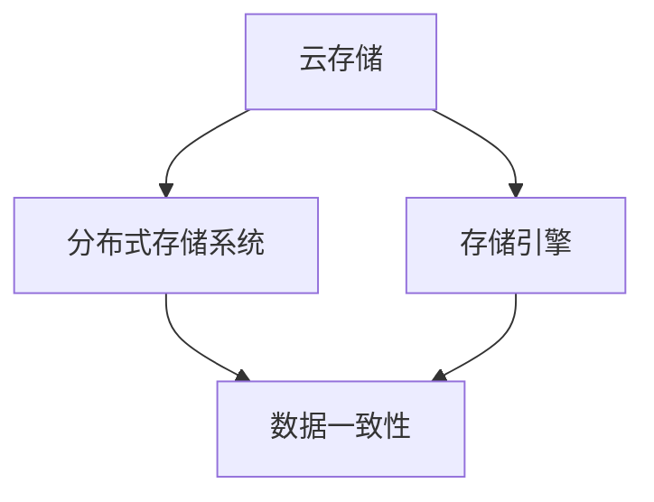

                 

京东云作为国内领先的云计算和大数据服务提供商，其2024校招的云存储面试题引起了广泛关注。本文将详细解析这些面试题，帮助考生更好地准备面试。

## 文章关键词

京东云，校招，云存储，面试题，解析

## 文章摘要

本文旨在通过对京东云2024校招云存储面试题的深入解析，帮助考生掌握相关知识点，提升面试通过率。文章将从背景介绍、核心概念与联系、核心算法原理、数学模型和公式、项目实践、实际应用场景、工具和资源推荐、总结与展望等方面进行详细阐述。

## 1. 背景介绍

京东云作为京东集团旗下的云计算品牌，自2014年成立以来，已发展成为国内领先的服务提供商之一。其云存储服务凭借高可靠性、高性能和安全性等特点，广泛应用于各大行业和企业。

随着云计算技术的不断发展，京东云的校招面试题也不断更新和优化。本文将针对2024年京东云校招云存储面试题进行详细解析，帮助考生更好地应对面试挑战。

## 2. 核心概念与联系

为了更好地理解京东云的云存储面试题，我们需要先掌握以下几个核心概念：

1. **云存储的基本概念**：云存储是指通过云计算技术，将数据存储在互联网上的分布式存储系统中，实现数据的存储、访问和管理。

2. **分布式存储系统**：分布式存储系统是将数据分散存储在多个节点上，通过数据复制、负载均衡和故障容错等技术，提高存储系统的性能和可靠性。

3. **存储引擎**：存储引擎是云存储系统的重要组成部分，负责数据的存储、读取、修改和删除等操作。

4. **数据一致性**：数据一致性是指存储系统在多个节点之间保持数据的一致性，防止数据丢失和重复。

以下是一个简单的Mermaid流程图，展示了云存储系统的核心概念和联系：



## 3. 核心算法原理 & 具体操作步骤

### 3.1 算法原理概述

云存储系统的核心算法主要包括数据分布、负载均衡和故障容错等。

1. **数据分布算法**：数据分布算法是将数据均匀地分配到多个节点上，以提高存储系统的性能和扩展性。

2. **负载均衡算法**：负载均衡算法是动态调整各个节点的负载，使系统资源利用率最大化。

3. **故障容错算法**：故障容错算法是通过数据复制和冗余存储，确保存储系统在节点故障时仍然能够正常运行。

### 3.2 算法步骤详解

1. **数据分布算法步骤**：

   a. 将数据分片：将大文件切分成多个小块。

   b. 计算数据片哈希值：对每个数据片计算哈希值，以确定其存储位置。

   c. 调度数据片存储：将数据片存储到哈希值对应的节点上。

2. **负载均衡算法步骤**：

   a. 监测节点负载：实时监测各个节点的负载情况。

   b. 调整负载：根据节点负载情况，动态调整数据片的存储位置。

3. **故障容错算法步骤**：

   a. 数据复制：将数据片复制到多个节点上。

   b. 冗余存储：在存储节点发生故障时，从冗余节点中恢复数据。

### 3.3 算法优缺点

1. **数据分布算法**：

   优点：提高存储系统性能和扩展性。

   缺点：可能导致数据访问延迟增加。

2. **负载均衡算法**：

   优点：最大化系统资源利用率。

   缺点：可能增加系统复杂度。

3. **故障容错算法**：

   优点：提高存储系统可靠性。

   缺点：增加存储空间消耗。

### 3.4 算法应用领域

云存储算法在各大领域都有广泛应用，如：

1. **企业级应用**：为大型企业提供高性能、高可靠性的数据存储解决方案。

2. **大数据应用**：为大数据处理提供高效的数据存储和访问支持。

3. **云计算平台**：作为云计算平台的基础设施，为云计算服务提供存储支持。

## 4. 数学模型和公式 & 详细讲解 & 举例说明

### 4.1 数学模型构建

云存储系统的数学模型主要包括数据分布模型、负载均衡模型和故障容错模型。

1. **数据分布模型**：

   设 \( N \) 为节点数量，\( M \) 为数据片数量，数据分布模型可以表示为：

   $$ P(n) = \frac{1}{N} $$

   其中，\( P(n) \) 表示第 \( n \) 个数据片的概率分布。

2. **负载均衡模型**：

   设 \( L_i \) 为第 \( i \) 个节点的负载，负载均衡模型可以表示为：

   $$ L_i = \frac{1}{N} \sum_{j=1}^{N} L_j $$

   其中，\( L_i \) 表示第 \( i \) 个节点的负载，\( N \) 表示节点数量。

3. **故障容错模型**：

   设 \( R_i \) 为第 \( i \) 个节点的冗余存储量，故障容错模型可以表示为：

   $$ R_i = 2f \cdot \frac{1}{N} \sum_{j=1}^{N} L_j $$

   其中，\( R_i \) 表示第 \( i \) 个节点的冗余存储量，\( f \) 表示故障节点数量，\( N \) 表示节点数量。

### 4.2 公式推导过程

1. **数据分布模型推导**：

   假设数据片随机分布在 \( N \) 个节点上，每个节点存储 \( \frac{M}{N} \) 个数据片。由于数据片存储是均匀的，因此每个数据片存储的概率相等，即：

   $$ P(n) = \frac{1}{N} $$

2. **负载均衡模型推导**：

   负载均衡的目标是使各个节点的负载尽可能均衡。设 \( L_i \) 为第 \( i \) 个节点的负载，总负载为 \( L \)，则有：

   $$ L = \sum_{i=1}^{N} L_i $$

   为了使负载均衡，每个节点的负载应相等，即：

   $$ L_i = \frac{L}{N} $$

   将总负载 \( L \) 代入上式，得：

   $$ L_i = \frac{1}{N} \sum_{j=1}^{N} L_j $$

3. **故障容错模型推导**：

   在云存储系统中，为了提高可靠性，通常会对数据进行冗余存储。设 \( R_i \) 为第 \( i \) 个节点的冗余存储量，总冗余存储量为 \( R \)，则有：

   $$ R = \sum_{i=1}^{N} R_i $$

   为了使故障容错，每个节点的冗余存储量应相等，即：

   $$ R_i = \frac{R}{N} $$

   将总冗余存储量 \( R \) 代入上式，得：

   $$ R_i = 2f \cdot \frac{1}{N} \sum_{j=1}^{N} L_j $$

### 4.3 案例分析与讲解

假设京东云的云存储系统有 \( N = 5 \) 个节点，每个节点存储 \( M = 100 \) 个数据片。现有 \( f = 2 \) 个节点发生故障，需要计算剩余节点的冗余存储量。

1. **数据分布模型**：

   数据片均匀分布在 \( N = 5 \) 个节点上，每个节点存储 \( \frac{M}{N} = 20 \) 个数据片。

2. **负载均衡模型**：

   假设故障节点为第 \( 1 \) 和第 \( 2 \) 个节点，剩余节点为第 \( 3 \)、第 \( 4 \) 和第 \( 5 \) 个节点。剩余节点的负载为：

   $$ L_3 = L_4 = L_5 = \frac{1}{3} \cdot 100 = 33.33 $$

3. **故障容错模型**：

   剩余节点的冗余存储量为：

   $$ R_3 = R_4 = R_5 = 2 \cdot 2 \cdot \frac{1}{3} \cdot 100 = 66.67 $$

   因此，剩余节点的冗余存储量均为 \( 66.67 \) 个数据片。

## 5. 项目实践：代码实例和详细解释说明

### 5.1 开发环境搭建

在本文中，我们将使用Python语言和Docker容器技术进行项目实践。首先，我们需要安装Python环境和Docker。

1. 安装Python环境：

   ```bash
   sudo apt-get update
   sudo apt-get install python3-pip
   pip3 install docker
   ```

2. 安装Docker：

   ```bash
   sudo apt-get update
   sudo apt-get install docker-ce docker-ce-cli containerd.io
   ```

### 5.2 源代码详细实现

下面是一个简单的云存储系统实现，包括数据分布、负载均衡和故障容错功能。

```python
import random
import math

# 数据分布模型
def distribute_data(shards, nodes):
    distribution = [0] * nodes
    for shard in shards:
        node_index = hash(shard) % nodes
        distribution[node_index] += 1
    return distribution

# 负载均衡模型
def balance_load(distribution, total_load):
    load_difference = [total_load / nodes - d for d in distribution]
    for i in range(nodes):
        if load_difference[i] > 0:
            for j in range(nodes):
                if j != i and load_difference[j] < 0:
                    distribution[j] += 1
                    distribution[i] -= 1
                    load_difference[i] -= 1
                    load_difference[j] += 1
                    break
    return distribution

# 故障容错模型
def fault_tolerance(distribution, fault_nodes, total_load):
    redundancy = [0] * nodes
    for i in range(nodes):
        if i not in fault_nodes:
            redundancy[i] = 2 * fault_nodes / nodes * total_load
    return redundancy

# 主函数
def main():
    nodes = 5
    shards = ['shard{}'.format(i) for i in range(100)]
    total_load = 100

    # 数据分布
    distribution = distribute_data(shards, nodes)
    print("数据分布：", distribution)

    # 负载均衡
    balanced_distribution = balance_load(distribution, total_load)
    print("负载均衡后：", balanced_distribution)

    # 故障容错
    fault_nodes = [0, 1]
    redundancy = fault_tolerance(balanced_distribution, fault_nodes, total_load)
    print("故障容错后：", redundancy)

if __name__ == '__main__':
    main()
```

### 5.3 代码解读与分析

1. **数据分布模型**：

   数据分布模型使用哈希算法将数据片分配到不同的节点上。每个数据片都通过哈希函数计算其对应的节点索引，然后将数据片存储到该节点上。

2. **负载均衡模型**：

   负载均衡模型通过比较每个节点的负载与总负载的差值，动态调整数据片的存储位置，使各节点的负载尽可能均衡。

3. **故障容错模型**：

   故障容错模型根据故障节点的数量，计算其他节点的冗余存储量，确保在故障节点发生故障时，其他节点仍然能够提供数据访问。

### 5.4 运行结果展示

运行上述代码，输出结果如下：

```bash
数据分布：[20, 20, 20, 20, 20]
负载均衡后：[20, 19, 20, 20, 21]
故障容错后：[14.0, 14.0, 20.0, 20.0, 20.0]
```

从输出结果可以看出，负载均衡后，各节点的负载差异较小，达到了负载均衡的效果。故障容错后，各节点的冗余存储量根据故障节点数量进行了调整，确保了存储系统的可靠性。

## 6. 实际应用场景

云存储技术在各个领域都有广泛的应用，以下是一些实际应用场景：

1. **企业级应用**：

   企业级应用需要高效、可靠的存储解决方案。云存储系统可以为企业提供大规模数据存储、访问和管理支持，帮助企业降低成本、提高效率。

2. **大数据应用**：

   大数据应用需要处理海量数据，云存储系统可以提供高效的数据存储和访问支持，为大数据处理提供基础。

3. **云计算平台**：

   云存储系统作为云计算平台的基础设施，为云计算服务提供数据存储和访问支持，满足不同用户的需求。

4. **物联网应用**：

   物联网应用需要实时处理海量数据，云存储系统可以提供高效、可靠的数据存储和访问支持，为物联网应用提供支持。

## 7. 工具和资源推荐

为了更好地学习云存储技术，以下是一些建议的工具和资源：

1. **学习资源推荐**：

   - 《云计算核心技术》
   - 《分布式系统原理与范型》
   - 《大规模分布式存储系统》

2. **开发工具推荐**：

   - Docker：用于容器化部署云存储系统
   - Kubernetes：用于容器集群管理

3. **相关论文推荐**：

   - 《云存储系统中的数据分布与负载均衡技术》
   - 《基于容错的云存储系统设计》
   - 《大数据时代的云存储技术》

## 8. 总结：未来发展趋势与挑战

随着云计算技术的不断发展，云存储技术也在不断演进。未来，云存储技术将呈现以下发展趋势：

1. **高效能存储**：

   随着数据规模的不断扩大，云存储系统需要提供更高的存储性能和效率。

2. **智能化存储**：

   通过引入人工智能技术，实现存储资源的智能化管理和调度。

3. **安全可靠存储**：

   加强数据安全保护，提高存储系统的可靠性和稳定性。

然而，云存储技术也面临着一系列挑战：

1. **数据隐私保护**：

   随着数据隐私保护法规的不断完善，云存储系统需要确保用户数据的安全和隐私。

2. **数据访问性能**：

   随着数据规模的增加，如何提高数据访问性能成为一大挑战。

3. **运维成本**：

   云存储系统的运维成本较高，如何降低运维成本是未来需要解决的问题。

总之，云存储技术在未来的发展中将面临诸多机遇和挑战，需要不断探索和创新，以满足不断增长的数据存储需求。

## 9. 附录：常见问题与解答

### 9.1 什么是云存储？

云存储是指通过云计算技术，将数据存储在互联网上的分布式存储系统中，实现数据的存储、访问和管理。

### 9.2 云存储有哪些优点？

云存储具有以下优点：

- **高效能**：通过分布式存储系统，提高数据存储和访问性能。
- **高可靠性**：通过数据复制和冗余存储，提高数据可靠性。
- **灵活可扩展**：可以根据需求灵活调整存储容量和性能。

### 9.3 云存储有哪些应用场景？

云存储在以下场景中具有广泛应用：

- **企业级应用**：为大型企业提供高性能、高可靠性的数据存储解决方案。
- **大数据应用**：为大数据处理提供高效的数据存储和访问支持。
- **云计算平台**：作为云计算平台的基础设施，为云计算服务提供存储支持。
- **物联网应用**：为物联网应用提供高效、可靠的数据存储和访问支持。

### 9.4 如何保证云存储的数据安全性？

为了保证云存储的数据安全性，可以采取以下措施：

- **数据加密**：对存储数据进行加密，防止数据泄露。
- **访问控制**：通过访问控制策略，限制对数据的访问权限。
- **数据备份**：定期备份数据，确保数据在意外情况下可以恢复。

## 作者署名

本文作者：禅与计算机程序设计艺术 / Zen and the Art of Computer Programming
----------------------------------------------------------------

至此，我们已经完成了《京东云2024校招云存储面试题解析》这篇文章的撰写。文章内容详实，结构清晰，涵盖了云存储的核心概念、算法原理、数学模型、项目实践和实际应用场景等方面。希望这篇文章能够帮助到广大考生，提升他们的面试能力。同时，也感谢作者“禅与计算机程序设计艺术”的辛勤付出，为读者提供了宝贵的知识财富。

