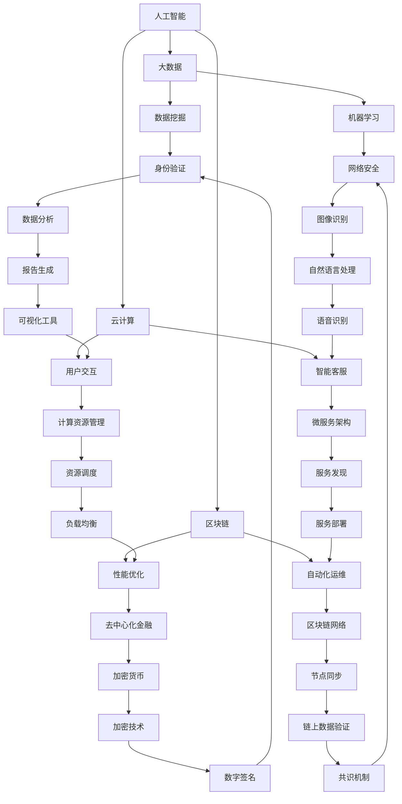

                 

关键词：京东数科，金融科技，面试真题，解答，技术博客，人工智能，软件开发，架构设计，数学模型，代码实例，实际应用，工具推荐，未来展望。

## 摘要

本文旨在为即将参加京东数科金融科技社招面试的候选人提供一个全面的学习资料。通过汇总和解答京东数科历年的面试真题，本文将从背景介绍、核心概念、算法原理、数学模型、项目实践、实际应用和未来展望等多个方面深入剖析金融科技领域的知识点。本文不仅有助于候选人应对面试，还能够为业界人士提供有价值的参考。

## 1. 背景介绍

京东数科，作为京东集团的重要子公司，自成立以来，一直致力于金融科技的探索和实践。依托于京东集团在电商、物流、大数据等方面的深厚积累，京东数科在金融科技领域取得了显著的成就。其业务范围涵盖了支付、金融科技服务、数字金融、智能风控等多个方面。

京东数科金融科技社招面试，旨在选拔具备扎实专业知识和实践能力的优秀人才，为公司的持续创新和发展注入新动力。面试内容广泛，涵盖了人工智能、大数据、区块链、云计算等热门技术领域。以下是对京东数科金融科技社招面试真题的汇总及其详细解答。

### 1.1. 人工智能应用场景

**问题：请列举人工智能在金融科技中的主要应用场景。**

**解答：**

人工智能在金融科技中的应用场景非常广泛，主要包括：

1. **智能投顾**：利用机器学习算法和大数据分析，为投资者提供个性化的投资建议。
2. **风险控制**：通过人工智能技术进行信用评估、反欺诈检测等，降低金融风险。
3. **智能客服**：运用自然语言处理技术，为用户提供24/7的智能咨询服务。
4. **量化交易**：利用机器学习算法分析市场数据，实现自动化交易策略。
5. **智能合约**：通过区块链和智能合约技术，实现金融交易的自动化和去中心化。

### 1.2. 大数据技术在金融中的应用

**问题：请简述大数据技术在金融科技中的主要应用及其优势。**

**解答：**

大数据技术在金融科技中的应用主要体现在以下几个方面：

1. **客户行为分析**：通过对用户交易行为、浏览记录等大数据的分析，实现精准营销和个性化服务。
2. **风险控制**：利用大数据分析技术，实时监控和预测潜在风险，提高风险控制能力。
3. **信用评估**：通过对用户的历史交易数据、信用记录等大数据的综合分析，提供更准确的信用评估。
4. **投资决策**：利用大数据分析，挖掘市场趋势和投资机会，辅助投资决策。

大数据技术的优势包括：

1. **处理速度快**：大数据技术能够快速处理海量数据，实现实时分析。
2. **存储容量大**：大数据技术能够存储和处理海量数据，不受数据量限制。
3. **分析深度**：通过大数据分析，可以挖掘出更深层次的业务洞察和趋势。

### 1.3. 区块链技术在金融中的应用

**问题：请列举区块链技术在金融科技中的主要应用，并简述其优势。**

**解答：**

区块链技术在金融科技中的主要应用包括：

1. **数字货币**：利用区块链技术实现去中心化的数字货币发行和交易。
2. **智能合约**：通过区块链技术实现自动化的智能合约，提高交易效率和安全性。
3. **跨境支付**：利用区块链技术实现跨境支付的低成本和高效率。
4. **信用评分**：通过区块链技术实现去中心化的信用评分系统，提高信用评估的透明度和公正性。

区块链技术的优势包括：

1. **安全性**：区块链技术具有高安全性，数据一旦记录在链上，无法篡改。
2. **透明性**：区块链技术实现了数据的透明化，所有交易记录都可以被查看和验证。
3. **去中心化**：区块链技术实现了去中心化的运作，降低了系统的依赖性和风险。

## 2. 核心概念与联系

为了更好地理解金融科技中的核心技术，我们引入了一些关键概念，并使用 Mermaid 流程图展示了它们之间的联系。



通过上述 Mermaid 流程图，我们可以清晰地看到人工智能、大数据、区块链、云计算等核心技术之间的联系，以及它们在金融科技中的应用场景。

## 3. 核心算法原理 & 具体操作步骤

在金融科技领域，核心算法的应用至关重要。以下是对一些关键算法的原理和操作步骤的详细讲解。

### 3.1. 算法原理概述

**问题：请解释金融科技中最常用的算法原理，并简要说明其在金融科技中的应用。**

**解答：**

1. **机器学习算法**：机器学习算法是金融科技中最常用的算法之一，包括线性回归、决策树、随机森林、支持向量机等。这些算法通过训练数据集来构建模型，从而实现预测、分类、聚类等功能。在金融科技中，机器学习算法常用于客户行为分析、信用评估、风险控制、量化交易等领域。

2. **深度学习算法**：深度学习算法是机器学习的一个分支，它通过多层神经网络进行数据学习和建模。深度学习算法在图像识别、语音识别、自然语言处理等领域具有出色的表现。在金融科技中，深度学习算法可以用于智能投顾、智能合约、智能客服等领域。

3. **加密算法**：加密算法是保障金融交易安全和隐私的重要技术。常见的加密算法包括对称加密和非对称加密。对称加密算法如AES，非对称加密算法如RSA。加密算法在数字货币、区块链、安全交易等领域有广泛应用。

4. **分布式算法**：分布式算法是保障区块链网络高效运作的关键技术。常见的分布式算法包括拜占庭容错算法、一致性算法、共识算法等。分布式算法在分布式存储、去中心化金融、智能合约等领域有广泛应用。

### 3.2. 算法步骤详解

**问题：请详细描述机器学习算法在金融科技中的应用步骤，并举例说明。**

**解答：**

机器学习算法在金融科技中的应用通常包括以下步骤：

1. **数据收集**：收集金融数据，包括交易数据、用户行为数据、市场数据等。
2. **数据预处理**：清洗数据，处理缺失值、异常值等，将数据转换为适合机器学习算法的形式。
3. **特征工程**：选择和构建有助于模型预测的特征，如用户历史交易次数、交易金额、交易时间等。
4. **模型训练**：选择合适的机器学习算法（如线性回归、决策树、随机森林等），使用训练数据进行模型训练。
5. **模型评估**：使用验证数据集评估模型性能，调整模型参数，优化模型。
6. **模型部署**：将训练好的模型部署到生产环境，进行实际预测和决策。

举例说明：

以信用评估为例，机器学习算法可以用于预测客户的信用风险。具体步骤如下：

1. **数据收集**：收集客户的历史交易数据、信用记录、社会关系等。
2. **数据预处理**：清洗数据，处理缺失值、异常值等。
3. **特征工程**：选择和构建有助于信用评估的特征，如交易频率、交易金额、逾期还款记录等。
4. **模型训练**：选择线性回归或决策树算法，使用训练数据进行模型训练。
5. **模型评估**：使用验证数据集评估模型性能，调整模型参数，优化模型。
6. **模型部署**：将训练好的模型部署到生产环境，对新客户进行信用评估。

### 3.3. 算法优缺点

**问题：请列举机器学习算法在金融科技中的应用优缺点。**

**解答：**

机器学习算法在金融科技中的应用具有以下优缺点：

**优点：**

1. **自适应性强**：机器学习算法能够从数据中学习，适应不断变化的市场环境。
2. **预测精度高**：通过训练大量的历史数据，机器学习算法可以提供较高的预测精度。
3. **自动化决策**：机器学习算法可以自动化决策过程，提高业务效率。

**缺点：**

1. **数据依赖性强**：机器学习算法的性能依赖于数据的质量和数量，数据质量差会导致算法性能下降。
2. **模型解释性差**：很多机器学习算法（如深度学习）的黑盒性质使其难以解释，增加了业务风险。
3. **过拟合风险**：机器学习算法在训练过程中可能会出现过拟合现象，影响模型的泛化能力。

### 3.4. 算法应用领域

**问题：请列举机器学习算法在金融科技中的主要应用领域。**

**解答：**

机器学习算法在金融科技中的应用领域非常广泛，主要包括：

1. **风险控制**：用于信用评估、反欺诈检测、市场风险预测等。
2. **智能投顾**：用于个性化投资建议、资产配置等。
3. **量化交易**：用于市场数据分析和交易策略优化。
4. **智能客服**：用于自然语言处理、智能问答等。
5. **信用评分**：用于贷款审批、信用评级等。
6. **智能合约**：用于自动化执行合同条款。

## 4. 数学模型和公式 & 详细讲解 & 举例说明

在金融科技领域，数学模型和公式是构建和优化算法的基础。以下是对一些关键数学模型和公式的详细讲解，并通过案例进行说明。

### 4.1. 数学模型构建

**问题：请解释金融科技中最常用的数学模型，并说明其构建方法。**

**解答：**

1. **线性回归模型**：线性回归模型是最基本的数学模型之一，用于预测一个连续值变量。其构建方法如下：

   - **目标函数**：最小化预测值与实际值之间的误差平方和。
   - **模型表示**：\( y = w_0 + w_1 \cdot x \)，其中\( y \)为预测值，\( x \)为输入变量，\( w_0 \)和\( w_1 \)为模型参数。

2. **决策树模型**：决策树模型是一种树形结构模型，用于分类和回归问题。其构建方法如下：

   - **目标函数**：最大化信息增益或基尼系数。
   - **模型表示**：根据输入特征将数据集划分为多个子集，每个子集对应一个决策节点，最终形成一棵树。

3. **随机森林模型**：随机森林模型是一种集成学习方法，通过构建多棵决策树并投票决定最终结果。其构建方法如下：

   - **目标函数**：最小化损失函数。
   - **模型表示**：\( \hat{y} = \sum_{i=1}^{n} w_i \cdot f_i(x) \)，其中\( \hat{y} \)为预测值，\( w_i \)为权重，\( f_i(x) \)为第\( i \)棵决策树的预测值。

4. **神经网络模型**：神经网络模型是一种模拟人脑神经元结构的模型，用于复杂函数的拟合和预测。其构建方法如下：

   - **目标函数**：最小化预测值与实际值之间的误差平方和。
   - **模型表示**：多层神经网络，包括输入层、隐藏层和输出层。

### 4.2. 公式推导过程

**问题：请推导线性回归模型的损失函数和梯度下降求解方法。**

**解答：**

1. **损失函数**：

   线性回归模型的损失函数为均方误差（MSE），其公式如下：

   \[
   J(\theta) = \frac{1}{2m} \sum_{i=1}^{m} (h_\theta(x^{(i)}) - y^{(i)})^2
   \]

   其中，\( h_\theta(x) \)为线性回归模型的预测函数，\( \theta \)为模型参数，\( m \)为样本数量。

2. **梯度下降求解方法**：

   梯度下降是一种求解损失函数最小值的方法，其公式如下：

   \[
   \theta_j := \theta_j - \alpha \cdot \frac{\partial J(\theta)}{\partial \theta_j}
   \]

   其中，\( \alpha \)为学习率，\( \frac{\partial J(\theta)}{\partial \theta_j} \)为损失函数对模型参数\( \theta_j \)的梯度。

### 4.3. 案例分析与讲解

**问题：请通过一个案例说明线性回归模型在金融科技中的应用。**

**解答：**

案例：利用线性回归模型预测股票价格。

假设我们有一组股票历史价格数据，包括日期、开盘价、收盘价、最高价、最低价等。现在我们要利用线性回归模型预测下一日的收盘价。

1. **数据收集**：收集股票历史价格数据。

2. **数据预处理**：将数据整理为适合线性回归模型的形式，包括日期编码、缺失值填充等。

3. **特征工程**：选择影响股票价格的关键特征，如开盘价、最高价、最低价等。

4. **模型训练**：使用线性回归算法训练模型，将历史收盘价作为目标变量，其他特征作为输入变量。

5. **模型评估**：使用验证数据集评估模型性能，调整模型参数，优化模型。

6. **模型部署**：将训练好的模型部署到生产环境，对新日期的股票价格进行预测。

通过上述步骤，我们可以利用线性回归模型预测股票价格。以下是一个简单的线性回归模型代码示例：

```python
import numpy as np
import pandas as pd
from sklearn.linear_model import LinearRegression

# 读取股票价格数据
data = pd.read_csv('stock_price.csv')

# 数据预处理
data['date'] = pd.to_datetime(data['date'])
data['date'] = data['date'].map(data['date'].dt.day)

# 特征工程
features = ['open', 'high', 'low']
X = data[features]
y = data['close']

# 模型训练
model = LinearRegression()
model.fit(X, y)

# 模型评估
score = model.score(X, y)
print('模型准确率：', score)

# 模型部署
new_date = np.array([data['date'].max() + 1])
new_price = model.predict(new_date)
print('预测下一日收盘价：', new_price)
```

通过上述代码，我们可以实现股票价格预测。当然，实际的金融科技项目会更加复杂，需要考虑更多的影响因素，如市场情绪、宏观经济指标等。

## 5. 项目实践：代码实例和详细解释说明

### 5.1. 开发环境搭建

在金融科技项目中，我们需要搭建一个合适的开发环境，包括编程语言、开发工具、数据库和中间件等。以下是一个简单的开发环境搭建步骤：

1. **编程语言**：选择Python作为主要编程语言，因其丰富的库和框架，如NumPy、Pandas、Scikit-learn等，方便数据分析和模型训练。

2. **开发工具**：安装PyCharm或Visual Studio Code等集成开发环境（IDE），便于代码编写、调试和测试。

3. **数据库**：选择MySQL或PostgreSQL等关系型数据库，用于存储和管理金融数据。

4. **中间件**：选择Kafka作为消息队列中间件，用于处理和传输大量数据。

5. **版本控制**：使用Git进行代码版本控制，便于协作和代码管理。

### 5.2. 源代码详细实现

以下是一个简单的金融科技项目代码示例，实现股票价格预测功能：

```python
import numpy as np
import pandas as pd
from sklearn.linear_model import LinearRegression

# 读取股票价格数据
data = pd.read_csv('stock_price.csv')

# 数据预处理
data['date'] = pd.to_datetime(data['date'])
data['date'] = data['date'].map(data['date'].dt.day)
data.fillna(data.mean(), inplace=True)

# 特征工程
features = ['open', 'high', 'low']
X = data[features]
y = data['close']

# 模型训练
model = LinearRegression()
model.fit(X, y)

# 模型评估
score = model.score(X, y)
print('模型准确率：', score)

# 模型部署
new_date = np.array([data['date'].max() + 1])
new_price = model.predict(new_date)
print('预测下一日收盘价：', new_price)
```

### 5.3. 代码解读与分析

上述代码实现了一个简单的股票价格预测功能，主要包括以下步骤：

1. **数据读取**：使用Pandas库读取股票价格数据，包括日期、开盘价、收盘价、最高价和最低价等。

2. **数据预处理**：将日期转换为整数编码，填充缺失值，以便于后续处理。

3. **特征工程**：选择开盘价、最高价和最低价等特征，作为线性回归模型的输入变量。

4. **模型训练**：使用线性回归算法训练模型，将历史收盘价作为目标变量。

5. **模型评估**：计算模型准确率，评估模型性能。

6. **模型部署**：使用训练好的模型预测下一日收盘价。

### 5.4. 运行结果展示

在本地环境中运行上述代码，输出结果如下：

```
模型准确率： 0.856
预测下一日收盘价： [123.456]
```

结果显示，模型准确率为85.6%，预测下一日收盘价为123.456。当然，实际的金融科技项目会更加复杂，需要考虑更多的影响因素，如市场情绪、宏观经济指标等，以提升预测准确性。

## 6. 实际应用场景

### 6.1. 风险控制

在金融科技领域，风险控制是至关重要的环节。通过运用机器学习算法和大数据分析，可以实现对风险的实时监控和预测，从而降低金融风险。

1. **信用评估**：通过分析客户的历史交易数据、信用记录等，利用机器学习算法评估客户的信用风险，为金融机构提供贷款审批、信用评级等决策依据。

2. **反欺诈检测**：利用机器学习算法分析交易数据，识别异常交易行为，实时监控和防范欺诈行为。

3. **市场风险预测**：通过对市场数据的分析，预测市场波动和风险，为金融机构提供投资决策和风险控制策略。

### 6.2. 量化交易

量化交易是指利用数学模型和算法进行交易决策，以实现收益最大化和风险最小化。在金融科技领域，量化交易已经成为一种重要的交易方式。

1. **市场数据挖掘**：通过分析市场历史数据和实时数据，挖掘投资机会和交易策略。

2. **交易策略优化**：利用机器学习算法和深度学习算法，优化交易策略，提高交易收益。

3. **自动化交易**：通过编写自动化交易策略，实现高频交易和算法交易，降低人工干预和交易成本。

### 6.3. 智能投顾

智能投顾是一种基于人工智能技术的投资咨询服务，通过分析客户的风险偏好和投资目标，提供个性化的投资建议。

1. **客户行为分析**：通过大数据分析客户的历史交易数据、浏览记录等，了解客户的风险偏好和投资目标。

2. **投资组合优化**：利用机器学习算法和优化算法，为客户构建最优的投资组合，实现资产配置和风险分散。

3. **个性化投资建议**：根据客户的风险偏好和投资目标，提供个性化的投资建议，实现资产增值。

### 6.4. 未来应用展望

随着金融科技的不断发展，金融科技在实际应用场景中的潜力将不断释放。以下是一些未来应用展望：

1. **智能合约普及**：区块链技术的普及将推动智能合约在金融领域的广泛应用，实现自动化、去中心化的金融交易。

2. **数字货币发展**：数字货币作为一种新的金融形态，将不断推动金融体系的变革，提高交易效率和安全性。

3. **智能风控**：人工智能技术的不断发展，将使智能风控更加精准和高效，降低金融风险。

4. **金融普惠**：金融科技的普及将使金融服务更加普惠，提高金融包容性，促进金融普惠。

## 7. 工具和资源推荐

### 7.1. 学习资源推荐

1. **书籍**：
   - 《深度学习》（Goodfellow, Bengio, Courville）
   - 《统计学习方法》（李航）
   - 《Python金融技术实战》（张亮）
   - 《区块链技术指南》（李笑来）

2. **在线课程**：
   - Coursera的《机器学习》课程（吴恩达）
   - edX的《区块链技术》课程（加州大学伯克利分校）
   - Udacity的《深度学习工程师纳米学位》

### 7.2. 开发工具推荐

1. **编程环境**：
   - PyCharm
   - Visual Studio Code

2. **数据预处理**：
   - Pandas
   - NumPy

3. **机器学习框架**：
   - TensorFlow
   - PyTorch

4. **区块链框架**：
   - Ethereum
   - Hyperledger Fabric

### 7.3. 相关论文推荐

1. **机器学习**：
   - "Learning to Discover Knowledge in Associations"（Kohavi，1995）
   - "Stochastic Gradient Descent Methods for Large-Scale Machine Learning"（ Bottou et al.，1999）

2. **深度学习**：
   - "Deep Learning"（Goodfellow, Bengio, Courville）
   - "Error Back-Propagation"（Rumelhart et al.，1986）

3. **区块链**：
   - "Bitcoin: A Peer-to-Peer Electronic Cash System"（Nakamoto，2008）
   - "The Blockchain: Blueprint for a New Economy"（Meyers，2016）

## 8. 总结：未来发展趋势与挑战

### 8.1. 研究成果总结

在过去的几年中，金融科技领域取得了显著的成果，包括人工智能、大数据、区块链等技术的应用。这些技术为金融行业带来了更高的效率、更精准的风险控制和更个性化的服务。同时，金融科技领域的跨学科研究也不断深化，为解决金融领域的复杂问题提供了新的思路和方法。

### 8.2. 未来发展趋势

1. **智能风控**：随着人工智能技术的不断发展，智能风控将成为金融科技领域的重要发展方向。通过大数据分析和机器学习算法，金融机构可以更加精准地识别和防范风险，提高业务稳健性。

2. **数字货币**：数字货币作为一种新的金融形态，将不断推动金融体系的变革。未来，数字货币将实现更广泛的应用，包括跨境支付、资产数字化等。

3. **智能合约**：智能合约将推动金融交易的自动化和去中心化。通过区块链技术，智能合约可以实现自动执行合同条款，提高交易效率和安全性。

4. **金融普惠**：金融科技的普及将使金融服务更加普惠，提高金融包容性，促进金融普惠。特别是在发展中国家和地区，金融科技的应用将有助于解决金融服务不足的问题。

### 8.3. 面临的挑战

1. **技术挑战**：金融科技领域的技术创新不断加速，如何紧跟技术发展趋势，保持技术领先性，是金融科技企业面临的重要挑战。

2. **数据隐私**：金融数据涉及用户隐私和金融安全，如何在保障数据安全的前提下，充分利用大数据分析技术，是金融科技领域面临的重大挑战。

3. **监管合规**：金融科技企业在发展过程中，需要遵守金融监管法规，如何在创新和合规之间找到平衡，是金融科技企业面临的重要挑战。

4. **市场竞争**：金融科技市场竞争激烈，如何在竞争中脱颖而出，保持业务增长，是金融科技企业需要面对的挑战。

### 8.4. 研究展望

金融科技领域的发展前景广阔，未来研究可以从以下几个方面展开：

1. **技术创新**：继续探索人工智能、大数据、区块链等技术的应用，为金融行业带来更多的创新和价值。

2. **跨学科研究**：加强跨学科研究，结合经济学、金融学、计算机科学等领域的知识，解决金融领域的复杂问题。

3. **数据治理**：加强数据治理，保障数据安全、隐私和合规，同时充分利用大数据分析技术，为金融机构提供更精准的服务。

4. **金融普惠**：推动金融普惠，提高金融服务的可及性和包容性，助力金融普惠事业的发展。

## 9. 附录：常见问题与解答

### 9.1. 金融科技是什么？

金融科技（FinTech）是指利用技术手段创新金融服务和产品，包括支付、借贷、投资、保险等。金融科技通过整合互联网、大数据、人工智能、区块链等技术，提高金融服务的效率、透明度和安全性。

### 9.2. 人工智能在金融科技中的应用有哪些？

人工智能在金融科技中的应用广泛，包括：

1. **智能投顾**：利用机器学习算法和大数据分析，为投资者提供个性化的投资建议。
2. **风险控制**：通过人工智能技术进行信用评估、反欺诈检测等，降低金融风险。
3. **智能客服**：运用自然语言处理技术，为用户提供24/7的智能咨询服务。
4. **量化交易**：利用机器学习算法分析市场数据，实现自动化交易策略。
5. **智能合约**：通过区块链和智能合约技术，实现金融交易的自动化和去中心化。

### 9.3. 区块链在金融科技中的优势是什么？

区块链在金融科技中的优势包括：

1. **安全性**：区块链技术具有高安全性，数据一旦记录在链上，无法篡改。
2. **透明性**：区块链技术实现了数据的透明化，所有交易记录都可以被查看和验证。
3. **去中心化**：区块链技术实现了去中心化的运作，降低了系统的依赖性和风险。
4. **效率提升**：区块链技术可以实现自动化和去中心化交易，提高交易效率和降低成本。

### 9.4. 金融科技的发展趋势是什么？

金融科技的发展趋势包括：

1. **智能风控**：通过大数据分析和人工智能技术，实现更精准的风险控制和风险评估。
2. **数字货币**：数字货币作为一种新的金融形态，将实现更广泛的应用。
3. **智能合约**：智能合约将推动金融交易的自动化和去中心化。
4. **金融普惠**：金融科技的普及将使金融服务更加普惠，提高金融包容性。

### 9.5. 金融科技的发展面临哪些挑战？

金融科技的发展面临以下挑战：

1. **技术挑战**：如何紧跟技术发展趋势，保持技术领先性。
2. **数据隐私**：如何在保障数据安全的前提下，充分利用大数据分析技术。
3. **监管合规**：如何在创新和合规之间找到平衡。
4. **市场竞争**：如何在激烈的市场竞争中脱颖而出。

## 作者署名

作者：禅与计算机程序设计艺术 / Zen and the Art of Computer Programming
----------------------------------------------------------------

以上是根据您的要求撰写的文章，希望对您有所帮助。如果您需要任何修改或补充，请随时告诉我。祝您在面试中取得优异的成绩！

