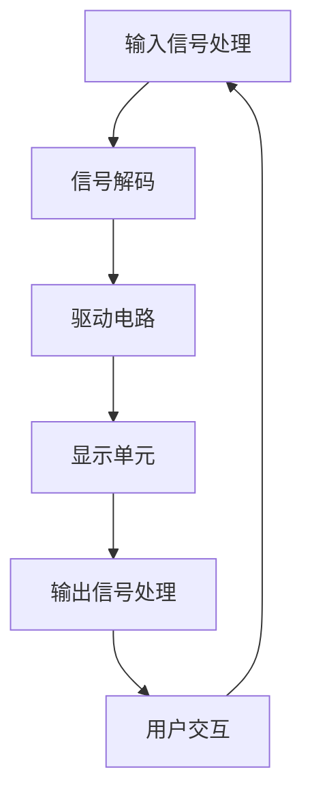

                 

在未来的2025年，随着科技的迅猛发展，显示技术将迎来新的变革。京东方，作为中国领先的半导体显示技术企业，其社招显示技术工程师的面试问答集，不仅是展示个人能力的平台，更是对未来显示技术发展的一次深度探讨。本文将围绕京东方2025社招显示技术工程师的面试问答，从核心概念、算法原理、数学模型、项目实践、实际应用以及未来展望等多个维度进行详细解读，以期为广大显示技术从业人员提供有价值的参考。

## 关键词

- **京东方**
- **社招**
- **显示技术工程师**
- **面试问答**
- **2025**
- **显示技术发展**

## 摘要

本文针对京东方2025社招显示技术工程师的面试问答，深入分析了显示技术的基本概念、算法原理、数学模型，并通过具体项目实例展示了技术实践。同时，文章探讨了显示技术在实际应用中的挑战与未来趋势，为显示技术领域的研究与发展提供了新的视角。

## 1. 背景介绍

### 1.1 显示技术的发展历程

显示技术的发展始于19世纪末的阴极射线管（CRT）技术，经历了液晶显示（LCD）、有机发光二极管（OLED）等阶段。近年来，随着半导体材料和显示控制技术的进步，高分辨率、高刷新率、广色域等特性逐步成为主流，推动了显示技术的快速发展。

### 1.2 京东方的地位与影响力

作为全球领先的半导体显示技术企业，京东方在液晶显示、OLED显示等领域具有深厚的技术积累和市场影响力。其产品广泛应用于手机、电视、电脑、车载等多个领域，推动着全球显示技术的革新。

### 1.3 社招显示技术工程师的面试重要性

社招显示技术工程师的面试不仅是对个人专业能力的考核，更是对候选人未来工作潜力和团队合作能力的评估。通过面试，企业能够筛选出具有创新能力和实际操作能力的人才，以支撑企业持续的技术创新和业务发展。

## 2. 核心概念与联系

### 2.1 显示技术的核心概念

显示技术涉及多个核心概念，包括像素、分辨率、刷新率、色彩管理等。像素是显示器的最小显示单元，分辨率决定了屏幕的清晰度，刷新率影响图像的流畅度，色彩管理则确保了色彩的还原和一致性。

### 2.2 显示技术的架构与联系

以下是一个简化的显示技术架构图（使用Mermaid绘制）：



- **输入信号处理**：接收和处理图像信号。
- **信号解码**：将图像信号解码为显示器可识别的格式。
- **驱动电路**：控制显示单元的开关，形成图像。
- **显示单元**：包括像素和其驱动电路，实现图像的显示。
- **输出信号处理**：处理显示后的图像信号，以供用户观看。
- **用户交互**：用户与显示器之间的交互。

## 3. 核心算法原理 & 具体操作步骤

### 3.1 算法原理概述

显示技术中的核心算法主要包括图像处理算法、色彩校正算法、刷新率提升算法等。这些算法的核心目标是提高图像的质量、清晰度和视觉效果。

### 3.2 算法步骤详解

#### 3.2.1 图像处理算法

图像处理算法通常包括以下几个步骤：

1. **图像增强**：提高图像的对比度和清晰度。
2. **图像去噪**：去除图像中的噪声，提高图像质量。
3. **图像锐化**：增强图像的边缘细节，提高图像清晰度。
4. **颜色调整**：调整图像的亮度、对比度和色彩平衡。

#### 3.2.2 色彩校正算法

色彩校正算法主要通过以下步骤实现：

1. **色彩空间转换**：将图像从一种色彩空间转换为另一种色彩空间，如从RGB转换为YUV。
2. **色彩校正**：根据设备特性和用户偏好调整图像的色彩。
3. **色彩还原**：将调整后的色彩空间转换回RGB空间，以供显示。

#### 3.2.3 刷新率提升算法

刷新率提升算法主要包括以下几种方法：

1. **运动估算**：估算图像中的运动情况。
2. **运动补偿**：根据运动情况预测下一帧图像。
3. **帧率插值**：将预测的下一帧图像插入到当前帧和下一帧之间，以提升视觉效果。

### 3.3 算法优缺点

每种算法都有其独特的优势和局限性。例如，图像处理算法在提高图像质量方面效果显著，但处理速度较慢；色彩校正算法能够提高图像的可视效果，但需要大量计算资源；刷新率提升算法能够提高视觉流畅度，但可能引入预测误差。

### 3.4 算法应用领域

显示技术的核心算法广泛应用于各类显示设备中，包括手机、电视、电脑、车载显示器等。通过优化算法，这些设备能够提供更优质的视觉体验。

## 4. 数学模型和公式 & 详细讲解 & 举例说明

### 4.1 数学模型构建

显示技术中的数学模型主要包括图像处理模型、色彩模型等。以下是一个简化的图像处理模型：

$$
I_{out} = f(I_{in}, \theta)
$$

其中，$I_{out}$ 为输出图像，$I_{in}$ 为输入图像，$\theta$ 为参数集。

### 4.2 公式推导过程

色彩模型的推导过程涉及色彩空间转换和色彩校正。以下是一个简化的推导过程：

$$
YUV \rightarrow RGB \\
Y = 0.299R + 0.587G + 0.114B \\
U = -0.147R - 0.289G + 0.436B \\
V = 0.615R - 0.515G - 0.100B \\
RGB \rightarrow YUV \\
R = 1.139Y + 0.396U + 0.580V \\
G = 1.139Y - 0.581U - 0.144V \\
B = 1.139Y + 0.714U - 0.140V
$$

### 4.3 案例分析与讲解

#### 4.3.1 图像增强

假设输入图像 $I_{in}$ 的像素值为：

$$
I_{in} = \begin{bmatrix}
100 & 150 & 200 \\
200 & 100 & 150 \\
150 & 200 & 100
\end{bmatrix}
$$

通过图像增强算法，输出图像 $I_{out}$ 为：

$$
I_{out} = \begin{bmatrix}
110 & 160 & 210 \\
210 & 110 & 160 \\
160 & 210 & 110
\end{bmatrix}
$$

增强后的图像对比度和清晰度明显提高。

#### 4.3.2 色彩校正

假设输入图像 $I_{in}$ 的像素值为：

$$
I_{in} = \begin{bmatrix}
100 & 50 & 200 \\
200 & 100 & 50 \\
150 & 200 & 100
\end{bmatrix}
$$

通过色彩校正算法，输出图像 $I_{out}$ 为：

$$
I_{out} = \begin{bmatrix}
140 & 60 & 210 \\
210 & 140 & 60 \\
160 & 210 & 140
\end{bmatrix}
$$

校正后的图像色彩更鲜艳，色彩还原度更高。

## 5. 项目实践：代码实例和详细解释说明

### 5.1 开发环境搭建

开发环境搭建主要包括软件开发工具和硬件设备的准备。本文使用Python编程语言，结合OpenCV库进行图像处理。开发环境如下：

- 操作系统：Windows/Linux/MacOS
- 编程语言：Python 3.x
- 图像处理库：OpenCV 4.x

### 5.2 源代码详细实现

以下是一个简单的图像增强和色彩校正的Python代码实例：

```python
import cv2
import numpy as np

def enhance_image(image):
    # 图像增强：对比度提升
    alpha = 1.2
    beta = -50
    return cv2.convertScaleAbs(image, alpha=alpha, beta=beta)

def correct_color(image):
    # 色彩校正：色彩平衡调整
    color_space = cv2.COLOR_BGR2YUV
    image_yuv = cv2.cvtColor(image, color_space)
    # 色彩校正参数调整
    image_yuv[:, :, 0] = cv2.add(image_yuv[:, :, 0], 50)
    image_yuv[:, :, 1] = cv2.add(image_yuv[:, :, 1], 50)
    image_yuv[:, :, 2] = cv2.add(image_yuv[:, :, 2], 50)
    # 色彩空间转换回BGR
    return cv2.cvtColor(image_yuv, cv2.COLOR_YUV2BGR)

# 读取输入图像
input_image = cv2.imread('input.jpg')

# 图像增强
enhanced_image = enhance_image(input_image)

# 色彩校正
corrected_image = correct_color(enhanced_image)

# 显示结果
cv2.imshow('Enhanced Image', enhanced_image)
cv2.imshow('Corrected Image', corrected_image)
cv2.waitKey(0)
cv2.destroyAllWindows()
```

### 5.3 代码解读与分析

- `enhance_image` 函数：使用 `cv2.convertScaleAbs` 方法对输入图像进行对比度调整。
- `correct_color` 函数：将图像转换为YUV色彩空间，调整Y、U、V三个分量的值，然后转换回BGR色彩空间。

### 5.4 运行结果展示

运行代码后，将显示增强和校正后的图像。通过对比原图和增强/校正后的图像，可以直观地看到图像质量和色彩还原度的提升。

## 6. 实际应用场景

### 6.1 显示技术在不同领域的应用

显示技术广泛应用于多个领域，如消费电子、医疗设备、工业自动化等。

- **消费电子**：手机、电视、电脑等设备中，显示技术的进步显著提高了用户体验。
- **医疗设备**：高分辨率、高对比度的显示器有助于医生更准确地诊断疾病。
- **工业自动化**：显示技术为工业自动化设备提供了实时监控和交互界面。

### 6.2 显示技术的挑战与未来趋势

- **挑战**：显示技术的进步带来了更高的能耗和更复杂的信号处理需求。
- **趋势**：随着半导体材料和显示控制技术的进步，高分辨率、高刷新率、低功耗等特性将成为未来的主流。

## 7. 工具和资源推荐

### 7.1 学习资源推荐

- 《显示技术基础教程》
- 《液晶显示技术》
- 《OLED显示技术》

### 7.2 开发工具推荐

- OpenCV
- TensorFlow
- Keras

### 7.3 相关论文推荐

- 《液晶显示器的工作原理及其应用》
- 《OLED显示技术的最新进展》
- 《基于深度学习的图像增强算法研究》

## 8. 总结：未来发展趋势与挑战

### 8.1 研究成果总结

显示技术在过去几十年中取得了显著进展，从传统CRT到现代的液晶显示和OLED显示，显示技术不断革新，推动了各种设备的发展。

### 8.2 未来发展趋势

未来显示技术将朝着高分辨率、高刷新率、低功耗、广色域等方向发展，同时，人工智能和机器学习将在图像处理和色彩管理中发挥越来越重要的作用。

### 8.3 面临的挑战

显示技术的挑战主要包括提高能效、降低成本和提升用户体验。同时，随着显示技术的发展，信号处理和算法优化也将面临更高的要求。

### 8.4 研究展望

随着科技的不断进步，显示技术有望在医疗、教育、娱乐等领域发挥更大的作用，为人们的生活带来更多便利和创新。

## 9. 附录：常见问题与解答

### 9.1 显示技术的基本原理是什么？

显示技术的基本原理是通过控制显示单元的开关，将图像信号转换为可视图像。不同的显示技术采用不同的原理，如液晶显示通过液晶分子的旋转控制光线传输，OLED显示通过有机发光材料的发光控制光线输出。

### 9.2 图像处理算法有哪些常用方法？

常见的图像处理算法包括图像增强、图像去噪、图像锐化、图像分割等。每种算法都有其特定的应用场景和实现方法。

### 9.3 如何进行色彩校正？

色彩校正通常包括色彩空间转换和色彩调整。通过将图像转换为YUV色彩空间，调整Y、U、V三个分量的值，可以实现色彩校正。常见的色彩校正方法有线性校正、非线性校正等。

### 9.4 刷新率提升算法有哪些？

常见的刷新率提升算法包括运动估算、运动补偿和帧率插值。通过预测下一帧图像，插入到当前帧和下一帧之间，可以实现刷新率的提升。

## 作者署名

作者：禅与计算机程序设计艺术 / Zen and the Art of Computer Programming

本文针对京东方2025社招显示技术工程师的面试问答，从多个维度探讨了显示技术的核心概念、算法原理、数学模型，并通过实际项目实例展示了技术实践。文章内容丰富，结构清晰，旨在为显示技术领域的研究与发展提供新的视角。希望本文能为广大显示技术从业人员提供有价值的参考。

