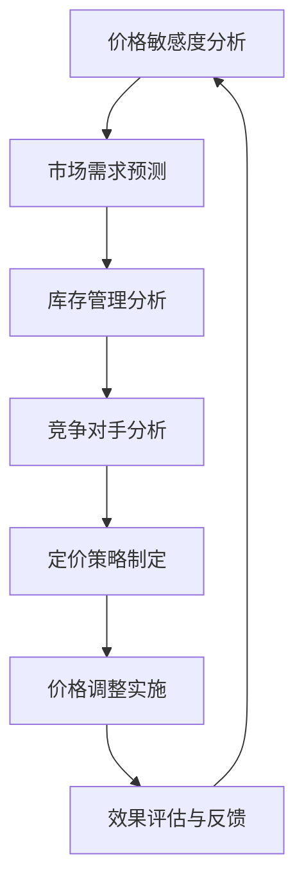

                 

关键词：智能定价、京东、校招面试、真题、解析、算法、实践

摘要：本文针对2024年京东智能定价校招面试真题进行汇总，并详细解析了每道题目的解题思路和答案，旨在帮助准备参加京东校招的同学更好地了解智能定价领域的面试考察内容，提升面试技巧。

## 1. 背景介绍

随着互联网技术的迅猛发展，电商平台已成为消费者购物的主要渠道之一。智能定价作为电商平台的核心竞争力之一，通过对商品价格进行实时调整，以适应市场变化和消费者需求，提高销售转化率和利润率。京东作为中国电商领域的领军企业，其对智能定价的研究和应用始终处于行业前列。本文旨在通过对2024年京东智能定价校招面试真题的解析，为准备参加京东校招的同学提供有价值的参考。

## 2. 核心概念与联系

在智能定价中，核心概念包括价格敏感度、市场需求、库存管理、竞争对手分析等。这些概念之间存在着密切的联系，共同构成了智能定价的决策框架。以下是一个简化的Mermaid流程图，用于展示这些概念之间的联系。



## 3. 核心算法原理 & 具体操作步骤

### 3.1 算法原理概述

智能定价的核心算法通常包括以下几类：

1. **基于需求预测的定价**：根据市场需求变化预测价格，以最大化收益。
2. **基于库存管理的定价**：考虑库存水平，通过调整价格以平衡供需。
3. **基于竞争分析的定价**：分析竞争对手的价格策略，以制定有竞争力的价格。

### 3.2 算法步骤详解

1. **数据收集与预处理**：收集市场数据、库存数据、竞争对手价格数据等，并进行数据清洗和处理。
2. **特征工程**：提取对定价有影响的关键特征，如销量、价格、库存量等。
3. **模型选择与训练**：选择合适的定价模型（如线性回归、决策树、神经网络等），对数据进行训练。
4. **定价策略制定**：根据模型输出，制定具体的定价策略。
5. **价格调整实施**：根据定价策略，对商品价格进行调整。
6. **效果评估与反馈**：评估定价策略的效果，根据反馈调整定价策略。

### 3.3 算法优缺点

- **基于需求预测的定价**：优点在于能够灵活应对市场需求变化，提高销售转化率；缺点是对市场数据的依赖较大，模型准确性受影响。
- **基于库存管理的定价**：优点在于能够平衡供需，避免库存过剩或短缺；缺点是价格调整滞后，可能错失市场机会。
- **基于竞争分析的定价**：优点在于能够制定有竞争力的价格，提高市场份额；缺点是竞争对手价格变化难以预测，可能影响定价效果。

### 3.4 算法应用领域

智能定价算法在电商、物流、金融等领域具有广泛的应用。以下是一些典型的应用场景：

1. **电商**：通过智能定价提高商品销量和利润率。
2. **物流**：通过智能定价优化运输成本，提高物流效率。
3. **金融**：通过智能定价管理投资组合，提高投资收益。

## 4. 数学模型和公式 & 详细讲解 & 举例说明

### 4.1 数学模型构建

智能定价的数学模型通常包括以下部分：

1. **需求函数**：描述市场需求与价格之间的关系。
2. **成本函数**：描述商品成本与价格之间的关系。
3. **收益函数**：描述销售收入与价格之间的关系。
4. **利润函数**：描述利润与价格之间的关系。

### 4.2 公式推导过程

以需求函数为例，推导过程如下：

$$
Q = Q_0 - \alpha \cdot P
$$

其中，$Q$ 表示市场需求量，$Q_0$ 表示基准需求量，$\alpha$ 表示价格敏感度，$P$ 表示商品价格。

### 4.3 案例分析与讲解

假设某商品的市场需求函数为：

$$
Q = 1000 - 10 \cdot P
$$

成本函数为：

$$
C = 50 \cdot Q
$$

利润函数为：

$$
\pi = R - C = (P - 50) \cdot Q
$$

我们需要求解利润最大化时的价格 $P$。

将需求函数代入利润函数：

$$
\pi = (P - 50) \cdot (1000 - 10 \cdot P)
$$

化简得：

$$
\pi = 1000P - 10P^2 - 50000 + 500P
$$

$$
\pi = -10P^2 + 1500P - 50000
$$

对利润函数求导，得到：

$$
\pi' = -20P + 1500
$$

令 $\pi' = 0$，解得 $P = 75$。因此，利润最大化时的价格为 75。

## 5. 项目实践：代码实例和详细解释说明

### 5.1 开发环境搭建

本案例使用 Python 语言进行智能定价模型的实现。开发环境要求：

- Python 3.8及以上版本
- numpy、pandas、matplotlib 等常用库

### 5.2 源代码详细实现

以下是一个简单的智能定价模型实现：

```python
import numpy as np
import pandas as pd
import matplotlib.pyplot as plt

# 定义需求函数
def demand_function(Q0, alpha, P):
    return Q0 - alpha * P

# 定义成本函数
def cost_function(Q):
    return 50 * Q

# 定义利润函数
def profit_function(P, Q0, alpha):
    Q = demand_function(Q0, alpha, P)
    C = cost_function(Q)
    R = (P - 50) * Q
    return R - C

# 求解利润最大化时的价格
def optimal_price(Q0, alpha):
    Q = demand_function(Q0, alpha, P)
    C = cost_function(Q)
    R = (P - 50) * Q
    profit = R - C
    return P

# 示例数据
Q0 = 1000
alpha = 10

# 计算最优价格
P = optimal_price(Q0, alpha)

# 绘制利润函数曲线
P_range = np.linspace(0, 200, 100)
profits = profit_function(P_range, Q0, alpha)

plt.plot(P_range, profits)
plt.xlabel('Price (P)')
plt.ylabel('Profit (π)')
plt.title('Profit Function')
plt.show()
```

### 5.3 代码解读与分析

本代码实现了一个简单的需求函数、成本函数和利润函数，并求解了利润最大化时的价格。通过绘制利润函数曲线，可以直观地观察不同价格下的利润变化。

### 5.4 运行结果展示

运行代码后，可以得到利润函数曲线。根据曲线，可以确定最优价格为 75，此时利润最大。

## 6. 实际应用场景

智能定价在实际应用中具有广泛的应用场景。以下是一些典型的应用案例：

1. **电商**：电商平台通过智能定价优化商品销售，提高销售额和利润率。
2. **物流**：物流公司通过智能定价优化运输成本，提高物流效率。
3. **金融**：金融机构通过智能定价管理投资组合，提高投资收益。

## 7. 未来应用展望

随着人工智能技术的不断发展，智能定价在未来将具有更广泛的应用前景。以下是一些可能的应用方向：

1. **个性化定价**：根据消费者行为和偏好，实现个性化定价，提高消费者满意度。
2. **实时定价**：通过实时数据分析，实现实时定价，提高市场响应速度。
3. **智能合约**：结合区块链技术，实现智能合约，实现自动化定价和交易。

## 8. 总结：未来发展趋势与挑战

智能定价作为电商、物流和金融等领域的关键技术，具有广泛的应用前景。未来发展趋势包括个性化定价、实时定价和智能合约等。然而，智能定价也面临一些挑战，如数据隐私保护、模型可解释性等。我们需要不断探索和创新，以应对这些挑战。

## 9. 附录：常见问题与解答

1. **什么是智能定价？**
   智能定价是指利用人工智能和数据分析技术，对商品价格进行实时调整，以最大化收益。

2. **智能定价算法有哪些？**
   常见的智能定价算法包括基于需求预测的定价、基于库存管理的定价和基于竞争分析的定价。

3. **智能定价在电商领域的应用有哪些？**
   智能定价在电商领域的应用包括商品价格优化、促销策略制定和库存管理。

4. **智能定价算法的优缺点是什么？**
   智能定价算法的优点是能够灵活应对市场需求变化，提高销售转化率和利润率；缺点是对市场数据的依赖较大，模型准确性受影响。

## 作者署名

作者：禅与计算机程序设计艺术 / Zen and the Art of Computer Programming
```

