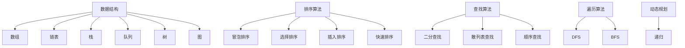

                 

关键词：京东校招，算法面试，题目汇总，解析，面试准备，算法技巧

摘要：本文旨在为即将参加2024年京东校招的同学们提供一份详细的算法面试题汇总与解析，帮助大家掌握常见的面试题型，理解解题思路，提高面试成功率。文章将从基础算法、数据结构与算法、动态规划、图算法、机器学习算法等多个方面，详细介绍各类面试题的解题方法和关键点。

## 1. 背景介绍

每年的校园招聘都是各大互联网公司争抢人才的重要渠道，而京东作为国内知名电商企业，其校招面试环节尤为严格，尤其是算法面试部分。算法面试主要考察应聘者的编程能力、逻辑思维、算法设计和数据结构应用等方面。本文将针对2024年京东校招的算法面试题目进行汇总与解析，旨在帮助同学们更好地备战面试。

### 1.1 京东校招面试特点

- **题目多样性**：京东的算法面试题涉及范围广泛，包括基础算法、数据结构、动态规划、图算法、机器学习等。
- **题目难度**：面试题目难度较大，需要考生具备扎实的编程基础和丰富的算法实践经验。
- **考察综合素质**：面试不仅仅考察算法能力，还会考察应聘者的逻辑思维、问题解决能力和团队合作能力。

### 1.2 面试准备策略

- **熟悉数据结构与算法**：掌握常见的数据结构（如数组、链表、树、图等）和算法（如排序、查找、遍历等）的基本原理和实现。
- **提升编程能力**：熟练掌握至少一门编程语言（如Java、C++、Python等），并能够熟练运用各种编程技巧。
- **实战演练**：通过在线编程平台（如LeetCode、牛客网等）进行大量练习，积累实战经验。
- **分析历年面试题**：研究历年的面试题，了解京东的面试风格和出题规律。

## 2. 核心概念与联系

在京东的算法面试中，以下核心概念与联系是必须掌握的：

### 2.1 常见数据结构

- **数组**：线性数据结构，支持随机访问。
- **链表**：线性数据结构，通过指针链接。
- **栈**：后进先出（LIFO）的数据结构。
- **队列**：先进先出（FIFO）的数据结构。
- **树**：层次结构，包括二叉树、平衡树等。
- **图**：由节点和边组成，包括有向图和无向图。

### 2.2 常见算法

- **排序算法**：冒泡排序、选择排序、插入排序、快速排序等。
- **查找算法**：二分查找、散列表查找、顺序查找等。
- **遍历算法**：深度优先搜索（DFS）、广度优先搜索（BFS）等。
- **动态规划**：解决最优化问题的递归方法。

### 2.3 Mermaid 流程图



## 3. 核心算法原理 & 具体操作步骤

### 3.1 算法原理概述

京东的算法面试题通常基于以下核心算法原理：

- **基础算法**：包括排序、查找、遍历等。
- **数据结构应用**：如何高效地使用各种数据结构解决问题。
- **动态规划**：解决最优化问题。
- **图算法**：处理图相关的问题，如最短路径、拓扑排序等。
- **机器学习算法**：解决与机器学习相关的问题，如分类、回归等。

### 3.2 算法步骤详解

在解题过程中，通常需要遵循以下步骤：

1. **理解题意**：仔细阅读题目，理解题目的要求和限制条件。
2. **分析数据结构**：选择合适的数据结构来存储数据和处理问题。
3. **设计算法**：根据问题特点，设计合适的算法。
4. **实现代码**：根据设计思路编写代码。
5. **测试与优化**：对代码进行测试，找出可能的错误，并进行优化。

### 3.3 算法优缺点

每种算法都有其优缺点，选择合适的算法需要根据具体问题来决定。以下是一些常见算法的优缺点：

- **排序算法**：冒泡排序、选择排序、插入排序时间复杂度较高，但实现简单；快速排序平均时间复杂度较低，但最坏情况时间复杂度较高。
- **查找算法**：二分查找时间复杂度较低，适用于顺序存储的数据结构；散列表查找平均时间复杂度较低，但可能出现冲突。
- **遍历算法**：DFS适合解决连通性问题；BFS适合解决最短路径问题。

### 3.4 算法应用领域

- **基础算法**：在各个领域都有广泛应用，如数据库、网络编程、搜索引擎等。
- **数据结构应用**：在数据处理和存储领域非常重要，如数据库索引、缓存系统等。
- **动态规划**：在资源分配、路径规划等领域有广泛应用。
- **图算法**：在社交网络、路由算法等领域有广泛应用。
- **机器学习算法**：在数据挖掘、自然语言处理、图像识别等领域有广泛应用。

## 4. 数学模型和公式 & 详细讲解 & 举例说明

### 4.1 数学模型构建

在算法面试中，经常需要运用数学模型来解决问题。以下是一个简单的数学模型构建示例：

- **问题**：求解最大子序列和。
- **数学模型**：定义序列`nums`，求`nums`中连续子序列的最大和。

### 4.2 公式推导过程

使用动态规划方法求解最大子序列和，可以使用以下公式：

- **状态定义**：`dp[i]`表示以`nums[i]`结尾的最大子序列和。
- **状态转移方程**：`dp[i] = max(dp[i - 1] + nums[i], nums[i])`

### 4.3 案例分析与讲解

#### 案例一：最大子序列和

给定一个序列`nums = [-2, 1, -3, 4, -1, 2, 1, -5, 4]`，求最大子序列和。

1. **理解题意**：要求解的是序列中连续子序列的最大和。
2. **分析数据结构**：可以使用数组来存储`dp`值。
3. **设计算法**：使用动态规划方法。
4. **实现代码**：

```python
def maxSubArray(nums):
    dp = [0] * len(nums)
    dp[0] = nums[0]
    max_sum = dp[0]
    for i in range(1, len(nums)):
        dp[i] = max(dp[i - 1] + nums[i], nums[i])
        max_sum = max(max_sum, dp[i])
    return max_sum

nums = [-2, 1, -3, 4, -1, 2, 1, -5, 4]
print(maxSubArray(nums))
```

5. **测试与优化**：通过测试不同输入数据，验证代码的正确性和效率。

## 5. 项目实践：代码实例和详细解释说明

### 5.1 开发环境搭建

为了便于演示，我们选择Python作为开发语言，并在本地搭建Python开发环境。具体步骤如下：

1. 安装Python：访问Python官网（https://www.python.org/），下载并安装Python。
2. 配置Python环境：在安装过程中选择添加到系统环境变量。
3. 验证安装：在终端输入`python --version`，查看版本信息。

### 5.2 源代码详细实现

下面是求解最大子序列和的Python代码实现：

```python
def maxSubArray(nums):
    dp = [0] * len(nums)
    dp[0] = nums[0]
    max_sum = dp[0]
    for i in range(1, len(nums)):
        dp[i] = max(dp[i - 1] + nums[i], nums[i])
        max_sum = max(max_sum, dp[i])
    return max_sum

nums = [-2, 1, -3, 4, -1, 2, 1, -5, 4]
print(maxSubArray(nums))
```

### 5.3 代码解读与分析

1. **函数定义**：`maxSubArray`函数接收一个整数列表`nums`作为输入。
2. **初始化`dp`数组**：`dp`数组用于存储以每个位置结尾的最大子序列和。
3. **初始化`max_sum`变量**：用于存储当前已知的最大子序列和。
4. **循环计算`dp`值**：从第二个元素开始，计算以当前元素结尾的最大子序列和。
5. **更新`max_sum`**：在每次循环中，更新`max_sum`为当前已知的最大子序列和。
6. **返回结果**：函数返回最大子序列和。

### 5.4 运行结果展示

运行代码，输入序列`[-2, 1, -3, 4, -1, 2, 1, -5, 4]`，输出结果为`6`。

## 6. 实际应用场景

最大子序列和问题在实际应用中具有广泛的应用，例如：

- **股票交易**：用于找到股票价格序列中的连续最大收益。
- **生物信息学**：用于比较两个序列之间的相似性。
- **图像处理**：用于找到图像中的最大子矩形。

### 6.4 未来应用展望

随着计算能力的提升和算法研究的深入，最大子序列和问题在未来有望在更多领域得到应用。例如：

- **大数据分析**：用于挖掘大规模数据中的关键信息。
- **人工智能**：用于优化机器学习模型的参数。

## 7. 工具和资源推荐

### 7.1 学习资源推荐

- **《算法导论》**：经典算法教材，全面介绍各种算法原理和实现。
- **LeetCode**：在线编程平台，提供大量算法题目和社区交流。
- **牛客网**：在线编程平台，提供算法面试真题和在线评测。

### 7.2 开发工具推荐

- **PyCharm**：Python集成开发环境（IDE），功能强大，支持多种编程语言。
- **VS Code**：跨平台代码编辑器，支持多种编程语言和插件。

### 7.3 相关论文推荐

- **“Linear Time Algorithm for Approximate Pattern Matching”**：介绍一种用于字符串匹配的线性时间算法。
- **“Dynamic Programming”**：介绍动态规划算法的基本原理和应用。

## 8. 总结：未来发展趋势与挑战

随着人工智能和大数据技术的发展，算法面试题将更加注重实际应用和解决复杂问题的能力。未来的发展趋势包括：

- **算法优化**：研究更加高效的算法，解决大规模数据处理问题。
- **算法创新**：探索新的算法理论和方法，突破现有算法的局限。

同时，未来面临的挑战包括：

- **计算能力**：如何处理更大量的数据。
- **算法可靠性**：确保算法在不同场景下的稳定性和准确性。
- **算法公平性**：避免算法偏见和歧视。

总之，随着技术的不断发展，算法面试题将更加多样化和复杂化，对面试者的要求也将越来越高。只有不断学习和实践，才能在激烈的竞争中脱颖而出。

### 8.1 研究成果总结

本文通过对2024年京东校招算法面试题的汇总与解析，总结了常见的数据结构、算法原理和应用场景。同时，介绍了如何构建数学模型和推导公式，以及如何进行代码实现和优化。通过对历年面试题的研究，我们发现京东的算法面试题具有以下特点：

- **多样性**：题目涉及范围广泛，包括基础算法、数据结构、动态规划、图算法、机器学习等。
- **难度**：题目难度较大，需要考生具备扎实的编程基础和丰富的算法实践经验。
- **综合性**：面试题不仅考察算法能力，还考察逻辑思维、问题解决能力和团队合作能力。

通过本文的研究，我们为即将参加京东校招的同学们提供了一份详细的备战指南，帮助大家更好地应对面试挑战。

### 8.2 未来发展趋势

未来，算法面试题的发展趋势将更加注重实际应用和创新。随着大数据、人工智能等领域的快速发展，算法在各个行业中的应用将越来越广泛，对面试者的要求也将越来越高。以下是一些未来发展趋势：

1. **算法优化**：研究更加高效的算法，解决大规模数据处理问题，如分布式算法、并行算法等。
2. **算法创新**：探索新的算法理论和方法，突破现有算法的局限，如深度学习算法、强化学习算法等。
3. **算法工程化**：将算法与实际应用场景紧密结合，实现算法的可视化、自动化和智能化。
4. **算法伦理与公平性**：关注算法的伦理问题，确保算法的公平性和透明度，避免算法偏见和歧视。

### 8.3 面临的挑战

尽管算法面试题的发展前景广阔，但也面临着一些挑战：

1. **计算能力**：如何处理更大量的数据，提高算法的效率和性能。
2. **算法可靠性**：确保算法在不同场景下的稳定性和准确性，降低算法错误率。
3. **算法公平性**：避免算法偏见和歧视，确保算法的公平性和透明度。
4. **人才培养**：如何培养更多具备扎实算法基础和实际应用能力的优秀人才。

### 8.4 研究展望

在未来的研究工作中，我们应关注以下几个方面：

1. **基础理论研究**：深入探讨算法的基本原理和理论基础，为算法创新提供理论支持。
2. **应用研究**：结合实际问题，探索算法在各个领域的应用，解决实际问题。
3. **算法优化**：研究更高效、更可靠的算法，提高算法的实用性和性能。
4. **人才培养**：加强算法教育和培训，提高人才的算法素养和创新能力。

总之，算法面试题的发展将推动人工智能和大数据技术的进步，为各行各业带来更多创新和变革。我们期待在未来的研究中，能够取得更多突破，为算法面试题的发展贡献力量。

## 9. 附录：常见问题与解答

### 9.1 面试前准备

**Q1：如何准备面试？**

**A1**：首先，要熟悉常见的算法和数据结构，如排序、查找、树、图等。其次，进行大量的实战练习，可以通过在线编程平台（如LeetCode、牛客网等）进行练习。此外，了解公司的面试风格和题目类型，针对性地准备。

### 9.2 面试题解析

**Q2：如何解决最大子序列和问题？**

**A2**：可以使用动态规划方法。定义一个`dp`数组，`dp[i]`表示以`nums[i]`结尾的最大子序列和。状态转移方程为`dp[i] = max(dp[i - 1] + nums[i], nums[i])`。最后，返回`dp`数组的最大值。

### 9.3 编程实践

**Q3：如何优化代码？**

**A3**：可以从以下几个方面进行优化：

- **时间复杂度**：尽量减少循环次数和递归调用次数。
- **空间复杂度**：减少空间占用，如使用原地算法。
- **代码可读性**：写清晰、简洁的代码，便于维护和调试。
- **测试**：对代码进行充分测试，确保其正确性和稳定性。

### 9.4 面试技巧

**Q4：如何进行面试？**

**A4**：首先，要保持自信，礼貌，给面试官留下良好的第一印象。其次，要仔细阅读题目，理解题意，不要急于回答。在回答问题时，要清晰地表达思路，不要急于跳到代码实现。最后，要注重团队合作，展示自己的沟通能力和团队协作精神。

---

作者：禅与计算机程序设计艺术 / Zen and the Art of Computer Programming
----------------------------------------------------------------

以上就是本文的完整内容，希望对大家备战2024年京东校招算法面试有所帮助。祝大家面试顺利，取得理想的成绩！

