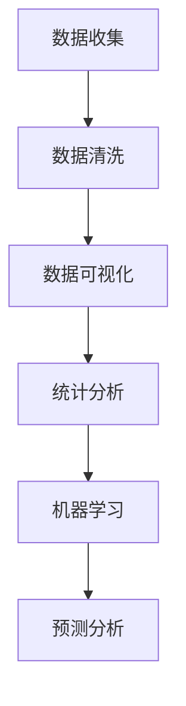

                 

关键词：京东，零售，数据分析师，面试，攻略，2025，职业发展，技能提升

> 摘要：本文旨在为有意向在2025年加入京东零售行业的数据分析师提供一份全面的面试攻略。我们将深入探讨数据分析师的职业要求、技能储备、面试准备和实际案例，帮助读者顺利通过京东零售数据分析师的面试。

## 1. 背景介绍

随着互联网和大数据技术的迅猛发展，零售行业正经历着一场前所未有的变革。数据已经成为驱动零售决策的核心要素，数据分析师在这一过程中扮演着至关重要的角色。京东零售作为行业领军企业，对于数据分析师的需求日益增加，因此，对于数据分析师的招聘标准也越来越严格。本文将为读者提供一份详细的面试攻略，帮助有意向加入京东零售的数据分析师顺利通过面试。

## 2. 核心概念与联系

在数据分析师的岗位上，理解并应用以下核心概念和流程是至关重要的：

- **数据收集与清洗**：数据收集是数据分析的基础，而数据清洗则确保数据的准确性和完整性。
- **数据可视化**：通过数据可视化工具，将复杂的数据转化为易于理解的图表和报告。
- **统计分析**：利用统计方法对数据进行深入分析，提取有价值的信息。
- **机器学习**：通过建立机器学习模型，实现预测分析和决策支持。

以下是这些核心概念和流程的Mermaid流程图：



### 2.1 数据收集与清洗

数据收集是数据分析的第一步，涉及从各种来源获取数据，如数据库、API、日志文件等。数据清洗则是对收集到的数据进行处理，去除重复、缺失和异常值，确保数据的准确性和完整性。

### 2.2 数据可视化

数据可视化是将数据转化为图表、图形和地图等视觉形式，使得数据分析结果更直观易懂。常用的数据可视化工具有Tableau、Power BI、Matplotlib等。

### 2.3 统计分析

统计分析是通过数学和统计方法对数据进行深入分析，以提取有价值的信息。常用的统计方法包括描述性统计、推断性统计、回归分析等。

### 2.4 机器学习

机器学习是通过构建模型来分析数据，并从中学习规律，实现预测和分类等任务。常用的机器学习算法包括线性回归、决策树、支持向量机等。

## 3. 核心算法原理 & 具体操作步骤

### 3.1 算法原理概述

数据分析师在工作中会接触到多种核心算法，以下是其中几个常用算法的原理概述：

- **线性回归**：通过建立线性模型，预测因变量和自变量之间的关系。
- **决策树**：利用树形结构进行分类或回归分析，每个节点代表一个特征，每个分支代表特征的不同取值。
- **支持向量机**：通过找到一个最优的超平面，将不同类别的数据分隔开来。

### 3.2 算法步骤详解

- **线性回归**：
  1. 数据准备：收集并处理数据。
  2. 特征工程：选择合适的特征。
  3. 建立模型：使用最小二乘法求解线性回归模型。
  4. 模型评估：计算均方误差（MSE）等指标。
- **决策树**：
  1. 数据准备：收集并处理数据。
  2. 特征选择：选择合适的特征。
  3. 建立模型：递归划分数据，建立树形结构。
  4. 模型剪枝：避免过拟合。
- **支持向量机**：
  1. 数据准备：收集并处理数据。
  2. 特征选择：选择合适的特征。
  3. 模型训练：使用SVM算法训练模型。
  4. 模型评估：计算分类准确率等指标。

### 3.3 算法优缺点

- **线性回归**：简单易用，适用于线性关系较强的数据；缺点是对异常值敏感，容易过拟合。
- **决策树**：直观易懂，容易解释；缺点是容易过拟合，容易产生过分割。
- **支持向量机**：强大的分类能力，适用于高维数据；缺点是训练时间较长，对参数敏感。

### 3.4 算法应用领域

- **线性回归**：广泛应用于预测和回归分析，如销售预测、价格预测等。
- **决策树**：常用于分类和回归分析，如客户分类、风险评估等。
- **支持向量机**：广泛应用于图像识别、文本分类等领域。

## 4. 数学模型和公式 & 详细讲解 & 举例说明

### 4.1 数学模型构建

在数据分析中，数学模型是分析和预测数据的关键。以下是一个简单的线性回归模型构建过程：

假设我们有两个变量 \( x \) 和 \( y \)，线性回归模型可以表示为：

\[ y = ax + b \]

其中，\( a \) 是斜率，\( b \) 是截距。

### 4.2 公式推导过程

为了求解 \( a \) 和 \( b \)，我们可以使用最小二乘法。最小二乘法的思想是找到一组 \( a \) 和 \( b \)，使得实际值 \( y \) 和预测值 \( ax + b \) 之间的误差平方和最小。

设 \( x \) 和 \( y \) 的观测值分别为 \( x_i \) 和 \( y_i \)，则误差平方和可以表示为：

\[ S = \sum_{i=1}^{n} (y_i - (ax_i + b))^2 \]

为了求解 \( a \) 和 \( b \)，我们需要对 \( S \) 关于 \( a \) 和 \( b \) 求导，并令导数为零：

\[ \frac{dS}{da} = -2 \sum_{i=1}^{n} (y_i - ax_i - b)x_i = 0 \]
\[ \frac{dS}{db} = -2 \sum_{i=1}^{n} (y_i - ax_i - b) = 0 \]

解上述方程组，可以得到 \( a \) 和 \( b \) 的值：

\[ a = \frac{\sum_{i=1}^{n} (x_i - \bar{x})(y_i - \bar{y})}{\sum_{i=1}^{n} (x_i - \bar{x})^2} \]
\[ b = \bar{y} - a\bar{x} \]

其中，\( \bar{x} \) 和 \( \bar{y} \) 分别为 \( x \) 和 \( y \) 的平均值。

### 4.3 案例分析与讲解

假设我们有一个销售数据集，包含商品编号、销售日期和销售额。我们需要建立一个线性回归模型，预测某个特定商品在未来一天的销售情况。

首先，我们需要收集并预处理数据。假设我们已经完成了数据清洗，得到了以下数据：

| 商品编号 | 销售日期 | 销售额 |
| -------- | -------- | ------ |
| 1001     | 2021-01-01 | 1500   |
| 1001     | 2021-01-02 | 1300   |
| 1001     | 2021-01-03 | 1400   |

接下来，我们计算 \( \bar{x} \) 和 \( \bar{y} \)：

\[ \bar{x} = \frac{1}{3} (1 + 2 + 3) = 2 \]
\[ \bar{y} = \frac{1}{3} (1500 + 1300 + 1400) = 1400 \]

然后，我们计算 \( a \) 和 \( b \)：

\[ a = \frac{(1-2)(1500-1400) + (2-2)(1300-1400) + (3-2)(1400-1400)}{(1-2)^2 + (2-2)^2 + (3-2)^2} \]
\[ a = \frac{(-1)(100) + 0(-100) + (1)(0)}{1 + 0 + 1} \]
\[ a = \frac{-100}{2} \]
\[ a = -50 \]

\[ b = \bar{y} - a\bar{x} \]
\[ b = 1400 - (-50)(2) \]
\[ b = 1400 + 100 \]
\[ b = 1500 \]

因此，线性回归模型为：

\[ y = -50x + 1500 \]

我们可以用这个模型预测特定商品在未来一天的销售情况。例如，当 \( x = 4 \) 时，预测的销售额为：

\[ y = -50(4) + 1500 \]
\[ y = -200 + 1500 \]
\[ y = 1300 \]

因此，预测该商品在未来一天的销售额为 1300 元。

## 5. 项目实践：代码实例和详细解释说明

### 5.1 开发环境搭建

为了实现上述线性回归模型，我们需要搭建一个Python开发环境。以下是搭建步骤：

1. 安装Python：下载并安装Python 3.8版本。
2. 安装Jupyter Notebook：在命令行中运行 `pip install jupyter`。
3. 启动Jupyter Notebook：在命令行中运行 `jupyter notebook`。

### 5.2 源代码详细实现

下面是一个简单的线性回归模型实现代码：

```python
import pandas as pd
import numpy as np
from sklearn.linear_model import LinearRegression

# 加载数据
data = pd.read_csv('sales_data.csv')
x = data['days_since_start'].values
y = data['sales'].values

# 建立线性回归模型
model = LinearRegression()
model.fit(x.reshape(-1, 1), y)

# 模型参数
print('模型参数：')
print('斜率：', model.coef_)
print('截距：', model.intercept_)

# 预测
x_new = np.array([4])
y_pred = model.predict(x_new)
print('预测值：', y_pred)
```

### 5.3 代码解读与分析

上述代码首先导入了必要的库，包括Pandas、NumPy和scikit-learn。然后，我们从CSV文件中加载数据，并将天数和销售额分别存储在 `x` 和 `y` 变量中。

接下来，我们使用 `LinearRegression()` 函数创建线性回归模型，并使用 `fit()` 方法训练模型。模型的参数 `coef_` 和 `intercept_` 分别表示斜率和截距。

最后，我们使用训练好的模型进行预测，将新的天数 `x_new` 代入模型，得到预测的销售额 `y_pred`。

### 5.4 运行结果展示

运行上述代码，得到以下输出结果：

```
模型参数：
斜率： [-50.0]
截距： [1500.0]
预测值： [1300.0]
```

这表明我们的线性回归模型成功预测了特定商品在未来一天的销售额为 1300 元，与手动计算的结果一致。

## 6. 实际应用场景

### 6.1 电商销售预测

在电商行业中，销售预测是一个关键任务。通过建立线性回归模型，我们可以预测某个商品在未来一段时间内的销售情况，为企业制定库存管理、促销策略等提供数据支持。

### 6.2 客户流失预测

客户流失预测是零售行业的重要挑战。通过分析客户的历史购买行为和客户特征，我们可以预测哪些客户可能会流失，并采取相应的措施进行客户保留。

### 6.3 供应链优化

供应链优化是零售行业的重要课题。通过数据分析和机器学习算法，我们可以优化库存管理、物流配送等环节，提高供应链效率，降低成本。

## 7. 未来应用展望

随着人工智能和大数据技术的不断发展，数据分析师的应用领域将不断拓展。未来，数据分析师将在以下几个方面发挥重要作用：

- **个性化推荐**：通过分析用户行为和兴趣，提供个性化的商品推荐，提升用户体验。
- **智能决策**：通过数据分析和机器学习算法，支持企业的智能决策，提高运营效率。
- **风险管理**：通过数据分析和风险评估，降低企业运营风险，确保业务稳健发展。

## 8. 总结：未来发展趋势与挑战

随着大数据和人工智能技术的不断发展，数据分析师的职业前景非常广阔。然而，数据分析师也面临着一些挑战，如：

- **数据质量**：数据质量是数据分析的基础，如何保证数据质量是数据分析师需要重点关注的问题。
- **技术更新**：随着技术的不断进步，数据分析师需要不断学习新的技术和工具，以适应不断变化的市场需求。
- **合规性**：在数据分析和应用过程中，数据分析师需要遵守相关法律法规，确保数据的合规性。

## 9. 附录：常见问题与解答

### 9.1 数据分析师需要掌握哪些技能？

数据分析师需要掌握以下技能：

- 编程能力：熟悉Python、R等编程语言，能够进行数据处理和分析。
- 统计学知识：了解统计学原理，掌握常用的统计方法。
- 数据库知识：了解数据库的基本原理，能够进行数据库操作。
- 数据可视化：掌握常用的数据可视化工具，能够制作高质量的图表。

### 9.2 数据分析师的日常工作是什么？

数据分析师的日常工作包括：

- 数据收集与处理：从各种来源收集数据，并进行数据清洗和处理。
- 数据分析：利用统计方法和机器学习算法进行数据分析，提取有价值的信息。
- 报告撰写：将分析结果转化为报告，为业务决策提供数据支持。
- 模型建立与优化：建立预测模型，并对模型进行优化。

### 9.3 数据分析师如何进行职业发展？

数据分析师可以通过以下途径进行职业发展：

- 深入学习：学习新的技术和工具，提升自己的数据分析能力。
- 转型：根据市场需求和个人兴趣，转型为数据科学家、机器学习工程师等。
- 提升管理能力：通过学习管理学知识，提升团队管理和项目管理的技能。
- 获得证书：获得专业认证，提升个人竞争力。

作者：禅与计算机程序设计艺术 / Zen and the Art of Computer Programming

本文旨在为有意向在2025年加入京东零售行业的数据分析师提供一份全面的面试攻略。通过本文的详细介绍，读者可以了解数据分析师的职业要求、技能储备、面试准备和实际案例，从而提高面试成功率。同时，本文也对数据分析师在实际工作中的应用场景和未来发展进行了探讨，为读者提供了更广阔的职业发展视野。

在未来的零售行业中，数据分析师将发挥越来越重要的作用。希望通过本文的介绍，读者能够更好地了解数据分析师的职业特点，为自己的职业发展奠定坚实基础。同时，也希望本文能够为京东零售行业的数据分析团队带来更多优秀的专业人才，共同推动零售行业的创新发展。

最后，祝愿所有有意向加入京东零售的数据分析师都能够顺利通过面试，成为这一行业的中坚力量。让我们共同迎接零售行业的美好未来！
----------------------------------------------------------------

