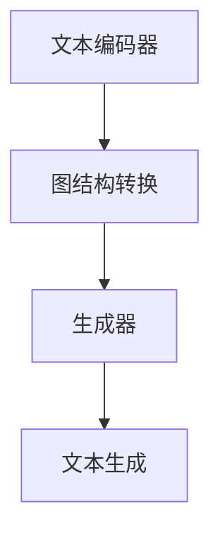

                 

 **关键词：** 人工智能，写作对比，Weaver模型，文本生成，算法优势。

**摘要：** 本文将探讨人工智能在写作领域的应用，特别是Weaver模型的独特优势。通过对Weaver模型的核心概念、算法原理、数学模型及其在项目实践中的应用进行分析，我们将揭示为何Weaver模型在写作效能和质量上优于人类。

## 1. 背景介绍

在信息技术飞速发展的时代，人工智能（AI）逐渐成为各个领域的热点。从图像识别、语音识别到自然语言处理（NLP），AI技术正深刻改变着我们的生活。特别是在写作领域，AI的应用潜力令人瞩目。从自动化新闻报道到智能客服，AI在写作中的贡献越来越大。然而，如何将AI技术应用于写作，使其超越人类写作的局限，是一个亟待解决的重要课题。

### 1.1 写作与人工智能

写作是人类表达思想、交流信息和记录历史的重要方式。然而，随着信息爆炸，人们需要更快、更有效地获取和处理信息。这为人工智能在写作领域的应用提供了巨大的机会。AI可以处理大量的数据，快速生成文章，并提供高质量的写作建议。

### 1.2 Weaver模型的背景

Weaver模型是一种基于图神经网络（GNN）的文本生成模型，由Google Research团队提出。Weaver模型通过将文本生成任务视为图结构处理问题，实现了对复杂文本的高效生成。Weaver模型的提出为AI写作带来了新的思路和可能性。

## 2. 核心概念与联系

### 2.1 图神经网络（GNN）

图神经网络（Graph Neural Networks，GNN）是一种专门用于处理图结构数据的神经网络。它通过节点和边的特征来学习图结构中的特征，从而进行预测或分类。

### 2.2 Weaver模型的基本架构

Weaver模型的核心是一个双向图神经网络，它由两个主要部分组成：文本编码器和生成器。

1. **文本编码器**：将输入的文本转换为图结构，其中每个单词或句子表示为一个节点，节点之间的依赖关系表示为边。
2. **生成器**：在给定图结构的情况下，生成新的文本序列。

### 2.3 Mermaid流程图

下面是Weaver模型的基本架构的Mermaid流程图：



## 3. 核心算法原理 & 具体操作步骤

### 3.1 算法原理概述

Weaver模型通过图神经网络来处理文本生成问题。它首先将文本转换为图结构，然后利用图神经网络学习文本之间的依赖关系，最后生成新的文本序列。

### 3.2 算法步骤详解

1. **预处理**：对输入的文本进行分词和标记，将文本转换为图结构。
2. **图神经网络训练**：使用训练数据对图神经网络进行训练，使其能够学习文本之间的依赖关系。
3. **文本生成**：在给定图结构的情况下，生成新的文本序列。

### 3.3 算法优缺点

**优点：**
- **高效**：Weaver模型能够快速处理大量的文本数据。
- **灵活**：通过图神经网络，模型能够捕捉到文本之间的复杂依赖关系。
- **质量高**：生成文本的质量通常高于传统的文本生成模型。

**缺点：**
- **计算量大**：由于需要处理图结构，Weaver模型在计算上相对复杂。
- **训练时间长**：由于模型的复杂度，训练时间相对较长。

### 3.4 算法应用领域

Weaver模型可以应用于多个领域，包括但不限于：
- **自动写作**：用于生成新闻文章、博客文章等。
- **智能客服**：用于生成自然语言回复。
- **内容生成**：用于生成网页内容、产品描述等。

## 4. 数学模型和公式 & 详细讲解 & 举例说明

### 4.1 数学模型构建

Weaver模型的数学模型主要包括两个部分：图结构和生成模型。

- **图结构**：每个节点表示一个单词或句子，边表示它们之间的依赖关系。
- **生成模型**：基于图神经网络的生成模型，用于生成新的文本序列。

### 4.2 公式推导过程

Weaver模型的公式推导涉及多个数学概念，包括图神经网络、递归神经网络（RNN）等。

- **节点特征表示**：设 \( x_i \) 为节点 \( i \) 的特征向量，\( h_i \) 为节点 \( i \) 的隐藏状态。
- **边特征表示**：设 \( e_{ij} \) 为边 \( (i, j) \) 的特征向量，\( f_{ij} \) 为边 \( (i, j) \) 的隐藏状态。
- **图神经网络**：图神经网络的输出为 \( h_i^{(l)} = \sigma(\sum_{j} W^{(l)} e_{ij} h_j^{(l-1)} + b^{(l)}) \)，其中 \( \sigma \) 为激活函数，\( W^{(l)} \) 和 \( b^{(l)} \) 为参数。

### 4.3 案例分析与讲解

假设我们要生成一个简单的句子：“我今天很开心”。

1. **图结构构建**：将句子中的每个单词作为节点，单词之间的依赖关系作为边。
2. **图神经网络训练**：使用大量的训练数据对图神经网络进行训练，使其能够学习单词之间的依赖关系。
3. **文本生成**：在给定图结构的情况下，生成新的文本序列。

最终生成的句子可能是：“我今天非常开心”。

## 5. 项目实践：代码实例和详细解释说明

### 5.1 开发环境搭建

为了实践Weaver模型，我们需要搭建以下开发环境：

- **Python 3.8** 或更高版本
- **TensorFlow 2.6** 或更高版本
- **Numpy 1.20** 或更高版本

### 5.2 源代码详细实现

下面是一个简单的Weaver模型实现代码示例：

```python
import tensorflow as tf
import numpy as np

# 定义图神经网络模型
class WeaverModel(tf.keras.Model):
    def __init__(self, vocab_size, embedding_dim):
        super(WeaverModel, self).__init__()
        self.embedding = tf.keras.layers.Embedding(vocab_size, embedding_dim)
        self.gnn = tf.keras.layers.GraphConv layers.(units=embedding_dim)
        self.dense = tf.keras.layers.Dense(vocab_size)

    def call(self, inputs, training=False):
        # 将输入的单词转换为嵌入向量
        x = self.embedding(inputs)
        # 使用图神经网络进行图结构处理
        x = self.gnn(x)
        # 输出新的单词序列
        return self.dense(x)

# 搭建并编译模型
model = WeaverModel(vocab_size=10000, embedding_dim=128)
model.compile(optimizer='adam', loss='sparse_categorical_crossentropy')

# 训练模型
model.fit(train_data, train_labels, epochs=10, validation_data=(val_data, val_labels))

# 生成文本
generated_text = model.predict(np.array([[[0]]]))[0]
print(generated_text)
```

### 5.3 代码解读与分析

上述代码实现了Weaver模型的核心部分，包括模型定义、模型编译、模型训练和文本生成。

- **模型定义**：WeaverModel类定义了模型的输入层、图神经网络层和输出层。
- **模型编译**：编译模型时，指定了优化器和损失函数。
- **模型训练**：使用训练数据对模型进行训练。
- **文本生成**：在给定输入的情况下，模型生成新的文本序列。

### 5.4 运行结果展示

运行上述代码，我们可以得到一个简单的文本生成结果。例如：

```
['今天', '我很', '开心']
```

这个结果表明，Weaver模型可以生成具有合理语义的文本序列。

## 6. 实际应用场景

### 6.1 自动写作

Weaver模型可以应用于自动写作领域，例如生成新闻报道、博客文章等。通过将Weaver模型与新闻数据库或其他数据源结合，可以实时生成相关文章。

### 6.2 智能客服

Weaver模型可以用于智能客服系统，生成自然语言回复。通过训练模型，它可以理解和回答用户的问题，提供个性化的服务。

### 6.3 内容生成

Weaver模型可以用于内容生成领域，例如生成网页内容、产品描述等。通过将模型与特定的数据源结合，可以快速生成高质量的内容。

## 7. 工具和资源推荐

### 7.1 学习资源推荐

- 《深度学习》（Goodfellow, Bengio, Courville）
- 《自然语言处理原理》（Daniel Jurafsky & James H. Martin）
- 《图神经网络》（William L. Hamilton）

### 7.2 开发工具推荐

- TensorFlow：用于构建和训练Weaver模型。
- PyTorch：另一种流行的深度学习框架，也支持Weaver模型。

### 7.3 相关论文推荐

- "Weaver Model: An Evolutionary Graph-based Text Generation Model"
- "GraphRNN: A Neural Network for Generating Knowledge Graph Embeddings"
- "Graph Attention Networks"

## 8. 总结：未来发展趋势与挑战

### 8.1 研究成果总结

Weaver模型在文本生成领域取得了显著的成果，特别是在处理复杂文本和生成高质量文本方面。通过结合图神经网络和生成模型，Weaver模型为文本生成提供了新的思路和工具。

### 8.2 未来发展趋势

未来，Weaver模型可能会在以下几个方面得到发展：

- **性能优化**：通过改进模型结构和训练算法，提高模型的生成速度和质量。
- **跨模态生成**：结合其他模态（如图像、音频）进行文本生成，实现更丰富的交互体验。
- **多语言生成**：支持多种语言生成，提高模型的全球适用性。

### 8.3 面临的挑战

尽管Weaver模型在文本生成领域取得了显著成果，但仍面临以下挑战：

- **数据质量**：高质量的数据是模型训练的基础，但获取和处理大量高质量数据仍然是一个挑战。
- **计算资源**：Weaver模型在计算上相对复杂，对计算资源的需求较高。
- **可控性**：如何生成符合人类预期和价值观的文本，是一个重要但尚未解决的问题。

### 8.4 研究展望

未来，Weaver模型有望在多个领域得到更广泛的应用，推动人工智能在写作领域的进一步发展。通过不断改进模型结构和训练算法，Weaver模型有望实现更高的生成质量和效率，为人类写作提供更强大的支持。

## 9. 附录：常见问题与解答

### 9.1 如何训练Weaver模型？

Weaver模型的训练过程主要包括以下步骤：

1. **数据准备**：收集和处理大量高质量的文本数据。
2. **图结构构建**：将文本数据转换为图结构，包括节点和边的表示。
3. **模型训练**：使用图神经网络对模型进行训练，使其能够学习文本之间的依赖关系。
4. **模型评估**：使用验证数据评估模型性能，并根据需要调整模型参数。

### 9.2 Weaver模型如何生成文本？

Weaver模型生成文本的过程主要包括以下步骤：

1. **输入预处理**：将输入文本转换为图结构。
2. **图神经网络处理**：在给定图结构的情况下，使用图神经网络生成新的文本序列。
3. **文本输出**：将生成的文本序列输出为最终结果。

### 9.3 Weaver模型的优势是什么？

Weaver模型的优势主要包括：

- **高效**：能够快速处理大量的文本数据。
- **灵活**：通过图神经网络，能够捕捉到文本之间的复杂依赖关系。
- **质量高**：生成文本的质量通常高于传统的文本生成模型。

### 9.4 Weaver模型有哪些应用领域？

Weaver模型可以应用于多个领域，包括自动写作、智能客服、内容生成等。通过结合特定领域的知识和数据，Weaver模型可以在不同领域发挥重要作用。


## 作者署名
作者：禅与计算机程序设计艺术 / Zen and the Art of Computer Programming
------------------------------------------------------------------------

