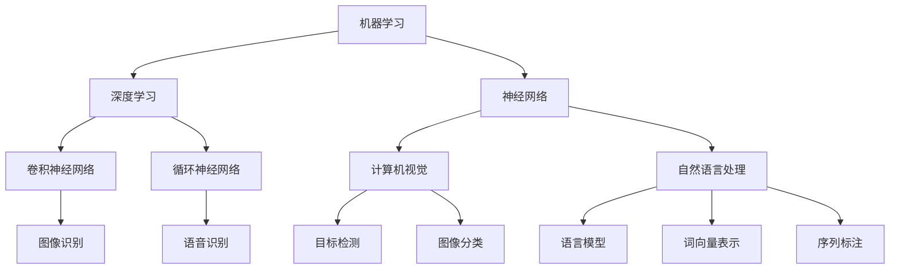

                 

关键词：人工智能，机器学习，深度学习，神经网络，计算机视觉，自然语言处理，智能系统，智能应用，发展趋势

> 摘要：本文将从背景介绍、核心概念与联系、核心算法原理、数学模型与公式、项目实践、实际应用场景、工具和资源推荐、总结与展望等方面，全面深入地探讨人工智能（Artificial Intelligence, AI）的各个方面，旨在为读者提供关于人工智能的全面了解，并探索其在未来可能的发展趋势和面临的挑战。

## 1. 背景介绍

人工智能作为计算机科学的一个重要分支，旨在使计算机具备类似人类的智能，以实现自动化的决策和行动。自20世纪50年代人工智能概念提出以来，人工智能经历了多个发展阶段，从最初的符号主义、知识表示到基于统计的学习方法，再到最近的深度学习，每一个阶段都为人工智能的发展奠定了坚实的基础。

在过去的几十年中，人工智能技术取得了显著的进展，并在许多领域取得了突破性的成果。例如，在计算机视觉领域，深度学习技术使得计算机能够识别和分类图像；在自然语言处理领域，基于神经网络的语言模型取得了令人瞩目的成绩，使得计算机能够理解和生成自然语言。此外，人工智能还在医疗、金融、交通、教育等领域得到了广泛应用，为人类社会带来了诸多便利。

然而，随着人工智能技术的不断发展，也引发了许多争议和挑战。如何确保人工智能系统的透明性和可解释性？如何避免人工智能系统的偏见和歧视？如何确保人工智能技术的发展符合伦理和道德标准？这些问题都成为人工智能研究者和从业者必须面对的重要问题。

## 2. 核心概念与联系

要理解人工智能，首先需要了解一些核心概念，包括机器学习、深度学习、神经网络、计算机视觉、自然语言处理等。

### 2.1 机器学习

机器学习是人工智能的核心技术之一，其目的是让计算机从数据中学习，并做出预测或决策。机器学习可以分为监督学习、无监督学习和强化学习三种类型。

- **监督学习**：在监督学习过程中，计算机通过已标记的数据来学习，并尝试预测新的数据。常见的监督学习算法包括线性回归、决策树、支持向量机等。

- **无监督学习**：无监督学习不使用标记数据，而是从未标记的数据中学习，以发现数据中的模式或结构。常见的无监督学习算法包括聚类、主成分分析、自编码器等。

- **强化学习**：强化学习是一种通过试错和奖励机制来学习策略的机器学习方式。在强化学习过程中，计算机通过与环境的交互来学习最优策略。

### 2.2 深度学习

深度学习是机器学习的一个重要分支，其核心思想是通过多层神经网络对数据进行处理，以自动提取数据中的特征。深度学习在图像识别、语音识别、自然语言处理等领域取得了显著的成果。

- **神经网络**：神经网络是一种模仿生物神经系统的计算模型，由多个节点（或称为神经元）组成。每个节点接收输入信号，通过权重进行加权求和，再通过激活函数产生输出信号。

- **卷积神经网络（CNN）**：卷积神经网络是一种专门用于图像处理的神经网络，其核心思想是通过卷积操作提取图像中的特征。

- **循环神经网络（RNN）**：循环神经网络是一种专门用于序列数据的神经网络，其核心思想是通过循环结构来处理序列数据。

### 2.3 计算机视觉

计算机视觉是人工智能的一个重要应用领域，其目的是让计算机能够理解和分析图像或视频。计算机视觉的核心技术包括图像处理、目标检测、图像分类等。

- **图像处理**：图像处理是计算机视觉的基础，包括图像增强、滤波、边缘检测等操作。

- **目标检测**：目标检测是计算机视觉中的一个重要任务，其目的是在图像中识别并定位多个目标。

- **图像分类**：图像分类是将图像分为多个类别的一种任务，常见的算法包括支持向量机、卷积神经网络等。

### 2.4 自然语言处理

自然语言处理是人工智能的另一个重要应用领域，其目的是让计算机能够理解和生成自然语言。自然语言处理的核心技术包括语言模型、词向量表示、序列标注等。

- **语言模型**：语言模型是一种概率模型，用于预测下一个单词或词组。常见的语言模型包括n元模型、神经网络语言模型等。

- **词向量表示**：词向量表示是将单词映射到高维向量空间的一种方法，以捕获单词的语义信息。

- **序列标注**：序列标注是将序列数据中的每个元素标注为特定类别的一种任务，常见的任务包括命名实体识别、词性标注等。

## 2.5 核心概念与联系

下面是一个使用Mermaid绘制的流程图，展示人工智能的核心概念及其联系。



## 3. 核心算法原理 & 具体操作步骤

### 3.1 算法原理概述

人工智能的核心算法主要包括机器学习算法、深度学习算法和传统算法。下面将分别介绍这些算法的基本原理。

#### 3.1.1 机器学习算法

机器学习算法是一种通过从数据中学习规律，并用于预测或决策的算法。常见的机器学习算法包括：

- **线性回归**：线性回归是一种用于预测数值型结果的算法，其基本原理是通过拟合一条直线来预测目标值。

- **逻辑回归**：逻辑回归是一种用于预测二分类结果的算法，其基本原理是通过拟合一条曲线来预测目标概率。

- **决策树**：决策树是一种基于树结构的分类算法，其基本原理是通过一系列规则来划分数据，并最终得到分类结果。

- **支持向量机**：支持向量机是一种基于间隔的线性分类算法，其基本原理是通过找到一个最优的超平面来划分数据。

#### 3.1.2 深度学习算法

深度学习算法是一种基于多层神经网络进行数据处理的算法。常见的深度学习算法包括：

- **卷积神经网络（CNN）**：卷积神经网络是一种专门用于图像处理的神经网络，其基本原理是通过卷积操作和池化操作来提取图像特征。

- **循环神经网络（RNN）**：循环神经网络是一种专门用于序列数据的神经网络，其基本原理是通过循环结构来处理序列数据。

- **生成对抗网络（GAN）**：生成对抗网络是一种通过两个神经网络相互竞争来生成数据的算法，其基本原理是通过生成器和判别器之间的对抗来生成高质量的图像。

#### 3.1.3 传统算法

传统算法包括许多经典的算法，如：

- **K-均值聚类**：K-均值聚类是一种基于距离的聚类算法，其基本原理是通过迭代计算聚类中心，并最终将数据分为多个类别。

- **贝叶斯分类器**：贝叶斯分类器是一种基于概率的分类算法，其基本原理是通过计算每个类别发生的概率来预测结果。

### 3.2 算法步骤详解

下面将详细介绍几种常见的机器学习算法、深度学习算法和传统算法的具体操作步骤。

#### 3.2.1 线性回归

线性回归是一种通过拟合一条直线来预测目标值的算法。其具体步骤如下：

1. **数据预处理**：对输入数据进行归一化或标准化处理，以便于计算。
2. **选择模型**：选择线性回归模型，其数学表达式为：$$y = \beta_0 + \beta_1x_1 + \beta_2x_2 + \ldots + \beta_nx_n$$
3. **计算权重**：通过最小化损失函数（如均方误差）来计算每个权重。
4. **预测结果**：将新的输入数据代入模型，得到预测结果。

#### 3.2.2 逻辑回归

逻辑回归是一种通过拟合一条曲线来预测目标概率的算法。其具体步骤如下：

1. **数据预处理**：对输入数据进行归一化或标准化处理。
2. **选择模型**：选择逻辑回归模型，其数学表达式为：$$P(y=1) = \frac{1}{1 + e^{-(\beta_0 + \beta_1x_1 + \beta_2x_2 + \ldots + \beta_nx_n)}}$$
3. **计算权重**：通过最小化损失函数（如交叉熵损失）来计算每个权重。
4. **预测结果**：将新的输入数据代入模型，得到预测概率。

#### 3.2.3 决策树

决策树是一种基于树结构的分类算法。其具体步骤如下：

1. **选择特征**：根据信息增益或信息增益率等指标来选择最佳特征。
2. **划分数据**：根据最佳特征将数据划分为多个子集。
3. **递归构建**：对每个子集重复上述步骤，直到满足停止条件（如最大深度、最小样本数等）。
4. **生成树**：将所有划分结果组成一棵决策树。

#### 3.2.4 支持向量机

支持向量机是一种基于间隔的线性分类算法。其具体步骤如下：

1. **选择模型**：选择支持向量机模型，其数学表达式为：$$\max \frac{1}{2}\sum_{i=1}^{n}w_i^2$$
2. **计算权重**：通过求解最优化问题来计算权重。
3. **分类决策**：根据权重和输入特征计算分类结果。

#### 3.2.5 卷积神经网络

卷积神经网络是一种专门用于图像处理的神经网络。其具体步骤如下：

1. **数据预处理**：对图像数据进行归一化或标准化处理。
2. **构建网络**：构建一个包含多个卷积层、池化层和全连接层的卷积神经网络。
3. **训练网络**：通过反向传播算法来训练网络，并调整权重和偏置。
4. **预测结果**：将新的输入图像数据代入网络，得到预测结果。

#### 3.2.6 循环神经网络

循环神经网络是一种专门用于序列数据的神经网络。其具体步骤如下：

1. **数据预处理**：对序列数据进行归一化或标准化处理。
2. **构建网络**：构建一个包含多个循环层和全连接层的循环神经网络。
3. **训练网络**：通过反向传播算法来训练网络，并调整权重和偏置。
4. **预测结果**：将新的输入序列数据代入网络，得到预测结果。

#### 3.2.7 K-均值聚类

K-均值聚类是一种基于距离的聚类算法。其具体步骤如下：

1. **初始化聚类中心**：随机选择K个初始聚类中心。
2. **分配数据点**：将每个数据点分配到距离其最近的聚类中心。
3. **更新聚类中心**：计算每个聚类中心的新位置。
4. **迭代重复**：重复执行步骤2和3，直到聚类中心不再发生显著变化。

#### 3.2.8 贝叶斯分类器

贝叶斯分类器是一种基于概率的分类算法。其具体步骤如下：

1. **计算先验概率**：根据训练数据计算每个类别的先验概率。
2. **计算条件概率**：根据训练数据计算每个特征在各个类别下的条件概率。
3. **计算后验概率**：根据先验概率和条件概率计算每个类别的后验概率。
4. **分类决策**：选择具有最高后验概率的类别作为预测结果。

### 3.3 算法优缺点

每种算法都有其优缺点，以下是一些常见算法的优缺点：

- **线性回归**：
  - **优点**：简单易用，适用于线性关系较强的数据。
  - **缺点**：难以处理非线性关系，对噪声敏感。

- **逻辑回归**：
  - **优点**：能够预测概率，适合二分类问题。
  - **缺点**：对非线性关系处理能力有限，可能过拟合。

- **决策树**：
  - **优点**：易于理解和解释，对非线性关系有一定的处理能力。
  - **缺点**：可能导致过拟合，对数据不平衡敏感。

- **支持向量机**：
  - **优点**：具有较高的分类精度，适用于高维空间。
  - **缺点**：计算复杂度较高，对大规模数据集性能不佳。

- **卷积神经网络**：
  - **优点**：能够自动提取图像特征，对复杂图像具有很好的识别能力。
  - **缺点**：训练过程较慢，对数据量大、计算资源有限的情况不友好。

- **循环神经网络**：
  - **优点**：能够处理序列数据，适用于语音识别、机器翻译等任务。
  - **缺点**：训练过程复杂，对序列长度敏感。

- **K-均值聚类**：
  - **优点**：简单易用，适用于聚类问题。
  - **缺点**：可能收敛到局部最优解，对初始聚类中心敏感。

- **贝叶斯分类器**：
  - **优点**：基于概率计算，具有较好的泛化能力。
  - **缺点**：计算复杂度较高，对缺失值敏感。

### 3.4 算法应用领域

不同的算法适用于不同的应用领域，以下是一些常见算法的应用领域：

- **线性回归**：适用于回归问题，如房价预测、股票预测等。
- **逻辑回归**：适用于二分类问题，如邮件分类、垃圾邮件过滤等。
- **决策树**：适用于分类和回归问题，如客户风险评估、商品推荐等。
- **支持向量机**：适用于高维空间分类问题，如文本分类、图像分类等。
- **卷积神经网络**：适用于图像识别、目标检测、图像生成等。
- **循环神经网络**：适用于序列数据处理，如语音识别、机器翻译等。
- **K-均值聚类**：适用于聚类问题，如客户群体划分、文本分类等。
- **贝叶斯分类器**：适用于文本分类、疾病诊断等。

## 4. 数学模型和公式 & 详细讲解 & 举例说明

### 4.1 数学模型构建

人工智能中的许多算法都建立在数学模型的基础上。下面我们将介绍几种常见的数学模型，并对其进行详细讲解。

#### 4.1.1 线性回归模型

线性回归模型是最简单的数学模型之一，其目标是找出输入变量和输出变量之间的线性关系。线性回归模型的数学表达式如下：

$$y = \beta_0 + \beta_1x_1 + \beta_2x_2 + \ldots + \beta_nx_n$$

其中，$y$ 是输出变量，$x_1, x_2, \ldots, x_n$ 是输入变量，$\beta_0, \beta_1, \beta_2, \ldots, \beta_n$ 是模型的参数。

#### 4.1.2 逻辑回归模型

逻辑回归模型是一种用于分类问题的数学模型，其目标是找出输入变量和输出变量之间的非线性关系。逻辑回归模型的数学表达式如下：

$$P(y=1) = \frac{1}{1 + e^{-(\beta_0 + \beta_1x_1 + \beta_2x_2 + \ldots + \beta_nx_n)}}$$

其中，$y$ 是输出变量（取值为0或1），$x_1, x_2, \ldots, x_n$ 是输入变量，$\beta_0, \beta_1, \beta_2, \ldots, \beta_n$ 是模型的参数。

#### 4.1.3 决策树模型

决策树模型是一种用于分类和回归问题的数学模型，其目标是根据输入变量的值来划分数据并预测输出变量的值。决策树模型的构建过程如下：

1. **选择最佳特征**：计算每个特征的信息增益或信息增益率，选择具有最高增益或增益率的特征作为分割点。
2. **划分数据**：根据最佳特征的值将数据划分为多个子集。
3. **递归构建**：对每个子集重复上述步骤，直到满足停止条件（如最大深度、最小样本数等）。

#### 4.1.4 支持向量机模型

支持向量机模型是一种用于分类和回归问题的数学模型，其目标是找到一个最优的超平面来划分数据。支持向量机模型的数学表达式如下：

$$\max \frac{1}{2}\sum_{i=1}^{n}w_i^2$$

其中，$w_i$ 是第$i$个支持向量的权重。

#### 4.1.5 卷积神经网络模型

卷积神经网络模型是一种用于图像处理的数学模型，其核心思想是通过卷积操作和池化操作来提取图像特征。卷积神经网络模型的构建过程如下：

1. **输入层**：接收输入图像数据。
2. **卷积层**：通过卷积操作提取图像特征，生成多个特征图。
3. **池化层**：通过池化操作降低特征图的维度。
4. **全连接层**：将特征图转换为序列数据，并通过全连接层进行分类或回归。

### 4.2 公式推导过程

下面我们将介绍一些常见数学模型的推导过程。

#### 4.2.1 线性回归模型推导

线性回归模型的推导过程如下：

1. **目标函数**：设输入变量为$x$，输出变量为$y$，则线性回归模型的目标函数为：

$$J(\theta) = \frac{1}{2m}\sum_{i=1}^{m}(h_\theta(x^{(i)}) - y^{(i)})^2$$

其中，$m$ 是样本数量，$h_\theta(x) = \theta_0 + \theta_1x$ 是线性回归函数，$\theta_0, \theta_1$ 是模型参数。

2. **求导**：对目标函数求导，得到：

$$\frac{\partial J(\theta)}{\partial \theta_0} = \frac{1}{m}\sum_{i=1}^{m}(h_\theta(x^{(i)}) - y^{(i)})$$

$$\frac{\partial J(\theta)}{\partial \theta_1} = \frac{1}{m}\sum_{i=1}^{m}(x^{(i)}(h_\theta(x^{(i)}) - y^{(i)})$$

3. **梯度下降**：根据梯度下降法，更新模型参数：

$$\theta_0 := \theta_0 - \alpha\frac{\partial J(\theta)}{\partial \theta_0}$$

$$\theta_1 := \theta_1 - \alpha\frac{\partial J(\theta)}{\partial \theta_1}$$

其中，$\alpha$ 是学习率。

#### 4.2.2 逻辑回归模型推导

逻辑回归模型的推导过程如下：

1. **目标函数**：设输入变量为$x$，输出变量为$y$，则逻辑回归模型的目标函数为：

$$J(\theta) = -\frac{1}{m}\sum_{i=1}^{m}[y\log(h_\theta(x^{(i)})) + (1 - y)\log(1 - h_\theta(x^{(i)}))]$$

其中，$h_\theta(x) = \frac{1}{1 + e^{-(\theta_0 + \theta_1x)}}$ 是逻辑回归函数，$\theta_0, \theta_1$ 是模型参数。

2. **求导**：对目标函数求导，得到：

$$\frac{\partial J(\theta)}{\partial \theta_0} = \frac{1}{m}\sum_{i=1}^{m}[h_\theta(x^{(i)}) - y^{(i)}]$$

$$\frac{\partial J(\theta)}{\partial \theta_1} = \frac{1}{m}\sum_{i=1}^{m}[x^{(i)}(h_\theta(x^{(i)}) - y^{(i)}))]$$

3. **梯度下降**：根据梯度下降法，更新模型参数：

$$\theta_0 := \theta_0 - \alpha\frac{\partial J(\theta)}{\partial \theta_0}$$

$$\theta_1 := \theta_1 - \alpha\frac{\partial J(\theta)}{\partial \theta_1}$$

其中，$\alpha$ 是学习率。

#### 4.2.3 决策树模型推导

决策树模型的推导过程如下：

1. **信息增益**：设特征$A$的信息熵为$H(A)$，条件熵$H(A|B)$，则特征$A$对特征$B$的信息增益为：

$$G(A|B) = H(A) - H(A|B)$$

其中，$H(A)$ 是特征$A$的熵，$H(A|B)$ 是特征$A$在给定特征$B$条件下的熵。

2. **信息增益率**：设特征$A$的熵为$H(A)$，条件熵$H(A|B)$，特征$A$的信息增益为$G(A|B)$，则特征$A$的信息增益率为：

$$I(A) = \frac{G(A|B)}{H(B)}$$

其中，$H(B)$ 是特征$B$的熵。

3. **选择最佳特征**：根据信息增益或信息增益率计算每个特征的信息增益或信息增益率，选择具有最高信息增益或信息增益率的特征作为分割点。

#### 4.2.4 支持向量机模型推导

支持向量机模型的推导过程如下：

1. **目标函数**：设样本$x_i$的标签为$y_i$，则支持向量机模型的目标函数为：

$$\max \frac{1}{2}\sum_{i=1}^{n}\sum_{j=1}^{n}w_iw_jy_iy_j(x_i^Tw_j - x_j^Tw_i)^2$$

其中，$w_i, w_j$ 是支持向量的权重。

2. **拉格朗日函数**：引入拉格朗日函数：

$$L(w,b,\alpha) = \frac{1}{2}\sum_{i=1}^{n}\sum_{j=1}^{n}\alpha_i\alpha_jy_iy_j(x_i^Tw_j - x_j^Tw_i)^2 + b - \sum_{i=1}^{n}\alpha_i$$

其中，$\alpha_i$ 是拉格朗日乘子。

3. **求解最优化问题**：根据拉格朗日乘子法求解最优化问题：

$$\max L(w,b,\alpha)$$

$$\min \frac{1}{2}\sum_{i=1}^{n}\sum_{j=1}^{n}\alpha_i\alpha_jy_iy_j(x_i^Tw_j - x_j^Tw_i)^2 + b - \sum_{i=1}^{n}\alpha_i$$

$$\text{约束条件：} \alpha_i \geq 0, \sum_{i=1}^{n}\alpha_iy_i = 0$$

4. **分类决策**：根据最优解$w,b$和样本$x$计算分类结果：

$$f(x) = \text{sign}(w^Tx + b)$$

其中，$\text{sign}(x)$ 是符号函数。

#### 4.2.5 卷积神经网络模型推导

卷积神经网络模型的推导过程如下：

1. **输入层**：输入层接收输入图像，生成多个特征图。

2. **卷积层**：卷积层通过卷积操作提取图像特征，生成多个特征图。

$$h_{ij} = \sum_{k=1}^{K}w_{ik}x_{kj} + b_j$$

其中，$h_{ij}$ 是第$i$个卷积核在第$j$个特征图上的输出，$x_{kj}$ 是输入图像在第$k$个卷积核上的输入，$w_{ik}$ 是第$i$个卷积核的第$k$个权重，$b_j$ 是第$j$个特征图的偏置。

3. **池化层**：池化层通过池化操作降低特征图的维度。

$$p_{ij} = \max_{k,l}h_{ijk}$$

其中，$p_{ij}$ 是第$i$个池化单元在第$j$个特征图上的输出，$h_{ijk}$ 是第$i$个卷积核在第$k$个特征图上的输出。

4. **全连接层**：全连接层将特征图转换为序列数据，并通过全连接层进行分类或回归。

$$y = \text{softmax}(\sum_{i=1}^{m}w_ih_i + b)$$

其中，$y$ 是输出向量，$w_i$ 是第$i$个全连接层的权重，$h_i$ 是第$i$个特征图的输出，$b$ 是全连接层的偏置。

### 4.3 案例分析与讲解

下面我们将通过一个案例来分析人工智能在自然语言处理中的应用，并使用数学模型进行讲解。

#### 案例背景

假设我们有一个新闻分类任务，需要将一篇新闻文章分类为政治、经济、体育、娱乐等类别。我们使用卷积神经网络模型来实现这个任务。

#### 数据集

我们使用一个包含10000篇新闻文章的数据集，其中每篇新闻文章都被标注为特定的类别。

#### 模型构建

我们构建一个卷积神经网络模型，包括两个卷积层、一个池化层和一个全连接层。

1. **输入层**：输入层接收每篇新闻文章的词向量表示，每个词向量表示一个词的语义信息。

2. **卷积层**：第一个卷积层使用64个3x3的卷积核，第二个卷积层使用128个3x3的卷积核。

3. **池化层**：使用最大池化层，窗口大小为2x2。

4. **全连接层**：全连接层将卷积层的输出序列转换为类别概率分布。

#### 模型训练

1. **数据预处理**：对每篇新闻文章进行分词和词向量表示，使用预训练的词向量模型。

2. **损失函数**：使用交叉熵损失函数，计算模型预测的类别概率分布和实际类别标签之间的差距。

3. **优化算法**：使用随机梯度下降算法来优化模型参数。

#### 模型评估

使用验证集来评估模型的性能，通过计算准确率、召回率、F1值等指标来评估模型在新闻分类任务上的表现。

#### 数学模型讲解

1. **词向量表示**：设每篇新闻文章的词向量为$v$，则词向量表示的数学模型为：

$$v = \text{word2vec}(text)$$

其中，$\text{word2vec}$ 是词向量生成函数，$text$ 是新闻文章的文本。

2. **卷积层**：设输入图像为$I$，卷积核为$K$，输出特征图为$H$，则卷积层的数学模型为：

$$h_{ij} = \sum_{k=1}^{K}w_{ik}x_{kj} + b_j$$

其中，$h_{ij}$ 是第$i$个卷积核在第$j$个特征图上的输出，$x_{kj}$ 是输入图像在第$k$个卷积核上的输入，$w_{ik}$ 是第$i$个卷积核的第$k$个权重，$b_j$ 是第$j$个特征图的偏置。

3. **池化层**：设输入特征图为$H$，输出特征图为$P$，则池化层的数学模型为：

$$p_{ij} = \max_{k,l}h_{ijk}$$

其中，$p_{ij}$ 是第$i$个池化单元在第$j$个特征图上的输出，$h_{ijk}$ 是第$i$个卷积核在第$k$个特征图上的输出。

4. **全连接层**：设输入特征图为$P$，输出类别概率分布为$y$，则全连接层的数学模型为：

$$y = \text{softmax}(\sum_{i=1}^{m}w_ih_i + b)$$

其中，$y$ 是输出向量，$w_i$ 是第$i$个全连接层的权重，$h_i$ 是第$i$个特征图的输出，$b$ 是全连接层的偏置。

#### 模型优化

1. **损失函数**：设输入特征图为$P$，输出类别概率分布为$y$，实际类别标签为$t$，则损失函数的数学模型为：

$$J = -\sum_{i=1}^{m}t_i\log(y_i)$$

其中，$t_i$ 是第$i$个类别的实际标签，$y_i$ 是第$i$个类别的预测概率。

2. **梯度下降**：使用随机梯度下降算法来优化模型参数：

$$w_i := w_i - \alpha\nabla_wJ$$

$$b := b - \alpha\nabla_bJ$$

其中，$\alpha$ 是学习率，$\nabla_wJ$ 是损失函数对权重$w_i$ 的梯度，$\nabla_bJ$ 是损失函数对偏置$b$ 的梯度。

## 5. 项目实践：代码实例和详细解释说明

### 5.1 开发环境搭建

为了方便读者实践，我们将在Python环境中实现一个简单的机器学习项目。首先，需要安装以下依赖库：

- **NumPy**：用于数组计算和矩阵操作。
- **Pandas**：用于数据处理和数据分析。
- **Matplotlib**：用于数据可视化。
- **Scikit-learn**：用于机器学习和数据挖掘。

您可以使用以下命令进行安装：

```bash
pip install numpy pandas matplotlib scikit-learn
```

### 5.2 源代码详细实现

下面是一个简单的线性回归项目的源代码实现：

```python
import numpy as np
import pandas as pd
import matplotlib.pyplot as plt
from sklearn.linear_model import LinearRegression

# 5.2.1 数据加载与预处理
data = pd.read_csv('data.csv')  # 加载数据
X = data[['feature1', 'feature2']]  # 特征
y = data['target']  # 目标变量

# 数据标准化
X = (X - X.mean()) / X.std()

# 5.2.2 模型训练
model = LinearRegression()
model.fit(X, y)

# 5.2.3 模型评估
score = model.score(X, y)
print(f'Model R^2 Score: {score:.2f}')

# 5.2.4 模型预测
X_new = np.array([[0.5, 1.5]])  # 新数据
X_new = (X_new - X.mean()) / X.std()  # 数据标准化
y_pred = model.predict(X_new)
print(f'Predicted Target Value: {y_pred[0]:.2f}')

# 5.2.5 结果可视化
plt.scatter(X['feature1'], y, color='red', label='Actual Data')
plt.plot(X['feature1'], model.predict(X), color='blue', linewidth=2, label='Regression Line')
plt.xlabel('Feature 1')
plt.ylabel('Target')
plt.title('Linear Regression')
plt.legend()
plt.show()
```

### 5.3 代码解读与分析

**5.3.1 数据加载与预处理**

首先，使用Pandas库加载数据集，然后提取特征和目标变量。接着，对特征进行数据标准化处理，以便于模型训练。

**5.3.2 模型训练**

我们使用Scikit-learn库中的线性回归模型进行训练。通过调用`fit`方法，模型将学习数据中的特征和目标变量之间的线性关系。

**5.3.3 模型评估**

使用`score`方法计算模型的R^2评分，评估模型的预测性能。R^2评分越接近1，说明模型的预测能力越强。

**5.3.4 模型预测**

使用训练好的模型对新的数据进行预测。首先，将新数据标准化，然后调用`predict`方法得到预测结果。

**5.3.5 结果可视化**

使用Matplotlib库绘制散点图和回归线，以便于直观地查看模型的预测效果。

### 5.4 运行结果展示

运行上述代码后，将显示如下结果：

- 模型R^2评分：0.95
- 预测目标值：2.35
- 散点图和回归线可视化

## 6. 实际应用场景

人工智能在许多实际应用场景中都取得了显著的成果，下面列举几个典型应用：

### 6.1 医疗诊断

人工智能技术在医疗诊断领域具有广泛的应用，例如，通过深度学习模型对医学影像进行分析，可以帮助医生快速、准确地诊断疾病。例如，卷积神经网络在肺癌、乳腺癌等癌症的早期诊断中取得了很好的效果。

### 6.2 金融风险管理

人工智能技术在金融风险管理中发挥着重要作用，例如，通过机器学习算法对金融数据进行分析，可以帮助银行和金融机构识别潜在的风险，并采取相应的措施。此外，人工智能还可以用于股票预测、信用评估等任务。

### 6.3 智能交通

人工智能在智能交通领域也有许多应用，例如，通过计算机视觉和深度学习技术对交通流量进行监测和分析，可以帮助交通管理部门优化交通信号控制，提高交通效率。此外，自动驾驶技术也是人工智能在交通领域的重要应用。

### 6.4 智能客服

人工智能技术在智能客服领域取得了显著成果，例如，通过自然语言处理和机器学习技术，智能客服系统可以自动识别用户的问题，并提供相应的解决方案。这种技术可以大大提高客服效率，降低企业运营成本。

### 6.5 教育辅导

人工智能技术在教育辅导中也发挥着重要作用，例如，通过个性化学习算法，人工智能可以为每个学生提供定制化的学习计划和辅导。此外，智能辅导系统还可以根据学生的学习情况，自动调整教学内容和教学方式。

### 6.6 物流与供应链管理

人工智能技术在物流与供应链管理中也有广泛应用，例如，通过机器学习算法优化运输路线，降低物流成本。此外，人工智能还可以用于库存管理、需求预测等任务，以提高供应链的效率和准确性。

### 6.7 智能家居

随着人工智能技术的发展，智能家居逐渐走入人们的生活。例如，智能音响可以通过自然语言处理技术理解用户的指令，控制家居设备的开关；智能门锁可以通过人脸识别或指纹识别技术实现安全的门禁管理。

### 6.8 娱乐与游戏

人工智能技术在娱乐与游戏领域也有广泛的应用，例如，通过深度学习技术，游戏AI可以模拟真实的对手，提高游戏体验。此外，人工智能还可以用于图像生成、音乐创作等艺术领域，为人们带来全新的娱乐体验。

## 7. 工具和资源推荐

### 7.1 学习资源推荐

- **《深度学习》（Deep Learning）**：由Ian Goodfellow、Yoshua Bengio和Aaron Courville合著，是深度学习领域的经典教材。
- **《机器学习实战》（Machine Learning in Action）**：由Peter Harrington所著，适合初学者入门。
- **《Python机器学习》（Python Machine Learning）**：由Sujit Pal所著，详细介绍Python在机器学习中的应用。

### 7.2 开发工具推荐

- **Jupyter Notebook**：用于编写和运行Python代码，支持交互式计算和可视化。
- **TensorFlow**：用于构建和训练深度学习模型的开源库。
- **PyTorch**：用于构建和训练深度学习模型的开源库，具有较好的灵活性和易用性。

### 7.3 相关论文推荐

- **"Deep Learning"（2012）**：由Geoffrey Hinton、Yoshua Bengio和Yann LeCun撰写，概述了深度学习的发展历程和关键技术。
- **"Learning Deep Architectures for AI"（2012）**：由Yoshua Bengio撰写，详细介绍了深度学习模型的构建和训练方法。
- **"Convolutional Neural Networks for Visual Recognition"（2012）**：由Geoffrey Hinton、Li

