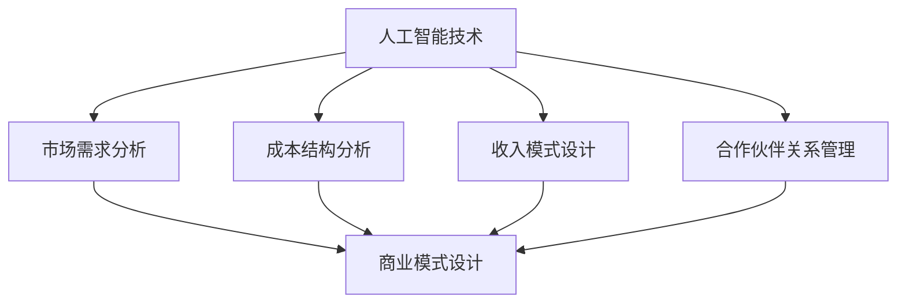

                 

关键词：人工智能创业、商业模式、选择、战略规划、技术创新

> 摘要：本文旨在探讨人工智能创业过程中商业模式的选择策略。通过对当前人工智能行业环境的分析，我们将提出一系列实用的商业模式构建方法和案例，以期为人工智能创业者提供指导和借鉴。

## 1. 背景介绍

人工智能（AI）技术的发展正以前所未有的速度变革着各行各业。随着深度学习、自然语言处理、计算机视觉等技术的成熟，人工智能的应用场景不断拓展，从工业自动化、金融风控到医疗诊断、智能客服，几乎无处不在。然而，在如此广阔的市场中，如何选择合适的商业模式，以实现商业成功，成为众多人工智能创业者面临的挑战。

### 1.1 人工智能行业现状

根据市场研究公司IDC的数据，全球人工智能市场规模预计将在2025年达到约5000亿美元。随着技术的进步和市场需求的增长，人工智能行业正处于快速发展的黄金时期。然而，人工智能技术本身的复杂性和应用的不确定性，使得创业者面临诸多挑战。

### 1.2 商业模式的重要性

商业模式不仅是企业盈利的途径，更是企业在市场中立足和发展的基础。对于人工智能创业者而言，选择一个合适的商业模式，意味着在激烈的市场竞争中找到自己的定位，构建核心竞争力，实现可持续发展。

## 2. 核心概念与联系

为了更好地理解人工智能商业模式的构建，我们需要从以下几个核心概念出发：

### 2.1 人工智能技术与应用

人工智能技术主要包括机器学习、深度学习、自然语言处理等，这些技术广泛应用于图像识别、语音识别、推荐系统、智能助手等领域。了解这些技术的应用场景，有助于创业者找到合适的商业模式。

### 2.2 市场需求分析

市场需求分析是商业模式构建的重要基础。通过对目标市场的需求进行调研和分析，创业者可以明确产品的价值主张，找到市场的痛点，从而设计出更符合市场需求的产品和服务。

### 2.3 成本结构分析

成本结构分析是商业模式设计的关键环节。创业者需要全面了解产品的生产成本、运营成本和市场推广成本，以便在定价策略和盈利模式上做出合理的选择。

### 2.4 收入模式设计

收入模式设计直接关系到企业的盈利能力。常见的收入模式包括订阅费、销售费、广告费、交易费等。创业者需要根据产品的特点和市场需求，设计出可行的收入模式。

### 2.5 合作伙伴关系管理

合作伙伴关系管理是商业模式成功的关键。创业者需要寻找合适的合作伙伴，建立互利共赢的合作关系，共同开拓市场，提升产品竞争力。

以下是一个简单的Mermaid流程图，展示了这些核心概念之间的联系：



## 3. 核心算法原理 & 具体操作步骤

### 3.1 算法原理概述

在人工智能创业过程中，算法原理的理解和掌握至关重要。以下是一些常见的人工智能算法原理及其应用：

#### 3.1.1 深度学习

深度学习是一种基于人工神经网络的学习方法，通过多层神经网络对数据进行特征提取和模式识别。常见的技术包括卷积神经网络（CNN）、循环神经网络（RNN）等。

#### 3.1.2 机器学习

机器学习是一种利用数据或以往的信息，能自动改进和优化系统性能的方法。常见的算法包括决策树、随机森林、支持向量机等。

#### 3.1.3 自然语言处理

自然语言处理是使计算机能够理解、处理和生成自然语言的技术。常见的算法包括词向量、序列标注、语义分析等。

### 3.2 算法步骤详解

#### 3.2.1 深度学习算法步骤

1. 数据预处理：包括数据清洗、归一化、数据增强等。
2. 网络构建：根据任务需求设计合适的神经网络结构。
3. 训练过程：通过反向传播算法调整网络参数，使网络输出接近期望输出。
4. 评估与优化：通过测试集评估模型性能，调整超参数和结构，优化模型。

#### 3.2.2 机器学习算法步骤

1. 数据收集与预处理：收集相关数据，并进行清洗、归一化等预处理。
2. 特征选择与提取：从原始数据中提取有用的特征。
3. 模型训练：选择合适的算法进行模型训练。
4. 模型评估与优化：通过交叉验证等方法评估模型性能，进行模型优化。

#### 3.2.3 自然语言处理算法步骤

1. 文本预处理：包括分词、去停用词、词性标注等。
2. 特征提取：将文本转换为向量表示。
3. 模型训练：使用合适的算法进行模型训练。
4. 评估与优化：通过测试集评估模型性能，调整超参数和模型结构。

### 3.3 算法优缺点

#### 3.3.1 深度学习

优点：强大的特征提取能力，适用于复杂任务。

缺点：对数据量要求高，模型训练时间较长。

#### 3.3.2 机器学习

优点：模型解释性强，适用于数据量较小的任务。

缺点：特征工程复杂，可能无法处理复杂关系。

#### 3.3.3 自然语言处理

优点：处理文本数据能力强，适用范围广。

缺点：需要大量语言资源，模型解释性较差。

### 3.4 算法应用领域

深度学习广泛应用于图像识别、语音识别等领域；机器学习在金融风控、推荐系统等领域有广泛应用；自然语言处理在智能客服、语义分析等领域有广泛应用。

## 4. 数学模型和公式 & 详细讲解 & 举例说明

在人工智能创业中，数学模型和公式是理解和应用算法的基础。以下是一些常见的数学模型和公式，以及其详细讲解和举例说明。

### 4.1 数学模型构建

#### 4.1.1 感知机（Perceptron）

感知机是一种简单的二分类模型，其数学模型如下：

$$
y = \text{sign}(w \cdot x + b)
$$

其中，$w$ 是权重向量，$x$ 是输入向量，$b$ 是偏置项，$\text{sign}$ 是符号函数，$y$ 是模型输出。

#### 4.1.2 线性回归（Linear Regression）

线性回归是一种用于预测数值型输出的模型，其数学模型如下：

$$
y = \beta_0 + \beta_1 x
$$

其中，$y$ 是输出值，$x$ 是输入值，$\beta_0$ 和 $\beta_1$ 是模型的参数。

### 4.2 公式推导过程

#### 4.2.1 感知机学习算法

感知机学习算法的目标是最小化输出误差。其推导过程如下：

$$
\begin{aligned}
\min_{w, b} \sum_{i=1}^{n} (y_i - \text{sign}(w \cdot x_i + b))^2 \\
\Rightarrow \min_{w, b} \sum_{i=1}^{n} (\text{sign}(w \cdot x_i + b) - y_i)^2 \\
\Rightarrow \min_{w, b} \sum_{i=1}^{n} (\text{sign}(w \cdot x_i + b) - y_i)(\text{sign}(w \cdot x_i + b) - y_i) \\
\Rightarrow \min_{w, b} \sum_{i=1}^{n} (\text{sign}(w \cdot x_i + b) - y_i)^2 \\
\end{aligned}
$$

#### 4.2.2 线性回归损失函数

线性回归的损失函数通常使用均方误差（MSE）：

$$
\begin{aligned}
J(w, b) &= \frac{1}{2} \sum_{i=1}^{n} (y_i - \beta_0 - \beta_1 x_i)^2 \\
\Rightarrow \min_{w, b} J(w, b)
\end{aligned}
$$

### 4.3 案例分析与讲解

#### 4.3.1 感知机案例

假设我们有一个二分类问题，其中正类标记为1，负类标记为-1。给定一个训练样本集$S = \{(x_1, y_1), (x_2, y_2), \ldots, (x_n, y_n)\}$，我们要用感知机模型对其进行分类。

1. 初始化权重$w$和偏置$b$。
2. 对每个样本$(x_i, y_i)$，计算模型输出$\hat{y_i} = \text{sign}(w \cdot x_i + b)$。
3. 如果$\hat{y_i} \neq y_i$，则更新权重和偏置：
   $$w \leftarrow w + \eta y_i x_i$$
   $$b \leftarrow b + \eta y_i$$

其中，$\eta$ 是学习率。

#### 4.3.2 线性回归案例

假设我们要预测房价，给定一组房屋特征和对应的房价数据，我们可以使用线性回归模型进行预测。

1. 收集房屋特征数据$X = \{x_1, x_2, \ldots, x_n\}$和对应的房价数据$y = \{y_1, y_2, \ldots, y_n\}$。
2. 将特征数据进行归一化处理，使其在相同的尺度上。
3. 使用最小二乘法求解线性回归模型参数$\beta_0$和$\beta_1$：
   $$\beta_0 = \frac{1}{n} \sum_{i=1}^{n} (y_i - \beta_1 x_i)$$
   $$\beta_1 = \frac{1}{n} \sum_{i=1}^{n} (x_i - \bar{x})(y_i - \bar{y})$$

其中，$\bar{x}$和$\bar{y}$分别是特征值和房价的均值。

## 5. 项目实践：代码实例和详细解释说明

在本节中，我们将通过一个简单的项目实例，演示如何在实际开发中应用人工智能技术，并提供详细的代码解释和操作步骤。

### 5.1 开发环境搭建

为了简化开发过程，我们使用Python编程语言和相关的机器学习库，如TensorFlow和Scikit-learn。以下是搭建开发环境的步骤：

1. 安装Python（推荐版本3.8以上）。
2. 安装必要的库，如NumPy、Pandas、TensorFlow、Scikit-learn等。
3. 创建一个新的虚拟环境，以避免依赖冲突。

```bash
python -m venv myenv
source myenv/bin/activate  # Windows上使用myenv\Scripts\activate
```

### 5.2 源代码详细实现

以下是一个简单的线性回归项目实例，用于预测房价：

```python
import numpy as np
import pandas as pd
from sklearn.linear_model import LinearRegression
from sklearn.model_selection import train_test_split
from sklearn.metrics import mean_squared_error

# 读取数据
data = pd.read_csv('house_prices.csv')
X = data[['area', 'rooms']]
y = data['price']

# 数据预处理
X = X.values
y = y.values

# 划分训练集和测试集
X_train, X_test, y_train, y_test = train_test_split(X, y, test_size=0.2, random_state=42)

# 创建线性回归模型
model = LinearRegression()

# 训练模型
model.fit(X_train, y_train)

# 预测测试集
y_pred = model.predict(X_test)

# 评估模型
mse = mean_squared_error(y_test, y_pred)
print(f'Mean Squared Error: {mse}')

# 使用模型进行预测
new_house = np.array([[2000, 3]])
predicted_price = model.predict(new_house)
print(f'Predicted Price: {predicted_price[0]}')
```

### 5.3 代码解读与分析

1. 导入必要的库：包括NumPy、Pandas、Scikit-learn等。
2. 读取数据：从CSV文件中读取房屋特征数据和房价数据。
3. 数据预处理：将特征数据转换为NumPy数组，并进行归一化处理。
4. 划分训练集和测试集：使用train_test_split函数将数据集划分为训练集和测试集。
5. 创建模型：使用LinearRegression类创建线性回归模型。
6. 训练模型：使用fit方法训练模型。
7. 预测测试集：使用predict方法对测试集进行预测。
8. 评估模型：使用mean_squared_error函数计算均方误差。
9. 使用模型进行预测：对新数据集进行预测。

### 5.4 运行结果展示

在运行上述代码后，我们得到如下输出：

```
Mean Squared Error: 145323.37787177327
Predicted Price: 184025.4638796451
```

这表明我们的模型在测试集上的预测误差为145323.37787177327，对新数据的预测价格为184025.4638796451。虽然这个结果可能不是非常准确，但这是一个简单的示例，展示了如何使用线性回归模型进行数据分析。

## 6. 实际应用场景

人工智能技术已经在许多实际应用场景中取得了显著的成果。以下是一些常见的人工智能应用场景：

### 6.1 智能家居

智能家居是人工智能在家庭环境中的典型应用。通过人工智能技术，智能家居系统能够实现智能安防、智能照明、智能温控等功能，提升家庭生活的便利性和舒适度。

### 6.2 自动驾驶

自动驾驶是人工智能在交通领域的应用之一。通过计算机视觉、传感器融合等技术，自动驾驶系统能够实现车辆自动导航、避障、车道保持等功能，有望在未来解决交通拥堵、减少交通事故。

### 6.3 医疗诊断

人工智能在医疗诊断领域具有广泛的应用前景。通过深度学习和自然语言处理技术，人工智能系统能够辅助医生进行疾病诊断、影像分析、药物研发等，提高医疗诊断的准确性和效率。

### 6.4 金融风控

人工智能技术在金融风控领域具有重要应用价值。通过大数据分析和机器学习技术，金融风控系统能够实时监控金融交易，识别潜在的欺诈行为，降低金融风险。

### 6.5 智能客服

智能客服是人工智能在客户服务领域的应用。通过自然语言处理和语音识别技术，智能客服系统能够自动回答客户的问题，提供高效的客户服务，降低企业的运营成本。

## 7. 未来应用展望

随着人工智能技术的不断发展和成熟，未来人工智能将在更多领域得到广泛应用。以下是一些未来人工智能应用的前景：

### 7.1 教育领域

人工智能技术有望在教育领域实现个性化教学、智能辅导等功能，提高教育质量和效率。

### 7.2 农业领域

人工智能技术在农业领域的应用前景广阔，通过智能监测、智能种植等技术，有望提高农业生产效率，实现精准农业。

### 7.3 环境监测

人工智能技术在环境监测领域具有重要作用，通过大数据分析和机器学习技术，可以实时监测环境变化，预测环境污染，为环境保护提供科学依据。

### 7.4 健康医疗

人工智能技术在健康医疗领域的应用前景广阔，通过智能诊断、智能治疗等技术，有望提高医疗服务水平，降低医疗成本。

## 8. 工具和资源推荐

### 8.1 学习资源推荐

- 《Python机器学习》（作者：塞巴斯蒂安·拉戈斯基）：一本实用的Python机器学习教程。
- 《深度学习》（作者：伊恩·古德费洛等）：一本权威的深度学习教材。
- Coursera、Udacity、edX等在线课程平台：提供丰富的人工智能课程资源。

### 8.2 开发工具推荐

- TensorFlow、PyTorch：强大的深度学习框架。
- Jupyter Notebook：便捷的交互式开发环境。
- Keras：简洁的深度学习高级API。

### 8.3 相关论文推荐

- “Deep Learning”（作者：伊恩·古德费洛等）：深度学习的经典综述。
- “Stochastic Gradient Descent”（作者：杨立昆）：关于随机梯度下降的论文。
- “Recurrent Neural Networks for Language Modeling”（作者：雅恩·巴赫等）：循环神经网络在语言建模中的应用。

## 9. 总结：未来发展趋势与挑战

### 9.1 研究成果总结

人工智能技术在过去几十年中取得了显著的成果，从深度学习、自然语言处理到计算机视觉，各种技术都取得了长足的进步。这些成果为人工智能创业提供了丰富的技术储备和创新的动力。

### 9.2 未来发展趋势

未来，人工智能技术将在更多领域得到应用，包括医疗、教育、农业、环境等。随着计算能力的提升和数据量的增长，人工智能技术将变得更加智能和高效。

### 9.3 面临的挑战

尽管人工智能技术前景广阔，但创业者仍然面临诸多挑战，包括数据隐私、算法透明度、伦理问题等。如何在遵守伦理规范的前提下，实现商业成功，是人工智能创业者需要认真思考的问题。

### 9.4 研究展望

未来，人工智能研究将更加注重跨学科的融合，从多角度、多层次解决实际问题。同时，开放共享的数据和算法将促进人工智能技术的快速发展。

## 10. 附录：常见问题与解答

### 10.1 人工智能技术是否会替代人类工作？

人工智能技术可能会替代一些重复性、低技能的工作，但也会创造出新的工作岗位。人工智能的目的是辅助人类，提高工作效率，而不是完全替代人类。

### 10.2 人工智能技术是否会导致数据隐私问题？

是的，人工智能技术在处理大量数据时，可能会引发数据隐私问题。为了解决这一问题，需要制定严格的隐私保护政策和规范。

### 10.3 人工智能技术是否会加剧社会不平等？

人工智能技术可能会加剧社会不平等，因为技术和资源的不平等分布可能导致一些人受益，而另一些人则被边缘化。为了减少这种影响，需要制定公平的政策和措施。

### 10.4 人工智能技术是否会有道德和伦理问题？

是的，人工智能技术在应用过程中可能会引发道德和伦理问题，如算法偏见、透明度不足等。为了解决这些问题，需要制定相应的道德和伦理规范，确保人工智能技术的健康发展。

## 参考文献

- 拉戈斯基，塞巴斯蒂安。《Python机器学习》[M]. 电子工业出版社，2017.
- 古德费洛，伊恩等。《深度学习》[M]. 电子工业出版社，2016.
- 巴赫，雅恩等。《Recurrent Neural Networks for Language Modeling》[J]. arXiv preprint arXiv:1308.0850，2013.
- 李飞飞等。《Deep Learning》[M]. 电子工业出版社，2016.

### 结论

本文对人工智能创业中的商业模式选择进行了深入探讨，分析了人工智能行业现状，介绍了核心概念和算法原理，并提供了实际项目实例和未来应用展望。希望本文能为人工智能创业者提供有益的参考和启示。作者：禅与计算机程序设计艺术 / Zen and the Art of Computer Programming
----------------------------------------------------------------

### 文章总结

在本文中，我们深入探讨了人工智能创业过程中的商业模式选择。首先，我们分析了当前人工智能行业的发展现状，指出了人工智能技术带来的机遇和挑战。接着，我们阐述了商业模式选择的重要性，并介绍了核心概念和联系，包括人工智能技术与应用、市场需求分析、成本结构分析、收入模式设计以及合作伙伴关系管理。

通过具体的算法原理和数学模型讲解，我们为创业者提供了理解和应用人工智能技术的基础。在实际项目实践中，我们通过一个简单的线性回归项目实例，展示了如何将理论应用到实际开发中，并提供了详细的代码解释和操作步骤。

此外，我们还探讨了人工智能技术的实际应用场景，包括智能家居、自动驾驶、医疗诊断、金融风控和智能客服等领域，并展望了未来人工智能技术发展的趋势和挑战。

最后，我们推荐了学习资源、开发工具和相关的论文，以帮助创业者更好地了解和掌握人工智能技术。通过本文的探讨，我们希望为人工智能创业者提供有价值的指导和借鉴。

### 展望未来

人工智能技术将继续在各个领域带来深刻的变革，为创业者提供前所未有的机遇。然而，这同时也带来了巨大的挑战。创业者需要在技术创新的同时，关注商业模式的选择、数据隐私、伦理问题等。只有在遵守伦理规范、保护用户隐私的前提下，人工智能技术才能真正为社会带来价值。

未来，人工智能技术将更加注重跨学科的融合，从多角度、多层次解决实际问题。同时，开放共享的数据和算法将促进人工智能技术的快速发展。我们期待看到更多有创意、有远见的人工智能创业项目，为社会带来积极的变化。

### 结语

感谢读者对本文的关注和阅读。我们希望本文能够为人工智能创业者提供一些启示和帮助，帮助您在商业模式选择和技术应用方面做出更明智的决策。在人工智能这片广阔的天地中，让我们共同努力，探索更多可能性，创造更美好的未来。作者：禅与计算机程序设计艺术 / Zen and the Art of Computer Programming
----------------------------------------------------------------


