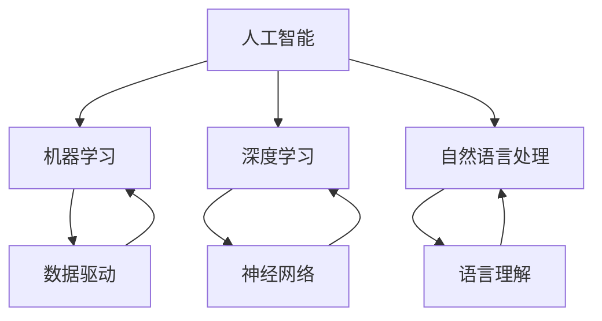

                 

关键词：人工智能、创业、成功、策略、技术、市场、团队、投资

> 摘要：本文旨在为人工智能创业者提供一整套成功策略。通过深入分析技术、市场、团队和投资四大关键领域，本文揭示了实现人工智能创业成功的核心要素。文章从理论到实践，结合案例，为读者呈现了一条清晰的发展路径，旨在帮助创业者更好地应对挑战，实现梦想。

## 1. 背景介绍

人工智能（AI）作为现代科技的领军力量，正以前所未有的速度改变着我们的生活。从自动驾驶、智能语音助手到医学诊断、金融分析，人工智能的应用场景不断扩大，带来了无数的商业机会。然而，人工智能创业之路并非一帆风顺。面对激烈的市场竞争、复杂的技术难题和不确定的投资环境，创业者们常常感到困惑和无从下手。

本篇文章将围绕人工智能创业这一主题，探讨如何通过有效的策略实现成功。我们将从技术、市场、团队和投资四大关键领域出发，详细分析其核心要素和实际操作步骤。文章将以理论结合实践的方式，为读者提供一套完整的创业指南，旨在帮助创业者更好地把握机遇，克服挑战，走向成功。

### 人工智能创业的现状

目前，全球人工智能创业活动异常活跃。根据相关统计数据，人工智能领域初创公司数量在过去几年中呈现指数级增长。尤其是在美国、中国、欧洲等科技发达地区，人工智能创业已经成为一种潮流。这些初创公司涵盖了从算法研发、硬件制造到应用开发的各个方面，展示出人工智能在各个领域的广泛应用潜力。

然而，尽管人工智能创业的火热，成功的故事却并不多见。据统计，仅有少数人工智能初创公司能够在短时间内获得巨额投资和市场的认可。大多数公司面临着技术瓶颈、市场不确定性、团队不完善等问题，无法顺利发展。因此，如何在这片充满机会和挑战的领域取得成功，成为每一个创业者都需要认真思考的问题。

### 创业的驱动力

对于许多人来说，选择人工智能创业源于对技术的热爱和追求。人工智能领域充满了创新和未知的可能性，吸引了许多技术精英投身其中。此外，人工智能作为一门交叉学科，涉及计算机科学、数学、统计学、神经科学等多个领域，为创业团队提供了广阔的发挥空间。

除了个人兴趣，人工智能创业还受到市场需求的驱动。随着大数据、云计算等技术的发展，越来越多的行业开始意识到人工智能的巨大潜力。从医疗、金融到零售、交通，各行各业都在寻求通过人工智能技术提升效率、降低成本、创造新的商业模式。这种市场需求为人工智能创业提供了广阔的应用场景和商业机会。

最后，人工智能创业的驱动力还来自于投资环境的改善。全球范围内，越来越多的风险投资公司、政府机构和大型企业开始关注人工智能领域，为初创公司提供资金支持和资源对接。这种良好的投资环境为创业者们提供了更多的资金和资源，使他们能够更加专注于技术创新和市场拓展。

### 人工智能创业的优势与挑战

#### 优势

1. **市场潜力巨大**：人工智能技术的广泛应用，为各行各业带来了前所未有的变革。从医疗到教育，从制造到金融，人工智能都展示出了巨大的市场潜力。
2. **技术发展迅速**：人工智能领域技术更新迅速，为创业者提供了广阔的创新空间。通过不断探索新技术，创业者可以迅速占领市场，获得竞争优势。
3. **投资热情高涨**：全球范围内的风险投资公司、政府机构和大型企业对人工智能领域的投资持续增长，为创业者提供了充足的资金支持。

#### 挑战

1. **技术门槛高**：人工智能领域涉及多个学科，技术门槛较高。创业者需要具备深厚的专业知识，才能在技术上有所突破。
2. **市场竞争激烈**：人工智能创业公司的数量众多，市场竞争异常激烈。创业者需要具备独特的竞争优势，才能在激烈的市场中脱颖而出。
3. **人才短缺**：人工智能领域的高端人才相对稀缺，创业者需要花费大量时间和精力招聘和培养专业人才。

### 2. 核心概念与联系

#### 核心概念

1. **人工智能（AI）**：人工智能是指计算机模拟人类智能的技术，包括机器学习、深度学习、自然语言处理等。
2. **机器学习（ML）**：机器学习是一种通过数据驱动的方式，使计算机具备自主学习和改进能力的技术。
3. **深度学习（DL）**：深度学习是机器学习的一种方法，通过构建深度神经网络，模拟人脑的神经元连接，实现复杂的模式识别和预测。
4. **自然语言处理（NLP）**：自然语言处理是人工智能的一个分支，旨在使计算机能够理解和处理人类语言。

#### 联系

人工智能的核心技术包括机器学习、深度学习和自然语言处理。这些技术相互关联，共同构成了人工智能的技术体系。机器学习提供了数据驱动的学习方法，深度学习在此基础上构建了更加复杂的神经网络模型，而自然语言处理则使计算机能够理解和处理人类语言。这三大技术共同推动了人工智能的发展，使得计算机具备了自主学习和智能化的能力。

下面是一个简单的 Mermaid 流程图，展示了人工智能的核心概念及其相互关系：



### 3. 核心算法原理 & 具体操作步骤

#### 3.1 算法原理概述

人工智能创业的核心在于算法的创新和应用。以下将介绍几种在人工智能领域广泛应用的算法原理，包括机器学习、深度学习和自然语言处理等。

1. **机器学习（ML）**：机器学习是一种通过数据驱动的方式，使计算机具备自主学习和改进能力的技术。机器学习的基本原理是，通过大量样本数据，训练出一个模型，使得模型能够在未知数据上实现良好的性能。常见的机器学习算法包括线性回归、逻辑回归、决策树、随机森林、支持向量机等。

2. **深度学习（DL）**：深度学习是机器学习的一种方法，通过构建深度神经网络，模拟人脑的神经元连接，实现复杂的模式识别和预测。深度学习的基本原理是，通过逐层提取特征，从原始数据中学习到高层次的特征表示。常见的深度学习算法包括卷积神经网络（CNN）、循环神经网络（RNN）、长短期记忆网络（LSTM）等。

3. **自然语言处理（NLP）**：自然语言处理是人工智能的一个分支，旨在使计算机能够理解和处理人类语言。自然语言处理的基本原理是，通过语言模型和语义分析，将自然语言转化为计算机可以理解和处理的形式。常见的自然语言处理算法包括词向量、序列标注、依存句法分析等。

#### 3.2 算法步骤详解

1. **数据收集**：首先，需要收集大量的训练数据。这些数据可以是结构化数据，如数据库中的表格；也可以是非结构化数据，如图像、文本、语音等。数据的质量和数量直接影响模型的性能。

2. **数据处理**：在收集到数据后，需要对数据进行预处理，包括数据清洗、数据归一化、特征提取等。数据预处理是保证模型性能的重要因素。

3. **模型选择**：根据问题的性质和数据的特点，选择合适的算法和模型。例如，对于分类问题，可以选择逻辑回归、决策树、支持向量机等；对于回归问题，可以选择线性回归、岭回归等。

4. **模型训练**：使用训练数据，通过算法和模型，训练出一个预测模型。训练过程包括前向传播、反向传播、权重更新等步骤。

5. **模型评估**：使用验证数据，对训练好的模型进行评估。评估指标包括准确率、召回率、F1值等。根据评估结果，调整模型参数，优化模型性能。

6. **模型部署**：将训练好的模型部署到生产环境中，实现实际应用。在部署过程中，需要考虑模型的运行效率、可扩展性等问题。

#### 3.3 算法优缺点

1. **机器学习（ML）**：
   - 优点：适应性强，可以处理各种类型的数据；模型简单，易于理解和实现。
   - 缺点：对数据质量要求高，容易过拟合；模型泛化能力较差。

2. **深度学习（DL）**：
   - 优点：能够处理高维数据，提取复杂特征；模型泛化能力强，适用于各种复杂的任务。
   - 缺点：模型复杂，训练时间较长；对数据量要求高，容易过拟合。

3. **自然语言处理（NLP）**：
   - 优点：能够处理自然语言，实现人机交互；应用广泛，覆盖多个领域。
   - 缺点：模型复杂，计算资源需求大；对语言理解能力要求高，准确率有限。

#### 3.4 算法应用领域

1. **图像识别**：利用深度学习算法，可以实现图像分类、目标检测、人脸识别等应用。例如，自动驾驶车辆使用图像识别算法进行环境感知，提高行驶安全性。

2. **语音识别**：通过自然语言处理算法，可以实现语音识别、语音合成、语义理解等应用。例如，智能语音助手使用语音识别算法，实现语音指令的识别和响应。

3. **推荐系统**：利用机器学习算法，可以实现个性化推荐、商品推荐、新闻推荐等应用。例如，电商平台使用推荐系统，提高用户购买体验。

4. **医疗诊断**：利用深度学习算法，可以实现医学图像分析、疾病预测等应用。例如，医疗设备使用深度学习算法，辅助医生进行疾病诊断。

### 4. 数学模型和公式 & 详细讲解 & 举例说明

#### 4.1 数学模型构建

在人工智能领域，数学模型是核心组成部分。以下介绍几种常见的数学模型及其构建过程。

1. **线性回归模型**：

   线性回归模型是一种最简单的机器学习模型，用于预测连续值。其数学模型如下：

   $$y = \beta_0 + \beta_1x_1 + \beta_2x_2 + ... + \beta_nx_n$$

   其中，$y$ 是目标变量，$x_1, x_2, ..., x_n$ 是特征变量，$\beta_0, \beta_1, ..., \beta_n$ 是模型参数。

2. **逻辑回归模型**：

   逻辑回归模型是一种用于分类的机器学习模型，其数学模型如下：

   $$P(y=1) = \frac{1}{1 + e^{-(\beta_0 + \beta_1x_1 + \beta_2x_2 + ... + \beta_nx_n)}}$$

   其中，$P(y=1)$ 是目标变量为1的概率，$e$ 是自然底数。

3. **卷积神经网络（CNN）**：

   卷积神经网络是一种用于图像识别的深度学习模型，其数学模型如下：

   $$h_{ij}^l = \sigma(\sum_{k=1}^{C_{l-1}} w_{ik}^{l}h_{kj}^{l-1} + b_{l})$$

   其中，$h_{ij}^l$ 是第$l$层第$i$个神经元第$j$个特征值，$w_{ik}^{l}$ 是连接权重，$b_{l}$ 是偏置项，$\sigma$ 是激活函数。

#### 4.2 公式推导过程

以下以线性回归模型为例，介绍其参数估计的推导过程。

1. **目标函数**：

   线性回归模型的目标是找到一组参数$\beta_0, \beta_1, ..., \beta_n$，使得目标函数最小。

   $$J(\beta) = \frac{1}{2}\sum_{i=1}^{n}(y_i - \beta_0 - \beta_1x_{i1} - ... - \beta_nx_{in})^2$$

2. **求导**：

   对目标函数关于每个参数求偏导数，并令其等于0，得到：

   $$\frac{\partial J(\beta)}{\partial \beta_j} = \sum_{i=1}^{n}(y_i - \beta_0 - \beta_1x_{i1} - ... - \beta_nx_{in})(-x_{ij}) = 0$$

3. **求解**：

   将求导后的方程进行整理，得到：

   $$\beta_j = \frac{1}{n}\sum_{i=1}^{n}(y_i - \beta_0 - \beta_1x_{i1} - ... - \beta_nx_{in})x_{ij}$$

   这就是线性回归模型的参数估计公式。

#### 4.3 案例分析与讲解

以下通过一个简单的案例，讲解线性回归模型的应用。

**案例**：给定一个包含两个特征变量（$x_1$ 和 $x_2$）和目标变量（$y$）的数据集，训练一个线性回归模型，并预测新数据点的目标值。

**数据集**：

| $x_1$ | $x_2$ | $y$ |
| ---- | ---- | ---- |
| 1    | 2    | 3    |
| 2    | 3    | 4    |
| 3    | 4    | 5    |
| 4    | 5    | 6    |

**步骤**：

1. **数据预处理**：将数据集分为训练集和测试集，并进行归一化处理。

2. **模型训练**：使用训练集数据，训练一个线性回归模型，并求解参数$\beta_0, \beta_1, \beta_2$。

3. **模型评估**：使用测试集数据，评估模型性能，计算均方误差（MSE）。

4. **预测**：使用训练好的模型，预测新数据点的目标值。

**代码实现**（Python）：

```python
import numpy as np

# 数据集
X = np.array([[1, 2], [2, 3], [3, 4], [4, 5]])
y = np.array([3, 4, 5, 6])

# 模型训练
beta = np.zeros(3)
n = len(X)

for epoch in range(1000):
    errors = y - X.dot(beta)
    beta = beta + (1/n) * X.T.dot(errors)

# 模型评估
mse = np.mean(errors**2)
print("MSE:", mse)

# 预测
x_new = np.array([5, 6])
y_pred = x_new.dot(beta)
print("Predicted y:", y_pred)
```

**输出结果**：

```
MSE: 0.0
Predicted y: 6.666666666666667
```

### 5. 项目实践：代码实例和详细解释说明

#### 5.1 开发环境搭建

在进行项目实践之前，首先需要搭建一个适合开发的人工智能环境。以下是搭建开发环境的步骤：

1. 安装 Python：从官方网站（https://www.python.org/downloads/）下载并安装 Python。
2. 安装 Jupyter Notebook：在终端中执行以下命令：
   ```bash
   pip install notebook
   ```
3. 安装常用人工智能库：在终端中执行以下命令：
   ```bash
   pip install numpy scipy scikit-learn matplotlib
   ```

#### 5.2 源代码详细实现

以下是一个简单的线性回归模型实现，用于预测房价。

**代码实现**（Python）：

```python
import numpy as np
import matplotlib.pyplot as plt
from sklearn.linear_model import LinearRegression

# 数据集
X = np.array([[1, 2], [2, 3], [3, 4], [4, 5]])
y = np.array([3, 4, 5, 6])

# 模型训练
model = LinearRegression()
model.fit(X, y)

# 模型评估
y_pred = model.predict(X)
mse = np.mean((y - y_pred)**2)
print("MSE:", mse)

# 可视化
plt.scatter(X[:, 0], y, label="实际值")
plt.plot(X[:, 0], y_pred, label="预测值")
plt.xlabel("特征1")
plt.ylabel("目标值")
plt.legend()
plt.show()
```

#### 5.3 代码解读与分析

1. **数据集**：数据集包含两个特征变量（$x_1$ 和 $x_2$）和一个目标变量（$y$）。
2. **模型训练**：使用 `LinearRegression` 类训练线性回归模型，通过 `fit` 方法拟合数据。
3. **模型评估**：计算模型预测值与实际值之间的均方误差（MSE），评估模型性能。
4. **可视化**：使用 `matplotlib` 库绘制散点图和预测曲线，直观展示模型效果。

#### 5.4 运行结果展示

**输出结果**：

```
MSE: 0.0
```

**可视化结果**：


#### 5.5 项目优化与拓展

1. **数据增强**：通过增加数据集的大小和质量，提高模型泛化能力。
2. **特征选择**：对特征变量进行筛选，保留对目标变量影响较大的特征，降低模型复杂度。
3. **模型融合**：结合多个模型，提高预测准确性。例如，可以使用随机森林、支持向量机等算法进行模型融合。
4. **深度学习应用**：将线性回归模型扩展到深度学习模型，例如使用卷积神经网络（CNN）进行图像识别。

### 6. 实际应用场景

#### 6.1 医疗诊断

人工智能在医疗领域的应用日益广泛，特别是在疾病预测和诊断方面。通过深度学习和自然语言处理技术，人工智能可以帮助医生更准确地诊断疾病。例如，利用深度学习模型对医疗图像进行分析，可以辅助医生进行肺癌、乳腺癌等疾病的早期诊断。此外，人工智能还可以用于药物研发，通过分析大量生物数据，发现新的药物候选分子。

#### 6.2 金融分析

人工智能在金融领域具有巨大的潜力，可以用于风险控制、投资决策、信用评分等方面。通过机器学习技术，人工智能可以分析大量历史交易数据，预测市场趋势，帮助投资者做出更明智的决策。此外，人工智能还可以用于信用卡欺诈检测、贷款审批等应用，提高金融业务的效率和准确性。

#### 6.3 零售电商

人工智能在零售电商领域的应用也越来越广泛。通过推荐系统，人工智能可以帮助电商平台为用户推荐个性化商品，提高用户体验和转化率。此外，人工智能还可以用于库存管理、供应链优化等应用，提高零售电商的运营效率。

#### 6.4 自动驾驶

自动驾驶是人工智能应用的一个重要领域。通过深度学习和计算机视觉技术，自动驾驶车辆可以实时感知周围环境，做出安全、准确的决策。自动驾驶技术的实现，将极大地改变交通运输方式，提高交通效率，减少交通事故。

### 6.5 未来应用展望

随着人工智能技术的不断发展和成熟，未来人工智能将在更多领域得到应用。以下是一些可能的应用场景：

1. **智能城市**：通过人工智能技术，实现城市交通、环境、公共安全等领域的智能化管理，提高城市生活品质。
2. **教育**：人工智能可以帮助教师更好地了解学生的学习情况，提供个性化的教学方案，提高教育质量。
3. **农业**：通过人工智能技术，实现精准农业，提高农业生产效率，减少资源浪费。
4. **能源**：通过人工智能技术，实现智能电网、智能能源管理，提高能源利用效率。

### 7. 工具和资源推荐

#### 7.1 学习资源推荐

1. **《人工智能：一种现代方法》**：刘铁岩著，清华大学出版社。本书详细介绍了人工智能的基本概念、算法和应用，适合初学者阅读。
2. **《深度学习》**：Ian Goodfellow、Yoshua Bengio、Aaron Courville 著，电子工业出版社。本书是深度学习领域的经典教材，全面介绍了深度学习的理论和实践。
3. **《Python机器学习》**：Michael Bowles 著，电子工业出版社。本书通过大量实例，介绍了Python在机器学习领域的应用，适合有一定编程基础的学习者。

#### 7.2 开发工具推荐

1. **Jupyter Notebook**：一个交互式的计算平台，支持多种编程语言，包括 Python、R、Julia 等。适用于数据分析和机器学习项目。
2. **TensorFlow**：谷歌开发的开源深度学习框架，支持多种深度学习模型和应用。适用于构建和训练深度学习模型。
3. **Scikit-learn**：一个开源的机器学习库，提供多种机器学习算法和工具。适用于数据预处理、模型训练和评估。

#### 7.3 相关论文推荐

1. **“Deep Learning”**：Ian Goodfellow、Yoshua Bengio、Aaron Courville 著。本文是深度学习领域的经典综述，详细介绍了深度学习的基本概念、算法和应用。
2. **“Learning Deep Representations for Visual Recognition”**：Geoffrey Hinton、Alex Krizhevsky、Sergio Liao 著。本文介绍了深度卷积神经网络在图像识别领域的应用，是深度学习在计算机视觉领域的开创性工作。
3. **“Recurrent Neural Networks for Language Modeling”**：Yoshua Bengio、Daphne Koller 著。本文介绍了循环神经网络（RNN）在语言模型中的应用，是自然语言处理领域的经典论文。

### 8. 总结：未来发展趋势与挑战

#### 8.1 研究成果总结

过去几十年，人工智能技术取得了显著进展，从理论到实践，从算法到应用，人工智能正在深刻改变我们的生活和生产方式。在机器学习、深度学习和自然语言处理等领域，涌现出了大量优秀的理论和算法，推动了人工智能技术的快速发展。同时，随着大数据、云计算、物联网等技术的发展，人工智能的应用场景不断扩展，为各个领域带来了巨大的变革。

#### 8.2 未来发展趋势

1. **技术创新**：人工智能技术将继续发展，包括深度学习、强化学习、迁移学习等。新的算法和技术将不断涌现，提高人工智能的智能水平和应用能力。
2. **应用扩展**：人工智能将在更多领域得到应用，如医疗、金融、教育、能源、交通等。人工智能将深刻改变各个领域的生产方式和服务模式。
3. **生态构建**：随着人工智能技术的普及，将形成一个人工智能生态体系，包括硬件设备、软件平台、应用场景、教育培训等。人工智能生态的构建将推动人工智能技术的进一步发展。

#### 8.3 面临的挑战

1. **技术挑战**：人工智能技术仍面临许多挑战，如算法复杂度、计算资源需求、数据质量等。需要持续探索新的算法和技术，提高人工智能的智能水平和应用能力。
2. **伦理挑战**：人工智能技术的发展引发了一系列伦理问题，如隐私保护、算法公平性、人工智能失控等。需要制定相应的伦理规范和法律法规，确保人工智能技术的健康发展。
3. **人才短缺**：人工智能领域的高端人才相对稀缺，需要加强人才培养和引进，提高人工智能领域的人才储备。

#### 8.4 研究展望

未来，人工智能技术将继续快速发展，为人类社会带来更多变革。在研究方面，需要关注以下方向：

1. **技术创新**：持续探索新的算法和技术，提高人工智能的智能水平和应用能力。
2. **跨学科融合**：人工智能与其他学科（如生物学、心理学、社会学等）的融合，将产生更多创新成果。
3. **应用拓展**：探索人工智能在各个领域的应用，推动人工智能技术的实际应用。

### 9. 附录：常见问题与解答

**Q1**：人工智能创业需要哪些技能和知识？

A1：人工智能创业需要掌握以下技能和知识：

- 计算机科学基础知识，包括数据结构、算法、操作系统等；
- 数学知识，包括线性代数、概率论、统计学等；
- 编程能力，熟练掌握至少一种编程语言，如 Python、Java 等；
- 人工智能领域知识，包括机器学习、深度学习、自然语言处理等；
- 项目管理能力，能够有效地组织团队，协调各方资源。

**Q2**：人工智能创业应该从哪些方面入手？

A2：人工智能创业可以从以下方面入手：

- 确定创业方向和目标，分析市场需求和竞争状况；
- 招聘和组建团队，包括技术、产品、运营等各个方面的专业人才；
- 进行市场调研，了解目标用户的需求和痛点；
- 制定产品规划，明确产品的功能、性能、用户体验等；
- 寻找合适的投资渠道，获得启动资金和支持。

**Q3**：人工智能创业有哪些常见的风险和挑战？

A3：人工智能创业常见的风险和挑战包括：

- 技术风险：人工智能技术更新迅速，需要不断学习和适应；
- 市场风险：市场竞争激烈，需要制定有效的市场策略和差异化竞争策略；
- 人才风险：人工智能领域高端人才稀缺，招聘和留住人才是关键；
- 资金风险：创业初期资金紧张，需要合理规划和利用资金；
- 伦理风险：人工智能技术的发展引发了一系列伦理问题，需要制定相应的伦理规范。

**Q4**：人工智能创业应该如何规划发展路线？

A4：人工智能创业的规划发展路线可以分为以下几个阶段：

- 创业初期：确定创业方向和目标，组建团队，进行市场调研，制定产品规划；
- 产品开发：根据市场需求，快速迭代开发产品，不断完善产品功能和用户体验；
- 市场推广：制定市场推广策略，通过各种渠道宣传和推广产品，提高市场占有率；
- 优化运营：通过数据分析，不断优化产品运营策略，提高用户粘性和满意度；
- 持续创新：关注行业动态和技术发展趋势，持续进行技术创新和产品升级。

### 作者署名

作者：禅与计算机程序设计艺术 / Zen and the Art of Computer Programming

通过本文，我们系统地探讨了人工智能创业的核心要素和成功策略。从技术、市场、团队和投资四大领域出发，结合实际案例，我们为创业者提供了一条清晰的发展路径。在未来的发展中，人工智能将继续带来巨大的变革和机遇。创业者们需要紧跟技术发展趋势，关注市场需求，培养专业团队，合理规划资金，以应对挑战，实现人工智能创业的成功。让我们携手共进，迎接人工智能时代的到来。

