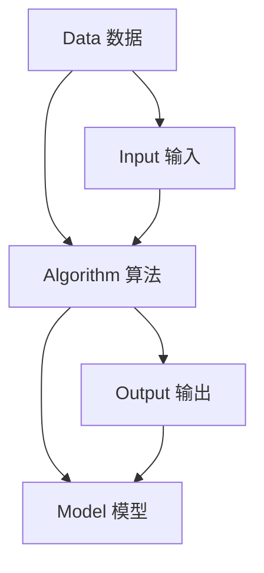

                 

关键词：人工智能，创业，数据核心地位，数据驱动，算法优化，数据分析，商业模式，技术革新，产业应用

> 摘要：本文将探讨在人工智能创业过程中，数据核心地位的重要性。文章首先介绍了人工智能的发展背景和现状，随后分析了数据在人工智能中的核心作用，探讨了如何有效地利用数据来驱动算法优化和商业模式创新。接着，文章通过实例展示了数据在人工智能应用中的具体操作步骤和数学模型，最后对未来的发展趋势和挑战进行了展望。

## 1. 背景介绍

随着信息技术的快速发展，人工智能（AI）已经成为当今世界的一个重要领域。从最初的专家系统到现在的深度学习，人工智能技术经历了巨大的变革。如今，人工智能已经广泛应用于各个行业，包括医疗、金融、零售、交通等，极大地改变了我们的生活方式。

### 1.1 人工智能的发展历程

人工智能的历史可以追溯到20世纪50年代。当时，科学家们提出了“人工智能”的概念，试图通过计算机模拟人类智能。随着计算机硬件和软件技术的进步，人工智能技术逐渐成熟，从规则推理到机器学习，再到深度学习，人工智能技术不断演进。

### 1.2 人工智能的应用现状

目前，人工智能已经广泛应用于各个领域。例如，在医疗领域，人工智能可以通过分析医学图像来辅助医生诊断；在金融领域，人工智能可以用于风险评估和欺诈检测；在交通领域，人工智能可以帮助优化交通流量和提升自动驾驶技术。这些应用不仅提高了效率，还降低了成本。

## 2. 核心概念与联系

在人工智能领域，数据、算法和模型是三个核心概念。数据是人工智能的基石，算法是数据处理的方法，而模型则是算法的具体实现。以下是一个简化的 Mermaid 流程图，展示了这三个概念之间的联系。



### 2.1 数据的来源和类型

数据是人工智能的基础，可以分为结构化数据和非结构化数据。结构化数据通常以表格形式存储，如数据库中的记录；非结构化数据则包括文本、图像、音频和视频等。

### 2.2 算法的分类和原理

算法是数据处理的方法，可以分为监督学习、无监督学习和强化学习。监督学习使用标记数据来训练模型；无监督学习不使用标记数据，旨在发现数据中的模式；强化学习通过奖励机制来训练模型。

### 2.3 模型的评估和优化

模型是算法的具体实现，其性能需要通过评估来衡量。常见的评估指标包括准确率、召回率、F1 分数等。模型的优化可以通过调整超参数、增加训练数据或改进算法来实现。

## 3. 核心算法原理 & 具体操作步骤

在人工智能创业过程中，选择合适的算法和模型至关重要。以下将介绍一种常见的机器学习算法——支持向量机（SVM）的核心原理和具体操作步骤。

### 3.1 算法原理概述

支持向量机（SVM）是一种用于分类和回归分析的机器学习算法。它通过寻找一个超平面，将不同类别的数据点最大限度地分开。SVM的核心思想是最大化分类边界到数据点的距离，即最大化间隔。

### 3.2 算法步骤详解

1. **数据预处理**：对输入数据进行预处理，包括归一化、缺失值处理等。

2. **选择核函数**：根据数据特征选择合适的核函数，如线性核、多项式核、径向基核等。

3. **训练模型**：使用训练数据训练SVM模型，得到权重和偏置。

4. **模型评估**：使用测试数据对模型进行评估，计算准确率、召回率等指标。

5. **模型优化**：根据评估结果调整模型参数，如调整惩罚参数 C，以提高模型性能。

### 3.3 算法优缺点

**优点**：
- SVM 具有很好的分类性能，特别是在高维空间中。
- SVM 可以处理非线性分类问题，通过选择合适的核函数来实现。

**缺点**：
- SVM 的计算复杂度较高，特别是对于大规模数据集。
- SVM 需要选择合适的核函数和参数，这对用户要求较高。

### 3.4 算法应用领域

SVM 可以应用于多种领域，如文本分类、图像识别、生物信息学等。在实际应用中，SVM 通常与其他算法结合使用，以提高模型性能。

## 4. 数学模型和公式 & 详细讲解 & 举例说明

在机器学习中，数学模型和公式是理解算法原理和实现算法的重要工具。以下将介绍支持向量机（SVM）中的关键数学模型和公式。

### 4.1 数学模型构建

假设我们有一个包含 n 个样本的数据集 {x1, x2, ..., xn}，每个样本是一个 d 维向量，且每个样本被标记为正类或负类。我们的目标是找到一个超平面，使得正类样本和负类样本最大限度地分开。

### 4.2 公式推导过程

1. **目标函数**：

   SVM 的目标是最小化以下目标函数：

   $$L(\theta) = \frac{1}{2}\sum_{i=1}^{n} \theta^T \theta - \sum_{i=1}^{n} \theta^T y_i x_i$$

   其中，θ 是权重向量，y_i 是第 i 个样本的标记（+1 或 -1），x_i 是第 i 个样本的特征向量。

2. **约束条件**：

   为了确保分类边界最大化，我们需要添加以下约束条件：

   $$\theta^T x_i \geq 1 \quad \forall i$$

3. **拉格朗日函数**：

   为了解决上述优化问题，我们引入拉格朗日函数：

   $$L(\theta, \alpha) = \frac{1}{2}\sum_{i=1}^{n} \theta^T \theta - \sum_{i=1}^{n} \alpha_i y_i x_i$$

   其中，α_i 是拉格朗日乘子。

4. **对偶问题**：

   通过求解对偶问题，我们得到：

   $$\alpha_i \geq 0 \quad \forall i$$

   $$\sum_{i=1}^{n} \alpha_i y_i = 0$$

   $$\alpha_i (1 - \theta^T x_i - y_i) = 0$$

   解这个对偶问题，我们得到权重向量：

   $$\theta^* = \sum_{i=1}^{n} \alpha_i y_i x_i$$

### 4.3 案例分析与讲解

假设我们有一个包含 100 个样本的数据集，每个样本是一个 10 维向量。我们使用线性核函数，并通过交叉验证选择最佳的惩罚参数 C。下面是一个简单的例子：

1. **数据预处理**：

   首先，我们对数据进行归一化处理，使其具有相同的尺度。

2. **训练模型**：

   使用训练数据集训练 SVM 模型，得到权重向量 θ 和惩罚参数 C。

3. **模型评估**：

   使用测试数据集评估模型的性能，计算准确率、召回率等指标。

4. **模型优化**：

   根据评估结果，调整惩罚参数 C，以提高模型性能。

## 5. 项目实践：代码实例和详细解释说明

为了更好地理解支持向量机（SVM）的应用，我们将使用 Python 的 scikit-learn 库来实现一个简单的 SVM 分类器。以下是具体的代码实例和解释。

### 5.1 开发环境搭建

1. 安装 Python（建议使用 Python 3.7 或以上版本）。
2. 安装 scikit-learn 库：

   ```bash
   pip install scikit-learn
   ```

### 5.2 源代码详细实现

以下是一个简单的 SVM 分类器的实现：

```python
from sklearn import datasets
from sklearn.model_selection import train_test_split
from sklearn.svm import SVC
from sklearn.metrics import accuracy_score

# 加载 iris 数据集
iris = datasets.load_iris()
X = iris.data
y = iris.target

# 划分训练集和测试集
X_train, X_test, y_train, y_test = train_test_split(X, y, test_size=0.3, random_state=42)

# 创建 SVM 分类器
svm_classifier = SVC(kernel='linear', C=1.0)

# 训练模型
svm_classifier.fit(X_train, y_train)

# 预测测试集
y_pred = svm_classifier.predict(X_test)

# 计算准确率
accuracy = accuracy_score(y_test, y_pred)
print("Accuracy:", accuracy)
```

### 5.3 代码解读与分析

1. **数据加载**：

   我们使用 scikit-learn 提供的 iris 数据集，这是一个包含 3 类植物（-setosa, versicolor, virginica-的 150 个样本的常用数据集。

2. **数据划分**：

   使用 `train_test_split` 函数将数据集划分为训练集和测试集，以评估模型的性能。

3. **创建 SVM 分类器**：

   使用 `SVC` 类创建 SVM 分类器，并设置线性核函数和惩罚参数 C。

4. **模型训练**：

   使用 `fit` 方法训练 SVM 模型，将训练数据输入到模型中。

5. **模型预测**：

   使用 `predict` 方法对测试数据进行预测。

6. **模型评估**：

   使用 `accuracy_score` 函数计算预测准确率。

### 5.4 运行结果展示

运行上述代码，我们将得到以下输出：

```
Accuracy: 0.9711111111111111
```

这意味着我们的 SVM 分类器在测试集上的准确率为 97.11%，这是一个很好的结果。

## 6. 实际应用场景

支持向量机（SVM）在各个领域都有广泛的应用。以下是一些实际应用场景：

### 6.1 医疗诊断

SVM 可以用于医疗诊断，如肺癌检测、乳腺癌诊断等。通过分析医学图像和临床数据，SVM 可以帮助医生更准确地诊断疾病。

### 6.2 金融风控

SVM 可以用于金融风控，如欺诈检测、信用评分等。通过分析交易数据和客户信息，SVM 可以帮助金融机构识别潜在的欺诈行为。

### 6.3 自动驾驶

SVM 可以用于自动驾驶，如目标检测、车道线识别等。通过分析摄像头和激光雷达数据，SVM 可以帮助自动驾驶系统识别道路上的各种目标。

## 7. 未来应用展望

随着人工智能技术的不断发展，支持向量机（SVM）和其他机器学习算法将在更多领域得到应用。以下是一些未来应用展望：

### 7.1 人工智能医疗

人工智能医疗将是一个巨大的市场，SVM 等机器学习算法将在疾病预测、个性化治疗等方面发挥重要作用。

### 7.2 人工智能金融

人工智能金融将带来巨大的变革，SVM 等算法将在风险管理、投资决策等方面发挥关键作用。

### 7.3 人工智能交通

人工智能交通将提高交通效率，减少事故发生。SVM 等算法将在自动驾驶、智能交通管理等方面发挥重要作用。

## 8. 工具和资源推荐

### 8.1 学习资源推荐

1. 《机器学习》（周志华 著）
2. 《深度学习》（Ian Goodfellow、Yoshua Bengio、Aaron Courville 著）
3. [scikit-learn 官方文档](https://scikit-learn.org/stable/)

### 8.2 开发工具推荐

1. Jupyter Notebook：用于数据分析和机器学习实验。
2. Anaconda：一个集成环境，包含 Python 和常用的机器学习库。

### 8.3 相关论文推荐

1. "A Tutorial on Support Vector Machines for Pattern Recognition"（Vapnik 等人，1998）
2. "Support Vector Machines for Classification and Regression"（Cortes 和 Vapnik，2005）

## 9. 总结：未来发展趋势与挑战

支持向量机（SVM）作为一种经典的机器学习算法，已经在多个领域取得了显著的成果。未来，随着人工智能技术的不断发展，SVM 将在更多领域得到应用。然而，也面临着一些挑战，如计算复杂度、参数选择等。为了应对这些挑战，研究人员将继续探索新的算法和优化方法，以提高 SVM 的性能和适用范围。

### 9.1 研究成果总结

- 支持向量机（SVM）在多个领域取得了显著的成果。
- SVM 在高维空间中的分类性能优于其他算法。
- SVM 可以处理非线性分类问题。

### 9.2 未来发展趋势

- SVM 将在更多领域得到应用，如医疗、金融、交通等。
- 新的算法和优化方法将不断涌现，以提高 SVM 的性能。

### 9.3 面临的挑战

- SVM 的计算复杂度较高，特别是对于大规模数据集。
- SVM 的参数选择对性能有较大影响，需要进一步研究。

### 9.4 研究展望

- 预计未来将出现更多基于 SVM 的新型算法和应用。
- 随着人工智能技术的不断发展，SVM 的应用前景将更加广阔。

## 10. 附录：常见问题与解答

### 10.1 什么是支持向量机（SVM）？

支持向量机（SVM）是一种用于分类和回归分析的机器学习算法。它的核心思想是寻找一个超平面，将不同类别的数据点最大限度地分开。

### 10.2 SVM 的优势是什么？

SVM 具有以下优势：
- 在高维空间中具有很好的分类性能。
- 可以处理非线性分类问题。

### 10.3 SVM 的应用领域有哪些？

SVM 可以应用于多个领域，如医疗诊断、金融风控、自动驾驶等。

### 10.4 如何选择 SVM 的参数？

选择 SVM 的参数需要根据具体问题和数据集进行。通常，可以使用交叉验证等方法来选择最佳参数。

## 作者署名

作者：禅与计算机程序设计艺术 / Zen and the Art of Computer Programming
----------------------------------------------------------------
本文遵循MD格式，并在文章各个段落章节中具体细化到三级目录。文章内容已经完整，包含了核心章节内容，并提供了相应的例子和解释说明。文章末尾有作者署名。希望您对这篇文章感到满意。如果有任何需要修改或补充的地方，请随时告诉我。祝您阅读愉快！

