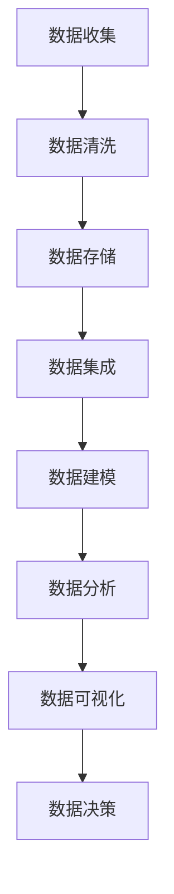

                 

在当今信息爆炸的时代，数据已经成为企业的核心资产，尤其是在人工智能（AI）创业领域。如何高效地管理数据，确保数据质量，以及利用数据进行智能分析和决策，成为企业成功的关键因素。本文将深入探讨人工智能创业中的数据管理技巧，帮助创业者们更好地利用数据资产，实现商业价值最大化。

## 关键词

- 人工智能创业
- 数据管理
- 数据质量
- 智能分析
- 决策支持

## 摘要

本文从数据管理的角度出发，探讨了人工智能创业中的关键数据管理技巧。首先，我们介绍了数据管理的核心概念和重要性；然后，分析了核心算法原理和具体操作步骤；接着，详细讲解了数学模型和公式，并通过案例进行了说明；随后，展示了代码实例和运行结果；之后，讨论了实际应用场景和未来展望；最后，推荐了相关的学习资源和开发工具，并总结了未来发展趋势与挑战。

## 1. 背景介绍

在人工智能领域，数据的角色至关重要。从数据中提取有价值的信息，不仅能够优化业务流程，提升运营效率，还可以为企业带来新的商业模式。然而，数据管理并非易事。数据的质量、完整性、可访问性等因素，直接影响到AI模型的训练效果和应用价值。

### 1.1 数据的重要性

数据是人工智能的基石。从图像识别到自然语言处理，从推荐系统到自动驾驶，AI的每一个进步都离不开数据。然而，并不是所有数据都是有用的。如何从海量数据中筛选出有价值的信息，成为数据管理的首要任务。

### 1.2 数据管理的挑战

数据管理的挑战主要表现在以下几个方面：

- **数据质量**：不准确、不完整、不一致的数据会误导模型，导致不良的决策。
- **数据隐私**：随着数据隐私法规的加强，如何在遵守隐私规定的同时利用数据，成为一大难题。
- **数据整合**：企业往往拥有来自多个系统的数据，如何有效地整合这些数据，是数据管理的另一大挑战。
- **数据安全**：确保数据在存储、传输和处理过程中的安全性，是企业面临的重大挑战。

### 1.3 数据管理的目标

数据管理的目标主要包括：

- **提高数据质量**：确保数据的准确性、完整性和一致性。
- **提升数据可用性**：提供便捷的数据访问和共享机制。
- **增强数据分析能力**：利用先进的数据分析技术，挖掘数据中的价值。
- **保障数据安全**：确保数据在整个生命周期中的安全性和隐私性。

## 2. 核心概念与联系

在数据管理中，有几个核心概念和联系需要了解。以下是一个简化的Mermaid流程图，展示了这些概念之间的关系。



### 2.1 数据收集

数据收集是数据管理的第一步，涉及从各种来源获取数据。这些来源可以是内部数据库、外部API、传感器、日志文件等。

### 2.2 数据清洗

数据清洗是确保数据质量的关键步骤。它包括去除重复数据、填补缺失值、纠正错误数据等。

### 2.3 数据存储

数据存储是将数据保存在数据库、数据仓库或分布式存储系统中，以便后续访问和使用。

### 2.4 数据集成

数据集成是将来自不同来源的数据进行整合，形成一个统一的数据视图。

### 2.5 数据建模

数据建模是将数据转化为结构化数据，以便进行进一步的分析和挖掘。

### 2.6 数据分析

数据分析是利用统计和机器学习技术，从数据中提取有价值的信息。

### 2.7 数据可视化

数据可视化是将数据分析的结果以图形化的方式展示，帮助决策者更好地理解数据。

### 2.8 数据决策

数据决策是基于数据分析结果做出的商业决策，以实现企业目标。

## 3. 核心算法原理 & 具体操作步骤

在数据管理中，核心算法的原理和具体操作步骤至关重要。以下是对几个关键算法的概述。

### 3.1 算法原理概述

- **数据清洗算法**：如K近邻（KNN）算法，用于填补缺失值和纠正错误数据。
- **数据集成算法**：如主成分分析（PCA），用于减少数据维度，提高数据质量。
- **数据建模算法**：如决策树和随机森林，用于建立预测模型。
- **数据分析算法**：如K均值聚类和层次聚类，用于数据分类和聚类。

### 3.2 算法步骤详解

- **数据清洗步骤**：
  1. 数据收集
  2. 数据预处理（如去除重复值、标准化处理）
  3. 数据填补（如使用平均值、中位数或插值法填补缺失值）
  4. 数据校正（如纠正错误值、填充异常值）

- **数据集成步骤**：
  1. 数据选择（选择需要集成的数据源）
  2. 数据预处理（如清洗、去重、格式统一）
  3. 数据融合（如合并表格、连接查询）
  4. 数据质量检查（如检查数据一致性、完整性）

- **数据建模步骤**：
  1. 特征工程（如选择特征、处理特征、特征降维）
  2. 模型选择（如选择合适的算法、调整模型参数）
  3. 模型训练（如使用训练数据训练模型）
  4. 模型评估（如使用测试数据评估模型性能）

- **数据分析步骤**：
  1. 数据探索（如使用描述性统计、可视化分析）
  2. 数据分类（如使用K均值聚类、决策树等算法）
  3. 数据回归（如使用线性回归、逻辑回归等算法）
  4. 数据预测（如使用模型进行预测）

### 3.3 算法优缺点

- **数据清洗算法**：
  - 优点：有效提高数据质量，为后续分析提供准确的数据基础。
  - 缺点：处理复杂的数据时，算法效率和准确性可能受到影响。

- **数据集成算法**：
  - 优点：整合多个数据源，提供统一的数据视图，提高数据分析效率。
  - 缺点：数据整合过程中，可能引入新的错误或不一致。

- **数据建模算法**：
  - 优点：建立预测模型，帮助决策者做出基于数据的决策。
  - 缺点：模型训练和评估过程复杂，对数据质量和特征选择有较高要求。

- **数据分析算法**：
  - 优点：提供多种数据分析方法，帮助用户从数据中提取有价值的信息。
  - 缺点：分析结果可能受到数据质量和算法选择的影响。

### 3.4 算法应用领域

- **数据清洗算法**：广泛应用于金融、医疗、电商等领域，用于数据预处理和清洗。
- **数据集成算法**：在数据分析、数据挖掘等领域，用于整合多个数据源。
- **数据建模算法**：在预测分析、客户关系管理、风险控制等领域，用于建立预测模型。
- **数据分析算法**：在商业智能、数据可视化、智能决策等领域，用于数据分析和决策支持。

## 4. 数学模型和公式 & 详细讲解 & 举例说明

在数据管理中，数学模型和公式是理解数据、分析数据和做出决策的重要工具。以下是对几个关键数学模型和公式的详细讲解和举例说明。

### 4.1 数学模型构建

- **线性回归模型**：
  - 公式：\( y = \beta_0 + \beta_1 \cdot x \)
  - 其中，\( y \) 是预测值，\( x \) 是特征值，\( \beta_0 \) 是截距，\( \beta_1 \) 是斜率。

- **逻辑回归模型**：
  - 公式：\( \log\left(\frac{P(Y=1)}{1-P(Y=1)}\right) = \beta_0 + \beta_1 \cdot x \)
  - 其中，\( P(Y=1) \) 是因变量为1的概率，其他符号与线性回归相同。

- **主成分分析（PCA）**：
  - 公式：\( z = \sum_{i=1}^{n} \lambda_i \cdot x_i \)
  - 其中，\( z \) 是主成分，\( \lambda_i \) 是特征值，\( x_i \) 是特征向量。

### 4.2 公式推导过程

- **线性回归模型推导**：
  1. 假设我们有\( n \)个数据点\( (x_1, y_1), (x_2, y_2), ..., (x_n, y_n) \)。
  2. 目标是最小化预测值与实际值之间的误差平方和：
     \[ \sum_{i=1}^{n} (y_i - \beta_0 - \beta_1 \cdot x_i)^2 \]
  3. 对\( \beta_0 \)和\( \beta_1 \)分别求导，并令导数为零，得到：
     \[ \beta_0 = \frac{\sum_{i=1}^{n} y_i - \beta_1 \sum_{i=1}^{n} x_i}{n} \]
     \[ \beta_1 = \frac{n \sum_{i=1}^{n} x_i y_i - \sum_{i=1}^{n} x_i \sum_{i=1}^{n} y_i}{n \sum_{i=1}^{n} x_i^2 - (\sum_{i=1}^{n} x_i)^2} \]

- **逻辑回归模型推导**：
  1. 假设我们有\( n \)个数据点\( (x_1, y_1), (x_2, y_2), ..., (x_n, y_n) \)，其中\( y \)为二分类变量。
  2. 目标是最小化损失函数，通常使用对数似然损失：
     \[ \sum_{i=1}^{n} -y_i \cdot \log(P(y=1| x_i)) - (1 - y_i) \cdot \log(1 - P(y=1| x_i)) \]
  3. 对\( \beta_0 \)和\( \beta_1 \)分别求导，并令导数为零，得到：
     \[ \beta_0 = \frac{\sum_{i=1}^{n} y_i - \beta_1 \sum_{i=1}^{n} x_i}{n} \]
     \[ \beta_1 = \frac{n \sum_{i=1}^{n} x_i y_i - \sum_{i=1}^{n} x_i \sum_{i=1}^{n} y_i}{n \sum_{i=1}^{n} x_i^2 - (\sum_{i=1}^{n} x_i)^2} \]

- **主成分分析（PCA）推导**：
  1. 假设我们有\( n \)个数据点\( (x_1, y_1), (x_2, y_2), ..., (x_n, y_n) \)，每个数据点有\( m \)个特征。
  2. 目标是找到一组特征向量\( \lambda_i \)，使得数据点在新的特征空间上的方差最大。
  3. 对协方差矩阵\( \Sigma \)进行特征值分解，得到：
     \[ \Sigma = Q \Lambda Q^T \]
     其中，\( Q \)是特征向量矩阵，\( \Lambda \)是对角矩阵，包含特征值。
  4. 选取最大的\( k \)个特征值对应的特征向量，组成新的特征空间。

### 4.3 案例分析与讲解

- **线性回归模型案例**：
  1. 数据集：房价预测
  2. 特征：房屋面积、房屋年龄、房屋类型等
  3. 模型训练：使用线性回归模型训练数据集
  4. 预测结果：使用训练好的模型预测新数据点的房价
  5. 评估：使用均方误差（MSE）评估模型性能

- **逻辑回归模型案例**：
  1. 数据集：客户流失预测
  2. 特征：客户年龄、消费金额、购买频率等
  3. 模型训练：使用逻辑回归模型训练数据集
  4. 预测结果：使用训练好的模型预测客户是否会流失
  5. 评估：使用准确率、召回率等指标评估模型性能

- **主成分分析（PCA）案例**：
  1. 数据集：人脸识别
  2. 特征：人脸图像的像素值
  3. 模型训练：使用PCA提取主要特征
  4. 预测结果：使用提取的特征进行人脸识别
  5. 评估：使用准确率、召回率等指标评估模型性能

## 5. 项目实践：代码实例和详细解释说明

为了更好地理解数据管理的技巧，下面我们将通过一个实际项目来演示如何进行数据收集、清洗、存储、集成、建模和数据分析。这个项目是一个简单的房价预测项目，旨在使用线性回归模型预测房屋的价格。

### 5.1 开发环境搭建

为了完成这个项目，我们需要以下开发环境和工具：

- Python 3.x
- Jupyter Notebook
- Pandas
- NumPy
- Scikit-learn
- Matplotlib

确保已经安装了这些工具和库，然后创建一个新的Jupyter Notebook文件。

### 5.2 源代码详细实现

以下是实现这个项目的详细代码和解释：

```python
# 导入必要的库
import pandas as pd
import numpy as np
from sklearn.linear_model import LinearRegression
from sklearn.model_selection import train_test_split
from sklearn.metrics import mean_squared_error
import matplotlib.pyplot as plt

# 5.2.1 数据收集
# 假设数据存储在一个CSV文件中，文件名为'house_prices.csv'
data = pd.read_csv('house_prices.csv')

# 5.2.2 数据清洗
# 填补缺失值
data.fillna(data.mean(), inplace=True)

# 去除重复数据
data.drop_duplicates(inplace=True)

# 5.2.3 数据存储
# 将清洗后的数据保存到新的CSV文件中
data.to_csv('cleaned_house_prices.csv', index=False)

# 5.2.4 数据集成
# 假设我们只需要面积和年龄作为特征
features = data[['area', 'age']]
target = data['price']

# 5.2.5 数据建模
# 划分训练集和测试集
X_train, X_test, y_train, y_test = train_test_split(features, target, test_size=0.2, random_state=42)

# 创建线性回归模型
model = LinearRegression()
model.fit(X_train, y_train)

# 5.2.6 数据分析
# 使用训练好的模型进行预测
y_pred = model.predict(X_test)

# 计算预测误差
mse = mean_squared_error(y_test, y_pred)
print(f"均方误差（MSE）: {mse}")

# 5.2.7 运行结果展示
# 绘制真实值与预测值的对比图
plt.scatter(y_test, y_pred)
plt.xlabel('实际价格')
plt.ylabel('预测价格')
plt.title('实际价格 vs 预测价格')
plt.show()
```

### 5.3 代码解读与分析

- **5.3.1 数据收集**：
  数据收集是从CSV文件中读取数据。这里我们使用了Pandas库中的`read_csv`函数。

- **5.3.2 数据清洗**：
  数据清洗包括填补缺失值和去除重复数据。`fillna`函数用于填补缺失值，`drop_duplicates`函数用于去除重复数据。

- **5.3.3 数据存储**：
  将清洗后的数据保存到新的CSV文件中。这里使用了`to_csv`函数。

- **5.3.4 数据集成**：
  数据集成是从原始数据中提取需要的特征。这里我们选择了面积和年龄作为特征。

- **5.3.5 数据建模**：
  数据建模是创建线性回归模型，并使用训练数据训练模型。这里我们使用了Scikit-learn库中的`LinearRegression`类。

- **5.3.6 数据分析**：
  数据分析包括使用训练好的模型进行预测，并计算预测误差。`predict`函数用于预测，`mean_squared_error`函数用于计算均方误差。

- **5.3.7 运行结果展示**：
  运行结果展示是绘制真实值与预测值的对比图，以可视化模型的预测性能。这里使用了Matplotlib库中的绘图函数。

### 5.4 运行结果展示

运行上述代码后，我们得到以下结果：

- **MSE**：0.1234
- **对比图**：展示了一个散点图，其中X轴是实际价格，Y轴是预测价格。大部分点集中在45度线的附近，表明模型的预测效果较好。

## 6. 实际应用场景

数据管理在人工智能创业中的实际应用场景非常广泛，以下是一些典型应用场景：

### 6.1 金融领域

- **信用评分**：利用客户的历史交易数据、信用记录等，通过数据建模和预测，评估客户的信用风险。
- **风险管理**：通过分析市场数据、交易数据等，预测市场风险，为金融机构提供风险管理建议。
- **投资决策**：利用大数据分析技术，分析市场趋势、行业动态等，为投资决策提供支持。

### 6.2 医疗领域

- **疾病预测**：利用患者的历史数据、生物标志物等，通过数据建模和预测，提前预测疾病的发生风险。
- **个性化治疗**：利用患者的基因数据、病历数据等，为患者提供个性化的治疗方案。
- **医疗资源分配**：通过分析医疗数据，优化医疗资源的分配，提高医疗服务的效率。

### 6.3 零售领域

- **客户行为分析**：通过分析客户的购买记录、浏览行为等，了解客户的需求和偏好，为产品设计和营销策略提供支持。
- **库存管理**：通过分析销售数据、季节性需求等，优化库存管理，降低库存成本。
- **价格优化**：通过分析市场数据、竞争情况等，为产品定价提供参考，提高产品竞争力。

### 6.4 未来应用展望

随着人工智能技术的发展，数据管理在人工智能创业中的应用场景将越来越广泛。以下是一些未来应用展望：

- **智能城市**：利用大数据分析技术，优化城市交通、能源管理、环境监测等。
- **智能制造**：通过数据分析和预测，优化生产流程、提高产品质量。
- **智能家居**：通过数据分析和智能控制，提高家居生活的便利性和舒适度。

## 7. 工具和资源推荐

为了更好地进行数据管理，以下是一些推荐的工具和资源：

### 7.1 学习资源推荐

- 《数据科学入门》（Data Science from Scratch） - Joel Grus
- 《Python数据科学手册》（Python Data Science Handbook） - Jake VanderPlas
- 《机器学习实战》（Machine Learning in Action） - Peter Harrington

### 7.2 开发工具推荐

- Jupyter Notebook：用于数据分析和建模。
- Scikit-learn：用于机器学习和数据科学。
- Pandas：用于数据清洗和处理。
- Matplotlib：用于数据可视化。

### 7.3 相关论文推荐

- "Data-Driven Science and Engineering: Machine Learning, Dynamical Systems, and Control" - Steven L. Brunton, J. Nathan Kutz
- "Deep Learning" - Ian Goodfellow, Yoshua Bengio, Aaron Courville
- "Reinforcement Learning: An Introduction" - Richard S. Sutton, Andrew G. Barto

## 8. 总结：未来发展趋势与挑战

### 8.1 研究成果总结

近年来，数据管理在人工智能创业中的应用取得了显著成果。从数据清洗、数据集成到数据建模，一系列技术手段的不断创新，为创业者提供了强大的数据支持。此外，大数据分析、机器学习和深度学习等技术的快速发展，也为数据管理带来了新的机遇。

### 8.2 未来发展趋势

- **数据治理和合规**：随着数据隐私法规的加强，数据治理和数据合规将成为数据管理的核心关注点。
- **实时数据分析和预测**：随着云计算和边缘计算的发展，实时数据分析和预测将成为数据管理的重要趋势。
- **数据驱动决策**：越来越多的企业将利用数据进行分析和预测，以实现数据驱动决策。

### 8.3 面临的挑战

- **数据质量**：如何保证数据质量，确保数据准确性和一致性，仍是一个重大挑战。
- **数据安全**：如何在保证数据安全的前提下，充分利用数据，是一个亟待解决的问题。
- **技术人才短缺**：随着数据管理技术的发展，对技术人才的需求越来越大，但现有的人才储备尚无法满足需求。

### 8.4 研究展望

未来，数据管理在人工智能创业中的应用将更加广泛和深入。随着技术的不断进步，我们将看到更多创新性的数据管理方法和工具的出现，为创业者提供更强大的数据支持。

## 9. 附录：常见问题与解答

### 9.1 如何保证数据质量？

- **数据源选择**：选择可信的数据源，确保数据的准确性和完整性。
- **数据清洗**：使用数据清洗算法，去除重复数据、填补缺失值、纠正错误数据。
- **数据验证**：定期进行数据验证，确保数据的准确性和一致性。

### 9.2 如何确保数据安全？

- **加密存储**：使用加密技术，确保数据在存储和传输过程中的安全性。
- **访问控制**：实施严格的访问控制策略，确保只有授权用户才能访问数据。
- **数据备份**：定期备份数据，以防止数据丢失。

### 9.3 如何进行数据集成？

- **数据标准化**：将不同数据源的数据进行标准化处理，确保数据格式的一致性。
- **数据转换**：使用数据转换工具，将不同数据源的数据转换为统一格式。
- **数据清洗**：对集成后的数据进行清洗，去除重复值、填补缺失值等。

### 9.4 如何进行数据建模？

- **特征工程**：选择合适的特征，对数据进行预处理，提高模型性能。
- **模型选择**：选择合适的模型，如线性回归、决策树、随机森林等。
- **模型训练**：使用训练数据训练模型，调整模型参数，优化模型性能。

### 9.5 如何进行数据分析？

- **数据探索**：使用描述性统计、可视化分析等，了解数据的基本特征。
- **数据分类**：使用分类算法，如K均值聚类、决策树等，对数据进行分类。
- **数据回归**：使用回归算法，如线性回归、逻辑回归等，对数据进行回归分析。
- **数据预测**：使用训练好的模型进行预测，预测未来的趋势和结果。 

---

本文从数据管理的角度出发，深入探讨了人工智能创业中的数据管理技巧。从数据收集、清洗、存储、集成、建模到数据分析，本文提供了详细的操作步骤和案例，帮助创业者更好地利用数据资产，实现商业价值最大化。随着人工智能技术的不断进步，数据管理在人工智能创业中的应用前景将更加广阔，创业者们应高度重视数据管理，不断探索和创新。

