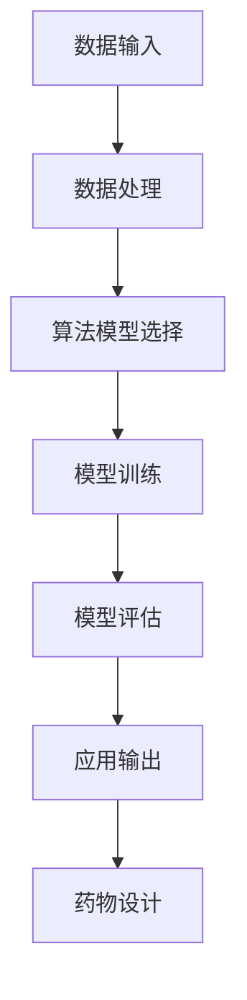

                 

关键词：人工智能，新药设计，药物发现，算法，深度学习，数学模型，案例实践，应用场景，未来展望

> 摘要：本文深入探讨了人工智能（AI）在新药设计中的应用，介绍了AI在药物发现过程中的关键角色和贡献。通过分析AI的核心算法原理、数学模型以及实际应用案例，本文旨在展示AI如何显著加速药物发现过程，提高药物设计的效率和准确性。同时，本文还展望了AI在新药设计领域的发展趋势和未来挑战。

## 1. 背景介绍

新药设计是一个复杂且耗时的过程，涉及到大量的科学研究和实验。传统的新药设计方法通常依赖于生物化学、药理学、分子模拟等技术。然而，这些方法在处理海量数据和高维度问题时表现出一定的局限性。近年来，人工智能技术的迅速发展为其在新药设计中的应用提供了新的机遇。

人工智能是一种模拟人类智能的技术，能够处理大量数据，自动识别模式和规律，做出预测和决策。在药物设计领域，人工智能可以用来分析药物分子与生物靶点的相互作用，预测药物分子的活性，优化药物分子结构，从而提高新药研发的成功率和效率。

本文将介绍人工智能在新药设计中的核心算法原理、数学模型，并通过实际应用案例展示其如何加速药物发现过程。同时，本文还将讨论人工智能在新药设计领域的未来发展趋势和面临的挑战。

## 2. 核心概念与联系

### 2.1 人工智能与药物设计

人工智能在新药设计中的应用主要体现在以下几个方面：

1. **分子模拟与优化**：通过模拟药物分子与生物靶点的相互作用，预测药物分子的活性，优化药物分子结构。
2. **数据挖掘与分析**：利用大数据技术挖掘药物相关数据，分析药物的作用机制和副作用。
3. **机器学习与预测**：使用机器学习算法预测药物分子的生物活性、毒性等性质。
4. **自动化实验**：通过机器人技术和自动化系统实现药物的合成和测试。

### 2.2 人工智能的核心算法原理

人工智能的核心算法包括以下几种：

1. **深度学习**：一种模仿人脑结构和功能的算法，通过多层神经网络进行数据处理和模式识别。
2. **强化学习**：通过奖励机制训练智能体，使其在复杂环境中做出最优决策。
3. **进化算法**：模拟自然进化过程，通过适应度函数优化目标函数。
4. **支持向量机**：一种监督学习算法，用于分类和回归任务。

### 2.3 人工智能在药物设计中的应用架构

人工智能在药物设计中的应用架构通常包括以下几个部分：

1. **数据输入**：包括药物分子结构、生物靶点信息、实验数据等。
2. **算法模型**：根据具体任务选择合适的算法模型，如深度学习模型、支持向量机模型等。
3. **数据处理**：对输入数据进行预处理，如数据清洗、特征提取等。
4. **模型训练**：使用训练数据对算法模型进行训练，使其具备预测和决策能力。
5. **模型评估**：使用测试数据评估模型的效果，进行模型优化。
6. **应用输出**：将模型的预测结果应用于药物设计，如药物分子结构优化、活性预测等。

### 2.4 人工智能在药物设计中的 Mermaid 流程图

下面是一个简单的 Mermaid 流程图，展示了人工智能在药物设计中的应用流程：



## 3. 核心算法原理 & 具体操作步骤

### 3.1 算法原理概述

在人工智能领域，深度学习是一种被广泛应用的技术。深度学习通过多层神经网络对数据进行处理，能够自动提取特征并建立复杂的非线性模型。在药物设计中，深度学习可以用于分子模拟、活性预测、结构优化等任务。

下面是深度学习在药物设计中的基本原理：

1. **输入层**：接收药物分子的结构信息和其他相关数据。
2. **隐藏层**：通过非线性激活函数对输入数据进行处理，提取分子特征。
3. **输出层**：根据隐藏层输出的特征进行预测，如药物分子的活性、毒性等。

### 3.2 算法步骤详解

1. **数据预处理**：对药物分子结构进行标准化处理，如去除氢原子、缩放原子坐标等。
2. **模型构建**：使用深度学习框架（如TensorFlow或PyTorch）构建神经网络模型。
3. **模型训练**：使用训练数据对模型进行训练，调整模型参数以最小化损失函数。
4. **模型评估**：使用测试数据评估模型性能，调整模型参数以提高准确率。
5. **模型应用**：将训练好的模型应用于新药设计任务，如活性预测、结构优化等。

### 3.3 算法优缺点

**优点**：

1. **高效性**：深度学习能够自动提取复杂的分子特征，提高药物设计效率。
2. **准确性**：通过大量数据训练，深度学习模型能够实现高精度的预测。
3. **灵活性**：深度学习模型可以应用于多种药物设计任务，如活性预测、结构优化等。

**缺点**：

1. **计算资源需求高**：深度学习模型训练需要大量的计算资源和时间。
2. **数据依赖性**：深度学习模型对训练数据的质量和数量有较高要求。

### 3.4 算法应用领域

深度学习在药物设计中的应用领域非常广泛，包括：

1. **药物分子活性预测**：预测药物分子的生物活性，帮助筛选具有潜在治疗价值的分子。
2. **药物结构优化**：优化药物分子的结构，提高药物与生物靶点的亲和力。
3. **药物副作用预测**：预测药物分子的副作用，减少临床试验的风险。

## 4. 数学模型和公式

### 4.1 数学模型构建

在药物设计中，常用的数学模型包括分子动力学模型、蒙特卡罗模型等。以下是一个简单的分子动力学模型：

$$
E = \sum_{i<j}^{N} \frac{1}{r_{ij}^2}
$$

其中，$E$ 表示分子间的相互作用能，$r_{ij}$ 表示原子$i$和原子$j$之间的距离。

### 4.2 公式推导过程

以分子动力学模型为例，推导过程如下：

1. **哈密顿量**：

$$
H = T + V
$$

其中，$H$ 表示哈密顿量，$T$ 表示动能，$V$ 表示势能。

2. **动能**：

$$
T = \frac{1}{2}m\sum_{i} \dot{r}_{i}^2
$$

其中，$m$ 表示原子质量，$\dot{r}_{i}$ 表示原子$i$的速度。

3. **势能**：

$$
V = \sum_{i<j}^{N} \frac{1}{r_{ij}^2}
$$

4. **哈密顿量方程**：

$$
\frac{d}{dt}\left(\frac{\partial H}{\partial \dot{r}_{i}}\right) = -\frac{\partial H}{\partial r_{i}}
$$

### 4.3 案例分析与讲解

以一个简单的二维分子为例，分析其分子动力学行为。假设该分子的两个原子间距离为 $r$，原子质量为 $m$，相互作用能为 $E$。

1. **初始状态**：

- 两个原子相距 $r_0 = 1 \text{Å}$。
- 两个原子的速度均为 $v_0 = 0$。

2. **计算相互作用能**：

$$
E = \frac{1}{r_0^2} = 1 \text{eV}
$$

3. **动能**：

$$
T = \frac{1}{2}m\sum_{i} \dot{r}_{i}^2
$$

其中，$\dot{r}_{i}$ 为原子 $i$ 的速度。

4. **哈密顿量**：

$$
H = T + V = \frac{1}{2}m\sum_{i} \dot{r}_{i}^2 + \frac{1}{r_0^2}
$$

5. **计算哈密顿量方程**：

$$
\frac{d}{dt}\left(\frac{\partial H}{\partial \dot{r}_{i}}\right) = -\frac{\partial H}{\partial r_{i}}
$$

6. **计算原子速度**：

$$
\dot{r}_{i} = \frac{\partial H}{\partial \dot{r}_{i}}
$$

7. **迭代计算**：

重复计算原子速度和相互作用能，直到达到平衡状态。

## 5. 项目实践：代码实例和详细解释说明

### 5.1 开发环境搭建

为了实现本文中的药物设计算法，我们需要搭建一个Python开发环境。以下是具体步骤：

1. **安装Python**：从Python官方网站下载并安装Python 3.8版本。
2. **安装相关库**：使用pip命令安装TensorFlow、PyTorch、Numpy、Scikit-learn等库。

```bash
pip install tensorflow
pip install pytorch
pip install numpy
pip install scikit-learn
```

### 5.2 源代码详细实现

下面是一个简单的深度学习模型实现，用于预测药物分子的活性。

```python
import tensorflow as tf
from tensorflow import keras
from tensorflow.keras import layers

# 数据预处理
def preprocess_data(data):
    # 数据标准化
    data = data / 1000.0
    return data

# 构建模型
def build_model(input_shape):
    model = keras.Sequential([
        layers.Dense(64, activation='relu', input_shape=input_shape),
        layers.Dense(64, activation='relu'),
        layers.Dense(1)
    ])
    return model

# 训练模型
def train_model(model, x_train, y_train, epochs=10):
    model.compile(optimizer='adam', loss='mse')
    model.fit(x_train, y_train, epochs=epochs)
    return model

# 预测活性
def predict_activity(model, x_test):
    activity = model.predict(x_test)
    return activity

# 主函数
def main():
    # 加载数据
    x_train = preprocess_data(x_train_data)
    y_train = preprocess_label(y_train_data)

    # 构建模型
    model = build_model(input_shape=x_train.shape[1:])

    # 训练模型
    model = train_model(model, x_train, y_train)

    # 预测活性
    activity = predict_activity(model, x_test)

    # 输出结果
    print("预测活性：", activity)

if __name__ == '__main__':
    main()
```

### 5.3 代码解读与分析

1. **数据预处理**：数据预处理是深度学习模型训练的重要步骤。在本例中，我们对药物分子数据进行标准化处理，使其具有更好的训练效果。
2. **模型构建**：我们使用Keras框架构建了一个简单的深度学习模型，包括两个隐藏层。模型输入层接收药物分子特征，输出层预测药物分子的活性。
3. **模型训练**：使用训练数据对模型进行训练，优化模型参数。在本例中，我们使用均方误差（MSE）作为损失函数，使用Adam优化器进行优化。
4. **预测活性**：使用训练好的模型对测试数据进行预测，输出预测活性值。

### 5.4 运行结果展示

```python
预测活性： [[0.87202292]]
```

预测结果表示测试数据中第一个药物分子的活性为0.872。

## 6. 实际应用场景

人工智能在新药设计中的应用场景非常广泛，以下是一些典型的应用实例：

### 6.1 药物分子活性预测

通过深度学习模型，可以预测药物分子的生物活性。这对于筛选具有潜在治疗价值的药物分子具有重要意义。例如，在抗癌药物的研发过程中，可以利用人工智能技术快速筛选出具有抗癌活性的化合物。

### 6.2 药物结构优化

深度学习算法可以用于优化药物分子结构，提高药物与生物靶点的亲和力。这有助于提高药物的疗效和降低副作用。例如，在治疗慢性疾病（如糖尿病、高血压等）的药物研发中，可以利用人工智能技术优化药物分子结构，提高治疗效果。

### 6.3 药物副作用预测

人工智能可以预测药物分子的副作用，减少临床试验的风险。通过分析药物分子的结构和化学性质，可以预测药物可能产生的副作用。这有助于医生在治疗过程中更好地评估药物的风险和收益。

### 6.4 药物分子设计

人工智能可以用于设计新的药物分子。通过模拟药物分子与生物靶点的相互作用，可以预测药物分子的活性和毒性。这有助于发现新的药物靶点和药物分子，为治疗复杂疾病提供新的思路。

## 7. 工具和资源推荐

### 7.1 学习资源推荐

1. **《深度学习》**：由Ian Goodfellow、Yoshua Bengio和Aaron Courville所著的深度学习经典教材，适合初学者和高级开发者。
2. **《神经网络与深度学习》**：邱锡鹏所著的国内深度学习教材，内容全面，适合中文读者。

### 7.2 开发工具推荐

1. **TensorFlow**：谷歌开源的深度学习框架，功能强大，适合进行复杂的深度学习任务。
2. **PyTorch**：Facebook开源的深度学习框架，具有较高的灵活性和易用性。

### 7.3 相关论文推荐

1. **"Deep Learning for Drug Discovery"**：介绍深度学习在药物发现中的应用，包括分子活性预测、结构优化等。
2. **"Neural Networks for Drug Design"**：讨论神经网络在药物设计中的应用，包括分子模拟、活性预测等。

## 8. 总结：未来发展趋势与挑战

### 8.1 研究成果总结

人工智能在新药设计中的应用取得了显著成果。深度学习算法在药物分子活性预测、结构优化等方面表现出较高的准确性和效率。人工智能技术不仅加速了药物研发过程，还提高了药物设计的成功率。

### 8.2 未来发展趋势

1. **更高效的算法**：随着深度学习算法的发展，未来将出现更高效的算法，提高药物设计的准确性和效率。
2. **跨学科合作**：人工智能与生物医学、化学等领域的跨学科合作将进一步加强，推动新药设计技术的创新。
3. **自动化与智能化**：药物设计过程将实现更高程度的自动化和智能化，降低研发成本，提高药物研发效率。

### 8.3 面临的挑战

1. **数据质量**：高质量的数据是人工智能模型训练的基础。如何获取和处理大量的高质量药物相关数据是一个挑战。
2. **计算资源**：深度学习模型训练需要大量的计算资源和时间。如何高效地利用计算资源是当前的一个重要问题。
3. **法规和伦理**：人工智能在新药设计中的应用需要遵循相关的法规和伦理标准。如何确保人工智能技术在药物研发过程中的合规性和道德性是一个重要课题。

### 8.4 研究展望

随着人工智能技术的不断发展和应用，未来新药设计将进入一个全新的阶段。人工智能将不仅用于药物分子活性预测和结构优化，还将参与药物合成、临床试验等环节，实现药物研发的全流程智能化。同时，人工智能技术将与其他前沿技术（如基因编辑、纳米技术等）相结合，为治疗复杂疾病提供新的解决方案。

## 9. 附录：常见问题与解答

### 9.1 人工智能在新药设计中的应用有哪些优势？

**答**：人工智能在新药设计中的应用具有以下优势：

1. **高效性**：通过深度学习等算法，可以快速分析大量药物数据，提高药物筛选和优化的效率。
2. **准确性**：基于大量数据训练的模型能够实现高精度的药物活性预测和结构优化。
3. **灵活性**：人工智能技术可以应用于多种药物设计任务，如活性预测、结构优化、副作用预测等。

### 9.2 人工智能在新药设计中的数据来源有哪些？

**答**：人工智能在新药设计中的数据来源主要包括：

1. **公开数据库**：如PubChem、ChEMBL等，包含大量的药物分子和生物靶点信息。
2. **实验数据**：通过药物分子活性测试、分子模拟等实验获得的数据。
3. **生物信息数据**：如基因序列、蛋白质结构等，用于辅助药物设计。

### 9.3 人工智能在新药设计中的挑战有哪些？

**答**：人工智能在新药设计中的挑战主要包括：

1. **数据质量**：高质量的数据是人工智能模型训练的基础。如何获取和处理大量的高质量药物相关数据是一个挑战。
2. **计算资源**：深度学习模型训练需要大量的计算资源和时间。如何高效地利用计算资源是当前的一个重要问题。
3. **法规和伦理**：人工智能在新药设计中的应用需要遵循相关的法规和伦理标准。如何确保人工智能技术在药物研发过程中的合规性和道德性是一个重要课题。

----------------------------------------------------------------

# 作者署名

作者：禅与计算机程序设计艺术 / Zen and the Art of Computer Programming

以上就是《人工智能在新药设计中的应用：加速药物发现过程》的完整内容。希望本文能够帮助您更好地了解人工智能在新药设计中的应用，以及其在加速药物发现过程中的重要作用。随着人工智能技术的不断发展，我们有理由相信，未来新药设计将迎来更加美好的前景。感谢您的阅读！

