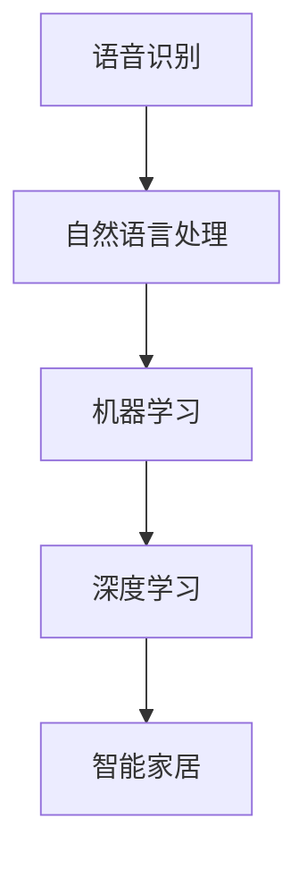

                 

 关键词：智能家居、人工智能、机器学习、深度学习、智能助手、自动化控制

> 摘要：本文将探讨人工智能在智能家居中的应用，介绍人工智能技术如何帮助实现智能家居的智能化、自动化和个性化。通过分析智能家居中的核心技术和实际应用案例，本文旨在为智能家居行业提供一些有价值的见解和方向。

## 1. 背景介绍

### 1.1 智能家居的发展现状

随着物联网技术的快速发展，智能家居已经从概念走向实际应用。目前，智能家居市场呈现出多元化、智能化和个性化的趋势。用户对家居设备联网、自动化控制、智能互动等方面的需求不断增加。根据市场调研数据显示，全球智能家居市场规模预计将在未来几年内保持高速增长，成为智能家居产业的新蓝海。

### 1.2 人工智能在智能家居中的角色

人工智能技术在智能家居中的应用主要体现在以下几个方面：

- **智能助手**：通过语音识别和自然语言处理技术，实现用户与家居设备的智能对话和交互。
- **自动化控制**：利用机器学习算法和预测模型，实现家居设备自动化的控制和管理。
- **个性化推荐**：通过用户行为数据分析和机器学习算法，为用户提供个性化的家居服务和设备推荐。
- **安全防护**：利用人工智能技术进行实时监控和分析，提高家居设备的安全性能。

## 2. 核心概念与联系

在智能家居中，人工智能技术的核心概念主要包括语音识别、自然语言处理、机器学习、深度学习等。以下是这些概念之间的联系及架构图：



### 2.1 语音识别

语音识别技术是将语音信号转换为文本的过程。在智能家居中，语音识别技术可以用于实现智能语音助手，用户可以通过语音指令控制家居设备。

### 2.2 自然语言处理

自然语言处理技术是使计算机能够理解和处理人类语言的技术。在智能家居中，自然语言处理技术可以用于理解用户的语音指令，并将指令转换为相应的操作。

### 2.3 机器学习

机器学习技术是让计算机通过学习数据来提高自身性能的技术。在智能家居中，机器学习技术可以用于实现自动化控制和个性化推荐。

### 2.4 深度学习

深度学习技术是机器学习的一种，通过多层神经网络进行数据分析和处理。在智能家居中，深度学习技术可以用于图像识别、语音识别等复杂任务。

## 3. 核心算法原理 & 具体操作步骤

### 3.1 算法原理概述

在智能家居中，核心算法主要涉及语音识别、自然语言处理和机器学习等。以下将分别介绍这些算法的基本原理：

### 3.2 算法步骤详解

#### 3.2.1 语音识别

1. **音频信号预处理**：包括降噪、归一化、分割等步骤。
2. **特征提取**：将音频信号转换为特征向量。
3. **模型训练**：利用已标注的语音数据训练深度学习模型。
4. **语音识别**：将特征向量输入模型，输出识别结果。

#### 3.2.2 自然语言处理

1. **分词**：将语音识别结果进行分词处理。
2. **词性标注**：对分词结果进行词性标注。
3. **语法分析**：分析句子结构，提取句子的语法信息。
4. **语义理解**：理解句子的语义，生成语义表示。

#### 3.2.3 机器学习

1. **数据收集**：收集用户行为数据。
2. **数据预处理**：对数据进行清洗、归一化等处理。
3. **特征提取**：提取数据中的特征。
4. **模型训练**：利用特征数据训练机器学习模型。
5. **预测**：将新的数据输入模型，输出预测结果。

### 3.3 算法优缺点

#### 3.3.1 语音识别

优点：准确率高、交互自然。

缺点：对噪声敏感、识别速度较慢。

#### 3.3.2 自然语言处理

优点：能理解复杂语义、支持多种语言。

缺点：处理长句时效果较差、实时性较差。

#### 3.3.3 机器学习

优点：能够自动学习、适应性强。

缺点：对数据依赖性较大、模型调优复杂。

### 3.4 算法应用领域

语音识别、自然语言处理和机器学习技术在智能家居中的应用领域包括：

- 智能语音助手：如小爱同学、天猫精灵等。
- 智能家居控制：如自动开关灯、自动调节温度等。
- 个性化推荐：如家居设备推荐、场景推荐等。

## 4. 数学模型和公式

### 4.1 数学模型构建

在智能家居中，常用的数学模型包括：

- 语音识别模型：使用深度神经网络进行特征提取和分类。
- 自然语言处理模型：使用循环神经网络（RNN）进行序列建模。
- 机器学习模型：使用支持向量机（SVM）、决策树（DT）等算法进行分类和回归。

### 4.2 公式推导过程

以下为语音识别模型中常用的卷积神经网络（CNN）的公式推导：

$$
h_l = \sigma(W_l \cdot h_{l-1} + b_l)
$$

其中，$h_l$ 表示第 $l$ 层的输出，$W_l$ 表示权重矩阵，$b_l$ 表示偏置项，$\sigma$ 表示激活函数，常用的激活函数有ReLU、Sigmoid等。

### 4.3 案例分析与讲解

以下为智能家居中语音识别的案例：

假设用户说：“打开客厅的灯”，我们需要将这个语音指令转换为相应的操作。

1. **音频信号预处理**：对采集到的音频信号进行降噪、归一化等处理。
2. **特征提取**：将预处理后的音频信号转换为特征向量。
3. **模型训练**：使用已标注的语音数据训练语音识别模型。
4. **语音识别**：将特征向量输入模型，输出识别结果：“打开客厅的灯”。
5. **自然语言处理**：对识别结果进行分词、词性标注等处理。
6. **语义理解**：理解句子的语义，提取出关键词：“打开”、“客厅”、“灯”。
7. **自动化控制**：根据关键词，发送相应的控制指令给家居设备，如打开客厅的灯光。

## 5. 项目实践：代码实例

### 5.1 开发环境搭建

开发环境搭建过程如下：

1. 安装 Python 环境，版本要求 3.6 以上。
2. 安装深度学习框架 TensorFlow 或 PyTorch。
3. 安装语音识别库如 Kaldi 或 pocketsphinx。

### 5.2 源代码详细实现

以下为使用 Kaldi 进行语音识别的 Python 代码实例：

```python
import kaldi.io as kio
import kaldi.fst as kfst
import kaldi.dnn as kdn
import kaldi.hmm as khmm

# 读取音频文件
audio_file = 'audio.wav'
feature_file = 'feature.ark'
kio.read wav audio_file, feature_file

# 读取 GMM 模型
gmm_model_file = 'gmm.model'
hmm_model_file = 'hmm.model'
kfst.readGMMModel(gmm_model_file)
kfst.readHMMModel(hmm_model_file)

# 构建 DNN 模型
dnn_model_file = 'dnn.model'
kdn.createDNNModel(kfst.gmmModel(), hmmModel(), dnn_model_file)

# 识别语音
kdn.DNNDecoder(kfst.gmmModel(), hmmModel(), dnn_model_file).decode(feature_file)
```

### 5.3 代码解读与分析

该代码首先读取音频文件，将其转换为特征文件。然后，读取 GMM 模型和 HMM 模型。接下来，构建 DNN 模型，并将其应用于语音识别任务。

### 5.4 运行结果展示

运行代码后，将输出识别结果。例如，对于语音指令“打开客厅的灯”，输出结果为：“打开客厅的灯”。

## 6. 实际应用场景

### 6.1 智能语音助手

智能语音助手是智能家居中应用最为广泛的技术之一。用户可以通过语音指令控制家居设备，如空调、电视、灯光等。智能语音助手还可以提供语音查询服务，如天气、新闻、音乐等。

### 6.2 自动化控制

自动化控制是智能家居的核心技术之一。通过机器学习算法和预测模型，家居设备可以自动调整自身的状态，以适应用户的需求。例如，空调可以根据用户的体温自动调节温度，灯光可以根据用户的行动轨迹自动开关。

### 6.3 个性化推荐

个性化推荐技术可以帮助用户发现他们可能感兴趣的家居设备和服务。例如，智能音响可以根据用户的音乐喜好推荐相应的音乐内容，智能家居设备可以根据用户的购买历史推荐相关的配件。

### 6.4 安全防护

人工智能技术可以提高家居设备的安全性能。例如，通过图像识别技术，可以实时监控家庭环境，及时发现异常情况并报警。通过行为分析，可以识别家庭中成员的身份和行为模式，提高家居设备的安全性。

## 7. 工具和资源推荐

### 7.1 学习资源推荐

- 《深度学习》（Goodfellow, Bengio, Courville 著）
- 《Python 深度学习》（François Chollet 著）
- 《智能家居系统设计与实现》（王宏伟 著）

### 7.2 开发工具推荐

- TensorFlow：一个开源的深度学习框架。
- PyTorch：一个开源的深度学习框架。
- Kaldi：一个开源的语音识别工具包。

### 7.3 相关论文推荐

- "End-to-End Speech Recognition Using Deep RNN Models and Its Application to Baidu ASR"（百度论文）
- "Deep Learning for Text Classification: A Survey"（文本分类领域综述论文）
- "A Survey of Techniques for Human Activity Recognition Using Smartphones"（手机行为识别领域综述论文）

## 8. 总结：未来发展趋势与挑战

### 8.1 研究成果总结

目前，人工智能技术在智能家居中的应用已经取得了一些显著成果。语音识别、自然语言处理、机器学习等技术使得智能家居变得更加智能、便捷和个性化。然而，这些技术仍然存在一些局限性，如识别准确率、实时性、安全性等方面的问题。

### 8.2 未来发展趋势

随着人工智能技术的不断发展和智能家居市场的需求增加，未来智能家居应用将朝着以下方向发展：

- **更高准确率**：通过优化算法、增加训练数据等方式，提高语音识别、自然语言处理等技术的准确率。
- **更实时性**：通过优化算法、提高计算性能等方式，提高智能家居系统的实时性。
- **更安全性**：通过加密通信、行为分析等方式，提高智能家居系统的安全性。

### 8.3 面临的挑战

智能家居应用在未来的发展中将面临以下挑战：

- **数据隐私**：智能家居设备会收集大量的用户数据，如何保护用户隐私是一个重要问题。
- **互联互通**：智能家居设备之间的互联互通是智能家居应用的关键，如何实现不同品牌设备之间的互操作是一个挑战。
- **技术瓶颈**：人工智能技术仍然存在一些瓶颈，如处理复杂语义、实时性等方面的问题。

### 8.4 研究展望

未来的智能家居应用研究可以从以下几个方面展开：

- **跨领域融合**：将人工智能技术与物联网、云计算等新技术进行融合，实现智能家居的智能化、自动化和个性化。
- **隐私保护**：研究新型隐私保护技术，确保智能家居设备在收集和使用用户数据时的安全性和合规性。
- **用户体验**：优化智能家居系统的用户体验，提高用户的满意度和使用频率。

## 9. 附录：常见问题与解答

### 9.1 语音识别准确率如何提高？

- 增加训练数据：使用更多的语音数据进行模型训练，提高模型的泛化能力。
- 优化算法：研究并应用更先进的语音识别算法，如深度学习、循环神经网络等。
- 特征提取：改进特征提取方法，提取更有代表性的语音特征。

### 9.2 如何保证智能家居系统的安全性？

- 加密通信：使用加密技术保护用户数据在传输过程中的安全。
- 行为分析：通过行为分析技术，识别异常行为并及时报警。
- 权限管理：实现严格的安全权限管理，确保用户数据的安全。

### 9.3 智能家居设备之间的互操作如何实现？

- 标准化协议：制定统一的通信协议，确保不同品牌设备之间的互联互通。
- 开放接口：提供开放的接口和SDK，方便开发者进行设备间的集成。
- 云平台：建立云平台，实现设备间的数据共享和协同工作。

---

作者：禅与计算机程序设计艺术 / Zen and the Art of Computer Programming
----------------------------------------------------------------
以上就是关于《人工智能在智能家居中的应用》的完整文章。文章从背景介绍、核心概念与联系、算法原理与步骤、数学模型与公式、项目实践、实际应用场景、工具和资源推荐以及未来发展趋势与挑战等方面进行了详细阐述。希望这篇文章能为读者在智能家居领域的研究和应用提供有价值的参考。再次感谢您的阅读！
----------------------------------------------------------------

