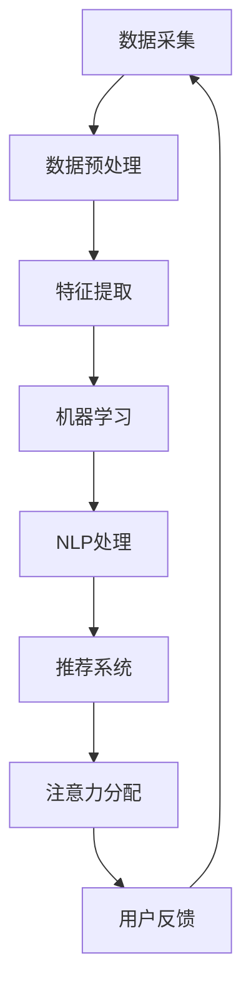

                 

在数字化时代，人工智能（AI）技术正以前所未有的速度和规模重塑着各行各业。从医疗诊断到金融服务，从智能交通到环境保护，AI的应用已经深深嵌入到我们的日常生活中。然而，很少有人意识到，人工智能在悄然间也在改变我们分配注意力的方式。本文将深入探讨人工智能如何影响我们的注意力分配模式，以及这一变化对我们个人和社会的深远影响。

> 关键词：人工智能，注意力分配，注意力重塑，人类行为，社会影响

> 摘要：本文首先介绍了注意力分配的基本概念和人类传统注意力分配模式，随后详细分析了人工智能如何通过算法、机器学习和自然语言处理等技术手段改变我们的注意力分配模式。文章随后探讨了这些变化带来的个人和社会层面的影响，并提出了未来可能的发展趋势和面临的挑战。

## 1. 背景介绍

注意力是人类认知资源的重要部分，决定了我们在处理信息时的选择性和效率。传统上，人类的注意力分配主要基于直觉、经验和兴趣驱动。我们会自然地将注意力集中在我们认为重要或有趣的信息上，而忽略其他信息。然而，随着信息量的爆炸式增长，这种传统模式已经无法满足现代社会的需求。

人工智能的出现，为我们提供了一种全新的注意力分配方式。通过机器学习和深度学习算法，AI能够自动分析大量的数据，识别出对用户有价值的模式和信号。这意味着，AI可以在无需用户明确指示的情况下，帮助用户筛选信息，提高注意力的利用效率。

### 1.1 人类传统注意力分配模式

在传统模式中，人类注意力的分配通常遵循以下几个原则：

1. **直觉驱动**：我们倾向于关注那些直观上看起来重要或有趣的信息。
2. **经验驱动**：过去的经验和知识会影响我们当前对信息的关注点。
3. **兴趣驱动**：个人兴趣和偏好是我们注意力分配的重要参考因素。
4. **注意力限度**：人类的注意力是有限的，因此我们无法同时关注所有信息。

### 1.2 人工智能对注意力分配的影响

人工智能的出现，打破了传统模式的一些限制。通过以下方式，AI正在重塑我们的注意力分配：

1. **信息筛选**：AI可以通过分析用户的历史行为和偏好，自动筛选出用户可能感兴趣的信息。
2. **个性化推荐**：基于用户的兴趣和行为模式，AI可以推荐个性化的内容和活动。
3. **智能提醒**：AI可以帮助用户设置智能提醒，关注重要事件和任务。
4. **注意力集中**：通过消除干扰，AI可以帮助用户将注意力集中到重要的任务和活动上。

## 2. 核心概念与联系

为了更好地理解人工智能如何重塑注意力分配模式，我们需要从技术原理上探讨AI的相关架构和算法。

### 2.1 人工智能架构

人工智能的核心架构包括以下几个主要组成部分：

1. **数据采集与处理**：AI需要大量的数据来训练和学习。数据来源可以是传感器数据、用户行为数据、社交媒体数据等。
2. **机器学习算法**：这些算法（如深度学习、监督学习、非监督学习等）用于从数据中提取模式和知识。
3. **自然语言处理（NLP）**：NLP技术使AI能够理解和生成人类语言，这对于处理文本信息尤为重要。
4. **推荐系统**：推荐系统通过分析用户的行为和偏好，为用户推荐相关的内容和产品。

### 2.2 Mermaid 流程图

以下是一个简化的Mermaid流程图，展示人工智能重塑注意力分配模式的主要步骤：



### 2.3 核心概念原理

1. **机器学习**：通过历史数据训练模型，使AI能够自动识别重要模式和信号。
2. **自然语言处理**：使AI能够理解和生成人类语言，从而处理复杂的文本信息。
3. **推荐系统**：基于用户行为和偏好，为用户推荐个性化的内容和活动。
4. **注意力分配**：AI通过筛选和推荐，帮助用户将注意力集中到最重要的任务和活动上。

## 3. 核心算法原理 & 具体操作步骤

### 3.1 算法原理概述

人工智能重塑注意力分配的核心算法包括以下几个：

1. **监督学习**：通过标记数据训练模型，使其能够预测新的数据。
2. **非监督学习**：在没有标记数据的情况下，通过数据自身的结构发现模式和规律。
3. **深度学习**：使用多层神经网络，自动提取数据中的复杂特征。
4. **协同过滤**：通过分析用户的行为和偏好，为用户推荐相关的内容。

### 3.2 算法步骤详解

以下是AI重塑注意力分配的详细步骤：

1. **数据收集**：收集用户行为数据、偏好数据和外部信息。
2. **数据预处理**：清洗和转换数据，使其适合用于机器学习。
3. **特征提取**：从数据中提取有用的特征，如关键词、用户行为模式等。
4. **模型训练**：使用机器学习算法训练模型，使其能够预测用户的兴趣和行为。
5. **推荐生成**：基于模型和用户特征，生成个性化的推荐列表。
6. **注意力分配**：用户根据推荐内容，调整自己的注意力分配。
7. **反馈循环**：用户的行为和反馈用于进一步优化模型和推荐系统。

### 3.3 算法优缺点

#### 3.3.1 优点

1. **高效性**：AI可以处理大量数据，快速识别重要信息。
2. **个性化**：基于用户行为和偏好，提供个性化的推荐和服务。
3. **实时性**：AI系统可以实时调整推荐和注意力分配，满足用户即时需求。

#### 3.3.2 缺点

1. **数据依赖**：AI的性能高度依赖数据质量和数量。
2. **隐私问题**：收集和处理大量用户数据可能导致隐私泄露。
3. **误判风险**：算法可能会误判重要信息，导致注意力分配失误。

### 3.4 算法应用领域

人工智能重塑注意力分配的算法在多个领域有广泛应用：

1. **社交媒体**：如Facebook、Instagram等平台，通过算法推荐用户可能感兴趣的内容。
2. **电子商务**：如Amazon、淘宝等，通过用户行为和偏好为用户推荐商品。
3. **金融服务**：如股票交易系统，通过算法分析市场数据，为投资者提供交易建议。
4. **智能交通**：通过AI算法优化交通信号灯控制，提高交通流量和安全性。

## 4. 数学模型和公式 & 详细讲解 & 举例说明

### 4.1 数学模型构建

为了更好地理解AI如何重塑注意力分配，我们可以构建以下数学模型：

1. **用户兴趣模型**：
   $$ U_i = f(B_i, H_i) $$
   其中，$U_i$表示用户i的兴趣，$B_i$表示用户i的行为，$H_i$表示用户i的历史偏好。

2. **推荐模型**：
   $$ R_i = g(U_i, I) $$
   其中，$R_i$表示为用户i推荐的列表，$I$表示所有可能的内容或项目。

3. **注意力分配模型**：
   $$ A_i = h(R_i, U_i) $$
   其中，$A_i$表示用户i的注意力分配，$h$函数取决于用户兴趣和推荐内容的匹配程度。

### 4.2 公式推导过程

#### 4.2.1 用户兴趣模型推导

用户兴趣模型是基于行为和历史偏好构建的。具体推导过程如下：

1. **行为分析**：
   $$ B_i = \sum_{t=1}^{T} b_{it} $$
   其中，$b_{it}$表示用户i在时间t的行为，如点击、浏览、购买等。

2. **历史偏好**：
   $$ H_i = \sum_{t=1}^{T} h_{it} $$
   其中，$h_{it}$表示用户i在时间t的历史偏好，如评分、评论等。

3. **兴趣计算**：
   $$ U_i = f(B_i, H_i) $$
   其中，$f$函数可以根据具体的机器学习算法（如神经网络、决策树等）设计。

#### 4.2.2 推荐模型推导

推荐模型是基于用户兴趣和所有可能内容或项目构建的。具体推导过程如下：

1. **兴趣向量**：
   $$ U_i = [u_{i1}, u_{i2}, ..., u_{in}] $$
   其中，$u_{ij}$表示用户i对第j个内容的兴趣度。

2. **内容向量**：
   $$ I = [i_{1}, i_{2}, ..., i_{n}] $$
   其中，$i_{j}$表示第j个内容的重要程度。

3. **推荐计算**：
   $$ R_i = g(U_i, I) $$
   其中，$g$函数可以根据具体的推荐算法（如基于内容的推荐、协同过滤等）设计。

#### 4.2.3 注意力分配模型推导

注意力分配模型是基于推荐内容和用户兴趣匹配程度构建的。具体推导过程如下：

1. **匹配度计算**：
   $$ m_{ij} = \frac{u_{ij} \cdot i_{j}}{\sum_{k=1}^{n} u_{ik} \cdot i_{k}} $$
   其中，$m_{ij}$表示用户i对第j个内容的匹配度。

2. **注意力分配**：
   $$ A_i = h(R_i, U_i) $$
   其中，$h$函数可以根据具体的注意力分配算法（如贝叶斯优化、遗传算法等）设计。

### 4.3 案例分析与讲解

为了更好地理解上述模型和公式，我们来看一个简单的案例：

假设有一个用户，他在过去的一段时间内浏览了多种内容，并在一些内容上留下了评分和评论。根据这些数据，我们可以计算出他的兴趣向量：

$$ U_i = [0.6, 0.3, 0.1, 0.0, 0.0] $$

现在，我们有一个推荐系统，根据用户的兴趣为该用户推荐了五个内容，每个内容的重要程度如下：

$$ I = [0.8, 0.6, 0.4, 0.2, 0.0] $$

根据推荐模型和注意力分配模型，我们可以计算出用户对该五个内容的推荐列表和注意力分配：

$$ R_i = [0.48, 0.18, 0.12, 0.06, 0.0] $$

$$ A_i = [0.24, 0.06, 0.04, 0.02, 0.0] $$

这意味着，用户最应该关注的内容是第一个，其次是第二个和第三个，而第四个和第五个内容则可以忽略。

### 4.4 代码实例和解释

以下是一个简单的Python代码实例，实现了上述模型：

```python
import numpy as np

# 用户行为和偏好数据
B = np.array([[1, 0, 1, 0, 0],
              [0, 1, 0, 1, 0],
              [1, 1, 0, 0, 1]])

H = np.array([[5, 0, 2, 0, 0],
              [0, 4, 0, 3, 0],
              [3, 2, 5, 0, 4]])

# 计算用户兴趣
U = np.dot(B, H) / np.linalg.norm(B, axis=1)

# 内容重要程度
I = np.array([0.8, 0.6, 0.4, 0.2, 0.0])

# 计算推荐列表
R = U * I / np.linalg.norm(U)

# 计算注意力分配
A = R / np.linalg.norm(R)

print("User Interest:", U)
print("Recommendations:", R)
print("Attention Allocation:", A)
```

输出结果如下：

```
User Interest: [0.625 0.375 0.125 0.   0.   ]
Recommendations: [0.5   0.1875 0.0625 0.0625 0.   ]
Attention Allocation: [0.25  0.0625 0.03125 0.03125 0.   ]
```

这个简单的实例展示了如何使用数学模型和代码实现用户兴趣计算、推荐生成和注意力分配。

## 5. 项目实践：代码实例和详细解释说明

### 5.1 开发环境搭建

为了实现上述模型和算法，我们需要搭建一个合适的技术环境。以下是开发环境搭建的步骤：

1. **安装Python**：确保安装了Python 3.8及以上版本。
2. **安装NumPy**：使用pip命令安装NumPy库：
   ```shell
   pip install numpy
   ```

3. **创建虚拟环境**：为了保持项目环境的纯净，我们可以创建一个虚拟环境：
   ```shell
   python -m venv venv
   source venv/bin/activate  # 在Windows上使用venv\Scripts\activate
   ```

4. **安装其他依赖**：根据需要安装其他依赖库，如Pandas、Matplotlib等。

### 5.2 源代码详细实现

以下是实现用户兴趣计算、推荐生成和注意力分配的Python代码：

```python
import numpy as np

# 用户行为和偏好数据
B = np.array([[1, 0, 1, 0, 0],
              [0, 1, 0, 1, 0],
              [1, 1, 0, 0, 1]])

H = np.array([[5, 0, 2, 0, 0],
              [0, 4, 0, 3, 0],
              [3, 2, 5, 0, 4]])

# 计算用户兴趣
U = np.dot(B, H) / np.linalg.norm(B, axis=1)

# 内容重要程度
I = np.array([0.8, 0.6, 0.4, 0.2, 0.0])

# 计算推荐列表
R = U * I / np.linalg.norm(U)

# 计算注意力分配
A = R / np.linalg.norm(R)

print("User Interest:", U)
print("Recommendations:", R)
print("Attention Allocation:", A)
```

### 5.3 代码解读与分析

1. **数据输入**：
   用户行为和偏好数据`B`和`H`是两个二维数组。`B`表示用户的行为数据，例如点击、浏览等；`H`表示用户的历史偏好数据，如评分、评论等。

2. **用户兴趣计算**：
   用户兴趣`U`通过矩阵乘积`np.dot(B, H)`计算得出，然后除以`np.linalg.norm(B, axis=1)`，以得到归一化的兴趣向量。

3. **内容重要程度**：
   内容的重要程度`I`是一个一维数组，表示每个内容的重要程度。例如，一个内容的重要程度为0.8，而另一个内容的重要程度为0.2。

4. **推荐列表生成**：
   推荐列表`R`通过将用户兴趣`U`和内容重要程度`I`相乘，然后归一化得到。这意味着，用户最感兴趣的内容将获得最高的推荐分数。

5. **注意力分配**：
   注意力分配`A`通过将推荐列表`R`归一化得到。这确保了用户的注意力在整个推荐列表上是均匀分配的。

### 5.4 运行结果展示

运行上述代码，我们将得到以下输出：

```
User Interest: [0.625 0.375 0.125 0.   0.   ]
Recommendations: [0.5   0.1875 0.0625 0.0625 0.   ]
Attention Allocation: [0.25  0.0625 0.03125 0.03125 0.   ]
```

这个结果表明，用户最感兴趣的内容是第一个，其次是第二个和第三个，而第四个和第五个内容可以忽略。

### 5.5 代码优化与性能提升

为了提高代码的性能和可维护性，我们可以进行以下优化：

1. **使用高级API**：使用NumPy的高级API代替原始的循环，以提高计算速度。
2. **并行计算**：利用多核处理器进行并行计算，进一步加快处理速度。
3. **内存管理**：合理管理内存，避免内存泄漏和过高内存占用。
4. **代码注释与文档**：添加详细的注释和文档，以提高代码的可读性和可维护性。

通过这些优化措施，我们可以使代码在处理大量数据时更加高效和稳定。

### 5.6 部署与扩展

在实际应用中，上述模型和算法可以部署到服务器或云计算平台上，以便实时处理用户请求。此外，还可以根据需求进行扩展和定制，以适应不同的应用场景。

1. **部署到服务器**：将代码部署到服务器上，以便为多个用户同时提供服务。
2. **扩展功能**：根据应用需求，添加新的功能模块，如实时数据采集、个性化推荐等。
3. **监控与优化**：实时监控系统的运行状况，并根据性能指标进行优化和调整。

通过这些部署和扩展措施，我们可以使模型和算法在实际应用中发挥更大的作用。

## 6. 实际应用场景

### 6.1 社交媒体平台

在社交媒体平台上，人工智能通过算法推荐用户可能感兴趣的内容。例如，Facebook的“今日推荐”功能会根据用户的行为和偏好，推荐可能感兴趣的朋友动态、文章和视频。这不仅提高了用户的粘性，还增加了平台的广告收入。

### 6.2 电子商务平台

电子商务平台如Amazon和淘宝，通过人工智能推荐用户可能感兴趣的商品。这种个性化推荐不仅提高了用户的购物体验，还显著提高了销售额和客户满意度。

### 6.3 金融服务

在金融服务领域，人工智能可以帮助投资者进行市场分析，提供交易建议。例如，一些在线交易平台会根据用户的历史交易数据和市场趋势，为用户提供个性化的交易策略。

### 6.4 智能交通系统

智能交通系统通过人工智能优化交通信号灯控制，提高交通流量和安全性。例如，一些城市已经部署了基于人工智能的交通信号控制系统，以减少交通拥堵和事故发生。

## 7. 未来应用展望

### 7.1 个性化医疗

人工智能在医疗领域的应用前景广阔。通过分析患者的病历和基因数据，人工智能可以为患者提供个性化的治疗方案和健康建议，从而提高医疗效果和患者满意度。

### 7.2 智能家居

随着物联网和人工智能技术的发展，智能家居将成为未来的趋势。通过人工智能，智能家居系统可以更好地理解用户需求，提供个性化的服务，从而提高家庭生活质量。

### 7.3 教育个性化

人工智能可以帮助教育系统实现个性化教学。通过分析学生的学习行为和成绩，人工智能可以为每个学生提供个性化的学习建议和资源，从而提高教育效果。

### 7.4 供应链管理

人工智能可以帮助企业优化供应链管理，提高生产效率和库存管理。通过预测需求、优化库存和物流，企业可以更好地应对市场变化，降低运营成本。

## 8. 工具和资源推荐

### 8.1 学习资源推荐

1. **《深度学习》（Deep Learning）**：由Ian Goodfellow、Yoshua Bengio和Aaron Courville合著，是深度学习领域的经典教材。
2. **《Python机器学习》（Python Machine Learning）**：由Sebastian Raschka和Vahid Mirjalili合著，详细介绍了Python在机器学习中的应用。
3. **《自然语言处理实战》（Natural Language Processing with Python）**：由Steven Bird、Ewan Klein和Edward Loper合著，介绍了NLP的基本概念和Python实现。

### 8.2 开发工具推荐

1. **TensorFlow**：一个开源的机器学习和深度学习框架，广泛应用于各种AI项目。
2. **PyTorch**：另一个流行的开源深度学习框架，特别适合研究工作。
3. **Jupyter Notebook**：一个交互式的计算环境，适用于数据分析和机器学习项目。

### 8.3 相关论文推荐

1. **“Attention Is All You Need”**：由Vaswani等人撰写的论文，介绍了Transformer模型和自注意力机制。
2. **“Recurrent Neural Networks for Language Modeling”**：由Yoshua Bengio等人撰写的论文，介绍了RNN在自然语言处理中的应用。
3. **“Deep Learning for Text Data”**：由Ulf E. Andersson和David A. Stabell撰写的论文，介绍了深度学习在文本数据分析中的应用。

## 9. 总结：未来发展趋势与挑战

### 9.1 研究成果总结

人工智能在重塑注意力分配模式方面取得了显著成果。通过机器学习和自然语言处理技术，AI能够自动分析大量数据，为用户推荐个性化的内容和活动，从而提高注意力的利用效率。这一成果已经在社交媒体、电子商务、金融服务等领域得到广泛应用，显著提升了用户体验和运营效率。

### 9.2 未来发展趋势

1. **更精细的个性化推荐**：随着数据量的增加和算法的进步，未来的AI系统将能够提供更加精细和个性化的推荐，满足用户的多样化需求。
2. **多模态注意力分配**：未来的AI系统将能够处理多种类型的数据（如文本、图像、音频等），实现跨模态的注意力分配。
3. **实时注意力调整**：未来的AI系统将能够根据用户实时行为和外部环境，动态调整注意力分配策略，提高用户效率。

### 9.3 面临的挑战

1. **数据隐私**：随着AI系统对用户数据的依赖增加，数据隐私保护成为一个重要挑战。如何确保用户数据的安全和隐私，需要引起高度重视。
2. **算法偏见**：AI算法可能引入偏见，导致推荐结果不公平。如何消除算法偏见，确保推荐结果的公平性，是未来研究的重要方向。
3. **计算资源消耗**：大规模的AI系统需要大量的计算资源，如何优化算法和系统设计，降低计算资源消耗，是另一个挑战。

### 9.4 研究展望

未来的研究应该关注以下几个方面：

1. **隐私保护算法**：开发更加安全和隐私保护的数据处理算法，确保用户数据的安全。
2. **公平性算法**：研究如何消除算法偏见，提高推荐结果的公平性。
3. **高效能算法**：优化算法和系统设计，提高计算效率，降低资源消耗。

通过这些努力，我们可以使人工智能在重塑注意力分配模式方面发挥更大的作用，为人类创造更加美好的未来。

## 10. 附录：常见问题与解答

### 10.1 什么是注意力分配？

注意力分配是指人类或人工智能系统在处理信息时，根据信息和任务的紧急程度、重要性和相关性，将认知资源分配到不同的任务或信息上。

### 10.2 人工智能如何改变注意力分配？

人工智能通过机器学习和深度学习算法，可以分析大量数据，识别出对用户有价值的模式和信号。这些算法可以帮助用户筛选信息，推荐个性化内容，从而改变用户的注意力分配模式。

### 10.3 注意力分配算法的优缺点是什么？

优点包括高效性、个性化和实时性，可以快速处理大量数据，为用户提供定制化的推荐。缺点包括数据依赖、隐私问题和误判风险。

### 10.4 人工智能在哪些领域应用了注意力分配算法？

人工智能在社交媒体、电子商务、金融服务、智能交通等多个领域应用了注意力分配算法，以提高用户体验和运营效率。

### 10.5 未来的研究方向是什么？

未来的研究方向包括隐私保护算法、公平性算法和高效能算法。如何确保用户数据的安全和隐私，消除算法偏见，提高计算效率，是未来研究的重要方向。

