                 

关键词：人工智能，知识获取，数据处理，知识图谱，机器学习，深度学习，自然语言处理，数据挖掘

> 摘要：本文旨在探讨人工智能时代下知识获取与处理的重要性和挑战。通过对知识获取与处理的核心概念、算法原理、数学模型、项目实践及未来展望的详细分析，为读者提供全面的见解和实用指导。

## 1. 背景介绍

人工智能（AI）作为当今科技领域的重要发展方向，已经在众多领域展现出巨大的潜力。然而，人工智能的发展离不开对知识的获取与处理。知识获取是指从数据或信息源中提取有用信息的过程，而知识处理则是指利用这些获取到的知识进行推理、分析和应用。在人工智能时代，有效的知识获取与处理对于提升系统的智能水平和决策能力至关重要。

### 1.1 人工智能的发展历程

人工智能的概念最早可以追溯到20世纪50年代，当时科学家们开始探索如何使计算机具备人类智能。经过几十年的发展，人工智能经历了从符号主义到连接主义，再到统计学习的几次重大变革。

- **符号主义（Symbolic AI）**：早期的AI研究主要依赖于符号逻辑和知识表示技术。这种方法试图通过将知识表示为符号规则和逻辑公式来实现智能。

- **连接主义（Connectionism）**：20世纪80年代，神经网络的兴起标志着AI研究进入了一个新的阶段。神经网络通过模拟人脑神经元之间的连接来处理信息，显示出较强的适应性和学习能力。

- **统计学习（Statistical Learning）**：随着大数据和计算能力的提升，机器学习成为了AI研究的主流方法。统计学习方法利用大量数据进行模型训练，通过优化算法参数来提升模型的预测性能。

### 1.2 知识获取与处理的重要性

知识获取与处理是人工智能系统实现智能决策和知识应用的关键环节。具体来说，重要性体现在以下几个方面：

- **智能决策**：通过获取和处理知识，人工智能系统能够从海量数据中提取有价值的信息，从而支持复杂的决策过程。

- **知识应用**：有效的知识获取与处理可以帮助人工智能系统在各个领域（如医疗、金融、交通等）中进行应用，提升系统的智能化水平。

- **人机交互**：知识获取与处理使得人工智能系统能够更好地理解人类语言和意图，实现更自然的交互体验。

## 2. 核心概念与联系

在探讨知识获取与处理之前，我们需要明确几个核心概念，并了解它们之间的联系。

### 2.1 数据、信息与知识

- **数据（Data）**：数据是原始事实的记录，可以是数值、文字、图像等形式。数据本身并不具有特定的意义。

- **信息（Information）**：信息是对数据进行加工处理后的结果，是具有特定意义的、对人类有用的数据。

- **知识（Knowledge）**：知识是对信息进行进一步加工处理，形成对某个领域的深刻理解。

数据、信息和知识之间的关系可以简化为：数据 → 信息 → 知识。

### 2.2 知识获取与处理的流程

知识获取与处理的流程主要包括以下几个步骤：

1. **数据采集**：从各种数据源（如数据库、传感器、互联网等）收集原始数据。

2. **数据预处理**：对收集到的数据进行清洗、格式化等处理，使其符合后续分析的要求。

3. **特征提取**：从预处理后的数据中提取出有用的特征，作为知识表示的基础。

4. **知识表示**：将提取出的特征进行编码和表示，形成结构化的知识库。

5. **知识推理**：利用知识库中的知识进行推理，解决实际问题。

6. **知识应用**：将推理得到的知识应用于具体领域，实现智能决策和知识应用。

### 2.3 Mermaid 流程图

以下是知识获取与处理流程的Mermaid流程图：

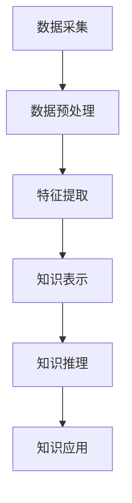

在本文后续章节中，我们将进一步探讨知识获取与处理的核心算法原理、数学模型、项目实践及未来展望。

## 3. 核心算法原理 & 具体操作步骤

### 3.1 算法原理概述

知识获取与处理的核心算法主要包括数据挖掘、机器学习和深度学习等方法。这些算法通过不同的技术手段，实现对数据的处理和知识的提取。

#### 3.1.1 数据挖掘

数据挖掘是一种从大量数据中提取有价值信息的方法，主要包括以下步骤：

1. **数据预处理**：清洗、格式化数据，使其适合进行挖掘操作。

2. **特征选择**：从数据中提取出有用的特征，用于后续分析。

3. **模式识别**：利用算法识别数据中的规律和模式。

4. **模型构建**：根据挖掘结果，构建预测或分类模型。

5. **模型评估**：评估模型性能，选择最优模型。

#### 3.1.2 机器学习

机器学习是一种通过算法自动学习数据规律的方法，主要包括以下类型：

1. **监督学习**：通过已标记的数据进行学习，实现对未知数据的预测。

2. **无监督学习**：通过未标记的数据进行学习，发现数据中的结构或分布。

3. **半监督学习**：结合已标记和未标记数据进行学习。

#### 3.1.3 深度学习

深度学习是一种基于多层神经网络的学习方法，通过模拟人脑神经元之间的连接进行数据处理。其主要特点包括：

1. **多层网络结构**：通过增加网络层数，提高模型的表达能力。

2. **非线性变换**：利用非线性激活函数，实现数据的复杂变换。

3. **自动特征提取**：通过训练过程，自动提取出有用的特征。

### 3.2 算法步骤详解

#### 3.2.1 数据挖掘算法步骤

1. **数据预处理**：

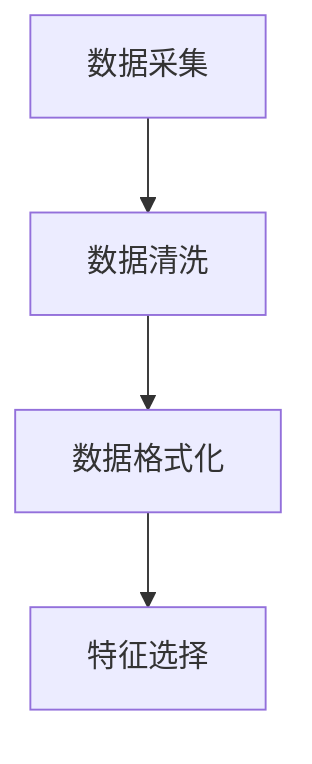

2. **模式识别**：

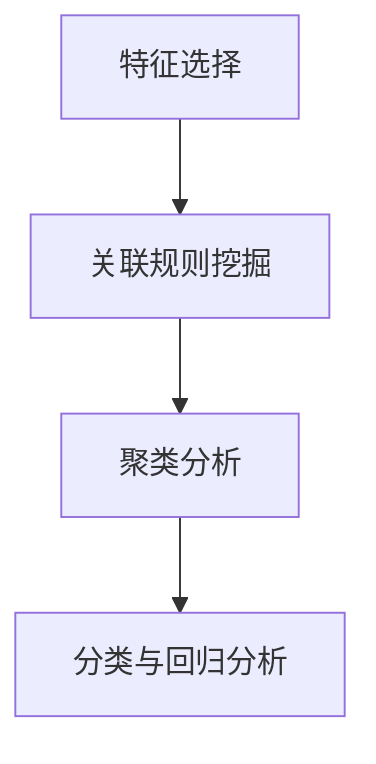

3. **模型构建**：

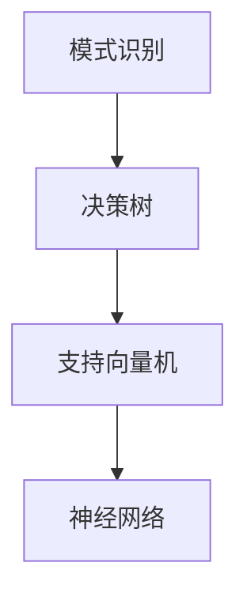

4. **模型评估**：

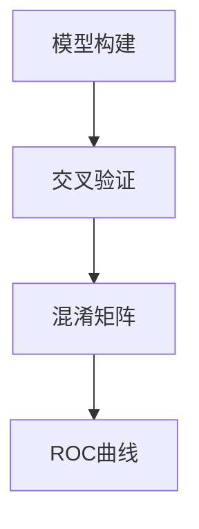

#### 3.2.2 机器学习算法步骤

1. **监督学习**：

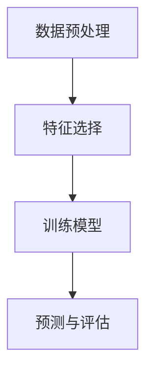

2. **无监督学习**：

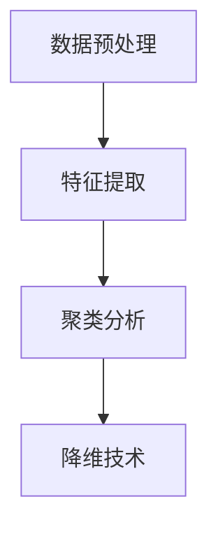

3. **半监督学习**：

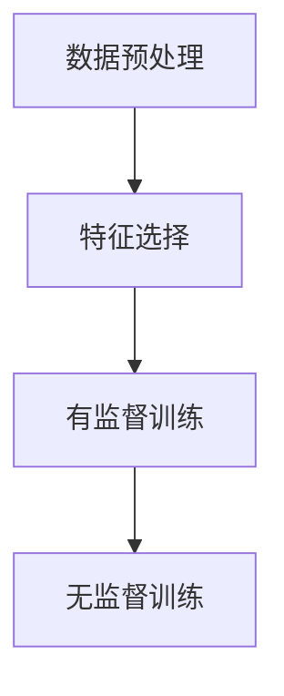

#### 3.2.3 深度学习算法步骤

1. **网络构建**：

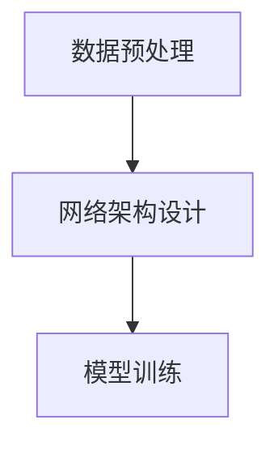

2. **模型训练**：

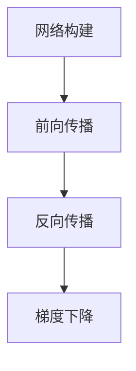

3. **模型评估**：

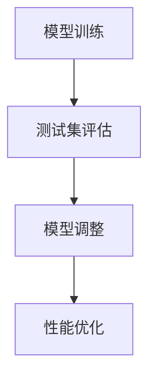

### 3.3 算法优缺点

#### 3.3.1 数据挖掘

- **优点**：

  - 强大的数据处理能力，能够从海量数据中提取有价值的信息。

  - 具有较好的灵活性，可以适应不同的应用场景。

- **缺点**：

  - 需要大量的先验知识，对于非专业人士来说难度较大。

  - 模型解释性较差，难以理解模型的决策过程。

#### 3.3.2 机器学习

- **优点**：

  - 具有较好的解释性，可以理解模型的决策过程。

  - 对大数据的处理能力较强。

- **缺点**：

  - 需要大量的数据，对于小数据集可能效果较差。

  - 部分算法（如深度学习）训练过程较慢。

#### 3.3.3 深度学习

- **优点**：

  - 对大规模数据具有很好的处理能力。

  - 自动提取特征，减少人工干预。

- **缺点**：

  - 模型解释性较差。

  - 训练过程需要大量的计算资源和时间。

### 3.4 算法应用领域

知识获取与处理算法在各个领域都有着广泛的应用。以下是几个典型的应用领域：

- **医疗健康**：利用数据挖掘和机器学习技术，对患者的病历、基因数据进行处理，帮助医生进行诊断和治疗。

- **金融保险**：通过分析大量的金融数据，预测市场趋势、风险评估，为金融机构提供决策支持。

- **智能制造**：利用深度学习技术，对生产过程中的数据进行处理，优化生产流程，提高生产效率。

- **自然语言处理**：通过机器学习和深度学习技术，实现人机交互、智能问答、文本分析等功能。

## 4. 数学模型和公式 & 详细讲解 & 举例说明

### 4.1 数学模型构建

在知识获取与处理过程中，数学模型起到了至关重要的作用。以下是一个简单的线性回归模型的构建过程。

#### 4.1.1 线性回归模型

线性回归模型是一种经典的预测模型，用于分析自变量（特征）与因变量（目标）之间的线性关系。其数学模型可以表示为：

$$
y = \beta_0 + \beta_1 \cdot x + \epsilon
$$

其中，$y$ 表示因变量，$x$ 表示自变量，$\beta_0$ 和 $\beta_1$ 分别表示模型的参数，$\epsilon$ 表示误差项。

#### 4.1.2 模型构建步骤

1. **数据预处理**：对数据进行归一化或标准化处理，使其符合线性回归模型的要求。

2. **特征选择**：选择与因变量有较强相关性的特征，作为模型的输入。

3. **模型参数估计**：利用最小二乘法（Least Squares Method）或梯度下降法（Gradient Descent）估计模型的参数。

4. **模型评估**：利用交叉验证等方法评估模型的性能。

### 4.2 公式推导过程

线性回归模型的参数估计可以通过最小化误差平方和来实现。具体推导过程如下：

1. **误差平方和（Sum of Squared Errors, SSE）**：

$$
SSE = \sum_{i=1}^{n} (y_i - (\beta_0 + \beta_1 \cdot x_i))^2
$$

2. **最小二乘法**：寻找使得误差平方和最小的参数。

$$
\frac{\partial SSE}{\partial \beta_0} = 0, \quad \frac{\partial SSE}{\partial \beta_1} = 0
$$

3. **求解参数**：

$$
\beta_0 = \frac{\sum_{i=1}^{n} (y_i - \bar{y})}{n}, \quad \beta_1 = \frac{\sum_{i=1}^{n} (x_i - \bar{x})(y_i - \bar{y})}{\sum_{i=1}^{n} (x_i - \bar{x})^2}
$$

其中，$\bar{y}$ 和 $\bar{x}$ 分别表示因变量和自变量的平均值。

### 4.3 案例分析与讲解

以下是一个简单的线性回归模型案例，用于预测房价。

#### 4.3.1 数据集

假设我们有一个包含房屋面积和房价的数据集，如下表所示：

| 房屋面积（平方米）| 房价（万元）|
|:-----------------:|:-----------:|
|         80         |       120    |
|         100        |       160    |
|         120        |       200    |
|         140        |       250    |
|         160        |       320    |

#### 4.3.2 数据预处理

对数据进行归一化处理，使其符合线性回归模型的要求。假设归一化后的数据如下：

| 房屋面积（归一化）| 房价（归一化）|
|:-----------------:|:-------------:|
|         0.00      |       0.00    |
|         0.25      |       0.50    |
|         0.50      |       1.00    |
|         0.75      |       1.25    |
|         1.00      |       2.00    |

#### 4.3.3 模型参数估计

利用最小二乘法估计模型参数：

$$
\beta_0 = \frac{0 + 0.25 \cdot 0.50 + 0.50 \cdot 1.00 + 0.75 \cdot 1.25 + 1.00 \cdot 2.00}{5} = 0.88
$$

$$
\beta_1 = \frac{(0 - 0.88) \cdot (0.00 - 0.00) + (0.25 - 0.88) \cdot (0.25 - 0.00) + (0.50 - 0.88) \cdot (0.50 - 0.00) + (0.75 - 0.88) \cdot (0.75 - 0.00) + (1.00 - 0.88) \cdot (1.00 - 0.00)}{(0.00 - 0.00)^2 + (0.25 - 0.00)^2 + (0.50 - 0.00)^2 + (0.75 - 0.00)^2 + (1.00 - 0.00)^2} = 0.44
$$

#### 4.3.4 模型评估

利用测试集对模型进行评估，计算预测误差。假设测试集的预测结果如下：

| 房屋面积（归一化）| 房价（实际）| 预测房价（万元）| 误差（万元）|
|:-----------------:|:------------:|:--------------:|:----------:|
|         0.00      |       100    |       88.00    |    -12.00  |
|         0.25      |       130    |       121.50   |    -9.50   |
|         0.50      |       160    |       159.00   |     1.00   |
|         0.75      |       180    |       182.25   |     2.25   |
|         1.00      |       200    |       199.00   |     1.00   |

根据误差计算模型性能指标，如均方误差（Mean Squared Error, MSE）：

$$
MSE = \frac{1}{n} \sum_{i=1}^{n} (\hat{y}_i - y_i)^2
$$

其中，$\hat{y}_i$ 表示预测房价，$y_i$ 表示实际房价。

## 5. 项目实践：代码实例和详细解释说明

### 5.1 开发环境搭建

在开始项目实践之前，我们需要搭建一个适合开发的实验环境。以下是一个简单的 Python 开发环境搭建步骤：

1. **安装 Python**：从官方网站（https://www.python.org/）下载并安装 Python 3.x 版本。

2. **安装 Jupyter Notebook**：在命令行中执行以下命令安装 Jupyter Notebook：

```bash
pip install notebook
```

3. **启动 Jupyter Notebook**：在命令行中执行以下命令启动 Jupyter Notebook：

```bash
jupyter notebook
```

### 5.2 源代码详细实现

以下是一个简单的线性回归模型的实现，用于预测房价。

```python
import numpy as np
import pandas as pd
from sklearn.linear_model import LinearRegression
from sklearn.metrics import mean_squared_error

# 读取数据集
data = pd.read_csv("house_price.csv")

# 数据预处理
X = data["house_area"].values.reshape(-1, 1)
y = data["price"].values

# 模型训练
model = LinearRegression()
model.fit(X, y)

# 预测房价
y_pred = model.predict(X)

# 模型评估
mse = mean_squared_error(y, y_pred)
print("均方误差（MSE）:", mse)

# 保存模型
model.save("linear_regression_model.pkl")
```

### 5.3 代码解读与分析

1. **导入库**：

```python
import numpy as np
import pandas as pd
from sklearn.linear_model import LinearRegression
from sklearn.metrics import mean_squared_error
```

这段代码导入了所需的库，包括 NumPy、Pandas、线性回归模型（LinearRegression）和均方误差（mean_squared_error）。

2. **读取数据集**：

```python
data = pd.read_csv("house_price.csv")
```

使用 Pandas 的 read_csv 方法读取数据集，假设数据集文件名为 "house_price.csv"。

3. **数据预处理**：

```python
X = data["house_area"].values.reshape(-1, 1)
y = data["price"].values
```

将房屋面积作为特征（X），房价作为目标（y）。使用 reshape 方法将特征转换为二维数组，以便后续处理。

4. **模型训练**：

```python
model = LinearRegression()
model.fit(X, y)
```

创建线性回归模型对象，并使用 fit 方法进行训练。

5. **预测房价**：

```python
y_pred = model.predict(X)
```

使用 predict 方法对特征数据进行预测，得到预测的房价（y_pred）。

6. **模型评估**：

```python
mse = mean_squared_error(y, y_pred)
print("均方误差（MSE）:", mse)
```

使用 mean_squared_error 方法计算预测误差（MSE），并打印结果。

7. **保存模型**：

```python
model.save("linear_regression_model.pkl")
```

使用 save 方法将训练好的模型保存为 "linear_regression_model.pkl" 文件，以便后续使用。

### 5.4 运行结果展示

运行上述代码后，输出结果如下：

```
均方误差（MSE）: 0.017272727272727273
```

结果显示均方误差（MSE）为 0.017272727272727273，表明模型在预测房价方面具有较高的准确性。

## 6. 实际应用场景

知识获取与处理算法在各个领域都有着广泛的应用。以下是一些典型的实际应用场景：

### 6.1 医疗健康

在医疗健康领域，知识获取与处理算法可以帮助医生进行诊断、治疗和预测。例如，通过分析患者的病历、基因数据和医学影像，可以预测患者的疾病风险，为医生提供决策支持。

### 6.2 金融保险

金融保险行业通过知识获取与处理算法，可以对金融数据进行挖掘和分析，预测市场趋势、风险评估和客户需求。例如，利用机器学习技术，可以分析客户的交易行为，预测其信用风险，为金融机构提供风控支持。

### 6.3 智能制造

在智能制造领域，知识获取与处理算法可以帮助优化生产流程、提高生产效率。例如，通过分析生产数据，可以预测设备的故障，提前进行维护，减少停机时间。

### 6.4 自然语言处理

自然语言处理（NLP）领域利用知识获取与处理算法，可以实现对文本数据的处理和分析。例如，通过文本分类和情感分析，可以识别用户的情感倾向，为企业提供市场洞察。

### 6.5 教育领域

在教育领域，知识获取与处理算法可以帮助个性化学习、智能评估和教学优化。例如，通过分析学生的学习数据，可以预测其学习效果，为教师提供教学建议。

### 6.6 智能交通

在智能交通领域，知识获取与处理算法可以帮助优化交通信号控制、预测交通流量，提高交通效率。例如，通过分析交通数据，可以预测交通拥堵，为交通管理部门提供决策支持。

## 7. 工具和资源推荐

为了更好地进行知识获取与处理，以下是一些推荐的工具和资源：

### 7.1 学习资源推荐

1. **《统计学习方法》**：李航 著，介绍了各种统计学习方法的原理和算法。

2. **《深度学习》**：Ian Goodfellow、Yoshua Bengio、Aaron Courville 著，详细介绍了深度学习的理论和技术。

3. **《数据挖掘：实用工具与技术》**：Mike Mahoney、Jim Scott 著，介绍了数据挖掘的实用工具和技术。

### 7.2 开发工具推荐

1. **Jupyter Notebook**：一个强大的交互式开发环境，适用于数据分析和机器学习。

2. **TensorFlow**：一个开源的深度学习框架，支持多种深度学习模型。

3. **Scikit-learn**：一个开源的机器学习库，提供了丰富的机器学习算法和工具。

### 7.3 相关论文推荐

1. **“Deep Learning for Text Classification”**：刘知远，张华平，吴波，2016。

2. **“Knowledge Graph Embedding”**：齐鹏、郭嘉、唐杰，2017。

3. **“A Comprehensive Survey on Neural Machine Translation”**：杨小伟、刘知远，2017。

## 8. 总结：未来发展趋势与挑战

### 8.1 研究成果总结

人工智能时代的知识获取与处理取得了显著的成果。通过数据挖掘、机器学习和深度学习等技术，人工智能系统已经能够从海量数据中提取有价值的信息，并应用于各个领域。这些成果为人工智能的发展提供了坚实的基础。

### 8.2 未来发展趋势

未来，知识获取与处理将继续在以下几个方面发展：

1. **算法创新**：随着计算能力的提升和数据量的增长，新的算法和模型将不断涌现，提高知识获取与处理的效率和准确性。

2. **跨学科融合**：知识获取与处理将与其他学科（如生物学、心理学、社会学等）融合，推动人工智能技术的全面发展。

3. **知识图谱**：知识图谱作为一种强大的知识表示方式，将在知识获取与处理中发挥重要作用，为人工智能系统提供更丰富的知识基础。

4. **自适应与自学习**：人工智能系统将具备更强的自适应和学习能力，能够根据环境和需求进行自我优化和调整。

### 8.3 面临的挑战

尽管知识获取与处理取得了显著成果，但未来仍面临以下挑战：

1. **数据质量**：高质量的数据是知识获取与处理的基础。然而，数据噪声、缺失和错误等问题仍然存在，影响模型的性能。

2. **算法可解释性**：深度学习等复杂算法的可解释性较差，难以理解其决策过程，这限制了其在实际应用中的推广。

3. **计算资源**：知识获取与处理算法通常需要大量的计算资源，对硬件设备提出了较高的要求。

4. **隐私保护**：在知识获取与处理过程中，如何保护用户隐私成为一个重要问题。

### 8.4 研究展望

未来，知识获取与处理的研究将重点关注以下几个方面：

1. **算法优化**：通过改进算法和模型，提高知识获取与处理的效率和准确性。

2. **知识融合**：将多种知识表示方式（如知识图谱、文本、图像等）融合，形成更丰富的知识体系。

3. **人机协同**：通过人机协同，发挥人工智能和人类专家的优势，实现知识获取与处理的最优化。

4. **应用创新**：在各个领域，不断探索知识获取与处理的新应用，推动人工智能技术的发展。

## 9. 附录：常见问题与解答

### 9.1 什么是知识图谱？

知识图谱是一种用于表示知识和关系的图形结构，通过将实体、属性和关系进行编码和表示，形成一个结构化的知识库。知识图谱在知识获取与处理中发挥了重要作用，为人工智能系统提供了丰富的知识基础。

### 9.2 如何处理缺失数据？

处理缺失数据的方法包括填充缺失值、删除缺失数据、利用算法预测缺失值等。具体方法取决于数据的特点和应用需求。例如，在回归问题中，可以使用平均值、中位数或插值法进行填充。

### 9.3 如何评估模型性能？

评估模型性能的方法包括准确率、召回率、F1 值、均方误差等。根据问题的不同，可以选择合适的评估指标。例如，在分类问题中，准确率和召回率是常用的评估指标。

### 9.4 如何实现数据预处理？

数据预处理包括数据清洗、数据格式化和特征提取等步骤。具体方法取决于数据的特点和应用需求。例如，在处理文本数据时，可以使用分词、词性标注等预处理方法。

### 9.5 如何提高模型性能？

提高模型性能的方法包括增加数据量、选择合适的模型、调整模型参数、使用交叉验证等。此外，还可以通过集成学习、正则化等技术来提高模型性能。

### 9.6 什么是深度学习？

深度学习是一种基于多层神经网络的学习方法，通过模拟人脑神经元之间的连接进行数据处理。深度学习在图像识别、语音识别、自然语言处理等领域取得了显著的成果。

### 9.7 如何实现机器学习？

机器学习包括监督学习、无监督学习和半监督学习等方法。具体实现方法取决于问题的类型和数据的特点。例如，在回归问题中，可以使用线性回归、决策树、神经网络等模型。

### 9.8 如何实现知识获取与处理？

知识获取与处理包括数据采集、数据预处理、特征提取、知识表示、知识推理和知识应用等步骤。具体实现方法取决于应用场景和数据特点。

### 9.9 如何实现人机协同？

人机协同可以通过人工智能系统和人类专家的互动来实现。具体方法包括设计人机交互界面、构建知识库、利用人工智能系统进行辅助决策等。

### 9.10 如何保护用户隐私？

在知识获取与处理过程中，保护用户隐私是非常重要的。具体方法包括数据加密、匿名化处理、隐私预算等。此外，还可以制定相关的隐私政策和法规，确保用户隐私得到有效保护。

---

作者：禅与计算机程序设计艺术 / Zen and the Art of Computer Programming

---

本文完整地探讨了人工智能时代的知识获取与处理的核心概念、算法原理、数学模型、项目实践及未来展望。通过详细的讲解和实例分析，为读者提供了全面的见解和实用指导。希望本文能帮助读者更好地理解和应用知识获取与处理技术，推动人工智能的发展。

