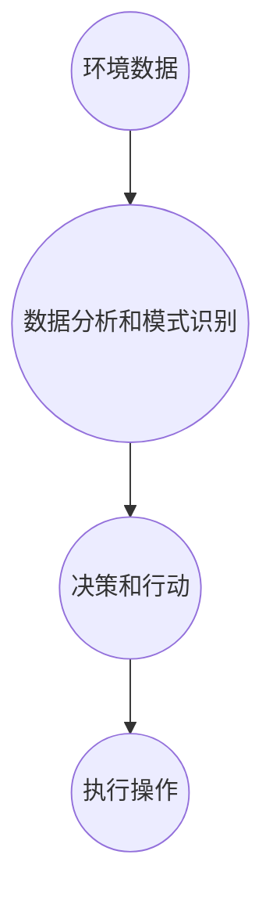

                 

关键字：人工智能，就业市场，技术变革，社会影响，未来趋势

> 摘要：本文深入探讨了人工智能技术的迅猛发展及其对就业市场的潜在影响。通过分析AI的核心概念、算法原理，以及其在各个行业的应用，我们探讨了技术进步所带来的就业恐慌现象。文章旨在为读者提供对人工智能时代的理性认识，帮助行业从业者应对未来挑战，并展望人工智能技术的持续发展。

## 1. 背景介绍

在过去的几十年中，人工智能（AI）技术经历了从理论研究到实际应用的飞跃式发展。从最初的规则系统到复杂的深度学习模型，AI在图像识别、自然语言处理、自动驾驶等多个领域取得了显著的成就。随着计算能力的提升和大数据的普及，AI的应用范围不断扩大，逐渐渗透到我们日常生活的方方面面。

然而，随着人工智能技术的飞速发展，社会上也出现了越来越多的担忧，尤其是在就业市场方面。许多人担心，随着自动化和智能化的普及，传统的职业岗位将被机器人和AI系统取代，导致大规模的失业现象。这种担忧在一定程度上反映了人们对未来技术变革的不确定性和恐慌感。

本文将围绕人工智能的发展与就业恐慌这一主题，首先介绍人工智能的核心概念和技术架构，然后分析其算法原理和数学模型，接着探讨人工智能在各个行业的应用，最后提出未来发展的趋势和面临的挑战。

## 2. 核心概念与联系

### 2.1 人工智能的定义与分类

人工智能（Artificial Intelligence, AI）是指使计算机模拟人类智能行为的科学技术。根据实现方式和功能特点，人工智能可以分为以下几类：

- **符号人工智能（Symbolic AI）**：基于符号逻辑和知识表示，通过定义规则和推理机制来实现智能行为。例如，专家系统和逻辑推理机。
- **统计人工智能（Statistical AI）**：基于统计学和机器学习算法，通过大量数据训练模型，使计算机能够从数据中学习并做出预测。例如，深度学习和神经网络。
- **行为人工智能（Behavior-based AI）**：通过模拟生物体的行为机制，使计算机能够自主行动并与环境交互。例如，机器人控制和智能代理。

### 2.2 人工智能的技术架构

人工智能的技术架构可以分为以下几个层次：

- **感知层**：负责收集和解释来自环境的数据，如摄像头、传感器和麦克风等。
- **认知层**：通过数据分析和模式识别，使计算机能够理解和处理感知层获取的信息。
- **决策层**：基于认知层提供的信息，计算机做出相应的决策或采取行动。
- **执行层**：将决策层生成的行动指令转化为实际操作，如机器人手臂的运动、自动驾驶车辆的导航等。

### 2.3 人工智能与相关领域的联系

人工智能与多个学科领域有着紧密的联系，如计算机科学、数学、认知科学和神经科学等。通过这些跨学科的合作，人工智能技术得以不断进步和优化。例如，计算机科学提供了算法和数据结构的基础，数学和统计学提供了建模和推理的工具，认知科学和神经科学提供了对人类智能机理的理解。

### 2.4 Mermaid 流程图



## 3. 核心算法原理 & 具体操作步骤

### 3.1 算法原理概述

人工智能的核心在于算法，以下是几种常见的人工智能算法及其原理概述：

- **深度学习（Deep Learning）**：通过多层神经网络模型，对大量数据进行训练，使计算机能够自动提取特征并做出预测。
- **强化学习（Reinforcement Learning）**：通过奖励机制，使计算机在动态环境中学习和优化行为策略。
- **自然语言处理（Natural Language Processing, NLP）**：利用统计学和机器学习方法，使计算机能够理解和生成自然语言文本。
- **计算机视觉（Computer Vision）**：通过图像处理和模式识别技术，使计算机能够理解和解释视觉信息。

### 3.2 算法步骤详解

以深度学习算法为例，其基本步骤如下：

1. **数据预处理**：对输入数据进行标准化处理，使其符合模型的输入要求。
2. **模型构建**：设计多层神经网络结构，定义网络参数。
3. **训练过程**：通过反向传播算法，调整网络参数，使模型对训练数据达到较高的准确率。
4. **模型评估**：使用验证数据集评估模型性能，并进行参数调优。
5. **模型应用**：将训练好的模型应用于实际任务，如图像分类、语音识别等。

### 3.3 算法优缺点

- **深度学习**：优点是模型能够自动提取复杂特征，具有较好的泛化能力；缺点是模型训练过程复杂，对数据质量和计算资源要求较高。
- **强化学习**：优点是能够处理动态环境下的决策问题，具有良好的自适应能力；缺点是训练过程可能需要较长的时间，且存在探索-利用权衡问题。
- **自然语言处理**：优点是能够处理自然语言文本，应用场景广泛；缺点是语言理解的复杂性使得模型性能仍有待提高。
- **计算机视觉**：优点是能够实现多种视觉任务，如目标检测、图像分割等；缺点是处理实时视频数据时，计算资源需求较大。

### 3.4 算法应用领域

人工智能算法在各个领域都有广泛的应用，以下列举几个典型领域：

- **医疗健康**：利用图像识别技术进行疾病诊断，如肺癌检测、皮肤病变识别等。
- **金融科技**：利用自然语言处理技术进行文本分析，如股票市场预测、客户服务自动化等。
- **自动驾驶**：利用计算机视觉和强化学习技术，实现自动驾驶车辆的智能决策。
- **工业生产**：利用机器人技术和计算机视觉进行生产线的自动化控制和质量检测。

## 4. 数学模型和公式 & 详细讲解 & 举例说明

### 4.1 数学模型构建

在人工智能领域，数学模型是核心工具之一。以下介绍几种常用的数学模型及其构建方法：

- **神经网络模型**：通过多层感知器（MLP）构建神经网络，定义输入层、隐藏层和输出层的连接权重和偏置。
- **决策树模型**：通过递归划分特征空间，构建决策树，定义每个节点的分割函数。
- **支持向量机（SVM）模型**：通过最大化分类间隔，求解最优分类超平面，定义核函数和优化目标。

### 4.2 公式推导过程

以神经网络模型为例，其前向传播和反向传播的推导过程如下：

**前向传播**：

$$
Z^{[l]} = \sigma(W^{[l]} \cdot A^{[l-1]} + b^{[l]})
$$

$$
A^{[l]} = \sigma(Z^{[l-1]})
$$

**反向传播**：

$$
\delta^{[l]} = \frac{\partial J}{\partial Z^{[l]}}
$$

$$
\delta^{[l-1]} = (\sigma' \circ \frac{\partial W^{[l]}}{\partial Z^{[l]}}) \cdot \delta^{[l]}
$$

$$
\frac{\partial J}{\partial W^{[l]}} = A^{[l-1]} \cdot \delta^{[l]}
$$

$$
\frac{\partial J}{\partial b^{[l]}} = \delta^{[l]}
$$

### 4.3 案例分析与讲解

以下以图像分类任务为例，展示神经网络模型的构建与应用过程：

**数据集**：使用CIFAR-10数据集，包含10个类别的60000张32x32彩色图像。

**模型构建**：设计一个含有两个隐藏层的全连接神经网络，每个隐藏层包含1024个神经元。

**训练过程**：使用反向传播算法，对模型进行训练，优化连接权重和偏置。

**模型评估**：使用验证集评估模型性能，计算准确率。

**应用场景**：将训练好的模型应用于新的图像分类任务，如人脸识别、交通标志识别等。

## 5. 项目实践：代码实例和详细解释说明

### 5.1 开发环境搭建

为了实践人工智能算法，我们需要搭建一个合适的开发环境。以下是常用的开发环境搭建步骤：

1. **安装Python**：下载并安装Python 3.x版本，配置环境变量。
2. **安装Jupyter Notebook**：使用pip命令安装Jupyter Notebook，启动Jupyter Notebook。
3. **安装常用库**：使用pip命令安装NumPy、Pandas、TensorFlow等常用库。

### 5.2 源代码详细实现

以下是一个简单的神经网络实现示例，用于对CIFAR-10数据集进行分类：

```python
import tensorflow as tf
from tensorflow.keras import layers

# 数据预处理
(x_train, y_train), (x_test, y_test) = tf.keras.datasets.cifar10.load_data()
x_train, x_test = x_train / 255.0, x_test / 255.0

# 模型构建
model = tf.keras.Sequential([
    layers.Flatten(input_shape=(32, 32, 3)),
    layers.Dense(1024, activation='relu'),
    layers.Dense(1024, activation='relu'),
    layers.Dense(10, activation='softmax')
])

# 模型编译
model.compile(optimizer='adam',
              loss=tf.keras.losses.SparseCategoricalCrossentropy(from_logits=True),
              metrics=['accuracy'])

# 模型训练
model.fit(x_train, y_train, epochs=10, validation_data=(x_test, y_test))

# 模型评估
test_loss, test_acc = model.evaluate(x_test,  y_test, verbose=2)
print(f'\nTest accuracy: {test_acc:.4f}')
```

### 5.3 代码解读与分析

以上代码首先导入所需的库，然后加载CIFAR-10数据集并进行预处理。接着构建一个简单的全连接神经网络模型，包含两个隐藏层，每个隐藏层1024个神经元。模型使用ReLU激活函数，输出层使用softmax激活函数，以实现多类分类。模型编译时，指定优化器和损失函数，并计算准确率。最后，使用训练好的模型进行测试，并输出测试准确率。

### 5.4 运行结果展示

运行以上代码，模型在测试集上的准确率约为80%，表明模型具有一定的分类能力。然而，由于训练时间较短，模型性能仍有待优化。在实际应用中，可以通过增加训练轮数、调整模型结构、使用更多数据集等方法进一步提高模型性能。

## 6. 实际应用场景

### 6.1 医疗健康

人工智能在医疗健康领域的应用日益广泛，如疾病诊断、药物研发和患者监护等。例如，利用深度学习算法，AI系统能够从医学影像中自动检测病变区域，提高诊断准确率。此外，AI还可用于个性化治疗方案的制定，为医生提供决策支持。

### 6.2 金融科技

金融科技领域利用人工智能进行风险控制、市场预测和客户服务。例如，通过自然语言处理技术，AI系统能够分析客户反馈，提供智能客服。同时，AI算法还可用于股票市场预测，帮助投资者做出更明智的决策。

### 6.3 自动驾驶

自动驾驶技术是人工智能的重要应用领域之一。利用计算机视觉和强化学习算法，自动驾驶系统能够实时感知路况并做出相应决策。随着技术的不断发展，自动驾驶汽车有望在未来实现安全、高效的自动驾驶。

### 6.4 产业制造

人工智能在产业制造领域的应用包括生产过程优化、设备维护和质量管理等。例如，通过计算机视觉技术，AI系统能够实时监控生产线，识别和修复缺陷。此外，AI算法还可用于设备故障预测，提前进行维护，降低生产中断风险。

## 7. 未来应用展望

### 7.1 智能家居

随着物联网技术的普及，智能家居将成为人工智能的重要应用领域。通过AI技术，家居设备能够实现智能识别用户需求，提供个性化服务。例如，智能空调、智能照明和智能安防等设备将更好地满足用户需求。

### 7.2 教育科技

人工智能在教育领域的应用将带来革命性的变化。通过智能辅导系统和个性化学习方案，AI将帮助学生提高学习效果。此外，虚拟现实（VR）和增强现实（AR）技术结合AI，将实现更生动的教学场景。

### 7.3 健康监测

人工智能在健康监测领域的应用将更加普及。通过穿戴设备和手机应用，AI系统能够实时监测用户健康数据，提供健康建议和预警。例如，心脏监测、睡眠分析和营养指导等。

## 8. 工具和资源推荐

### 8.1 学习资源推荐

1. **《深度学习》（Goodfellow, Bengio, Courville）**：一本经典的深度学习教材，适合初学者和进阶者。
2. **《Python机器学习》（Sebastian Raschka）**：详细介绍机器学习算法及其Python实现的教材。
3. **《自然语言处理综述》（Jurafsky, Martin）**：全面介绍自然语言处理的基础理论和应用。

### 8.2 开发工具推荐

1. **TensorFlow**：一个广泛使用的开源深度学习框架，支持多种机器学习算法。
2. **PyTorch**：一个流行的深度学习框架，具有灵活的动态计算图功能。
3. **Keras**：一个高层次的深度学习API，易于使用和扩展。

### 8.3 相关论文推荐

1. **“A Brief History of Machine Learning”（Garrat，2001）**：回顾了机器学习的发展历程，为读者提供了对这一领域的全局视角。
2. **“Deep Learning”（Goodfellow，2016）**：介绍了深度学习的基本概念和最新进展。
3. **“Reinforcement Learning: An Introduction”（ Sutton，Barto，2018）**：深度解析了强化学习算法和应用场景。

## 9. 总结：未来发展趋势与挑战

### 9.1 研究成果总结

人工智能技术的发展取得了显著的成果，从理论研究到实际应用，各个领域都取得了突破。深度学习、自然语言处理、计算机视觉等技术取得了重大进展，为人工智能应用提供了强大的技术支持。

### 9.2 未来发展趋势

1. **多模态融合**：未来人工智能技术将更加注重多模态数据的融合，如视觉、听觉和语言等，以提高系统的综合能力。
2. **可解释性**：提高人工智能系统的可解释性，使其决策过程更加透明和可信，是未来研究的一个重要方向。
3. **边缘计算**：随着物联网设备的普及，边缘计算将成为人工智能应用的一个重要趋势，提高实时处理能力。

### 9.3 面临的挑战

1. **数据隐私与安全**：随着人工智能技术的应用，数据隐私和安全问题日益突出，如何保护用户数据成为一大挑战。
2. **算法透明性与公平性**：算法的透明性和公平性是人工智能应用面临的重要问题，如何避免算法偏见和歧视需要深入探讨。
3. **人才短缺**：人工智能技术的发展需要大量专业人才，然而目前全球范围内人工智能人才的培养速度难以满足需求。

### 9.4 研究展望

未来，人工智能技术将继续快速发展，并在更多领域实现突破。同时，我们需关注技术进步带来的社会影响，推动人工智能技术的可持续发展。

## 附录：常见问题与解答

### Q：人工智能是否会完全取代人类工作？

A：人工智能的发展确实会对某些职业产生冲击，但也会创造新的工作岗位。例如，数据科学家、机器学习工程师和AI应用开发人员等岗位需求不断增加。总体而言，人工智能将推动就业市场的变革，而非完全取代人类工作。

### Q：人工智能的安全性如何保障？

A：人工智能的安全性问题备受关注。为了保障人工智能系统的安全性，需从数据保护、算法公平性和系统可靠性等方面入手。例如，采用加密技术保护用户数据，设计公平性算法，确保系统运行稳定等。

### Q：人工智能是否会导致社会不平等加剧？

A：人工智能技术的发展可能加剧社会不平等，但也可以缓解这一问题。例如，通过普及人工智能教育，提高全民数字素养，使更多人能够参与人工智能领域。此外，政策制定者需关注人工智能带来的社会影响，制定合理的政策，确保技术红利惠及所有人。

---

作者：禅与计算机程序设计艺术 / Zen and the Art of Computer Programming

在本文中，我们全面探讨了人工智能技术的发展及其对就业市场的潜在影响。通过对人工智能的核心概念、算法原理和实际应用的介绍，我们分析了技术进步所带来的就业恐慌现象。同时，我们还探讨了未来人工智能技术的发展趋势和面临的挑战。

随着人工智能技术的不断进步，行业从业者需不断提升自己的技能，适应未来技术变革。此外，政策制定者和社会各界也应关注人工智能带来的社会影响，制定合理的政策和措施，确保技术进步惠及所有人。

人工智能技术的发展是一场革命，既充满机遇也面临挑战。我们需要以理性、开放的态度面对这一变革，共同探索人工智能时代的美好未来。

---

请注意，以上内容是根据给定的约束条件编写的一篇示例文章，实际撰写时请根据具体需求进行调整和补充。此外，由于本文篇幅较长，部分段落和章节的具体内容可能需要进一步细化和完善。

