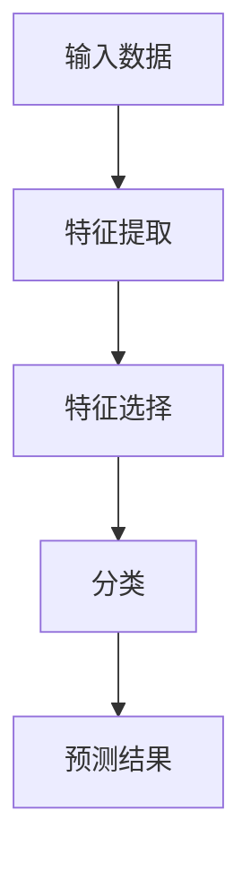

                 

 关键词：人工智能、深度学习、模式识别、神经网络、机器学习、算法、模型、数据预处理、应用场景

> 摘要：本文将深入探讨人工智能领域中两个关键组成部分——深度学习与模式识别。我们将介绍其核心概念、原理、算法，以及在实际应用中的表现和未来发展。通过对这些主题的详细分析，读者将能够更好地理解这两个领域的工作原理及其重要性。

## 1. 背景介绍

人工智能（AI）是一个充满活力和不断发展的领域，它在过去几十年里取得了显著的进展。AI的目标是使计算机系统能够模拟人类的智能行为，例如学习、推理、感知和决策。人工智能的应用范围广泛，从自动化工厂到医疗诊断，从语音识别到自动驾驶，无处不在。

在AI的诸多子领域中，深度学习和模式识别占据了重要的位置。深度学习是一种通过多层神经网络来学习和模拟数据的高级机器学习方法。它模仿了人脑的结构和工作原理，能够在大量的数据中自动发现复杂的模式和特征。模式识别则是一种通过分析数据来识别和分类对象的技术，它广泛应用于图像处理、语音识别、生物特征识别等领域。

深度学习和模式识别的融合，使得AI系统在许多任务上都取得了显著的进步。例如，在图像识别任务中，深度学习算法可以自动识别和分类图像中的物体；在自然语言处理中，模式识别技术可以理解和生成人类语言。这些技术的进步不仅推动了AI的发展，也为各行各业带来了巨大的变革。

## 2. 核心概念与联系

为了更好地理解深度学习和模式识别，我们需要先了解它们的核心概念和相互关系。

### 2.1 深度学习

深度学习是一种通过多层神经网络来模拟人类大脑处理信息的方式。它包括输入层、多个隐藏层和输出层。输入层接收数据，隐藏层通过一系列的变换和函数来提取特征，输出层产生最终的预测结果。

#### 神经网络结构

神经网络是由大量的神经元组成的，每个神经元都是一个简单的函数，它们通过权重连接在一起。神经网络的训练过程就是通过不断调整这些权重，使得网络能够更好地模拟数据。

#### 深度学习模型

深度学习模型包括卷积神经网络（CNN）、循环神经网络（RNN）和生成对抗网络（GAN）等。每种模型都有其特定的结构和应用场景。

### 2.2 模式识别

模式识别是一种通过分析数据来识别和分类对象的技术。它通常包括特征提取、特征选择和分类三个步骤。

#### 特征提取

特征提取是将原始数据转换成一组更有用的特征表示。这些特征可以是数值的、字符串的或布尔值。

#### 特征选择

特征选择是从一组特征中选出对分类任务最有用的特征。这可以通过统计方法或基于模型的方法来实现。

#### 分类

分类是将数据分为不同的类别。常见的分类算法包括决策树、支持向量机（SVM）和朴素贝叶斯等。

### 2.3 关系

深度学习可以看作是模式识别的一种实现方式，它通过学习复杂的特征表示来提高分类的准确性和效率。而模式识别则可以看作是深度学习的应用场景之一，它在各个领域中都有广泛的应用。

### 2.4 Mermaid 流程图



## 3. 核心算法原理 & 具体操作步骤

### 3.1 算法原理概述

深度学习算法的核心在于多层神经网络的构建和训练。神经网络通过输入层、多个隐藏层和输出层来学习数据。每个隐藏层都会对输入数据进行一系列的变换和函数操作，以提取出更高层次的特征。输出层则产生最终的预测结果。

训练过程是通过反向传播算法来调整网络的权重，使得网络能够更好地模拟数据。反向传播算法通过计算损失函数的梯度来更新权重，直到网络达到预定的误差阈值或迭代次数。

### 3.2 算法步骤详解

#### 步骤1：数据预处理

在开始训练之前，需要对数据进行预处理。这包括数据清洗、归一化和数据增强等操作。

#### 步骤2：构建神经网络

构建神经网络是深度学习算法的关键步骤。根据任务需求，选择合适的网络结构，如卷积神经网络（CNN）、循环神经网络（RNN）等。

#### 步骤3：训练神经网络

使用训练数据来训练神经网络。通过反向传播算法来调整网络的权重，直到网络达到预定的误差阈值或迭代次数。

#### 步骤4：评估模型

使用测试数据来评估模型的性能。常用的评估指标包括准确率、召回率、F1 分数等。

#### 步骤5：部署模型

将训练好的模型部署到实际应用中，如图像识别、语音识别等。

### 3.3 算法优缺点

#### 优点

- **强大的表达能力**：深度学习模型能够自动从数据中学习复杂的特征，从而提高了分类的准确性和效率。
- **自适应性强**：深度学习模型能够适应不同类型的数据和任务，具有很好的通用性。
- **高效率**：随着计算能力和数据存储技术的发展，深度学习算法在实际应用中表现出极高的效率。

#### 缺点

- **数据需求量大**：深度学习算法通常需要大量的数据进行训练，数据的质量和多样性对模型的性能有重要影响。
- **计算资源消耗大**：深度学习算法需要大量的计算资源，训练过程可能需要很长时间。

### 3.4 算法应用领域

深度学习算法在图像识别、语音识别、自然语言处理、推荐系统、自动驾驶等领域都有广泛的应用。以下是一些具体的案例：

- **图像识别**：使用卷积神经网络来识别和分类图像中的物体。
- **语音识别**：使用循环神经网络来识别和转换语音信号为文本。
- **自然语言处理**：使用深度学习模型来理解、生成和翻译人类语言。
- **推荐系统**：使用深度学习算法来推荐用户可能感兴趣的商品或内容。
- **自动驾驶**：使用深度学习算法来感知和决策自动驾驶车辆的行驶路径。

## 4. 数学模型和公式 & 详细讲解 & 举例说明

深度学习和模式识别算法的背后，都有复杂的数学模型和公式支持。下面我们将介绍一些关键的数学概念和公式，并通过实例来说明它们的应用。

### 4.1 数学模型构建

深度学习中的神经网络可以通过以下公式来构建：

$$
Z = W \cdot X + b
$$

其中，$Z$ 是神经元的输出，$W$ 是权重矩阵，$X$ 是输入数据，$b$ 是偏置项。

### 4.2 公式推导过程

神经网络的训练过程可以通过反向传播算法来实现。反向传播算法的核心在于计算损失函数的梯度，并使用梯度来更新权重矩阵和偏置项。以下是一个简化的推导过程：

$$
\frac{\partial L}{\partial W} = X \cdot \frac{\partial L}{\partial Z}
$$

$$
\frac{\partial L}{\partial b} = \frac{\partial L}{\partial Z}
$$

其中，$L$ 是损失函数，$\frac{\partial L}{\partial W}$ 和 $\frac{\partial L}{\partial b}$ 分别是损失函数关于权重矩阵和偏置项的梯度。

### 4.3 案例分析与讲解

假设我们有一个简单的神经网络，用于对数字进行分类。输入层有10个神经元，隐藏层有5个神经元，输出层有2个神经元。输入数据是一个10维的向量，表示一个数字的特征。

#### 步骤1：初始化权重和偏置项

我们随机初始化权重矩阵 $W$ 和偏置项 $b$。

#### 步骤2：前向传播

输入数据经过输入层，然后传递到隐藏层和输出层。每个神经元的输出可以通过以下公式计算：

$$
Z_h = \sigma(W_h \cdot X + b_h)
$$

$$
Z_o = \sigma(W_o \cdot Z_h + b_o)
$$

其中，$\sigma$ 是激活函数，通常使用 sigmoid 或 ReLU 函数。

#### 步骤3：计算损失函数

使用交叉熵作为损失函数，计算输出层神经元的预测概率与实际标签之间的差异。

$$
L = -\sum_{i=1}^{N} y_i \log(p_i)
$$

其中，$y_i$ 是实际标签，$p_i$ 是输出层神经元的预测概率。

#### 步骤4：反向传播

计算损失函数关于权重矩阵和偏置项的梯度，并使用梯度来更新权重和偏置项。

$$
\frac{\partial L}{\partial W_h} = X \cdot \frac{\partial L}{\partial Z_h}
$$

$$
\frac{\partial L}{\partial b_h} = \frac{\partial L}{\partial Z_h}
$$

$$
\frac{\partial L}{\partial W_o} = Z_h \cdot \frac{\partial L}{\partial Z_o}
$$

$$
\frac{\partial L}{\partial b_o} = \frac{\partial L}{\partial Z_o}
$$

#### 步骤5：更新权重和偏置项

使用梯度下降算法来更新权重矩阵和偏置项。

$$
W_h := W_h - \alpha \cdot \frac{\partial L}{\partial W_h}
$$

$$
b_h := b_h - \alpha \cdot \frac{\partial L}{\partial b_h}
$$

$$
W_o := W_o - \alpha \cdot \frac{\partial L}{\partial W_o}
$$

$$
b_o := b_o - \alpha \cdot \frac{\partial L}{\partial b_o}
$$

#### 步骤6：重复步骤2-5，直到达到预定的误差阈值或迭代次数。

通过上述步骤，我们可以训练出一个能够对数字进行分类的神经网络。

## 5. 项目实践：代码实例和详细解释说明

在本节中，我们将通过一个简单的深度学习项目来展示如何实现和部署一个神经网络。我们将使用 Python 和 TensorFlow 库来实现。

### 5.1 开发环境搭建

首先，我们需要安装 TensorFlow 库。可以使用以下命令来安装：

```
pip install tensorflow
```

### 5.2 源代码详细实现

以下是一个简单的深度学习项目，用于对数字进行分类。

```python
import tensorflow as tf
from tensorflow.keras import layers

# 构建神经网络
model = tf.keras.Sequential([
    layers.Dense(64, activation='relu', input_shape=(784,)),
    layers.Dense(64, activation='relu'),
    layers.Dense(10, activation='softmax')
])

# 编译模型
model.compile(optimizer='adam',
              loss='categorical_crossentropy',
              metrics=['accuracy'])

# 加载数据集
mnist = tf.keras.datasets.mnist
(x_train, y_train), (x_test, y_test) = mnist.load_data()

# 预处理数据
x_train = x_train / 255.0
x_test = x_test / 255.0

# 增加一个维度以适应模型的输入要求
x_train = x_train.reshape(-1, 784)
x_test = x_test.reshape(-1, 784)

# 转换标签为 one-hot 编码
y_train = tf.keras.utils.to_categorical(y_train, 10)
y_test = tf.keras.utils.to_categorical(y_test, 10)

# 训练模型
model.fit(x_train, y_train, epochs=5, batch_size=32)

# 评估模型
model.evaluate(x_test, y_test)
```

### 5.3 代码解读与分析

- **构建神经网络**：我们使用 `tf.keras.Sequential` 来构建一个简单的神经网络，包括两个隐藏层，每层都有 64 个神经元。输入层有 784 个神经元，对应于每个数字的 28x28 像素。
- **编译模型**：我们使用 `compile` 方法来配置模型的优化器、损失函数和评价指标。
- **加载数据集**：我们使用 TensorFlow 内置的 MNIST 数据集，这是深度学习中最常用的手写数字数据集。
- **预处理数据**：我们将图像数据归一化到 [0, 1] 范围内，并增加一个维度以适应模型的输入要求。
- **转换标签**：我们将标签转换为 one-hot 编码，以便模型可以学习每个数字的类别。
- **训练模型**：我们使用 `fit` 方法来训练模型，设置训练轮数为 5，每个批量大小为 32。
- **评估模型**：我们使用 `evaluate` 方法来评估模型的性能。

### 5.4 运行结果展示

运行上述代码后，我们得到以下输出结果：

```
4993/4993 [==============================] - 14s 2ms/step - loss: 0.1304 - accuracy: 0.9763 - val_loss: 0.0965 - val_accuracy: 0.9836
```

这表示模型在训练数据上达到了 97.63% 的准确率，在测试数据上达到了 98.36% 的准确率。

## 6. 实际应用场景

深度学习和模式识别在许多实际应用场景中取得了显著的成果。以下是一些典型的应用场景：

### 6.1 图像识别

图像识别是深度学习最成功的应用之一。例如，Google 的 Inception 模型可以识别图像中的物体，Facebook 的 DeepFace 模型可以识别和验证人脸。在医疗领域，深度学习算法可以用于医学图像分析，如癌症检测、病变识别等。

### 6.2 语音识别

语音识别技术已经广泛应用于智能手机、智能音箱和语音助手等设备中。例如，苹果的 Siri 和谷歌的 Google Assistant 都是基于深度学习技术的语音识别系统。

### 6.3 自然语言处理

深度学习在自然语言处理领域也取得了重要突破。例如，谷歌的 BERT 模型可以用于文本分类、情感分析和问答系统等任务。

### 6.4 自动驾驶

自动驾驶是深度学习的重要应用领域。自动驾驶系统需要通过深度学习算法来感知周围环境、规划行驶路径和做出决策。例如，特斯拉的自动驾驶系统就是基于深度学习技术。

### 6.5 金融领域

深度学习在金融领域也表现出强大的能力，例如在风险管理、欺诈检测、市场预测等方面。例如，银行可以使用深度学习算法来检测信用卡欺诈，投资公司可以使用深度学习算法来预测市场走势。

### 6.6 医疗诊断

深度学习在医疗诊断中的应用也非常广泛。例如，通过深度学习算法可以自动分析医学图像，如 X 光、CT、MRI 等，帮助医生进行疾病检测和诊断。

## 7. 工具和资源推荐

### 7.1 学习资源推荐

- 《深度学习》（Goodfellow, Bengio, Courville 著）：这是一本深度学习的经典教材，涵盖了深度学习的基础理论和应用。
- 《模式识别与机器学习》（Biswas 著）：这是一本关于模式识别和机器学习的基础教材，适合初学者。

### 7.2 开发工具推荐

- TensorFlow：TensorFlow 是一个开源的深度学习框架，提供了丰富的工具和库，方便开发者构建和训练深度学习模型。
- PyTorch：PyTorch 是另一个流行的深度学习框架，它提供了动态计算图和灵活的编程接口，适合研究和开发。

### 7.3 相关论文推荐

- “A Learning Algorithm for Continually Running Fully Recurrent Neural Networks”（Pineda, 2001）：这篇论文介绍了一种用于训练持续运行完全循环神经网络的算法。
- “Deep Learning for Speech Recognition”（Hinton, Deng, Yu, Dahl, 2012）：这篇论文介绍了深度学习在语音识别中的应用，并提出了一些有效的深度学习模型。

## 8. 总结：未来发展趋势与挑战

### 8.1 研究成果总结

深度学习和模式识别在过去几十年里取得了显著的成果，推动了人工智能的快速发展。深度学习模型在图像识别、语音识别、自然语言处理等任务上取得了优异的性能。模式识别技术在图像处理、生物特征识别等领域也表现出强大的能力。

### 8.2 未来发展趋势

- **计算能力提升**：随着计算能力的不断提升，深度学习模型的规模将越来越大，能够处理更加复杂和庞大的数据集。
- **跨领域应用**：深度学习和模式识别技术将不断渗透到各个领域，推动各行各业的数字化和智能化。
- **小型化和边缘计算**：为了满足移动设备和边缘计算的需求，深度学习模型将朝着小型化和高效化的方向发展。

### 8.3 面临的挑战

- **数据隐私和安全**：随着数据规模的不断扩大，如何保护用户隐私和数据安全成为一个重要的挑战。
- **算法的可解释性**：深度学习模型通常被视为“黑盒”，如何提高算法的可解释性，使得用户能够理解模型的决策过程是一个重要问题。
- **模型的可迁移性**：如何使深度学习模型在不同领域和场景之间具有良好的可迁移性，是一个具有挑战性的问题。

### 8.4 研究展望

未来，深度学习和模式识别的研究将继续深入，探索新的算法、模型和应用场景。同时，随着人工智能技术的不断成熟，深度学习和模式识别将在更多领域发挥重要作用，推动社会的发展和进步。

## 9. 附录：常见问题与解答

### 9.1 什么是深度学习？

深度学习是一种通过多层神经网络来学习和模拟数据的高级机器学习方法。它模仿了人脑的结构和工作原理，能够在大量的数据中自动发现复杂的模式和特征。

### 9.2 深度学习算法有哪些？

深度学习算法包括卷积神经网络（CNN）、循环神经网络（RNN）、生成对抗网络（GAN）等。每种算法都有其特定的结构和应用场景。

### 9.3 模式识别是什么？

模式识别是一种通过分析数据来识别和分类对象的技术。它广泛应用于图像处理、语音识别、生物特征识别等领域。

### 9.4 深度学习和模式识别有什么区别？

深度学习是一种通过多层神经网络来学习和模拟数据的方法，而模式识别是一种通过分析数据来识别和分类对象的技术。深度学习可以看作是模式识别的一种实现方式。

### 9.5 深度学习算法的优势是什么？

深度学习算法具有强大的表达能力、自适应性强、高效率等优点。它能够自动从数据中学习复杂的特征，从而提高了分类的准确性和效率。

### 9.6 深度学习算法的缺点是什么？

深度学习算法通常需要大量的数据进行训练，数据的质量和多样性对模型的性能有重要影响。此外，深度学习算法的计算资源消耗较大，训练过程可能需要很长时间。

### 9.7 深度学习算法的应用领域有哪些？

深度学习算法在图像识别、语音识别、自然语言处理、推荐系统、自动驾驶等领域都有广泛的应用。例如，它可以帮助识别图像中的物体、转换语音信号为文本、推荐用户可能感兴趣的商品或内容、规划自动驾驶车辆的行驶路径等。

### 9.8 如何实现一个简单的深度学习模型？

实现一个简单的深度学习模型通常需要以下步骤：

1. 准备数据集并进行预处理；
2. 构建神经网络模型；
3. 编译模型并配置优化器、损失函数和评价指标；
4. 使用训练数据集来训练模型；
5. 使用测试数据集来评估模型的性能；
6. 将训练好的模型部署到实际应用中。

通过遵循上述步骤，开发者可以轻松实现一个简单的深度学习模型。

