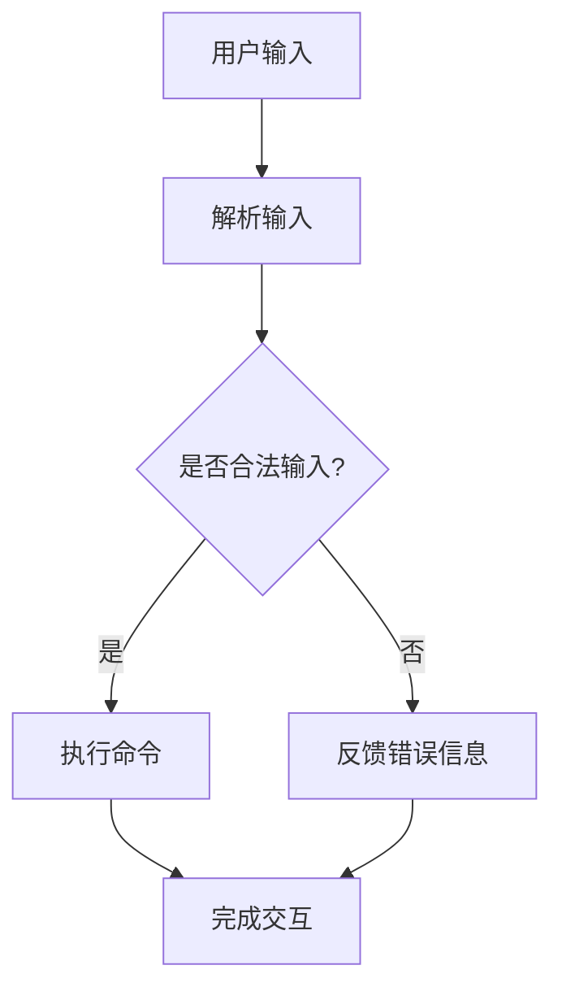

                 

关键词：人机交互、自然语言处理、人工智能、用户体验、技术趋势

> 摘要：本文探讨了人机交互的未来趋势和展望。随着人工智能技术的不断发展，人机交互正朝着更加智能化、个性化、自然化的方向发展。本文通过分析核心概念、算法原理、数学模型以及实际应用案例，总结了人机交互的现状和未来发展方向，并提出了相关建议。

## 1. 背景介绍

人机交互（Human-Computer Interaction，简称HCI）是指人与计算机系统之间的交互过程。从早期基于命令行的交互方式到现在的图形用户界面（GUI），人机交互经历了巨大的变革。随着技术的不断发展，特别是人工智能（Artificial Intelligence，AI）的崛起，人机交互正变得日益智能化，用户体验得到了显著提升。

### 1.1 历史背景

人机交互的历史可以追溯到1950年代，当时计算机刚刚出现，人们通过编程语言与计算机进行交互。随着计算机硬件的进步，图形用户界面（GUI）逐渐取代了命令行界面，使得计算机的使用变得更加直观和便捷。1990年代，互联网的普及进一步推动了人机交互的发展，Web浏览器和搜索引擎成为了人们常用的交互工具。

### 1.2 现状与挑战

目前，人机交互已经渗透到了各个领域，包括智能家居、智能手机、虚拟现实、增强现实等。然而，随着技术的不断进步，人机交互也面临着一系列挑战，如：

- **复杂性与易用性的平衡**：随着功能的增加，人机交互系统的复杂性也在增加，如何保持系统的易用性是一个挑战。
- **个性化与普适性的权衡**：人机交互系统需要为不同的用户提供个性化的服务，同时又要保证系统的普适性，以满足大多数用户的需求。
- **自然交互的挑战**：实现自然、流畅的人机交互仍然是当前研究的重点和难点。

## 2. 核心概念与联系

在人机交互领域，有几个核心概念和理论是非常重要的，这些概念和理论为我们理解和设计人机交互系统提供了理论基础。

### 2.1 交互模型

交互模型描述了人与计算机系统之间的交互过程。常见的交互模型包括：

- **命令行交互**：用户通过输入命令与计算机系统交互。
- **图形用户界面（GUI）**：用户通过图形界面与计算机系统交互。
- **语音交互**：用户通过语音与计算机系统交互。
- **手势交互**：用户通过手势与计算机系统交互。

### 2.2 用户体验（UX）

用户体验是指用户在使用产品或服务过程中所感受到的主观体验。在设计人机交互系统时，用户体验是一个非常重要的考虑因素。

- **易用性**：系统是否容易学习和使用。
- **可用性**：系统能否满足用户的需求。
- **满意度**：用户对系统的整体满意度。

### 2.3 人工智能

人工智能是使计算机能够模拟人类智能行为的技术。在人工智能的帮助下，人机交互系统可以实现更智能、更自然的交互。

- **自然语言处理（NLP）**：使计算机能够理解和处理自然语言。
- **机器学习（ML）**：通过数据训练计算机模型，使其能够从数据中学习并做出预测。
- **计算机视觉（CV）**：使计算机能够理解和解释视觉信息。

### 2.4 Mermaid 流程图

为了更好地理解人机交互系统的工作原理，我们可以使用 Mermaid 流程图来描述系统中的关键步骤和流程。



## 3. 核心算法原理 & 具体操作步骤

在人机交互系统中，核心算法起到了至关重要的作用。以下是一个典型的人机交互算法的原理和具体操作步骤。

### 3.1 算法原理概述

人机交互算法的核心是理解和响应用户的输入。这通常涉及到以下几个步骤：

- **输入识别**：识别用户输入的信息类型和内容。
- **输入理解**：理解用户输入的意图。
- **响应生成**：根据用户的意图生成合适的响应。

### 3.2 算法步骤详解

1. **输入识别**：首先，系统需要识别用户输入的信息类型。例如，如果用户输入的是语音，系统需要使用语音识别技术将语音转换为文本。

2. **输入理解**：接下来，系统需要理解用户输入的意图。这通常涉及到自然语言处理技术，例如词义消歧、句法分析等。

3. **响应生成**：最后，系统需要根据用户的意图生成合适的响应。这可能包括生成文本、语音、图像等多种形式的输出。

### 3.3 算法优缺点

- **优点**：人机交互算法使得计算机系统能够更加自然地与用户进行交互，提高了用户体验。
- **缺点**：算法的准确性和效率仍然是一个挑战，特别是在处理复杂和多模态的交互时。

### 3.4 算法应用领域

人机交互算法广泛应用于各种领域，包括：

- **智能助手**：如苹果的Siri、谷歌的Google Assistant等。
- **智能家居**：如智能音箱、智能灯光等。
- **虚拟现实（VR）和增强现实（AR）**：提供更加自然和沉浸式的交互体验。

## 4. 数学模型和公式 & 详细讲解 & 举例说明

在人机交互中，数学模型和公式扮演着重要角色，用于描述和优化交互过程。以下是一个关于人机交互的常见数学模型和公式的详细讲解。

### 4.1 数学模型构建

在构建人机交互的数学模型时，我们通常考虑以下几个关键因素：

- **用户行为**：描述用户在交互过程中的行为模式。
- **系统响应**：描述系统对用户行为的响应方式。
- **交互质量**：衡量交互效果的指标。

一个简单的数学模型可以表示为：

\[ Q = f(B, R) \]

其中，\( Q \) 表示交互质量，\( B \) 表示用户行为，\( R \) 表示系统响应，\( f \) 表示函数，用于描述交互质量与用户行为和系统响应之间的关系。

### 4.2 公式推导过程

为了推导交互质量的公式，我们可以从以下几个步骤进行：

1. **定义变量**：定义用户行为和系统响应的变量。
2. **建立关系**：建立用户行为和系统响应之间的关系。
3. **推导公式**：通过关系推导出交互质量的公式。

例如，我们可以将用户行为定义为 \( B = f_1(U) \)，系统响应定义为 \( R = f_2(U) \)，其中 \( U \) 表示用户输入。交互质量 \( Q \) 可以表示为：

\[ Q = g(B, R) \]

### 4.3 案例分析与讲解

为了更好地理解这个数学模型，我们可以通过一个实际案例来进行分析。

假设我们有一个智能助手系统，用户可以通过语音与系统进行交互。用户的行为可以是提问，系统需要理解用户的意图并给出合适的回答。

- **用户行为**：用户提问：“明天天气如何？”
- **系统响应**：系统回答：“明天天气晴朗，温度大约20摄氏度。”

在这个案例中，我们可以将用户行为表示为：

\[ B = f_1(U) = \text{提问} \]

系统响应表示为：

\[ R = f_2(U) = \text{回答} \]

交互质量 \( Q \) 可以通过上述公式计算得到：

\[ Q = g(B, R) = \text{用户满意度} \]

通过分析用户的行为和系统的响应，我们可以评估交互质量，并优化系统以提高用户体验。

## 5. 项目实践：代码实例和详细解释说明

为了更好地理解人机交互的实践，我们可以通过一个实际的代码实例来展示人机交互系统的开发过程。

### 5.1 开发环境搭建

在开始编写代码之前，我们需要搭建一个合适的开发环境。以下是所需的环境和工具：

- **Python**：作为主要编程语言。
- **TensorFlow**：用于构建和训练人工智能模型。
- **SpeechRecognition**：用于语音识别。
- **pyttsx3**：用于文本到语音转换。

确保安装了上述工具和库之后，我们可以开始编写代码。

### 5.2 源代码详细实现

以下是一个简单的人机交互系统的源代码实现：

```python
import speech_recognition as sr
import pyttsx3

# 初始化语音识别和文本到语音转换
recognizer = sr.Recognizer()
engine = pyttsx3.init()

# 定义语音识别函数
def recognize_speech_from_mic():
    with sr.Microphone() as source:
        print("请说些什么...")
        audio = recognizer.listen(source)

    try:
        text = recognizer.recognize_google(audio)
        print(f"你说了：{text}")
        return text
    except sr.UnknownValueError:
        print("无法理解语音")
        return None
    except sr.RequestError:
        print("请求错误；请检查网络连接")
        return None

# 定义文本到语音转换函数
def speak_text(text):
    engine.say(text)
    engine.runAndWait()

# 主交互循环
while True:
    user_input = recognize_speech_from_mic()
    if user_input is None:
        continue
    
    # 在这里添加对用户输入的处理和响应逻辑
    response = "对不起，我现在无法理解你的问题。"
    speak_text(response)
```

### 5.3 代码解读与分析

- **语音识别**：使用`SpeechRecognition`库，通过麦克风捕捉用户的语音输入，并使用Google的语音识别服务进行识别。
- **文本到语音转换**：使用`pyttsx3`库，将识别到的文本转换为语音，并通过扬声器播放。

这个简单的例子展示了人机交互系统的基础实现。在实际应用中，我们可以根据需要添加更多的功能，如自然语言理解、语音合成等。

### 5.4 运行结果展示

当用户说：“明天天气如何？”时，系统会捕捉到语音输入，将其转换为文本，并通过自然语言理解确定用户的意图。如果系统无法理解用户的问题，会返回一个默认的响应。

## 6. 实际应用场景

人机交互技术已经在多个领域得到了广泛应用，并取得了显著成效。以下是一些典型应用场景：

### 6.1 智能家居

智能家居是人机交互技术的重要应用领域。智能音箱、智能灯光、智能门锁等设备通过语音交互为用户提供便捷的服务。例如，用户可以通过语音控制智能音箱播放音乐、查询天气、设置提醒等。

### 6.2 智能助手

智能助手如苹果的Siri、谷歌的Google Assistant等，通过语音交互和自然语言理解，为用户提供个性化服务。用户可以通过语音与智能助手进行聊天，获取信息、执行任务等。

### 6.3 虚拟现实（VR）和增强现实（AR）

虚拟现实和增强现实技术为人机交互提供了全新的交互方式。通过手势、语音、视线等交互方式，用户可以更加自然地与虚拟环境进行互动，提高沉浸感和体验。

### 6.4 医疗保健

在医疗保健领域，人机交互技术可以用于远程诊断、健康管理等方面。例如，通过语音交互，用户可以与智能助手进行健康咨询，获取医疗信息等。

### 6.5 教育学习

人机交互技术在教育领域也具有广泛的应用。智能教学系统、虚拟课堂等通过人机交互技术为学生提供个性化学习体验，提高学习效果。

## 7. 未来应用展望

随着人工智能技术的不断发展，人机交互的应用前景将更加广阔。以下是一些未来应用展望：

### 7.1 智能化家居

未来的智能家居将更加智能化，能够更好地理解和响应用户的需求。例如，智能空调可以根据用户的体温和舒适度自动调整温度，智能照明可以根据用户的视觉需求调整亮度。

### 7.2 全自动驾驶

自动驾驶技术是未来人机交互的重要应用领域。通过语音和手势交互，驾驶员可以更加专注于驾驶，减少交通事故的发生。

### 7.3 智能医疗

智能医疗系统可以通过人机交互技术实现远程医疗、智能诊断等，提高医疗服务的质量和效率。

### 7.4 智能教育

智能教育系统将通过人机交互技术提供个性化学习体验，帮助学生更好地理解和掌握知识。

### 7.5 智慧城市

智慧城市通过人机交互技术实现城市管理的智能化，提高城市运行的效率和安全性。

## 8. 工具和资源推荐

为了更好地学习和开发人机交互项目，以下是一些建议的工具和资源：

### 8.1 学习资源推荐

- **书籍**：《人工智能：一种现代方法》（Peter Norvig & Stuart Russell）、《深度学习》（Ian Goodfellow、Yoshua Bengio & Aaron Courville）。
- **在线课程**：Coursera、edX、Udacity等平台提供的AI和计算机科学相关课程。
- **博客和社区**：ArXiv、Medium、Reddit等。

### 8.2 开发工具推荐

- **编程语言**：Python、JavaScript、Java等。
- **机器学习库**：TensorFlow、PyTorch、Scikit-learn等。
- **自然语言处理库**：NLTK、spaCy、gensim等。
- **语音识别库**：SpeechRecognition、pyttsx3、Google Speech-to-Text等。

### 8.3 相关论文推荐

- **ACL**：自然语言处理顶级会议。
- **NeurIPS**：机器学习顶级会议。
- **ICML**：机器学习顶级会议。
- **CVPR**：计算机视觉顶级会议。

## 9. 总结：未来发展趋势与挑战

人机交互技术正朝着更加智能化、个性化、自然化的方向发展。未来，随着人工智能技术的不断进步，人机交互将在更多领域得到应用，为人们的生活和工作带来巨大变革。

### 9.1 研究成果总结

- **语音识别与合成**：语音识别准确率和语音合成自然度不断提高。
- **自然语言处理**：在语义理解、情感分析等方面取得了显著进展。
- **计算机视觉**：图像识别、目标检测等技术不断成熟。
- **多模态交互**：结合语音、手势、视线等多种交互方式，提供更加自然和丰富的交互体验。

### 9.2 未来发展趋势

- **智能化**：人机交互系统将更加智能化，能够更好地理解用户的需求并给出合适的响应。
- **个性化**：系统将根据用户的行为和偏好提供个性化的服务。
- **自然化**：交互过程将更加自然、流畅，减少用户的认知负担。

### 9.3 面临的挑战

- **技术挑战**：如何提高算法的准确率和效率，实现更加自然和流畅的交互。
- **隐私与安全**：在人机交互过程中，如何保护用户的隐私和安全。
- **伦理问题**：在人机交互中，如何处理伦理问题，确保系统的公正性和透明度。

### 9.4 研究展望

未来，人机交互技术将在多个领域得到广泛应用，如智能家居、智能医疗、智能教育等。同时，随着技术的不断发展，人机交互将不断突破现有的瓶颈，为人们的生活和工作带来更多便利和创新。

## 10. 附录：常见问题与解答

### 10.1 什么是人机交互？

人机交互（Human-Computer Interaction，简称HCI）是指人与计算机系统之间的交互过程。它涉及到计算机系统的设计、使用、评价等方面，旨在提高用户体验，使计算机系统更加符合用户的需求和习惯。

### 10.2 人机交互有哪些类型？

人机交互有多种类型，包括：

- **命令行交互**：用户通过输入命令与计算机系统交互。
- **图形用户界面（GUI）**：用户通过图形界面与计算机系统交互。
- **语音交互**：用户通过语音与计算机系统交互。
- **手势交互**：用户通过手势与计算机系统交互。
- **多模态交互**：结合语音、手势、视线等多种交互方式，提供更加自然和丰富的交互体验。

### 10.3 人工智能如何改变人机交互？

人工智能（AI）通过自然语言处理、计算机视觉、机器学习等技术，使计算机系统能够更加智能、自然地与用户进行交互。例如，语音识别和语音合成为语音交互提供了基础，计算机视觉技术可以理解用户的视线和手势，自然语言处理技术可以帮助计算机理解用户的意图。

### 10.4 人机交互技术有哪些应用领域？

人机交互技术广泛应用于多个领域，包括：

- **智能家居**：智能音箱、智能灯光、智能门锁等。
- **智能助手**：如苹果的Siri、谷歌的Google Assistant等。
- **虚拟现实（VR）和增强现实（AR）**：提供沉浸式交互体验。
- **医疗保健**：远程诊断、健康管理等。
- **教育学习**：智能教学系统、虚拟课堂等。

### 10.5 如何设计一个优秀的人机交互系统？

设计一个优秀的人机交互系统需要考虑以下几个方面：

- **用户体验**：确保系统易于使用，满足用户需求。
- **可用性**：系统应该易于学习，能够高效地完成任务。
- **易用性**：系统应该直观、自然，减少用户的认知负担。
- **可访问性**：确保不同能力的用户都能使用系统。
- **灵活性**：系统应该能够适应不同用户和场景的需求。

## 作者署名

作者：禅与计算机程序设计艺术 / Zen and the Art of Computer Programming

