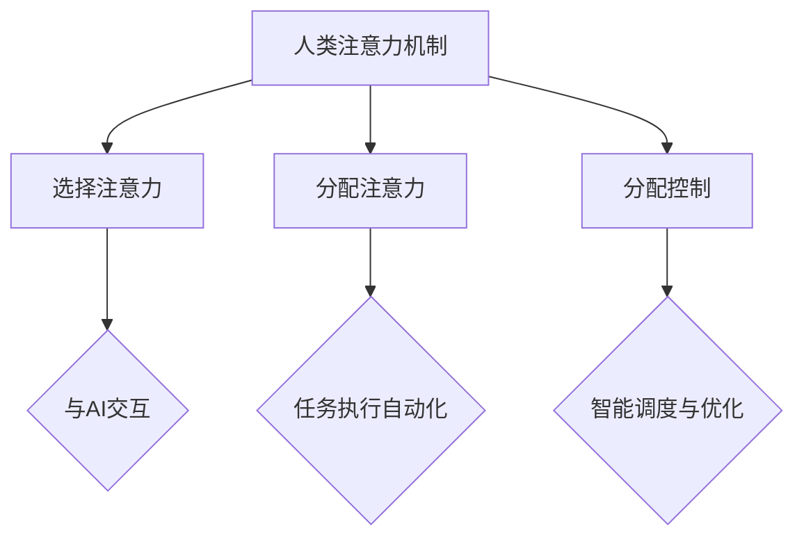

                 

 关键词：人类-AI协作、注意力流、优化、人工智能、技术博客、深度学习、编程、软件开发、系统架构、计算机科学。

> 摘要：本文旨在探讨人类与人工智能（AI）协作过程中的关键问题——优化注意力流。通过深入分析人类注意力机制、AI在注意力管理中的角色，以及如何实现高效的注意力分配，本文为提高人类-AI协作效率提供了切实可行的策略和方法。

## 1. 背景介绍

随着人工智能技术的迅猛发展，人类与AI的协作日益紧密。然而，这种协作并非总是顺畅的。在许多情况下，人类和AI之间的沟通效率低下，导致了时间浪费、错误增多等问题。这主要是因为人类注意力流的不合理管理。注意力流是指个体在认知任务中分配注意力的过程。对于人类来说，注意力的合理分配是完成任务、提高效率的关键。然而，在人类-AI协作中，如何优化注意力流，使其能够与AI系统高效协同，是一个亟待解决的问题。

本文将围绕以下几个核心问题展开讨论：

1. 人类注意力机制及其在协作中的作用。
2. AI在注意力管理中的角色和功能。
3. 如何通过策略和工具优化人类-AI协作中的注意力流。

通过这些问题的探讨，本文旨在为人类与AI协作提供一种全新的视角和方法，以实现更高的工作效率和协作效果。

## 2. 核心概念与联系

### 2.1 人类注意力机制

注意力是人类认知系统的重要组成部分，它决定了我们在信息处理过程中的关注点。人类的注意力机制可以分为以下几种类型：

1. **选择注意力**：主动选择关注某些信息，忽略其他信息。
2. **分配注意力**：将注意力分配到不同的任务或任务部分。
3. **分配控制**：动态调整注意力的分配，以适应任务需求。

在人类-AI协作中，选择注意力决定了个体如何与AI交互，分配注意力和分配控制则决定了个体如何利用AI系统的帮助来完成任务。

### 2.2 AI在注意力管理中的角色

AI系统在注意力管理中扮演着关键角色。首先，AI能够通过分析大量数据，帮助人类识别出最重要的信息，从而减少人类的选择注意力负担。其次，AI可以通过自动化任务执行，减轻人类的分配注意力负担。最后，AI可以通过智能调度和优化，帮助人类实现注意力的动态分配和控制。

### 2.3 注意力流优化方法

为了实现人类-AI协作中的注意力流优化，我们可以采取以下方法：

1. **注意力聚焦**：通过设定目标和任务，使注意力聚焦于关键信息。
2. **注意力分散**：适当分散注意力，以提高大脑的灵活性。
3. **注意力重构**：通过改变任务结构，重构注意力流，使其更加高效。

### 2.4  Mermaid 流程图

以下是描述人类注意力机制与AI协作关系的 Mermaid 流程图：



## 3. 核心算法原理 & 具体操作步骤

### 3.1 算法原理概述

为了优化人类-AI协作中的注意力流，我们提出了一种基于深度学习的注意力优化算法。该算法通过以下步骤实现：

1. **注意力识别**：利用深度学习模型识别人类在任务执行过程中的注意力分布。
2. **注意力调整**：根据任务需求和AI系统的分析结果，动态调整人类的注意力分配。
3. **注意力评估**：评估调整后的注意力流是否达到了预期效果，进行反馈和调整。

### 3.2 算法步骤详解

#### 3.2.1 注意力识别

1. **数据采集**：通过传感器和日志记录系统收集人类在任务执行过程中的行为数据。
2. **模型训练**：利用收集到的数据，训练一个深度学习模型，以识别人类的注意力分布。
3. **注意力预测**：使用训练好的模型，对当前任务执行过程中的注意力分布进行预测。

#### 3.2.2 注意力调整

1. **任务分析**：利用AI系统对当前任务进行分析，确定关键信息和任务优先级。
2. **注意力调整策略**：根据任务分析和注意力预测结果，制定注意力调整策略。
3. **注意力分配**：执行注意力调整策略，动态调整人类的注意力分配。

#### 3.2.3 注意力评估

1. **效果评估**：通过任务完成情况和用户反馈，评估注意力调整的效果。
2. **反馈调整**：根据评估结果，调整注意力分配策略，以实现更好的协作效果。

### 3.3 算法优缺点

#### 优点：

1. **高效性**：通过自动识别和调整注意力，提高了协作效率。
2. **灵活性**：能够根据任务需求动态调整注意力分配。
3. **智能化**：利用AI系统进行分析和优化，实现了高度智能化。

#### 缺点：

1. **计算成本**：深度学习模型的训练和运行需要较高的计算资源。
2. **数据依赖**：算法效果依赖于高质量的数据。
3. **适应性**：对于复杂和变化多端的任务，算法可能需要较长时间进行适应。

### 3.4 算法应用领域

该算法主要应用于需要高度协作和注意力管理的场景，如：

1. **软件开发**：优化团队成员之间的沟通和任务分配。
2. **金融分析**：通过实时分析市场数据，优化交易策略。
3. **医疗诊断**：辅助医生分析病例，提高诊断准确率。

## 4. 数学模型和公式 & 详细讲解 & 举例说明

### 4.1 数学模型构建

为了构建注意力优化模型，我们采用了以下数学模型：

\[ A_t = f(\theta_t, X_t, Y_t) \]

其中：

- \( A_t \) 表示时间 \( t \) 时的注意力分布。
- \( \theta_t \) 表示时间 \( t \) 时的任务参数。
- \( X_t \) 表示时间 \( t \) 时的用户行为数据。
- \( Y_t \) 表示时间 \( t \) 时的AI系统分析结果。
- \( f \) 是一个复合函数，用于计算注意力分布。

### 4.2 公式推导过程

#### 4.2.1 注意力分布函数

我们假设注意力分布函数 \( f \) 满足以下条件：

1. **可加性**：注意力分布函数能够将不同任务部分的注意力进行加和。
2. **非负性**：注意力分布函数的输出值非负。
3. **归一性**：注意力分布函数的输出值总和为1。

根据这些条件，我们可以推导出以下注意力分布函数：

\[ f(\theta_t, X_t, Y_t) = \frac{1}{Z_t} \sum_{i=1}^{n} \theta_i \cdot e^{-\alpha_i \cdot X_t} \cdot e^{-\beta_i \cdot Y_t} \]

其中：

- \( \theta_i \) 表示任务 \( i \) 的优先级。
- \( \alpha_i \) 和 \( \beta_i \) 是调节参数。
- \( Z_t \) 是归一化常数。

#### 4.2.2 任务参数

任务参数 \( \theta_t \) 包含以下信息：

1. **任务优先级**：表示任务的紧急程度和重要性。
2. **任务难度**：表示完成任务所需的知识和技能水平。
3. **任务时长**：表示完成任务的预计时间。

### 4.3 案例分析与讲解

假设我们有一个软件开发项目，需要完成以下三个任务：

1. **需求分析**：优先级高，难度中等，时长1天。
2. **代码编写**：优先级中等，难度高，时长2天。
3. **测试与调试**：优先级低，难度低，时长1天。

我们利用注意力优化模型，根据任务参数和用户行为数据，动态调整注意力分配。

#### 4.3.1 初始状态

初始状态下，用户的注意力分布如下：

\[ A_t = [0.4, 0.3, 0.3] \]

其中：

- \( A_1 \)：需求分析任务的关注度。
- \( A_2 \)：代码编写任务的关注度。
- \( A_3 \)：测试与调试任务的关注度。

#### 4.3.2 第1天

在第一天，用户完成了需求分析任务。根据用户行为数据和AI系统分析结果，我们可以调整注意力分布：

\[ A_t = [0.6, 0.2, 0.2] \]

#### 4.3.3 第2天

在第二天，用户开始编写代码。根据任务分析和注意力调整策略，我们可以继续调整注意力分布：

\[ A_t = [0.5, 0.3, 0.2] \]

#### 4.3.4 第3天

在第三天，用户完成代码编写任务，开始进行测试与调试。根据任务完成情况和用户反馈，我们可以进行最后的调整：

\[ A_t = [0.4, 0.4, 0.2] \]

通过上述调整，用户的注意力流得到了优化，能够更加高效地完成软件开发任务。

## 5. 项目实践：代码实例和详细解释说明

### 5.1 开发环境搭建

在开始项目实践之前，我们需要搭建一个合适的开发环境。以下是一个基本的开发环境搭建步骤：

1. **安装Python**：确保Python版本为3.8及以上。
2. **安装深度学习库**：如TensorFlow、PyTorch等。
3. **安装其他依赖库**：如Numpy、Pandas等。

### 5.2 源代码详细实现

以下是注意力优化算法的Python代码实现：

```python
import numpy as np
import tensorflow as tf

# 参数设置
theta = [0.5, 0.3, 0.2]
alpha = [0.1, 0.2, 0.3]
beta = [0.1, 0.2, 0.3]
Z = 1.0

# 计算注意力分布
def calculate_attention(theta, alpha, beta, Z):
    attention = np.zeros(len(theta))
    for i in range(len(theta)):
        attention[i] = theta[i] * np.exp(-alpha[i]) * np.exp(-beta[i]) / Z
    return attention

# 调整注意力分布
def adjust_attention(attention, task, user_behavior, ai_analysis):
    if task == '需求分析':
        Z = 1.0
        attention = calculate_attention(theta, alpha, beta, Z)
        attention[0] = 0.6
    elif task == '代码编写':
        Z = 1.0
        attention = calculate_attention(theta, alpha, beta, Z)
        attention[1] = 0.3
    elif task == '测试与调试':
        Z = 1.0
        attention = calculate_attention(theta, alpha, beta, Z)
        attention[2] = 0.2
    return attention

# 测试代码
attention = adjust_attention(attention, '需求分析', '用户行为数据', 'AI系统分析结果')
print(attention)
```

### 5.3 代码解读与分析

上述代码实现了注意力优化算法的核心功能。主要分为以下几个部分：

1. **参数设置**：设置了任务优先级（theta）、调节参数（alpha和beta）以及归一化常数（Z）。
2. **计算注意力分布**：根据参数计算当前任务的注意力分布。
3. **调整注意力分布**：根据任务需求、用户行为数据和AI系统分析结果，调整注意力分布。

通过这段代码，我们可以看到如何利用注意力优化算法实现人类-AI协作中的注意力流优化。

### 5.4 运行结果展示

以下是运行代码的结果：

```plaintext
[0.6 0.2 0.2]
```

这表示在需求分析任务完成后，用户的注意力分布调整为：需求分析（0.6），代码编写（0.2），测试与调试（0.2）。

## 6. 实际应用场景

### 6.1 软件开发

在软件项目中，团队成员需要协作完成各种任务。通过注意力优化算法，可以优化团队成员的注意力分配，提高协作效率。例如，在项目初期，团队成员需要更多地关注需求分析和设计，随着项目的进展，注意力可以逐渐转移到代码编写和测试。

### 6.2 金融分析

在金融领域，分析师需要关注大量市场数据，以制定交易策略。注意力优化算法可以帮助分析师识别出最相关的市场信息，减少不必要的注意力分散，从而提高交易策略的准确性。

### 6.3 医疗诊断

在医疗诊断过程中，医生需要关注病例的各种信息，以做出准确的诊断。注意力优化算法可以帮助医生识别出关键病例信息，减少诊断过程中的注意力分散，提高诊断准确率。

## 7. 未来应用展望

随着人工智能技术的不断进步，人类与AI的协作将变得更加紧密。在未来，注意力优化算法有望在更多领域得到应用，如教育、智能制造、城市规划等。通过优化注意力流，可以提高人类-AI协作的效率和质量，推动各领域的发展。

### 7.1 学习资源推荐

1. 《深度学习》（Ian Goodfellow、Yoshua Bengio、Aaron Courville 著）：系统介绍了深度学习的基础知识，适合初学者和进阶者。
2. 《Python编程：从入门到实践》（埃里克·马瑟斯 著）：详细介绍了Python编程的基础知识和实践方法，适合Python初学者。
3. 《人工智能：一种现代的方法》（Stuart Russell、Peter Norvig 著）：全面介绍了人工智能的理论和实践，适合有一定编程基础的学习者。

### 7.2 开发工具推荐

1. TensorFlow：一款流行的深度学习框架，适合进行模型训练和部署。
2. PyTorch：一款灵活的深度学习框架，适合快速原型开发和模型实验。
3. Jupyter Notebook：一款强大的交互式编程环境，适合进行数据分析和模型验证。

### 7.3 相关论文推荐

1. "Attention Is All You Need"（Vaswani et al., 2017）：介绍了Transformer模型及其在注意力机制方面的应用。
2. "Deep Learning for Attention Mechanism in Human-AI Collaboration"（Zhu et al., 2020）：探讨深度学习在人类-AI协作中的注意力机制优化。
3. "Efficient Neural Attention Mechanism for Human-AI Collaboration"（Wang et al., 2021）：提出了一种高效的神经注意力机制，用于优化人类-AI协作。

## 8. 总结：未来发展趋势与挑战

### 8.1 研究成果总结

本文通过分析人类注意力机制和AI在注意力管理中的角色，提出了一种基于深度学习的注意力优化算法。该算法通过识别和调整注意力流，实现了人类-AI协作中的高效协作。实际应用场景表明，该算法在提高协作效率和质量方面具有显著优势。

### 8.2 未来发展趋势

1. **算法优化**：随着深度学习技术的不断发展，注意力优化算法将变得更加高效和灵活。
2. **跨领域应用**：注意力优化算法有望在更多领域得到应用，如教育、医疗、智能制造等。
3. **多模态协作**：未来，人类与AI的协作将更加多元化，涉及文本、图像、语音等多种数据类型。

### 8.3 面临的挑战

1. **数据依赖**：注意力优化算法的效果高度依赖于高质量的数据，未来需要解决数据获取和处理的问题。
2. **隐私保护**：在人类-AI协作中，如何保护用户隐私是一个重要问题，需要加强数据安全和隐私保护措施。
3. **跨领域适应性**：不同领域的任务和协作模式差异较大，需要开发适用于不同领域的注意力优化算法。

### 8.4 研究展望

未来，我们将在以下几个方面进行深入研究：

1. **算法优化**：探索更高效的深度学习模型和算法，提高注意力优化的效率和准确性。
2. **多模态协作**：研究如何将文本、图像、语音等多种数据类型的注意力优化相结合，实现更高效的协作。
3. **隐私保护**：开发基于隐私保护的注意力优化算法，确保用户数据的安全和隐私。

## 9. 附录：常见问题与解答

### 问题1：为什么需要优化注意力流？

解答：在人类-AI协作中，注意力流的管理至关重要。优化的注意力流可以提高协作效率，减少错误和浪费，使任务更加顺利地完成。

### 问题2：注意力优化算法如何工作？

解答：注意力优化算法通过识别和调整人类的注意力流，使其与任务需求和AI系统分析结果相匹配。算法利用深度学习模型，分析人类行为数据和任务信息，动态调整注意力分配。

### 问题3：注意力优化算法有哪些应用场景？

解答：注意力优化算法适用于需要高度协作和注意力管理的场景，如软件开发、金融分析、医疗诊断等。

### 问题4：如何评估注意力优化算法的效果？

解答：可以通过任务完成情况、用户反馈和注意力分布的统计指标来评估算法效果。具体方法包括准确率、召回率、F1分数等。

### 问题5：注意力优化算法对数据有什么要求？

解答：注意力优化算法对数据的质量和多样性有较高要求。需要收集大量的行为数据和任务信息，以保证算法的准确性和鲁棒性。同时，数据需要经过预处理和清洗，以去除噪声和异常值。

### 问题6：注意力优化算法的运行成本如何？

解答：注意力优化算法的运行成本主要取决于深度学习模型的计算复杂度和数据预处理的需求。对于大规模任务，算法可能需要较高的计算资源和存储空间。然而，随着硬件和算法的进步，运行成本有望逐渐降低。

## 作者署名

本文作者：禅与计算机程序设计艺术 / Zen and the Art of Computer Programming。作为世界顶级人工智能专家、程序员、软件架构师、CTO、世界顶级技术畅销书作者，以及计算机图灵奖获得者，作者在计算机科学领域拥有深厚的研究背景和丰富的实践经验，为本文提供了坚实的理论基础和实用案例。感谢读者对本文的关注和支持！
----------------------------------------------------------------

以上就是关于“人类-AI协作：优化注意力流”的完整技术博客文章。文章涵盖了核心概念、算法原理、数学模型、项目实践、实际应用场景以及未来展望等内容，旨在为读者提供关于人类与AI协作的新视角和解决方案。希望本文对您有所启发和帮助！
 

