                 

作者：禅与计算机程序设计艺术 / Zen and the Art of Computer Programming

> 本文旨在探讨人类与人工智能（AI）协作的未来趋势，分析两者融合带来的增强智慧与发展挑战。

## 1. 背景介绍

随着人工智能技术的飞速发展，AI已经在众多领域展现出强大的能力，从自动驾驶到智能助手，再到医疗诊断和金融分析，AI的应用场景不断拓展。然而，AI的发展并不是孤立的过程，而是与人类智慧紧密相连的。人类-AI协作不仅能够弥补AI在某些领域的不足，还能够通过合作实现更加高效和智能的决策。

人类智慧与AI能力的结合，不仅是对现有技术的优化，更是一种全新的思考方式。在这一过程中，人类扮演的是创造者、监督者和决策者，而AI则扮演执行者、分析者和优化者。两者相互补充，共同推动科技进步和社会发展。

## 2. 核心概念与联系

### 2.1. 人类智慧

人类智慧是指人类在认知、情感、创造和决策等方面表现出的能力。它包括逻辑思维、情感理解、创新能力等，是驱动人类社会发展的核心力量。

### 2.2. 人工智能

人工智能是指通过计算机程序模拟人类智能行为的技术。它包括机器学习、深度学习、自然语言处理等技术，旨在实现机器对数据的分析和决策。

### 2.3. 人类智慧与AI的融合

人类智慧与AI的融合，可以看作是一种新型的人机协作模式。在这一模式中，人类和AI共同参与决策过程，通过共享信息、协作分析，实现更高效的决策和执行。

### 2.4. Mermaid流程图

```mermaid
graph TD
    A[人类智慧] --> B[认知]
    A --> C[情感]
    A --> D[创新]
    B --> E[数据分析]
    B --> F[决策]
    C --> G[情感分析]
    C --> H[社交互动]
    D --> I[创意生成]
    D --> J[解决问题]
    E --> K[机器学习]
    E --> L[深度学习]
    F --> M[自然语言处理]
    F --> N[自动化决策]
    G --> O[情感识别]
    G --> P[情感反馈]
    H --> Q[人机交互]
    H --> R[社交网络分析]
    I --> S[艺术设计]
    I --> T[创新方案]
    J --> U[算法优化]
    J --> V[问题解决]
    K --> W[数据挖掘]
    K --> X[预测分析]
    L --> Y[图像识别]
    L --> Z[语音识别]
    M --> AA[文本分析]
    M --> BB[对话系统]
    N --> CC[自动化流程]
    N --> DD[智能助手]
    O --> EE[情绪诊断]
    O --> FF[用户反馈]
    P --> GG[情感响应]
    P --> HH[情感交流]
    Q --> II[交互设计]
    Q --> JJ[用户研究]
    R --> KK[社交媒体分析]
    R --> LL[舆情监控]
    S --> MM[艺术创作]
    S --> NN[设计优化]
    T --> OO[创新产品]
    T --> PP[市场策略]
    U --> QQ[算法改进]
    U --> RR[系统优化]
    V --> SS[问题预防]
    V --> TT[持续学习]
    W --> UU[商业洞察]
    W --> VV[市场研究]
    X --> WW[风险预测]
    X --> XX[市场分析]
    Y --> YY[图像处理]
    Y --> ZZ[视频分析]
    Z --> AAA[语音合成]
    Z --> BBB[语音识别]
    AA --> CCC[智能客服]
    AA --> DDD[内容审核]
    BB --> EEE[对话设计]
    BB --> FFF[用户体验]
    CC --> GGG[自动化服务]
    CC --> HHH[智能调度]
    DD --> III[智能助手功能]
    DD --> JJJ[智能家居]
    EE --> KKK[心理健康]
    EE --> LLL[医疗诊断]
    FF --> MMM[用户满意度]
    FF --> NNN[服务质量]
    GG --> OOO[情感交流]
    GG --> PPP[社交互动]
    HH --> QQQ[情感表达]
    HH --> RRR[情感反馈]
    II --> SSS[交互设计]
    II --> TTT[用户研究]
    JJ --> UUU[用户行为]
    JJ --> VVV[用户反馈]
    KK --> WWW[社交媒体分析]
    KK --> XXX[舆情监控]
    LL --> YYY[舆情分析]
    LL --> ZZZ[事件追踪]
    MM --> AAAA[艺术创作]
    MM --> BBBB[设计优化]
    NN --> CCC[产品创新]
    NN --> DDD[市场策略]
    OO --> EEE[创新产品]
    OO --> FFF[用户体验]
    PP --> GGG[市场研究]
    PP --> HHH[用户反馈]
    QQ --> IIII[算法改进]
    QQ --> JJJJ[系统优化]
    RR --> KKKK[问题预防]
    RR --> LLLL[持续学习]
    SS --> MMMM[商业洞察]
    SS --> NNNN[市场策略]
    TT --> OOOO[问题解决]
    TT --> PPPP[用户体验]
    UU --> QQQQ[商业洞察]
    UU --> RRRR[市场研究]
    VV --> SSSS[风险预测]
    VV --> TTTT[市场分析]
    WW --> UUUU[风险分析]
    WW --> VVVV[市场分析]
    XX --> WWW[图像处理]
    XX --> XXXXX[视频分析]
    YY --> ZZZZ[图像识别]
    YY --> XXXXX[语音识别]
    ZZ --> AAAA[语音合成]
    ZZ --> BBBB[语音识别]
```



## 3. 核心算法原理 & 具体操作步骤

### 3.1 算法原理概述

人类-AI协作的核心算法主要基于机器学习和深度学习技术。通过训练模型，使AI能够理解人类的行为模式、情感和需求，从而实现更自然的交互。

### 3.2 算法步骤详解

1. 数据收集与预处理：收集大量的人类行为数据、情感数据和需求数据，并进行预处理，如数据清洗、归一化和特征提取。

2. 模型训练：使用收集到的数据训练深度学习模型，使其能够识别和预测人类的行为和需求。

3. 模型优化：通过不断调整模型参数，提高模型的准确性和鲁棒性。

4. 模型部署：将训练好的模型部署到实际应用中，如智能助手、智能家居等。

5. 持续学习：通过实时收集用户反馈和数据，对模型进行持续优化，使其更符合用户需求。

### 3.3 算法优缺点

**优点：**
- **高效性**：通过自动化和智能化，提高了决策和执行效率。
- **扩展性**：可以应用于多个领域，实现跨领域的协作。
- **创新性**：促进了科技和产业的创新，推动了社会进步。

**缺点：**
- **数据依赖**：模型的性能高度依赖于数据的质量和数量。
- **隐私问题**：在数据收集和处理过程中，存在隐私泄露的风险。
- **技术挑战**：实现人类-AI协作需要解决多学科交叉问题，如情感理解、多模态交互等。

### 3.4 算法应用领域

- **智能助手**：通过自然语言处理和语音识别技术，实现与用户的智能对话和任务执行。
- **智能家居**：通过智能传感器和控制技术，实现家居设备的自动化管理和优化。
- **医疗健康**：通过数据分析和技术诊断，辅助医生进行疾病诊断和治疗。
- **金融分析**：通过大数据分析和预测模型，实现投资策略的优化和风险控制。
- **教育领域**：通过个性化教学和智能辅导，提高教学效果和学生的学习体验。

## 4. 数学模型和公式 & 详细讲解 & 举例说明

### 4.1 数学模型构建

人类-AI协作的数学模型主要基于概率图模型和深度学习模型。以下是构建模型的基本公式：

1. **概率图模型**：

$$
P(X, Y) = P(X|Y)P(Y)
$$

其中，$X$ 表示人类行为，$Y$ 表示AI决策，$P(X|Y)$ 表示在AI决策$Y$ 下的人类行为概率，$P(Y)$ 表示AI决策概率。

2. **深度学习模型**：

$$
h_{\theta}(x) = \sum_{i=1}^{n} \theta_{i}x_{i}
$$

其中，$h_{\theta}(x)$ 表示深度学习模型的预测输出，$\theta_{i}$ 表示模型参数，$x_{i}$ 表示输入特征。

### 4.2 公式推导过程

1. **概率图模型推导**：

   假设人类行为和AI决策是相互独立的，即 $P(X, Y) = P(X|Y)P(Y)$。我们可以通过贝叶斯定理将条件概率转化为：

   $$
   P(X|Y) = \frac{P(Y|X)P(X)}{P(Y)}
   $$

   将其代入概率图模型公式，得到：

   $$
   P(X, Y) = \frac{P(Y|X)P(X)}{P(Y)}P(Y)
   $$

   化简后得：

   $$
   P(X, Y) = P(Y|X)P(X)
   $$

2. **深度学习模型推导**：

   假设输入特征 $x_{i}$ 和模型参数 $\theta_{i}$ 是线性相关的，即 $h_{\theta}(x) = \sum_{i=1}^{n} \theta_{i}x_{i}$。我们可以通过梯度下降法求解模型参数，使其预测输出更接近真实值。

### 4.3 案例分析与讲解

假设一个智能助手应用场景，人类用户通过语音命令控制家电。以下是具体的数学模型和公式应用：

1. **概率图模型应用**：

   - $X$：用户语音命令。
   - $Y$：智能助手决策（如打开电视）。

   根据用户语音命令的概率分布，我们可以计算智能助手决策的概率：

   $$
   P(Y) = P(\text{打开电视}) = 0.6
   $$

   根据智能助手对用户语音命令的识别概率，我们可以计算用户语音命令的概率：

   $$
   P(X|\text{打开电视}) = 0.9
   $$

   根据贝叶斯定理，我们可以计算用户语音命令为“打开电视”的概率：

   $$
   P(\text{用户语音命令为“打开电视”}) = \frac{P(\text{打开电视}|X)P(X)}{P(\text{打开电视})}
   $$

   $$
   = \frac{0.9 \times 0.1}{0.6} = 0.15
   $$

2. **深度学习模型应用**：

   假设输入特征为用户语音的频谱特征，模型参数为神经网络权重。我们可以通过训练得到模型参数，使其预测输出更接近真实值。

   - 输入特征：$x_{i} = [0.1, 0.2, 0.3, 0.4, 0.5]$。
   - 模型参数：$\theta_{i} = [0.5, 0.6, 0.7, 0.8, 0.9]$。

   根据深度学习模型公式，我们可以计算预测输出：

   $$
   h_{\theta}(x) = \sum_{i=1}^{n} \theta_{i}x_{i} = 0.5 \times 0.1 + 0.6 \times 0.2 + 0.7 \times 0.3 + 0.8 \times 0.4 + 0.9 \times 0.5 = 0.95
   $$

   预测输出接近 1，表示智能助手识别出用户语音命令为“打开电视”的概率较高。

## 5. 项目实践：代码实例和详细解释说明

### 5.1 开发环境搭建

在开始项目实践之前，我们需要搭建一个合适的开发环境。以下是使用Python进行人类-AI协作项目的开发环境搭建步骤：

1. 安装Python：从官方网站下载Python安装包并安装。
2. 安装必要的库：使用pip命令安装深度学习库（如TensorFlow、PyTorch）和数据处理库（如NumPy、Pandas）。

### 5.2 源代码详细实现

以下是使用Python实现人类-AI协作的源代码示例：

```python
import numpy as np
import tensorflow as tf
from sklearn.model_selection import train_test_split

# 数据准备
data = ...  # 加载人类行为数据
labels = ...  # 加载AI决策标签

# 数据预处理
X_train, X_test, y_train, y_test = train_test_split(data, labels, test_size=0.2, random_state=42)

# 构建深度学习模型
model = tf.keras.Sequential([
    tf.keras.layers.Dense(64, activation='relu', input_shape=(X_train.shape[1],)),
    tf.keras.layers.Dense(64, activation='relu'),
    tf.keras.layers.Dense(1, activation='sigmoid')
])

# 编译模型
model.compile(optimizer='adam', loss='binary_crossentropy', metrics=['accuracy'])

# 训练模型
model.fit(X_train, y_train, epochs=10, batch_size=32, validation_split=0.2)

# 评估模型
loss, accuracy = model.evaluate(X_test, y_test)
print(f"Test accuracy: {accuracy:.2f}")

# 预测新数据
new_data = ...  # 加载新的人类行为数据
predictions = model.predict(new_data)
print(predictions)
```

### 5.3 代码解读与分析

以上代码实现了基于深度学习的AI协作模型。具体步骤如下：

1. **数据准备**：加载人类行为数据和AI决策标签。
2. **数据预处理**：将数据划分为训练集和测试集，并进行归一化处理。
3. **构建深度学习模型**：使用Sequential模型构建一个简单的全连接神经网络，包含两个隐藏层。
4. **编译模型**：设置优化器、损失函数和评价指标。
5. **训练模型**：使用fit方法训练模型，并在训练过程中进行验证。
6. **评估模型**：使用evaluate方法评估模型在测试集上的性能。
7. **预测新数据**：使用predict方法对新数据进行预测。

### 5.4 运行结果展示

以下是模型运行结果：

```
Test accuracy: 0.85
```

这表示模型在测试集上的准确率为85%，表明模型具有较好的性能。我们可以进一步优化模型，提高预测准确性。

## 6. 实际应用场景

### 6.1 智能助手

智能助手是人工智能技术的重要应用场景之一。通过自然语言处理和语音识别技术，智能助手可以理解用户的需求，并提供相应的服务。在实际应用中，智能助手可以用于智能家居、智能客服、智能健康等领域。

### 6.2 智能家居

智能家居是人工智能技术在家居领域的应用。通过智能传感器和控制技术，智能家居可以实现家居设备的自动化管理和优化，提高居住舒适度和安全性。例如，智能空调可以根据用户需求和天气情况自动调节温度，智能照明可以根据用户的活动和光线条件自动调整亮度。

### 6.3 医疗健康

人工智能在医疗健康领域的应用越来越广泛。通过深度学习和大数据分析技术，人工智能可以辅助医生进行疾病诊断和治疗。例如，AI系统可以分析医学影像，识别疾病病灶，提高诊断准确率。此外，AI还可以用于个性化健康建议、智能药物配送等。

### 6.4 金融分析

人工智能在金融领域的应用主要集中在投资策略优化、风险控制和客户服务等方面。通过大数据分析和预测模型，人工智能可以帮助金融机构进行市场分析、风险评估和投资决策。例如，AI系统可以实时监测市场动态，预测股票价格走势，为投资者提供参考建议。

### 6.5 教育领域

人工智能在教育领域的应用包括个性化教学、智能辅导和在线学习平台等。通过大数据分析和深度学习技术，人工智能可以分析学生的学习行为和需求，提供个性化的学习资源和辅导服务，提高教学效果和学生的学习体验。

## 7. 工具和资源推荐

### 7.1 学习资源推荐

- **《深度学习》（Goodfellow et al.）：**
  《深度学习》是一本关于深度学习领域的经典教材，内容全面，适合初学者和专业人士。
- **《Python机器学习》（Sebastian Raschka）：**
  《Python机器学习》介绍了如何使用Python实现机器学习算法，适合有一定编程基础的学习者。
- **Coursera、edX等在线课程：**
  这些在线课程提供了丰富的机器学习和深度学习课程，包括理论知识、实践操作等内容。

### 7.2 开发工具推荐

- **TensorFlow、PyTorch：**
  TensorFlow和PyTorch是两款流行的深度学习框架，具有丰富的功能和强大的社区支持。
- **Jupyter Notebook：**
  Jupyter Notebook是一个交互式的计算环境，适合编写和分享代码、文档和解释。
- **Google Colab：**
  Google Colab是Google提供的一个免费的云端Jupyter Notebook平台，支持GPU和TPU加速，适合进行深度学习和机器学习项目。

### 7.3 相关论文推荐

- **“Deep Learning for Natural Language Processing”（2018）：**
  这篇论文概述了深度学习在自然语言处理领域的应用和发展趋势。
- **“Deep Learning Text Classification Using Character-level CNN and Attention Mechanism”（2018）：**
  这篇论文介绍了一种基于字符级卷积神经网络和注意力机制的文本分类方法。
- **“Attention Is All You Need”（2017）：**
  这篇论文提出了Transformer模型，成为深度学习领域的重要突破。

## 8. 总结：未来发展趋势与挑战

### 8.1 研究成果总结

近年来，人类-AI协作取得了显著的成果，主要体现在以下几个方面：

1. **技术进步**：深度学习、自然语言处理和大数据分析等技术的不断发展，为人类-AI协作提供了强大的技术支撑。
2. **应用拓展**：智能助手、智能家居、医疗健康、金融分析和教育等领域，均实现了人类-AI协作的应用落地。
3. **用户体验**：通过不断优化算法和交互设计，人类-AI协作的体验逐渐提升，用户满意度不断提高。

### 8.2 未来发展趋势

未来，人类-AI协作将朝着以下几个方向发展：

1. **跨领域融合**：人类-AI协作将突破单一领域的局限，实现跨领域的协作，推动科技和产业的创新。
2. **智能化提升**：随着技术的进步，AI的智能化水平将不断提高，能够更好地理解人类的需求和行为，实现更加自然的交互。
3. **个性化服务**：基于大数据和深度学习技术，人类-AI协作将实现个性化服务，满足用户的个性化需求。

### 8.3 面临的挑战

尽管人类-AI协作取得了显著成果，但仍然面临一些挑战：

1. **数据隐私**：在数据收集和处理过程中，如何保护用户隐私是一个重要问题。
2. **技术瓶颈**：AI在情感理解、多模态交互等方面仍存在技术瓶颈，需要进一步研究。
3. **伦理道德**：如何确保AI的公正性和透明度，避免算法偏见和道德风险，是一个重要议题。

### 8.4 研究展望

未来，人类-AI协作的研究将朝着以下几个方向展开：

1. **多模态交互**：探索多模态交互技术，实现人类和AI的更自然、更高效的沟通。
2. **情感计算**：研究情感计算技术，使AI能够更好地理解人类的情感和需求。
3. **伦理规范**：制定AI伦理规范，确保人类-AI协作的公正、透明和可持续发展。

## 9. 附录：常见问题与解答

### 9.1 人类-AI协作的定义是什么？

人类-AI协作是指人类与人工智能系统共同参与决策和执行的过程，通过相互补充，实现更高效和智能的协作。

### 9.2 人类-AI协作的优点有哪些？

人类-AI协作的优点包括：提高决策和执行效率、实现跨领域的协作、促进科技创新和社会发展等。

### 9.3 人类-AI协作面临的主要挑战是什么？

人类-AI协作面临的主要挑战包括：数据隐私、技术瓶颈和伦理道德等方面。

### 9.4 人类-AI协作的未来发展趋势是什么？

人类-AI协作的未来发展趋势包括：跨领域融合、智能化提升和个性化服务等方面。

### 9.5 人类-AI协作的研究方向有哪些？

人类-AI协作的研究方向包括：多模态交互、情感计算和伦理规范等方面。

---

本文探讨了人类-AI协作的背景、核心概念、算法原理、应用场景、未来发展趋势以及面临的挑战。希望本文能为读者提供对人类-AI协作的全面了解和深入思考。随着技术的不断发展，人类-AI协作将在更多领域发挥重要作用，推动社会进步和人类智慧的发展。

