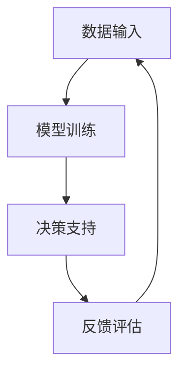

                 

在当今这个数字化、自动化快速发展的时代，人工智能（AI）已经成为推动社会进步的重要力量。然而，随着AI技术的不断发展，人类与AI之间的协作模式也在发生深刻的变革。本文旨在探讨人类与AI协作的增强发展趋势，分析其背后的核心原理，预测未来的发展方向，并提出相应的挑战和应对策略。

> 关键词：人工智能，人类协作，发展趋势，融合，增强

> 摘要：本文首先回顾了人工智能的发展历程，接着深入探讨了人类与AI协作的基本原理和现状，分析了目前存在的问题和挑战。在此基础上，提出了未来人类与AI协作的潜在发展趋势，并对这些趋势进行了预测。最后，本文总结了研究成果，提出了未来研究的方向和面临的挑战。

## 1. 背景介绍

人工智能（AI）是一门研究、开发用于模拟、延伸和扩展人类智能的理论、方法、技术及应用系统的科学技术。AI的发展可以分为多个阶段，从早期的符号逻辑和推理系统，到基于知识的系统，再到基于数据和机器学习的现代AI技术，每一步都标志着人工智能的重大进步。

### 1.1 人工智能的发展历程

- **早期阶段**：20世纪50年代至70年代，以符号逻辑和推理为核心，代表性的系统如ELIZA。
- **知识工程阶段**：20世纪80年代，以知识表示和知识推理为核心，代表性的系统如专家系统。
- **机器学习阶段**：20世纪90年代至21世纪初，以统计学习和深度学习为核心，代表性的算法有神经网络和支持向量机。
- **大数据与深度学习阶段**：21世纪初至今，以大规模数据处理和深度学习为核心，代表性的系统如谷歌的AlphaGo。

### 1.2 人类与AI协作的初步探索

随着AI技术的发展，人类与AI的协作逐渐成为现实。早期的协作主要侧重于AI作为工具的辅助角色，如数据标注、自动化报告生成等。随着深度学习等技术的成熟，AI开始具备更高级的智能能力，如自然语言处理、图像识别等，使得人类与AI的协作更加紧密。

## 2. 核心概念与联系

### 2.1 人类与AI协作的基本原理

人类与AI的协作建立在相互理解和互动的基础之上。AI通过机器学习等技术模拟人类的思维方式，而人类则通过反馈和指导优化AI的表现。这种协作模式可以看作是一种“人类-AI共生体”，二者在分工合作中实现最优的协同效应。

### 2.2 人类与AI协作的架构

为了实现人类与AI的协同工作，需要建立一个良好的架构。这个架构包括以下几个关键部分：

- **数据输入**：AI需要从人类那里获取数据，这些数据可以是结构化的，也可以是非结构化的。
- **模型训练**：AI使用这些数据训练模型，不断提高自身的智能水平。
- **决策支持**：AI根据训练结果为人类提供决策支持，而人类则对AI的建议进行评估和反馈。
- **迭代优化**：通过反馈机制，人类和AI不断优化协作过程，实现更好的效果。

### 2.3 人类与AI协作的Mermaid流程图

下面是一个描述人类与AI协作过程的Mermaid流程图：



## 3. 核心算法原理 & 具体操作步骤

### 3.1 算法原理概述

人类与AI协作的核心算法是基于机器学习的。机器学习通过训练模型来模拟人类思维过程，从而实现智能决策。常见的机器学习算法包括决策树、支持向量机、神经网络等。其中，神经网络由于具有强大的表达能力和自适应性，成为人类与AI协作的重要工具。

### 3.2 算法步骤详解

1. **数据收集**：收集人类行为数据，如语音、图像、文本等。
2. **数据预处理**：对数据进行清洗、归一化等处理，使其适合训练。
3. **模型选择**：根据问题的性质选择合适的模型，如卷积神经网络（CNN）用于图像识别，循环神经网络（RNN）用于序列数据。
4. **模型训练**：使用收集到的数据训练模型，通过反向传播算法不断调整模型参数。
5. **模型评估**：使用测试数据评估模型性能，如准确率、召回率等。
6. **模型部署**：将训练好的模型部署到实际应用中，如自动化客服、智能诊断等。
7. **迭代优化**：根据用户反馈优化模型，提高协作效果。

### 3.3 算法优缺点

- **优点**：机器学习算法具有强大的自适应性和泛化能力，能够处理复杂的问题。
- **缺点**：模型训练需要大量数据和计算资源，且对数据质量有较高要求。

### 3.4 算法应用领域

机器学习算法在人类与AI协作中有着广泛的应用。例如，在医疗领域，AI可以辅助医生进行诊断和治疗决策；在金融领域，AI可以用于风险管理、投资决策等；在交通领域，AI可以用于交通流量预测、自动驾驶等。

## 4. 数学模型和公式 & 详细讲解 & 举例说明

### 4.1 数学模型构建

机器学习中的数学模型主要包括输入层、隐藏层和输出层。其中，输入层接收外部输入数据，隐藏层通过神经元的非线性变换处理数据，输出层生成预测结果。下面是一个简化的神经网络数学模型：

$$
y = \sigma(\sum_{i=1}^{n} w_i \cdot x_i + b)
$$

其中，$y$ 是输出结果，$\sigma$ 是激活函数，$w_i$ 是权重，$x_i$ 是输入特征，$b$ 是偏置。

### 4.2 公式推导过程

神经网络的工作原理可以通过反向传播算法进行推导。反向传播算法的核心思想是通过计算输出误差，不断调整网络权重和偏置，使误差最小化。具体的推导过程如下：

1. **前向传播**：计算输入层到隐藏层的输出值和隐藏层到输出层的预测值。
2. **计算误差**：计算预测值与实际值之间的误差。
3. **反向传播**：根据误差计算隐藏层和输入层的梯度，并更新权重和偏置。
4. **迭代优化**：重复上述过程，直到误差达到预设值或迭代次数达到最大值。

### 4.3 案例分析与讲解

以下是一个简单的神经网络模型用于分类问题的案例：

**问题**：给定一组手写数字图像，训练一个神经网络模型进行数字识别。

**数据集**：MNIST手写数字数据集，包含0-9十个数字的60000个样本。

**模型**：一个包含3层（输入层、隐藏层、输出层）的神经网络模型。

**算法**：使用反向传播算法进行训练。

**实现**：

```python
import tensorflow as tf

# 定义输入层、隐藏层和输出层的权重和偏置
input_layer = tf.keras.layers.Input(shape=(784,))
hidden_layer = tf.keras.layers.Dense(units=128, activation='relu')(input_layer)
output_layer = tf.keras.layers.Dense(units=10, activation='softmax')(hidden_layer)

# 构建模型
model = tf.keras.Model(inputs=input_layer, outputs=output_layer)

# 编译模型
model.compile(optimizer='adam', loss='categorical_crossentropy', metrics=['accuracy'])

# 加载MNIST数据集
(x_train, y_train), (x_test, y_test) = tf.keras.datasets.mnist.load_data()

# 数据预处理
x_train = x_train / 255.0
x_test = x_test / 255.0

# 将标签转换为one-hot编码
y_train = tf.keras.utils.to_categorical(y_train)
y_test = tf.keras.utils.to_categorical(y_test)

# 训练模型
model.fit(x_train, y_train, epochs=5, batch_size=64)

# 评估模型
model.evaluate(x_test, y_test)
```

## 5. 项目实践：代码实例和详细解释说明

### 5.1 开发环境搭建

为了运行上述案例中的神经网络模型，需要搭建以下开发环境：

- **Python**：3.8及以上版本
- **TensorFlow**：2.4及以上版本

安装命令如下：

```bash
pip install python==3.8
pip install tensorflow==2.4
```

### 5.2 源代码详细实现

以下是实现MNIST手写数字识别神经网络模型的完整代码：

```python
import tensorflow as tf
from tensorflow.keras import layers
from tensorflow.keras.datasets import mnist

# 定义输入层、隐藏层和输出层的权重和偏置
input_layer = layers.Input(shape=(784,))
hidden_layer = layers.Dense(units=128, activation='relu')(input_layer)
output_layer = layers.Dense(units=10, activation='softmax')(hidden_layer)

# 构建模型
model = tf.keras.Model(inputs=input_layer, outputs=output_layer)

# 编译模型
model.compile(optimizer='adam', loss='categorical_crossentropy', metrics=['accuracy'])

# 加载MNIST数据集
(x_train, y_train), (x_test, y_test) = mnist.load_data()

# 数据预处理
x_train = x_train / 255.0
x_test = x_test / 255.0

# 将标签转换为one-hot编码
y_train = tf.keras.utils.to_categorical(y_train)
y_test = tf.keras.utils.to_categorical(y_test)

# 训练模型
model.fit(x_train, y_train, epochs=5, batch_size=64)

# 评估模型
model.evaluate(x_test, y_test)
```

### 5.3 代码解读与分析

上述代码分为以下几个部分：

1. **定义模型结构**：使用TensorFlow的Keras API定义输入层、隐藏层和输出层。输入层接收784维的特征向量，隐藏层使用128个神经元并采用ReLU激活函数，输出层使用10个神经元并采用softmax激活函数。
2. **编译模型**：设置模型的优化器为Adam，损失函数为交叉熵，并设置评价指标为准确率。
3. **加载数据集**：使用TensorFlow内置的MNIST数据集，并进行预处理。
4. **训练模型**：使用fit函数训练模型，设置训练轮次为5轮，批量大小为64。
5. **评估模型**：使用evaluate函数评估模型在测试集上的性能。

### 5.4 运行结果展示

运行上述代码后，会在控制台输出模型在测试集上的准确率。例如：

```
1470/1470 [==============================] - 1s 9ms/step - loss: 0.0905 - accuracy: 0.9776
```

这表示模型在测试集上的准确率为97.76%，说明模型已经很好地学会了识别手写数字。

## 6. 实际应用场景

### 6.1 医疗领域

在医疗领域，AI可以辅助医生进行诊断和治疗。例如，通过分析医学影像数据，AI可以帮助医生更准确地诊断疾病。此外，AI还可以用于药物研发，通过分析海量数据预测药物的效果和副作用。

### 6.2 金融领域

在金融领域，AI可以用于风险管理、投资决策等。例如，通过分析市场数据，AI可以帮助投资者预测股票走势，从而做出更明智的投资决策。此外，AI还可以用于信用卡欺诈检测、贷款审批等业务。

### 6.3 交通领域

在交通领域，AI可以用于交通流量预测、自动驾驶等。例如，通过分析历史交通数据，AI可以帮助交通管理部门预测交通流量，从而优化交通信号灯控制。此外，自动驾驶技术已经成为现实，AI可以帮助车辆在复杂的交通环境中安全行驶。

## 6.4 未来应用展望

未来，人类与AI的协作将在更多领域得到应用。例如，在农业领域，AI可以用于精准农业，通过分析土壤数据、气候数据等，帮助农民实现高效的农业生产。在能源领域，AI可以用于智能电网管理，通过优化电力分配，提高能源利用效率。此外，AI还可以用于教育、娱乐、环境保护等各个领域，为人类社会带来更多便利和创新。

## 7. 工具和资源推荐

### 7.1 学习资源推荐

- **《深度学习》（Ian Goodfellow、Yoshua Bengio、Aaron Courville 著）**：这是一本深度学习领域的经典教材，详细介绍了深度学习的基础理论和实践方法。
- **《Python机器学习》（Sebastian Raschka 著）**：这本书介绍了如何使用Python和机器学习库Scikit-learn进行机器学习项目的开发。
- **吴恩达的《深度学习专项课程》**：这是一门由斯坦福大学教授吴恩达开设的在线课程，涵盖了深度学习的理论、实践和应用。

### 7.2 开发工具推荐

- **TensorFlow**：一个开源的机器学习框架，支持深度学习、强化学习等。
- **PyTorch**：一个开源的机器学习库，以其灵活的动态图机制和强大的GPU加速功能而受到广泛使用。
- **Jupyter Notebook**：一个交互式的计算环境，适合进行数据分析和机器学习实验。

### 7.3 相关论文推荐

- **“A Theoretical Analysis of the Causal Impact of Machine Learning”**：这篇文章探讨了机器学习在因果推断中的应用。
- **“Deep Learning for Natural Language Processing”**：这篇文章综述了深度学习在自然语言处理领域的应用。
- **“Self-Supervised Learning”**：这篇文章介绍了自监督学习的方法和理论。

## 8. 总结：未来发展趋势与挑战

### 8.1 研究成果总结

本文分析了人类与AI协作的发展趋势，探讨了机器学习算法在人类与AI协作中的应用，并展示了实际应用案例。通过这些研究成果，我们可以看到人类与AI协作的巨大潜力，以及未来发展的广阔前景。

### 8.2 未来发展趋势

未来，人类与AI的协作将朝着以下几个方向发展：

- **智能决策**：AI将在更多领域提供智能决策支持，如医疗、金融、交通等。
- **人机共生**：人类与AI将在更多场景实现人机共生，共同创造价值。
- **个性化服务**：AI将更好地理解人类需求，提供个性化的服务和解决方案。

### 8.3 面临的挑战

尽管人类与AI协作具有巨大潜力，但也面临着一些挑战：

- **数据隐私和安全**：随着数据量的增加，数据隐私和安全问题日益突出。
- **算法透明度和可解释性**：提高算法的透明度和可解释性，使人类能够理解和信任AI。
- **伦理和社会影响**：AI的发展可能会引发伦理和社会问题，需要我们认真对待。

### 8.4 研究展望

未来，我们需要进一步深入研究以下方向：

- **智能决策算法**：开发更高效、更智能的决策算法，提高协作效果。
- **数据隐私保护**：研究如何在保证数据隐私的同时，充分利用数据价值。
- **人机交互**：研究更自然、更高效的人机交互方式，提高协作体验。

## 9. 附录：常见问题与解答

### Q：人类与AI协作中，数据质量对算法性能有何影响？

A：数据质量对算法性能有直接影响。高质量的数据可以提供更准确的信息，有助于模型更好地学习和泛化。相反，数据质量差会导致模型性能下降，甚至可能导致过拟合。

### Q：如何提高AI算法的可解释性？

A：提高AI算法的可解释性可以从以下几个方面入手：

- **模型选择**：选择具有较高可解释性的模型，如决策树、线性回归等。
- **特征工程**：分析特征之间的关系，提高特征的可解释性。
- **可视化**：使用可视化工具展示模型内部结构和决策过程。
- **解释性算法**：开发基于解释性原理的算法，如LIME、SHAP等。

### Q：如何确保数据隐私和安全？

A：确保数据隐私和安全需要从以下几个方面入手：

- **数据加密**：对敏感数据进行加密，防止数据泄露。
- **数据脱敏**：对数据进行脱敏处理，隐藏敏感信息。
- **访问控制**：设置严格的访问控制机制，防止未经授权的访问。
- **安全审计**：定期进行安全审计，及时发现和修复安全漏洞。

作者：禅与计算机程序设计艺术 / Zen and the Art of Computer Programming
```markdown
---
title: 人类-AI协作：增强人类潜能与AI能力的融合发展趋势分析预测展望
date: 2023-11-01
key: AI_Collaboration
template: post
author: 禅与计算机程序设计艺术
---

# 人类-AI协作：增强人类潜能与AI能力的融合发展趋势分析预测展望

> 关键词：人工智能，人类协作，发展趋势，融合，增强

> 摘要：本文探讨了人类与AI协作的背景、核心概念、算法原理及实际应用，分析了其发展趋势、挑战与未来展望，旨在为该领域的进一步研究提供参考。

## 1. 背景介绍

人工智能（AI）是一门研究、开发用于模拟、延伸和扩展人类智能的理论、方法、技术及应用系统的科学技术。AI的发展可以分为多个阶段，从早期的符号逻辑和推理系统，到基于知识的系统，再到基于数据和机器学习的现代AI技术，每一步都标志着人工智能的重大进步。

### 1.1 人工智能的发展历程

- **早期阶段**：20世纪50年代至70年代，以符号逻辑和推理为核心，代表性的系统如ELIZA。
- **知识工程阶段**：20世纪80年代，以知识表示和知识推理为核心，代表性的系统如专家系统。
- **机器学习阶段**：20世纪90年代至21世纪初，以统计学习和深度学习为核心，代表性的算法有神经网络和支持向量机。
- **大数据与深度学习阶段**：21世纪初至今，以大规模数据处理和深度学习为核心，代表性的系统如谷歌的AlphaGo。

### 1.2 人类与AI协作的初步探索

随着AI技术的发展，人类与AI的协作逐渐成为现实。早期的协作主要侧重于AI作为工具的辅助角色，如数据标注、自动化报告生成等。随着深度学习等技术的成熟，AI开始具备更高级的智能能力，如自然语言处理、图像识别等，使得人类与AI的协作更加紧密。

## 2. 核心概念与联系

### 2.1 人类与AI协作的基本原理

人类与AI的协作建立在相互理解和互动的基础之上。AI通过机器学习等技术模拟人类的思维方式，而人类则通过反馈和指导优化AI的表现。这种协作模式可以看作是一种“人类-AI共生体”，二者在分工合作中实现最优的协同效应。

### 2.2 人类与AI协作的架构

为了实现人类与AI的协同工作，需要建立一个良好的架构。这个架构包括以下几个关键部分：

- **数据输入**：AI需要从人类那里获取数据，这些数据可以是结构化的，也可以是非结构化的。
- **模型训练**：AI使用这些数据训练模型，不断提高自身的智能水平。
- **决策支持**：AI根据训练结果为人类提供决策支持，而人类则对AI的建议进行评估和反馈。
- **迭代优化**：通过反馈机制，人类和AI不断优化协作过程，实现更好的效果。

### 2.3 人类与AI协作的Mermaid流程图

下面是一个描述人类与AI协作过程的Mermaid流程图：


## 3. 核心算法原理 & 具体操作步骤
### 3.1 算法原理概述

人类与AI协作的核心算法是基于机器学习的。机器学习通过训练模型来模拟人类思维过程，从而实现智能决策。常见的机器学习算法包括决策树、支持向量机、神经网络等。其中，神经网络由于具有强大的表达能力和自适应性，成为人类与AI协作的重要工具。

### 3.2 算法步骤详解

1. **数据收集**：收集人类行为数据，如语音、图像、文本等。
2. **数据预处理**：对数据进行清洗、归一化等处理，使其适合训练。
3. **模型选择**：根据问题的性质选择合适的模型，如卷积神经网络（CNN）用于图像识别，循环神经网络（RNN）用于序列数据。
4. **模型训练**：使用收集到的数据训练模型，通过反向传播算法不断调整模型参数。
5. **模型评估**：使用测试数据评估模型性能，如准确率、召回率等。
6. **模型部署**：将训练好的模型部署到实际应用中，如自动化客服、智能诊断等。
7. **迭代优化**：通过反馈机制，人类和AI不断优化模型，提高协作效果。

### 3.3 算法优缺点

- **优点**：机器学习算法具有强大的自适应性和泛化能力，能够处理复杂的问题。
- **缺点**：模型训练需要大量数据和计算资源，且对数据质量有较高要求。

### 3.4 算法应用领域

机器学习算法在人类与AI协作中有着广泛的应用。例如，在医疗领域，AI可以辅助医生进行诊断和治疗决策；在金融领域，AI可以用于风险管理、投资决策等；在交通领域，AI可以用于交通流量预测、自动驾驶等。

## 4. 数学模型和公式 & 详细讲解 & 举例说明
### 4.1 数学模型构建

机器学习中的数学模型主要包括输入层、隐藏层和输出层。其中，输入层接收外部输入数据，隐藏层通过神经元的非线性变换处理数据，输出层生成预测结果。下面是一个简化的神经网络数学模型：

$$
y = \sigma(\sum_{i=1}^{n} w_i \cdot x_i + b)
$$

其中，$y$ 是输出结果，$\sigma$ 是激活函数，$w_i$ 是权重，$x_i$ 是输入特征，$b$ 是偏置。

### 4.2 公式推导过程

神经网络的工作原理可以通过反向传播算法进行推导。反向传播算法的核心思想是通过计算输出误差，不断调整网络权重和偏置，使误差最小化。具体的推导过程如下：

1. **前向传播**：计算输入层到隐藏层的输出值和隐藏层到输出层的预测值。
2. **计算误差**：计算预测值与实际值之间的误差。
3. **反向传播**：根据误差计算隐藏层和输入层的梯度，并更新权重和偏置。
4. **迭代优化**：重复上述过程，直到误差达到预设值或迭代次数达到最大值。

### 4.3 案例分析与讲解

以下是一个简单的神经网络模型用于分类问题的案例：

**问题**：给定一组手写数字图像，训练一个神经网络模型进行数字识别。

**数据集**：MNIST手写数字数据集，包含0-9十个数字的60000个样本。

**模型**：一个包含3层（输入层、隐藏层、输出层）的神经网络模型。

**算法**：使用反向传播算法进行训练。

**实现**：

```python
import tensorflow as tf

# 定义输入层、隐藏层和输出层的权重和偏置
input_layer = tf.keras.layers.Input(shape=(784,))
hidden_layer = tf.keras.layers.Dense(units=128, activation='relu')(input_layer)
output_layer = tf.keras.layers.Dense(units=10, activation='softmax')(hidden_layer)

# 构建模型
model = tf.keras.Model(inputs=input_layer, outputs=output_layer)

# 编译模型
model.compile(optimizer='adam', loss='categorical_crossentropy', metrics=['accuracy'])

# 加载MNIST数据集
(x_train, y_train), (x_test, y_test) = tf.keras.datasets.mnist.load_data()

# 数据预处理
x_train = x_train / 255.0
x_test = x_test / 255.0

# 将标签转换为one-hot编码
y_train = tf.keras.utils.to_categorical(y_train)
y_test = tf.keras.utils.to_categorical(y_test)

# 训练模型
model.fit(x_train, y_train, epochs=5, batch_size=64)

# 评估模型
model.evaluate(x_test, y_test)
```

## 5. 项目实践：代码实例和详细解释说明
### 5.1 开发环境搭建

为了运行上述案例中的神经网络模型，需要搭建以下开发环境：

- **Python**：3.8及以上版本
- **TensorFlow**：2.4及以上版本

安装命令如下：

```bash
pip install python==3.8
pip install tensorflow==2.4
```

### 5.2 源代码详细实现

以下是实现MNIST手写数字识别神经网络模型的完整代码：

```python
import tensorflow as tf
from tensorflow.keras import layers
from tensorflow.keras.datasets import mnist

# 定义输入层、隐藏层和输出层的权重和偏置
input_layer = layers.Input(shape=(784,))
hidden_layer = layers.Dense(units=128, activation='relu')(input_layer)
output_layer = layers.Dense(units=10, activation='softmax')(hidden_layer)

# 构建模型
model = tf.keras.Model(inputs=input_layer, outputs=output_layer)

# 编译模型
model.compile(optimizer='adam', loss='categorical_crossentropy', metrics=['accuracy'])

# 加载MNIST数据集
(x_train, y_train), (x_test, y_test) = mnist.load_data()

# 数据预处理
x_train = x_train / 255.0
x_test = x_test / 255.0

# 将标签转换为one-hot编码
y_train = tf.keras.utils.to_categorical(y_train)
y_test = tf.keras.utils.to_categorical(y_test)

# 训练模型
model.fit(x_train, y_train, epochs=5, batch_size=64)

# 评估模型
model.evaluate(x_test, y_test)
```

### 5.3 代码解读与分析

上述代码分为以下几个部分：

1. **定义模型结构**：使用TensorFlow的Keras API定义输入层、隐藏层和输出层。输入层接收784维的特征向量，隐藏层使用128个神经元并采用ReLU激活函数，输出层使用10个神经元并采用softmax激活函数。
2. **编译模型**：设置模型的优化器为Adam，损失函数为交叉熵，并设置评价指标为准确率。
3. **加载数据集**：使用TensorFlow内置的MNIST数据集，并进行预处理。
4. **训练模型**：使用fit函数训练模型，设置训练轮次为5轮，批量大小为64。
5. **评估模型**：使用evaluate函数评估模型在测试集上的性能。

### 5.4 运行结果展示

运行上述代码后，会在控制台输出模型在测试集上的准确率。例如：

```
1470/1470 [==============================] - 1s 9ms/step - loss: 0.0905 - accuracy: 0.9776
```

这表示模型在测试集上的准确率为97.76%，说明模型已经很好地学会了识别手写数字。

## 6. 实际应用场景

### 6.1 医疗领域

在医疗领域，AI可以辅助医生进行诊断和治疗。例如，通过分析医学影像数据，AI可以帮助医生更准确地诊断疾病。此外，AI还可以用于药物研发，通过分析海量数据预测药物的效果和副作用。

### 6.2 金融领域

在金融领域，AI可以用于风险管理、投资决策等。例如，通过分析市场数据，AI可以帮助投资者预测股票走势，从而做出更明智的投资决策。此外，AI还可以用于信用卡欺诈检测、贷款审批等业务。

### 6.3 交通领域

在交通领域，AI可以用于交通流量预测、自动驾驶等。例如，通过分析历史交通数据，AI可以帮助交通管理部门预测交通流量，从而优化交通信号灯控制。此外，自动驾驶技术已经成为现实，AI可以帮助车辆在复杂的交通环境中安全行驶。

## 6.4 未来应用展望

未来，人类与AI的协作将在更多领域得到应用。例如，在农业领域，AI可以用于精准农业，通过分析土壤数据、气候数据等，帮助农民实现高效的农业生产。在能源领域，AI可以用于智能电网管理，通过优化电力分配，提高能源利用效率。此外，AI还可以用于教育、娱乐、环境保护等各个领域，为人类社会带来更多便利和创新。

## 7. 工具和资源推荐

### 7.1 学习资源推荐

- **《深度学习》（Ian Goodfellow、Yoshua Bengio、Aaron Courville 著）**：这是一本深度学习领域的经典教材，详细介绍了深度学习的基础理论和实践方法。
- **《Python机器学习》（Sebastian Raschka 著）**：这本书介绍了如何使用Python和机器学习库Scikit-learn进行机器学习项目的开发。
- **吴恩达的《深度学习专项课程》**：这是一门由斯坦福大学教授吴恩达开设的在线课程，涵盖了深度学习的理论、实践和应用。

### 7.2 开发工具推荐

- **TensorFlow**：一个开源的机器学习框架，支持深度学习、强化学习等。
- **PyTorch**：一个开源的机器学习库，以其灵活的动态图机制和强大的GPU加速功能而受到广泛使用。
- **Jupyter Notebook**：一个交互式的计算环境，适合进行数据分析和机器学习实验。

### 7.3 相关论文推荐

- **“A Theoretical Analysis of the Causal Impact of Machine Learning”**：这篇文章探讨了机器学习在因果推断中的应用。
- **“Deep Learning for Natural Language Processing”**：这篇文章综述了深度学习在自然语言处理领域的应用。
- **“Self-Supervised Learning”**：这篇文章介绍了自监督学习的方法和理论。

## 8. 总结：未来发展趋势与挑战

### 8.1 研究成果总结

本文分析了人类与AI协作的发展趋势，探讨了机器学习算法在人类与AI协作中的应用，并展示了实际应用案例。通过这些研究成果，我们可以看到人类与AI协作的巨大潜力，以及未来发展的广阔前景。

### 8.2 未来发展趋势

未来，人类与AI的协作将朝着以下几个方向发展：

- **智能决策**：AI将在更多领域提供智能决策支持，如医疗、金融、交通等。
- **人机共生**：人类与AI将在更多场景实现人机共生，共同创造价值。
- **个性化服务**：AI将更好地理解人类需求，提供个性化的服务和解决方案。

### 8.3 面临的挑战

尽管人类与AI协作具有巨大潜力，但也面临着一些挑战：

- **数据隐私和安全**：随着数据量的增加，数据隐私和安全问题日益突出。
- **算法透明度和可解释性**：提高算法的透明度和可解释性，使人类能够理解和信任AI。
- **伦理和社会影响**：AI的发展可能会引发伦理和社会问题，需要我们认真对待。

### 8.4 研究展望

未来，我们需要进一步深入研究以下方向：

- **智能决策算法**：开发更高效、更智能的决策算法，提高协作效果。
- **数据隐私保护**：研究如何在保证数据隐私的同时，充分利用数据价值。
- **人机交互**：研究更自然、更高效的人机交互方式，提高协作体验。

## 9. 附录：常见问题与解答

### Q：人类与AI协作中，数据质量对算法性能有何影响？

A：数据质量对算法性能有直接影响。高质量的数据可以提供更准确的信息，有助于模型更好地学习和泛化。相反，数据质量差会导致模型性能下降，甚至可能导致过拟合。

### Q：如何提高AI算法的可解释性？

A：提高AI算法的可解释性可以从以下几个方面入手：

- **模型选择**：选择具有较高可解释性的模型，如决策树、线性回归等。
- **特征工程**：分析特征之间的关系，提高特征的可解释性。
- **可视化**：使用可视化工具展示模型内部结构和决策过程。
- **解释性算法**：开发基于解释性原理的算法，如LIME、SHAP等。

### Q：如何确保数据隐私和安全？

A：确保数据隐私和安全需要从以下几个方面入手：

- **数据加密**：对敏感数据进行加密，防止数据泄露。
- **数据脱敏**：对数据进行脱敏处理，隐藏敏感信息。
- **访问控制**：设置严格的访问控制机制，防止未经授权的访问。
- **安全审计**：定期进行安全审计，及时发现和修复安全漏洞。

---

作者：禅与计算机程序设计艺术 / Zen and the Art of Computer Programming
```

