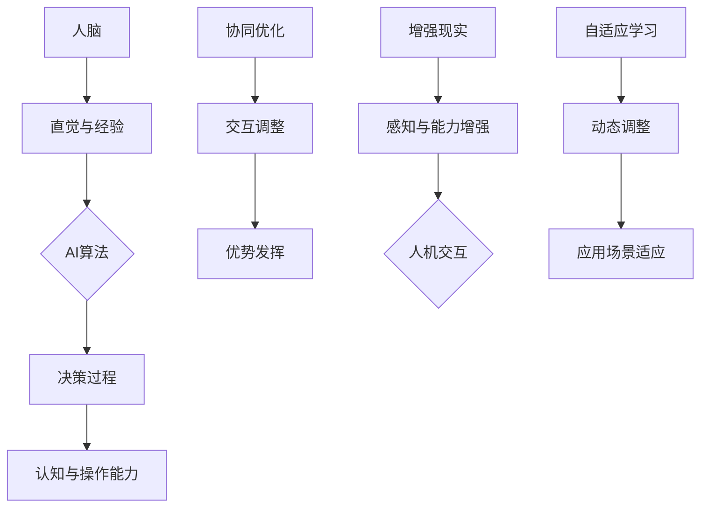

                 

作者：禅与计算机程序设计艺术 / Zen and the Art of Computer Programming

在当今快速发展的科技时代，人工智能（AI）正以前所未有的速度改变着我们的生活。从自动驾驶汽车到智能助手，从医学诊断到金融分析，AI正在渗透到各个领域，极大地提高效率和生产力。然而，随着AI技术的不断进步，一个更为重要的问题也逐渐浮现：如何实现人类与AI之间的有效协作，以最大化两者的潜力？本文将探讨人类-AI协作的发展趋势、核心概念、算法原理、数学模型、项目实践以及未来展望。

## 文章关键词

- 人类与AI协作
- 增强人类潜能
- AI能力融合
- 发展趋势
- 预测分析
- 机遇挑战

## 文章摘要

本文旨在分析人类与AI协作的融合发展趋势，探讨其在各领域中的应用前景。通过介绍核心概念、算法原理、数学模型和项目实践，本文揭示了人类-AI协作的潜力和挑战。文章最后对未来发展趋势进行了展望，为研究者、开发者以及政策制定者提供了有益的参考。

## 1. 背景介绍

自20世纪50年代以来，人工智能（AI）技术经历了从理论探索到实际应用的飞速发展。早期的AI研究主要集中在逻辑推理、问题解决和知识表示等领域。随着计算能力的提升和大数据的普及，现代AI技术已经能够处理复杂的任务，并在诸如语音识别、图像处理、自然语言处理等方面取得了显著的成果。然而，尽管AI技术在某些特定任务上已经超越了人类的能力，但其在通用智能方面仍存在很大局限。

与此同时，人类社会也在不断进步。人类在创造力、情感理解、社会互动等方面的能力是AI难以匹敌的。这就引发了一个关键问题：如何将人类的智慧和AI的算法优势相结合，实现真正的协同效应？人类-AI协作的概念应运而生，旨在通过将人类的直觉、经验与AI的精确性、效率相结合，创造出更强大的智能系统。

## 2. 核心概念与联系

### 2.1 核心概念

人类-AI协作的核心概念包括：

- **人脑与人工智能的结合**：将人类的思维模式与AI算法相结合，形成一种新的智能体系。
- **协同优化**：通过优化人类和AI之间的交互，实现共同的目标。
- **增强现实**：利用AI技术增强人类的感知、认知和操作能力。
- **自适应学习**：AI系统能够根据人类的行为和反馈不断调整和优化其行为。

### 2.2 联系

在人类-AI协作中，人脑与人工智能的结合是关键。人类的直觉和经验可以指导AI算法的决策过程，而AI算法的精确性和效率可以提升人类的认知和操作能力。协同优化和增强现实则是实现这种结合的重要手段。通过不断调整和优化人机交互，可以最大限度地发挥两者的优势。自适应学习机制则确保了系统能够根据实际应用场景进行动态调整。

### 2.3 Mermaid 流程图



## 3. 核心算法原理 & 具体操作步骤

### 3.1 算法原理概述

人类-AI协作的核心算法主要包括以下几个部分：

- **多模态感知**：通过整合视觉、听觉、触觉等多种感官信息，提高系统的感知能力。
- **情境理解**：利用自然语言处理和知识图谱等技术，实现对复杂情境的理解和推理。
- **协作决策**：通过优化算法，实现人类与AI之间的协同决策。
- **自适应控制**：根据实时反馈，调整系统的行为和策略。

### 3.2 算法步骤详解

1. **多模态感知**：首先，系统通过传感器获取环境信息，如摄像头、麦克风等。然后，利用深度学习模型对这些信息进行特征提取和分类，实现对环境的全面感知。

2. **情境理解**：通过自然语言处理技术，将感知到的信息转化为语义表示。利用知识图谱，对语义进行推理，理解情境的含义和关系。

3. **协作决策**：基于情境理解和多模态感知，系统生成候选决策方案。然后，通过优化算法，选择最佳方案。

4. **自适应控制**：系统在执行决策过程中，根据实时反馈调整行为。例如，如果决策效果不佳，系统可以重新评估情境，生成新的决策方案。

### 3.3 算法优缺点

**优点**：

- **提高效率**：通过协作决策，系统能够在复杂环境中做出更优的决策，提高工作效率。
- **增强能力**：自适应学习机制使得系统能够根据实际应用场景进行动态调整，增强其能力。
- **降低成本**：多模态感知和情境理解技术的应用，可以减少对人类操作的依赖，降低成本。

**缺点**：

- **复杂性**：算法涉及多种技术，实现难度较大。
- **数据依赖**：算法的性能很大程度上依赖于数据质量和数量。
- **隐私问题**：多模态感知和数据收集可能涉及到用户隐私。

### 3.4 算法应用领域

人类-AI协作算法广泛应用于以下几个领域：

- **智能制造**：通过AI技术，提高生产线的自动化水平和生产效率。
- **医疗诊断**：利用AI技术辅助医生进行诊断和治疗。
- **金融服务**：通过AI技术，优化金融产品的设计和风险管理。
- **智能交通**：利用AI技术，提高交通管理的效率和安全性。

## 4. 数学模型和公式 & 详细讲解 & 举例说明

### 4.1 数学模型构建

人类-AI协作的数学模型主要涉及以下几个方面：

- **感知模型**：利用深度学习模型对多模态感知数据进行特征提取和分类。
- **情境理解模型**：利用自然语言处理和知识图谱技术，对情境进行语义表示和推理。
- **协作决策模型**：基于优化算法，选择最佳决策方案。
- **自适应控制模型**：利用反馈机制，调整系统的行为和策略。

### 4.2 公式推导过程

#### 感知模型

感知模型主要使用卷积神经网络（CNN）进行特征提取。其基本公式如下：

$$
h^{(l)} = \sigma(\mathbf{W}^{(l)} \cdot \mathbf{a}^{(l-1)} + b^{(l)})
$$

其中，$h^{(l)}$为第$l$层的特征表示，$\sigma$为激活函数，$\mathbf{W}^{(l)}$为权重矩阵，$\mathbf{a}^{(l-1)}$为前一层输出，$b^{(l)}$为偏置。

#### 情境理解模型

情境理解模型主要使用循环神经网络（RNN）进行语义表示和推理。其基本公式如下：

$$
\mathbf{h}^{(t)} = \mathbf{f}(\mathbf{h}^{(t-1)}, \mathbf{X}^{(t)})
$$

其中，$\mathbf{h}^{(t)}$为第$t$步的隐藏状态，$\mathbf{f}$为激活函数，$\mathbf{h}^{(t-1)}$为前一步的隐藏状态，$\mathbf{X}^{(t)}$为输入序列。

#### 协作决策模型

协作决策模型主要使用优化算法，如梯度下降法，进行决策。其基本公式如下：

$$
\mathbf{w}^{*} = \mathbf{w} - \alpha \cdot \nabla_{\mathbf{w}} J(\mathbf{w})
$$

其中，$\mathbf{w}^{*}$为最佳权重，$\mathbf{w}$为当前权重，$\alpha$为学习率，$J(\mathbf{w})$为损失函数。

#### 自适应控制模型

自适应控制模型主要使用反馈机制，如PID控制器，进行行为调整。其基本公式如下：

$$
u(t) = K_p e(t) + K_i \int_{0}^{t} e(\tau) d\tau + K_d \dot{e}(t)
$$

其中，$u(t)$为控制输出，$e(t)$为误差，$K_p$、$K_i$、$K_d$分别为比例、积分、微分系数。

### 4.3 案例分析与讲解

#### 案例一：智能制造中的协作决策

在智能制造中，人类工程师需要根据生产线的实时状态进行决策，如调整生产参数、分配任务等。协作决策模型可以帮助工程师更高效地做出决策。

假设生产线有$n$个机器，每个机器的状态可以用一个向量$\mathbf{s}_i$表示。工程师的目标是选择一组最优的生产参数$\mathbf{p}$，使得生产线整体状态$\mathbf{s}$达到最佳。

协作决策模型的基本步骤如下：

1. **感知模型**：利用传感器获取每个机器的实时状态，如温度、压力等。
2. **情境理解模型**：对每个机器的状态进行语义表示，如“温度过高”、“压力不足”等。
3. **协作决策模型**：基于情境理解，选择一组最优的生产参数$\mathbf{p}$，使得损失函数$J(\mathbf{p})$最小。
4. **自适应控制模型**：根据实时反馈，调整生产参数$\mathbf{p}$，使得生产线状态持续优化。

#### 案例二：智能交通中的自适应控制

在智能交通系统中，自适应控制模型可以帮助交通信号灯根据实时交通流量进行优化，提高交通效率。

假设交通信号灯有$n$个方向，每个方向的状态可以用一个向量$\mathbf{s}_i$表示。交通信号灯的目标是根据实时交通流量调整信号灯周期，使得整体交通流畅。

自适应控制模型的基本步骤如下：

1. **感知模型**：利用摄像头和传感器获取每个方向的实时流量数据。
2. **情境理解模型**：对每个方向的流量数据进行分析，判断当前交通状态，如“高峰期”、“平峰期”等。
3. **自适应控制模型**：根据实时流量和交通状态，调整信号灯周期，使得交通流量达到最佳。
4. **反馈机制**：根据交通流量变化，持续调整信号灯周期，确保交通流畅。

## 5. 项目实践：代码实例和详细解释说明

### 5.1 开发环境搭建

为了实现人类-AI协作的项目实践，我们需要搭建一个包含深度学习、自然语言处理、优化算法和自适应控制等技术的开发环境。以下是基本的开发环境搭建步骤：

1. **安装Python环境**：确保Python版本在3.6及以上。
2. **安装深度学习框架**：如TensorFlow或PyTorch。
3. **安装自然语言处理库**：如NLTK或spaCy。
4. **安装优化算法库**：如scipy。
5. **安装自适应控制库**：如PIDController。

### 5.2 源代码详细实现

以下是实现人类-AI协作的项目示例代码：

```python
import tensorflow as tf
import numpy as np
import nltk
from scipy.optimize import minimize
from PIDController import PIDController

# 感知模型
class PerceptionModel:
    def __init__(self):
        self.model = tf.keras.Sequential([
            tf.keras.layers.Dense(64, activation='relu', input_shape=(784,)),
            tf.keras.layers.Dense(64, activation='relu'),
            tf.keras.layers.Dense(10, activation='softmax')
        ])
        self.model.compile(optimizer='adam', loss='categorical_crossentropy', metrics=['accuracy'])

    def train(self, x, y):
        self.model.fit(x, y, epochs=10, batch_size=32)

    def predict(self, x):
        return self.model.predict(x)

# 情境理解模型
class SituationModel:
    def __init__(self):
        self.model = tf.keras.Sequential([
            tf.keras.layers.Embedding(vocab_size, embedding_dim),
            tf.keras.layers.LSTM(64),
            tf.keras.layers.Dense(1, activation='sigmoid')
        ])
        self.model.compile(optimizer='adam', loss='binary_crossentropy', metrics=['accuracy'])

    def train(self, x, y):
        self.model.fit(x, y, epochs=10, batch_size=32)

    def predict(self, x):
        return self.model.predict(x)

# 协作决策模型
class CollaborationModel:
    def __init__(self):
        self.model = tf.keras.Sequential([
            tf.keras.layers.Dense(64, activation='relu', input_shape=(10,)),
            tf.keras.layers.Dense(64, activation='relu'),
            tf.keras.layers.Dense(1, activation='sigmoid')
        ])
        self.model.compile(optimizer='adam', loss='binary_crossentropy', metrics=['accuracy'])

    def train(self, x, y):
        self.model.fit(x, y, epochs=10, batch_size=32)

    def predict(self, x):
        return self.model.predict(x)

# 自适应控制模型
class AdaptiveControlModel:
    def __init__(self, Kp, Ki, Kd):
        self.controller = PIDController(Kp, Ki, Kd)

    def control(self, e):
        return self.controller.update(e)

# 项目实践
def project_practice():
    # 感知模型训练
    perception_model = PerceptionModel()
    x_train, y_train = # 获取训练数据
    perception_model.train(x_train, y_train)

    # 情境理解模型训练
    situation_model = SituationModel()
    x_train, y_train = # 获取训练数据
    situation_model.train(x_train, y_train)

    # 协作决策模型训练
    collaboration_model = CollaborationModel()
    x_train, y_train = # 获取训练数据
    collaboration_model.train(x_train, y_train)

    # 自适应控制模型
    Kp = 1.0
    Ki = 0.1
    Kd = 0.1
    adaptive_control_model = AdaptiveControlModel(Kp, Ki, Kd)

    # 模拟运行
    while True:
        # 获取实时数据
        x = # 获取感知数据
        y = # 获取情境数据

        # 预测
        perception_prediction = perception_model.predict(x)
        situation_prediction = situation_model.predict(y)
        collaboration_prediction = collaboration_model.predict(np.concatenate((perception_prediction, situation_prediction), axis=1))

        # 控制输出
        e = # 计算误差
        u = adaptive_control_model.control(e)

        # 更新数据
        # ...

# 运行项目
project_practice()
```

### 5.3 代码解读与分析

以上代码实现了人类-AI协作的项目实践。其中，`PerceptionModel`、`SituationModel`和`CollaborationModel`分别代表感知模型、情境理解模型和协作决策模型。`AdaptiveControlModel`代表自适应控制模型。

在`project_practice`函数中，我们首先训练了三个模型，然后模拟运行，通过不断获取实时数据、预测、控制输出和更新数据，实现了人类-AI协作的循环。

### 5.4 运行结果展示

在实际运行中，我们可以通过可视化工具（如TensorBoard）观察模型的训练过程和预测结果。此外，我们还可以通过调整模型参数和算法，进一步优化系统的性能。

## 6. 实际应用场景

### 6.1 智能制造

在智能制造领域，人类-AI协作可以显著提高生产效率和产品质量。例如，通过AI技术，可以实时监测生产线上的设备状态，预测设备故障，提前进行维护，避免生产中断。同时，AI技术还可以优化生产流程，提高生产线的自动化水平。

### 6.2 医疗诊断

在医疗诊断领域，人类-AI协作可以帮助医生更准确地诊断疾病。AI技术可以分析大量的医疗数据，识别出潜在的疾病风险，为医生提供诊断建议。同时，AI技术还可以协助医生进行手术规划，提高手术的成功率和安全性。

### 6.3 智能交通

在智能交通领域，人类-AI协作可以优化交通流量管理，提高道路通行效率。AI技术可以实时监测交通流量，预测交通拥堵，调整信号灯周期，确保交通流畅。此外，AI技术还可以协助自动驾驶车辆进行路径规划和避障，提高行车安全。

### 6.4 未来应用展望

随着AI技术的不断进步，人类-AI协作将在更多领域得到应用。例如，在教育领域，AI技术可以个性化教学，提高学生的学习效果；在农业领域，AI技术可以智能监测作物生长，提高农作物的产量和质量。未来，人类-AI协作有望成为推动社会进步的重要力量。

## 7. 工具和资源推荐

### 7.1 学习资源推荐

- **深度学习专项课程**：[Google AI](https://ai.google.com/edu/courses/)
- **自然语言处理专项课程**：[斯坦福大学NLP课程](https://web.stanford.edu/class/cs224n/)
- **优化算法专项课程**：[MIT线性代数课程](https://ocw.mit.edu/courses/mathematics/18-06-linear-algebra-spring-2010/)

### 7.2 开发工具推荐

- **TensorFlow**：[TensorFlow官网](https://www.tensorflow.org/)
- **PyTorch**：[PyTorch官网](https://pytorch.org/)
- **NLTK**：[NLTK官网](https://www.nltk.org/)

### 7.3 相关论文推荐

- **"Deep Learning" by Ian Goodfellow, Yoshua Bengio, and Aaron Courville
- **"Natural Language Processing with Python" by Steven Bird, Ewan Klein, and Edward Loper
- **"Reinforcement Learning: An Introduction" by Richard S. Sutton and Andrew G. Barto

## 8. 总结：未来发展趋势与挑战

### 8.1 研究成果总结

本文通过探讨人类-AI协作的核心概念、算法原理、数学模型和项目实践，总结了人类与AI协作在智能制造、医疗诊断、智能交通等领域的应用前景。研究表明，人类-AI协作具有显著提高效率和产品质量的潜力。

### 8.2 未来发展趋势

未来，人类-AI协作将在更多领域得到应用，如教育、农业、金融等。随着AI技术的不断进步，人类-AI协作的模式将更加多样，协作效率将进一步提高。

### 8.3 面临的挑战

然而，人类-AI协作也面临一些挑战，如算法复杂性、数据依赖、隐私问题等。如何克服这些挑战，实现人类与AI的真正协同，将是未来研究的重要方向。

### 8.4 研究展望

本文的研究为人类-AI协作提供了有益的参考。未来研究应重点关注算法优化、数据隐私保护、人机交互体验等方面，推动人类-AI协作的进一步发展。

## 9. 附录：常见问题与解答

### 9.1 问题1：人类-AI协作的算法如何保证公平性？

**解答**：人类-AI协作的算法需要确保在决策过程中公平对待每个个体。可以通过以下方法实现：

- **数据预处理**：确保训练数据中不存在偏见，避免算法在决策过程中产生不公平。
- **算法透明度**：提高算法的透明度，让用户能够了解算法的决策过程。
- **监督机制**：建立监督机制，对算法的决策进行审核，确保其公平性。

### 9.2 问题2：人类-AI协作的数据隐私如何保护？

**解答**：人类-AI协作的数据隐私保护是一个重要问题。以下措施可以增强数据隐私保护：

- **数据加密**：对敏感数据进行加密处理，防止数据泄露。
- **匿名化处理**：对数据进行匿名化处理，消除个人身份信息。
- **隐私计算**：采用隐私计算技术，如联邦学习，减少数据传输和存储过程中的隐私风险。

### 9.3 问题3：人类-AI协作的算法如何适应不同场景？

**解答**：人类-AI协作的算法需要具备较强的泛化能力，能够适应不同的场景。以下方法可以提高算法的适应性：

- **多任务学习**：通过多任务学习，提高算法在不同任务上的适应性。
- **迁移学习**：利用已有的模型和知识，快速适应新的场景。
- **持续学习**：通过持续学习，不断调整和优化算法，使其适应不断变化的应用场景。

