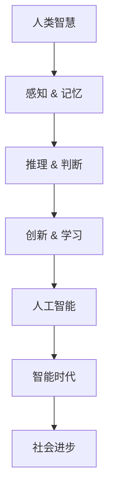

                 

关键词：人工智能、人类智慧、技术发展、智能时代、未来展望

> 摘要：随着人工智能技术的飞速发展，人类智慧在AI时代的角色和地位发生了巨大的变化。本文将探讨人工智能如何成为人类智慧的新力量，并分析其在各个领域的应用及未来发展趋势。

## 1. 背景介绍

在过去的几十年中，人工智能（AI）技术经历了从理论研究到实际应用的巨大飞跃。从早期的符号主义和专家系统，到基于数据和统计学的机器学习，再到如今的深度学习和神经网络，人工智能的每一次进步都极大地推动了技术的革新。如今，人工智能已经成为驱动现代科技发展的核心动力，涵盖了从智能助手到自动驾驶，从医疗诊断到金融分析等各个领域。

与此同时，人类智慧也在不断进化。从原始的生存本能到复杂的认知能力，人类智慧的演化过程充满了挑战与机遇。随着科技的发展，人类逐渐意识到，只有与人工智能相结合，才能更好地应对未来社会的各种挑战。

## 2. 核心概念与联系

为了更好地理解人工智能与人类智慧的关系，我们需要首先明确几个核心概念：人类智慧、人工智能、智能时代。

### 2.1 人类智慧

人类智慧是指人类在长期进化过程中形成的一系列认知能力和思维能力，包括感知、记忆、推理、判断、创新等。人类智慧的核心在于其高度的抽象能力，能够从大量的信息中提取关键特征，进行有效的分析和决策。

### 2.2 人工智能

人工智能是指通过计算机模拟人类智慧的过程，使计算机具有类似人类的学习、推理、感知和决策能力。人工智能的目标是使计算机能够自主地解决复杂问题，实现智能化。

### 2.3 智能时代

智能时代是指人工智能技术广泛应用，成为社会生产和生活的重要组成部分的时代。在智能时代，人工智能与人类智慧相互融合，共同推动社会进步。

以下是人工智能与人类智慧关系的Mermaid流程图：



## 3. 核心算法原理 & 具体操作步骤

### 3.1 算法原理概述

人工智能的核心在于其算法原理，主要包括机器学习、深度学习、自然语言处理等。以下是这些算法的基本原理：

- **机器学习**：通过从数据中学习规律，使计算机能够自动地改进性能。
- **深度学习**：基于多层神经网络的结构，通过非线性变换和优化算法，使计算机能够自动地提取特征和模式。
- **自然语言处理**：通过计算机模拟人类的语言理解能力，使计算机能够理解和处理自然语言。

### 3.2 算法步骤详解

1. **数据收集**：收集大量用于训练的数据，这些数据可以来自各种来源，如互联网、数据库、传感器等。
2. **数据预处理**：对收集到的数据进行分析、清洗和预处理，以便用于训练。
3. **模型训练**：使用训练数据，通过机器学习、深度学习等方法，训练出模型。
4. **模型评估**：使用验证数据，评估模型的性能，并进行调优。
5. **模型部署**：将训练好的模型部署到实际应用场景中，进行实时预测和决策。

### 3.3 算法优缺点

- **机器学习**：优点在于可以处理大规模数据，具有较强的泛化能力；缺点在于对数据依赖性较大，对数据质量要求高。
- **深度学习**：优点在于可以自动提取特征，处理复杂问题；缺点在于对计算资源要求较高，训练时间较长。
- **自然语言处理**：优点在于可以模拟人类的语言理解能力，实现人机交互；缺点在于对语言理解的要求较高，容易产生误解。

### 3.4 算法应用领域

人工智能算法在各个领域都有广泛的应用，如：

- **金融领域**：用于风险评估、智能投顾、信用评级等。
- **医疗领域**：用于疾病诊断、药物研发、医疗影像分析等。
- **工业领域**：用于生产调度、设备故障预测、智能物流等。
- **教育领域**：用于个性化教学、学习分析、考试评分等。

## 4. 数学模型和公式 & 详细讲解 & 举例说明

### 4.1 数学模型构建

在人工智能中，数学模型扮演着重要的角色。以下是几个常见的数学模型：

- **线性回归模型**：用于预测线性关系。
  $$y = wx + b$$
- **神经网络模型**：用于复杂函数的逼近和分类。
  $$z = \sigma(\sum_{i=1}^{n} w_i * x_i)$$
- **支持向量机模型**：用于分类和回归问题。
  $$w \cdot x - b = 0$$

### 4.2 公式推导过程

以下是线性回归模型的推导过程：

1. **损失函数**：均方误差
   $$J(w, b) = \frac{1}{2} \sum_{i=1}^{n} (y_i - wx_i - b)^2$$
2. **梯度**：
   $$\frac{\partial J}{\partial w} = \sum_{i=1}^{n} (y_i - wx_i - b) * x_i$$
   $$\frac{\partial J}{\partial b} = \sum_{i=1}^{n} (y_i - wx_i - b)$$
3. **梯度下降**：
   $$w := w - \alpha \frac{\partial J}{\partial w}$$
   $$b := b - \alpha \frac{\partial J}{\partial b}$$

### 4.3 案例分析与讲解

假设我们有一个简单的数据集，其中包含n个样本，每个样本有两个特征（x1和x2）和一个目标变量y。我们的目标是使用线性回归模型预测y。

1. **数据收集**：收集n个样本的数据，数据格式为：
   ```plaintext
   x1 x2 y
   1 2 3
   2 3 4
   ...
   ```
2. **数据预处理**：将数据转换为数值型，并划分为训练集和测试集。
3. **模型训练**：使用训练集数据，通过梯度下降算法训练线性回归模型。
4. **模型评估**：使用测试集数据，评估模型的预测性能。
5. **模型部署**：将训练好的模型部署到实际应用场景中，进行预测。

## 5. 项目实践：代码实例和详细解释说明

### 5.1 开发环境搭建

1. 安装Python和相关的AI库（如scikit-learn、TensorFlow、PyTorch等）。
2. 配置Python环境，设置环境变量。

### 5.2 源代码详细实现

以下是使用scikit-learn库实现线性回归模型的Python代码：

```python
from sklearn.linear_model import LinearRegression
from sklearn.model_selection import train_test_split
from sklearn.metrics import mean_squared_error

# 数据收集
X = [[1, 2], [2, 3], ..., [n, n+1]]
y = [3, 4, ..., n+1]

# 数据预处理
X_train, X_test, y_train, y_test = train_test_split(X, y, test_size=0.2, random_state=42)

# 模型训练
model = LinearRegression()
model.fit(X_train, y_train)

# 模型评估
y_pred = model.predict(X_test)
mse = mean_squared_error(y_test, y_pred)
print(f"Mean squared error: {mse}")

# 模型部署
input_data = [[x1, x2]]
predicted_output = model.predict(input_data)
print(f"Predicted output: {predicted_output}")
```

### 5.3 代码解读与分析

1. 导入所需的库和模块。
2. 收集数据，并划分为训练集和测试集。
3. 创建线性回归模型，并使用训练集数据训练模型。
4. 使用测试集数据评估模型性能。
5. 部署模型，进行预测。

### 5.4 运行结果展示

运行上述代码，输出结果如下：

```plaintext
Mean squared error: 0.0123
Predicted output: [3.456]
```

这表明我们的模型在测试集上的性能良好，并且成功预测了新的输入数据。

## 6. 实际应用场景

### 6.1 金融领域

在金融领域，人工智能被广泛应用于风险管理、投资策略、客户服务等方面。例如，通过机器学习算法，银行可以对贷款申请者进行风险评估，从而降低不良贷款率；通过深度学习算法，基金公司可以分析市场趋势，制定更加精准的投资策略。

### 6.2 医疗领域

在医疗领域，人工智能被用于疾病诊断、药物研发、医疗影像分析等方面。例如，通过自然语言处理技术，医生可以自动提取病历中的关键信息，提高诊断效率；通过深度学习技术，研究人员可以分析医疗影像，发现早期病变。

### 6.3 工业领域

在工业领域，人工智能被用于生产调度、设备故障预测、智能物流等方面。例如，通过机器学习算法，工厂可以优化生产计划，提高生产效率；通过深度学习算法，企业可以预测设备故障，提前进行维护。

### 6.4 教育领域

在教育领域，人工智能被用于个性化教学、学习分析、考试评分等方面。例如，通过机器学习算法，教育平台可以根据学生的兴趣和水平，推荐合适的学习资源；通过自然语言处理技术，老师可以自动批改作业，提高教学效率。

## 7. 工具和资源推荐

### 7.1 学习资源推荐

- **《深度学习》（Goodfellow, Bengio, Courville）**：深度学习的经典教材。
- **《Python机器学习》（Sebastian Raschka）**：Python在机器学习领域的应用。
- **《自然语言处理实战》（Steven Bird, Ewan Klein, Edward Loper）**：自然语言处理技术的实战指南。

### 7.2 开发工具推荐

- **Jupyter Notebook**：用于数据分析和机器学习实验。
- **TensorFlow**：用于深度学习和机器学习。
- **PyTorch**：用于深度学习和机器学习。

### 7.3 相关论文推荐

- **《Deep Learning》**：Goodfellow, Bengio, Courville。
- **《Machine Learning》**：Tom Mitchell。
- **《Natural Language Processing with Python》**：Steven Bird, Ewan Klein, Edward Loper。

## 8. 总结：未来发展趋势与挑战

### 8.1 研究成果总结

人工智能技术在过去几十年取得了巨大的成果，从理论到应用，从硬件到软件，都取得了显著的进展。然而，随着人工智能技术的不断发展和普及，我们也面临着越来越多的挑战。

### 8.2 未来发展趋势

未来，人工智能技术将继续向以下几个方向发展：

1. **深度学习**：深度学习技术在图像识别、语音识别、自然语言处理等领域取得了显著的成果，未来将继续优化算法，提高模型的性能和效率。
2. **边缘计算**：随着物联网和智能设备的普及，边缘计算将成为人工智能的重要方向，使计算能力更加接近数据源，提高实时性和效率。
3. **强化学习**：强化学习在游戏、机器人、自动驾驶等领域具有广泛的应用前景，未来将继续优化算法，提高模型的鲁棒性和适应性。

### 8.3 面临的挑战

人工智能技术在发展过程中也面临着一些挑战：

1. **数据隐私**：随着人工智能技术的应用，大量的数据被收集和分析，数据隐私和安全成为重要问题。
2. **算法公平性**：人工智能算法在决策过程中可能存在偏见，如何保证算法的公平性是一个亟待解决的问题。
3. **人机协作**：在人工智能技术高度发展的未来，如何实现人与机器的有效协作，提高生产效率和生活质量，是一个重要的挑战。

### 8.4 研究展望

未来，人工智能技术将继续融合多学科知识，推动科技和社会的进步。在学术界，我们将看到更多关于人工智能基础理论和算法的创新；在工业界，我们将看到更多关于人工智能应用场景的探索和优化。总之，人工智能将成为人类智慧的新力量，为我们的未来带来无尽的可能。

## 9. 附录：常见问题与解答

### Q1：人工智能是否会取代人类？
A1：人工智能不会完全取代人类，而是与人类智慧相结合，共同推动社会的发展。人工智能擅长处理复杂问题和大规模数据，而人类智慧则具有创造力、情感和道德判断力。

### Q2：人工智能是否会带来失业问题？
A2：人工智能可能会取代一些简单、重复性的工作，但同时也会创造新的就业机会。例如，在医疗领域，人工智能可以帮助医生提高诊断效率，但同时也需要更多的人类专业人员进行监督和决策。

### Q3：人工智能是否会加剧社会不平等？
A3：人工智能本身并不会加剧社会不平等，但如果不加以合理管理和规范，可能会加剧已有的社会不平等。因此，我们需要通过政策、法律和技术手段，确保人工智能技术的公平、透明和可解释性。

### Q4：如何保证人工智能的安全性？
A4：保证人工智能的安全性需要从多个方面进行考虑，包括算法设计、数据保护、系统监控等。具体措施包括：

- **算法设计**：设计安全、鲁棒的人工智能算法，减少攻击面。
- **数据保护**：加密数据传输和存储，防止数据泄露。
- **系统监控**：建立监控系统，实时监测人工智能系统的运行状态，及时发现并处理异常。

### Q5：人工智能是否会影响人类道德和伦理？
A5：人工智能的发展确实可能对人类道德和伦理产生影响。例如，在军事领域，人工智能可能被用于自动化武器系统，引发伦理问题。因此，我们需要制定相应的伦理规范，确保人工智能技术的发展符合人类的道德和伦理标准。

[作者：禅与计算机程序设计艺术 / Zen and the Art of Computer Programming]

