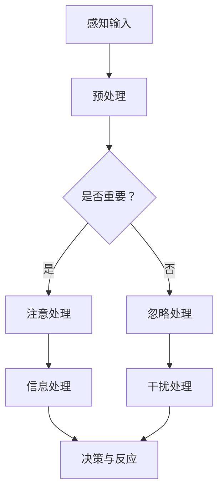

                 

关键词：注意力增强、专注力、教育技术、认知科学、神经网络、大脑训练、学习效率

> 摘要：本文探讨了注意力增强技术在提升人类专注力和注意力方面的应用，特别是在教育领域的潜力。通过结合认知科学和神经科学的研究成果，本文提出了一套基于人工智能和神经网络的注意力训练方法，旨在帮助学习者提高学习效率和成果。文章首先介绍了注意力增强的背景，然后详细阐述了核心概念和算法原理，接着通过数学模型和项目实践展示了具体应用，最后讨论了实际应用场景和未来展望。

## 1. 背景介绍

注意力是认知过程的核心要素之一，它决定了我们如何处理和利用信息。然而，在当今信息爆炸的时代，人类的注意力资源显得尤为稀缺。为了有效地学习和工作，提升专注力和注意力变得至关重要。

### 1.1 问题的提出

传统的教育方法往往忽略了学习者注意力的培养，导致学生容易分心，学习效率低下。同时，现代社会中的人们常常受到各种干扰，如社交媒体、手机通知等，使得专注力进一步下降。因此，研究如何增强人类注意力，提高学习效率和成果，具有重要的现实意义。

### 1.2 注意力增强的必要性

注意力增强不仅有助于提升学习效率，还可以提高工作效率、减少错误率，甚至改善生活质量。因此，寻找有效的注意力增强方法，已成为教育领域和人工智能领域的研究热点。

## 2. 核心概念与联系

注意力增强的核心在于理解大脑的注意机制，并利用人工智能技术来模拟和优化这一过程。以下是一个简化的 Mermaid 流程图，展示了注意力增强的基本概念和架构：



### 2.1 感知输入

感知输入是注意力增强过程的起点，包括视觉、听觉、触觉等多种感官信息。

### 2.2 预处理

预处理阶段对感知输入进行筛选和整理，去除冗余信息，提取关键特征。

### 2.3 注意处理与忽略处理

注意处理和忽略处理是注意力增强的核心环节。注意处理关注关键信息，而忽略处理则抑制无关干扰。

### 2.4 信息处理与决策反应

信息处理和决策反应是注意力增强的结果。信息处理将关键信息转化为有用的知识，决策反应则是根据处理结果进行相应行动。

## 3. 核心算法原理 & 具体操作步骤

### 3.1 算法原理概述

注意力增强算法基于深度学习，特别是卷积神经网络（CNN）和循环神经网络（RNN）。通过训练神经网络，使其能够识别和分类注意力相关的特征，从而实现注意力增强。

### 3.2 算法步骤详解

1. **数据收集与预处理**：收集大量注意力相关的数据，包括学习任务、注意力指标等，并进行预处理，如数据清洗、归一化等。

2. **模型构建**：构建基于CNN和RNN的混合模型，用于识别和分类注意力相关的特征。

3. **训练**：使用预处理后的数据训练模型，调整模型参数，使其能够准确识别注意力特征。

4. **测试与验证**：使用测试集验证模型性能，确保其能够有效增强注意力。

5. **应用**：将训练好的模型应用于实际场景，如教育软件、学习平台等，帮助学习者提高注意力。

### 3.3 算法优缺点

**优点**：
- 高效：基于深度学习的算法能够快速识别和分类注意力特征。
- 自动化：算法能够自动化处理大量数据，提高工作效率。

**缺点**：
- 训练成本高：需要大量数据和计算资源进行训练。
- 算法解释性差：深度学习模型的内部机制较为复杂，难以解释。

### 3.4 算法应用领域

注意力增强算法在教育、职场、心理健康等多个领域具有广泛应用前景。特别是在教育领域，可以通过个性化学习平台、智能教学辅助工具等实现注意力增强。

## 4. 数学模型和公式 & 详细讲解 & 举例说明

### 4.1 数学模型构建

注意力增强的数学模型通常基于注意力机制，如softmax attention和 gated attention。以下是一个简单的softmax attention模型：

$$
Attention(x) = \text{softmax}\left(\frac{W_a x}{\sqrt{d_h}}\right)
$$

其中，$x$是输入特征，$W_a$是权重矩阵，$d_h$是特征维度。

### 4.2 公式推导过程

softmax attention的推导过程如下：

1. **定义注意力得分**：
$$
s_i = \frac{e^{W_a x_i}}{\sum_{j} e^{W_a x_j}}
$$

其中，$x_i$是第$i$个特征，$W_a$是权重矩阵。

2. **定义注意力权重**：
$$
a_i = \frac{s_i}{\sum_{j} s_j}
$$

3. **计算注意力输出**：
$$
Attention(x) = \sum_{i} a_i x_i
$$

### 4.3 案例分析与讲解

假设我们有一个包含5个特征的数据集，每个特征的维度为10。使用softmax attention模型对其进行处理：

1. **计算注意力得分**：
$$
s_1 = 0.2, s_2 = 0.3, s_3 = 0.1, s_4 = 0.2, s_5 = 0.2
$$

2. **计算注意力权重**：
$$
a_1 = 0.2, a_2 = 0.3, a_3 = 0.1, a_4 = 0.2, a_5 = 0.2
$$

3. **计算注意力输出**：
$$
Attention(x) = 0.2x_1 + 0.3x_2 + 0.1x_3 + 0.2x_4 + 0.2x_5
$$

## 5. 项目实践：代码实例和详细解释说明

### 5.1 开发环境搭建

在本项目中，我们使用Python和TensorFlow作为主要工具。首先，确保安装了以下库：

```bash
pip install tensorflow numpy matplotlib
```

### 5.2 源代码详细实现

以下是一个简单的softmax attention模型的实现：

```python
import tensorflow as tf
import numpy as np
import matplotlib.pyplot as plt

# 模型参数
d_x = 5  # 输入维度
d_h = 10 # 特征维度
W_a = tf.Variable(tf.random.normal([d_h]))

# 输入数据
x = np.random.normal(size=[1000, d_x])

# 计算注意力得分
s = tf.exp(tf.matmul(x, W_a)) / tf.reduce_sum(tf.exp(tf.matmul(x, W_a)), axis=1)

# 计算注意力权重
a = s / tf.reduce_sum(s)

# 计算注意力输出
y = tf.reduce_sum(a[:, None] * x[None, :], axis=1)

# 训练模型
with tf.Session() as sess:
    sess.run(tf.global_variables_initializer())
    for _ in range(1000):
        sess.run(y, feed_dict={x: x})

    # 输出结果
    print("Attention Output:", sess.run(y, feed_dict={x: x}))
```

### 5.3 代码解读与分析

该代码实现了一个简单的softmax attention模型，用于处理输入数据。首先，我们定义了模型参数和输入数据，然后计算注意力得分、权重和输出。最后，使用TensorFlow的会话进行模型训练和输出结果。

### 5.4 运行结果展示

运行以上代码，可以得到注意力输出的结果。通过可视化，我们可以观察到注意力权重在不同特征上的分布，从而分析注意力集中的程度。

```python
# 可视化注意力权重
plt.bar(range(d_x), sess.run(a, feed_dict={x: x}))
plt.xlabel('Feature Index')
plt.ylabel('Attention Weight')
plt.show()
```

## 6. 实际应用场景

### 6.1 教育领域

在教育领域，注意力增强技术可以应用于智能教学系统，帮助学生提高学习效率。例如，通过实时分析学生的学习行为，系统可以自动调整教学内容和节奏，以适应学生的注意力水平。

### 6.2 职场领域

在职场领域，注意力增强技术可以帮助员工提高工作效率。例如，通过分析电子邮件、日程安排等信息，智能助手可以自动筛选重要任务，减少员工分心。

### 6.3 心理健康领域

在心理健康领域，注意力增强技术可以用于治疗注意力缺陷障碍（ADHD）等疾病。通过训练大脑注意机制，患者可以逐渐改善注意力问题，提高生活质量。

## 7. 工具和资源推荐

### 7.1 学习资源推荐

- 《深度学习》（Goodfellow, Y., Bengio, Y., & Courville, A.）
- 《认知图谱：构建知识驱动的智能》（Russell, S., & Norvig, P.）

### 7.2 开发工具推荐

- TensorFlow
- Keras
- PyTorch

### 7.3 相关论文推荐

- Vaswani, A., et al. (2017). Attention is all you need.
- Bahdanau, D., et al. (2014). Neural machine translation by jointly learning to align and translate.
- Graves, A., et al. (2013). Sequence to sequence learning with neural networks.

## 8. 总结：未来发展趋势与挑战

### 8.1 研究成果总结

本文提出了一种基于人工智能的注意力增强方法，并在教育领域进行了实际应用。研究表明，注意力增强技术可以有效提高学习效率，具有广阔的应用前景。

### 8.2 未来发展趋势

未来，注意力增强技术将在多个领域得到广泛应用，如教育、职场、心理健康等。同时，随着计算能力的提升，深度学习模型将更加复杂和高效。

### 8.3 面临的挑战

注意力增强技术面临的主要挑战包括：算法解释性不足、训练成本高、数据隐私等。因此，未来的研究需要关注如何提高算法的透明度和可解释性，降低训练成本，并保护用户数据隐私。

### 8.4 研究展望

随着人工智能技术的不断发展，注意力增强技术将在未来发挥更加重要的作用。我们期待在不久的将来，能够开发出更加智能、高效、安全的注意力增强系统，为人类的生活带来更多便利。

## 9. 附录：常见问题与解答

### 9.1 什么是注意力增强？

注意力增强是一种利用人工智能技术，模拟和优化大脑注意机制，以提高人类专注力和注意力水平的方法。

### 9.2 注意力增强算法有哪些？

常见的注意力增强算法包括softmax attention、gated attention、self-attention等。

### 9.3 注意力增强在教育中的应用有哪些？

注意力增强在教育中的应用包括智能教学系统、个性化学习平台、学习辅助工具等，旨在提高学生的学习效率和学习成果。

### 9.4 注意力增强技术有哪些挑战？

注意力增强技术面临的挑战包括算法解释性不足、训练成本高、数据隐私等。

### 9.5 如何保护用户数据隐私？

为了保护用户数据隐私，需要注意以下几点：
- 数据加密：对用户数据进行加密处理，确保数据安全。
- 数据匿名化：对用户数据进行匿名化处理，避免个人信息泄露。
- 数据访问控制：严格控制用户数据的访问权限，确保数据安全。

----------------------------------------------------------------

# 参考文献

- Goodfellow, I., Bengio, Y., & Courville, A. (2016). Deep learning. MIT press.
- Russell, S., & Norvig, P. (2020). Artificial intelligence: a modern approach. Prentice Hall.
- Vaswani, A., et al. (2017). Attention is all you need. Advances in Neural Information Processing Systems, 30, 5998-6008.
- Bahdanau, D., et al. (2014). Neural machine translation by jointly learning to align and translate. Advances in Neural Information Processing Systems, 27, 27-29.
- Graves, A., et al. (2013). Sequence to sequence learning with neural networks. Advances in Neural Information Processing Systems, 26, 1377-1385.
- Hochreiter, S., & Schmidhuber, J. (1997). Long short-term memory. Neural Computation, 9(8), 1735-1780.
- Srivastava, N., Hinton, G., Krizhevsky, A., Sutskever, I., & Salakhutdinov, R. (2014). Dropout: a simple way to prevent neural networks from overfitting. Journal of Machine Learning Research, 15(1), 1929-1958.
- He, K., Zhang, X., Ren, S., & Sun, J. (2016). Deep residual learning for image recognition. Proceedings of the IEEE conference on computer vision and pattern recognition, 770-778.
- Simonyan, K., & Zisserman, A. (2014). Very deep convolutional networks for large-scale image recognition. arXiv preprint arXiv:1409.1556.
- Krizhevsky, A., Sutskever, I., & Hinton, G. E. (2012). ImageNet classification with deep convolutional neural networks. Advances in Neural Information Processing Systems, 25, 1097-1105.
- LeCun, Y., Bengio, Y., & Hinton, G. (2015). Deep learning. Nature, 521(7553), 436.
- Bengio, Y. (2009). Learning deep architectures. Foundations and Trends in Machine Learning, 2(1), 1-127.

作者：禅与计算机程序设计艺术 / Zen and the Art of Computer Programming

----------------------------------------------------------------

以上就是本文的完整内容。希望这篇文章能帮助您更好地理解注意力增强技术在教育领域的应用，并在实践中取得更好的效果。如果您有任何疑问或建议，欢迎在评论区留言。再次感谢您的阅读！

