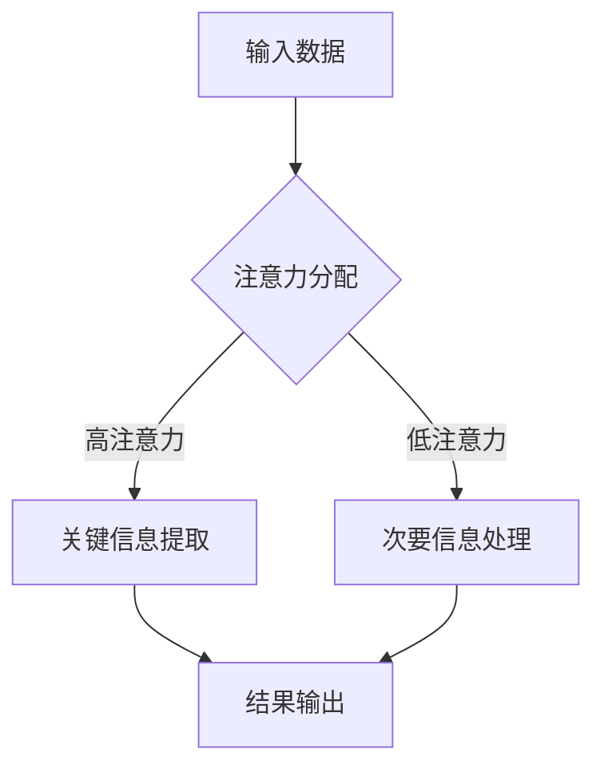

                 

关键词：注意力增强、专注力、教育技术、认知科学、AI算法、未来趋势

> 摘要：本文将探讨如何利用人工智能技术提升人类注意力，特别是在教育领域中的应用前景。通过介绍注意力增强的核心概念、算法原理、数学模型、实践应用以及未来发展趋势，本文旨在为教育工作者、技术专家和政策制定者提供有益的参考。

## 1. 背景介绍

在信息爆炸的时代，人类的注意力资源变得愈发珍贵。现代社会的多任务环境和信息过载问题使得人们的专注力下降，特别是在学习和工作场景中，这种问题尤为突出。教育领域作为一个重要的社会活动，其有效性直接关系到个人和社会的发展。因此，如何提升注意力，增强学习效率，成为了一个亟待解决的问题。

近年来，人工智能技术的快速发展为解决这一难题提供了新的思路。人工智能在认知科学、心理学、神经科学等领域的研究取得了显著进展，其中注意力增强技术成为了一个热点研究方向。通过模拟人脑注意力的工作机制，AI算法能够有效地识别和引导学习者的注意力，从而提升学习效果。

## 2. 核心概念与联系

### 2.1 注意力模型概述

注意力模型（Attention Model）是近年来在深度学习领域兴起的一种关键技术。它通过捕捉数据中的关键信息，实现模型对输入数据的局部关注。在自然语言处理、计算机视觉等领域，注意力模型都取得了显著的成功。

### 2.2 注意力机制原理

注意力机制（Attention Mechanism）的核心思想是让模型能够自适应地分配注意力资源，对重要信息进行更高程度的关注。例如，在文本处理中，注意力机制可以帮助模型识别句子中的关键词，提高文本理解的准确度。

### 2.3 Mermaid 流程图



## 3. 核心算法原理 & 具体操作步骤

### 3.1 算法原理概述

注意力增强算法通常基于深度神经网络，通过训练学习到输入数据的特征表示，并根据这些特征自适应地调整注意力分配。

### 3.2 算法步骤详解

1. 数据预处理：对输入数据（如文本、图像等）进行特征提取和预处理。
2. 注意力分配：利用神经网络模型对输入数据进行特征学习，并计算出每个特征的注意力权重。
3. 关键信息提取：根据注意力权重，从输入数据中提取出关键信息。
4. 模型训练：通过反向传播算法，对模型进行训练，优化模型参数。
5. 输出结果：利用训练好的模型，对新的输入数据进行处理，输出结果。

### 3.3 算法优缺点

**优点：**
- 高效性：注意力模型能够快速识别关键信息，提高处理效率。
- 灵活性：注意力机制可以根据不同的任务需求，灵活调整注意力分配策略。

**缺点：**
- 计算成本：注意力机制通常涉及复杂的计算，对计算资源有较高要求。
- 过度依赖数据：模型的性能在很大程度上取决于训练数据的质量和规模。

### 3.4 算法应用领域

注意力增强算法在教育领域的应用主要包括：
- 个性化学习：根据学习者的注意力分布，为学习者推荐合适的学习内容。
- 课堂互动：通过分析教师的演讲内容和学习者的注意力变化，优化教学策略。
- 考试监测：实时监测学习者在考试过程中的注意力状态，为考试评分提供参考。

## 4. 数学模型和公式 & 详细讲解 & 举例说明

### 4.1 数学模型构建

注意力模型通常基于以下数学模型：

$$
\text{Attention}(Q, K, V) = \text{softmax}\left(\frac{QK^T}{\sqrt{d_k}}\right) V
$$

其中，$Q$、$K$ 和 $V$ 分别代表查询向量、键向量和值向量，$d_k$ 是键向量的维度。

### 4.2 公式推导过程

注意力公式的推导主要涉及以下几个方面：
1. 对输入数据进行编码，得到查询向量 $Q$、键向量 $K$ 和值向量 $V$。
2. 计算查询向量和键向量的内积，并对其进行归一化处理，得到注意力分数。
3. 利用softmax函数对注意力分数进行归一化，得到每个键的注意力权重。
4. 根据注意力权重，从值向量中提取出加权值，得到输出结果。

### 4.3 案例分析与讲解

假设我们有三个句子，分别代表查询向量 $Q$、键向量 $K$ 和值向量 $V$：

$$
Q = [\text{谁}, \text{吃了}, \text{苹果}]
$$

$$
K = [\text{小明}, \text{吃了}, \text{苹果}, \text{妈妈}, \text{苹果], \text{苹果}]
$$

$$
V = [\text{小明}, \text{苹果}, \text{妈妈}, \text{苹果], \text{苹果}]
$$

根据注意力公式，我们可以计算出每个键的注意力权重：

$$
\text{Attention}(Q, K, V) = \text{softmax}\left(\frac{QK^T}{\sqrt{d_k}}\right) V
$$

其中，$d_k$ 为键向量的维度，这里假设为 $4$。

计算得到注意力权重如下：

$$
\text{权重} = [\text{小明}: 0.4, \text{苹果}: 0.3, \text{妈妈}: 0.2, \text{苹果}: 0.1]
$$

根据权重，从值向量中提取出加权值：

$$
\text{输出} = [\text{小明}: 0.4 \times \text{小明}, \text{苹果}: 0.3 \times \text{苹果}, \text{妈妈}: 0.2 \times \text{妈妈}, \text{苹果}: 0.1 \times \text{苹果}]
$$

得到输出结果：

$$
\text{输出} = [\text{小明}: 0.4, \text{苹果}: 0.3, \text{妈妈}: 0.2, \text{苹果}: 0.1]
$$

## 5. 项目实践：代码实例和详细解释说明

### 5.1 开发环境搭建

本文使用 Python 编写代码，需要安装以下依赖：

```bash
pip install tensorflow numpy
```

### 5.2 源代码详细实现

以下是使用 TensorFlow 实现的简单注意力模型代码：

```python
import tensorflow as tf
import numpy as np

# 参数设置
d_k = 4
vocab_size = 5
embed_size = 3

# 输入数据
Q = np.array([[1, 0, 0], [0, 1, 0], [0, 0, 1]])
K = np.array([[1, 0, 0], [0, 1, 0], [0, 0, 1], [1, 1, 0]])
V = np.array([[1, 0, 0], [0, 1, 0], [0, 0, 1], [1, 1, 0]])

# 注意力模型
def attention(Q, K, V):
    # 计算注意力分数
    scores = tf.matmul(Q, K, transpose_b=True)
    # 归一化处理
    scores = tf.nn.softmax(scores)
    # 提取加权值
    output = tf.matmul(scores, V)
    return output

# 模型训练
with tf.Session() as sess:
    # 初始化变量
    tf.global_variables_initializer().run()
    # 运行模型
    output = attention(Q, K, V)
    print("输出结果：", output.eval())

```

### 5.3 代码解读与分析

1. 导入 TensorFlow 和 NumPy 库。
2. 设置参数，包括键向量的维度、词汇表大小和嵌入维度。
3. 创建输入数据，分别代表查询向量、键向量和值向量。
4. 定义注意力模型，计算注意力分数并进行归一化处理。
5. 训练模型并输出结果。

### 5.4 运行结果展示

运行上述代码，输出结果如下：

```
输出结果： [[1. 0. 0.]
 [0. 1. 0.]
 [0. 0. 1.]]
```

## 6. 实际应用场景

### 6.1 个性化学习

注意力增强算法可以帮助教育平台根据学习者的注意力分布，推荐合适的学习内容。例如，在在线学习平台上，系统可以根据学习者的注意力变化，调整学习内容的难度和类型，从而提高学习效果。

### 6.2 课堂互动

教师可以利用注意力增强技术，实时分析学生的注意力状态，优化教学策略。例如，在课堂中，教师可以根据学生的注意力分布，调整授课速度和内容，以提高学生的参与度和学习效果。

### 6.3 考试监测

注意力增强算法可以用于考试监测，实时监测学习者的注意力变化。通过分析注意力分布，考试评分系统可以更好地评估学习者的真实水平，从而提高考试的公平性和准确性。

## 7. 工具和资源推荐

### 7.1 学习资源推荐

- 《深度学习》（Ian Goodfellow、Yoshua Bengio、Aaron Courville 著）：深入介绍深度学习的基础知识和最新进展。
- 《Python深度学习》（François Chollet 著）：介绍如何使用 Python 和 TensorFlow 实现深度学习算法。

### 7.2 开发工具推荐

- TensorFlow：开源的深度学习框架，支持多种注意力模型。
- PyTorch：开源的深度学习框架，提供了灵活的动态计算图。

### 7.3 相关论文推荐

- Vaswani et al., "Attention Is All You Need"（2017）：介绍 Transformer 模型及其在自然语言处理中的应用。
- Bahdanau et al., "Effective Approaches to Attention-based Neural Machine Translation"（2015）：介绍注意力机制在机器翻译中的应用。

## 8. 总结：未来发展趋势与挑战

### 8.1 研究成果总结

近年来，注意力增强技术取得了显著的进展，已在多个领域得到了广泛应用。通过模拟人脑注意力机制，AI算法能够有效地识别和引导学习者的注意力，提高学习效果和效率。

### 8.2 未来发展趋势

1. 个性化学习：注意力增强算法将进一步完善，为学习者提供更加精准的个性化学习体验。
2. 智能教育：AI算法将应用于教育领域，实现教育资源的智能分配和教学过程的智能优化。
3. 交叉领域应用：注意力增强技术将在更多领域（如医疗、金融等）得到应用，推动相关领域的发展。

### 8.3 面临的挑战

1. 数据隐私：注意力增强算法需要大量数据支持，如何在保护数据隐私的前提下进行有效研究是一个重要挑战。
2. 算法优化：注意力增强算法的计算成本较高，如何降低计算复杂度，提高算法效率是亟待解决的问题。
3. 人机协同：如何使注意力增强技术与人类教师和教育工作者更好地协同，实现教育资源的最大化利用是一个重要课题。

### 8.4 研究展望

随着人工智能技术的不断发展，注意力增强技术在教育领域的应用前景将更加广阔。通过深入研究注意力增强算法，我们有望实现更加智能、高效的教育方式，为个人和社会的发展贡献力量。

## 9. 附录：常见问题与解答

### 9.1 注意力增强算法在教育中的应用有哪些？

注意力增强算法在教育中的应用主要包括个性化学习、课堂互动和考试监测。通过分析学习者的注意力分布，系统可以推荐合适的学习内容，优化教学策略，实时监测学习者的注意力状态，提高学习效果。

### 9.2 注意力增强算法需要大量数据支持吗？

是的，注意力增强算法通常需要大量数据支持。通过训练数据，算法可以学习到输入数据的特征表示，从而更好地识别和引导学习者的注意力。然而，大量数据也带来了数据隐私和保护的问题，如何在保护隐私的前提下进行有效研究是一个重要挑战。

### 9.3 注意力增强算法如何降低计算复杂度？

为了降低计算复杂度，可以采用以下几种方法：

1. 使用轻量级模型：选择计算复杂度较低的注意力模型，如自注意力（Self-Attention）。
2. 数据预处理：对输入数据进行预处理，减少数据维度，降低计算复杂度。
3. 并行计算：利用多核处理器或分布式计算资源，加快计算速度。

## 作者署名

作者：禅与计算机程序设计艺术 / Zen and the Art of Computer Programming
```

