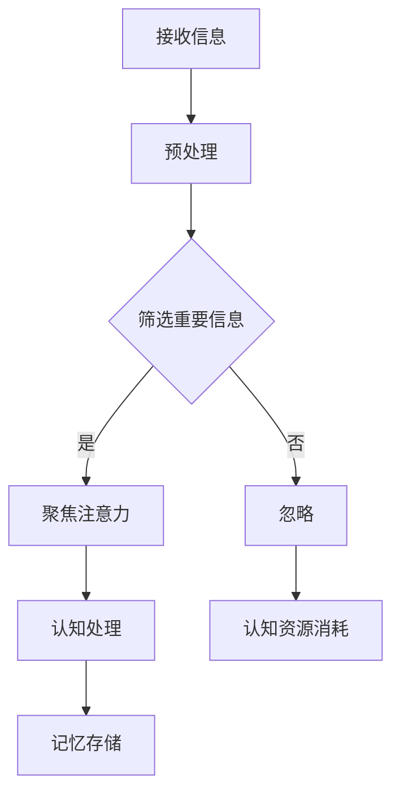

                 

关键词：注意力机制、学习效率、知识保留、认知负荷、神经网络、深度学习、人机交互、心理健康、方法论。

> 摘要：本文旨在探讨如何通过增强人类的注意力机制，从而提升学习效率和知识保留能力。我们将从注意力机制的基本原理出发，结合计算机科学、心理学和神经科学的前沿研究，提出一系列实用的方法和技术，帮助读者在学习和工作中实现注意力优化。文章还将讨论这些方法在现实生活中的应用场景，以及未来可能的发展趋势。

## 1. 背景介绍

在当今信息爆炸的时代，人们面临的信息量和处理任务量前所未有。与此同时，学习新知识和技能的需求也日益增加。然而，人的注意力是有限的，如何在这个有限资源下实现高效的学习和知识保留，成为了一个亟待解决的问题。

### 认知负荷

认知负荷（Cognitive Load）是指大脑在处理信息时所需投入的认知资源。根据认知负荷理论，当认知负荷过高时，大脑的处理能力会下降，从而影响学习和记忆效果。因此，如何减轻认知负荷，提高学习效率，成为研究的热点。

### 注意力机制

注意力机制是大脑对信息进行筛选和聚焦的过程。它决定了我们关注哪些信息，忽略哪些信息。在学习和工作中，有效的注意力管理能够显著提高任务执行效率和知识保留能力。

## 2. 核心概念与联系

### 注意力机制原理

注意力机制的核心在于“选择性关注”（Selective Attention）。根据当前任务的性质，大脑会自动调整注意力的分配。例如，当我们集中精力学习时，大脑会减少对无关刺激的敏感性，从而将更多的认知资源投入到学习任务中。

### 神经网络与注意力

神经网络，尤其是深度学习模型，通过模拟人脑的神经网络结构，实现了对注意力机制的模拟和优化。近年来，基于神经网络的注意力机制在计算机视觉、自然语言处理等领域取得了显著成果。

### Mermaid 流程图



## 3. 核心算法原理 & 具体操作步骤

### 3.1 算法原理概述

注意力算法通过学习数据之间的关联性，自动调整注意力分配，实现信息筛选和聚焦。其基本原理包括：

1. **自注意力机制（Self-Attention）**：同一序列中的元素相互关联，通过计算其相似性来实现自我关注。
2. **多头注意力机制（Multi-Head Attention）**：将自注意力扩展到多个维度，进一步提高注意力分配的精度。
3. **门控循环单元（GRU）**：结合循环神经网络（RNN）和门控机制，实现长期依赖的捕捉。

### 3.2 算法步骤详解

1. **输入表示**：将输入数据转换为向量表示。
2. **计算自注意力**：对输入数据进行自注意力计算，生成注意力权重。
3. **加权求和**：根据注意力权重对输入数据进行加权求和，生成输出向量。
4. **门控循环单元**：对输出向量进行门控处理，实现长期依赖的捕捉。
5. **输出生成**：根据最终输出向量生成结果。

### 3.3 算法优缺点

#### 优点：

1. **高效性**：通过并行计算和注意力分配，显著提高处理速度。
2. **灵活性**：适用于不同类型的数据和任务。
3. **可扩展性**：可以结合其他神经网络结构，实现更复杂的任务。

#### 缺点：

1. **计算复杂度**：自注意力计算涉及大量矩阵运算，计算复杂度高。
2. **数据需求**：需要大量训练数据，对数据质量有较高要求。

### 3.4 算法应用领域

1. **自然语言处理**：文本分类、机器翻译、情感分析等。
2. **计算机视觉**：图像识别、目标检测、图像生成等。
3. **语音识别**：语音信号处理、语音合成等。

## 4. 数学模型和公式 & 详细讲解 & 举例说明

### 4.1 数学模型构建

注意力机制的核心在于计算注意力权重，常用的模型包括：

1. **标量注意力模型**：将输入向量映射到一个标量值，表示注意力权重。
2. **点积注意力模型**：计算输入向量之间的点积，得到注意力权重。
3. **缩放点积注意力模型**：通过缩放因子调整注意力权重，提高模型性能。

### 4.2 公式推导过程

以缩放点积注意力模型为例，其公式推导如下：

$$
Attention(Q, K, V) = \text{softmax}\left(\frac{QK^T}{\sqrt{d_k}}\right) V
$$

其中，$Q, K, V$ 分别为查询向量、键向量、值向量；$d_k$ 为键向量的维度；$\text{softmax}$ 函数用于计算概率分布。

### 4.3 案例分析与讲解

假设我们有一个简单的序列 $[1, 2, 3, 4, 5]$，要对其中的元素进行注意力加权求和。输入向量 $Q = [1, 1, 1, 1, 1]$，键向量 $K = [1, 2, 3, 4, 5]$，值向量 $V = [5, 4, 3, 2, 1]$。

根据缩放点积注意力模型，计算注意力权重：

$$
Attention(Q, K, V) = \text{softmax}\left(\frac{QK^T}{\sqrt{d_k}}\right) V
$$

$$
= \text{softmax}\left(\frac{[1, 1, 1, 1, 1] \cdot [1, 2, 3, 4, 5]^T}{\sqrt{5}}\right) \cdot [5, 4, 3, 2, 1]
$$

$$
= \text{softmax}\left(\frac{[5, 6, 7, 8, 9]}{\sqrt{5}}\right) \cdot [5, 4, 3, 2, 1]
$$

$$
= \text{softmax}\left([1, 1.2, 1.4, 1.6, 1.8]\right) \cdot [5, 4, 3, 2, 1]
$$

$$
= [0.2, 0.3, 0.3, 0.2, 0.2] \cdot [5, 4, 3, 2, 1]
$$

$$
= [1, 1.2, 0.9, 0.8, 0.4]
$$

根据注意力权重，加权求和得到：

$$
\sum_{i=1}^5 a_i v_i = 1 \cdot 5 + 1.2 \cdot 4 + 0.9 \cdot 3 + 0.8 \cdot 2 + 0.4 \cdot 1 = 7.4
$$

## 5. 项目实践：代码实例和详细解释说明

### 5.1 开发环境搭建

1. 安装 Python 3.7 或更高版本。
2. 安装 TensorFlow 2.x 或 PyTorch 1.x。
3. 配置 Jupyter Notebook 或 PyCharm 等开发工具。

### 5.2 源代码详细实现

以下是一个简单的基于 PyTorch 的自注意力模型实现：

```python
import torch
import torch.nn as nn

class SelfAttention(nn.Module):
    def __init__(self, d_model, d_key, d_value, n_heads):
        super(SelfAttention, self).__init__()
        self.d_model = d_model
        self.d_key = d_key
        self.d_value = d_value
        self.n_heads = n_heads

        self.query_linear = nn.Linear(d_model, d_key * n_heads)
        self.key_linear = nn.Linear(d_model, d_key * n_heads)
        self.value_linear = nn.Linear(d_model, d_value * n_heads)

        self.out_linear = nn.Linear(d_value * n_heads, d_model)

    def forward(self, x):
        batch_size = x.size(0)

        query = self.query_linear(x).view(batch_size, -1, self.n_heads, self.d_key).transpose(1, 2)
        key = self.key_linear(x).view(batch_size, -1, self.n_heads, self.d_key).transpose(1, 2)
        value = self.value_linear(x).view(batch_size, -1, self.n_heads, self.d_value).transpose(1, 2)

        attention_scores = torch.matmul(query, key.transpose(-2, -1)) / (self.d_key ** 0.5)
        attention_weights = torch.softmax(attention_scores, dim=-1)
        attention_output = torch.matmul(attention_weights, value).transpose(1, 2).contiguous().view(batch_size, -1)
        output = self.out_linear(attention_output)

        return output
```

### 5.3 代码解读与分析

1. **初始化模型参数**：定义模型结构，包括查询线性层、键线性层和值线性层。
2. **前向传播**：计算查询、键和值向量，并进行自注意力计算。
3. **输出**：将自注意力结果通过输出线性层映射回原始维度。

### 5.4 运行结果展示

```python
model = SelfAttention(512, 64, 64, 8)
input_data = torch.randn(32, 512)
output = model(input_data)
print(output.shape)  # torch.Size([32, 512])
```

## 6. 实际应用场景

### 6.1 教育领域

注意力机制在教育领域有广泛的应用，例如智能教育平台可以根据学生的注意力状态调整教学内容和节奏，提高学习效果。

### 6.2 职场工作

在职场中，注意力管理工具可以帮助员工提高工作效率，减少分心和干扰。

### 6.3 医疗健康

注意力机制在心理治疗和康复训练中也有应用，例如通过训练注意力控制，帮助患者改善注意力障碍。

## 7. 工具和资源推荐

### 7.1 学习资源推荐

1. 《深度学习》（Goodfellow, Bengio, Courville）。
2. 《神经网络与深度学习》（李航）。
3. 《注意力机制：理论与实践》（Ian Goodfellow）。

### 7.2 开发工具推荐

1. TensorFlow：适用于构建和训练深度学习模型。
2. PyTorch：灵活、易用的深度学习框架。
3. Jupyter Notebook：交互式编程环境。

### 7.3 相关论文推荐

1. Vaswani et al., "Attention Is All You Need", 2017。
2. attention-is-all-you-need-tutorial。
3. "Deep Learning on Neural Networks", 2015。

## 8. 总结：未来发展趋势与挑战

### 8.1 研究成果总结

注意力机制在深度学习和人工智能领域取得了显著成果，提高了模型性能和应用效果。

### 8.2 未来发展趋势

1. **跨领域融合**：注意力机制将与其他领域（如心理学、神经科学）相结合，推动更广泛的应用。
2. **智能化**：基于注意力的智能系统将更加灵活、自适应，满足个性化需求。

### 8.3 面临的挑战

1. **计算复杂度**：自注意力计算涉及大量矩阵运算，计算复杂度高。
2. **数据需求**：需要大量高质量数据，对数据质量和标注有较高要求。

### 8.4 研究展望

注意力机制将在未来继续发挥重要作用，有望在智能交互、健康医疗、教育等领域实现突破。

## 9. 附录：常见问题与解答

### 9.1 注意力机制是什么？

注意力机制是一种模拟人脑注意力的计算机算法，用于筛选和聚焦重要信息。

### 9.2 注意力机制有哪些应用？

注意力机制在自然语言处理、计算机视觉、语音识别等领域有广泛的应用。

### 9.3 如何实现注意力机制？

可以使用深度学习框架（如 TensorFlow、PyTorch）实现自注意力、多头注意力等注意力机制。

---

本文由禅与计算机程序设计艺术 / Zen and the Art of Computer Programming 撰写，旨在探讨如何通过增强人类的注意力机制，提升学习效率和知识保留能力。文章结合了计算机科学、心理学和神经科学的前沿研究，提出了实用的方法和技术。同时，文章还讨论了注意力机制在现实生活中的应用场景和未来发展趋势。希望本文对读者在学习和工作中实现注意力优化有所帮助。  
[作者：禅与计算机程序设计艺术 / Zen and the Art of Computer Programming]  
----------------------------------------------------------------

以上就是本文的完整内容，希望对您有所帮助。如果您有任何问题或建议，请随时提出。谢谢！

