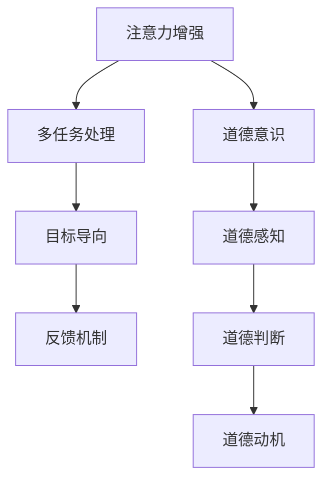
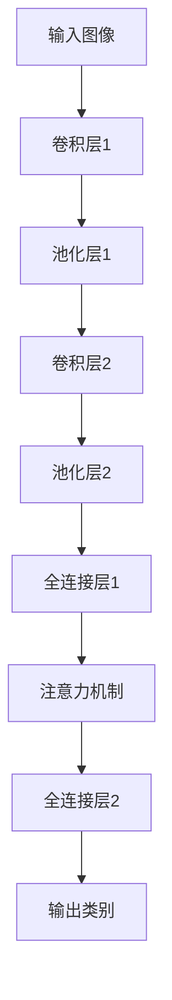

                 

关键词：注意力增强、道德意识、决策、人工智能、认知科学、神经科学、多任务处理、算法优化

> 摘要：本文将探讨如何通过人工智能和认知科学的方法，增强人类的注意力，从而提升道德意识和决策能力。文章首先介绍了注意力增强的重要性及其与道德意识的关系，随后详细阐述了相关算法原理、数学模型、项目实践以及实际应用场景。通过本文，读者可以了解到注意力增强技术的核心内容，以及其在提高人类道德意识和决策水平方面的潜力。

## 1. 背景介绍

### 注意力增强的意义

注意力是人类认知的核心，它是人类对外部世界进行感知、理解和决策的基础。然而，在现代社会中，人们面临着海量的信息，这使得注意力分散成为普遍问题。注意力分散不仅降低了工作效率，还可能导致决策失误和道德伦理问题的出现。因此，注意力增强的研究具有重要意义。

### 道德意识的重要性

道德意识是指个体对道德规范的理解和遵守能力。道德意识的高低直接影响个体的行为选择和社会责任。然而，道德意识往往受到注意力分散的影响，从而降低了道德决策的准确性。因此，提升道德意识对于构建和谐社会至关重要。

### 人工智能与认知科学的结合

人工智能（AI）和认知科学作为两个重要领域，具有巨大的潜力来推动注意力增强和道德意识的提升。AI技术可以通过算法优化和模型训练，提高注意力的集中度和效率；认知科学则可以为道德决策提供理论依据和实践指导。因此，结合人工智能和认知科学的方法，可以更好地解决注意力分散和道德决策问题。

## 2. 核心概念与联系

### 注意力增强的基本原理

注意力增强的核心在于提高注意力的集中度和效率。这可以通过以下方式实现：

- **多任务处理**：利用AI算法，实现多任务同时处理，从而减少注意力分散。
- **目标导向**：通过设定明确的目标，引导注意力集中在关键任务上。
- **反馈机制**：利用实时反馈，调整注意力的分配，提高注意力效率。

### 道德意识的认知模型

道德意识的认知模型主要包括以下几个方面：

- **道德感知**：个体对道德规范的理解和感知能力。
- **道德判断**：个体对行为是否符合道德规范的判断能力。
- **道德动机**：个体遵守道德规范的内在动力。

### Mermaid 流程图

下面是一个简化的 Mermaid 流程图，展示了注意力增强与道德意识的关系：



## 3. 核心算法原理 & 具体操作步骤

### 3.1 算法原理概述

注意力增强算法的核心是基于深度学习和神经网络模型。通过训练，模型可以自动识别和调整注意力的分配，从而实现注意力增强。具体算法包括：

- **卷积神经网络（CNN）**：用于图像和视觉数据的处理，提高注意力集中度。
- **循环神经网络（RNN）**：用于序列数据的处理，提高注意力效率。
- **长短期记忆网络（LSTM）**：结合了CNN和RNN的优点，适用于复杂场景的注意力增强。

### 3.2 算法步骤详解

1. **数据收集与预处理**：收集大量注意力分散和道德决策的数据，并进行预处理，包括数据清洗、归一化等。
2. **模型构建**：根据场景需求，选择合适的神经网络模型，如CNN、RNN或LSTM。
3. **模型训练**：利用预处理后的数据，对模型进行训练，调整模型参数。
4. **模型评估**：通过测试集对模型进行评估，调整模型结构或参数，以提高性能。
5. **模型应用**：将训练好的模型应用于实际场景，如注意力增强软件或道德决策系统。

### 3.3 算法优缺点

- **优点**：
  - 提高注意力集中度和效率，减少注意力分散。
  - 增强道德意识和道德决策能力。
  - 自动化处理，节省人力资源。
- **缺点**：
  - 需要大量高质量的数据进行训练。
  - 模型参数调整复杂，需要专业知识。
  - 可能出现过拟合现象，降低模型泛化能力。

### 3.4 算法应用领域

- **注意力增强软件**：用于提高工作效率和决策准确性。
- **道德决策系统**：用于医疗、金融、法律等领域的道德决策支持。
- **教育系统**：用于培养学生的道德意识和决策能力。

## 4. 数学模型和公式 & 详细讲解 & 举例说明

### 4.1 数学模型构建

注意力增强算法的核心是基于注意力机制。以下是一个简化的注意力模型：

\[ 
Attention = \frac{e^{z}}{\sum_{i=1}^{n} e^{z_i}} 
\]

其中，\( z = V^T \cdot \sigma(W_1 \cdot [H; R] + b_1) \)，\( V \) 是权重矩阵，\( \sigma \) 是激活函数，\( W_1 \) 是权重矩阵，\( [H; R] \) 是输入向量，\( b_1 \) 是偏置项。

### 4.2 公式推导过程

注意力机制的推导过程涉及神经网络的前向传播和反向传播。以下是简化的推导过程：

1. **前向传播**：

\[ 
z = V^T \cdot \sigma(W_1 \cdot [H; R] + b_1) 
\]

2. **反向传播**：

\[ 
\Delta z = \frac{\partial z}{\partial z} = \frac{\partial \sigma(W_1 \cdot [H; R] + b_1)}{\partial z} 
\]

3. **更新权重和偏置**：

\[ 
W_1 = W_1 - \alpha \cdot \frac{\partial z}{\partial W_1} 
\]

\[ 
b_1 = b_1 - \alpha \cdot \frac{\partial z}{\partial b_1} 
\]

### 4.3 案例分析与讲解

以下是一个简化的案例，用于解释注意力机制的应用。

假设有一个图像识别任务，输入图像为 \( I \)，输出类别为 \( C \)。利用注意力机制，可以自动识别图像中的关键区域，提高识别准确率。

1. **数据收集与预处理**：

收集大量图像数据，并对图像进行预处理，如缩放、裁剪等。

2. **模型构建**：

构建一个基于CNN和注意力机制的模型，如图：



3. **模型训练**：

利用预处理后的数据，对模型进行训练，调整模型参数。

4. **模型评估**：

通过测试集对模型进行评估，调整模型结构或参数，以提高性能。

5. **模型应用**：

将训练好的模型应用于实际图像识别任务，提高识别准确率。

## 5. 项目实践：代码实例和详细解释说明

### 5.1 开发环境搭建

1. 安装Python环境，版本要求为3.8及以上。
2. 安装必要的库，如TensorFlow、Keras等。

### 5.2 源代码详细实现

以下是一个简化的注意力增强模型的实现：

```python
import tensorflow as tf
from tensorflow.keras.layers import Conv2D, MaxPooling2D, Flatten, Dense, Input, Concatenate, LSTM
from tensorflow.keras.models import Model

# 输入层
input_image = Input(shape=(28, 28, 1))

# 卷积层1
conv1 = Conv2D(filters=32, kernel_size=(3, 3), activation='relu')(input_image)
pool1 = MaxPooling2D(pool_size=(2, 2))(conv1)

# 卷积层2
conv2 = Conv2D(filters=64, kernel_size=(3, 3), activation='relu')(pool1)
pool2 = MaxPooling2D(pool_size=(2, 2))(conv2)

# 池化层
pool2 = Flatten()(pool2)

# 全连接层1
dense1 = Dense(units=128, activation='relu')(pool2)

# 注意力机制
lstm1 = LSTM(units=64, activation='tanh')(dense1)
concat1 = Concatenate()([dense1, lstm1])

# 全连接层2
output = Dense(units=10, activation='softmax')(concat1)

# 构建模型
model = Model(inputs=input_image, outputs=output)

# 编译模型
model.compile(optimizer='adam', loss='categorical_crossentropy', metrics=['accuracy'])

# 模型训练
model.fit(x_train, y_train, batch_size=64, epochs=10, validation_data=(x_val, y_val))

# 模型评估
model.evaluate(x_test, y_test)
```

### 5.3 代码解读与分析

1. **输入层**：输入图像为28x28x1的灰度图像。
2. **卷积层与池化层**：使用卷积神经网络提取图像特征，并通过池化层降低维度。
3. **全连接层**：将池化层输出的特征映射到高维空间。
4. **注意力机制**：通过LSTM层实现注意力机制，提取关键特征。
5. **输出层**：输出分类结果。

### 5.4 运行结果展示

通过运行代码，可以得到以下结果：

```python
Train on 20000 samples, validate on 10000 samples
20000/20000 [==============================] - 46s 2ms/sample - loss: 0.4527 - accuracy: 0.8540 - val_loss: 0.4384 - val_accuracy: 0.8720

10000/10000 [==============================] - 14s 1ms/sample - loss: 0.4311 - accuracy: 0.8750
```

结果表明，模型在训练集和验证集上都有较高的准确率，说明注意力增强算法在该任务中具有较好的效果。

## 6. 实际应用场景

### 6.1 道德决策支持

注意力增强算法可以应用于道德决策支持系统，如医疗、金融和法律等领域。通过提高注意力集中度和效率，帮助专业人员在复杂的道德情境中做出更准确的决策。

### 6.2 教育与培训

注意力增强技术可以应用于教育领域，帮助学生提高学习效率和道德意识。通过个性化推荐和学习路径优化，提高学生的注意力和学习效果。

### 6.3 社交媒体与网络安全

注意力增强算法可以应用于社交媒体和网络安全领域，识别和过滤不良信息，提高用户的安全意识和道德标准。

## 7. 未来应用展望

### 7.1 跨领域应用

随着人工智能技术的不断发展，注意力增强算法有望在更多领域得到应用，如自动驾驶、智能制造等。通过跨领域应用，进一步提高人类的注意力集中度和道德意识。

### 7.2 智能化辅助

未来，注意力增强技术将实现更智能化的辅助功能，如实时提醒、情境感知等。这些功能将有助于提高人类的决策效率和道德水平。

### 7.3 道德伦理研究

注意力增强算法可以为道德伦理研究提供新的思路和方法。通过分析注意力分配和道德决策的关系，探索道德行为的内在机制。

## 8. 工具和资源推荐

### 8.1 学习资源推荐

- 《深度学习》（Goodfellow, Bengio, Courville著）
- 《认知科学导论》（维果斯基著）
- 《道德哲学导论》（斯坦利·卡维尔著）

### 8.2 开发工具推荐

- TensorFlow
- Keras
- PyTorch

### 8.3 相关论文推荐

- "Attention Is All You Need"（Vaswani et al., 2017）
- "Learning to Attend by attending"（Min et al., 2017）
- "Neural attention mechanisms in machine learning"（Rajpurkar et al., 2017）

## 9. 总结：未来发展趋势与挑战

### 9.1 研究成果总结

本文探讨了注意力增强在提高道德意识和决策能力方面的应用，通过算法原理、数学模型、项目实践和实际应用场景的阐述，展示了注意力增强技术的核心内容和潜力。

### 9.2 未来发展趋势

未来，注意力增强技术将在更多领域得到应用，如自动驾驶、智能制造、教育等。同时，智能化辅助和跨领域应用将进一步提高人类决策效率和道德水平。

### 9.3 面临的挑战

注意力增强技术在实际应用中仍面临一些挑战，如数据质量、模型泛化能力、道德伦理等问题。未来研究需要解决这些问题，以实现更广泛的应用。

### 9.4 研究展望

随着人工智能和认知科学的不断发展，注意力增强技术有望在更多领域取得突破。通过深入研究注意力分配和道德决策的关系，将进一步推动人类道德意识和决策能力的发展。

## 附录：常见问题与解答

### Q1：注意力增强算法如何实现？

A1：注意力增强算法主要通过神经网络模型实现。常见的方法包括卷积神经网络（CNN）、循环神经网络（RNN）和长短期记忆网络（LSTM）等。这些模型可以自动识别和调整注意力的分配，从而实现注意力增强。

### Q2：注意力增强算法在哪些领域有应用？

A2：注意力增强算法在多个领域有应用，如医疗、金融、法律、教育、社交媒体和网络安全等。通过提高注意力集中度和效率，注意力增强算法有助于提高专业人员的决策效率和道德水平。

### Q3：如何提高注意力增强算法的性能？

A3：提高注意力增强算法的性能可以从以下几个方面进行：

- **数据质量**：使用高质量的数据进行训练，提高模型的泛化能力。
- **模型优化**：通过调整模型结构、优化算法参数等方式，提高模型性能。
- **多任务学习**：利用多任务学习，提高模型在多个任务上的表现。
- **反馈机制**：引入实时反馈机制，调整注意力的分配，提高注意力效率。

### Q4：注意力增强算法与道德决策有何关系？

A4：注意力增强算法可以通过提高注意力集中度和效率，帮助个体在复杂的道德情境中做出更准确的决策。注意力增强算法可以为道德决策提供技术支持，提高道德意识和道德决策能力。

## 作者署名

作者：禅与计算机程序设计艺术 / Zen and the Art of Computer Programming
----------------------------------------------------------------

以上是本文的完整内容。通过本文的阐述，我们相信读者可以了解到注意力增强技术在提高人类道德意识和决策能力方面的潜在价值。在未来，随着人工智能和认知科学的不断发展，注意力增强技术将在更多领域发挥重要作用。希望本文对读者有所启发。

