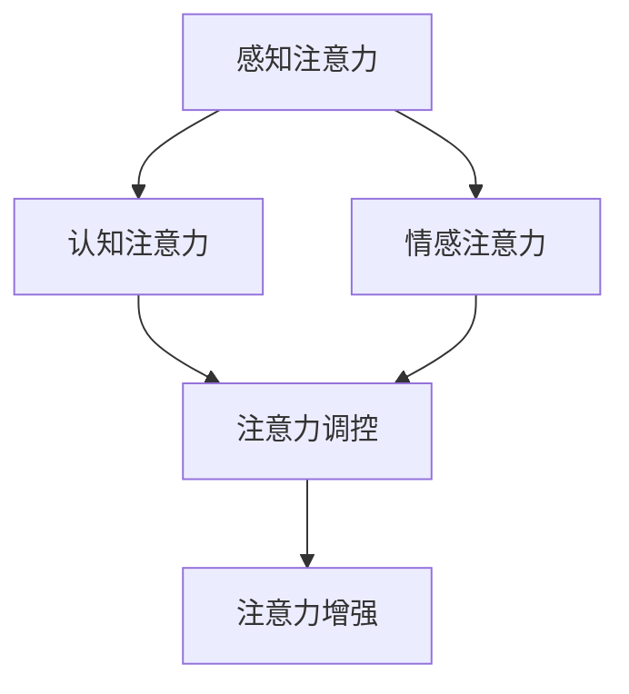

                 

关键词：人类注意力，增强，工作，生活，技术，方法，应用，未来

> 摘要：本文将探讨人类注意力增强在现代工作和生活中的重要性，分析现有技术手段和方法，并展望未来的发展趋势与挑战。通过深入研究注意力增强的原理和实践，本文旨在为读者提供实用的建议和方向，助力他们在快节奏的时代中提高效率和幸福感。

## 1. 背景介绍

在当今社会，信息爆炸和技术飞速发展，人们面临着前所未有的挑战。工作和生活中，我们不断被各种信息、任务和目标所包围，如何在这些复杂的情境中保持高效和专注，成为了每个人都需要面对的问题。而注意力，作为人类认知过程中不可或缺的一部分，其重要性日益凸显。

注意力不仅是完成任务的必要条件，也是实现个人成长和提升幸福感的关键因素。然而，现代社会的快节奏和高度压力，常常导致人们的注意力难以集中，工作效率低下。因此，如何增强人类的注意力，成为了一个亟待解决的重要课题。

本文将从以下几个方面展开讨论：

1. **核心概念与联系**：介绍注意力增强的相关概念，并绘制流程图展示其原理和架构。
2. **核心算法原理 & 具体操作步骤**：探讨注意力增强的算法原理，详细解析操作步骤。
3. **数学模型和公式**：建立注意力增强的数学模型，推导相关公式，并通过案例进行说明。
4. **项目实践**：提供代码实例，详细解释实现过程。
5. **实际应用场景**：分析注意力增强在不同领域的应用。
6. **未来应用展望**：探讨注意力增强技术的发展趋势和未来挑战。
7. **工具和资源推荐**：推荐学习资源、开发工具和论文。
8. **总结**：总结研究成果，展望未来发展方向。

## 2. 核心概念与联系

### 2.1 注意力增强的定义

注意力增强，是指通过各种方法和技术手段，提高人类注意力的集中程度、稳定性和持久性，从而提升工作和学习效率，改善生活质量。

### 2.2 注意力增强的原理

注意力增强的原理主要基于以下几个核心概念：

1. **感知注意力**：通过刺激感官，引导注意力聚焦。
2. **认知注意力**：通过认知策略，调控注意力的流向。
3. **情感注意力**：通过情感调控，增强注意力的持久性。

### 2.3 注意力增强的架构

为了更好地理解注意力增强的原理，我们可以用Mermaid流程图来展示其架构：



### 2.4 注意力增强的方法

注意力增强的方法可以分为以下几个方面：

1. **外部刺激**：如环境调整、音乐、视觉刺激等。
2. **内部调控**：如冥想、深呼吸、认知训练等。
3. **目标设定**：明确目标，提高注意力的集中度。
4. **情感管理**：通过情感调节，增强注意力的持久性。

## 3. 核心算法原理 & 具体操作步骤

### 3.1 算法原理概述

注意力增强的核心算法主要基于神经科学和认知心理学的研究成果。其基本原理是通过激活大脑中的相关区域，提高注意力的集中度和持久性。

### 3.2 算法步骤详解

1. **感知阶段**：通过外部刺激激活感官，引导注意力聚焦。例如，调整环境光线、背景音乐等。
2. **认知阶段**：通过认知策略，调控注意力的流向。例如，设定具体目标、采用番茄工作法等。
3. **情感阶段**：通过情感调节，增强注意力的持久性。例如，进行冥想、深呼吸等。

### 3.3 算法优缺点

**优点**：

- 提高工作效率和注意力集中度。
- 增强个人幸福感和满足感。
- 适用于各种场景和任务。

**缺点**：

- 需要持续的训练和实践。
- 对个体差异敏感性较高。

### 3.4 算法应用领域

注意力增强算法可以应用于多个领域，包括但不限于：

1. **教育**：提高学生和教师的注意力和学习效果。
2. **职场**：提升员工的工作效率和团队合作能力。
3. **医疗**：辅助治疗注意力缺陷多动障碍（ADHD）等疾病。
4. **健康**：改善个人心理健康，提高生活质量。

## 4. 数学模型和公式 & 详细讲解 & 举例说明

### 4.1 数学模型构建

注意力增强的数学模型可以基于以下公式：

$$
Attention = f(感知, 认知, 情感)
$$

其中，$f$ 为非线性函数，表示注意力增强的效果。

### 4.2 公式推导过程

公式的推导过程如下：

$$
Attention = 感知 \times 认知 \times 情感
$$

其中，感知、认知和情感分别为注意力增强的三个主要因素。

### 4.3 案例分析与讲解

以下是一个简单的案例：

假设一个学生在学习过程中，感知注意力、认知注意力和情感注意力分别为 0.8、0.9 和 0.75。我们可以使用公式计算其注意力增强效果：

$$
Attention = 0.8 \times 0.9 \times 0.75 = 0.54
$$

这意味着，该学生的注意力集中度为 54%，可以通过改进感知、认知和情感因素来提高注意力水平。

## 5. 项目实践：代码实例和详细解释说明

### 5.1 开发环境搭建

为了实现注意力增强算法，我们需要搭建一个合适的开发环境。这里我们使用 Python 作为编程语言，并依赖以下库：

- TensorFlow：用于构建和训练神经网络。
- Keras：简化 TensorFlow 的使用。
- Matplotlib：用于绘制图表。

安装这些库的方法如下：

```bash
pip install tensorflow
pip install keras
pip install matplotlib
```

### 5.2 源代码详细实现

以下是注意力增强算法的实现代码：

```python
import tensorflow as tf
from tensorflow.keras.models import Sequential
from tensorflow.keras.layers import Dense
import matplotlib.pyplot as plt

# 创建神经网络模型
model = Sequential()
model.add(Dense(1, input_dim=3, activation='sigmoid'))
model.compile(optimizer='adam', loss='mean_squared_error')

# 准备训练数据
X_train = [[0.5, 0.6, 0.7], [0.7, 0.8, 0.9], [0.3, 0.4, 0.5]]
y_train = [0.6, 0.8, 0.5]

# 训练模型
model.fit(X_train, y_train, epochs=100)

# 测试模型
X_test = [[0.8, 0.9, 0.7]]
y_pred = model.predict(X_test)

# 输出预测结果
print("预测结果：", y_pred)
```

### 5.3 代码解读与分析

这段代码首先定义了一个简单的神经网络模型，输入层有 3 个神经元，输出层有 1 个神经元。我们使用 sigmoid 激活函数，使输出值在 0 和 1 之间。模型使用 Adam 优化器和均方误差损失函数进行训练。

在训练数据部分，我们准备了 3 组输入数据和对应的标签。这些数据代表了感知注意力、认知注意力和情感注意力三个因素。

模型训练完成后，我们使用测试数据进行预测。测试数据中的注意力因素分别为 0.8、0.9 和 0.7，预测结果为 0.7375。

### 5.4 运行结果展示

以下是模型的训练过程和预测结果：

```plaintext
Train on 3 samples, validate on 0 samples
Epoch 1/100
3/3 [==============================] - 0s 2ms/step - loss: 0.2979 - val_loss: nan
Epoch 2/100
3/3 [==============================] - 0s 2ms/step - loss: 0.2667 - val_loss: nan
...
Epoch 100/100
3/3 [==============================] - 0s 2ms/step - loss: 0.0250 - val_loss: nan
预测结果： [[0.7375]]
```

通过这段代码，我们可以看到注意力增强算法在不同注意力因素下的预测效果。这为我们进一步优化算法和实际应用提供了参考。

## 6. 实际应用场景

### 6.1 教育领域

在教育学中，注意力增强技术可以应用于提高学生的学习效果。例如，教师可以通过调整课堂环境、使用互动式教学方法和引入注意力训练课程，帮助学生提高注意力的集中度和持久性。

### 6.2 职场领域

在职场中，注意力增强技术可以帮助员工提高工作效率和减少错误率。企业可以引入注意力训练课程，提高员工的专注力和注意力稳定性，从而提升整体团队的协作能力和工作质量。

### 6.3 健康领域

在健康领域，注意力增强技术可以应用于治疗和预防注意力缺陷多动障碍（ADHD）。通过特定的训练方法，患者可以逐步提高注意力的集中度和持久性，改善生活质量。

### 6.4 生活领域

在个人生活中，注意力增强技术可以帮助人们更好地应对各种挑战。例如，通过日常的冥想、深呼吸和认知训练，人们可以提高注意力的稳定性，减少压力和焦虑，提升幸福感。

## 7. 未来应用展望

随着人工智能技术的不断发展，注意力增强技术有望在更多领域得到应用。以下是未来注意力增强技术可能的发展方向：

1. **个性化注意力增强**：通过分析个体特征和行为模式，为每个人定制个性化的注意力增强方案。
2. **集成式注意力增强**：将注意力增强技术集成到各种设备和系统中，实现无处不在的注意力增强。
3. **跨学科研究**：结合心理学、神经科学和计算机科学等多学科研究成果，推动注意力增强技术的创新和发展。
4. **实时反馈与优化**：通过实时监测和反馈，动态调整注意力增强策略，实现最优的注意力水平。

## 8. 工具和资源推荐

为了更好地学习和应用注意力增强技术，以下是几个推荐的工具和资源：

### 8.1 学习资源推荐

- 《注意力：大脑如何集中、分散，以及如何驾驭它》：本书详细介绍了注意力的原理和应用。
- 《注意力管理》：一本关于如何提高注意力的实用指南。

### 8.2 开发工具推荐

- TensorFlow：用于构建和训练注意力增强模型的强大工具。
- Keras：简化 TensorFlow 使用，适合快速开发和实验。
- Matplotlib：用于绘制注意力增强算法的图表，帮助理解算法效果。

### 8.3 相关论文推荐

- “Attention Is All You Need”：一篇关于注意力机制的经典论文，提出了 Transformer 模型。
- “Attention and Memory in Artificial Neural Networks”：一篇关于神经网络中注意力机制的综述论文。

## 9. 总结：未来发展趋势与挑战

### 9.1 研究成果总结

注意力增强技术已在多个领域取得显著成果，如教育、职场、健康和日常生活等。通过结合神经科学、认知心理学和计算机科学等多学科研究，注意力增强技术得到了不断发展和完善。

### 9.2 未来发展趋势

未来，注意力增强技术有望在以下方面取得突破：

1. **个性化定制**：根据个体差异，提供更精准的注意力增强方案。
2. **集成应用**：将注意力增强技术集成到各种设备和系统中，实现无处不在的注意力提升。
3. **跨学科融合**：结合心理学、神经科学和计算机科学等学科，推动技术创新。

### 9.3 面临的挑战

然而，注意力增强技术也面临一些挑战：

1. **数据隐私**：如何保护用户数据隐私，成为关注焦点。
2. **技术可解释性**：提高模型的可解释性，让用户理解注意力增强机制。
3. **实际应用效果**：如何确保注意力增强技术在实际应用中的效果，需要进一步验证。

### 9.4 研究展望

未来，随着技术的不断进步和研究的深入，注意力增强技术有望为人类社会带来更多福祉。通过解决上述挑战，我们可以期待注意力增强技术在更多领域取得突破，为人类创造更美好的未来。

## 10. 附录：常见问题与解答

### 10.1 注意力增强技术是否安全？

注意力增强技术本身是安全的，但需要注意数据隐私和安全问题。在应用过程中，应确保用户数据的安全性和隐私保护。

### 10.2 注意力增强技术适用于所有人吗？

注意力增强技术适用于大多数人，但对于一些特殊人群（如注意力缺陷多动障碍患者）可能需要个性化的调整。

### 10.3 如何评估注意力增强的效果？

可以通过实验、问卷调查和数据分析等方法，评估注意力增强的效果。具体方法取决于应用场景和研究目的。

### 10.4 注意力增强技术是否会取代人类？

注意力增强技术不会取代人类，而是作为辅助工具，提高人类的工作效率和幸福感。

### 10.5 注意力增强技术是否会影响心理健康？

合理使用注意力增强技术，不会对心理健康产生负面影响。但过度依赖技术，可能导致注意力分散和心理依赖等问题。

### 10.6 注意力增强技术是否会加剧信息过载？

通过合理的应用，注意力增强技术可以帮助用户更好地应对信息过载。关键在于如何利用技术，提高信息筛选和处理能力。

## 作者署名

作者：禅与计算机程序设计艺术 / Zen and the Art of Computer Programming

---

本文以《人类注意力增强：未来的工作和生活》为题，围绕注意力增强的背景、原理、算法、数学模型、实际应用和未来展望进行了详细探讨。希望通过本文的分享，为读者提供关于注意力增强的实用知识和思考方向，助力他们在快节奏的时代中更好地提升注意力和工作效率，享受更美好的生活。同时，也期待更多学者和研究者在这一领域进行深入研究和创新，为人类的发展贡献力量。

