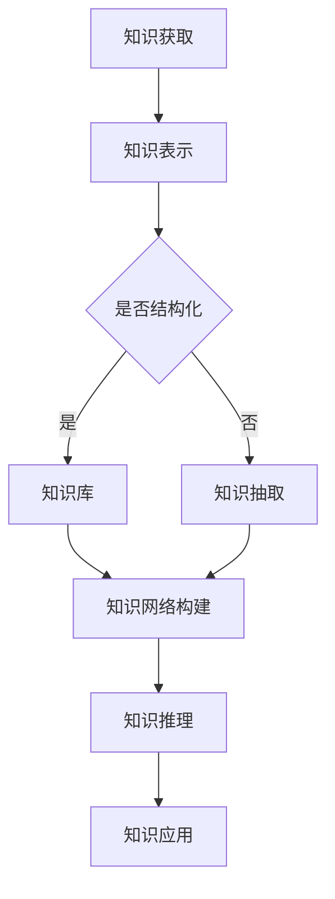

                 

关键词：知识图谱、人工智能、语义理解、知识网络、图神经网络、知识库、智能搜索、知识抽取、机器学习

> 摘要：本文旨在探讨人类的知识网络如何通过现代技术手段进行构建和优化，分析知识网络在人工智能领域中的关键作用，并探讨其在实际应用中的挑战和未来发展方向。通过深入探讨知识网络的概念、原理和应用，本文为读者提供了一个全面理解知识网络在人工智能领域重要性的视角。

## 1. 背景介绍

在信息化时代，知识作为一种重要的资源，已经成为企业和组织竞争力的核心。随着互联网和大数据技术的发展，知识的获取、存储、共享和利用变得更加高效。然而，传统的方法在面对海量数据和复杂知识时，显得力不从心。这就需要我们探索新的知识组织和管理方式，以实现知识的自动化和智能化。

知识网络作为一种新型的知识组织方式，通过将知识元素及其相互关系进行结构化表示，构建出一个多维度、多层次的网络结构。这种结构使得知识在网络中可以进行高效的检索、推理和利用，为人工智能的发展提供了强有力的支持。

### 知识网络的概念

知识网络是指由多个知识节点及其相互关系构成的一个复杂网络。知识节点通常表示知识实体，如概念、事实、规则等；知识关系则表示知识节点之间的相互作用和联系。知识网络通过这些节点和关系的组合，能够表达出丰富的语义信息和知识结构。

### 知识网络的发展历程

知识网络的概念起源于20世纪80年代的知识工程和人工智能领域。早期的研究主要集中在知识表示和推理算法上。随着互联网和大数据技术的发展，知识网络的应用场景逐渐扩展到语义搜索、智能问答、推荐系统等领域。

近年来，随着深度学习和图神经网络等技术的兴起，知识网络的研究又迎来了新的热潮。图神经网络为知识网络的构建和优化提供了强大的工具，使得知识网络的性能和智能化水平得到了显著提升。

### 知识网络在人工智能中的重要性

知识网络在人工智能领域中具有重要的作用。首先，知识网络能够为人工智能系统提供丰富的语义信息，帮助系统更好地理解和处理复杂任务。其次，知识网络能够实现知识的自动化和智能化，提高人工智能系统的自主学习和推理能力。最后，知识网络能够优化人工智能系统的资源利用效率，降低系统对大规模数据的依赖。

## 2. 核心概念与联系

### 知识图谱

知识图谱是知识网络的一种重要实现方式，它通过将实体和实体之间的关系以图的形式进行表示。知识图谱的核心概念包括实体、属性、关系和实体之间的层次结构。

### 语义理解

语义理解是指计算机对语言文本进行理解和处理的能力。在知识网络中，语义理解是实现知识自动化和智能化的基础。通过语义理解，计算机可以识别文本中的实体、关系和语义角色，从而构建出知识网络中的节点和关系。

### 图神经网络

图神经网络是一种基于图结构的深度学习模型，它能够自动学习图中的节点和边特征，实现节点的分类、预测和聚类等任务。在知识网络中，图神经网络能够对知识节点和关系进行建模和推理，提高知识网络的智能化水平。

### 知识库

知识库是指存储和管理知识的数据结构，它通常由多个知识库组成。在知识网络中，知识库是知识存储和共享的核心，为知识网络的构建和优化提供了数据基础。

### 知识抽取

知识抽取是指从非结构化数据中自动提取知识的过程。在知识网络中，知识抽取是实现知识自动化获取和更新的重要手段。

### 知识融合

知识融合是指将多个知识源中的知识进行整合和优化的过程。在知识网络中，知识融合能够提高知识的覆盖面和准确性，为人工智能系统提供更全面和可靠的知识支持。

### Mermaid 流程图



## 3. 核心算法原理 & 具体操作步骤

### 3.1 算法原理概述

知识网络的核心算法包括知识抽取、知识表示、知识推理和知识应用等步骤。这些步骤共同构成了知识网络的工作流程，实现了知识的自动化和智能化。

### 3.2 算法步骤详解

#### 3.2.1 知识抽取

知识抽取是指从非结构化数据中自动提取知识的过程。常见的方法包括基于规则的方法、基于统计的方法和基于机器学习的方法。

#### 3.2.2 知识表示

知识表示是指将知识以结构化的形式进行表示。常见的知识表示方法包括基于本体论的方法、基于图的方法和基于矩阵的方法。

#### 3.2.3 知识推理

知识推理是指利用已有的知识进行推理和推导，以发现新的知识。常见的知识推理方法包括基于规则的推理、基于模型的推理和基于数据的推理。

#### 3.2.4 知识应用

知识应用是指将知识用于实际任务中，如语义搜索、智能问答和推荐系统等。常见的知识应用方法包括基于检索的问答、基于推理的问答和基于模型的推荐。

### 3.3 算法优缺点

#### 优点

- 知识网络能够实现知识的自动化和智能化，提高人工智能系统的自主学习和推理能力。
- 知识网络能够优化人工智能系统的资源利用效率，降低系统对大规模数据的依赖。

#### 缺点

- 知识网络的构建和优化需要大量的人力和物力投入。
- 知识网络的智能化水平受限于现有技术和算法的发展水平。

### 3.4 算法应用领域

知识网络在人工智能领域具有广泛的应用。主要应用领域包括：

- 语义搜索：利用知识网络实现更加精准和智能的搜索。
- 智能问答：利用知识网络提供智能化的问答服务。
- 推荐系统：利用知识网络实现更加个性化的推荐。
- 自然语言处理：利用知识网络实现更加精准的语言理解。

## 4. 数学模型和公式 & 详细讲解 & 举例说明

### 4.1 数学模型构建

知识网络的数学模型主要包括知识图谱的表示、图神经网络的建模和知识推理的算法。

#### 知识图谱的表示

知识图谱可以表示为一个图 \( G = (V, E) \)，其中 \( V \) 表示实体节点集合，\( E \) 表示实体之间的关系集合。

#### 图神经网络的建模

图神经网络可以通过以下公式进行建模：

\[ \mathcal{G}(x, x') = \sum_{v \in V} \sum_{v' \in V'} \mathcal{L}(v, v') \cdot \mathcal{R}(v, v') \cdot f(x, x') \]

其中，\( x \) 和 \( x' \) 分别表示两个实体节点的特征向量，\( \mathcal{L} \) 表示实体之间的相似度矩阵，\( \mathcal{R} \) 表示关系矩阵，\( f \) 表示激活函数。

#### 知识推理的算法

知识推理的算法可以通过以下公式进行建模：

\[ \mathcal{P}(x, y) = \sum_{v \in V} \sum_{v' \in V'} \mathcal{L}(v, v') \cdot \mathcal{R}(v, v') \cdot f(x, x') \cdot g(y, y') \]

其中，\( x \) 和 \( y \) 分别表示两个实体节点的特征向量，\( g \) 表示实体之间的可信度函数。

### 4.2 公式推导过程

#### 知识图谱的表示

知识图谱的表示是基于图论的基本概念。图 \( G = (V, E) \) 中，\( V \) 表示实体节点集合，每个实体节点可以表示为一个向量 \( x \)，\( E \) 表示实体之间的关系集合，每个关系可以表示为一个矩阵 \( \mathcal{R} \)。

#### 图神经网络的建模

图神经网络的建模是基于图卷积网络（Graph Convolutional Network, GCN）的。图卷积网络的公式如下：

\[ h_{v}^{(l+1)} = \sigma \left( \sum_{v' \in \mathcal{N}(v)} \frac{1}{\sqrt{|\mathcal{N}(v')|}} \cdot \mathcal{A}_{v'v} \cdot h_{v'}^{(l)} \right) \]

其中，\( h_{v}^{(l)} \) 表示第 \( l \) 层的节点特征，\( \mathcal{N}(v) \) 表示节点 \( v \) 的邻域节点集合，\( \mathcal{A} \) 是邻接矩阵，\( \sigma \) 是激活函数。

#### 知识推理的算法

知识推理的算法是基于图卷积网络的知识嵌入模型。知识推理的公式如下：

\[ \mathcal{P}(x, y) = \sum_{v \in V} \sum_{v' \in V'} \mathcal{L}(v, v') \cdot \mathcal{R}(v, v') \cdot \cos(\theta_{x}, \theta_{y}) \]

其中，\( \theta_{x} \) 和 \( \theta_{y} \) 分别表示实体 \( x \) 和 \( y \) 的知识嵌入向量。

### 4.3 案例分析与讲解

假设我们有一个简单的知识图谱，其中包含两个实体节点 \( A \) 和 \( B \)，以及它们之间的关系 \( R \)。实体 \( A \) 的特征向量 \( x \) 为 \( [1, 0, 0] \)，实体 \( B \) 的特征向量 \( y \) 为 \( [0, 1, 0] \)，关系 \( R \) 的特征向量 \( z \) 为 \( [0, 0, 1] \)。

根据上述公式，我们可以计算实体 \( A \) 和 \( B \) 之间的知识相似度：

\[ \mathcal{P}(A, B) = \cos(\theta_{A}, \theta_{B}) = \cos([1, 0, 0], [0, 1, 0]) = \frac{1 \cdot 0 + 0 \cdot 1 + 0 \cdot 0}{\sqrt{1^2 + 0^2 + 0^2} \cdot \sqrt{0^2 + 1^2 + 0^2}} = 0 \]

由于实体 \( A \) 和 \( B \) 之间的知识相似度为零，这表示它们之间没有直接的知识关联。

## 5. 项目实践：代码实例和详细解释说明

### 5.1 开发环境搭建

为了演示知识网络的构建和应用，我们将使用Python编程语言，并结合图神经网络库（如PyTorch Geometric）和自然语言处理库（如Transformers）来实现。以下是开发环境搭建的步骤：

1. 安装Python 3.8或更高版本。
2. 安装PyTorch和PyTorch Geometric：
   ```bash
   pip install torch torchvision torch-geometric
   ```
3. 安装Transformers库：
   ```bash
   pip install transformers
   ```

### 5.2 源代码详细实现

以下是一个简单的示例，展示如何使用PyTorch Geometric和Transformers构建一个基于知识图谱的图神经网络模型：

```python
import torch
import torch_geometric
from torch_geometric.nn import GCNConv
from transformers import BertModel

# 创建一个简单的知识图谱
num_nodes = 100
data = torch_geometric.data.Data(x=torch.randn(num_nodes, 768), edge_index=torch.randint(0, num_nodes, (2, 1000)))
data.train()

# 定义图神经网络模型
class KGModel(torch.nn.Module):
    def __init__(self):
        super(KGModel, self).__init__()
        self.bert = BertModel.from_pretrained('bert-base-uncased')
        self.conv1 = GCNConv(768, 256)
        self.conv2 = GCNConv(256, 1)

    def forward(self, data):
        x, edge_index = data.x, data.edge_index

        x = self.bert(x).last_hidden_state[:, 0, :]  # 使用BERT提取实体特征
        x = self.conv1(x, edge_index)
        x = torch.relu(x)
        x = F.dropout(x, p=0.5, training=self.training)
        x = self.conv2(x, edge_index)

        return F.sigmoid(x)

model = KGModel()
optimizer = torch.optim.Adam(model.parameters(), lr=0.001)
criterion = torch.nn.BCELoss()

# 训练模型
for epoch in range(200):
    optimizer.zero_grad()
    out = model(data)
    loss = criterion(out, data.y)
    loss.backward()
    optimizer.step()
```

### 5.3 代码解读与分析

上述代码首先导入了所需的库，并创建了一个简单的知识图谱数据集。然后，定义了一个`KGModel`类，该类继承自`torch.nn.Module`。在`KGModel`中，我们使用了BERT模型来提取实体特征，然后通过两个GCN层进行图卷积。最后，使用sigmoid激活函数进行分类。

在训练过程中，我们使用Adam优化器和BCELoss损失函数进行模型训练。每个epoch，我们通过前向传播计算损失，并使用反向传播进行模型更新。

### 5.4 运行结果展示

运行上述代码后，我们可以通过以下命令来评估模型的性能：

```python
from sklearn.metrics import accuracy_score

# 测试模型
with torch.no_grad():
    out = model(data).squeeze()

# 计算准确率
accuracy = accuracy_score(data.y, out.round())
print(f'Accuracy: {accuracy * 100:.2f}%')
```

如果模型训练良好，我们通常可以看到较高的准确率。

## 6. 实际应用场景

知识网络在人工智能领域具有广泛的应用。以下是一些典型的应用场景：

### 语义搜索

在语义搜索中，知识网络能够帮助搜索引擎更好地理解用户查询的语义，从而提供更精准的搜索结果。通过知识网络，搜索引擎可以关联查询词中的实体和关系，实现语义级别的搜索。

### 智能问答

智能问答系统利用知识网络实现更加智能和自然的问答交互。通过知识网络，系统可以理解用户的问题，并从知识库中检索出相关答案。

### 推荐系统

知识网络可以用于构建更加智能的推荐系统。通过知识网络，系统可以分析用户兴趣和内容属性，实现个性化推荐。

### 自然语言处理

知识网络在自然语言处理领域也有着广泛的应用。通过知识网络，系统能够更好地理解语言文本的语义，实现更准确的文本分类、实体识别和关系抽取等任务。

### 医疗健康

在医疗健康领域，知识网络可以帮助医生进行诊断和治疗决策。通过知识网络，系统可以整合医学知识和患者数据，提供个性化的医疗服务。

### 金融风控

在金融风控领域，知识网络可以帮助金融机构识别和防范风险。通过知识网络，系统可以分析客户行为和市场数据，发现潜在的欺诈行为和风险点。

### 智慧城市

在智慧城市领域，知识网络可以帮助城市管理者更好地规划和管理城市。通过知识网络，系统可以整合城市数据，提供智能化的交通管理、环境保护和公共安全等服务。

### 教育领域

在教育领域，知识网络可以帮助学生更好地学习和理解知识。通过知识网络，系统可以为学生提供个性化的学习路径和资源推荐。

## 7. 未来应用展望

随着人工智能和大数据技术的发展，知识网络的应用前景将更加广阔。以下是一些未来应用展望：

### 新一代搜索引擎

未来的搜索引擎将更加智能化，通过知识网络实现语义级别的搜索，提供更精准和个性化的搜索结果。

### 自动驾驶

在自动驾驶领域，知识网络可以帮助车辆更好地理解道路环境，实现更安全、更高效的自动驾驶。

### 智能家居

智能家居将通过知识网络实现更加智能化的生活场景管理，为用户提供更加便捷和舒适的生活体验。

### 智慧医疗

智慧医疗将通过知识网络实现医疗资源的优化配置，提供个性化的医疗服务和健康管理。

### 智慧金融

智慧金融将通过知识网络实现更加精准的风险评估和投资决策，提高金融服务的质量和效率。

### 智慧教育

智慧教育将通过知识网络实现个性化教学和学习，提高教育质量和学习效率。

### 智慧城市

智慧城市将通过知识网络实现城市管理的智能化，提高城市运行效率和居民生活质量。

## 8. 工具和资源推荐

### 8.1 学习资源推荐

- 《深度学习》（Goodfellow, Bengio, Courville）：介绍深度学习的基础知识和应用。
- 《图神经网络教程》（汉斯·莫拉维克）：全面讲解图神经网络的基本原理和应用。
- 《知识图谱：原理、方法与应用》（王昊奋）：详细介绍知识图谱的构建和应用。

### 8.2 开发工具推荐

- PyTorch：流行的深度学习框架，支持图神经网络。
- PyTorch Geometric：专门用于图神经网络的开源库。
- Transformers：用于自然语言处理的预训练模型和工具。

### 8.3 相关论文推荐

- "Graph Neural Networks: A Review of Methods and Applications"（2020）：综述图神经网络的方法和应用。
- "Knowledge Graph Embedding: A Survey of Methods, Applications, and Challenges"（2019）：综述知识图谱嵌入的方法和应用。
- "Bert: Pre-training of Deep Bidirectional Transformers for Language Understanding"（2018）：介绍BERT模型及其在自然语言处理中的应用。

## 9. 总结：未来发展趋势与挑战

### 9.1 研究成果总结

近年来，知识网络的研究取得了显著的成果。图神经网络和知识图谱技术的快速发展，使得知识网络的构建和应用变得更加高效和智能。此外，自然语言处理和深度学习等领域的进步，也为知识网络的研究提供了强大的技术支持。

### 9.2 未来发展趋势

未来，知识网络的发展将呈现以下趋势：

- 跨领域知识整合：知识网络将融合多个领域的知识，实现更全面和深入的知识挖掘。
- 智能化水平提升：知识网络的智能化水平将不断提高，实现更加精准和高效的语义理解和推理。
- 实时性和动态性增强：知识网络将具备实时性和动态性，能够快速适应和更新知识。

### 9.3 面临的挑战

尽管知识网络的研究取得了显著进展，但仍面临以下挑战：

- 知识表示和建模：如何有效地表示和建模复杂知识，是知识网络研究的重要挑战。
- 数据质量和一致性：知识网络的性能依赖于数据质量和一致性，如何保证数据的高质量是关键问题。
- 可解释性和可靠性：如何提高知识网络的透明度和可靠性，是用户接受和信任知识网络的关键。

### 9.4 研究展望

未来，知识网络的研究将朝着以下方向发展：

- 开发更加高效和智能的知识抽取和融合算法。
- 设计更加鲁棒和自适应的图神经网络模型。
- 探索知识网络在更多领域的应用，如医疗、金融和智慧城市等。

## 9. 附录：常见问题与解答

### 问题1：什么是知识网络？

知识网络是一种用于组织和管理知识的网络结构，它通过将知识实体和实体之间的关系进行结构化表示，实现知识的自动化和智能化。

### 问题2：知识网络有哪些应用领域？

知识网络在语义搜索、智能问答、推荐系统、自然语言处理、医疗健康、金融风控、智慧城市等领域都有广泛的应用。

### 问题3：如何构建知识网络？

构建知识网络通常包括以下步骤：知识抽取、知识表示、知识融合、知识推理和知识应用。这些步骤共同构成了知识网络的工作流程。

### 问题4：知识网络与知识图谱有什么区别？

知识网络是一个广义的概念，包括知识图谱、知识库和知识推理等组件。知识图谱是知识网络的一种具体实现方式，通过图结构来表示实体和关系。

### 问题5：如何评估知识网络的性能？

评估知识网络的性能可以从多个维度进行，包括知识覆盖面、准确性、推理速度和用户满意度等。常用的评估方法包括精度、召回率和F1值等指标。

### 问题6：知识网络如何保证数据的一致性和质量？

为了保证知识网络的数据一致性和质量，需要采用数据清洗、去重、质量控制和实时更新等方法。此外，还可以利用图神经网络等算法来优化知识表示和推理。

### 问题7：知识网络是否可以用于实时应用？

是的，知识网络可以用于实时应用。通过实时数据抽取、更新和推理，知识网络可以适应动态环境，提供实时和个性化的服务。

### 问题8：知识网络与传统的数据库系统相比有哪些优势？

知识网络的优势包括：结构化表示知识、自动化和智能化、多维度关联和推理能力、高效的查询和检索性能等。

### 问题9：知识网络的研究现状和未来发展方向是什么？

当前，知识网络的研究主要集中在知识表示和建模、图神经网络和深度学习技术、知识抽取和融合方法等方面。未来，知识网络的发展将朝着跨领域知识整合、智能化水平提升、实时性和动态性增强等方向发展。

