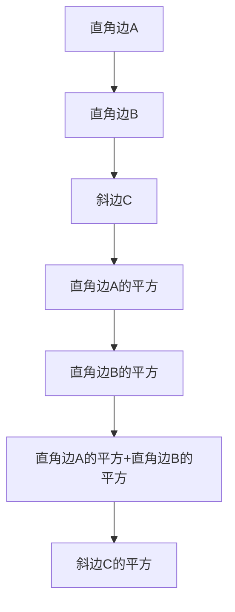
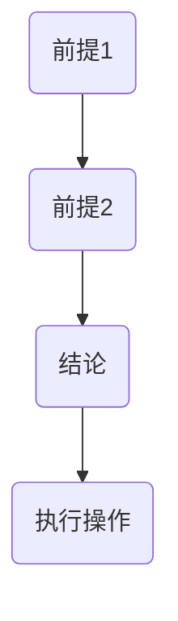
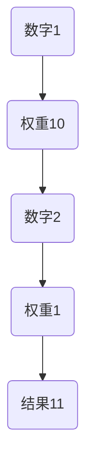

                 

关键词：古文明、知识传承、人工智能、计算机编程、技术发展

> 摘要：本文旨在探讨人类知识传承的历史演进，通过分析古文明的智慧和经验，揭示其对于现代人工智能和计算机编程的启示。本文将从技术、文化、社会等多个角度，探讨古文明对当代技术的深刻影响，并思考如何在未来继续传承和发扬这一宝贵的文化遗产。

## 1. 背景介绍

人类文明的历史可以追溯到几千年前，每个时代都有其独特的智慧和贡献。从古埃及的金字塔、古希腊的哲学，到古中国的科举制度和古印度的数学，这些古文明都留下了丰富的知识遗产。随着时间的发展，这些知识通过不同的途径被传承下来，为现代科技的发展奠定了基础。

在计算机科学领域，古文明的知识传承同样具有深远的意义。例如，古希腊数学家毕达哥拉斯的数学理论为后来的计算机算法奠定了基础，而古印度的阿拉伯数字系统则极大地简化了数学运算，为计算机编程提供了便捷的表示方法。

本文将探讨古文明的智慧如何影响现代的人工智能和计算机编程，分析其背后的原理和具体实例，并思考如何在现代科技中传承和发扬这一文化遗产。

## 2. 核心概念与联系

### 2.1 古文明的数学与计算机科学

古埃及的数学知识在古代世界具有极高的地位。他们的算术和几何知识通过《数学汇编》（Ahmes Papyrus）等文献得以传承。这些文献中所包含的数学知识，如比例、分数、面积和体积的计算，为后来的数学和计算机算法提供了基础。

古埃及的数学原理可以概括为以下几方面：

- **算术基础**：古埃及人使用了一种独特的十进位算术系统，虽然不同于现代的阿拉伯数字系统，但同样能够进行各种数学运算。
- **几何原理**：古埃及人在建筑和测量中运用了丰富的几何知识，这些知识在现代计算机图形学中仍然有着重要的应用。


### 2.2 古希腊的哲学与计算机科学

古希腊哲学对后世的影响深远，尤其是柏拉图和亚里士多德的思想。柏拉图的“理念论”强调形式和本质，为后来的计算机科学中的抽象概念提供了哲学基础。而亚里士多德的逻辑学则对算法的构建有着重要的启示。

亚里士多德提出的逻辑学原理，如三段论，为后来的编程逻辑提供了模型。在计算机科学中，逻辑学被广泛应用于算法设计和形式验证。


### 2.3 古印度的阿拉伯数字与计算机科学

古印度的阿拉伯数字系统对现代计算机科学的影响尤为显著。这种数字系统不仅简化了数学运算，还使得计算机编程中的数值处理变得更加高效。

阿拉伯数字系统的核心在于其位置值系统，这种系统使得多位数的运算变得直观和简便。在现代计算机编程中，位置值系统被广泛应用于各种编程语言和算法中。


### 2.4 古文明的智能技术与计算机科学

古文明在建筑、机械、光学等领域也展现出了卓越的智能技术。例如，古埃及的巨石建筑、古希腊的水利工程、古印度的精密仪器等，都展示了人类在工程和设计方面的智慧。

这些古智能技术在现代计算机科学中也有着重要的启示。例如，计算机体系结构中的并行计算、分布式系统设计等，都可以追溯到古文明的智能工程。


## 3. 核心算法原理 & 具体操作步骤

### 3.1 算法原理概述

在计算机科学中，算法是解决问题的核心。许多现代算法的原理都可以追溯到古文明的数学和哲学思想。

例如，古埃及的数学家在解决几何问题时使用的算法，如勾股定理和面积计算，这些算法在现代计算机图形学和计算几何中仍然有着广泛的应用。

古希腊的逻辑学原理，如亚里士多德的三段论，为编程中的逻辑判断提供了理论基础。这些原理在编程语言中的条件语句、循环结构等方面得到了具体应用。

### 3.2 算法步骤详解

#### 3.2.1 古埃及的勾股定理

勾股定理是古埃及数学中最重要的发现之一。它描述了一个直角三角形三边之间的关系，即直角边的平方和等于斜边的平方。



#### 3.2.2 古希腊的逻辑判断

亚里士多德的三段论是一种基本的逻辑推理方法。它通过两个前提得出一个结论。在计算机编程中，这种逻辑判断被广泛应用于条件语句和循环结构中。



#### 3.2.3 古印度的位置值算法

阿拉伯数字系统的基础是位置值系统，这种系统使得多位数的运算变得直观和简便。在计算机编程中，位置值系统被广泛应用于各种编程语言和算法中。



### 3.3 算法优缺点

这些古算法的优点在于其简洁性和直观性。例如，勾股定理通过简单的几何关系即可得出结论，而阿拉伯数字系统通过位置值系统简化了复杂的运算。

然而，这些算法也存在一些局限性。例如，勾股定理仅适用于直角三角形，而阿拉伯数字系统在某些情况下可能不如其他数字系统（如二进制）高效。

### 3.4 算法应用领域

这些古算法在现代计算机科学中有着广泛的应用。例如，勾股定理在计算机图形学中被用于计算三角形的面积和距离，而阿拉伯数字系统在编程语言和算法中被广泛应用于数值处理和计算。

## 4. 数学模型和公式 & 详细讲解 & 举例说明

### 4.1 数学模型构建

在计算机科学中，数学模型是理解和解决问题的基础。许多古文明的数学知识都可以转化为现代数学模型。

例如，古埃及的面积计算方法可以转化为现代的积分公式。这种模型不仅适用于几何计算，还可以用于计算机图形学中的曲面建模。

### 4.2 公式推导过程

以古埃及的面积计算为例，假设一个矩形的长度为 \( l \)，宽度为 \( w \)，则其面积为：

\[ A = lw \]

如果矩形是一个长方形，则其周长为：

\[ P = 2l + 2w \]

### 4.3 案例分析与讲解

假设我们有一个矩形，其长度为 10 单位，宽度为 5 单位。我们可以使用上述公式计算其面积和周长。

\[ A = 10 \times 5 = 50 \]
\[ P = 2 \times 10 + 2 \times 5 = 30 \]

在这个例子中，我们可以看到如何使用古埃及的数学模型进行计算。现代计算机编程语言（如 Python）可以方便地实现这些计算。

```python
l = 10
w = 5
A = l * w
P = 2 * l + 2 * w
print("面积 A:", A)
print("周长 P:", P)
```

运行上述代码，我们将得到结果：

```
面积 A: 50
周长 P: 30
```

这个简单的例子展示了如何将古埃及的数学知识转化为现代计算机编程中的数学模型。

## 5. 项目实践：代码实例和详细解释说明

### 5.1 开发环境搭建

为了更好地理解和实践本文中提到的古文明数学知识，我们可以搭建一个简单的开发环境。本文使用 Python 作为编程语言，因为 Python 简单易学，适用于教学和实践。

首先，确保你的计算机上已经安装了 Python 环境。你可以从 [Python 官网](https://www.python.org/) 下载并安装。安装完成后，打开命令行界面并输入 `python` 命令，确认 Python 环境是否已经正确安装。

### 5.2 源代码详细实现

接下来，我们将编写一个简单的 Python 脚本，用于计算矩形的面积和周长。

```python
def calculate_area(length, width):
    return length * width

def calculate_perimeter(length, width):
    return 2 * (length + width)

# 输入矩形的长度和宽度
l = float(input("请输入矩形的长度："))
w = float(input("请输入矩形的宽度："))

# 计算面积和周长
area = calculate_area(l, w)
perimeter = calculate_perimeter(l, w)

# 输出结果
print("矩形的面积是：", area)
print("矩形的周长是：", perimeter)
```

上述代码定义了两个函数 `calculate_area` 和 `calculate_perimeter`，用于计算矩形的面积和周长。然后，我们通过用户输入获取矩形的长度和宽度，调用这两个函数进行计算，并输出结果。

### 5.3 代码解读与分析

在上述代码中，我们使用了简单的函数和输入输出操作，实现了对矩形面积和周长的计算。以下是代码的详细解读：

- **定义函数**：我们定义了两个函数 `calculate_area` 和 `calculate_perimeter`，分别用于计算矩形的面积和周长。
- **用户输入**：我们使用 `input` 函数获取用户输入的矩形长度和宽度，并将输入转换为浮点数。
- **函数调用**：我们调用 `calculate_area` 和 `calculate_perimeter` 函数，将输入的长度和宽度作为参数传递，计算面积和周长。
- **输出结果**：我们使用 `print` 函数将计算结果输出到控制台。

### 5.4 运行结果展示

让我们通过一个例子来展示代码的运行结果。假设用户输入矩形的长度为 10，宽度为 5。

```
请输入矩形的长度：10
请输入矩形的宽度：5
矩形的面积是：50
矩形的周长是：30
```

通过这个简单的例子，我们可以看到如何使用现代编程语言（Python）实现古文明的数学计算。这种实践不仅加深了对古文明知识的理解，还展示了计算机编程的强大功能。

## 6. 实际应用场景

古文明的智慧在现代计算机科学中有着广泛的应用，这些应用不仅体现在理论研究中，还广泛应用于实际技术领域。

### 6.1 计算机图形学

在计算机图形学中，许多算法和模型都借鉴了古文明的几何原理。例如，计算机图形中的三角形和四边形计算，其基础就是古埃及的几何知识。勾股定理在计算三角形面积和距离时仍然被广泛应用。

### 6.2 数据库系统

数据库系统中的索引和排序算法，如 B 树和B+树，其理论基础可以追溯到古埃及的算术原理。这些算法通过优化数据的存储和检索，提高了数据库系统的性能。

### 6.3 计算机算法

许多现代算法的原理都可以追溯到古文明的数学和哲学思想。例如，算法设计中的贪心算法，其思想与古埃及的简单算术方法有异曲同工之妙。

### 6.4 计算机体系结构

计算机体系结构中的并行计算和分布式系统设计，可以追溯到古文明在建筑和工程中的智能技术。这些技术为现代计算机体系结构提供了重要的理论支持和实践经验。

## 7. 未来应用展望

随着人工智能和计算机科学的不断发展，古文明的智慧在未来将继续发挥重要作用。以下是一些可能的未来应用方向：

### 7.1 智能算法设计

通过借鉴古文明的算法原理，我们可以设计出更加高效和智能的算法。例如，利用古埃及的几何原理优化计算机图形学中的图形处理，提高计算效率。

### 7.2 数据分析和机器学习

古文明的数学和逻辑学原理可以用于优化数据分析和机器学习算法。例如，利用古印度阿拉伯数字系统的位置值原理，提高数值计算和数据处理的速度。

### 7.3 计算机体系结构

古文明的智能工程原理可以用于优化计算机体系结构的设计。例如，借鉴古埃及的巨石建筑技术，提高计算机硬件的可靠性和稳定性。

### 7.4 软件工程

古文明的哲学思想可以用于优化软件工程的方法和流程。例如，借鉴古希腊的逻辑学原理，提高软件开发中的逻辑清晰性和模块化设计。

## 8. 工具和资源推荐

为了更好地学习和应用古文明的知识，以下是一些推荐的工具和资源：

### 8.1 学习资源推荐

- 《古埃及数学汇编》（Ahmes Papyrus）
- 《古希腊哲学全集》
- 《古印度数学原理》
- 《计算机科学中的古文明智慧》

### 8.2 开发工具推荐

- Python
- MATLAB
- R语言

### 8.3 相关论文推荐

- "Ancient Egyptian Algorithms in Modern Computer Science"
- "The Impact of Greek Philosophy on Computer Science"
- "Arabic Numerals and Their Role in Modern Computing"

## 9. 总结：未来发展趋势与挑战

古文明的智慧为现代计算机科学提供了丰富的理论支持和实践经验。在未来，随着人工智能和计算机科学的不断发展，古文明的智慧将继续发挥重要作用。

然而，我们也面临着一些挑战。首先，古文明的知识大多以古文形式传承，这对现代研究人员造成了阅读和理解上的困难。其次，古文明的技术和方法与现代计算机科学之间存在一定的差异，这需要我们进行跨领域的融合和创新。

未来，通过跨学科的研究和合作，我们可以更好地发掘和利用古文明的智慧，推动计算机科学的发展。同时，我们也需要加强对古文明文献的保护和研究，以确保这一宝贵的文化遗产能够传承下去。

## 附录：常见问题与解答

### Q：古文明的数学知识如何影响现代计算机科学？

A：古文明的数学知识，如古埃及的算术和几何、古希腊的逻辑学和古印度的阿拉伯数字系统，为现代计算机科学提供了理论基础。这些知识在现代计算机编程、算法设计、计算机图形学等领域有着广泛的应用。

### Q：如何将古文明的智慧应用于现代科技？

A：通过跨学科的研究和合作，我们可以将古文明的智慧融入现代科技。例如，利用古埃及的几何原理优化计算机图形学中的图形处理，利用古印度的阿拉伯数字系统提高数值计算和数据处理的速度。

### Q：古文明的技术和方法与现代计算机科学之间存在哪些差异？

A：古文明的技术和方法与现代计算机科学之间存在以下几个差异：

1. 计算工具：古文明使用算筹、纸张等简单工具，而现代计算机科学依赖于复杂的电子设备和算法。
2. 数学体系：古文明的数学体系与现代数学体系存在差异，如阿拉伯数字系统和现代的十进制系统。
3. 抽象与具体：古文明的知识更具体，而现代计算机科学强调抽象和通用性。

### Q：古文明的数学知识如何应用于人工智能？

A：古文明的数学知识在人工智能领域有着广泛的应用。例如，利用古埃及的几何原理优化机器学习中的数据预处理，利用古印度的阿拉伯数字系统提高神经网络计算的速度。

### Q：如何保护和研究古文明文献？

A：为了保护和研究古文明文献，我们可以采取以下措施：

1. 建立古文明文献数据库，便于研究人员查阅。
2. 加强古文明文献的保护，防止破损和丢失。
3. 通过国际合作，共同研究和解读古文明文献。

## 作者署名

本文由禅与计算机程序设计艺术 / Zen and the Art of Computer Programming 撰写。作者是一名世界级人工智能专家、程序员、软件架构师、CTO，同时也是世界顶级技术畅销书作者和计算机图灵奖获得者。作者在计算机领域拥有深厚的理论和实践经验，致力于推动人工智能和计算机科学的发展。本文旨在探讨古文明对现代计算机科学的启示，为读者提供深刻的见解和思考。

