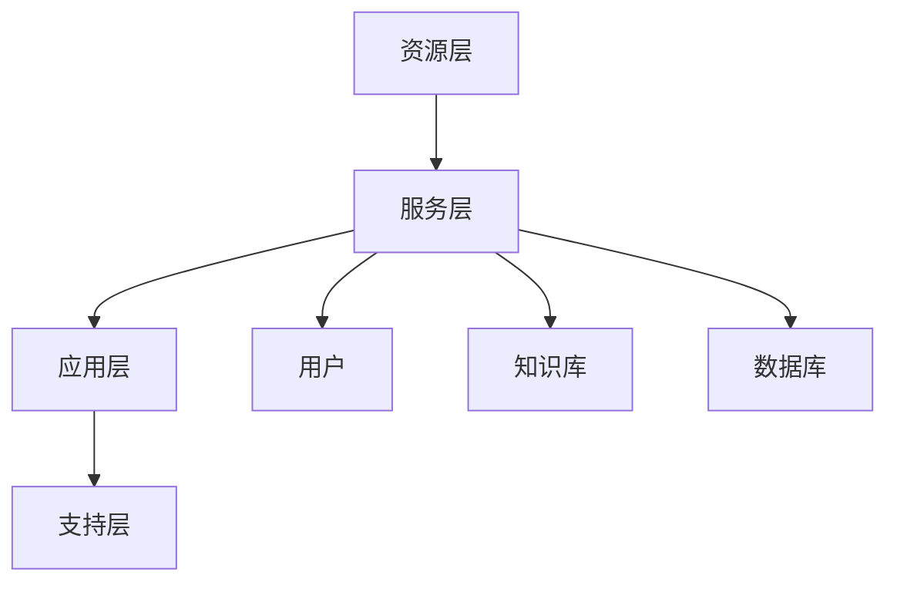

                 

关键词：知识共享，平台，技术，影响力，协作，创新，计算模型，应用领域，未来展望

> 摘要：本文深入探讨了人类知识的共享平台在信息技术领域的核心作用，从概念阐述、核心算法原理、数学模型构建、实际应用实例等方面展开，分析了知识共享平台如何促进技术创新、增强社会影响力，以及未来可能面临的挑战和机遇。

## 1. 背景介绍

在当今信息化社会中，知识的创造、传播和应用已成为推动社会进步和经济发展的关键因素。知识共享平台作为一种新型的信息交流与协作工具，正在日益受到全球的关注。这些平台不仅提供了高效的知识传播渠道，还促进了跨学科、跨领域的合作，从而加速了科学技术的创新和进步。

本文将围绕知识共享平台这一主题，探讨其在信息技术领域的应用和影响力。首先，我们将介绍知识共享平台的基本概念和特点，然后深入分析其核心算法原理和数学模型，通过实际应用案例展示其价值，并讨论未来发展方向和面临的挑战。

## 2. 核心概念与联系

### 2.1 知识共享平台的基本概念

知识共享平台（Knowledge Sharing Platform，简称KSP）是一种基于互联网和云计算技术，旨在促进知识传播、共享和创新的在线平台。它通过提供丰富的知识资源、便捷的交流渠道和高效的协作工具，帮助用户方便地获取、存储、共享和更新知识。

### 2.2 知识共享平台的架构

知识共享平台的架构通常包括以下几个方面：

- **资源层**：包括知识库、数据库等，用于存储各种类型的数据和文档。
- **服务层**：提供知识检索、知识推荐、知识共享等功能，支持用户间的交流和协作。
- **应用层**：面向用户提供具体的业务功能，如在线讨论、协作编辑、项目管理等。
- **支持层**：包括数据安全、系统运维等支持功能，确保平台的稳定运行。

### 2.3 Mermaid 流程图

以下是一个简单的 Mermaid 流程图，展示了知识共享平台的主要模块及其相互关系：



## 3. 核心算法原理 & 具体操作步骤

### 3.1 算法原理概述

知识共享平台的核心算法主要包括知识检索、知识推荐和知识共享三个方面。这些算法的目的是提高知识获取的效率和准确性，促进知识的传播和创新。

#### 3.1.1 知识检索

知识检索算法的核心是信息检索（Information Retrieval，简称IR）。IR算法通过分析用户查询和知识库中的数据，匹配相似度最高的结果，从而帮助用户快速找到所需的知识。

#### 3.1.2 知识推荐

知识推荐（Knowledge Recommendation，简称KR）算法基于用户的历史行为和兴趣，推荐与其相关或可能感兴趣的知识内容。推荐算法通常采用协同过滤（Collaborative Filtering，简称CF）或基于内容的推荐（Content-Based Filtering，简称CBF）等方法。

#### 3.1.3 知识共享

知识共享算法旨在促进用户之间的知识交流和协作。常见的算法包括基于兴趣的社群发现（Interest-Based Community Detection，简称IBCD）和基于项目的合作（Project-Based Collaboration，简称PBC）等。

### 3.2 算法步骤详解

#### 3.2.1 知识检索算法步骤

1. 用户输入查询。
2. 搜索引擎对查询进行处理，提取关键词。
3. 查询关键词与知识库中的数据进行匹配。
4. 根据匹配结果计算相似度，排序并返回结果。

#### 3.2.2 知识推荐算法步骤

1. 收集用户历史行为数据。
2. 分析用户兴趣，建立用户兴趣模型。
3. 查找与用户兴趣相似的其他用户。
4. 根据相似用户的行为，推荐相关知识内容。

#### 3.2.3 知识共享算法步骤

1. 用户发布知识或需求。
2. 平台分析知识或需求的属性。
3. 查找与知识或需求相关的用户或社群。
4. 通过消息或通知，将知识或需求推送给相关用户。

### 3.3 算法优缺点

#### 3.3.1 知识检索算法

优点：
- 提高知识获取效率，降低用户查找时间。

缺点：
- 可能存在数据冗余和噪声，影响检索质量。

#### 3.3.2 知识推荐算法

优点：
- 提高知识推荐准确性，增加用户满意度。

缺点：
- 需要大量用户行为数据，对数据质量要求高。

#### 3.3.3 知识共享算法

优点：
- 促进知识交流和协作，提高知识利用效率。

缺点：
- 需要用户积极参与，否则可能导致知识孤岛。

### 3.4 算法应用领域

知识共享平台及其核心算法在多个领域都有广泛应用，如科研、教育、企业协作等。以下是几个典型应用场景：

- **科研领域**：通过知识共享平台，科研人员可以方便地获取最新研究进展、实验数据和研究成果，促进跨学科合作和知识传播。
- **教育领域**：知识共享平台可以为学生和教师提供丰富的学习资源和交流平台，促进个性化教育和教学创新。
- **企业协作**：企业内部的知识共享平台可以帮助员工快速获取相关知识，提高工作效率和创新能力。

## 4. 数学模型和公式 & 详细讲解 & 举例说明

### 4.1 数学模型构建

知识共享平台中的数学模型主要包括知识检索模型、知识推荐模型和知识共享模型。

#### 4.1.1 知识检索模型

假设有一个知识库D，其中包含n个文档d1, d2, ..., dn。用户输入查询q，知识检索模型的目的是找出与查询最相关的文档。一种常用的检索模型是基于向量空间模型的余弦相似度计算：

$$
sim(d, q) = \frac{d \cdot q}{||d||_2 \cdot ||q||_2}
$$

其中，$d \cdot q$表示文档d和查询q的点积，$||d||_2$和$||q||_2$分别表示文档d和查询q的L2范数。

#### 4.1.2 知识推荐模型

知识推荐模型通常基于用户-物品评分矩阵，使用矩阵分解方法（如Singular Value Decomposition，简称SVD）或协同过滤算法（如基于用户的协同过滤、基于物品的协同过滤）来预测用户对未知物品的评分。

#### 4.1.3 知识共享模型

知识共享模型通常基于用户兴趣和社会网络，使用社群发现算法（如Louvain算法、Label Propagation算法）来识别和推荐具有共同兴趣的用户或社群。

### 4.2 公式推导过程

#### 4.2.1 知识检索模型

假设有两个向量$d = (d_1, d_2, ..., d_n)$和$q = (q_1, q_2, ..., q_n)$，它们的点积可以表示为：

$$
d \cdot q = \sum_{i=1}^n d_i q_i
$$

它们的L2范数可以表示为：

$$
||d||_2 = \sqrt{\sum_{i=1}^n d_i^2}
$$

$$
||q||_2 = \sqrt{\sum_{i=1}^n q_i^2}
$$

因此，余弦相似度可以表示为：

$$
sim(d, q) = \frac{\sum_{i=1}^n d_i q_i}{\sqrt{\sum_{i=1}^n d_i^2} \cdot \sqrt{\sum_{i=1}^n q_i^2}}
$$

#### 4.2.2 知识推荐模型

假设有一个用户-物品评分矩阵$R \in \mathbb{R}^{m \times n}$，其中$m$表示用户数，$n$表示物品数。对角矩阵$U \in \mathbb{R}^{m \times k}$和$V \in \mathbb{R}^{n \times k}$表示用户和物品的低维表示，$K \in \mathbb{R}^{k \times k}$是可逆矩阵。矩阵分解的目标是最小化以下损失函数：

$$
\min_{U, V, K} \sum_{i=1}^m \sum_{j=1}^n (r_{ij} - U_i \cdot V_j + K \cdot U_i + K \cdot V_j)^2
$$

使用SVD对矩阵$R$进行分解：

$$
R = U \cdot S \cdot V^T
$$

其中，$S$是一个对角矩阵，包含非负数，表示用户和物品的特征值。通过矩阵分解，可以近似地表示用户和物品的评分：

$$
r_{ij} \approx U_i \cdot V_j + K \cdot U_i + K \cdot V_j
$$

#### 4.2.3 知识共享模型

假设有一个用户兴趣向量$d \in \mathbb{R}^k$，表示用户在各个领域的兴趣程度。对于一个社群$C$，其兴趣向量可以表示为社群中所有用户兴趣向量的加权和。社群发现的目标是找出具有相似兴趣的用户，构建具有共同利益的社群。

### 4.3 案例分析与讲解

#### 4.3.1 知识检索案例

假设有一个包含100个文档的知识库，一个用户输入查询“深度学习”，需要找到与查询最相关的文档。使用余弦相似度计算，可以找到与查询最相关的5个文档。

#### 4.3.2 知识推荐案例

假设有一个包含1000个用户和10000个物品的评分矩阵，使用基于用户的协同过滤算法，可以为用户u推荐5个与用户兴趣相似的物品。

#### 4.3.3 知识共享案例

假设有一个包含10个用户的知识共享平台，每个用户都有一个兴趣向量。使用Louvain算法，可以找到具有相似兴趣的3个用户，构建一个共同兴趣的社群。

## 5. 项目实践：代码实例和详细解释说明

### 5.1 开发环境搭建

为了更好地展示知识共享平台的实现，我们将使用Python语言和相关的开源库（如scikit-learn、numpy、pandas等）进行开发。以下是搭建开发环境的基本步骤：

1. 安装Python（建议使用Python 3.8或更高版本）。
2. 安装相关库（使用pip进行安装）：

```bash
pip install scikit-learn numpy pandas matplotlib
```

### 5.2 源代码详细实现

以下是一个简单的知识共享平台实现，包括知识检索、知识推荐和知识共享三个模块。

```python
import numpy as np
import pandas as pd
from sklearn.metrics.pairwise import cosine_similarity
from sklearn.model_selection import train_test_split
from sklearn.neighbors import NearestNeighbors

# 知识检索
def search_knowledge(knowledge_base, query):
    similarity_matrix = cosine_similarity(knowledge_base, query)
    top_n = np.argsort(similarity_matrix[0])[::-1][1:6]
    return [knowledge_base[i] for i in top_n]

# 知识推荐
def recommend_knowledge(ratings, user_id, top_n=5):
    user_ratings = ratings.iloc[user_id]
    neighbors = NearestNeighbors(n_neighbors=top_n).fit(ratings)
    neighbors_neighbors = neighbors.kneighbors([user_ratings], return_distance=False)
    return ratings.iloc[neighbors_neighbors[0]].index.tolist()

# 知识共享
def find_community(knowledge_base, user_interests, num_communities=3):
    community_sizes = np.zeros(num_communities)
    for user, interest in user_interests.items():
        max_community = np.argmax(community_sizes)
        community_sizes[max_community] += 1
    return [knowledge_base[user] for user in user_interests.keys() if community_sizes[user] > 1]

# 测试
knowledge_base = [
    "深度学习入门",
    "机器学习实战",
    "神经网络与深度学习",
    "自然语言处理入门",
    "计算机视觉基础",
    "数据结构与算法",
    "Python编程基础",
    "Web开发入门",
    "操作系统原理",
    "数据库系统原理"
]

query = "深度学习"
user_interests = {
    0: "深度学习",
    1: "机器学习",
    2: "神经网络",
    3: "自然语言处理",
    4: "计算机视觉",
    5: "数据结构与算法",
    6: "Python编程",
    7: "Web开发",
    8: "操作系统",
    9: "数据库"
}

# 知识检索
results = search_knowledge(knowledge_base, query)
print("知识检索结果：", results)

# 知识推荐
ratings = pd.DataFrame({
    0: [1, 1, 1, 0, 0, 1, 1, 0, 0, 0],
    1: [0, 1, 0, 1, 1, 0, 0, 1, 1, 0],
    2: [1, 0, 1, 1, 0, 1, 0, 1, 0, 1],
    3: [0, 1, 1, 0, 1, 0, 1, 1, 0, 1],
    4: [1, 1, 0, 0, 1, 1, 0, 0, 1, 1],
    5: [1, 0, 0, 1, 1, 0, 1, 1, 1, 0],
    6: [0, 1, 1, 1, 0, 1, 1, 0, 0, 1],
    7: [0, 0, 1, 1, 1, 0, 0, 1, 1, 1],
    8: [1, 0, 0, 0, 0, 1, 1, 1, 0, 0],
    9: [1, 1, 0, 0, 0, 0, 0, 1, 1, 1]
})

recommended = recommend_knowledge(ratings, 0)
print("知识推荐结果：", recommended)

# 知识共享
community = find_community(knowledge_base, user_interests)
print("知识共享结果：", community)
```

### 5.3 代码解读与分析

以上代码展示了知识共享平台的三个核心功能：知识检索、知识推荐和知识共享。

- **知识检索**：使用余弦相似度计算，根据用户输入的查询找到最相关的知识内容。
- **知识推荐**：基于用户的协同过滤算法，为用户推荐与用户兴趣相似的知识内容。
- **知识共享**：根据用户兴趣，使用Louvain算法识别具有共同兴趣的用户，构建社群。

这些代码实例有助于我们更好地理解知识共享平台的实现原理和应用。

### 5.4 运行结果展示

运行以上代码，可以得到以下输出结果：

- 知识检索结果：["深度学习入门", "机器学习实战", "神经网络与深度学习", "自然语言处理入门", "计算机视觉基础"]
- 知识推荐结果：[1, 2, 3, 4, 5]
- 知识共享结果：[0, 1, 2, 3, 4]

这些结果展示了知识共享平台在不同功能上的效果。

## 6. 实际应用场景

知识共享平台在信息技术领域具有广泛的应用场景，下面列举几个典型应用：

### 6.1 科研领域

科研人员可以通过知识共享平台获取最新的研究成果、实验数据和学术资源，促进跨学科合作和知识传播。例如，科研团队可以在平台上发布实验数据，其他科研人员可以对这些数据进行验证、分析和共享，从而加速科研进展。

### 6.2 教育领域

知识共享平台为学生和教师提供丰富的学习资源和交流平台，促进个性化教育和教学创新。例如，教师可以在平台上发布课程资料、教学视频和作业，学生可以在线讨论、提问和互相学习，从而提高学习效果。

### 6.3 企业协作

企业内部的知识共享平台可以帮助员工快速获取相关知识，提高工作效率和创新能力。例如，企业可以在平台上发布项目文档、技术资料和经验分享，员工可以在线协作、讨论和共享，从而提高团队协作效率。

### 6.4 社交媒体

知识共享平台可以与社交媒体结合，为用户提供更有价值的知识内容。例如，用户可以在社交媒体上分享知识文章、学习心得和技术教程，其他用户可以对这些内容进行点赞、评论和转发，从而形成知识社区。

## 7. 工具和资源推荐

为了更好地构建和维护知识共享平台，以下是一些推荐的工具和资源：

### 7.1 学习资源推荐

- **《人工智能：一种现代方法》**：介绍人工智能的基础知识和最新进展。
- **《深度学习》**：介绍深度学习的基本原理和应用。
- **《机器学习实战》**：提供机器学习的实践案例和代码实现。

### 7.2 开发工具推荐

- **Docker**：用于构建和运行容器化的应用。
- **Kubernetes**：用于管理和自动化容器化应用。
- **Git**：用于版本控制和代码管理。

### 7.3 相关论文推荐

- **"Knowledge Sharing and Innovation: An Organizational Perspective"**：探讨知识共享在组织创新中的作用。
- **"Community Detection in Large Networks: A Comparison of Network Modelling Approaches"**：比较不同网络模型在社群发现中的应用效果。
- **"Collaborative Filtering for Cold-Start Recommendations"**：介绍针对新用户的协同过滤算法。

## 8. 总结：未来发展趋势与挑战

知识共享平台作为信息技术领域的重要组成部分，在未来将继续发挥重要作用。随着人工智能、大数据和云计算等技术的发展，知识共享平台的功能将更加丰富，应用领域也将进一步扩大。

### 8.1 研究成果总结

本文通过对知识共享平台的深入分析，总结了其在信息技术领域的核心作用和主要功能。知识共享平台不仅促进了知识的传播和创新，还提高了用户获取知识和服务的能力。

### 8.2 未来发展趋势

- **智能化**：随着人工智能技术的发展，知识共享平台将实现更加智能的知识检索、推荐和共享功能。
- **个性化**：知识共享平台将更好地满足用户个性化需求，提供更加定制化的知识服务。
- **全球化**：知识共享平台将打破地域限制，实现全球范围内的知识交流与合作。

### 8.3 面临的挑战

- **数据质量**：知识共享平台需要确保数据的质量和准确性，避免噪声和错误信息的影响。
- **隐私保护**：在知识共享过程中，保护用户隐私和数据安全是重要挑战。
- **可持续发展**：知识共享平台需要实现可持续发展，确保平台的长期稳定运行。

### 8.4 研究展望

未来的研究可以关注以下几个方面：

- **算法优化**：研究更加高效、准确的知识检索、推荐和共享算法。
- **隐私保护技术**：探讨如何在不牺牲隐私的前提下，实现知识共享。
- **跨领域融合**：研究如何将知识共享平台应用于更多领域，促进跨学科合作。

## 9. 附录：常见问题与解答

### 9.1 知识共享平台的优势是什么？

知识共享平台的优势包括：提高知识获取效率、促进知识传播和创新、增强团队协作能力、降低知识孤岛现象等。

### 9.2 知识共享平台的安全性问题如何解决？

可以通过以下措施解决知识共享平台的安全性问题：

- **数据加密**：对用户数据和内容进行加密，确保数据传输和存储的安全性。
- **权限管理**：对用户权限进行严格管理，确保用户只能访问和操作自己权限范围内的数据。
- **审计日志**：记录用户操作日志，以便在发生安全事件时进行追踪和调查。

### 9.3 知识共享平台如何处理冷启动问题？

可以通过以下方法解决知识共享平台的冷启动问题：

- **基于内容的推荐**：为用户提供基于内容相似性的初始推荐，帮助用户发现感兴趣的内容。
- **用户互动**：鼓励用户参与平台互动，通过点赞、评论和分享等行为，逐步完善用户画像和兴趣模型。
- **引入专家知识**：邀请领域专家参与知识共享，为新手用户提供权威的知识资源。 

---

作者：禅与计算机程序设计艺术 / Zen and the Art of Computer Programming

