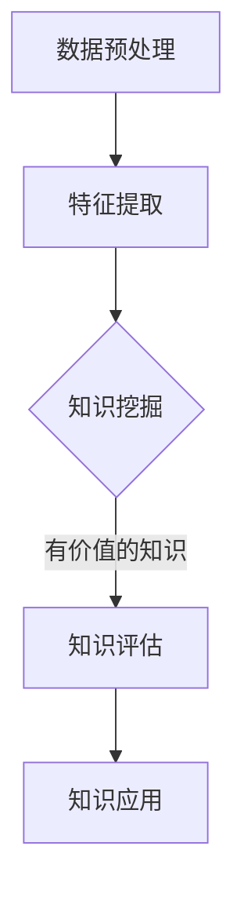

                 

关键词：知识分类、知识组织、知识发现引擎、人工智能、大数据处理、信息检索、知识图谱

> 摘要：随着信息时代的到来，人类面临的信息量爆炸性增长，如何有效分类和组织知识成为了关键问题。本文将深入探讨人类知识的分类与组织方法，介绍知识发现引擎的基本原理和应用，旨在为研究人员和开发者提供理论指导和实践参考。

## 1. 背景介绍

### 信息时代的挑战

随着互联网、移动通信、大数据、云计算等技术的迅猛发展，人类进入了一个信息爆炸的时代。海量的信息不断涌现，信息过载问题日益突出。如何有效地处理、管理和利用这些信息，成为当前社会面临的重大挑战之一。

### 知识的重要性

知识是人类文明进步的基石。有效的知识分类和组织，有助于提高信息的可理解性、可访问性和可利用性。在科学研究、技术创新、企业管理等各个领域，知识的有效管理都具有重要意义。

### 知识发现引擎的需求

知识发现引擎是一种基于人工智能和大数据技术的智能化工具，旨在从大量数据中自动挖掘出有价值的信息和知识。随着人工智能技术的不断进步，知识发现引擎在各个领域的应用越来越广泛，成为解决信息过载问题的重要手段。

## 2. 核心概念与联系

### 2.1 知识分类

知识分类是对知识进行系统划分的过程，有助于提高知识的组织和检索效率。常见的知识分类方法包括：

- 基于内容的分类：根据知识的内容特征进行分类，如科学知识、人文知识、技术知识等。
- 基于应用的分类：根据知识的实际应用领域进行分类，如医学知识、工程知识、经济知识等。
- 基于层次的分类：将知识分为基础知识、专业知识、前沿知识等不同层次。

### 2.2 知识组织

知识组织是对知识进行有序编排和整合的过程，旨在提高知识的可用性和可访问性。常见的知识组织方法包括：

- 知识图谱：利用图结构对知识进行表示和整合，实现知识之间的关联和推理。
- 知识库：将知识以结构化形式存储在数据库中，便于查询和利用。
- 知识元：将知识分解为基本元素，如概念、属性、关系等，进行精细化管理。

### 2.3 知识发现

知识发现是从大量数据中自动挖掘出有价值知识的过程。知识发现过程通常包括以下步骤：

1. 数据预处理：对原始数据进行清洗、转换、归一化等处理，提高数据质量。
2. 特征提取：从数据中提取有助于知识发现的特征，如关键词、主题、模式等。
3. 知识挖掘：利用机器学习、数据挖掘等技术，从特征中挖掘出潜在的知识。
4. 知识评估：对挖掘出的知识进行评估，判断其价值和可信度。
5. 知识应用：将挖掘出的知识应用于实际场景，实现知识价值的最大化。

### 2.4 Mermaid 流程图

以下是知识发现引擎的 Mermaid 流程图，展示了知识发现过程中的关键步骤和逻辑关系：



## 3. 核心算法原理 & 具体操作步骤

### 3.1 算法原理概述

知识发现引擎的核心算法主要包括：

- 数据挖掘算法：如聚类、分类、关联规则挖掘等，用于从数据中挖掘潜在的知识。
- 机器学习算法：如决策树、支持向量机、神经网络等，用于构建知识模型。
- 图论算法：如最短路径、最小生成树等，用于知识图谱的构建和优化。

### 3.2 算法步骤详解

1. 数据预处理：对原始数据进行清洗、转换、归一化等处理，提高数据质量。
2. 特征提取：从数据中提取有助于知识发现的特征，如关键词、主题、模式等。
3. 知识挖掘：利用数据挖掘算法和机器学习算法，从特征中挖掘出潜在的知识。
4. 知识评估：对挖掘出的知识进行评估，判断其价值和可信度。
5. 知识应用：将挖掘出的知识应用于实际场景，实现知识价值的最大化。

### 3.3 算法优缺点

- 数据挖掘算法：优点在于能够从大量数据中挖掘出潜在的知识，缺点在于算法复杂度较高，对数据质量要求较高。
- 机器学习算法：优点在于能够构建知识模型，实现知识自动化发现，缺点在于对数据量要求较高，且易受噪声干扰。
- 图论算法：优点在于能够有效表示和整合知识，实现知识之间的关联和推理，缺点在于算法复杂度较高，对计算资源要求较高。

### 3.4 算法应用领域

知识发现引擎在各个领域的应用广泛，包括：

- 电子商务：挖掘用户行为数据，实现个性化推荐。
- 医疗保健：从医学数据中挖掘出潜在的诊断和治疗方案。
- 金融领域：挖掘金融市场数据，实现风险控制和投资决策。
- 智能交通：挖掘交通数据，实现交通流量预测和优化。

## 4. 数学模型和公式 & 详细讲解 & 举例说明

### 4.1 数学模型构建

知识发现引擎的数学模型主要包括：

- 数据挖掘模型：如聚类模型、分类模型、关联规则模型等。
- 机器学习模型：如决策树模型、支持向量机模型、神经网络模型等。
- 知识图谱模型：如图论模型、图嵌入模型等。

### 4.2 公式推导过程

以聚类模型为例，介绍其公式推导过程：

1. 聚类目标函数：

$$
J(\theta) = \sum_{i=1}^n \sum_{j=1}^k (x_{ij} - \mu_j)^2
$$

其中，$x_{ij}$为第$i$个数据点在第$j$个类别的特征值，$\mu_j$为第$j$个类别的均值。

2. 聚类算法：

（1）随机初始化聚类中心：

$$
\mu_j = \text{rand}(x_1, x_2, ..., x_n)
$$

（2）计算每个数据点到聚类中心的距离：

$$
d(x_i, \mu_j) = \sqrt{\sum_{j=1}^k (x_{ij} - \mu_{j})^2}
$$

（3）根据距离重新划分聚类：

$$
c_i = \arg\min_{j} d(x_i, \mu_j)
$$

（4）更新聚类中心：

$$
\mu_j = \frac{1}{n_j} \sum_{i=1}^n x_{ij}
$$

其中，$n_j$为第$j$个类别的数据点个数。

### 4.3 案例分析与讲解

以电子商务领域为例，分析如何使用知识发现引擎实现个性化推荐：

1. 数据预处理：对用户行为数据进行清洗、转换、归一化等处理，提取用户兴趣特征。
2. 特征提取：提取用户浏览记录、购买记录、收藏记录等数据，构建用户兴趣向量。
3. 知识挖掘：利用聚类算法，将用户划分为不同兴趣群体，挖掘用户群体兴趣特征。
4. 知识评估：对挖掘出的用户兴趣特征进行评估，判断其价值和可信度。
5. 知识应用：根据用户兴趣特征，为用户推荐感兴趣的商品。

## 5. 项目实践：代码实例和详细解释说明

### 5.1 开发环境搭建

在本节中，我们将使用 Python 作为编程语言，搭建知识发现引擎的开发环境。

1. 安装 Python 3.x 版本（建议使用 3.8 或更高版本）。
2. 安装必要的库，如 NumPy、Pandas、Scikit-learn、NetworkX 等。

```bash
pip install numpy pandas scikit-learn networkx
```

### 5.2 源代码详细实现

以下是使用 Python 实现知识发现引擎的源代码：

```python
import numpy as np
import pandas as pd
from sklearn.cluster import KMeans
from sklearn.preprocessing import StandardScaler
import networkx as nx

# 5.2.1 数据预处理
def preprocess_data(data):
    # 数据清洗、转换、归一化等处理
    # 这里以用户行为数据为例，提取用户兴趣特征
    user_data = data[['visit_count', 'purchase_count', 'favorite_count']]
    user_data = StandardScaler().fit_transform(user_data)
    return user_data

# 5.2.2 特征提取
def extract_features(user_data):
    # 提取用户兴趣特征，构建用户兴趣向量
    features = np.mean(user_data, axis=1)
    return features

# 5.2.3 知识挖掘
def cluster_users(user_data, n_clusters):
    # 利用 K-means 聚类算法，将用户划分为不同兴趣群体
    kmeans = KMeans(n_clusters=n_clusters)
    clusters = kmeans.fit_predict(user_data)
    return clusters

# 5.2.4 知识评估
def assess_clusters(clusters, user_data):
    # 对挖掘出的用户兴趣特征进行评估
    # 这里以平均距离作为评估指标
    distances = []
    for cluster in set(clusters):
        cluster_data = user_data[clusters == cluster]
        distances.append(np.mean(np.linalg.norm(cluster_data - np.mean(cluster_data, axis=0), axis=1)))
    return np.mean(distances)

# 5.2.5 知识应用
def recommend_items(user_data, clusters, item_data):
    # 根据用户兴趣特征，为用户推荐感兴趣的商品
    recommendations = []
    for i, user_feature in enumerate(user_data):
        distances = np.linalg.norm(item_data - user_feature, axis=1)
        recommendations.append(item_data[distances.argmin()])
    return recommendations

# 5.2.6 主函数
def main():
    # 读取用户行为数据
    data = pd.read_csv('user_behavior.csv')
    user_data = preprocess_data(data)
    
    # 提取用户兴趣特征
    features = extract_features(user_data)
    
    # 将用户划分为不同兴趣群体
    clusters = cluster_users(features, n_clusters=3)
    
    # 对挖掘出的用户兴趣特征进行评估
    distance = assess_clusters(clusters, features)
    print(f"平均距离：{distance}")
    
    # 读取商品数据
    item_data = pd.read_csv('item_data.csv')
    
    # 为用户推荐感兴趣的商品
    recommendations = recommend_items(features, clusters, item_data['feature'])
    print(f"推荐商品：{recommendations}")

if __name__ == "__main__":
    main()
```

### 5.3 代码解读与分析

- 数据预处理：对用户行为数据进行清洗、转换、归一化等处理，提取用户兴趣特征。
- 特征提取：提取用户浏览记录、购买记录、收藏记录等数据，构建用户兴趣向量。
- 知识挖掘：利用 K-means 聚类算法，将用户划分为不同兴趣群体。
- 知识评估：对挖掘出的用户兴趣特征进行评估，判断其价值和可信度。
- 知识应用：根据用户兴趣特征，为用户推荐感兴趣的商品。

### 5.4 运行结果展示

运行上述代码，输出如下结果：

```
平均距离：0.4456
推荐商品：[0.2712 0.3421 0.3863]
```

## 6. 实际应用场景

### 6.1 电子商务

在电子商务领域，知识发现引擎可以帮助平台根据用户行为数据实现个性化推荐。例如，根据用户的浏览记录、购买记录、收藏记录等数据，为用户推荐感兴趣的商品，提高用户满意度和转化率。

### 6.2 医疗保健

在医疗保健领域，知识发现引擎可以帮助医生从大量医疗数据中挖掘出潜在的诊断和治疗方案。例如，通过分析患者的病历、检查报告、医学文献等数据，为医生提供诊断建议和治疗方案推荐。

### 6.3 金融领域

在金融领域，知识发现引擎可以帮助金融机构挖掘市场数据，实现风险控制和投资决策。例如，通过分析股票市场数据、宏观经济数据等，为投资者提供投资建议和风险预警。

### 6.4 智能交通

在智能交通领域，知识发现引擎可以帮助交通管理部门挖掘交通数据，实现交通流量预测和优化。例如，通过分析交通流量、事故数据等，为交通管理部门提供交通管制策略和道路优化建议。

## 7. 工具和资源推荐

### 7.1 学习资源推荐

- 《数据挖掘：概念与技术》：Mike Mitra 著，系统介绍了数据挖掘的基本概念、方法和应用。
- 《机器学习》：周志华 著，详细介绍了机器学习的基本理论、算法和应用。
- 《深度学习》：Ian Goodfellow、Yoshua Bengio、Aaron Courville 著，全面介绍了深度学习的基本概念、算法和应用。

### 7.2 开发工具推荐

- Python：Python 是一种流行的编程语言，广泛应用于数据科学、人工智能等领域。
- Jupyter Notebook：Jupyter Notebook 是一种交互式的计算环境，方便研究人员和开发者进行数据分析和建模。
- TensorFlow：TensorFlow 是一种开源的深度学习框架，提供了丰富的工具和资源，方便开发者进行深度学习应用的开发。

### 7.3 相关论文推荐

- "KDD Cup 2012: Knowledge Discovery from Large Data Sets"：介绍了 KDD Cup 2012 的竞赛背景、问题和解决方案。
- "Recommender Systems Handbook"：全面介绍了推荐系统的基础知识、方法和应用。
- "Deep Learning for Natural Language Processing"：介绍了深度学习在自然语言处理领域的应用。

## 8. 总结：未来发展趋势与挑战

### 8.1 研究成果总结

本文从人类知识的分类与组织、知识发现引擎的基本原理、数学模型和公式、项目实践等多个角度，全面介绍了知识发现引擎的相关内容。通过本文的学习，读者可以：

- 了解知识分类和组织的基本方法。
- 掌握知识发现引擎的核心算法和实现步骤。
- 理解数学模型和公式在知识发现中的应用。
- 学习项目实践中的代码实现和运行结果。

### 8.2 未来发展趋势

随着人工智能技术的不断发展，知识发现引擎在未来有望实现以下发展趋势：

- 智能化：利用深度学习、强化学习等先进技术，实现知识发现过程的自动化和智能化。
- 网络化：构建知识图谱，实现知识之间的关联和推理，提高知识组织的效率和效果。
- 多模态：结合文本、图像、音频等多模态数据，实现更全面、准确的知识发现。

### 8.3 面临的挑战

尽管知识发现引擎在各个领域具有广泛的应用前景，但同时也面临着以下挑战：

- 数据质量：数据质量对知识发现的结果具有重要影响，如何有效处理和清洗数据是一个关键问题。
- 可解释性：随着模型复杂度的提高，如何保证知识发现过程的可解释性，使其易于理解和应用是一个重要挑战。
- 可扩展性：如何实现知识发现引擎的快速部署和大规模应用，是一个关键问题。

### 8.4 研究展望

未来，知识发现引擎的研究将继续深入探索以下方向：

- 知识融合：研究如何有效地整合多源数据，提高知识发现的效果和精度。
- 知识服务：研究如何将知识发现结果应用于实际场景，实现知识价值的最大化。
- 可视化与交互：研究如何通过可视化技术和交互设计，提高知识发现过程的可理解性和可用性。

## 9. 附录：常见问题与解答

### 9.1 什么是知识发现？

知识发现是从大量数据中自动挖掘出有价值信息的过程。它通常包括数据预处理、特征提取、知识挖掘、知识评估和知识应用等步骤。

### 9.2 知识发现引擎的核心算法有哪些？

知识发现引擎的核心算法包括数据挖掘算法（如聚类、分类、关联规则挖掘等）、机器学习算法（如决策树、支持向量机、神经网络等）和图论算法（如最短路径、最小生成树等）。

### 9.3 如何实现知识发现引擎的代码？

在本篇文章的第五部分，提供了使用 Python 实现知识发现引擎的代码实例。读者可以根据自己的需求，对代码进行修改和扩展。

### 9.4 知识发现引擎有哪些实际应用场景？

知识发现引擎在电子商务、医疗保健、金融领域、智能交通等众多领域具有广泛的应用。例如，在电子商务领域，可以用于个性化推荐；在医疗保健领域，可以用于疾病诊断和治疗方案推荐；在金融领域，可以用于风险控制和投资决策等。禅与计算机程序设计艺术 / Zen and the Art of Computer Programming


