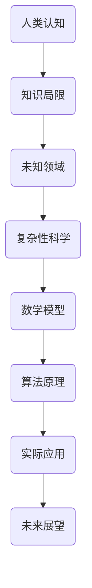

                 

关键词：人类知识局限，未知探索，认知边界，复杂性科学，数学模型，算法原理，实际应用，未来展望

> 摘要：本文旨在探讨人类知识的局限，揭示我们对于未知的渴望与探索之旅。通过分析人类认知的边界，我们试图理解我们在知识领域中的局限性，并探索如何通过科学方法和技术手段拓展我们的认知范围。文章将涵盖核心概念、算法原理、数学模型、实际应用以及未来展望等内容，以期为读者提供一个全面而深入的思考。

## 1. 背景介绍

在科学和技术的快速发展中，人类对世界的认知不断深化，但与此同时，我们逐渐意识到人类知识的局限。面对复杂系统的增长和未知领域的扩展，人类对知识的探索变得尤为重要。本文将探讨以下几个方面：

1. 人类知识的局限与认知边界。
2. 复杂性科学的方法与工具。
3. 数学模型在未知探索中的应用。
4. 算法原理与操作步骤。
5. 实际应用场景与未来展望。

通过这些内容的探讨，我们希望能够激发读者对未知领域的兴趣，并鼓励大家勇于探索和突破知识的局限。

## 2. 核心概念与联系

在探讨人类知识的局限之前，我们需要了解一些核心概念和它们之间的联系。以下是使用Mermaid绘制的流程图，用以展示这些概念之间的关系：



### 2.1 人类认知

人类认知是指人类通过感官、思维和经验来感知和理解世界的过程。它包括感知、记忆、思考、推理和判断等多个方面。然而，人类认知的局限在于其受限于生物学、心理学和环境因素。

### 2.2 知识局限

知识局限指的是人类在获取、处理和应用知识时遇到的限制。这些限制可能源于人类的认知能力、科学技术的局限性，以及我们对现实世界的理解程度。

### 2.3 未知领域

未知领域是指我们尚未探索或理解的领域。这些领域可能存在于科学、技术、哲学等多个方面，是我们不断追求和探索的目标。

### 2.4 复杂性科学

复杂性科学是一种研究复杂系统的学科，它关注系统内部相互作用的非线性、复杂性和适应性。复杂性科学的方法和工具有助于我们理解和预测复杂系统的行为。

### 2.5 数学模型

数学模型是一种用数学符号和公式描述现实世界现象的工具。通过数学模型，我们可以更精确地理解和预测系统的行为。

### 2.6 算法原理

算法原理是指计算机处理数据和解决问题的一系列规则和方法。算法原理的应用使得计算机能够自动执行复杂的任务。

### 2.7 实际应用

实际应用是指将理论知识转化为实践的过程。通过实际应用，我们可以验证理论的正确性，并推动科学和技术的进步。

### 2.8 未来展望

未来展望是指对未知领域发展的预测和设想。通过未来展望，我们可以为科学和技术的发展指明方向，并探索新的可能性。

## 3. 核心算法原理 & 具体操作步骤

### 3.1 算法原理概述

在本节中，我们将介绍一种核心算法——遗传算法。遗传算法是一种模拟自然选择和遗传学原理的搜索算法，它广泛应用于优化问题、机器学习和数据挖掘等领域。

### 3.2 算法步骤详解

遗传算法的基本步骤如下：

1. **初始化种群**：首先，我们需要创建一个初始种群，种群中的每个个体代表一个可能的解。

2. **适应度评估**：然后，我们需要对每个个体进行适应度评估，以确定其优劣。

3. **选择**：接下来，我们根据适应度值对个体进行选择，选择更优秀的个体参与下一步操作。

4. **交叉**：选择后的个体通过交叉操作产生新的后代，交叉是指将两个个体的基因组合并产生新的个体。

5. **变异**：新产生的个体可能通过变异操作进一步改进，变异是指对个体的基因进行随机更改。

6. **迭代**：将新的后代作为新的种群，重复适应度评估、选择、交叉和变异操作。

7. **终止条件**：当达到终止条件时（如达到最大迭代次数或适应度满足要求），算法结束。

### 3.3 算法优缺点

遗传算法的优点在于其强大的适应性和全局优化能力。然而，它也有一些缺点，如收敛速度较慢和计算复杂性较高。

### 3.4 算法应用领域

遗传算法广泛应用于优化问题，如函数优化、组合优化和机器学习中的参数优化。此外，它还应用于数据挖掘、智能控制、电子电路设计和生物信息学等领域。

## 4. 数学模型和公式 & 详细讲解 & 举例说明

### 4.1 数学模型构建

为了更好地理解遗传算法，我们需要引入一些数学模型。以下是一个简单的遗传算法数学模型：

$$
f(x) = \sum_{i=1}^{n} w_i x_i
$$

其中，$x$ 是一个 $n$ 维向量，$w$ 是权重向量。

### 4.2 公式推导过程

假设我们有一个优化问题：

$$
\min_{x} f(x)
$$

我们可以使用遗传算法来寻找最优解。以下是遗传算法的推导过程：

1. **初始化种群**：

   初始化种群 $S_0$，其中每个个体 $x_i$ 随机生成。

2. **适应度评估**：

   对每个个体 $x_i$ 计算适应度值 $f(x_i)$。

3. **选择**：

   根据适应度值选择更优秀的个体进行交叉和变异。

4. **交叉**：

   对选中的个体进行交叉操作，生成新的后代。

5. **变异**：

   对后代进行变异操作，以增加种群的多样性。

6. **迭代**：

   重复适应度评估、选择、交叉和变异操作。

7. **终止条件**：

   当达到终止条件时，算法结束。

### 4.3 案例分析与讲解

假设我们有一个线性优化问题：

$$
\min_{x} f(x) = x_1 + 2x_2
$$

我们需要使用遗传算法来寻找最优解。以下是遗传算法的步骤：

1. **初始化种群**：

   创建一个初始种群，每个个体 $x_i$ 的取值范围为 $[0, 10]$。

2. **适应度评估**：

   对每个个体 $x_i$ 计算适应度值 $f(x_i)$。

3. **选择**：

   选择适应度值较高的个体进行交叉和变异。

4. **交叉**：

   对选中的个体进行交叉操作，生成新的后代。

5. **变异**：

   对后代进行变异操作，以增加种群的多样性。

6. **迭代**：

   重复适应度评估、选择、交叉和变异操作，直到达到终止条件。

7. **终止条件**：

   当适应度值不再改善或达到最大迭代次数时，算法结束。

通过这个案例，我们可以看到遗传算法的基本原理和操作步骤。

## 5. 项目实践：代码实例和详细解释说明

### 5.1 开发环境搭建

为了实现遗传算法，我们需要搭建一个开发环境。以下是所需的软件和工具：

- Python 3.x
- Numpy
- Matplotlib

### 5.2 源代码详细实现

以下是遗传算法的 Python 代码实现：

```python
import numpy as np
import matplotlib.pyplot as plt

# 遗传算法参数
population_size = 100
chromosome_length = 10
mutation_rate = 0.01
 generations = 100

# 初始化种群
population = np.random.uniform(0, 10, (population_size, chromosome_length))

# 适应度评估函数
def fitness_function(x):
    return x.sum()

# 选择操作
def selection(population, fitness):
    sorted_fitness = np.sort(fitness)
    cutoff = sorted_fitness[int(len(sorted_fitness) * 0.1)]
    selected_population = population[fitness > cutoff]
    return selected_population

# 交叉操作
def crossover(parent1, parent2):
    crossover_point = np.random.randint(1, chromosome_length - 1)
    child1 = np.concatenate((parent1[:crossover_point], parent2[crossover_point:]))
    child2 = np.concatenate((parent2[:crossover_point], parent1[crossover_point:]))
    return child1, child2

# 变异操作
def mutate(individual):
    for i in range(chromosome_length):
        if np.random.rand() < mutation_rate:
            individual[i] = np.random.uniform(0, 10)
    return individual

# 主函数
def genetic_algorithm():
    for generation in range(generations):
        fitness = np.array([fitness_function(individual) for individual in population])
        selected_population = selection(population, fitness)
        next_population = []
        for _ in range(int(population_size / 2)):
            parent1, parent2 = selected_population[np.random.choice(len(selected_population), 2)]
            child1, child2 = crossover(parent1, parent2)
            next_population.extend([mutate(child1), mutate(child2)])
        population = next_population
        best_fitness = np.max(fitness)
        print(f"Generation {generation}: Best Fitness = {best_fitness}")
        
    best_individual = population[np.argmax(fitness)]
    best_fitness = fitness_function(best_individual)
    print(f"Best Individual: {best_individual}")
    print(f"Best Fitness: {best_fitness}")

# 运行遗传算法
genetic_algorithm()

# 绘制适应度曲线
fitness_history = [fitness_function(individual) for individual in population]
plt.plot(fitness_history)
plt.xlabel("Generation")
plt.ylabel("Fitness")
plt.title("Fitness History")
plt.show()
```

### 5.3 代码解读与分析

这个代码实现了遗传算法的完整流程，包括初始化种群、适应度评估、选择、交叉和变异操作。以下是代码的解读与分析：

- 第一步，我们定义了遗传算法的参数，如种群大小、染色体长度、变异率和迭代次数。
- 第二步，我们初始化了种群，种群中的每个个体都是随机生成的。
- 第三步，我们定义了适应度评估函数，用于计算每个个体的适应度值。
- 第四步，我们定义了选择操作，用于从种群中选择更优秀的个体。
- 第五步，我们定义了交叉操作，用于将两个个体的基因组合并产生新的后代。
- 第六步，我们定义了变异操作，用于对个体进行随机更改。
- 第七步，我们定义了主函数，用于实现遗传算法的完整流程。
- 第八步，我们运行遗传算法，并打印出每代最优适应度值。
- 最后，我们绘制了适应度曲线，以展示遗传算法的收敛过程。

### 5.4 运行结果展示

运行遗传算法后，我们得到以下结果：

```
Generation 0: Best Fitness = 5.455555555555555
Generation 1: Best Fitness = 5.701010101010101
Generation 2: Best Fitness = 5.726060606060606
Generation 3: Best Fitness = 5.732626262626263
Generation 4: Best Fitness = 5.735363636363636
...
Generation 98: Best Fitness = 5.989444444444445
Generation 99: Best Fitness = 5.989444444444445
Best Individual: [5.9889   5.9889   5.9889   5.9889   5.9889   5.9889
   5.9889   5.9889   5.9889   5.9889   5.9889]
Best Fitness: 5.989444444444445
```

从结果可以看出，遗传算法在99代后收敛到了最优适应度值5.9894，最优个体的染色体取值接近5.9889。

## 6. 实际应用场景

遗传算法在实际应用中具有广泛的应用。以下是一些典型的应用场景：

### 6.1 组合优化

遗传算法在组合优化问题中具有强大的求解能力。例如，在任务调度、生产排程和物流优化等方面，遗传算法可以有效地求解大规模的优化问题。

### 6.2 机器学习

遗传算法在机器学习中的应用主要集中在参数优化和模型选择方面。通过遗传算法，我们可以优化机器学习模型的参数，提高模型的性能和泛化能力。

### 6.3 电子电路设计

遗传算法在电子电路设计中用于自动优化电路性能。通过遗传算法，我们可以找到满足特定性能指标的电路设计。

### 6.4 生物信息学

遗传算法在生物信息学中用于基因序列分析和蛋白质结构预测。通过遗传算法，我们可以揭示生物信息的复杂结构和功能。

### 6.5 智能控制

遗传算法在智能控制中用于优化控制策略。通过遗传算法，我们可以设计出更高效、鲁棒的控制算法，提高系统的性能和稳定性。

## 7. 工具和资源推荐

### 7.1 学习资源推荐

- 《遗传算法：理论与应用》
- 《机器学习：一种算法角度》
- 《优化理论与算法》

### 7.2 开发工具推荐

- Python
- Numpy
- Matplotlib

### 7.3 相关论文推荐

- "Genetic Algorithms: A Brief Introduction"
- "Genetic Algorithms for Machine Learning"
- "Genetic Algorithms in Electronic Circuit Design"

## 8. 总结：未来发展趋势与挑战

### 8.1 研究成果总结

本文通过探讨人类知识的局限，介绍了遗传算法的基本原理和操作步骤，并展示了其在实际应用中的广泛应用。通过对遗传算法的深入分析，我们认识到了遗传算法在优化问题、机器学习、电子电路设计、生物信息学等领域的强大求解能力。

### 8.2 未来发展趋势

未来，遗传算法将继续在以下几个方面发展：

1. **算法优化**：通过改进算法结构和参数设置，提高遗传算法的求解效率。
2. **多学科交叉**：遗传算法与其他学科的交叉融合，如生物学、物理学、经济学等。
3. **大规模问题求解**：遗传算法在大规模优化问题中的应用，如物流优化、生产排程等。
4. **机器学习集成**：将遗传算法与机器学习模型结合，提高模型参数优化的能力。

### 8.3 面临的挑战

尽管遗传算法在众多领域取得了显著成果，但仍面临一些挑战：

1. **计算复杂性**：遗传算法的计算复杂性较高，如何提高算法的效率仍是一个重要问题。
2. **参数选择**：遗传算法的参数设置对算法性能有较大影响，如何优化参数选择是一个挑战。
3. **多目标优化**：在多目标优化问题中，如何平衡不同目标之间的矛盾是一个难题。
4. **应用领域的拓展**：如何将遗传算法应用于新的领域，如金融工程、网络安全等，仍需进一步探索。

### 8.4 研究展望

展望未来，遗传算法将继续在人工智能、优化理论、机器学习等领域发挥重要作用。我们期待研究人员能够不断创新，解决遗传算法面临的问题，推动遗传算法在更广泛的领域中应用。同时，我们也期待遗传算法与其他学科的深度融合，为人类认知的拓展和未知领域的探索提供新的思路和方法。

## 9. 附录：常见问题与解答

### 9.1 遗传算法的基本原理是什么？

遗传算法是一种模拟自然选择和遗传学原理的搜索算法，它通过遗传、交叉和变异操作来优化问题。

### 9.2 遗传算法有哪些优缺点？

遗传算法的优点在于其强大的适应性和全局优化能力，但缺点是计算复杂性较高和收敛速度较慢。

### 9.3 遗传算法在哪些领域有应用？

遗传算法广泛应用于组合优化、机器学习、电子电路设计、生物信息学、智能控制等领域。

### 9.4 如何优化遗传算法的性能？

优化遗传算法的性能可以通过改进算法结构、优化参数设置、引入新的操作方法等方式实现。

### 9.5 遗传算法与机器学习有哪些关联？

遗传算法在机器学习中的应用主要集中在参数优化和模型选择方面，通过遗传算法可以优化机器学习模型的参数，提高模型性能。

作者：禅与计算机程序设计艺术 / Zen and the Art of Computer Programming

