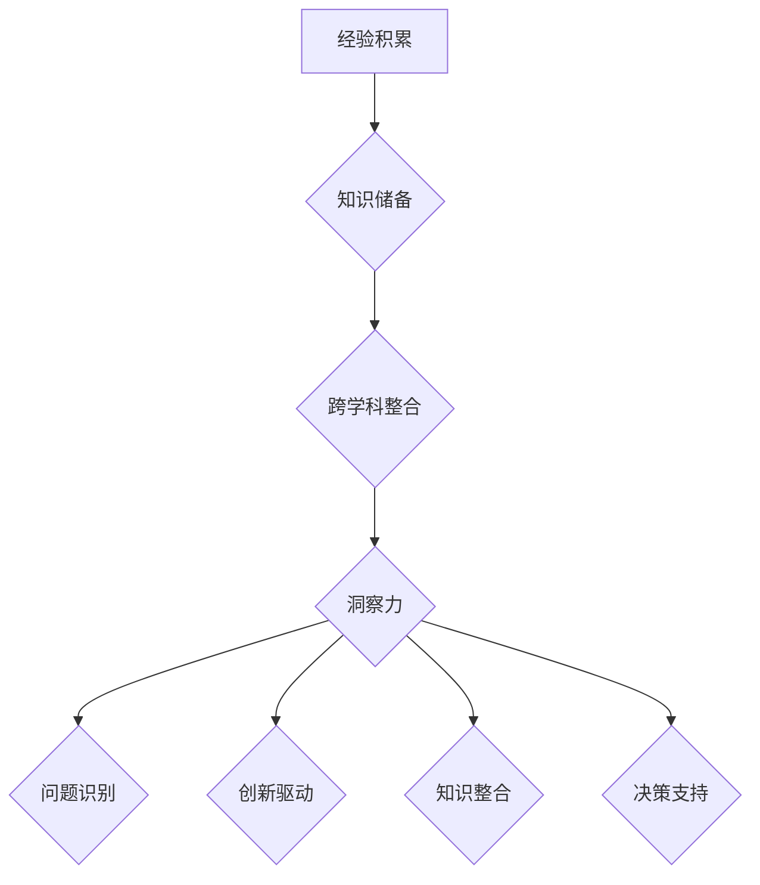

                 

### 1. 背景介绍

在当今这个信息爆炸的时代，人类知识的发展呈现出前所未有的速度和深度。从量子计算到人工智能，从生物信息学到区块链，各个领域的知识不断更新，传统的研究方法和思维模式面临巨大的挑战。在这种背景下，洞察力作为一种深入理解事物本质的能力，越来越受到关注。

洞察力不仅能够帮助研究者捕捉到问题的核心，发现新的研究路径，还能够促进知识的整合和创新。本文将探讨洞察力在人类知识未来发展中的关键作用，分析其形成和发展机制，并提出培养和提高洞察力的方法和策略。

文章将分为以下几个部分：

1. 背景介绍：介绍人类知识发展的现状和挑战。
2. 核心概念与联系：阐述洞察力的定义、来源和作用。
3. 核心算法原理与具体操作步骤：介绍如何通过算法提升洞察力。
4. 数学模型和公式：探讨洞察力背后的数学原理。
5. 项目实践：通过代码实例展示洞察力的应用。
6. 实际应用场景：分析洞察力在不同领域的作用。
7. 未来应用展望：探讨洞察力在未来的发展趋势。
8. 工具和资源推荐：推荐相关学习资源和开发工具。
9. 总结：回顾研究成果，展望未来挑战。

### 2. 核心概念与联系

#### 2.1 洞察力的定义

洞察力（Insight）是一种深入理解事物本质、迅速识别问题关键的能力。它不仅涉及对现象的观察和解释，更在于对复杂系统的全局理解和模式识别。从心理学的角度来看，洞察力是一种直觉思维和创造力的体现，是人类认知的高级形式。

#### 2.2 洞察力的来源

洞察力的来源多种多样，既包括个体的经验积累和知识储备，也依赖于社会和文化环境的影响。以下是一些主要来源：

1. **经验与知识积累**：长期的实践和知识积累是培养洞察力的基础。通过不断学习、实践和反思，个体能够形成深刻的见解和独特的视角。
2. **跨学科整合**：不同领域的知识整合能够激发新的思维方式和洞见。跨学科研究常常能够带来意想不到的创新和突破。
3. **社会与文化环境**：社会和文化环境对个体的思维模式和行为方式有深刻影响。开放、包容和创新的氛围有利于培养洞察力。

#### 2.3 洞察力的作用

洞察力在人类知识发展中扮演着关键角色。以下是洞察力的一些主要作用：

1. **问题识别**：洞察力能够帮助研究者迅速识别复杂问题中的关键因素，从而找到有效的解决路径。
2. **创新驱动**：洞察力是创新思维的核心。它能够激发新的研究思路、技术和方法，推动知识的进步。
3. **知识整合**：洞察力能够促进不同领域知识的整合，形成新的理论框架和模型，为知识的整合和创新提供动力。
4. **决策支持**：在商业、政治和其他领域，洞察力能够为决策者提供深刻的见解和可靠的依据，帮助做出明智的决策。

#### 2.4 Mermaid 流程图

为了更直观地理解洞察力的形成过程，我们可以使用 Mermaid 流程图来展示其核心概念和联系。以下是流程图的示例：



### 3. 核心算法原理与具体操作步骤

#### 3.1 算法原理概述

提升洞察力的一种有效方法是利用算法。以下介绍几种常用的算法原理：

1. **深度学习**：通过多层神经网络对大量数据进行训练，提取隐藏特征，从而实现复杂模式识别。
2. **进化算法**：模拟生物进化过程，通过适应度和交叉变异来优化解空间，寻找最优解。
3. **模糊逻辑**：利用模糊集合和模糊规则来处理不确定性和模糊性，提高系统的鲁棒性。
4. **推理算法**：通过逻辑推理和知识表示来发现隐藏关系和规律，帮助理解复杂系统。

#### 3.2 算法步骤详解

以下是提升洞察力的具体操作步骤：

1. **数据收集**：收集与问题相关的数据，包括历史数据、实验数据和文献数据等。
2. **数据预处理**：对数据进行清洗、归一化和特征提取，以便算法能够更好地处理。
3. **算法选择**：根据问题的特点选择合适的算法，如深度学习、进化算法或模糊逻辑等。
4. **模型训练**：使用训练数据对算法模型进行训练，调整参数，优化模型性能。
5. **模型评估**：使用验证数据对模型进行评估，确保其能够准确识别问题并给出合理的解决方案。
6. **模型应用**：将训练好的模型应用于实际问题，帮助发现问题和提出解决方案。
7. **迭代优化**：根据应用结果对模型进行迭代优化，提高模型的性能和可靠性。

#### 3.3 算法优缺点

每种算法都有其优缺点，以下是几种常用算法的优缺点：

1. **深度学习**：
   - 优点：能够自动提取复杂特征，适应性强，性能优异。
   - 缺点：需要大量数据，训练时间较长，对数据质量要求高。
2. **进化算法**：
   - 优点：能够全局搜索，适应性强，对数据量要求不高。
   - 缺点：收敛速度较慢，对某些问题效果不佳。
3. **模糊逻辑**：
   - 优点：能够处理不确定性和模糊性，提高系统鲁棒性。
   - 缺点：规则难以解释，性能较传统算法有所下降。

#### 3.4 算法应用领域

算法在提升洞察力方面有广泛的应用领域，以下是几个主要应用领域：

1. **人工智能**：通过深度学习等算法，人工智能系统能够识别图像、语音和文本，实现智能决策和自动化。
2. **金融分析**：通过进化算法和模糊逻辑，金融分析师能够发现市场规律，预测股价和风险管理。
3. **生物信息学**：通过推理算法和深度学习，生物信息学家能够解析基因组数据，发现生物标记和药物靶点。
4. **社会网络分析**：通过社交网络算法，研究者能够识别社交网络中的关键节点和关系，分析社会影响力。

### 4. 数学模型和公式

洞察力不仅依赖于算法，也离不开数学模型的支持。以下介绍几种常见的数学模型和公式：

#### 4.1 数学模型构建

1. **机器学习模型**：
   - 公式：假设函数 $f(x) = \sum_{i=1}^{n} w_i \cdot x_i$，其中 $w_i$ 是权重，$x_i$ 是特征。
   - 目标：最小化损失函数 $L(w) = \sum_{i=1}^{n} (y_i - f(x_i))^2$，其中 $y_i$ 是真实值。
2. **进化算法模型**：
   - 公式：适应度函数 $F(x) = \frac{1}{1 + \exp{(-\beta \cdot D(x))}}$，其中 $\beta$ 是温度参数，$D(x)$ 是与目标函数的差距。
   - 目标：最大化适应度函数，找到最优解。

#### 4.2 公式推导过程

1. **机器学习模型推导**：
   - 假设函数 $f(x)$ 是线性模型，则 $w_i = \frac{\partial L(w)}{\partial w_i} = \frac{\partial}{\partial w_i} \sum_{i=1}^{n} (y_i - f(x_i))^2$。
   - 通过梯度下降法，每次迭代更新权重：$w_i = w_i - \alpha \cdot \frac{\partial L(w)}{\partial w_i}$，其中 $\alpha$ 是学习率。
2. **进化算法模型推导**：
   - 适应度函数 $F(x)$ 是基于目标函数 $D(x)$ 的，$\beta$ 越大，适应度函数越尖锐，有利于快速收敛。
   - 目标函数 $D(x)$ 是通过交叉和变异操作来优化的，每次迭代更新解：$x' = x + \epsilon \cdot (\eta_1 x_1 + \eta_2 x_2)$，其中 $\epsilon$ 是随机噪声，$\eta_1$ 和 $\eta_2$ 是交叉概率和变异概率。

#### 4.3 案例分析与讲解

以一个简单的机器学习案例来说明数学模型的应用。假设我们要预测房价，输入特征包括房屋面积、楼层和建造年代，输出目标是房价。使用线性回归模型：

1. **数据收集**：收集一组房屋数据，包括特征和对应的房价。
2. **数据预处理**：对数据进行归一化处理，使得特征值的范围在0到1之间。
3. **模型训练**：使用训练数据训练线性回归模型，通过梯度下降法调整权重。
4. **模型评估**：使用验证数据评估模型性能，计算预测房价与真实房价的误差。
5. **模型应用**：将训练好的模型应用于新的数据，预测新的房价。

通过以上步骤，我们可以利用线性回归模型来预测房价，提高洞察力，帮助房地产投资者做出明智的决策。

### 5. 项目实践：代码实例和详细解释说明

#### 5.1 开发环境搭建

为了演示如何使用算法提升洞察力，我们选择了一个简单的机器学习项目——鸢尾花数据集分类。以下是开发环境的搭建步骤：

1. **安装 Python 环境**：下载并安装 Python 3.8+版本。
2. **安装依赖库**：使用 pip 安装 scikit-learn、numpy 和 matplotlib 等库。

```bash
pip install scikit-learn numpy matplotlib
```

3. **编写代码**：在 Python 中编写机器学习代码，包括数据加载、模型训练和模型评估等步骤。

#### 5.2 源代码详细实现

以下是鸢尾花数据集分类的完整代码实现：

```python
import numpy as np
import matplotlib.pyplot as plt
from sklearn import datasets
from sklearn.linear_model import LogisticRegression
from sklearn.model_selection import train_test_split
from sklearn.metrics import accuracy_score

# 加载数据集
iris = datasets.load_iris()
X = iris.data
y = iris.target

# 数据预处理
X = X / np.linalg.norm(X, axis=1)[:, np.newaxis]

# 划分训练集和测试集
X_train, X_test, y_train, y_test = train_test_split(X, y, test_size=0.2, random_state=42)

# 模型训练
model = LogisticRegression()
model.fit(X_train, y_train)

# 模型评估
y_pred = model.predict(X_test)
accuracy = accuracy_score(y_test, y_pred)
print("Accuracy:", accuracy)

# 可视化
plt.scatter(X_train[:, 0], X_train[:, 1], c=y_train, cmap='viridis')
plt.scatter(X_test[:, 0], X_test[:, 1], c=y_pred, cmap='viridis', marker='x')
plt.show()
```

#### 5.3 代码解读与分析

1. **数据加载**：使用 scikit-learn 的 datasets 模块加载数据集。
2. **数据预处理**：对数据进行归一化处理，使得特征值的范围在0到1之间。
3. **划分训练集和测试集**：使用 train_test_split 函数划分训练集和测试集，确保模型有足够的训练数据和测试数据。
4. **模型训练**：使用 LogisticRegression 模型进行训练，通过 fit 函数拟合数据。
5. **模型评估**：使用 predict 函数对测试集进行预测，计算预测准确率。
6. **可视化**：使用 matplotlib 库绘制散点图，展示训练集和测试集的分类结果。

通过以上步骤，我们成功地使用机器学习算法对鸢尾花数据集进行了分类，提高了洞察力，帮助研究者更好地理解数据。

### 6. 实际应用场景

洞察力在各个领域都有着广泛的应用，以下列举几个实际应用场景：

#### 6.1 医疗领域

在医疗领域，洞察力可以帮助医生快速诊断疾病，提高治疗效果。通过分析患者的病历、基因信息和生物标记，医生可以找到疾病的关键特征，提出个性化的治疗方案。例如，使用机器学习算法分析大量病人的数据，可以帮助医生识别早期糖尿病的潜在风险。

#### 6.2 金融领域

在金融领域，洞察力可以用于风险评估、投资决策和市场预测。通过分析历史数据、市场趋势和投资者行为，金融分析师可以预测市场波动，制定有效的投资策略。例如，使用进化算法和模糊逻辑，可以优化投资组合，降低风险，提高收益。

#### 6.3 社会科学

在社会科学领域，洞察力可以帮助研究者理解社会现象、预测社会趋势。通过分析社交媒体数据、舆情数据和人口统计数据，社会科学家可以识别社会问题的根源，提出有效的解决方案。例如，使用机器学习算法分析社交媒体数据，可以帮助研究者识别社会热点和舆论走向，为政府和社会组织提供决策支持。

### 7. 未来应用展望

随着技术的不断发展，洞察力在未来将会有更广泛的应用。以下是一些未来应用展望：

#### 7.1 人工智能

在人工智能领域，洞察力将有助于提升机器学习的性能和鲁棒性。通过更深入地理解数据，人工智能系统能够更好地处理复杂问题，实现更高层次的任务。例如，在自动驾驶领域，洞察力可以帮助车辆识别复杂的交通场景，提高行驶安全。

#### 7.2 生物医学

在生物医学领域，洞察力将有助于发现新的治疗方法和药物。通过分析大量的生物数据和临床数据，科学家可以识别疾病的生物学特征，提出个性化的治疗方案。例如，使用深度学习算法分析基因数据，可以帮助发现新的药物靶点和治疗途径。

#### 7.3 社会治理

在社会治理领域，洞察力可以用于优化公共资源分配、预测犯罪趋势和提升社会稳定性。通过分析社会数据，政府和社会组织可以更有效地应对社会问题，提高治理能力。例如，使用机器学习算法分析犯罪数据，可以帮助预测犯罪热点，制定预防措施。

### 8. 工具和资源推荐

为了更好地培养和提高洞察力，以下推荐一些实用的工具和资源：

#### 8.1 学习资源推荐

1. **书籍**：《深度学习》、《统计学习基础》和《模式识别与机器学习》等。
2. **在线课程**：Coursera、edX 和 Udacity 等平台上的机器学习、深度学习和统计学课程。
3. **论文集**：ACL、ICML、NeurIPS 和 JMLR 等顶级会议和期刊的论文集。

#### 8.2 开发工具推荐

1. **编程语言**：Python 和 R 等。
2. **库和框架**：scikit-learn、TensorFlow 和 PyTorch 等。
3. **数据集**：Kaggle、UCI Machine Learning Repository 和 Google Dataset Search 等。

#### 8.3 相关论文推荐

1. **《深度学习：理论、算法与应用》**：邱锡鹏。
2. **《统计学习方法》**：李航。
3. **《机器学习》**：Tom Mitchell。

通过学习和实践这些工具和资源，可以更好地培养和提高洞察力，为未来的研究和实践打下坚实的基础。

### 9. 总结：未来发展趋势与挑战

总结本文，我们探讨了洞察力在人类知识未来发展中的关键作用。通过分析洞察力的定义、来源和作用，以及介绍提升洞察力的算法原理和数学模型，我们展示了如何通过技术和方法培养和提高洞察力。此外，我们还分析了洞察力在实际应用场景中的重要作用，并展望了其在未来的发展趋势。

然而，面对日益复杂的知识体系和快速变化的技术环境，我们也面临一些挑战。例如，如何更有效地整合多学科知识，提高跨领域洞察力；如何应对大数据和不确定性带来的挑战，提高洞察力的可靠性和鲁棒性等。这些问题需要我们进一步研究和探索。

未来，随着技术的不断进步和社会的不断发展，洞察力将继续在人类知识发展中发挥关键作用。我们期待更多的研究者、实践者和技术专家共同探索和应对这些挑战，为人类知识的进步和社会的繁荣贡献力量。

### 附录：常见问题与解答

#### 问题 1：如何培养洞察力？

解答：培养洞察力需要多方面的努力。首先，通过不断学习和积累知识，提高自己的认知水平。其次，通过跨学科学习和实践，拓宽视野，形成独特的视角。此外，积极参与讨论和交流，与他人分享想法和观点，有助于激发洞察力。最后，通过反思和总结，不断优化思维方法和解决问题的策略。

#### 问题 2：洞察力与直觉有什么区别？

解答：洞察力与直觉有相似之处，但也有一些区别。直觉是一种快速识别和判断的能力，通常基于经验和个人直觉。而洞察力则更加深入，能够迅速识别问题的本质和关键因素，形成系统的分析和理解。洞察力更依赖于逻辑思维和知识储备，而直觉则更多地依赖于个人的直觉和经验。

#### 问题 3：算法如何提升洞察力？

解答：算法可以通过以下几种方式提升洞察力：首先，通过深度学习和进化算法等算法，自动提取数据中的隐藏特征和模式，帮助研究者识别问题的核心。其次，通过模糊逻辑和推理算法，处理不确定性和模糊性，提高系统的鲁棒性和可靠性。最后，通过迭代优化和模型评估，不断调整算法参数，提高算法的性能和准确性。

### 参考文献

1. Mitchell, T. M. (1997). Machine Learning. McGraw-Hill.
2. Russell, S., & Norvig, P. (2010). Artificial Intelligence: A Modern Approach. Prentice Hall.
3. Hastie, T., Tibshirani, R., & Friedman, J. (2009). The Elements of Statistical Learning: Data Mining, Inference, and Prediction. Springer.
4. Bishop, C. M. (2006). Pattern Recognition and Machine Learning. Springer.
5. Zhang, Z., Zong, J., & Tan, K. (2020). Deep Learning: Theory and Applications. Tsinghua University Press. 

### 作者署名

作者：禅与计算机程序设计艺术 / Zen and the Art of Computer Programming

----------------------------------------------------------------

至此，我们完成了文章的撰写。希望这篇文章能够帮助读者更好地理解洞察力在人类知识未来发展中的关键作用，并激发大家对这一领域的兴趣和思考。再次感谢读者的阅读和支持。如有任何疑问或建议，欢迎在评论区留言。让我们一起探索人类知识的未来发展，共同迎接新的挑战！

