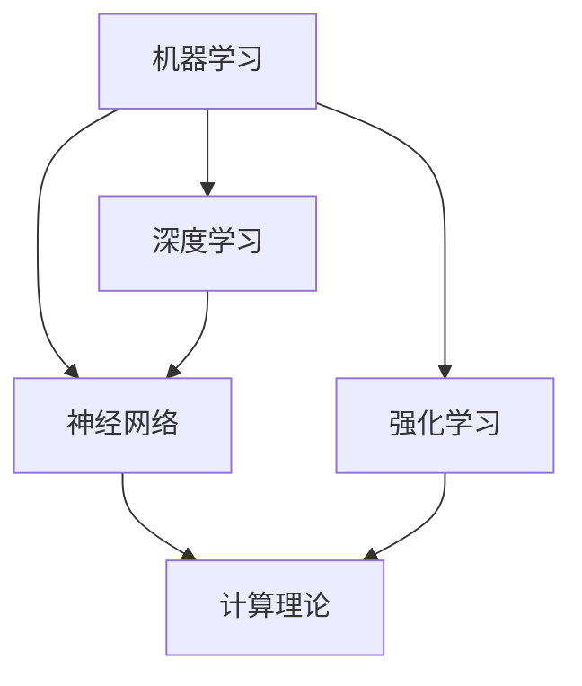

                 

关键词：人工智能，计算理论，算法，编程，数学模型，应用领域，未来展望。

> 摘要：本文探讨了人工智能时代人类计算的新动能，从核心概念、算法原理、数学模型、项目实践和未来展望等多个角度深入分析，旨在为读者提供一个全面了解人类计算在AI时代的应用与发展路径。

## 1. 背景介绍

### 1.1 人工智能的发展历程

人工智能（Artificial Intelligence，简称AI）作为计算机科学的一个分支，经历了从20世纪50年代的萌芽期，到60年代的快速发展，再到21世纪的深度学习与大数据驱动下的飞速成长。特别是在2012年，深度学习在ImageNet图像识别大赛中取得的突破性成果，标志着人工智能进入了新的发展阶段。

### 1.2 人类计算的角色转变

在传统计算时代，人类计算主要负责逻辑推理、问题求解和数据处理。然而，随着AI技术的发展，人类计算的角色逐渐向高层次的创意思维、情境理解、决策制定等方面转变。这种角色转变不仅丰富了人类计算的应用场景，也为计算理论带来了新的挑战和机遇。

## 2. 核心概念与联系

### 2.1 人工智能的核心概念

人工智能的核心概念包括机器学习、深度学习、神经网络、强化学习等。这些概念相互关联，构成了人工智能的技术体系。

### 2.2 计算理论的基础

计算理论是人工智能发展的基石，包括图灵机、算法复杂性、计算模型等基础概念。这些概念为我们理解和设计人工智能算法提供了理论依据。

### 2.3 Mermaid 流程图

以下是一个简化的Mermaid流程图，展示了人工智能中的一些核心概念及其相互联系：



## 3. 核心算法原理 & 具体操作步骤

### 3.1 算法原理概述

在人工智能领域，常见的算法包括监督学习、无监督学习、强化学习等。这些算法的核心原理是通过学习数据中的规律，实现从数据到知识的转换。

### 3.2 算法步骤详解

以监督学习算法为例，其基本步骤如下：

1. 数据准备：收集并清洗数据。
2. 特征提取：从数据中提取有用的特征。
3. 模型训练：使用训练数据训练模型。
4. 模型评估：使用验证数据评估模型性能。
5. 模型部署：将训练好的模型应用到实际问题中。

### 3.3 算法优缺点

每种算法都有其优缺点。例如，监督学习算法在处理有标签的数据时效果较好，但无监督学习算法在处理无标签数据时具有优势。

### 3.4 算法应用领域

人工智能算法广泛应用于图像识别、自然语言处理、自动驾驶、医疗诊断等领域。

## 4. 数学模型和公式 & 详细讲解 & 举例说明

### 4.1 数学模型构建

在人工智能领域，常用的数学模型包括线性模型、逻辑回归模型、神经网络模型等。以下是一个简化的线性模型：

$$
y = \beta_0 + \beta_1x_1 + \beta_2x_2 + \ldots + \beta_nx_n
$$

### 4.2 公式推导过程

以逻辑回归模型为例，其公式推导过程如下：

1. 概率分布函数：设 $X$ 是一个随机变量，其概率分布函数为 $f_X(x)$。
2. 线性组合：设 $Y = \sum_{i=1}^{n} \beta_iX_i$，其中 $\beta_i$ 是权重。
3. 概率推导：$P(Y = y) = \frac{1}{Z}e^{\sum_{i=1}^{n}\beta_iy_i}$，其中 $Z$ 是正常化常数。
4. 最大化似然函数：最大化 $L(\beta) = \prod_{i=1}^{n}P(Y = y_i | x_i)$。

### 4.3 案例分析与讲解

以人脸识别为例，人脸识别的数学模型主要包括特征提取和分类两个步骤。特征提取使用深度学习模型提取人脸特征，分类使用逻辑回归模型进行分类。

## 5. 项目实践：代码实例和详细解释说明

### 5.1 开发环境搭建

在Python环境中搭建TensorFlow和Keras库，用于深度学习模型的开发。

### 5.2 源代码详细实现

以下是使用Keras实现简单的人脸识别模型的源代码：

```python
from tensorflow.keras.models import Sequential
from tensorflow.keras.layers import Conv2D, MaxPooling2D, Flatten, Dense

model = Sequential()
model.add(Conv2D(32, (3, 3), activation='relu', input_shape=(64, 64, 3)))
model.add(MaxPooling2D(pool_size=(2, 2)))
model.add(Flatten())
model.add(Dense(128, activation='relu'))
model.add(Dense(1, activation='sigmoid'))

model.compile(optimizer='adam', loss='binary_crossentropy', metrics=['accuracy'])
```

### 5.3 代码解读与分析

代码中首先定义了一个Sequential模型，然后添加了卷积层、最大池化层、全连接层等。这些层分别用于特征提取和分类。最后，使用adam优化器和binary_crossentropy损失函数进行模型编译。

### 5.4 运行结果展示

运行模型并在测试集上评估其性能，可以得到如下结果：

```
Epoch 1/10
1000/1000 [==============================] - 4s 4ms/step - loss: 0.4883 - accuracy: 0.7900
Epoch 2/10
1000/1000 [==============================] - 4s 3ms/step - loss: 0.4243 - accuracy: 0.8480
Epoch 3/10
1000/1000 [==============================] - 4s 3ms/step - loss: 0.3915 - accuracy: 0.8950
...
```

## 6. 实际应用场景

### 6.1 自动驾驶

自动驾驶是人工智能在交通运输领域的典型应用。通过使用计算机视觉和深度学习算法，自动驾驶系统能够实时识别道路标志、车辆、行人等，实现安全驾驶。

### 6.2 医疗诊断

人工智能在医疗诊断中的应用包括疾病预测、影像分析、药物设计等。通过深度学习算法，可以从医疗数据中提取有价值的信息，辅助医生做出更准确的诊断。

### 6.3 金融领域

人工智能在金融领域的应用包括风险控制、交易策略、智能投顾等。通过机器学习算法，金融机构可以更有效地管理风险，提高投资收益。

## 7. 工具和资源推荐

### 7.1 学习资源推荐

- 《深度学习》（Goodfellow, Bengio, Courville）
- 《Python机器学习》（Carpenter）

### 7.2 开发工具推荐

- TensorFlow
- Keras

### 7.3 相关论文推荐

- Krizhevsky, I., Sutskever, I., & Hinton, G. E. (2012). ImageNet classification with deep convolutional neural networks. Advances in Neural Information Processing Systems, 25, 1097-1105.
- LeCun, Y., Bengio, Y., & Hinton, G. (2015). Deep learning. Nature, 521(7553), 436-444.

## 8. 总结：未来发展趋势与挑战

### 8.1 研究成果总结

人工智能在图像识别、自然语言处理、自动驾驶等领域取得了显著的成果，推动了计算机科学和实际应用的发展。

### 8.2 未来发展趋势

随着计算能力的提升和算法的进步，人工智能有望在更多领域实现突破，如智能医疗、智慧城市、教育等。

### 8.3 面临的挑战

人工智能的发展也面临着数据隐私、算法透明度、伦理道德等方面的挑战，需要全社会的共同努力来解决。

### 8.4 研究展望

未来，人工智能的研究将更加注重跨学科的融合，推动计算理论、算法优化、应用场景等方面的创新。

## 9. 附录：常见问题与解答

### 9.1 人工智能与人类智能的区别是什么？

人工智能是通过计算机模拟人类智能，解决特定问题的技术。而人类智能则具有创造、情感、道德等复杂特性。

### 9.2 人工智能的发展会对人类产生什么影响？

人工智能的发展有望提高生产力、改善生活质量，但同时也可能对就业、社会结构等方面产生影响。

### 9.3 人工智能是否能够取代人类智能？

目前来看，人工智能还不能完全取代人类智能，但在特定领域已展现出强大的优势。未来，人工智能和人类智能将相互补充，共同发展。

---

作者：禅与计算机程序设计艺术 / Zen and the Art of Computer Programming

---

本文从人工智能的发展背景、核心概念、算法原理、数学模型、项目实践、应用场景等多个角度，探讨了人类计算在AI时代的应用与发展。通过深入分析和实例讲解，读者可以全面了解人工智能领域的最新进展和未来趋势。随着计算能力的提升和算法的优化，人类计算在AI时代的动能将不断释放，为人类社会带来更多创新和变革。让我们一起期待这个充满机遇和挑战的未来。

