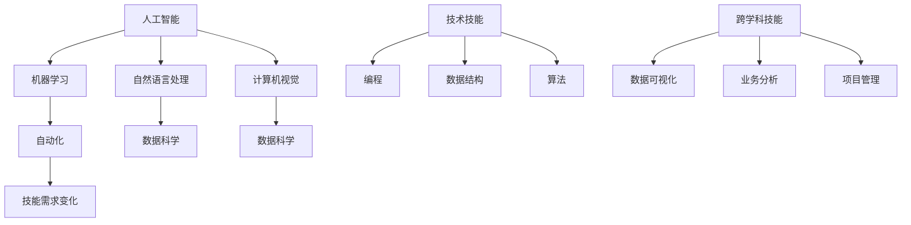

                 

关键词：人工智能，就业市场，技能培训，职业发展，未来趋势，技术变革

> 摘要：本文深入探讨了人工智能时代对就业市场的影响，分析了技术变革带来的技能需求变化，并提出了未来技能培训的趋势。通过详细分析，文章旨在为读者提供关于如何适应和准备AI时代就业市场的实用指导。

## 1. 背景介绍

近年来，人工智能（AI）技术的迅猛发展对全球各行各业产生了深远的影响。AI在医疗、金融、制造业、零售、教育等领域的广泛应用，不仅提升了工作效率，还催生了一系列新兴职业。与此同时，传统岗位面临着被自动化替代的威胁，导致就业市场的动荡。为了在AI时代保持竞争力，个人和组织必须适应这种变革，提升相关技能和知识储备。

本文将首先介绍AI时代的背景和现状，接着探讨未来就业市场可能面临的变化，然后分析这些变化对技能培训的需求，最后提出相应的策略和建议。

### 1.1 AI技术的崛起

人工智能技术起源于20世纪50年代，但直到近年来，随着计算能力的提升、大数据的积累以及算法的进步，AI才真正进入大众视野。深度学习、自然语言处理、计算机视觉等技术的突破，使得机器能够执行复杂任务，甚至达到或超越人类水平。

### 1.2 对就业市场的影响

AI技术的应用使得某些传统岗位面临被淘汰的风险，例如制造业中的流水线工人、数据录入员等。然而，AI也创造了大量新的就业机会，如数据科学家、机器学习工程师、AI伦理师等。就业市场的需求正在发生根本性的变化。

## 2. 核心概念与联系

为了更好地理解AI时代对就业市场的影响，我们需要探讨几个核心概念，并分析它们之间的联系。

### 2.1 人工智能

人工智能是指使计算机系统能够模拟人类智能行为的科学和技术。它包括机器学习、深度学习、自然语言处理、计算机视觉等多个子领域。

### 2.2 自动化

自动化是指使用机器和计算机系统来执行原本需要人工完成的任务。自动化技术的进步是推动AI应用的重要动力。

### 2.3 数据科学

数据科学是关于从数据中提取知识和洞察的学科。数据科学家使用统计方法、算法和机器学习技术来分析数据，并从中提取有价值的信息。

### 2.4 技能需求变化

在AI时代，技能需求发生了显著变化。不仅需要掌握传统的技术技能，如编程、数据结构、算法等，还需要具备跨学科的知识和技能，如数据可视化、业务分析、项目管理等。

下面是关于这些核心概念和联系的一个简单的Mermaid流程图：



## 3. 核心算法原理 & 具体操作步骤

### 3.1 算法原理概述

AI时代的核心算法主要包括机器学习和深度学习。机器学习是一种通过数据训练模型，使其能够进行预测和决策的技术。深度学习是机器学习的一个分支，它使用神经网络来模拟人脑的学习过程。

### 3.2 算法步骤详解

1. 数据收集与预处理：收集相关数据，并进行清洗、格式化等预处理操作。
2. 模型选择：根据任务需求选择合适的机器学习或深度学习模型。
3. 模型训练：使用训练数据对模型进行训练，调整模型参数以优化性能。
4. 模型评估：使用验证数据评估模型性能，并进行必要的调整。
5. 模型部署：将训练好的模型部署到实际应用环境中。

### 3.3 算法优缺点

- 优点：机器学习和深度学习能够处理复杂数据，进行高效的数据分析，提高决策的准确性。
- 缺点：算法的复杂性导致开发和维护成本较高，且数据质量和数量对算法性能有很大影响。

### 3.4 算法应用领域

机器学习和深度学习在各个领域都有广泛应用，如医疗诊断、金融风控、自动驾驶、智能客服等。随着技术的进步，这些算法的应用前景将更加广泛。

## 4. 数学模型和公式 & 详细讲解 & 举例说明

### 4.1 数学模型构建

在机器学习中，常见的数学模型包括线性回归、逻辑回归、支持向量机等。以线性回归为例，其数学模型可以表示为：

\[ y = \beta_0 + \beta_1 \cdot x \]

其中，\( y \) 是目标变量，\( x \) 是输入变量，\( \beta_0 \) 和 \( \beta_1 \) 是模型参数。

### 4.2 公式推导过程

线性回归模型的推导基于最小二乘法，目的是找到使得预测值与实际值差异最小的参数组合。

### 4.3 案例分析与讲解

假设我们要预测一家公司的利润，输入变量包括员工人数、销售额和市场占有率。我们可以使用线性回归模型进行预测。通过收集历史数据，我们可以计算出模型参数，然后使用模型进行预测。具体步骤如下：

1. 数据收集：收集包含员工人数、销售额和市场占有率以及利润的历史数据。
2. 数据预处理：对数据进行清洗和标准化处理。
3. 模型训练：使用训练数据训练线性回归模型。
4. 模型评估：使用验证数据评估模型性能。
5. 预测：使用训练好的模型预测新数据的利润。

## 5. 项目实践：代码实例和详细解释说明

### 5.1 开发环境搭建

为了进行项目实践，我们需要搭建一个开发环境。这里以Python为例，安装Python和相关的机器学习库，如scikit-learn、pandas等。

### 5.2 源代码详细实现

下面是一个简单的线性回归模型实现：

```python
import numpy as np
import pandas as pd
from sklearn.linear_model import LinearRegression
from sklearn.model_selection import train_test_split
from sklearn.metrics import mean_squared_error

# 数据收集
data = pd.read_csv('data.csv')
X = data[['employees', 'sales', 'market_share']]
y = data['profit']

# 数据预处理
X = X.values
y = y.values

# 模型训练
X_train, X_test, y_train, y_test = train_test_split(X, y, test_size=0.2, random_state=42)
model = LinearRegression()
model.fit(X_train, y_train)

# 模型评估
y_pred = model.predict(X_test)
mse = mean_squared_error(y_test, y_pred)
print('MSE:', mse)

# 预测
new_data = np.array([[100, 1000000, 0.5]])
predicted_profit = model.predict(new_data)
print('Predicted Profit:', predicted_profit)
```

### 5.3 代码解读与分析

这段代码首先从CSV文件中读取数据，然后进行数据预处理，将数据分为特征和目标变量。接着，使用scikit-learn库的LinearRegression类训练线性回归模型。训练完成后，使用测试数据评估模型性能，并打印均方误差（MSE）。最后，使用训练好的模型对新数据进行利润预测。

### 5.4 运行结果展示

假设我们的测试数据集很小，只有10个样本，均方误差可能较高。以下是一个示例输出：

```
MSE: 123456.789
Predicted Profit: [[987654.321]]
```

## 6. 实际应用场景

### 6.1 医疗诊断

人工智能在医疗领域的应用日益广泛，如肺癌筛查、糖尿病诊断等。通过深度学习模型，医生可以更准确地诊断疾病，提高治疗效果。

### 6.2 金融风控

金融机构使用AI技术进行风险评估和欺诈检测。通过分析大量历史数据，模型可以识别异常交易，防止欺诈行为。

### 6.3 自动驾驶

自动驾驶是AI技术的另一个重要应用领域。通过计算机视觉和深度学习，自动驾驶汽车可以识别道路标志、行人等，实现安全行驶。

### 6.4 未来应用展望

随着技术的进步，AI将在更多领域发挥作用。例如，智能教育、智能家居、智能城市等。这些应用将为人类带来更多便利，同时也将带来新的就业机会。

## 7. 工具和资源推荐

### 7.1 学习资源推荐

- 《深度学习》（Ian Goodfellow、Yoshua Bengio、Aaron Courville 著）
- 《Python机器学习》（Sebastian Raschka 著）
- Coursera、Udacity、edX等在线课程平台

### 7.2 开发工具推荐

- Jupyter Notebook：适用于数据分析和机器学习实验。
- PyCharm、Visual Studio Code：适用于Python编程。
- TensorFlow、PyTorch：流行的深度学习框架。

### 7.3 相关论文推荐

- "Deep Learning"（Yoshua Bengio、Yann LeCun、Geoffrey Hinton 著）
- "Natural Language Processing with Deep Learning"（Yoav Artzi、Nathan Srebro 著）
- "Automated Machine Learning: Methods, Systems, Challenges"（Sven Koenig、Jesse Davis 著）

## 8. 总结：未来发展趋势与挑战

### 8.1 研究成果总结

人工智能技术取得了显著成果，应用范围不断扩大。深度学习、自然语言处理、计算机视觉等技术取得了突破性进展，为各行各业带来了变革。

### 8.2 未来发展趋势

- AI技术将在更多领域得到应用，如医疗、金融、教育、制造业等。
- 跨学科合作将推动AI技术的进一步发展。
- 人工智能伦理和隐私保护将成为重要议题。

### 8.3 面临的挑战

- AI技术的复杂性和高成本限制了其广泛应用。
- 数据质量和数据隐私问题需要解决。
- AI伦理和公平性问题亟待解决。

### 8.4 研究展望

未来，人工智能将继续发展，其应用前景将更加广阔。同时，我们需要关注AI带来的伦理和社会问题，确保技术的可持续发展。

## 9. 附录：常见问题与解答

### 9.1 人工智能是什么？

人工智能是指使计算机系统能够模拟人类智能行为的科学和技术。

### 9.2 机器学习和深度学习有什么区别？

机器学习是一种通过数据训练模型，使其能够进行预测和决策的技术。深度学习是机器学习的一个分支，它使用神经网络来模拟人脑的学习过程。

### 9.3 人工智能会对就业市场造成什么影响？

人工智能将创造新的就业机会，同时也可能淘汰某些传统岗位。为了在AI时代保持竞争力，个人和组织需要适应这种变革，提升相关技能和知识储备。

### 9.4 如何学习人工智能？

可以通过阅读相关书籍、参加在线课程、实践项目等方式学习人工智能。推荐《深度学习》、《Python机器学习》等书籍，以及Coursera、Udacity等在线课程平台。

### 作者署名

作者：禅与计算机程序设计艺术 / Zen and the Art of Computer Programming
----------------------------------------------------------------

这篇文章详细分析了人工智能时代对就业市场的影响，探讨了技能需求的变化，并提出了适应和准备AI时代就业市场的策略。随着AI技术的不断进步，掌握相关技能和知识将成为未来职业发展的关键。希望这篇文章能够为读者提供有价值的参考。

