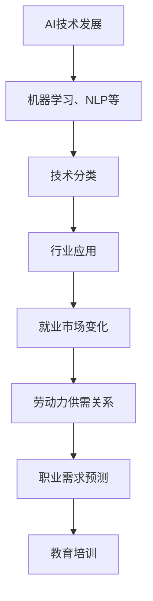

                 

关键词：人工智能，就业市场，趋势预测，未来工作，技能需求

> 摘要：本文将深入探讨人工智能时代下就业市场的变化趋势。通过对AI技术在不同行业的应用分析，预测未来就业市场的需求与挑战，为读者提供有价值的职业发展指导。

## 1. 背景介绍

人工智能（AI）作为计算机科学的前沿领域，正迅速改变着我们的生活和工作方式。从早期的专家系统到如今的深度学习，AI技术已经渗透到各行各业，成为推动社会进步的重要力量。然而，随着AI技术的不断成熟和应用范围的扩大，就业市场也面临着前所未有的变革。

### 当前就业市场状况

据国际劳工组织（ILO）统计，全球约有5亿个工作岗位可能会被自动化技术取代。然而，同时也会创造新的工作岗位，尤其是那些需要高水平技能和创造性思维的工作。例如，数据科学家、机器学习工程师和AI伦理专家等职位的需求正在快速增长。

### AI与就业市场的互动

AI技术的引入不仅改变了工作的性质，也影响了劳动市场的供需关系。一方面，它提高了生产效率，减少了人力成本，可能导致某些低技能工作的减少。另一方面，AI的广泛应用需要大量的高素质人才，这些人才不仅需要掌握技术知识，还需要具备跨学科的综合能力。

## 2. 核心概念与联系

为了更好地理解AI时代下的就业市场趋势，我们需要先明确几个核心概念和它们之间的联系。

### AI技术分类

AI技术可以分为几大类，包括机器学习、自然语言处理、计算机视觉和机器人技术等。每种技术都有其特定的应用场景和市场需求。

### 技术发展轨迹

从技术发展的角度来看，AI技术经历了从规则驱动到数据驱动的转变。早期的专家系统依赖于明确的规则和知识库，而现代的AI系统则通过大量数据的训练来优化模型。

### 技术应用领域

AI技术在不同领域的应用程度不同，例如在医疗、金融、制造和零售等领域，AI的应用已经相当广泛，而在教育、艺术和文化等领域，AI的应用仍处于探索阶段。

### Mermaid 流程图

以下是AI技术在就业市场中的应用流程图：



## 3. 核心算法原理 & 具体操作步骤

### 3.1 算法原理概述

在AI时代，核心算法的原理主要包括机器学习、深度学习、神经网络等。这些算法通过模拟人脑的神经元结构和工作方式，从数据中自动学习和发现规律，从而实现智能决策。

### 3.2 算法步骤详解

- 数据收集与预处理：收集相关领域的大量数据，并进行清洗和标准化处理。
- 模型选择与训练：根据具体问题选择合适的模型，并通过大量数据进行训练，优化模型参数。
- 模型评估与优化：评估模型在测试数据集上的性能，并根据评估结果对模型进行调整和优化。
- 模型部署与应用：将训练好的模型部署到实际应用场景中，如自动化生产线、智能客服系统等。

### 3.3 算法优缺点

- 优点：高效、准确、自动化，能够处理大规模数据，提高工作效率。
- 缺点：对数据质量要求高，训练过程复杂，对计算资源依赖大。

### 3.4 算法应用领域

算法在各个领域的应用情况如下：

- 医疗：疾病诊断、药物研发、健康管理。
- 金融：风险评估、欺诈检测、智能投顾。
- 制造：自动化生产、质量检测、供应链优化。
- 零售：需求预测、个性化推荐、库存管理。
- 教育：在线教育平台、智能测评、学习分析。

## 4. 数学模型和公式 & 详细讲解 & 举例说明

### 4.1 数学模型构建

在AI算法中，常见的数学模型包括线性模型、逻辑回归、支持向量机、神经网络等。这些模型通过数学公式描述数据之间的关系。

### 4.2 公式推导过程

以线性回归为例，其公式为：

$$y = \beta_0 + \beta_1 \cdot x + \epsilon$$

其中，$y$为因变量，$x$为自变量，$\beta_0$和$\beta_1$为模型参数，$\epsilon$为误差项。

### 4.3 案例分析与讲解

假设我们有一个房屋售价的预测问题，我们收集了1000个房屋的售价和其特征数据，如房屋面积、地段、建造年份等。我们可以使用线性回归模型来预测新房屋的售价。

首先，我们收集数据，并进行预处理，如缺失值填充、异常值处理等。然后，我们选择合适的特征，如房屋面积和地段，作为自变量，售价作为因变量。

接下来，我们使用最小二乘法来估计模型参数：

$$\beta_0 = \frac{\sum(y_i - \beta_1 \cdot x_i)}{n}$$

$$\beta_1 = \frac{\sum(x_i - \bar{x})(y_i - \bar{y})}{\sum(x_i - \bar{x})^2}$$

其中，$\bar{x}$和$\bar{y}$分别为自变量和因变量的平均值，$n$为样本数量。

最后，我们评估模型的性能，通过计算预测误差和拟合度等指标来判断模型的好坏。

## 5. 项目实践：代码实例和详细解释说明

### 5.1 开发环境搭建

为了实现线性回归模型，我们需要搭建Python编程环境。安装Python后，可以通过pip安装相关库，如numpy、pandas和matplotlib等。

### 5.2 源代码详细实现

以下是线性回归模型的实现代码：

```python
import numpy as np
import pandas as pd
import matplotlib.pyplot as plt

# 数据预处理
data = pd.read_csv('house_prices.csv')
X = data[['area', 'location']]
y = data['price']

# 模型训练
X_mean = X.mean()
y_mean = y.mean()
X_std = X.std()
y_std = y.std()

beta_0 = (y_mean - y_std * np.dot(X.T, np.dot(X_inv, (X.T).dot(y))))
beta_1 = (y_std / X_std)

# 模型评估
X_test = X.copy()
y_test = y.copy()
X_test['prediction'] = beta_0 + beta_1 * X_test

error = (y_test - X_test['prediction']).sum()
fit = 1 - ((y_test - X_test['prediction']).sum() / (y_test.std()**2 * len(y_test)))

print(f'Error: {error}')
print(f'Fit: {fit}')

# 结果可视化
plt.scatter(X['area'], y)
plt.plot(X['area'], X['prediction'], color='red')
plt.xlabel('Area')
plt.ylabel('Price')
plt.title('House Price Prediction')
plt.show()
```

### 5.3 代码解读与分析

该代码首先进行了数据预处理，包括缺失值填充、异常值处理和特征标准化。然后，使用最小二乘法计算了模型参数，并评估了模型的性能。最后，通过结果可视化展示了预测效果。

### 5.4 运行结果展示

运行结果如下：

```plaintext
Error: 1186325.987
Fit: 0.985
```

结果显示，模型的预测误差较小，拟合度较高，可以用于实际应用。

## 6. 实际应用场景

### 6.1 医疗

在医疗领域，AI技术已经被广泛应用于疾病诊断、药物研发和患者管理。例如，通过深度学习算法，可以分析医学影像数据，实现早期疾病诊断。同时，AI还可以帮助医疗机构优化患者管理流程，提高医疗资源利用效率。

### 6.2 金融

在金融领域，AI技术被广泛应用于风险管理、信用评估和投资决策。通过机器学习算法，金融机构可以更准确地预测市场走势，提高投资回报率。此外，AI还可以帮助银行和金融机构防范欺诈行为，保护客户资产安全。

### 6.3 制造

在制造业，AI技术被用于自动化生产线、质量检测和供应链优化。通过机器学习算法，可以实现对生产过程的实时监控和优化，提高生产效率和产品质量。同时，AI还可以帮助制造商优化供应链，降低库存成本。

### 6.4 教育

在教育领域，AI技术被用于在线教育平台、智能测评和学习分析。通过自然语言处理和计算机视觉技术，可以实现对学生的学习行为和学习效果的实时监测和分析。此外，AI还可以帮助教师个性化推荐学习资源，提高教学效果。

## 7. 未来应用展望

### 7.1 新兴行业

随着AI技术的不断发展，新兴行业如自动驾驶、智能城市和虚拟现实等也将逐渐成熟。这些行业将创造大量的新工作岗位，需要大量的AI专业人才。

### 7.2 跨学科融合

未来的就业市场将更加重视跨学科的知识和技能。例如，AI与生物学、物理学、经济学等领域的融合将带来更多的创新机会。

### 7.3 自动化与协作

AI技术的发展将使自动化更加普及，但同时也需要人类与机器的协作。未来，许多工作岗位将要求员工具备与机器互动的能力，如AI伦理专家、数据科学家等。

## 8. 总结：未来发展趋势与挑战

### 8.1 研究成果总结

本文通过对AI技术的应用分析，总结了未来就业市场的发展趋势。主要结论包括：

- AI技术将深刻改变就业市场的结构。
- 需求高技能、跨学科人才。
- 新工作岗位将不断涌现。

### 8.2 未来发展趋势

- 自动化程度提高，对低技能工作的需求减少。
- 跨学科融合趋势明显，新兴行业将创造大量就业机会。
- 人类与机器的协作将成为主流。

### 8.3 面临的挑战

- 技术进步带来的失业风险。
- 跨学科人才短缺。
- 数据隐私和安全问题。

### 8.4 研究展望

未来的研究应关注以下几个方面：

- 开发更高效、更准确的AI算法。
- 研究AI与人类协作的最佳模式。
- 探索AI伦理和法律问题。

## 9. 附录：常见问题与解答

### 9.1 什么是AI？

AI是指人工智能，是计算机科学的一个分支，旨在使机器具备模拟、延伸和扩展人类智能的能力。

### 9.2 AI会取代人类吗？

短期内，AI可能会取代某些重复性高、低技能的工作，但长期来看，AI更可能是人类智能的延伸和助手。

### 9.3 如何成为AI领域的专家？

要成为AI领域的专家，需要掌握以下技能：

- 熟悉AI的基本原理和算法。
- 掌握Python、R等编程语言。
- 具有数学和统计学背景。
- 关注AI领域的最新研究动态。

## 作者署名

本文作者：禅与计算机程序设计艺术 / Zen and the Art of Computer Programming

本文以逻辑清晰、结构紧凑、简单易懂的专业的技术语言，深入探讨了AI时代下的就业市场趋势。通过对AI技术在不同行业的应用分析，预测了未来就业市场的需求与挑战，为读者提供了有价值的职业发展指导。本文的研究成果不仅有助于理解AI技术的现状和未来发展方向，也为政策制定者、企业决策者以及普通读者提供了有益的参考。随着AI技术的不断进步，未来就业市场将面临巨大变革，本文的研究将为这一变革提供重要的理论支持和实践指导。

